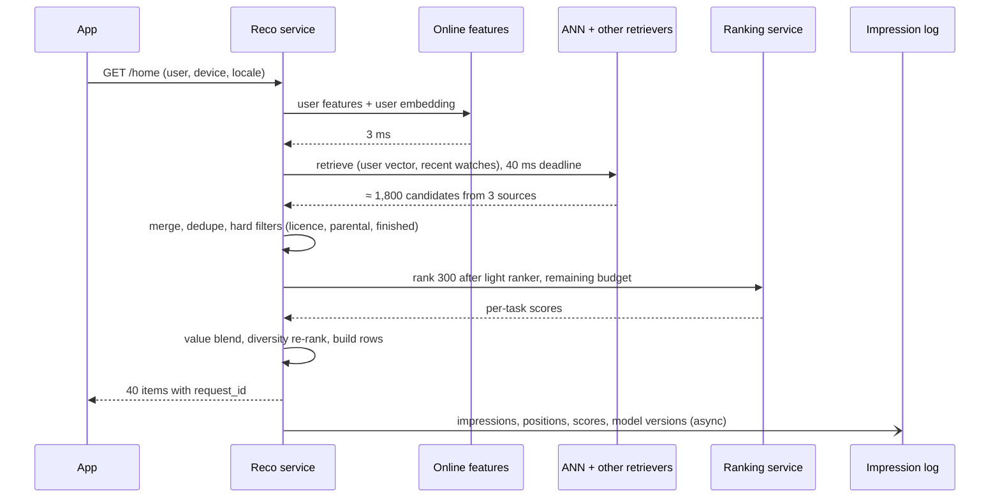

# System Design: Recommendation Systems

A recommendation system (RecSys) chooses which items to show a user from a catalogue far
too large to browse: videos on a streaming app, products in a shop, posts in a feed. It is
the most common ML system design interview question. This chapter works one problem the
way a strong interview answer does: clarify requirements, estimate scale, turn the product
goal into an ML objective and labels, then design the retrieval → ranking → re-ranking
funnel, features, training and serving, evaluation offline and online, monitoring, and
the trade-offs and follow-ups an interviewer will push on. The infrastructure side of a
feed cascade (latency budgets, degradation ladder, snapshots) is worked in full in
[Ranked Home Feed](../SystemDesign/solutions/032_ranked_home_feed_solution.md); this chapter concentrates on
the ML decisions.

## Foundations — How does a recommender decide what to show?

### The problem

A streaming service has 50 million videos and a home screen with room for about 40. For
each user, each time they open the app, it must pick and order those 40. Humans cannot
curate per person, and simple rules ("most popular") show everyone the same things. A
recommender learns from behaviour (what people watched, finished, liked, skipped) to
predict what *this* user will value *now*.

### The three ideas every recommender uses

1. **Collaborative filtering.** "People who watched what you watched also watched X."
   It needs no understanding of the content, only the interaction matrix of users ×
   items. Classic form: **matrix factorisation**, which learns a vector (an *embedding*)
   per user and per item so that their dot product predicts interaction.
2. **Content-based filtering.** "You watch cooking shows; here is another cooking show."
   It uses item attributes (genre, text, audio, image embeddings) and works for brand-new
   items with no interactions.
3. **A funnel.** Scoring 50 million items with a big model for every request is
   impossible (50M × even 10 µs = 500 CPU-seconds per request). So a cheap stage
   **retrieves** a few thousand plausible candidates, a more expensive stage **ranks** a
   few hundred, and a final stage **re-ranks** for business rules and diversity.

```arch
%% caption: The recommendation funnel: each stage sees fewer items and spends more per item, so the heavy model only ever scores a few hundred candidates.
grid 150x100
node user "Home request" at 1,0 icon=mobile sub="user, context"
node ann "Two-tower ANN" at 0,1 icon=vector sub="1,000"
node cf "Item-to-item" at 1,1 icon=link sub="500, co-watch"
node pop "Trending + fresh" at 2,1 icon=idea sub="300"
node merge "Merge + filter" at 1,2 icon=filter sub="≈ 1,500 left"
node light "Light ranker" at 1,3 icon=sort sub="1,500 → 300"
node heavy "Heavy ranker" at 1,4 icon=model sub="multi-task, 300 → 100"
node rerank "Re-rank" at 1,5 icon=check sub="diversity, rules → 40"
user:B -> ann:T
user:B -> cf:T
user:B -> pop:T
ann -> merge
cf -> merge
pop -> merge
merge -> light -> heavy -> rerank
```

### Vocabulary

| Term | Meaning |
|---|---|
| **Implicit feedback** | Signals from behaviour (plays, watch time, skips); plentiful but noisy |
| **Explicit feedback** | Ratings, likes, "not interested"; clearer but rare |
| **Impression** | An item was shown to a user; the denominator for every rate |
| **Embedding** | A learned vector for a user or an item; similar things are close |
| **Two-tower model** | Separate networks embed the user and the item; the score is their dot product, so item vectors can be precomputed and searched with ANN |
| **ANN** | Approximate nearest-neighbour search (HNSW, IVF-PQ, ScaNN) over millions of vectors in milliseconds |
| **Cold start** | A new user or new item with no interaction history |
| **Position bias** | Items higher on the screen get more clicks regardless of relevance |
| **Feedback loop** | The model trains on data its own choices produced |

## 1. Clarify requirements

State assumptions and confirm them. For this chapter: **"Design the home-page
recommendations for a video streaming service."**

**Functional**

- Return a personalised, ordered list of about 40 videos (in rows) when the home page
  loads, plus "because you watched X" rows.
- Respect hard filters: region licensing, parental controls, already-finished titles,
  blocked content.
- New videos should be recommendable within an hour of publication; a new user should get
  something sensible on the first screen.

**Non-functional**

- Latency: p99 ≤ 200 ms server-side for the ranked list (assumed).
- Availability: the home page must always render something; degrade to cached or
  popular lists rather than fail.
- Freshness: reflect what the user watched in this session.
- Scale: below.

**Product objective (ask about this; it shapes everything).** Not "clicks". Clicks reward
clickbait thumbnails. A better objective is **long-term satisfaction**, approximated by
**watch time** plus explicit signals (likes, "not interested"), with guardrails on
diversity and on complaints. Say which metric the business actually optimises; the answer
changes the labels.

## 2. Estimate scale

Assumptions (ours, for the estimate): 200M daily active users, 5 home loads per user per
day, peak 3× average, 50M recommendable videos, 128-dim embeddings, 20 impressions viewed
per load.

| Quantity | Arithmetic | Result | So we need |
|---|---|---|---|
| Home loads | 200M × 5 ÷ 86,400 ≈ 11.6k/s, × 3 | ≈ 35k/s peak | Every stage sized from this |
| ANN index | 50M × 128 × 2 B (fp16) | ≈ 12.8 GB of vectors, ≈ 20–25 GB with HNSW graph overhead (≈) | Fits in RAM on one node; shard or replicate for QPS |
| Heavy ranker work | 35k/s × 300 candidates | ≈ 10.5M item scores/s | Batched GPU or many CPU cores; the candidate count is the cost dial |
| Impression log | 200M × 5 × 20 = 2×10¹⁰/day × ≈ 150 B | ≈ 3 TB/day | Always log impressions with position and model version |
| Training examples | 2×10¹⁰/day, mostly negatives | Down-sample negatives (e.g. keep 10%) and re-weight | Daily training on ≈ billions of rows |
| Online features per request | 1 user row + 300 item rows | ≈ 300 lookups | Cache item features in the ranker; one user lookup |

The numbers justify the funnel and the caches; say them out loud.

## 3. Frame it as an ML problem

| Stage | ML task | Label | Model |
|---|---|---|---|
| Retrieval | Find items the user might engage with | Positive: watched ≥ 50% or ≥ 5 min (assumed thresholds); negatives: sampled from the corpus | Two-tower network, item-to-item co-occurrence, matrix factorisation |
| Ranking | Predict several outcomes for (user, item, context) | p(click), p(watch ≥ 50% given click), expected watch time, p(like), p(dislike / "not interested") | Multi-task deep network (or GBDT at smaller scale) |
| Re-ranking | Pick a slate that is good as a whole | Rules and policy | MMR-style diversity, business constraints |

Why **multi-task** ranking: one objective (clicks) is gameable; several predicted outcomes
blended by a **value function** let the product tune behaviour without retraining:

`value = w_click · p(click) + w_watch · E[watch time] + w_like · p(like) − w_dislike · p(dislike)`

The weights are **product policy set by experiments**, not learned. YouTube's "Recommending
What Video to Watch Next" (Zhao et al., RecSys 2019) describes this shape: a multi-gate
mixture-of-experts (MMoE) ranker predicting engagement and satisfaction objectives, plus a
shallow tower that models position bias.

## 4. High-level architecture

```arch
%% caption: Online serving reads embeddings, features and models that offline pipelines produce; the impression log closes the loop into the next training run.
grid 150x105
group online "Online (per request)" color=blue icon=server
node fs "Online features" at 0,0 in online icon=kv sub="user + item"
node api "Reco service" at 1,0 in online icon=api sub="orchestrates, deadline"
node ann "ANN index" at 0,1 in online icon=vector sub="item embeddings"
node rank "Ranking service" at 1,1 in online icon=model sub="batched GPU"
node log "Impression log" at 2,1 in online icon=logs sub="position, version"
group offline "Offline / nearline" color=slate icon=workflow
node emb "Embeddings + index" at 0,2 in offline icon=layers sub="hourly build"
node train "Training" at 1,2 in offline icon=cpu sub="daily + incremental"
node join "Label join" at 2,2 in offline icon=link sub="impressions + watches"
api -> fs
api -> ann
api -> rank
api -> log
log -> join -> train
train -> emb
train ..> rank : "new model"
emb ..> ann : "new index"
```



## 5. Candidate generation

Goal: high **recall** in a few tens of milliseconds. Precision is the ranker's job. Run
several sources in parallel, each with a quota and a deadline, and merge.

| Source | How | Strength | Weakness |
|---|---|---|---|
| **Two-tower ANN** | User tower embeds user history and context; item vectors precomputed; ANN top-K | Personalised discovery across the whole catalogue | Needs history; biased toward popular items without correction |
| **Item-to-item** | For each of the user's last N watches, precomputed "co-watched" neighbours | Cheap, explainable ("because you watched X") | Narrow; stays near what the user already knows |
| **Trending / fresh** | Popular in the user's region today; new releases with an exposure cap | Cold start, freshness, fallback | Not personal |
| **Continue watching / subscriptions** | Rules | Very high precision | Not discovery |

### Training the two-tower model

- **Positives:** (user, item) pairs with a qualifying watch.
- **Negatives:** you cannot label 50M non-watched items per user. Use **in-batch
  negatives** (the other positives in the training batch serve as negatives) plus some
  random corpus negatives. In-batch negatives over-penalise popular items (they appear in
  many batches), so apply a **log-Q correction**, subtracting the log of each item's
  sampling probability from its logit (Yi et al., "Sampling-Bias-Corrected Neural
  Modeling for Large Corpus Item Recommendations", RecSys 2019).
- **Loss:** softmax (sampled) cross-entropy over the batch.
- **Serving:** recompute item embeddings and rebuild or upsert the ANN index hourly; new
  items get content-based embeddings from the item tower (it uses metadata, text and
  thumbnails), so they are retrievable before anyone has watched them.

**Merging.** Scores from different sources are not comparable (a cosine similarity vs a
co-watch count), so don't sort the union by them. Give each source a quota, dedupe, apply
hard filters once, and let the ranker decide, with the source as a feature.

## 6. Ranking

**Light ranker (optional).** A small model (a GBDT or small MLP, often distilled from the
heavy ranker) cuts ≈ 1,500 candidates to ≈ 300 cheaply. Monitor its recall: the share of
the heavy ranker's top 100 that survives the light stage.

**Heavy ranker.** A multi-task network over rich features for (user, item, context):

- **Inputs:** user embedding and sequence of recent watches (often processed with
  attention over the sequence), item embedding and metadata, counters, cross features
  (user's affinity to the item's genre and creator), context (time, device), and the
  retrieval source.
- **Architecture:** shared bottom layers or a mixture of experts, one head per task;
  sparse ID features go through embedding tables, which dominate model size (DLRM,
  Naumov et al., 2019, describes the embedding-heavy design).
- **Position bias:** during training, feed the display position (through a separate
  shallow tower or as a feature); at serving, set it to a fixed value so the model scores
  relevance rather than "was shown at the top".
- **Calibration:** the value blend adds probabilities with weights, so each head must be
  calibrated (predicted 10% should mean 10%); check reliability per bucket and recalibrate
  (Platt / isotonic) if negatives were down-sampled.

At smaller scale, a single **gradient-boosted tree** ranker (LightGBM, XGBoost) on
hand-built features is a strong, cheap baseline, and saying so is a good interview move.

## 7. Re-ranking: the slate as a whole

Sorting by score gives ten near-identical items at the top: three Batman films in a row.
The final stage applies:

- **Hard rules:** licensing, parental controls, already finished, "not interested" items.
- **Diversity:** maximal marginal relevance (MMR) or per-genre caps.
- **Freshness and exploration slots** (§10).
- **Business rules:** promoted originals in certain rows, deduplication across rows.

```python
# rerank.py  (stdlib only): blend multi-task predictions, then re-rank for diversity (MMR)

# Heavy-ranker output for 6 candidates: calibrated probabilities per task.
candidates = {
    #  id           p_click  p_complete  p_like  p_dislike  genre
    "batman_1":    (0.30,    0.55,       0.08,   0.01,      "superhero"),
    "batman_2":    (0.29,    0.54,       0.07,   0.01,      "superhero"),
    "batman_3":    (0.28,    0.50,       0.07,   0.02,      "superhero"),
    "cooking_doc": (0.18,    0.70,       0.10,   0.005,     "documentary"),
    "clickbait":   (0.45,    0.10,       0.01,   0.12,      "reality"),
    "indie_drama": (0.15,    0.65,       0.09,   0.01,      "drama"),
}
# Objective weights are product policy, tuned by experiments, not learned by the model.
W = {"click": 1.0, "complete": 2.0, "like": 4.0, "dislike": -10.0}


def value(c):
    p_click, p_complete, p_like, p_dislike, _ = c
    return (W["click"] * p_click + W["complete"] * p_click * p_complete
            + W["like"] * p_like + W["dislike"] * p_dislike)


def similarity(a, b):
    return 1.0 if candidates[a][4] == candidates[b][4] else 0.0     # same genre


def mmr(scores: dict, k: int, lam: float = 0.7) -> list:
    """Maximal marginal relevance: trade relevance against similarity to what is already chosen."""
    chosen, pool = [], set(scores)
    while pool and len(chosen) < k:
        best = max(pool, key=lambda i: lam * scores[i]
                   - (1 - lam) * max((similarity(i, j) for j in chosen), default=0.0))
        chosen.append(best)
        pool.remove(best)
    return chosen


scores = {i: value(c) for i, c in candidates.items()}
print("by value only :", sorted(scores, key=scores.get, reverse=True)[:4])
print("value scores  :", {i: round(s, 3) for i, s in sorted(scores.items(), key=lambda x: -x[1])})
print("MMR, lam=0.7  :", mmr(scores, 4))
```

Output:

```text
by value only : ['batman_1', 'batman_2', 'cooking_doc', 'batman_3']
value scores  : {'batman_1': 0.85, 'batman_2': 0.783, 'cooking_doc': 0.782, 'batman_3': 0.64, 'indie_drama': 0.605, 'clickbait': -0.62}
MMR, lam=0.7  : ['batman_1', 'cooking_doc', 'indie_drama', 'batman_2']
```

The clickbait video has the highest click probability and the lowest value, because the
blend penalises dislikes and short watches. MMR then breaks up the run of Batman films.

## 8. Features

| Group | Examples | Freshness | Path |
|---|---|---|---|
| **User static** | Country, language, account age, subscription plan | Daily | Batch → online store |
| **User behaviour** | Last 50 watches (IDs + watch fraction), genre affinities, watch time last 7 days | Seconds (sequence), daily (aggregates) | Stream + batch |
| **Item static** | Genre, cast, duration, language, content embedding (text, image, audio) | On publish | Batch; cached in ranker |
| **Item dynamic** | Impressions, CTR, completion rate last 1 h / 24 h, per region | Minutes | Stream job; short-TTL cache |
| **Cross** | User × genre affinity, user × creator history, similarity of item to last watch | Request time | Computed in the ranking service or model |
| **Context** | Time of day, day of week, device, network | Request time | Request |

Training–serving consistency is handled as in chapter 02: **log served features** for
volatile features, **point-in-time joins** for slow ones. A classic leakage trap here: an
item's "completion rate" computed at the end of the day includes the very watch you are
trying to predict.

## 9. Training pipeline

- **Labels** come from joining impressions with watch events within a window (e.g. 24 h;
  watch time needs the session to end).
- **Sampling:** keep all positives, down-sample negatives (e.g. 10%) and re-weight or
  recalibrate so probabilities stay correct.
- **Cadence:** heavy ranker retrained daily on a sliding window of recent weeks, with
  hourly incremental fine-tuning of the top layers in fast-moving catalogues; two-tower
  model retrained daily or weekly, item embeddings refreshed hourly.
- **Warm start:** initialise from yesterday's weights; embedding tables for new IDs start
  from content-based vectors.
- **Validation gates:** offline metrics on the most recent day held out (time-based split),
  per-slice checks (new users, each region, kids profiles), calibration, and serving
  latency on the reference hardware (chapter 01).

## 10. Cold start, exploration and feedback loops

**New users.** Onboarding picks ("choose three shows you like"), context (country,
device, time), popular-in-region lists; switch to personalised retrieval after a handful
of watches. The user tower can take the session's own clicks as input, so recommendations
improve within the first session.

**New items.** Content-based embeddings from the item tower; a **fresh-item exploration
slot** with an impression cap; promote items that do well in their first impressions.
Bandits (Thompson sampling, epsilon-greedy) decide which new items get exposure.

**Feedback loops.** The model only learns about items it chose to show, so popular items
get more popular and niche items never get a chance. Counter it with a small randomised
exploration share whose **propensities are logged** (so they can be used for unbiased
training and off-policy evaluation, chapter 05), diversity constraints, and long-term
holdouts.

## 11. Serving

- The reco service passes an **absolute deadline** to each stage; a retriever that misses
  its deadline is dropped and counted, not waited for.
- Rankers run on GPUs with **dynamic batching** (chapter 03), or on CPUs for GBDT models.
- **Cache item features** inside the ranker (short TTL), fetch user features once.
- **Precompute where possible:** candidate lists for inactive users, "because you watched"
  neighbours nightly.
- **Degradation ladder:** skip the heavy ranker and use light-ranker order; then serve
  the last cached list for this user; then popular-in-region. The home page always renders.
- **Log** every impression with `request_id`, position, score per head, model versions,
  source and experiment assignment.

## 12. Evaluation

**Offline**

| Stage | Metric | Notes |
|---|---|---|
| Retrieval | Recall@K (did the item the user watched next appear in the top K?) | Per source and for the merged set |
| Ranking | AUC / log loss per head; NDCG@K on held-out sessions | Time-based split; compare against the champion on the same data |
| Calibration | Predicted vs observed rate per bucket | Required because heads are blended |
| Slate | Diversity (distinct genres in top 10), coverage (share of catalogue shown), novelty | Guard against collapse onto the head |

Offline metrics suffer from **selection bias**: logs only contain reactions to what the
old model showed. Use them as gates, then **replay** with off-policy estimators on the
exploration traffic, then test online.

**Online**

- **Interleaving** to quickly compare several rankers' preference.
- **A/B test** for the launch decision: primary metric such as watch time per user or
  days active per week; guardrails on "not interested" rate, complaints, latency, diversity;
  run for whole weeks, watch for novelty effects (chapter 05).
- **Long-term holdback** to check that gains persist.

## 13. Monitoring

- Serving: p99 latency per stage, candidate counts per stage, source deadline misses,
  degradation rung distribution.
- Data: feature freshness and null rates, skew between served and recomputed features.
- Model: prediction distribution per head, calibration against labels as they arrive,
  per-slice engagement (new users, regions, kids profiles).
- Ecosystem: share of impressions to new items, catalogue coverage, concentration on the
  top 1% of items.

## 14. Trade-offs to state

| Decision | Option A | Option B | Choose |
|---|---|---|---|
| Objective | Clicks (easy, fast labels) | Watch time + satisfaction (slower, harder) | B, with clicks as one head |
| Ranker | GBDT on hand features | Multi-task deep network | Start with A; B when data and latency budget allow |
| Computation | Precompute all lists nightly | Rank on demand per request | Hybrid: precompute candidates, rank online |
| Training features | Rebuild from warehouse | Log at serving time | Log volatile features; as-of joins for slow ones |
| Exploration | None (max short-term engagement) | A budgeted slice with logged propensities | B; justify with a long-term holdout |
| Candidate count into heavy ranker | More (quality) | Fewer (cost, latency) | Set by the latency budget; measure marginal gain |

## 15. Follow-ups the interviewer will ask

1. **"Offline NDCG went up, the A/B test is flat."** Check skew and leakage, position
   bias, whether the light ranker drops the new model's picks, novelty, and whether NDCG
   tracks the online metric at all.
2. **"How do you recommend a video uploaded five minutes ago?"** Item tower embeds its
   metadata and thumbnail; upsert into a fresh ANN segment; fresh-item exploration slot;
   fast counters decide whether it gets more exposure.
3. **"How do you stop the system from recommending only blockbusters?"** Log-Q correction
   in retrieval, diversity re-ranking, exploration slots, coverage as a guardrail metric.
4. **"How do you handle a user whose tastes changed?"** Sequence features over recent
   watches weigh recency; session-based user tower; decay old interactions.
5. **"What if the ranking service is down?"** Degradation ladder: light-ranker order,
   cached per-user list, popular-in-region.
6. **"How would this differ for e-commerce?"** Objective becomes purchases and margin;
   strong item-to-item signals ("bought together"); inventory and price freshness; repeat
   purchases are expected for consumables and wrong for durables.
7. **"Multiple profiles share one account."** Model at the profile level, detect shared
   use from session patterns, and let context (device, time) shift recommendations.

## Common interview questions

**Why a multi-stage funnel?**
Scoring every item with the best model is corpus size × model cost per request, which is
impossible at millions of items. Cheap retrieval gets recall over the whole corpus; the
expensive ranker gets precision on a few hundred candidates.

**How does a two-tower model work and why is it used for retrieval?**
A user tower and an item tower each produce an embedding; relevance is their dot product.
Because the item side does not depend on the user, item embeddings are precomputed and
indexed for ANN search, so retrieval is one user-tower pass plus a nearest-neighbour
lookup.

**How do you choose negatives for training retrieval?**
In-batch negatives plus sampled corpus negatives, with log-Q correction for the popularity
bias of in-batch sampling. Hard negatives (items shown but not watched) help rankers more
than retrievers.

**What is position bias and how do you handle it?**
Higher positions get more engagement regardless of relevance. Include position in
training (a separate shallow tower or feature) and fix it to a constant at serving;
randomised exploration data helps estimate it.

**How do you solve cold start?**
Users: onboarding, context, popularity, fast adaptation within the session. Items:
content-based embeddings, exploration slots with impression caps, bandits.

**Which metrics do you use offline and online?**
Offline: recall@K for retrieval, AUC/log loss and NDCG for ranking, calibration, coverage
and diversity. Online: the product's primary metric (watch time, retention) in an A/B
test with guardrails, plus interleaving for fast comparisons.

**Why blend several predicted outcomes instead of predicting one score?**
It resists gaming by any single signal (clickbait), and the product can tune behaviour by
changing weights without retraining.

## What Each Engineering Level Should Know

| Level | Industry title | Google ladder | What they should know |
|---|---|---|---|
| **Student / Intern** | Intern | Intern (pre-L3) | Explains collaborative vs content-based filtering and why a funnel is needed; knows what an embedding is. |
| **Junior (L3)** | ML Engineer I | L3 | Implements a retrieval source or a feature; computes recall@K and NDCG; knows why impressions (not just clicks) must be logged. |
| **Mid (L4)** | ML Engineer II | L4 | Trains a two-tower or GBDT ranker with correct negatives and time-based splits; handles cold start and position bias; runs an A/B test for a ranking change. |
| **Senior (L5)** | Senior ML Engineer | L5 | Designs the whole system in an interview: objective and labels, funnel with numbers, multi-task ranking and value blend, features and consistency, exploration and feedback loops, evaluation plan, degradation. |
| **Staff+ (L6+)** | Staff / Principal ML Engineer | L6–L8 | Owns the objective and ecosystem health (creators, diversity, long-term retention), cost per request across the funnel, platform shared by many surfaces, and how recommendation changes are governed and measured. |

## Interview checklist

- [ ] I start by clarifying the product objective and turn it into labels, not "maximise clicks".
- [ ] I can estimate QPS, ANN index size and heavy-ranker work, and say what each number implies.
- [ ] I can draw the funnel with counts per stage and explain why each stage exists.
- [ ] I can explain two-tower training (in-batch negatives, log-Q correction) and ANN serving.
- [ ] I can describe a multi-task ranker, the value blend, calibration and position-bias handling.
- [ ] I can re-rank for diversity (MMR) and business rules.
- [ ] I can handle user and item cold start, exploration and feedback loops.
- [ ] I can give offline metrics per stage and an online evaluation plan.
- [ ] I can state the main trade-offs and a degradation ladder.

Related: [Ranked Home Feed](../SystemDesign/solutions/032_ranked_home_feed_solution.md) (cascade infrastructure),
[Ranking, Recommendation, and Experimentation](../SystemDesign/building_blocks/31_ranking_recommendation_and_experimentation.md),
[ML and LLM Systems](../SystemDesign/building_blocks/23_ml_and_llm_systems.md),
[Module 4 — Vector Databases: Vector Indexing & Storage Engines](../Agentic-AI/04_vector_databases_internals.md) (ANN indexes), [A/B Testing and Experimentation](05_ab_testing.md),
[Day 171: System Design: Real-Time Recommendation Engines](../AI-road-map/171_day_sys_design_recommendations.md).
