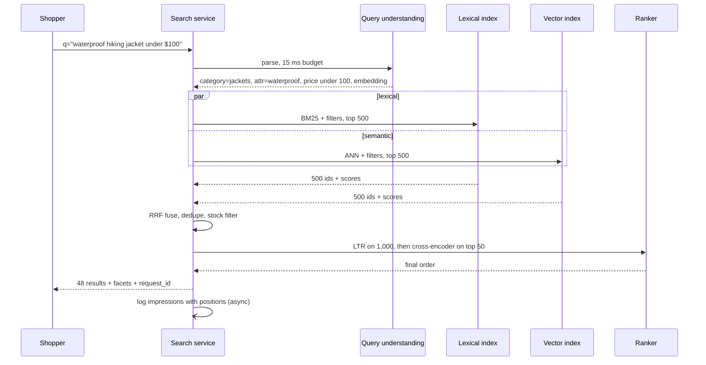

# System Design: Search and Ranking

Search is recommendation with an explicit statement of intent: the user types what they
want, and the system has a few hundred milliseconds to find and order the best matches
among millions of documents. This chapter works one ML system design problem end to end,
**product search for a large online shop**, in the shape of a strong interview answer:
requirements, scale, query understanding, hybrid lexical + semantic retrieval, learning
to rank, features, training data and its biases, serving, offline and online evaluation,
monitoring, trade-offs and follow-ups. The index-serving infrastructure (sharding,
replication, autocomplete) is worked in [Search and Autocomplete](../SystemDesign/solutions/009_search_and_autocomplete_solution.md)
and [Web Search Engine](../SystemDesign/solutions/025_web_search_engine_solution.md); this chapter concentrates on relevance and the ML.

## Foundations — How does a search engine find and order results?

### The pieces

When you type "red running shoes size 10" into a shop:

1. **Query understanding** cleans and interprets the text: fixes typos, recognises
   `red` as a colour, `size 10` as a size, `running shoes` as a category.
2. **Retrieval** finds a few thousand candidate products that could match, fast. Two
   families:
   - **Lexical (keyword) retrieval** uses an **inverted index**: a map from each word to
     the list of documents containing it. It scores with **BM25**, which rewards query
     words that are rare in the collection and frequent in the document, with saturation
     and document-length normalisation. It is precise for exact terms ("Air Max 90",
     SKU numbers) and fails on vocabulary mismatch ("footwear for jogging" vs "running
     shoes").
   - **Semantic (dense) retrieval** embeds the query and every document with a neural
     encoder and finds the nearest vectors with approximate nearest-neighbour (ANN)
     search. It matches meaning across different words and is weaker on exact identifiers
     and rare terms.
3. **Ranking** orders the candidates with a model that uses many signals: text match,
   semantic similarity, popularity, price, ratings, the user's preferences. This is
   **learning to rank (LTR)**.
4. **Presentation** adds facets (brand, size, price filters), sponsored results and
   diversity.

An everyday analogy: a librarian first pulls every book whose title or subject matches
your words or ideas (retrieval), then puts the most useful ones on top based on
experience of what readers like you found useful (ranking).

```arch
%% caption: Search is a funnel with an explicit query: understand the query, retrieve with both lexical and semantic indexes, fuse, then rank with a learned model.
grid 150x100
node q "Query" at 1,0 icon=search sub="red running shoes 10"
node qu "Query understanding" at 1,1 icon=text sub="spell, parse, expand"
node lex "Lexical index" at 0,2 icon=index sub="BM25, filters"
node vec "Vector index" at 2,2 icon=vector sub="ANN, embeddings"
node fuse "Fuse + filter" at 1,3 icon=filter sub="≈ 1,000 candidates"
node ltr "Learning to rank" at 1,4 icon=sort sub="GBDT, 1,000 → 100"
node ce "Cross-encoder" at 1,5 icon=model sub="re-rank top 50"
q -> qu
qu:L -> lex:T
qu:R -> vec:T
lex -> fuse
vec -> fuse
fuse -> ltr -> ce
```

### Vocabulary

| Term | Meaning |
|---|---|
| **Inverted index** | Term → posting list of document IDs (with positions and frequencies) |
| **BM25** | The standard lexical relevance score; uses term frequency with saturation, inverse document frequency and length normalisation |
| **Bi-encoder** | Query and document embedded separately (like a two-tower model); document vectors precomputed, so it can retrieve |
| **Cross-encoder** | Query and document fed into one transformer together; much more accurate, too slow for more than tens to hundreds of documents per query |
| **Hybrid search** | Lexical and dense retrieval run together and fused |
| **RRF** | Reciprocal rank fusion: combine ranked lists by summing 1 / (k + rank) |
| **LTR** | Learning to rank: a model trained to order documents for a query |
| **NDCG, MRR, recall@K** | Ranking metrics (§9) |
| **Zero-result rate** | Share of queries that return nothing, a key health metric |

## 1. Clarify requirements

**Problem:** "Design product search for an online shop with 100 million products."

**Functional**

- Free-text queries return ranked products, with filters (category, brand, size, price,
  in stock) and facets with counts.
- Handle misspellings, synonyms and natural-language queries ("waterproof jacket for
  hiking under $100").
- Personalise lightly (preferred brands, sizes) without hiding relevant results.
- Sponsored products in fixed slots (they are ranked separately and blended).

**Non-functional**

- Latency p99 ≤ 300 ms end to end server-side (assumed), with retrieval ≤ 50 ms.
- Freshness: price and stock changes reflected within a minute; new products searchable
  within minutes.
- Availability: degrade to lexical-only search rather than fail.

**Objective.** Ask what success means: purchases per search, revenue per search, or
"found what they wanted" (clicks followed by add-to-cart). Choose one primary metric and
guardrails (zero-result rate, latency, reformulation rate).

## 2. Estimate scale

Assumptions (ours): 50M searches per day, peak 4× average, 100M products, 768-dim
embeddings compressed to 128 dims for the index, 1 KB of indexed text per product.

| Quantity | Arithmetic | Result | So we need |
|---|---|---|---|
| Query rate | 50M ÷ 86,400 ≈ 580/s, × 4 | ≈ 2,300 QPS peak | Modest QPS; latency, not throughput, drives design |
| Lexical index | 100M × 1 KB text; inverted indexes are typically a fraction of raw text size (≈) | Tens of GB | Shard by document across nodes, replicate for QPS |
| Vector index | 100M × 128 × 2 B (fp16) | ≈ 25.6 GB of vectors (≈ 1.5–2× with HNSW graph) | A few shards in RAM, or IVF-PQ compression |
| LTR scoring | 2,300 QPS × 1,000 candidates | ≈ 2.3M scores/s | GBDT on CPU at a few µs per item: a few dozen cores (≈) |
| Cross-encoder | 2,300 QPS × 50 pairs | ≈ 115k pairs/s | GPUs with dynamic batching; the top-N is the cost dial |
| Price/stock updates | Say 10M updates/day, bursty | ≈ 115/s average | Partial updates to the index, not reindexing |
| Search logs | 50M × (query + 20 impressions + clicks) ≈ 2 KB | ≈ 100 GB/day | Training data for LTR and query understanding |

## 3. Query understanding

Before retrieval, turn raw text into a structured query.

| Step | Example | How |
|---|---|---|
| **Normalisation** | Lowercase, Unicode normalisation, strip punctuation | Rules |
| **Spell correction** | "runing shoes" → "running shoes" | Edit distance against a vocabulary weighted by query frequency; a noisy-channel or seq2seq model; "did you mean" when confidence is low |
| **Segmentation / tokenisation** | "airmax90" → "air max 90" | Dictionary + language-specific tokenisers |
| **Synonyms and expansion** | "sneakers" ↔ "trainers"; "tv" → "television" | Curated lists plus mined pairs (queries that lead to the same clicks) |
| **Entity recognition / slot filling** | "cheap red nike running shoes size 10" → `brand: nike, color: red, category: running shoes, size: 10, price: low` | A sequence-labelling model (fine-tuned transformer); outputs become filters and boosts |
| **Category classification** | "apple" → electronics or groceries? | A classifier over the query using click history; ambiguous queries get a mix |
| **Query rewriting with an LLM** | Long natural-language queries → structured filters + keywords | Offline for head queries (cached), online only with a tight latency budget |

**Hard filters vs soft boosts.** "Size 10" should usually be a filter; "cheap" should be a
ranking signal, not a filter. Over-filtering is a common cause of zero results: fall
back by relaxing filters one at a time.

## 4. High-level architecture

```arch
%% caption: Query path on top, index path below: product changes stream into both indexes, and search logs feed training for the ranker and the query models.
grid 150x105
group query "Query path" color=blue icon=search
node api "Search service" at 0,0 in query icon=api sub="orchestrates, deadline"
node qu "Query understanding" at 1,0 in query icon=text sub="spell, NER, rewrite"
node ret "Retrievers" at 1,1 in query icon=index sub="BM25 + ANN, fuse"
node rank "Ranker" at 0,1 in query icon=sort sub="LTR + cross-encoder"
group index "Index + training" color=slate icon=workflow
node cat "Catalogue events" at 2,2 in index icon=stream sub="new, price, stock"
node idx "Indexer" at 1,2 in index icon=worker sub="text + embeddings"
node logs "Search logs" at 0,2 in index icon=logs sub="queries, clicks, buys"
node train "Training" at 0,3 in index icon=cpu sub="LTR, encoders"
api -> qu
qu -> ret
ret -> rank
api -> rank
cat -> idx
idx ..> ret : "upserts"
rank ..> logs : "impressions"
logs -> train
```



## 5. Retrieval: lexical, semantic and hybrid

| | Lexical (BM25) | Dense (bi-encoder + ANN) |
|---|---|---|
| Strong at | Exact terms, IDs, rare words, brand and model names | Paraphrases, natural language, vocabulary mismatch |
| Weak at | Synonyms, typos (without help), intent | Exact identifiers, numbers, negation; domain drift |
| Filters | Native and cheap (posting-list intersection) | Pre-filtering in ANN is harder; filtered HNSW or partitioned indexes |
| Explainability | High | Low |
| Cost | Cheap, CPU | Embedding every document; memory for vectors |
| Tech | Elasticsearch, OpenSearch, Solr, Vespa, Lucene-based engines | Same engines' vector fields, or FAISS, Milvus, Qdrant, pgvector ([Module 4 — Vector Databases: Vector Indexing & Storage Engines](../Agentic-AI/04_vector_databases_internals.md)) |

**Hybrid** runs both and fuses. **Reciprocal rank fusion** is the usual default because it
needs no score calibration: BM25 scores and cosine similarities live on different scales,
but ranks are comparable. The alternative is normalising scores (min-max, z-score) and
taking a weighted sum, which can do better when tuned but is fragile.

The fused list is then ranked by LTR, so the retrieval goal is **recall**: get the right
products into the top 1,000.

```python
# search_eval.py  (stdlib only): reciprocal rank fusion + NDCG@k
import math


def rrf(rankings: list[list[str]], k: int = 60) -> list[str]:
    """Reciprocal Rank Fusion: score(d) = sum over lists of 1 / (k + rank). Needs no score calibration."""
    scores: dict[str, float] = {}
    for ranking in rankings:
        for rank, doc in enumerate(ranking, start=1):
            scores[doc] = scores.get(doc, 0.0) + 1.0 / (k + rank)
    return sorted(scores, key=scores.get, reverse=True)


def ndcg_at_k(ranked: list[str], relevance: dict[str, int], k: int = 5) -> float:
    """Graded relevance (0-3). DCG uses gain 2^rel - 1 and a log2 position discount."""
    def dcg(docs):
        return sum((2 ** relevance.get(d, 0) - 1) / math.log2(i + 2) for i, d in enumerate(docs[:k]))
    ideal = sorted(relevance, key=relevance.get, reverse=True)
    return dcg(ranked) / dcg(ideal) if dcg(ideal) > 0 else 0.0


# Two queries with human judgments: 3 = perfect, 2 = good, 1 = weak, 0 = bad.
queries = {
    "footwear for jogging": {            # vocabulary mismatch: dense retrieval shines
        "judgments": {"run_shoe_a": 3, "run_shoe_b": 3, "trail_shoe": 2, "jogging_pants": 1,
                      "gym_sock": 1, "dress_shoe": 0},
        "lexical": ["jogging_pants", "dress_shoe", "run_shoe_a", "gym_sock"],
        "dense": ["run_shoe_b", "run_shoe_a", "trail_shoe", "jogging_pants"],
    },
    "nike air max 90": {                 # exact model name: lexical shines
        "judgments": {"air_max_90": 3, "air_max_90_kids": 2, "air_max_95": 1, "adidas_runner": 0,
                      "nike_socks": 0},
        "lexical": ["air_max_90", "air_max_90_kids", "air_max_95", "nike_socks"],
        "dense": ["air_max_95", "adidas_runner", "air_max_90", "nike_socks"],
    },
}
totals = {"lexical": 0.0, "dense": 0.0, "hybrid RRF": 0.0}
for q, d in queries.items():
    runs = {"lexical": d["lexical"], "dense": d["dense"], "hybrid RRF": rrf([d["lexical"], d["dense"]])}
    for name, ranking in runs.items():
        score = ndcg_at_k(ranking, d["judgments"])
        totals[name] += score / len(queries)
        print(f"{q:21s} {name:11s} NDCG@5={score:.3f}  top-3={ranking[:3]}")
print("mean NDCG@5:", {k: round(v, 3) for k, v in totals.items()})
```

Output:

```text
footwear for jogging  lexical     NDCG@5=0.359  top-3=['jogging_pants', 'dress_shoe', 'run_shoe_a']
footwear for jogging  dense       NDCG@5=0.972  top-3=['run_shoe_b', 'run_shoe_a', 'trail_shoe']
footwear for jogging  hybrid RRF  NDCG@5=0.734  top-3=['jogging_pants', 'run_shoe_a', 'run_shoe_b']
nike air max 90       lexical     NDCG@5=1.000  top-3=['air_max_90', 'air_max_90_kids', 'air_max_95']
nike air max 90       dense       NDCG@5=0.479  top-3=['air_max_95', 'adidas_runner', 'air_max_90']
nike air max 90       hybrid RRF  NDCG@5=0.950  top-3=['air_max_90', 'air_max_95', 'nike_socks']
mean NDCG@5: {'lexical': 0.68, 'dense': 0.725, 'hybrid RRF': 0.842}
```

Each retriever wins one query and fails the other; the fused list is never the best on a
single query but is the most robust on average. The ranker downstream then fixes the
order within the fused candidates (it would push `jogging_pants` down using category
features).

In Elasticsearch (8.14 and later), hybrid retrieval with RRF is one request:

```json
{
  "retriever": {
    "rrf": {
      "retrievers": [
        { "standard": { "query": { "bool": {
            "must":   { "multi_match": { "query": "waterproof hiking jacket",
                                         "fields": ["title^3", "brand^2", "description"] } },
            "filter": [ { "range": { "price": { "lt": 100 } } },
                        { "term": { "in_stock": true } } ] } } } },
        { "knn": { "field": "title_embedding", "query_vector": [0.12, -0.03, 0.44],
                   "k": 500, "num_candidates": 2000,
                   "filter": [ { "range": { "price": { "lt": 100 } } },
                               { "term": { "in_stock": true } } ] } }
      ],
      "rank_window_size": 500,
      "rank_constant": 60
    }
  },
  "size": 100
}
```

(The query vector is truncated here; in practice it has the encoder's full dimension.)

### Training the bi-encoder

Start from a pre-trained text embedding model and fine-tune on (query, clicked-or-bought
product) pairs with in-batch negatives and hard negatives (products shown high but
skipped). Domain fine-tuning matters: a general model does not know that "AF1" is a shoe.
Product embeddings are recomputed when the encoder changes, which means re-embedding
100M products: plan it as a batch job and index swap.

## 6. Learning to rank

The ranker sees ≈ 1,000 candidates and orders them. Three training formulations:

| Approach | Trains on | Example | Notes |
|---|---|---|---|
| **Pointwise** | Each (query, doc) independently: predict relevance or P(click) | Logistic regression, GBDT classifier | Simple; ignores that only the order matters |
| **Pairwise** | Pairs: doc A should rank above doc B | RankNet | Closer to the goal |
| **Listwise** | Whole lists, optimising a ranking metric | **LambdaMART** (GBDT with LambdaRank gradients), ListNet | Industry standard for feature-based LTR |

A LambdaMART ranker with LightGBM:

```python
import lightgbm as lgb

# X: one row per (query, candidate) with features; y: graded label 0-3;
# group: number of candidates per query, in row order.
ranker = lgb.LGBMRanker(
    objective="lambdarank",
    metric="ndcg",
    eval_at=[10],
    n_estimators=500,
    learning_rate=0.05,
    num_leaves=63,
)
ranker.fit(X_train, y_train, group=group_train,
           eval_set=[(X_val, y_val)], eval_group=[group_val])
scores = ranker.predict(X_candidates)          # sort candidates by score, descending
```

**Two-stage ranking.** A GBDT over hand-built features ranks 1,000 → 100 in a few ms on
CPU. A **cross-encoder** (a fine-tuned transformer reading query and product text
together) re-ranks the top 50 or so, where its accuracy matters most, on GPUs with
dynamic batching. The cross-encoder score can also be a feature in the GBDT instead.

## 7. Features

| Group | Examples |
|---|---|
| **Query–document text** | BM25 per field (title, brand, description), exact phrase match, fraction of query terms matched, dense cosine similarity, cross-encoder score |
| **Query–document structured** | Category match with the query classifier's prediction, attribute matches (colour, size), price within the parsed range |
| **Document quality** | Rating, review count, return rate, sales velocity, click-through and conversion rate (smoothed, by query category), image quality, seller reliability |
| **Document freshness / availability** | In stock, delivery time, days since listing |
| **Query** | Length, head vs tail (query frequency), classifier confidence, ambiguity |
| **User / context** | Preferred brands and sizes, price sensitivity, device, location (shipping) |
| **Query–document history** | Historical CTR and conversion *for this query and this product* (strong for head queries, empty for the tail) |

**Leakage trap:** query–document historical CTR must be computed from data *before* the
training example's timestamp (chapter 02), or the ranker learns to copy the label.

## 8. Training data and its biases

Two sources of labels:

1. **Human relevance judgments.** Raters grade (query, product) pairs on a scale (e.g.
   perfect / good / weak / bad) following written guidelines. Accurate, expensive, used for
   evaluation sets and for training on the tail. LLM-assisted judging can scale this, but
   must be calibrated against human raters on a sample, and never used alone for
   launch decisions.
2. **Behavioural logs.** Clicks, add-to-cart, purchases. Plentiful and aligned with the
   business, but biased:
   - **Position bias:** top results get clicked because they are on top. Correct with
     randomised result swaps on a small share of traffic to estimate examination
     probabilities, then inverse-propensity weighting (unbiased learning to rank), or
     position as a training-only feature.
   - **Presentation bias:** products with better images get clicks regardless of relevance.
   - **Selection bias:** only shown results can get clicks; relevant products that were never
     shown look irrelevant. Exploration and judgments help.

A common label: graded by action (purchase = 3, add-to-cart = 2, click = 1, shown but
skipped = 0), with skip-above logic (a skipped result above a clicked one is a stronger
negative).

## 9. Evaluation

**Offline**

| Metric | Measures | Use |
|---|---|---|
| **Recall@K** | Share of relevant items in the retrieved top K | Retrieval stage |
| **NDCG@K** | Graded relevance with a position discount, normalised to the ideal order | Main ranking metric on judged sets |
| **MRR** | 1 / rank of the first relevant result | Navigational queries (one right answer) |
| **Precision@K** | Share of the top K that is relevant | Top-of-page quality |
| **Zero-result rate, coverage** | Queries with no results; share of catalogue ever retrieved | Health |

Evaluate **per segment**: head, torso and tail queries behave very differently, and a
change that helps head queries often hurts the tail. Keep a frozen, judged evaluation set
per locale and refresh it periodically.

**Online**

- **Interleaving** (team-draft) for fast, sensitive ranker comparisons.
- **A/B tests** on purchases or revenue per search, with guardrails: zero-result rate,
  **reformulation rate** (user rewrote the query: a sign of failure), time to first click,
  latency, and abandonment.
- Side-by-side human evaluation for qualitative changes.

## 10. Serving and indexing

- **Deadlines.** Each stage has a budget: query understanding ≈ 15 ms, retrieval ≈ 50 ms
  (both indexes in parallel), GBDT ≈ 10 ms, cross-encoder ≈ 50 ms, the rest for hydration
  and facets (all ≈, illustrative). If the cross-encoder misses its deadline, return the
  GBDT order.
- **Caching.** Cache results for head queries (the top few thousand queries are a large
  share of traffic) for a short TTL, keyed by normalised query + filters + locale; stock and
  price are re-checked at hydration.
- **Index freshness.** Catalogue changes arrive as events (CDC or an outbox, see
  [Messaging and Streaming](../SystemDesign/building_blocks/09_messaging_and_streaming.md)). Price and stock are
  partial updates to the lexical index and filter fields; new products need text indexing
  and an embedding before they appear in semantic retrieval, typically within minutes.
- **Encoder upgrades** re-embed the whole catalogue: build a new vector index in the
  background and swap atomically; query and document encoders must be the same version.
- **Degradation:** lexical-only retrieval if the vector index or encoder is down; GBDT-only
  ranking if the cross-encoder is down; cached results for head queries.

## 11. Monitoring

- Latency per stage, timeouts, degraded-mode rate.
- Zero-result rate and reformulation rate, overall and per locale and category.
- Query-understanding health: spell-correction trigger rate, NER confidence, share of
  queries hitting fallback relaxations.
- Index freshness lag (event time → searchable), index size, embedding job failures.
- Ranking: CTR at positions 1–3, conversion per search, per-segment NDCG on the judged set
  re-run nightly against the live stack.
- Drift in query distribution (new trending queries, seasonal shifts; chapter 04).

## 12. Trade-offs to state

| Decision | Options | Lean |
|---|---|---|
| Retrieval | Lexical only / dense only / hybrid | Hybrid: robust across head, tail and natural-language queries |
| Fusion | RRF / weighted normalised scores / learned fusion in the ranker | RRF as default; feed both scores into LTR |
| Ranker | GBDT LTR / cross-encoder / both | Both, two-stage; the cross-encoder's top-N is the cost dial |
| Labels | Human judgments / clicks | Clicks with bias correction for training; judgments for evaluation and tail |
| Personalisation | None / light boosts / fully personal | Light: relevance first, personal preferences as features |
| LLM query rewriting | Online / offline cached | Offline for head queries; online only within budget |

## 13. Follow-ups the interviewer will ask

1. **"How do you handle a query with zero results?"** Relax filters one at a time, spell
   correct, fall back to semantic retrieval, show related categories; log it and review
   the top zero-result queries weekly (they are often catalogue gaps or synonym gaps).
2. **"How do you add autocomplete?"** A separate low-latency service over popular
   past queries in a trie or prefix index, ranked by frequency and personal history
   ([Search and Autocomplete](../SystemDesign/solutions/009_search_and_autocomplete_solution.md)).
3. **"How are sponsored results placed?"** A separate ads auction ranks sponsored
   candidates by bid × predicted relevance/CTR; they are blended into fixed slots with a
   relevance floor so irrelevant ads don't show.
4. **"How do you support 20 languages?"** Per-language analysers and tokenisers,
   multilingual encoders, per-locale judged sets and synonyms; the ranker gets locale as a
   feature or is trained per major locale.
5. **"Offline NDCG improved but conversion didn't."** Judged set not representative of
   traffic (head vs tail mix), position bias in click labels, the cross-encoder timing out
   in production, or NDCG not capturing price and availability.
6. **"How would you use an LLM here?"** Query rewriting and attribute extraction for long
   queries (cached for the head), generating synonyms and product attributes offline,
   labelling at scale with human calibration, and possibly a conversational shopping
   assistant over the same retrieval stack (a RAG pattern, see [Module 3 — Retrieval-Augmented Generation: RAG Internals](../Agentic-AI/03_rag_deep_dive.md)).

## Common interview questions

**Why do search systems use both BM25 and embeddings?**
They fail differently. BM25 nails exact terms and identifiers and misses paraphrases;
dense retrieval matches meaning and misses exact identifiers. Hybrid retrieval fused with
RRF is more robust than either.

**What is the difference between a bi-encoder and a cross-encoder?**
A bi-encoder embeds query and document separately, so documents are precomputed and
searchable with ANN; a cross-encoder reads both together, which is far more accurate but
must run per pair, so it only re-ranks the top tens of results.

**What is LambdaMART?**
Gradient-boosted trees trained with LambdaRank gradients, which weight each pairwise swap
by how much it would change NDCG. It is the standard feature-based LTR model.

**How do you get training labels for ranking?**
From behaviour (purchases, add-to-cart, clicks) corrected for position and selection bias,
plus human relevance judgments for evaluation and for the tail.

**Define NDCG.**
DCG sums each result's gain (2^rel − 1) divided by log₂(position + 1); NDCG divides by
the DCG of the ideal order, so 1.0 is perfect. It rewards putting highly relevant results
near the top.

**How do you keep the index fresh for price and stock?**
Stream catalogue changes as events and apply partial updates; new products are indexed
and embedded within minutes; price and stock are re-checked at hydration time.

**What do you monitor for search quality in production?**
Zero-result rate, reformulation rate, CTR at top positions, conversion per search,
per-segment NDCG on a judged set, index freshness lag, stage latencies.

## What Each Engineering Level Should Know

| Level | Industry title | Google ladder | What they should know |
|---|---|---|---|
| **Student / Intern** | Intern | Intern (pre-L3) | Explains an inverted index, BM25 in words, and why embeddings help with synonyms. |
| **Junior (L3)** | Search / ML Engineer I | L3 | Builds analysers, synonyms and filters in Elasticsearch/OpenSearch; computes NDCG and MRR on a judged set; adds a ranking feature without leakage. |
| **Mid (L4)** | ML Engineer II | L4 | Trains a LambdaMART ranker; sets up hybrid retrieval with RRF; fine-tunes a bi-encoder; handles position bias in click labels; runs interleaving and A/B tests. |
| **Senior (L5)** | Senior ML / Search Engineer | L5 | Designs the full system in an interview: query understanding, hybrid retrieval, two-stage ranking with latency budgets, labels and biases, index freshness, evaluation per query segment, degradation. |
| **Staff+ (L6+)** | Staff / Principal | L6–L8 | Owns search quality strategy across locales and surfaces: judged-set programmes, metric definitions, ads and organic blending policy, LLM adoption with cost and latency guardrails. |

## Interview checklist

- [ ] I clarify the objective (purchases per search, not clicks) and guardrails (zero results, reformulations).
- [ ] I can estimate QPS, index sizes and ranking work, and say which dominates latency and cost.
- [ ] I can list query-understanding steps and when to filter vs boost.
- [ ] I can compare lexical and dense retrieval and explain RRF.
- [ ] I can explain pointwise, pairwise and listwise LTR, LambdaMART, and bi- vs cross-encoders.
- [ ] I can list ranking features by group and point out the leakage trap in historical CTR.
- [ ] I can explain position, presentation and selection bias in click labels and their fixes.
- [ ] I can define NDCG, MRR and recall@K and evaluate per query segment.
- [ ] I can describe index freshness, encoder upgrades and a degradation ladder.

Related: [Search and Autocomplete](../SystemDesign/solutions/009_search_and_autocomplete_solution.md),
[Web Search Engine](../SystemDesign/solutions/025_web_search_engine_solution.md),
[Module 4 — Vector Databases: Vector Indexing & Storage Engines](../Agentic-AI/04_vector_databases_internals.md), [Module 3 — Retrieval-Augmented Generation: RAG Internals](../Agentic-AI/03_rag_deep_dive.md),
[Day 84: RAG v2 (Hybrid Search & Reranking)](../AI-road-map/84_day_hybrid_search_reranking.md), [System Design: Recommendation Systems](06_sysdesign_recsys.md).
