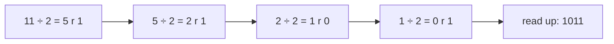

# Number Systems — Binary, Hex, Two's Complement and Floating Point

Every value in a computer — a count, a colour, a letter, a price, a pixel — is stored
as a row of bits. This chapter explains how: positional number systems, converting
between binary, decimal and hexadecimal, how negative numbers are stored (two's
complement) and why integers overflow, the bit tricks interviewers love, and how
floating-point numbers work — including why `0.1 + 0.2 != 0.3` and what to do about
it. It is the chapter that turns "weird computer bugs" into predictable arithmetic.

**Where this fits:** Part 1 · The language of maths, chapter 2 of 15. **Builds on:** nothing beyond school arithmetic and basic Python, so this is a fine first chapter. **Used again in:** 07, 13. **Next in order:** [03 Logic and proofs](03_logic_and_proofs.md).

## Where You Will Use This

| Situation | What you need from this chapter |
|---|---|
| Reading hex dumps, colours (`#FF8800`), memory addresses, hashes | Hex ↔ binary by nibbles |
| Integer overflow bugs, `abs(INT_MIN)`, the Year 2038 problem | Two's complement ranges and wrap-around |
| Bitmask DP, permissions flags, Bloom filters, compact sets | Bitwise operators and tricks |
| Money, measurements, ML numerics | Floating-point representation, rounding error, safe comparison |
| Networking and file formats | Bytes, endianness |

## Foundations — Counting With Places

### What a digit's position means

Look at 347. You read it as "three hundred and forty-seven" without thinking, but the
digits only mean that because of where they sit: 3 is in the hundreds place, 4 in the
tens, 7 in the ones.

$$
347 = 3 \cdot 10^2 + 4 \cdot 10^1 + 7 \cdot 10^0
$$

That is **positional notation**: each place is worth the **base** (here 10) times the
place to its right. Nothing forces the base to be 10 — we use ten digits because we
have ten fingers.

> **Analogy:** A car's odometer. Each wheel shows 0–9; when the rightmost wheel passes
> 9 it rolls back to 0 and nudges its neighbour forward by one. Now imagine an
> odometer whose wheels only have **0 and 1**: it counts 000, 001, 010, 011, 100, …
> That is binary. Every wheel is worth twice the one to its right.

### Why computers use base 2

A wire either carries a high voltage or it does not; a transistor is on or off; a
magnetic region points one way or the other. Two states are cheap to build and easy
to tell apart even with noise, so hardware stores **bits** (binary digits). Everything
else is conventions for grouping and interpreting bits:

| Unit | Bits | Distinct values |
|---|---|---|
| bit | 1 | 2 |
| nibble | 4 | 16 (one hex digit) |
| byte | 8 | 256 |
| 32-bit word | 32 | 4,294,967,296 (≈ 4.3 billion) |
| 64-bit word | 64 | ≈ 1.8 × 10¹⁹ |

> **Key idea:** n bits can represent exactly $2^n$ different patterns. What those
> patterns *mean* — an unsigned number, a signed number, a float, a character, a
> pixel — is a separate decision made by the program. The same byte `0xFF` is 255, −1,
> or the letter ÿ depending on how you read it.

## 1 · Converting Between Bases

### Any base to decimal: multiply out the places

$$
1011_2 = 1 \cdot 2^3 + 0 \cdot 2^2 + 1 \cdot 2^1 + 1 \cdot 2^0 = 8 + 0 + 2 + 1 = 11
$$

The subscript names the base. The code is the same loop for every base (this is
**Horner's method**: multiply the running value by the base, add the next digit):

```python
def to_decimal(digits: str, base: int) -> int:
    value = 0
    for d in digits:
        value = value * base + int(d, 36)   # int(d, 36) reads 0-9 and a-z as 0-35
    return value

print(to_decimal("1011", 2))    # → 11
print(to_decimal("ff", 16))     # → 255
print(to_decimal("777", 8))     # → 511
print(int("1011", 2), int("ff", 16))   # → 11 255
```

### Decimal to any base: repeated division

Divide by the base; the remainder is the last digit. Repeat with the quotient.



```python
def from_decimal(n: int, base: int) -> str:
    if n == 0:
        return "0"
    digits = "0123456789abcdefghijklmnopqrstuvwxyz"
    out = []
    while n > 0:
        n, r = divmod(n, base)
        out.append(digits[r])
    return "".join(reversed(out))

print(from_decimal(11, 2))      # → 1011
print(from_decimal(255, 16))    # → ff
print(bin(11), hex(255), oct(8))   # → 0b1011 0xff 0o10
print(f"{11:08b}")              # → 00001011
```

> **Notebook example:** Convert 156 to binary and to hex, then check by converting back.
>
> | Divide | Quotient | Remainder |
> |---|---|---|
> | 156 ÷ 2 | 78 | 0 |
> | 78 ÷ 2 | 39 | 0 |
> | 39 ÷ 2 | 19 | 1 |
> | 19 ÷ 2 | 9 | 1 |
> | 9 ÷ 2 | 4 | 1 |
> | 4 ÷ 2 | 2 | 0 |
> | 2 ÷ 2 | 1 | 0 |
> | 1 ÷ 2 | 0 | 1 |
>
> 1. Read the remainders **from the bottom up**: $156 = 10011100_2$.
> 2. For hex, group the bits in fours from the right: `1001 1100` is $9$ and $12 = \text{C}$,
>    so $156 = \text{0x9C}$.
> 3. Check with place values: $128 + 16 + 8 + 4 = 156$. ✓ In hex:
>    $9 \cdot 16 + 12 = 144 + 12 = 156$. ✓

### Binary ↔ hex: group bits in fours

Because $16 = 2^4$, every hex digit is exactly four bits. No arithmetic needed — just
regroup:

```
binary   1101 0110 1111 0001
hex         D    6    F    1      →  0xD6F1
```

| Hex | 0 | 1 | 2 | 3 | 4 | 5 | 6 | 7 | 8 | 9 | A | B | C | D | E | F |
|---|---|---|---|---|---|---|---|---|---|---|---|---|---|---|---|---|
| Binary | 0000 | 0001 | 0010 | 0011 | 0100 | 0101 | 0110 | 0111 | 1000 | 1001 | 1010 | 1011 | 1100 | 1101 | 1110 | 1111 |

That is why programmers use hex: it is binary, compressed 4:1, and a byte is always
exactly two hex digits. A colour `#FF8800` is three bytes: red 255, green 136, blue 0.

> **In practice:** Octal (base 8, groups of three bits) survives in Unix file
> permissions: `chmod 754` is `111 101 100` = rwx for the owner, r-x for the group,
> r-- for others.

## 2 · Unsigned Integers and Their Limits

With n bits the unsigned values run from 0 to $2^n - 1$ (all ones). Adding one to all
ones carries out of the top bit and **wraps around to 0** — the arithmetic is really
**modulo $2^n$** (chapter 07 is all about modular arithmetic).

```python
MASK8 = 0xFF                       # keep only 8 bits, like a uint8 register
print((255 + 1) & MASK8)           # → 0
print((0 - 1) & MASK8)             # → 255
print(2**32 - 1)                   # → 4294967295
```

> **Watch out:** In C, `for (unsigned i = n - 1; i >= 0; i--)` never ends: an unsigned
> value is always ≥ 0, and 0 − 1 wraps to the maximum. Python hides this because its
> integers are arbitrary precision — they grow new digits instead of wrapping. That is
> convenient, and it also means Python will never show you the bug your C, Java or Go
> service has.

> **Notebook example:** An 8-bit unsigned register holds 200. Add 100. What does it hold?
>
> 1. Write both in binary: $200 = 1100\,1000$ and $100 = 0110\,0100$.
> 2. Add column by column with carries: the true sum is $300 = 1\,0010\,1100$, which needs
>    **9** bits.
> 3. The register keeps only the low 8 bits, $0010\,1100$, and the carry out of the top
>    is lost.
> 4. Read what is left: $32 + 8 + 4 = 44$.
>
> **Answer:** 44. **Check** with modular arithmetic: $300 \bmod 256 = 300 - 256 = 44$. ✓
> Wrap-around is just "mod $2^n$".

### KB or KiB?

Storage vendors count in powers of 10 ($1\,\text{KB} = 1000$ bytes); memory and
operating systems usually count in powers of 2 ($1\,\text{KiB} = 1024$ bytes).
$2^{10} = 1024 \approx 10^3$ is the handiest approximation in systems work: $2^{20}$ ≈
a million, $2^{30}$ ≈ a billion, $2^{40}$ ≈ a trillion.

## 3 · Negative Numbers: Two's Complement

### The problem

We need negative numbers, but a bit pattern has no minus sign. Three schemes have been
tried:

| Scheme | −3 in 4 bits | Problem |
|---|---|---|
| Sign-magnitude (first bit = sign) | `1011` | Two zeros (`0000` and `1000`); addition needs special cases |
| Ones' complement (flip all bits) | `1100` | Still two zeros |
| **Two's complement** | `1101` | None — every modern CPU uses it |

### The one idea behind two's complement

> **Key idea:** In n-bit two's complement, the top bit is worth $-2^{n-1}$ instead of
> $+2^{n-1}$. Everything else is ordinary binary.

For 8 bits the places are worth −128, 64, 32, 16, 8, 4, 2, 1. So:

- `0111 1111` = 64 + 32 + 16 + 8 + 4 + 2 + 1 = **127** (the largest)
- `1000 0000` = **−128** (the smallest)
- `1111 1111` = −128 + 127 = **−1**
- The range is −128 … 127: one more negative than positive.

**To negate a number: flip every bit, then add one.** Why? $x + \tilde{x}$ (x plus its
bit-flip) is all ones, which is −1. So $\tilde{x} + 1 = -x$.

```python
def as_signed8(bits: int) -> int:
    """Read the low 8 bits of `bits` as a two's-complement number."""
    bits &= 0xFF
    return bits - 256 if bits & 0x80 else bits

def negate8(x: int) -> int:
    return (~x + 1) & 0xFF

print(as_signed8(0b01111111))       # → 127
print(as_signed8(0b10000000))       # → -128
print(as_signed8(0b11111111))       # → -1
print(as_signed8(negate8(5)))       # → -5
print(as_signed8(negate8(0x80)))    # → -128
```

The last line is the famous edge case: **−(−128) = −128**. The most negative number has
no positive partner, so negating it overflows back to itself. That is why `abs(INT_MIN)`
is still negative in C and Java, and `Math.abs(Integer.MIN_VALUE) < 0` is `true`.

> **Intuition:** Two's complement is a clock. Put 0…255 around a circle; call the
> right half (128…255) the negative numbers −128…−1. Adding 1 always moves one step
> clockwise — for signed and unsigned numbers alike. That is the real reason CPUs use
> it: **one adder circuit** handles both, and subtraction is addition of the negation.

**Try it: flip bits and break arithmetic.** Click bits to build numbers and switch
between the unsigned and signed readings of the same pattern. Then press **127** and
**+1** in signed mode (overflow to −128), **255** and **+1** in unsigned mode (wrap to 0),
and **negate** on `1000 0000`. Watch the number line: overflow is just walking off one
end and reappearing at the other.

<div class="lab" data-viz="math-bits"></div>

> **Notebook example:** Write $-37$ as an 8-bit two's-complement number, then compute
> $50 + (-37)$ with an ordinary adder.
>
> 1. $37$ in binary: $32 + 4 + 1$, so $0010\,0101$.
> 2. Flip every bit: $1101\,1010$.
> 3. Add one: $1101\,1011$. That is $-37$.
> 4. Check with place values, where the top bit is worth $-128$:
>    $-128 + 64 + 16 + 8 + 2 + 1 = -37$. ✓
> 5. Now add $50 = 0011\,0010$:
>    $0011\,0010 + 1101\,1011 = 1\,0000\,1101$. Drop the carry out of bit 8 to get
>    $0000\,1101 = 13$.
>
> **Answer:** $50 - 37 = 13$, computed by the same adder that adds unsigned numbers. No
> subtraction circuit was needed.

### Overflow is not hypothetical

**The binary search bug.** For years Java's standard library computed a midpoint as
`mid = (low + high) / 2`. With arrays over a billion elements, `low + high` exceeds
$2^{31} - 1$, wraps negative, and the index is garbage. It was found in 2006, roughly
two decades after the algorithm was published as proven correct. The fix is
`low + (high - low) / 2`.

```python
def wrap32(x: int) -> int:           # emulate Java's 32-bit int
    x &= 0xFFFFFFFF
    return x - 2**32 if x >= 2**31 else x

low, high = 1_500_000_000, 2_000_000_000
print(wrap32(low + high) // 2)           # → -397483648
print(low + (high - low) // 2)           # → 1750000000
```

**The Year 2038 problem.** Unix time counts seconds since 1970-01-01 UTC. Stored in a
signed 32-bit integer, it runs out at $2^{31} - 1$ seconds:

```python
from datetime import datetime, timezone
print(datetime.fromtimestamp(2**31 - 1, tz=timezone.utc))   # → 2038-01-19 03:14:07+00:00
print(datetime.fromtimestamp(-2**31, tz=timezone.utc))      # → 1901-12-13 20:45:52+00:00
```

One second later, a 32-bit clock wraps to December 1901. Modern systems use 64-bit
time, which lasts about 292 billion years.

## 4 · Bitwise Operations and the Tricks Built on Them

| Operator | Name | Rule per bit | Typical use |
|---|---|---|---|
| `a & b` | AND | 1 if both are 1 | keep only some bits (a **mask**), test a bit |
| `a \| b` | OR | 1 if either is 1 | set bits |
| `a ^ b` | XOR | 1 if they differ | toggle bits, find differences |
| `~a` | NOT | flip | invert a mask |
| `a << k` | shift left | move up k places | multiply by $2^k$ |
| `a >> k` | shift right | move down k places | floor-divide by $2^k$ |

The standard moves on bit `k` of `x`:

```python
x = 0b1010_0000
k = 5
print(bool(x & (1 << k)))      # → True
print(bin(x | (1 << 0)))       # → 0b10100001
print(bin(x & ~(1 << 7)))      # → 0b100000
print(bin(x ^ (1 << 7)))       # → 0b100000
```

### Tricks worth knowing (and why they work)

**Clear the lowest set bit: `x & (x - 1)`.** Subtracting 1 flips the lowest 1 to 0 and
every 0 below it to 1; AND-ing with the original kills exactly that lowest 1.

```
x       = 1011 0100
x - 1   = 1011 0011
x & x-1 = 1011 0000
```

So `x & (x - 1) == 0` tests "x is a power of two" (exactly one bit set), and repeating
it counts the set bits in as many steps as there are 1s (**Kernighan's popcount**).

**Isolate the lowest set bit: `x & -x`.** In two's complement, $-x = \tilde{x} + 1$,
which agrees with x only at the lowest 1 bit. Fenwick trees (binary indexed trees)
are built on this one expression.

**XOR cancels pairs.** $a \oplus a = 0$ and $a \oplus 0 = a$, and XOR is commutative
and associative — so XOR-ing a list in which every value appears twice except one
leaves just that one, in O(1) memory.

```python
def is_power_of_two(x): return x > 0 and x & (x - 1) == 0
def popcount(x):
    c = 0
    while x:
        x &= x - 1
        c += 1
    return c
def lowest_bit(x): return x & -x

print([n for n in range(1, 70) if is_power_of_two(n)])   # → [1, 2, 4, 8, 16, 32, 64]
print(popcount(0b1011_0100), bin(0b1011_0100).count("1"))   # → 4 4
print(lowest_bit(0b1011_0100))                           # → 4

from functools import reduce
from operator import xor
print(reduce(xor, [4, 1, 2, 1, 2]))                      # → 4
```

> **Notebook example:** Let $x = 44 = 0010\,1100$. Work out `x & (x - 1)`, `x & -x`,
> the number of set bits, and toggling bit 5.
>
> 1. $x - 1 = 43 = 0010\,1011$. AND with x: $0010\,1000 = 40$. The lowest 1 (worth 4)
>    is gone.
> 2. $-x$: flip x to get $1101\,0011$, then add 1 to get $1101\,0100$. AND with x:
>    $0000\,0100 = 4$. Only the lowest 1 is left.
> 3. Count bits Kernighan's way: $44 \to 40 \to 32 \to 0$. That is three steps, so
>    **3** set bits. (Count the 1s in `0010 1100` to check.)
> 4. Toggle bit 5 (worth 32): $44 \oplus 32 = 0000\,1100 = 12$.
> 5. XOR trick: XOR the list $3, 7, 3, 5, 7$ in order: $3 \oplus 7 = 4$,
>    $4 \oplus 3 = 7$, $7 \oplus 5 = 2$, $2 \oplus 7 = 5$. The unpaired value is **5**.

### Sets as bits: the bitmask

A subset of $\{0, 1, \dots, n-1\}$ is an n-bit number: bit i is 1 when element i is in
the set. Union is `|`, intersection is `&`, difference is `& ~`, and "all subsets"
is simply counting from 0 to $2^n - 1$. This is how bitmask dynamic programming
represents "which cities have I visited" in one integer.

```python
items = ["a", "b", "c"]
subsets = [[items[i] for i in range(3) if mask >> i & 1] for mask in range(1 << 3)]
print(len(subsets), subsets[5])   # → 8 ['a', 'c']
```

> **Interview angle:** "Find the one number that appears once when all others appear
> twice" (XOR everything), "count the bits" (`x & (x - 1)` loop), "is it a power of
> two", "swap without a temp" (three XORs — cute, but slower than a normal swap in
> practice and wrong if both names refer to the same memory), "generate all subsets"
> (count to $2^n$). Each is one identity from this section.

## 5 · Floating Point: Scientific Notation in Binary

### The idea

Integers cannot hold 0.5 or $6.02 \times 10^{23}$. Floating point stores numbers the
way scientists write them: a **sign**, a few **significant digits**, and an
**exponent** saying where the point goes. The IEEE 754 standard does this in base 2:

$$
\text{value} = (-1)^{\text{sign}} \times 1.\text{fraction}_2 \times 2^{\,\text{exponent} - \text{bias}}
$$

| Format | Total bits | Sign | Exponent | Fraction | Significant decimal digits | Largest |
|---|---|---|---|---|---|---|
| float32 (`float` in C/Java) | 32 | 1 | 8 (bias 127) | 23 (+1 hidden) | about 7 | ≈ 3.4 × 10³⁸ |
| float64 (`double`, Python `float`) | 64 | 1 | 11 (bias 1023) | 52 (+1 hidden) | about 15–16 | ≈ 1.8 × 10³⁰⁸ |

The "hidden 1": in binary scientific notation the leading digit of a non-zero number
is always 1, so it is not stored — a free extra bit of precision.

> **Analogy:** A floating-point number is a ruler whose markings get further apart
> the further you go from zero. Near 0 the marks are extremely fine; near 10¹⁵ they are
> whole numbers apart; past $2^{53}$ in float64 they are 2 apart. Every stored value
> is snapped to the nearest mark. The **relative** precision is roughly constant; the
> absolute precision is not.

**Try it: look inside a float.** The default is 0.1: see that it is stored as
0.100000001490116… in float32. Press **16777217** (2²⁴ + 1) — the first integer float32
cannot hold — and **next float ↑** to see the gap between neighbours. Then try 1e-45
(the smallest subnormal) and 3.4e38 (near the largest).

<div class="lab" data-viz="math-float"></div>

> **Notebook example:** Encode $-6.25$ as a float32, bit by bit.
>
> 1. **Sign:** negative, so the sign bit is 1.
> 2. **Binary:** $6 = 110_2$ and $0.25 = 0.01_2$, so $6.25 = 110.01_2$.
> 3. **Normalise** to $1.\text{something}$: move the point two places left, giving
>    $1.1001_2 \times 2^2$.
> 4. **Exponent field:** $2 + 127$ (the bias) $= 129 = 1000\,0001_2$.
> 5. **Fraction field:** the bits after the leading 1 (which is not stored), padded to
>    23 bits: $1001\,0000\,0000\,0000\,0000\,000$.
> 6. Put them together: `1 10000001 10010000000000000000000`. Grouped in fours, that
>    is `1100 0000 1100 1000 0000 …`, which is **0xC0C80000**.
>
> **Check:** $-(1 + \tfrac12 + \tfrac1{16}) \times 2^2 = -1.5625 \times 4 = -6.25$. ✓
> Now try 0.1 the same way. Doubling the fraction gives the bits:
> 0.2 → 0, 0.4 → 0, 0.8 → 0, 1.6 → 1, 1.2 → 1, 0.4 → 0, … The pattern repeats forever,
> so 0.1 must be rounded.

### Why 0.1 is not exact

In base 10, 1/3 = 0.3333… never ends, because 3 does not divide a power of 10. In base
2, a fraction terminates only if its denominator is a power of 2 — and 1/10 is not.
So 0.1 is $0.0001100110011\ldots_2$ repeating, and it must be cut off.

```python
print(0.1 + 0.2)              # → 0.30000000000000004
print(0.1 + 0.2 == 0.3)       # → False
print(0.5 + 0.25 == 0.75)     # → True
from decimal import Decimal
print(Decimal(0.1))           # → 0.1000000000000000055511151231257827021181583404541015625
```

`0.5` and `0.25` are exact (powers of two), so that sum is exact. `Decimal(0.1)` shows
the true value of the float64 nearest to 0.1.

### Machine epsilon and the integers you can trust

**Machine epsilon** is the gap between 1.0 and the next float: $2^{-52} \approx 2.2 \times 10^{-16}$
for float64. It is the relative precision of the format.

```python
import sys
print(sys.float_info.epsilon)          # → 2.220446049250313e-16
print(2.0**53 + 1 == 2.0**53)          # → True
print(float(2**53 + 1) == 2**53)       # → True
print(9007199254740993 == float(9007199254740993))   # → False
```

Every integer up to $2^{53}$ is exactly representable in float64, but $2^{53} + 1$ is
not — it rounds to $2^{53}$. That is JavaScript's `Number.MAX_SAFE_INTEGER` $= 2^{53} - 1$,
and why 64-bit IDs (tweet IDs, database keys) are sent to browsers as **strings**.

### Four rules for working with floats

1. **Never compare floats with `==`.** Compare with a tolerance:
   `math.isclose(a, b, rel_tol=1e-9)`.
2. **Never store money in floats.** Use integer cents or `decimal.Decimal`.
3. **Beware subtracting nearly equal numbers** (**catastrophic cancellation**): the
   leading digits cancel and only the noise remains.
4. **Summation order matters.** Adding many small numbers to a big one loses them;
   `math.fsum` (or Kahan summation) keeps the lost digits.

```python
import math
print(math.isclose(0.1 + 0.2, 0.3))        # → True
print(sum([0.1] * 10))                     # → 0.9999999999999999
print(math.fsum([0.1] * 10))               # → 1.0
big = 1e16
print(big + 1.0 - big)                     # → 0.0
print(1 - math.cos(1e-8), 2 * math.sin(0.5e-8) ** 2)   # → 0.0 5.0000000000000005e-17
```

The last line is cancellation in action: $1 - \cos x$ for tiny x is computed as 0, while
the algebraically identical $2\sin^2(x/2)$ gives the right answer, about $5 \times 10^{-17}$.
Rewriting a formula to avoid subtracting nearly equal values is a core numerical skill.

### Special values

| Value | How you get it | Behaviour |
|---|---|---|
| `inf`, `-inf` | overflow, `1.0 / 0.0` in most languages | bigger than every number |
| `nan` | `0/0`, `inf - inf`, `sqrt(-1)` | **not equal to anything, even itself** |
| `-0.0` | underflow of a negative, `-1e-320 * 1e-10` | equals `0.0`, but `1/-0.0 = -inf` |
| subnormals | numbers below about 10⁻³⁰⁸ | fill the gap near 0 with lower precision |

```python
nan = float("nan")
print(nan == nan, math.isnan(nan))    # → False True
print(float("inf") > 1e308)           # → True
```

> **Watch out:** Because NaN is not equal to itself, a NaN in a list breaks sorting and
> `max`, and a NaN key can be inserted into a dict "twice". Validate numeric input
> before it reaches your data structures.

## 6 · Bytes on the Wire: Endianness

A 32-bit integer is four bytes. Which one comes first in memory or on the network?
**Big-endian** stores the most significant byte first (like we write numbers);
**little-endian** stores the least significant first. x86 and ARM (as normally run)
are little-endian; network protocols are big-endian ("network byte order").

```python
n = 0x12345678
print(n.to_bytes(4, "big").hex())      # → 12345678
print(n.to_bytes(4, "little").hex())   # → 78563412
print(int.from_bytes(b"\x78\x56\x34\x12", "little") == n)   # → True
```

Endianness bugs show up the moment two machines or a machine and a file format
disagree: a length of 1 read with the wrong byte order becomes 16,777,216.

> **Notebook example:** The 32-bit value $\text{0x12345678}$ is stored at address 100.
> What is in each byte? And what does a receiver read from the bytes `01 00 00 00`?
>
> 1. Split into bytes, most significant first: `12`, `34`, `56`, `78`.
> 2. **Big-endian** puts the most significant byte first: address 100 holds `12`, 101
>    holds `34`, 102 holds `56` and 103 holds `78`.
> 3. **Little-endian** reverses them: `78 56 34 12` at addresses 100 to 103.
> 4. The bytes `01 00 00 00` read as little-endian are $\text{0x00000001} = 1$. Read as
>    big-endian, they are $\text{0x01000000} = 2^{24} = 16{,}777{,}216$.
>
> **Answer:** the same four bytes mean 1 or 16,777,216, depending only on the agreed
> byte order.

## Common Mistakes

1. Treating bit patterns as having one meaning. `0xFF` is 255, −1 or a character, by
   convention only.
2. Assuming integers cannot overflow because Python's do not.
3. `(lo + hi) / 2` in languages with fixed-width integers.
4. Comparing floats with `==`, storing money as floats.
5. Forgetting that `-x` overflows for the most negative value.
6. `x % 2 == 1` as an odd test in C/Java (negative remainders; see chapter 01).
7. Shifting a signed negative number right and expecting a logical shift. Most
   languages do an **arithmetic** shift (copying the sign bit); Java has `>>>` for
   logical.

## Check Yourself

**1.** Convert 0xB7 to binary and to decimal, both unsigned and as signed 8-bit.

<details>
<summary>Open the answer</summary>

B = 1011, 7 = 0111, so `1011 0111`. Unsigned: 128 + 32 + 16 + 4 + 2 + 1 = 183. Signed:
the top bit is worth −128 instead, so −128 + 55 = −73 (equivalently 183 − 256).

</details>

**2.** Why does `x & (x - 1)` remove exactly the lowest set bit?

<details>
<summary>Open the answer</summary>

Subtracting 1 turns the lowest 1 into 0 and every 0 below it into 1, leaving higher
bits alone. AND-ing with x keeps the higher bits (same in both), zeroes the lowest 1
(0 in x − 1) and zeroes the bits below it (0 in x).

</details>

**3.** Why is 0.5 + 0.25 == 0.75 exactly true but 0.1 + 0.2 == 0.3 false?

<details>
<summary>Open the answer</summary>

0.5, 0.25 and 0.75 are sums of powers of two, so they are stored exactly and their sum
is exact. 0.1, 0.2 and 0.3 have infinite binary expansions; each is rounded, and the
rounding errors do not cancel.

</details>

**4.** Your service stores millisecond timestamps in a signed 32-bit integer. When does
it break?

<details>
<summary>Open the answer</summary>

$2^{31} - 1$ ms ≈ 2.1 billion ms ≈ 24.9 days after the epoch you count from. Counting
from service start, it wraps after about 25 days of uptime — a real class of bug
(uptime counters that crash monthly). Use 64-bit.

</details>

## What Each Level Should Know

| Level | Expected |
|---|---|
| **Getting started** | Convert between binary, hex and decimal; know $2^n$ values in n bits; read two's complement; know floats are approximate |
| **Interview-ready** | Bit tricks (power of two, popcount, lowest bit, XOR pairing, subset masks); overflow-safe midpoint; float comparison and money rules; explain `abs(INT_MIN)` |
| **Going deeper** | IEEE 754 layout, ulp and machine epsilon, subnormals, catastrophic cancellation and rewriting formulas; Kahan summation; endianness in protocols |

## Checklist

- [ ] I can convert between bases by hand and with `int(s, base)`, `bin`, `hex`, `format`.
- [ ] I can state the range of an n-bit signed and unsigned integer.
- [ ] I can negate a two's-complement number by hand and explain why it works.
- [ ] I know `x & (x-1)`, `x & -x`, XOR cancellation and subset masks, and why each works.
- [ ] I write `lo + (hi - lo) // 2` in fixed-width languages.
- [ ] I compare floats with a tolerance and never store money in them.
- [ ] I can explain why 2⁵³ + 1 is not a float64.
