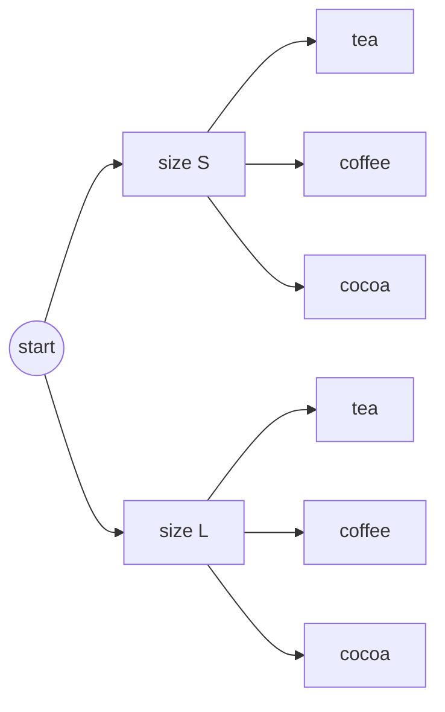
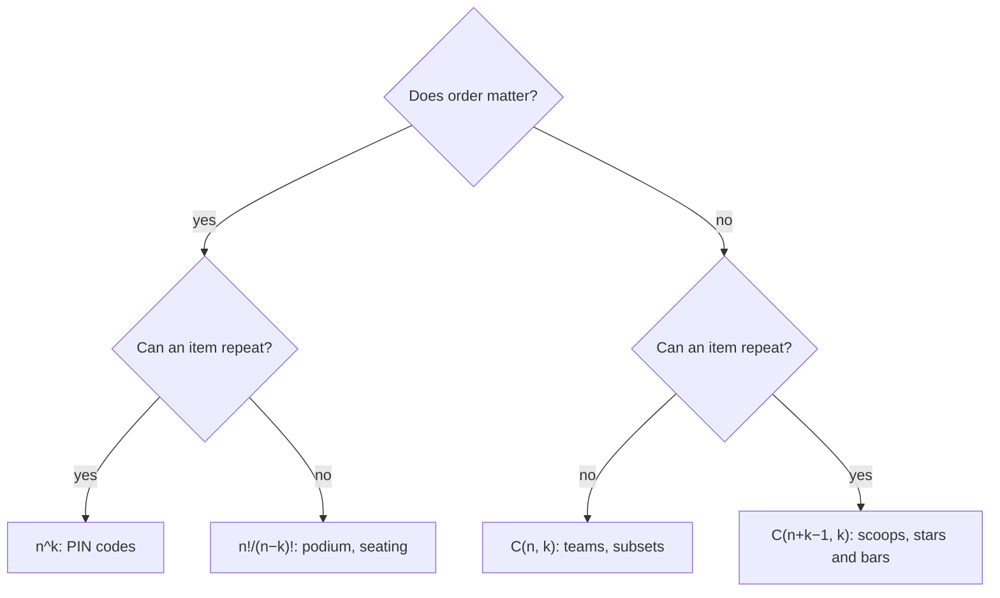

# Counting, Permutations and Combinations — How Many Ways?

Combinatorics is the art of counting without listing. How many passwords of length 8?
How many ways to order a playlist, pick a team, or walk across a grid? These questions
decide how long a brute-force search takes, what a probability is (favourable outcomes
over all outcomes), and what a dynamic-programming table should compute. This chapter
builds the whole toolkit from two rules — multiply for "and then", add for "or" — up to
permutations (with repeats, in a circle, with restrictions, next and k-th), combinations
(with conditions, generated in code), stars and bars, the binomial theorem, derangements, Catalan
numbers, and counting modulo a prime the way competitive programming requires.

**Where this fits:** Part 2 · Discrete maths, chapter 5 of 15. **Builds on:** [01 Reading maths like code](01_reading_maths_like_code.md) (Σ and Π notation); [04 Sets, relations and functions](04_sets_relations_functions.md) (sets and the pigeonhole principle). **Used again in:** 10, 15. **Next in order:** [06 Sequences, sums and recurrences](06_sequences_sums_recurrences.md).

## Where You Will Use This

| Question | Tool |
|---|---|
| How long will brute force take? | Product rule, factorials, $2^n$ |
| What is the probability of…? (chapter 10) | Count favourable outcomes ÷ count all outcomes |
| How many paths / subsets / arrangements satisfy X? | Combinations, stars and bars, DP |
| "Return the answer modulo 10⁹ + 7" | Modular factorials and inverses |
| Why does this recursion have 1, 2, 5, 14, 42 solutions? | Catalan numbers |
| Password or key strength | Product rule, then logs to get bits |

## Foundations — Count the Choices, Not the Results

Listing every outcome works for 10 outcomes, not for 10¹⁵. The trick is to describe
an outcome as **a sequence of choices** and count the choices.

> **Analogy:** Ordering at a café: 3 sizes, 4 drinks, 2 milk options. Every order is
> "pick a size, then a drink, then a milk". Draw it as a tree: 3 branches, each
> splitting into 4, each splitting into 2. The leaves are the orders:
> 3 × 4 × 2 = 24. You never have to draw the tree — you multiply the branching factors.



## 1 · The Two Rules

> **Definition:** **Product rule** — if a task is a sequence of steps, with $m$ ways to
> do the first and $n$ ways to do the second (whatever the first choice was), the task
> can be done in $m \cdot n$ ways. **Sum rule** — if a task can be done in one of
> several **non-overlapping** ways, add the counts.

In code: nested loops multiply, `if/elif` branches add.

> **Worked example:** Passwords of 8 characters from a–z, A–Z, 0–9 (62 symbols):
> $62^8$. Allowing lengths 6, 7 or 8 (non-overlapping cases): $62^6 + 62^7 + 62^8$.

```python
print(62**8)                           # → 218340105584896
print(62**6 + 62**7 + 62**8)           # → 221918520426688
import math
print(round(math.log2(62**8), 1))      # → 47.6
```

About 47.6 bits of entropy (chapter 13). At 10¹⁰ guesses per second (one GPU against a
fast hash), $62^8$ falls in about six hours — which is why password hashes are made
deliberately slow (bcrypt, scrypt, Argon2).

> **Watch out:** The sum rule needs **disjoint** cases. "Passwords that start with a
> digit or end with a digit" overlap (start *and* end with one), so use
> inclusion–exclusion from chapter 04: $\lvert A \cup B \rvert = \lvert A \rvert + \lvert B \rvert - \lvert A \cap B \rvert$.

## 2 · Permutations: Order Matters

How many ways to arrange n distinct items in a row? n choices for the first place,
n − 1 for the second, …, 1 for the last:

$$
n! = n \cdot (n-1) \cdots 2 \cdot 1, \qquad 0! = 1
$$

(0! = 1 because there is exactly one way to arrange nothing: the empty arrangement —
the empty-product rule from chapter 01.)

Arranging only $k$ of the n items ("k-permutations"):

$$
P(n, k) = n \cdot (n-1) \cdots (n-k+1) = \frac{n!}{(n-k)!}
$$

```python
import math
from itertools import permutations
print(math.factorial(10))                      # → 3628800
print(math.perm(10, 3), 10 * 9 * 8)            # → 720 720
print(len(list(permutations("abcd", 2))))      # → 12
print(f"{math.factorial(52):.3e}")             # → 8.066e+67
```

A shuffled deck of 52 cards is almost certainly an order that has never existed
before: $52! \approx 8 \times 10^{67}$.

> **Key idea:** Factorials grow faster than any exponential. $20! \approx 2.4 \times 10^{18}$
> — already more than a 64-bit counter can hold. "Try every ordering" is feasible only
> for about n ≤ 10–11 (the travelling salesman brute force); beyond that you need DP
> over subsets ($O(2^n n^2)$, workable to about n = 20) or heuristics.

> **Notebook example:** 8 runners race. In how many ways can gold, silver and bronze be
> awarded? In how many ways can all 8 finish?
>
> 1. Draw three slots: `[gold] [silver] [bronze]`.
> 2. **Gold:** any of the 8 runners, so 8 choices.
> 3. **Silver:** anyone except the gold winner, so 7 choices.
> 4. **Bronze:** 6 choices left.
> 5. Multiply (product rule): $8 \times 7 \times 6 = 336$. This is
>    $P(8, 3) = \frac{8!}{5!}$.
> 6. For the full finishing order, keep going down to 1:
>    $8! = 8 \cdot 7 \cdot 6 \cdot 5 \cdot 4 \cdot 3 \cdot 2 \cdot 1 = 40{,}320$.
>
> **Answer:** 336 podiums and 40,320 finishing orders. **Check:** order matters (gold
> ≠ silver) and nobody wins twice, so this is the "order matters, no repetition" case. ✓

### When some items are identical: divide out the repeats

How many different words can you make from the letters of MISSISSIPPI? Not 11!, because
swapping two S's gives the same word.

> **Analogy:** Paint a tiny number on each S (S₁, S₂, S₃, S₄) so all 11 letters are
> different: now there are 11! arrangements. Wipe the numbers off, and every real word
> was counted once for each way to order the four S's among themselves: 4! times. Divide
> it out. Do the same for the I's (4!) and the P's (2!).

$$
\frac{n!}{n_1!\, n_2! \cdots n_r!} \qquad\text{MISSISSIPPI: } \frac{11!}{1!\,4!\,4!\,2!} = 34{,}650
$$

The same formula (the **multinomial coefficient**) counts ways to split people into
labelled groups: 10 people into a team of 5, a team of 3 and a team of 2 is
$\frac{10!}{5!\,3!\,2!}$. With only two kinds of item it is just $\binom{n}{k}$: a
binary string with 3 ones and 7 zeros is "choose where the ones go".

```python
import math
from itertools import permutations
print(math.factorial(11) // (math.factorial(4) * math.factorial(4) * math.factorial(2)))   # → 34650
print(len(set(permutations("BANANA"))), math.factorial(6) // (math.factorial(3) * math.factorial(2)))   # → 60 60
print(math.factorial(10) // (math.factorial(5) * math.factorial(3) * math.factorial(2)))  # → 2520
```

> **Notebook example:** How many different arrangements are there of the letters of
> LETTER?
>
> 1. Count the letters: 6 in total. L × 1, E × 2, T × 2, R × 1.
> 2. If all 6 were different, there would be $6! = 720$ arrangements.
> 3. The two E's can swap places without changing the word, so divide by $2!$. Do the
>    same for the two T's.
> 4. $\frac{6!}{1!\,2!\,2!\,1!} = \frac{720}{4} = 180$.
>
> **Answer:** 180. **Check** on something tiny: AAB has $\frac{3!}{2!} = 3$
> arrangements, and the list AAB, ABA, BAA has exactly 3. ✓

### Arranging in a circle

Seat 5 people at a round table, where only who sits next to whom matters. Rotating
everyone one seat to the left gives the same seating, so each circular seating appears
5 times among the 5! row arrangements:

$$
\text{circular arrangements of } n = \frac{n!}{n} = (n-1)!
$$

Another way to see it: **fix one person's seat** (rotations no longer change anything),
then arrange the other $n - 1$ in a row. For a necklace or key ring, which can also be
flipped over, divide by 2 more: $(n-1)!/2$.

```python
from itertools import permutations

def canonical_rotation(p):
    return min(p[i:] + p[:i] for i in range(len(p)))

def canonical_necklace(p):
    return min(canonical_rotation(p), canonical_rotation(p[::-1]))

people = tuple("ABCDE")
print(len({canonical_rotation(p) for p in permutations(people)}))    # → 24
print(len({canonical_necklace(p) for p in permutations(people)}))    # → 12
```

> **Notebook example:** 6 people sit at a round table, and Ann and Ben insist on sitting
> together. How many seatings are there?
>
> 1. **Glue** Ann and Ben into one block. Now there are 5 units: the block and 4 others.
> 2. Arrange 5 units in a circle: $(5 - 1)! = 4! = 24$.
> 3. Inside the block they can sit Ann-Ben or Ben-Ann: $\times 2$.
> 4. $24 \times 2 = 48$.
>
> **Answer:** 48. **Check** with the complement: all circular seatings are $5! = 120$.
> By symmetry, Ann's two neighbours are equally likely to be any 2 of the other 5, so
> Ben sits next to Ann in $\frac{2}{5}$ of seatings: $120 \times \frac{2}{5} = 48$. ✓

### Restrictions: together, apart, in a fixed place

Most exam and interview counting questions are an arrangement with a rule attached.
Three techniques cover almost all of them:

| Rule | Technique | 6 people in a row |
|---|---|---|
| A and B **sit together** | **Glue** them into one block, arrange the blocks, then arrange inside the block | $5! \times 2! = 240$ |
| A and B **never together** | **Complement:** all arrangements minus "together" | $720 - 240 = 480$ |
| A **at one of the ends** | **Fill the restricted place first**, then the rest | $2 \times 5! = 240$ |
| No two of three chosen people **adjacent** | **Gaps:** arrange the others, then drop the three into the gaps between them | $3! \times P(4, 3) = 6 \times 24 = 144$ |

> **Worked example:** The gap method. Seat the 3 unrestricted people first: $3! = 6$
> ways. They leave 4 gaps, `_ X _ X _ X _`, counting both ends. Put each of the 3
> restricted people in a different gap, in order: $4 \times 3 \times 2 = 24$ ways.
> Total $6 \times 24 = 144$. Because each gap holds at most one of them, no two can be
> neighbours.

```python
from itertools import permutations
rows = list(permutations("ABCDEF"))
together = sum(abs(p.index("A") - p.index("B")) == 1 for p in rows)
print(len(rows), together, len(rows) - together)                  # → 720 240 480
print(sum(p[0] == "A" or p[-1] == "A" for p in rows))             # → 240
spaced = sum(all(abs(p.index(x) - p.index(y)) > 1 for x, y in ["AB", "AC", "BC"]) for p in rows)
print(spaced)                                                     # → 144
```

> **Watch out:** After gluing, don't forget the arrangements **inside** the block (the
> $\times 2!$). And check brute force on a small case like the one above before trusting
> a formula. `itertools` makes that a three-line check.

### Listing permutations in order

Interviewers rarely ask for $n!$. They ask you to **produce** permutations: all of them
(backtracking), the next one in dictionary order, or the k-th one. `itertools.permutations`
already yields them in lexicographic order when the input is sorted. The next two
algorithms get from one permutation to another without listing everything.

**Next permutation** (the C++ `std::next_permutation`), in four steps:

1. Scan from the right for the first item that is smaller than its right neighbour: the
   **pivot**. Everything to its right is descending, so it is already as large as it
   can be.
2. In that suffix, find the rightmost item larger than the pivot: the **successor**.
3. Swap them.
4. Reverse the suffix, turning it from its largest order into its smallest.

**The k-th permutation** skips the listing entirely. With 4 items, the first item stays
the same for blocks of $3! = 6$ permutations: 1 first in #1–6, 2 first in #7–12, and so
on. So $(k - 1) \div 3!$ tells you the first item, the remainder says where you are
inside the block, and the same step repeats with $2!$, then $1!$. This is the
**factorial number system**: it works like an odometer whose wheels have n, n − 1, …, 1
positions.

```python
import math
from itertools import permutations

def next_permutation(a):
    a = list(a)
    i = len(a) - 2
    while i >= 0 and a[i] >= a[i + 1]:      # 1. pivot
        i -= 1
    if i < 0:
        return a[::-1]                      # last permutation: wrap to the first
    j = len(a) - 1
    while a[j] <= a[i]:                     # 2. successor
        j -= 1
    a[i], a[j] = a[j], a[i]                 # 3. swap
    a[i + 1:] = reversed(a[i + 1:])         # 4. reverse the suffix
    return a

def kth_permutation(n, k):                  # k counts from 1
    items, out, k = list(range(1, n + 1)), [], k - 1
    for pos in range(n, 0, -1):
        block = math.factorial(pos - 1)
        out.append(items.pop(k // block))
        k %= block
    return out

print(next_permutation([1, 3, 5, 4, 2]))           # → [1, 4, 2, 3, 5]
print(next_permutation([3, 2, 1]))                 # → [1, 2, 3]
print(kth_permutation(4, 10))                      # → [2, 3, 4, 1]
print(list(list(permutations(range(1, 5)))[9]))    # → [2, 3, 4, 1]
```

Both run in $O(n)$ and $O(n^2)$ time respectively, instead of $O(n!)$. Next
permutation also handles repeated items (use `>=` and `<=` as written), so it steps
through only the *distinct* arrangements.

> **Notebook example:** Find the permutation right after `1 3 5 4 2`, and the 10th
> permutation of `1 2 3 4` in dictionary order.
>
> 1. **Pivot:** scan from the right. 2 < 4 (rising), 4 < 5 (rising), then 3 < 5, so the
>    run stops. The pivot is **3**, and the suffix `5 4 2` is descending.
> 2. **Successor:** the rightmost number in the suffix bigger than 3 is **4**.
> 3. **Swap** 3 and 4: `1 4 5 3 2`.
> 4. **Reverse the suffix** `5 3 2` into `2 3 5`: the answer is `1 4 2 3 5`.
> 5. **k-th:** subtract one, since counting starts at 0: $10 - 1 = 9$.
> 6. Blocks of $3! = 6$: $9 \div 6 = 1$ remainder 3. Take item number 1 (counting from 0)
>    of `1 2 3 4`, which is **2**. Left: `1 3 4`.
> 7. Blocks of $2! = 2$: $3 \div 2 = 1$ remainder 1. Item 1 of `1 3 4` is **3**. Left:
>    `1 4`.
> 8. Blocks of $1! = 1$: $1 \div 1 = 1$ remainder 0. Item 1 of `1 4` is **4**. Left: `1`.
>
> **Answer:** `1 4 2 3 5`, and the 10th permutation is `2 3 4 1`. **Check:** the 7th
> to 12th permutations all start with 2 (2134, 2143, 2314, 2341, …), and the 10th is
> 2341. ✓

**Try it: step through both algorithms.** In *next permutation* mode press **Step** and
watch the pivot rise, the successor light up, the swap, and the suffix flip. Start from
`1 1 2 3` to see the repeated item handled. In *k-th permutation* mode, drag k and read
each position off the division table.

<div class="lab" data-viz="math-perm"></div>

## 3 · Combinations: Order Does Not Matter

Choosing a **set** of k items from n — a team, a hand of cards, which bits are set:

$$
\binom{n}{k} = \frac{n!}{k!\,(n-k)!}
$$

read "n choose k". Why divide? $P(n, k)$ counts ordered selections; each unordered
set of k items appears in $k!$ orders, so divide by $k!$ to count each set once.

> **Worked example:** Choose 2 toppings from 5. Ordered: 5 × 4 = 20. Each pair, like
> {ham, olive}, was counted twice (ham-then-olive, olive-then-ham), so there are
> 20 / 2 = 10 pairs.

```python
import math
from itertools import combinations
print(math.comb(5, 2), len(list(combinations(range(5), 2))))   # → 10 10
print(math.comb(52, 5))                                        # → 2598960
print(math.comb(10, 3) == math.comb(10, 7))                    # → True
```

Symmetry, $\binom{n}{k} = \binom{n}{n-k}$: choosing which 3 to take is the same as
choosing which 7 to leave.

> **Notebook example:** Work out $\binom{8}{3}$ by hand, then count 5-card poker hands
> with exactly two aces.
>
> 1. Write only the top k factors of $n!$ over $k!$:
>    $\binom{8}{3} = \frac{8 \cdot 7 \cdot 6}{3 \cdot 2 \cdot 1}$.
> 2. **Cancel before multiplying:** $3 \cdot 2 = 6$ cancels the 6 on top, leaving
>    $8 \cdot 7 = 56$.
> 3. Hands with exactly two aces: choose the 2 aces from the 4 aces, **and** the other
>    3 cards from the 48 non-aces. Multiply.
> 4. $\binom{4}{2} = \frac{4 \cdot 3}{2} = 6$. $\binom{48}{3} = \frac{48 \cdot 47 \cdot 46}{6} = 8 \cdot 47 \cdot 46 = 17{,}296$.
> 5. $6 \times 17{,}296 = 103{,}776$.
>
> **Answer:** $\binom{8}{3} = 56$, and 103,776 hands. **Check:** 103,776 out of 2,598,960
> hands is about 4%, which sounds right for "two aces".

### Choosing with conditions

A committee of 4 is chosen from 6 men and 5 women. Split the question into disjoint
cases, or count the complement:

| Condition | Count |
|---|---|
| Any 4 people | $\binom{11}{4} = 330$ |
| Exactly 2 women | $\binom{5}{2}\binom{6}{2} = 10 \times 15 = 150$ (choose the women **and** the men: multiply) |
| At least 1 woman | $330 - \binom{6}{4} = 330 - 15 = 315$ (all committees minus the all-male ones) |
| A and B are not both on it | $330 - \binom{9}{2} = 330 - 36 = 294$ (subtract the committees containing both) |

> **Watch out:** The tempting shortcut for "at least one woman" is *pick one woman,
> then any 3 of the other 10*: $5 \times \binom{10}{3} = 600$. That is more than all 330
> committees! A committee with two women, W₁ and W₂, is counted once with W₁ as "the"
> woman and once with W₂. Whenever you build "at least one" by first choosing a
> special member, you are double-counting. Use the complement.

```python
import math
from itertools import combinations
people = [f"M{i}" for i in range(6)] + [f"W{i}" for i in range(5)]
committees = list(combinations(people, 4))
women = lambda c: sum(p[0] == "W" for p in c)
print(len(committees), sum(women(c) == 2 for c in committees))                  # → 330 150
print(sum(women(c) >= 1 for c in committees), 5 * math.comb(10, 3))              # → 315 600
print(sum(not ("M0" in c and "W0" in c) for c in committees))                    # → 294
```

> **Notebook example:** From 6 men and 5 women, how many committees of 4 contain **at
> most one** woman?
>
> 1. "At most one" splits into two disjoint cases: exactly 0 women, or exactly 1.
> 2. **0 women:** all 4 from the men: $\binom{6}{4} = \binom{6}{2} = \frac{6 \cdot 5}{2} = 15$.
> 3. **1 woman:** choose her ($\binom{5}{1} = 5$) and 3 men
>    ($\binom{6}{3} = \frac{6 \cdot 5 \cdot 4}{6} = 20$). Multiply: $5 \times 20 = 100$.
> 4. The cases do not overlap, so add them: $15 + 100 = 115$.
>
> **Answer:** 115. **Check:** add the cases for 2, 3 and 4 women,
> $\binom{5}{2}\binom{6}{2} + \binom{5}{3}\binom{6}{1} + \binom{5}{4} = 150 + 60 + 5 = 215$.
> Then $115 + 215 = 330 = \binom{11}{4}$, all committees. ✓

### Every subset and every combination, in code

The $2^n$ subsets of n items match the $2^n$ binary numbers from 0 to $2^n - 1$: bit i
says whether item i is in. Combinations of size k are the subsets whose number has
exactly k one-bits. For the "generate them all" interview questions, backtracking builds
the same lists one choice at a time:

```python
def subsets(items):
    n = len(items)
    return [[items[i] for i in range(n) if mask >> i & 1] for mask in range(1 << n)]

def choose(items, k, start=0, cur=None):
    cur = [] if cur is None else cur
    if len(cur) == k:
        return [cur[:]]
    out = []
    for i in range(start, len(items)):
        cur.append(items[i])                    # take item i
        out += choose(items, k, i + 1, cur)     # later items only, so no repeats
        cur.pop()                               # undo, try the next item
    return out

print(subsets("abc"))           # → [[], ['a'], ['b'], ['a', 'b'], ['c'], ['a', 'c'], ['b', 'c'], ['a', 'b', 'c']]
print(choose("abcd", 2))        # → [['a', 'b'], ['a', 'c'], ['a', 'd'], ['b', 'c'], ['b', 'd'], ['c', 'd']]
```

Starting the loop at `i + 1` is what makes this combinations and not permutations: an
item can only be followed by later items, so each set appears once, in sorted order.
Loop over *all* unused items instead and you get permutations.

### Pascal's triangle and Pascal's rule

$$
\binom{n}{k} = \binom{n-1}{k-1} + \binom{n-1}{k}
$$

Proof by story (a **combinatorial proof**): look at one particular item. Either the
chosen set includes it (then choose the remaining $k - 1$ from the other $n - 1$) or it
does not (choose all $k$ from the other $n - 1$). The cases do not overlap, so add.
That sentence is also the recurrence for a DP table of binomial coefficients.

**Try it: explore the triangle.** Click any cell: it is the sum of the two cells above
(highlighted), and the chips show the factorial formula. Switch to *odd / even* to
reveal Sierpiński's triangle, and to *row sums* to see every row add up to $2^n$.

<div class="lab" data-viz="math-pascal"></div>

## 4 · Which Formula? The Four Cases

Almost every "how many ways" question is one of these, decided by two yes/no
questions: **does order matter?** and **can an item be picked more than once?**

| | Repetition allowed | No repetition |
|---|---|---|
| **Order matters** | $n^k$ — PIN codes, strings of length k | $\frac{n!}{(n-k)!}$ — podium places, seating |
| **Order does not matter** | $\binom{n+k-1}{k}$ — scoops of ice cream, multisets | $\binom{n}{k}$ — teams, lottery tickets, subsets |

```python
import math
from itertools import product, permutations, combinations, combinations_with_replacement
n, k, S = 4, 2, "abcd"
print(len(list(product(S, repeat=k))), n**k)                                    # → 16 16
print(len(list(permutations(S, k))), math.perm(n, k))                           # → 12 12
print(len(list(combinations(S, k))), math.comb(n, k))                           # → 6 6
print(len(list(combinations_with_replacement(S, k))), math.comb(n + k - 1, k))  # → 10 10
```

Python's `itertools` has one generator per cell of the table — a handy way to check a
count by brute force on small inputs before trusting a formula on big ones.



> **Notebook example:** For each question, answer the two questions (order? repeats?),
> then pick the formula.
>
> | Question | Order matters? | Repeats? | Formula | Count |
> |---|---|---|---|---|
> | 4-letter codes from A–Z, letters may repeat | yes | yes | $26^4$ | 456,976 |
> | President, secretary, treasurer from 20 members | yes | no | $20 \cdot 19 \cdot 18$ | 6,840 |
> | 3 delegates from 20 members | no | no | $\binom{20}{3} = \frac{6840}{6}$ | 1,140 |
> | A box of 12 doughnuts from 5 flavours | no | yes | $\binom{12 + 5 - 1}{12} = \binom{16}{4}$ | 1,820 |
>
> **Check** the middle two rows: the officers and the delegates are the same 3 people,
> but officers have roles. So $6840 / 3! = 1140$. ✓

**Try it: see all four cases.** Pick n and k and answer the two questions: the lab lists
every outcome, with each row holding the orderings of one selection. With *order
matters* on and *repeats* off, every row has exactly k! entries. Turn order off and each
row collapses to one: that is the division by k!. Then turn repeats on and notice the
rows now have **different** sizes. That is why the fourth cell needs stars and bars
instead of a division. The example buttons load a PIN code, a podium, a team and
ice-cream scoops.

<div class="lab" data-viz="math-choose"></div>

## 5 · Stars and Bars

How many ways to give 10 identical cookies to 3 children (some may get none)? Lay the
10 cookies in a row as stars and insert 2 bars to cut the row into 3 groups:

```
★★★|★★★★★|★★      → 3, 5, 2
|★★★★★★★★★★|      → 0, 10, 0
```

Every arrangement of 10 stars and 2 bars is one distribution, and vice versa. So count
the ways to place 2 bars among 12 positions: $\binom{12}{2} = 66$.

> **Definition:** The number of ways to write $n$ as an ordered sum of $k$ non-negative
> integers ($x_1 + \dots + x_k = n$, each $x_i \ge 0$) is $\binom{n + k - 1}{k - 1}$.
> If each child must get at least one, hand out one each first:
> $\binom{n - 1}{k - 1}$.

```python
import math
brute = sum(1 for a in range(11) for b in range(11) if 10 - a - b >= 0)
print(brute, math.comb(12, 2))   # → 66 66
print(math.comb(9, 2))           # → 36
```

This is the fourth cell of the table: choosing k scoops from n flavours with
repetition is distributing k identical scoops among n flavours.

> **Notebook example:** How many solutions does $x_1 + x_2 + x_3 + x_4 = 10$ have in
> non-negative integers, if $x_1 \ge 2$?
>
> 1. Deal with the lower bound first: give $x_1$ its 2 up front. That leaves
>    $10 - 2 = 8$ to share freely.
> 2. Now count $y_1 + x_2 + x_3 + x_4 = 8$ with everything $\ge 0$: 8 stars and $4 - 1 = 3$
>    bars.
> 3. Choose where the 3 bars go among $8 + 3 = 11$ positions:
>    $\binom{11}{3} = \frac{11 \cdot 10 \cdot 9}{6} = 165$.
>
> **Answer:** 165. **Check** the method on a tiny case: $x_1 + x_2 = 2$ gives
> $\binom{3}{1} = 3$, and the list (0,2), (1,1), (2,0) has 3 solutions. ✓

## 6 · The Binomial Theorem

Expand $(a + b)^n$: each of the n brackets contributes either an a or a b. The terms
with exactly $k$ b's come from choosing which $k$ brackets supply them:

$$
(a + b)^n = \sum_{k=0}^{n} \binom{n}{k} a^{n-k} b^{k}
$$

So the rows of Pascal's triangle are the coefficients: $(a+b)^3 = a^3 + 3a^2b + 3ab^2 + b^3$.
Two quick consequences:

- Set $a = b = 1$: $\sum_k \binom{n}{k} = 2^n$ — every subset has some size.
- Set $a = 1, b = -1$: $\sum_k (-1)^k \binom{n}{k} = 0$ — a non-empty set has as many
  even-sized subsets as odd-sized ones.

```python
import math
n = 6
print(sum(math.comb(n, k) for k in range(n + 1)))                 # → 64
print(sum((-1)**k * math.comb(n, k) for k in range(n + 1)))       # → 0
```

> **In practice:** The binomial distribution in chapter 10 — "the chance of exactly k
> heads in n flips" — is $\binom{n}{k} p^k (1-p)^{n-k}$: one term of this expansion.

> **Notebook example:** Expand $(x + 2)^4$, and find the coefficient of $x^2$ in
> $(2x - 1)^5$.
>
> 1. Row 4 of Pascal's triangle is 1, 4, 6, 4, 1.
> 2. Term k is $\binom{4}{k} x^{4-k} 2^k$: $1 \cdot x^4$, $4 \cdot 2x^3$, $6 \cdot 4x^2$,
>    $4 \cdot 8x$, $1 \cdot 16$.
> 3. So $(x + 2)^4 = x^4 + 8x^3 + 24x^2 + 32x + 16$.
> 4. **Check** with $x = 1$: the left side is $3^4 = 81$ and the right side is
>    $1 + 8 + 24 + 32 + 16 = 81$. ✓
> 5. In $(2x - 1)^5$ a term is $\binom{5}{k}(2x)^{5-k}(-1)^k$. For $x^2$ you need
>    $5 - k = 2$, so $k = 3$: $\binom{5}{3} \cdot 2^2 \cdot (-1)^3 = 10 \cdot 4 \cdot (-1) = -40$.
>
> **Answer:** $x^4 + 8x^3 + 24x^2 + 32x + 16$, and $-40$.

## 7 · From Formula to Dynamic Programming: Grid Paths

How many ways from the top-left to the bottom-right corner of an $r \times c$ grid,
moving only right or down? Every path is $r - 1$ downs and $c - 1$ rights in some
order, so choose which positions are downs: $\binom{r + c - 2}{r - 1}$.

Now block a few cells. The formula dies; the **recurrence** survives: the number of
ways to reach a cell is the ways to reach the cell above plus the ways to reach the
cell to the left (you arrive from exactly one of them — the sum rule), and a blocked
cell has 0 ways.

**Try it: from formula to DP.** Press *Fill the table* and watch each cell become the sum
of the cell above and the cell to its left. The corner equals the formula. Now click
cells to block them: the formula chip stops applying, but the table still counts
correctly.

<div class="lab" data-viz="math-paths"></div>

```python
import math

def grid_paths(rows, cols, blocked=frozenset()):
    ways = [[0] * cols for _ in range(rows)]
    for r in range(rows):
        for c in range(cols):
            if (r, c) in blocked:
                continue
            if r == 0 and c == 0:
                ways[r][c] = 1
            else:
                ways[r][c] = (ways[r - 1][c] if r else 0) + (ways[r][c - 1] if c else 0)
    return ways[-1][-1]

print(grid_paths(4, 6), math.comb(8, 3))       # → 56 56
print(grid_paths(4, 6, {(1, 1), (2, 3)}))      # → 14
```

> **Notebook example:** A grid has 3 rows and 4 columns, and the cell in row 1,
> column 1 (counting from 0) is blocked. Count the right/down paths from the top-left to
> the bottom-right corner.
>
> 1. Top row and left column: only one way to reach each cell (keep going right, or
>    keep going down), so they are all 1.
> 2. The blocked cell is 0.
> 3. Fill the rest row by row: each cell = the cell above + the cell to the left.
>
> | | col 0 | col 1 | col 2 | col 3 |
> |---|---|---|---|---|
> | **row 0** | 1 | 1 | 1 | 1 |
> | **row 1** | 1 | ✗ 0 | 0 + 1 = 1 | 1 + 1 = 2 |
> | **row 2** | 1 | 0 + 1 = 1 | 1 + 1 = 2 | 2 + 2 = 4 |
>
> **Answer:** 4 paths. **Check:** without the block the formula gives
> $\binom{2 + 3}{2} = 10$. The block removes the paths through it, $2 \times 3 = 6$
> (2 ways in, 3 ways out), and $10 - 6 = 4$. ✓

> **Key idea:** A counting recurrence is a DP. "Ways to reach a state = sum over the
> last move of ways to reach the previous state" solves climbing stairs, coin-change
> counts, decode ways and unique paths. Whenever you can split outcomes by their
> **last step** into disjoint cases, add them up.

## 8 · Inclusion–Exclusion in Action: Derangements

A **derangement** is a permutation where nothing stays in its original place — every
guest leaves a party with someone else's coat. How many are there?

Start with all $n!$ permutations. Subtract those fixing at least one chosen item, add
back those fixing at least two (subtracted twice), and so on:

$$
D(n) = n! \sum_{k=0}^{n} \frac{(-1)^k}{k!}
$$

```python
import math
from itertools import permutations

def derangements_formula(n):
    return round(math.factorial(n) * sum((-1)**k / math.factorial(k) for k in range(n + 1)))

def derangements_brute(n):
    return sum(all(p[i] != i for i in range(n)) for p in permutations(range(n)))

print([derangements_formula(n) for n in range(1, 8)])   # → [0, 1, 2, 9, 44, 265, 1854]
print([derangements_brute(n) for n in range(1, 8)])     # → [0, 1, 2, 9, 44, 265, 1854]
print(round(derangements_formula(10) / math.factorial(10), 6), round(1 / math.e, 6))   # → 0.367879 0.367879
```

The sum is the start of the series for $e^{-1}$ (chapter 12), so the fraction of
permutations that are derangements approaches $1/e \approx 36.8\%$ — astonishingly, it
barely depends on n. A random Secret Santa draw has about a 37% chance that nobody
draws themselves.

> **Notebook example:** 4 people drop their coats in a pile and each grabs one at
> random. In how many ways does **nobody** get their own coat?
>
> 1. All ways: $4! = 24$.
> 2. Subtract the ways that fix at least one chosen person. Choose that person
>    ($\binom{4}{1}$) and arrange the rest ($3!$): $4 \times 6 = 24$.
> 3. Pairs were subtracted twice, so add them back: $\binom{4}{2} \times 2! = 6 \times 2 = 12$.
> 4. Subtract triples: $\binom{4}{3} \times 1! = 4$. Add back all four: $\binom{4}{4} \times 0! = 1$.
> 5. $D(4) = 24 - 24 + 12 - 4 + 1 = 9$.
>
> **Answer:** 9 of the 24 ways, or 37.5%, already close to $1/e \approx 36.8\%$.
> **Check** with the recurrence $D(n) = (n - 1)\big(D(n-1) + D(n-2)\big)$ and
> $D(2) = 1$, $D(3) = 2$: $D(4) = 3 \times (2 + 1) = 9$. ✓

## 9 · Catalan Numbers: the Sequence Behind Recursion Puzzles

How many ways to write n pairs of balanced parentheses? For n = 3:
`((()))`, `(()())`, `(())()`, `()(())`, `()()()` — five. The sequence 1, 1, 2, 5, 14,
42, 132, … is the **Catalan numbers**:

$$
C_n = \frac{1}{n+1}\binom{2n}{n}, \qquad C_0 = 1, \qquad C_{n+1} = \sum_{i=0}^{n} C_i\, C_{n-i}
$$

The recurrence comes from splitting at the first `(`'s matching `)`: some balanced
string of i pairs inside it, and some string of $n - i$ pairs after it — a product
(both parts independently), summed over the split (disjoint cases).

The same numbers count the **shapes of binary search trees with n nodes** (pick the
root; left and right subtrees are independent), ways to triangulate a polygon,
mountain ranges, and valid stack push/pop sequences. When a recursive count gives 1,
2, 5, 14, you have met Catalan.

```python
import math
from functools import lru_cache

def catalan(n):
    return math.comb(2 * n, n) // (n + 1)

@lru_cache(None)
def bst_shapes(n):
    if n <= 1:
        return 1
    return sum(bst_shapes(i) * bst_shapes(n - 1 - i) for i in range(n))

def balanced(n):
    out = []
    def go(s, open_, close):
        if len(s) == 2 * n:
            out.append(s)
            return
        if open_ < n:
            go(s + "(", open_ + 1, close)
        if close < open_:
            go(s + ")", open_, close + 1)
    go("", 0, 0)
    return out

print([catalan(n) for n in range(8)])              # → [1, 1, 2, 5, 14, 42, 132, 429]
print([bst_shapes(n) for n in range(8)])           # → [1, 1, 2, 5, 14, 42, 132, 429]
print(len(balanced(4)), balanced(3))               # → 14 ['((()))', '(()())', '(())()', '()(())', '()()()']
```

> **Notebook example:** How many ways are there to arrange 4 pairs of brackets? Use the
> recurrence, then check with the formula.
>
> 1. Known values: $C_0 = 1$, $C_1 = 1$, $C_2 = 2$, $C_3 = 5$.
> 2. Split at the bracket matching the first `(`: i pairs inside it and $3 - i$ after it.
>    $C_4 = C_0C_3 + C_1C_2 + C_2C_1 + C_3C_0$.
> 3. $= 1 \cdot 5 + 1 \cdot 2 + 2 \cdot 1 + 5 \cdot 1 = 5 + 2 + 2 + 5 = 14$.
> 4. Formula: $C_4 = \frac{1}{5}\binom{8}{4} = \frac{70}{5} = 14$. ✓
>
> **Answer:** 14. That is also the number of shapes of a binary search tree with 4 keys.

## 10 · Counting Modulo a Prime

Counts explode: $\binom{1000}{500}$ has 300 digits. Contest and interview problems
therefore ask for the answer **modulo $10^9 + 7$** (a prime, and small enough that the
product of two residues fits in 64 bits). Addition, subtraction and multiplication
work mod p (chapter 07). **Division does not** — you cannot compute $\frac{n!}{k!(n-k)!} \bmod p$
by dividing remainders. Instead multiply by **modular inverses**: since p is prime,
Fermat's little theorem gives $a^{-1} \equiv a^{p-2} \pmod p$.

```python
import math
MOD = 10**9 + 7

def make_ncr(limit):
    fact = [1] * (limit + 1)
    for i in range(1, limit + 1):
        fact[i] = fact[i - 1] * i % MOD
    inv = [1] * (limit + 1)
    inv[limit] = pow(fact[limit], MOD - 2, MOD)          # Fermat inverse, O(log MOD)
    for i in range(limit, 0, -1):
        inv[i - 1] = inv[i] * i % MOD                    # 1/(i-1)! = i / i!
    return lambda n, k: 0 if k < 0 or k > n else fact[n] * inv[k] % MOD * inv[n - k] % MOD

ncr = make_ncr(2000)
print(ncr(1000, 500))                           # → 159835829
print(math.comb(1000, 500) % MOD)               # → 159835829
print(len(str(math.comb(1000, 500))))           # → 300
```

After O(limit) setup, every $\binom{n}{k} \bmod p$ is O(1). Chapter 07 explains why
the inverse exists and why $p$ must be prime.

> **Notebook example:** Compute $\binom{5}{2} \bmod 7$ the way a program must, using
> inverses instead of division.
>
> 1. $5! = 120$, and $120 \bmod 7 = 120 - 119 = 1$.
> 2. $2! = 2$ and $3! = 6$.
> 3. Inverse of 2 mod 7: $2 \times 4 = 8 \equiv 1$, so it is 4. By Fermat,
>    $2^{7-2} = 32 = 4 \cdot 7 + 4 \equiv 4$. ✓
> 4. Inverse of 6 mod 7: $6 \times 6 = 36 = 35 + 1 \equiv 1$, so it is 6.
> 5. $\binom{5}{2} \equiv 1 \times 4 \times 6 = 24 \equiv 24 - 21 = 3 \pmod 7$.
>
> **Answer:** 3. **Check:** $\binom{5}{2} = 10$, and $10 \bmod 7 = 3$. ✓

## 11 · How Big Is the Search Space?

Before coding a brute force, count what it enumerates:

| n | $n^2$ | $2^n$ (subsets) | $n!$ (orderings) |
|---|---|---|---|
| 10 | 100 | 1,024 | 3,628,800 |
| 20 | 400 | 1,048,576 | 2.4 × 10¹⁸ |
| 30 | 900 | 1.07 × 10⁹ | 2.7 × 10³² |
| 60 | 3,600 | 1.15 × 10¹⁸ | 8.3 × 10⁸¹ |

With roughly 10⁸ simple steps per second in a compiled language (10⁷ in Python),
subsets are fine to n ≈ 20–25 and orderings to n ≈ 10–11. The CS Fundamentals growth
lab turns this table into wall-clock time.

<div class="lab" data-viz="cs-growth"></div>

> **Notebook example:** Can brute force solve the travelling salesman problem for 15
> cities in a compiled language?
>
> 1. Fix the starting city. The other 14 can be visited in $14!$ orders, and each tour is
>    counted twice (once in each direction): $\frac{14!}{2}$ tours.
> 2. $14! = 87{,}178{,}291{,}200$, so there are about $4.4 \times 10^{10}$ tours.
> 3. At $10^8$ simple steps per second, that is at least $440$ seconds, about 7 minutes,
>    and more because each tour costs 15 additions.
> 4. Bitmask DP instead: $2^{15} \times 15^2 \approx 32{,}768 \times 225 \approx 7.4 \times 10^6$
>    steps, about 0.07 seconds.
>
> **Answer:** brute force is borderline at 15 cities and hopeless at 20. DP over subsets
> is instant. Counting first told you which algorithm to write.

## Common Mistakes

1. **Using the sum rule on overlapping cases.** Check the cases are disjoint, or use
   inclusion–exclusion.
2. **Counting ordered selections when order does not matter** (forgetting to divide
   by $k!$), or the reverse.
3. **Double-counting symmetric situations**, e.g. counting a handshake between A and B
   twice; there are $\binom{n}{2}$ handshakes, not $n(n-1)$.
4. **Dividing remainders mod p.** Multiply by the modular inverse instead.
5. **Overflowing intermediate values** when computing $\binom{n}{k}$ as
   `factorial(n) / (factorial(k) * factorial(n-k))` in fixed-width integers; multiply
   and divide incrementally, or work mod p.

## Check Yourself

**1.** How many 4-digit PINs have all digits different? How many have at least one
repeated digit?

<details>
<summary>Open the answer</summary>

All different: $10 \cdot 9 \cdot 8 \cdot 7 = 5040$ (order matters, no repetition). At
least one repeat is easier by the **complement**: all PINs minus all-different,
$10^4 - 5040 = 4960$. "At least one" questions are almost always easier this way.

</details>

**2.** A tournament has 16 teams and every pair plays once. How many games? If it is
knock-out instead?

<details>
<summary>Open the answer</summary>

Round-robin: $\binom{16}{2} = 120$. Knock-out: 15 — every game eliminates exactly one
team and 15 must be eliminated. Counting by what each step *does* often beats counting
the steps directly.

</details>

**3.** How many non-negative integer solutions does $x + y + z = 7$ have? How many
with each variable at least 1?

<details>
<summary>Open the answer</summary>

Stars and bars: $\binom{7 + 2}{2} = 36$. With each ≥ 1, give one to each first, leaving
4: $\binom{4 + 2}{2} = 15$ (equivalently $\binom{6}{2}$).

</details>

**4.** How many binary strings of length 10 have exactly 3 ones? How many have at
most 3?

<details>
<summary>Open the answer</summary>

Choose the positions of the ones: $\binom{10}{3} = 120$. At most 3: $\binom{10}{0} + \binom{10}{1} + \binom{10}{2} + \binom{10}{3} = 1 + 10 + 45 + 120 = 176$.

</details>

**5.** How many different arrangements of the letters of BANANA are there? How many
with the three A's all together?

<details>
<summary>Open the answer</summary>

Identical items: $\frac{6!}{3!\,2!\,1!} = 60$ (three A's, two N's, one B). With the A's
glued into one block `AAA`, arrange 4 things (AAA, N, N, B) with two identical N's:
$\frac{4!}{2!} = 12$. Nothing extra is needed for the inside of the block, because the
A's are identical.

</details>

**6.** Eight people sit at a round table, and two of them refuse to sit next to each
other. How many seatings are there?

<details>
<summary>Open the answer</summary>

All circular seatings: $(8 - 1)! = 5040$. Seatings where the two *are* together: glue
them into a block, giving 7 units in a circle, $(7 - 1)! = 720$, times 2 for the order
inside the block, which is 1440. Complement: $5040 - 1440 = 3600$.

</details>

**7.** What is the 5th permutation of `1 2 3` in dictionary order, and what comes right
after `1 5 8 4 7 6 5 3 1`?

<details>
<summary>Open the answer</summary>

k-th: $k - 1 = 4$. Blocks of $2! = 2$: $4 \div 2 = 2$, so the first item is the third
remaining one, **3**; remainder 0, so the rest stays in order, **1 2**. Answer
`3 1 2` (the list is 123, 132, 213, 231, 312, 321).

Next: the pivot is **4** (the first item from the right that is smaller than its right
neighbour, 7); the suffix `7 6 5 3 1` is descending. The successor is the rightmost item
larger than 4, which is **5**. Swap to get `1 5 8 5 7 6 4 3 1`, then reverse the
suffix: `1 5 8 5 1 3 4 6 7`.

</details>

## What Each Level Should Know

| Level | Expected |
|---|---|
| **Getting started** | Product and sum rules; factorials; permutations vs combinations; Pascal's triangle |
| **Interview-ready** | The four-case table; identical items, circular seating and the glue, gap and complement methods; committees with conditions; generating subsets, combinations and permutations; next and k-th permutation; complement counting; stars and bars; turning a count into a DP recurrence by the last step; sizing brute-force search spaces; nCr mod p with precomputed factorials and Fermat inverses |
| **Going deeper** | Combinatorial proofs; inclusion–exclusion (derangements, surjections); Catalan numbers and their bijections; generating functions |

## Checklist

- [ ] I decide "order matters?" and "repetition allowed?" before choosing a formula.
- [ ] I use the complement for "at least one" questions, and never "pick one special member first".
- [ ] I can count arrangements with identical items, around a circle, and with together, apart or fixed-place rules.
- [ ] I can write next permutation and k-th permutation without looking them up.
- [ ] I can prove Pascal's rule with a story and use it as a DP.
- [ ] I can count distributions with stars and bars.
- [ ] I recognise Catalan numbers from their first terms.
- [ ] I can compute $\binom{n}{k} \bmod 10^9 + 7$ efficiently and explain why division needs an inverse.
