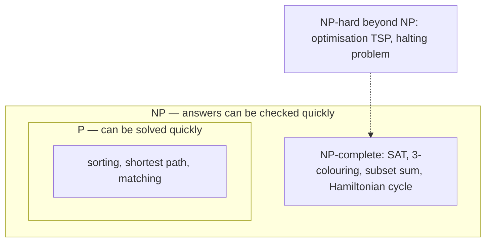

# Automata, Computability and Complexity — What Computers Can and Cannot Do

Every other chapter asks how to compute something. This one asks the deeper questions:
what can a machine with a given kind of memory recognise, what can **no** program ever
compute, and what can be computed in principle but — as far as anyone knows — not
efficiently? The answers are practical. They explain regular expressions and why
some regexes freeze servers, why you cannot parse HTML with a regex, how parsers and
compilers work, why perfect static analysis is impossible, and what to do when your
problem turns out to be NP-hard.

**Where this fits:** Part 4 · Maths behind computing, chapter 14 of 15. **Builds on:** [03 Logic and proofs](03_logic_and_proofs.md) (proof by contradiction); [04 Sets, relations and functions](04_sets_relations_functions.md) (countable and uncountable sets). **Used again in:** 15. **Next in order:** [15 Interview maths toolkit](15_interview_maths_toolkit.md).

## Where You Will Use This

| Where | Theory inside |
|---|---|
| Regex engines, lexers, input validation | Finite automata and regular languages |
| ReDoS (a regex that hangs a server) | Backtracking vs automaton-based matching |
| Parsers, compilers, JSON/SQL/config languages | Context-free grammars, recursive descent, stacks |
| Protocols and UI flows (TCP, checkout, auth) | State machines |
| Linters, type checkers, antivirus | Undecidability: they must approximate |
| "This scheduling/routing problem is slow" | NP-hardness; exact vs approximate vs heuristic |

## Foundations — Machines Defined by Their Memory

A **model of computation** is a precise, minimal description of a machine: what it can
read, what it can remember, and how it moves between steps. The models form a ladder, and
each rung is defined by its **memory**:

| Machine | Memory | Recognises | Everyday example |
|---|---|---|---|
| Finite automaton | a fixed number of states | **regular** languages | regexes, lexers, protocol state machines |
| Pushdown automaton | states + one **stack** | **context-free** languages | parsers for nested syntax (JSON, code) |
| Turing machine | states + unbounded **tape** | everything computable | every real computer (given enough memory) |

> **Analogy:** A finite automaton is a vending machine: it remembers only which state
> it is in ("25 cents inserted"), never the history. A pushdown automaton is a stack of
> plates: it can remember arbitrarily deep nesting, but only look at the top. A Turing
> machine is a clerk with unlimited scratch paper: it can remember and revisit anything.

A **language** here just means a set of strings — "all binary numbers divisible by 3",
"all balanced parenthesis strings", "all valid Python programs". Recognising a language
means answering yes/no for any input string.

## 1 · Finite Automata

> **Definition:** A **deterministic finite automaton** (DFA) has a finite set of
> states, an alphabet of input symbols, one start state, a set of accepting states, and
> a transition rule giving exactly one next state for every (state, symbol). It reads
> the input once, left to right, and accepts if it ends in an accepting state.

**Try it: step a machine through a string.** The default machine decides whether a binary
number is divisible by 3 using just three states — the remainder so far. Step through
`1001` (9) and watch it end in r0. Type your own inputs; switch machines to *contains “ab”*
(substring search) and *ends in “01”*.

<div class="lab" data-viz="math-dfa"></div>

In code a DFA is a dictionary of transitions and a loop — O(n) time, O(1) memory:

```python
def run_dfa(transitions, start, accepting, s):
    state = start
    for ch in s:
        state = transitions[(state, ch)]
    return state in accepting

# remainder mod 3 while reading binary: new = (2*old + bit) % 3
div3 = {(r, b): (2 * r + int(b)) % 3 for r in range(3) for b in "01"}
tests = ["0", "11", "110", "1001", "111", "10010"]
print([run_dfa(div3, 0, {0}, t) for t in tests])            # → [True, True, True, True, False, True]
print([int(t, 2) % 3 == 0 for t in tests])                  # → [True, True, True, True, False, True]
```

> **Notebook example:** Run the divisible-by-3 machine on `10101`.
>
> | Read | Rule: new = (2 × old + bit) mod 3 | State |
> |---|---|---|
> | start | — | r0 |
> | 1 | (0 + 1) mod 3 | r1 |
> | 0 | (2 + 0) mod 3 | r2 |
> | 1 | (4 + 1) mod 3 | r2 |
> | 0 | (4 + 0) mod 3 | r1 |
> | 1 | (2 + 1) mod 3 | r0 |
>
> **Answer:** it ends in r0, so **accept**. **Check:** $10101_2 = 16 + 4 + 1 = 21 = 3 \times 7$. ✓
> The machine never stored 21, only the remainder so far, which is why 3 states are
> enough for numbers of any length.

> **In practice:** State machines are the cleanest way to write protocol and workflow
> logic: TCP connection states (LISTEN, SYN-RECEIVED, ESTABLISHED, …), an order
> (created → paid → shipped → delivered, with "cancelled" reachable only from some
> states), a login flow with MFA. Writing the transition table explicitly makes illegal
> transitions impossible to express by accident.

```python
ORDER = {
    ("created", "pay"): "paid", ("created", "cancel"): "cancelled",
    ("paid", "ship"): "shipped", ("paid", "cancel"): "refunded",
    ("shipped", "deliver"): "delivered",
}

def apply(state, events):
    for e in events:
        if (state, e) not in ORDER:
            return f"rejected: cannot {e} when {state}"
        state = ORDER[(state, e)]
    return state

print(apply("created", ["pay", "ship", "deliver"]))   # → delivered
print(apply("created", ["pay", "ship", "cancel"]))    # → rejected: cannot cancel when shipped
```

## 2 · Regular Expressions and Their Hidden Automata

**Kleene's theorem** (1956): regular expressions and finite automata describe exactly the
same languages. Every regex can be compiled into an automaton, and vice versa. A regex is
the friendly notation; the automaton is how it runs.

Compilation first builds a **nondeterministic** automaton (NFA), which may be in several
states at once (for `a|ab`, "I might be in either branch"), then either simulates all
current states in parallel or converts the NFA into a DFA (the **subset construction**:
each DFA state is a set of NFA states). Either way, matching takes **linear time** in the
input. RE2, Go's `regexp` and Rust's `regex` crate work like this.

> **Notebook example:** An NFA for "strings of a's and b's ending in `ab`": q0 loops on a and b,
> q0 goes to q1 on a, and q1 goes to q2 on b, where q2 accepts. Run it on `aab`.
>
> 1. Start: the set of states is {q0}.
> 2. Read `a`: q0 can stay (loop) or move to q1, giving {q0, q1}.
> 3. Read `a`: from q0, again {q0, q1}. From q1 there is no move on a. The set is
>    {q0, q1}.
> 4. Read `b`: q0 stays at q0, and q1 moves to q2. The set is {q0, q2}.
> 5. The input has ended and q2 is in the set, so **accept**.
>
> **Answer:** accepted. Each set of states in this run, like {q0, q1}, is exactly one
> state of the equivalent DFA (the subset construction). Tracking the set costs one step
> per character, never a backtrack.

### Catastrophic backtracking (ReDoS)

Most regex engines — Python's `re`, Java, JavaScript, PCRE — do **not** use automata. They
**backtrack**: try one way to match, and on failure go back and try another. That enables
features automata cannot do (backreferences like `(\w+)\s\1`), but some patterns then
take **exponential** time. `(a+)+$` on `"aaaa…ab"` tries every way to split the a's
between the inner and outer `+` before giving up.

```python
# no-run — this hangs for large n; timings measured on the machine this chapter was written on
import re, time
for n in (18, 20, 22, 24):
    t = time.perf_counter()
    re.match(r"(a+)+$", "a" * n + "b")
    print(n, round(time.perf_counter() - t, 3))
```

| n | seconds |
|---|---|
| 18 | 0.013 |
| 20 | 0.049 |
| 22 | 0.195 |
| 24 | 0.803 |

Every extra character **doubles** the time; at n = 30 it is about a minute, at n = 40 over
half a day. An attacker who can send such a string to a server that runs such a regex stops it
with one request — **ReDoS** (regex denial of service), behind real outages including a
2019 Cloudflare incident. Defences: avoid nested quantifiers over overlapping patterns,
use an automaton-based engine (RE2) for untrusted input, or set a match timeout.

> **Notebook example:** Why does `(a+)+$` blow up? Count the ways it can split `aaaa`
> between the inner and outer `+`.
>
> 1. Each split is a way to cut 4 a's into consecutive groups: 4 | 3+1 | 1+3 | 2+2 |
>    2+1+1 | 1+2+1 | 1+1+2 | 1+1+1+1.
> 2. That is 8 ways. Each of the 3 gaps between letters is either cut or not, so there
>    are $2^3 = 8$.
> 3. For n a's there are $2^{n-1}$ ways, and on a failing input the backtracker tries
>    all of them.
>
> **Answer:** $2^{n-1}$ attempts. That is why each extra character doubled the time in
> the table above.

## 3 · What Finite Memory Cannot Do

Is the language of **balanced parentheses** regular? No. Intuition: to accept `((((…))))`
the machine must remember how many `(` are open, and a DFA with k states cannot
distinguish k + 1 different depths — two depths land in the same state (pigeonhole,
chapter 04), and from then on the machine treats them identically, accepting a string it
should reject. (The formal version is the **pumping lemma**.)

> **Key idea:** Anything that needs **unbounded counting or nesting** — balanced
> brackets, matching HTML tags, nested comments, `aⁿbⁿ` — is beyond regular expressions.
> That is the real reason you cannot parse HTML or JSON with a regex. You need a stack.

> **Notebook example:** Prove that no DFA with 3 states accepts exactly the strings
> $a^n b^n$.
>
> 1. Feed it the 4 strings a, aa, aaa, aaaa. There are 4 strings and only 3 states, so
>    by pigeonhole two of them, say $a^i$ and $a^j$ with $i \ne j$, end in the **same
>    state**.
> 2. From that state, the machine's future depends only on the rest of the input.
> 3. Append $b^i$. The machine must accept $a^i b^i$.
> 4. So it also accepts $a^j b^i$, because it is in the same state reading the same rest.
>    But $j \ne i$, so it should reject. **Contradiction.**
>
> **Answer:** impossible for 3 states. The same argument with k + 1 strings beats any k,
> so no DFA at all works.

## 4 · Stacks, Grammars and Parsers

Add a stack to a finite automaton and you get a **pushdown automaton**, which recognises
**context-free languages**: those described by a **context-free grammar** — rules that
rewrite a name into a sequence of names and symbols.

```
expr   → term (("+" | "-") term)*
term   → factor (("*" | "/") factor)*
factor → NUMBER | "(" expr ")"
```

This grammar describes arithmetic with the usual precedence (* binds tighter than +,
because `term` sits below `expr`) and arbitrary nesting (`factor` can contain a whole
`expr`). A **recursive-descent parser** turns each rule into a function; the call stack
is the pushdown automaton's stack.

```python
import re

def evaluate(src):
    tokens = re.findall(r"\d+|[-+*/()]", src)        # the lexer: a regular language
    pos = 0
    def peek(): return tokens[pos] if pos < len(tokens) else None
    def take():
        nonlocal pos
        pos += 1
        return tokens[pos - 1]
    def expr():
        v = term()
        while peek() in ("+", "-"):
            v = v + term() if take() == "+" else v - term()
        return v
    def term():
        v = factor()
        while peek() in ("*", "/"):
            v = v * factor() if take() == "*" else v / factor()
        return v
    def factor():
        if peek() == "(":
            take()
            v = expr()
            take()                                    # ")"
            return v
        return int(take())
    return expr()

print(evaluate("2*(3+4)-5"), evaluate("2+3*4"), evaluate("((7))"))   # → 9 14 7
```

Note the division of labour: a **regex** (regular language) splits the text into tokens,
and a **grammar** (context-free) assembles the nested structure. Every compiler, JSON
parser and SQL engine is built this way.

> **Notebook example:** Parse and evaluate `2 + 3 * (4 - 1)` with the grammar above.
>
> 1. `expr` reads a `term`. That `term` reads a `factor`: NUMBER **2**. Next is `+`,
>    not `*`, so the term is 2.
> 2. `expr` sees `+` and reads another `term`.
> 3. That `term` reads `factor` **3**, sees `*`, and reads another `factor`: `(`, so
>    `factor` calls `expr` recursively.
> 4. The inner `expr` reads 4, then `-`, then 1, so it is 3. `)` closes it.
> 5. Back in the `term`: $3 \times 3 = 9$. Back in the outer `expr`: $2 + 9 = 11$.
> 6. The deepest call stack was expr → term → factor → expr → term → factor, one level
>    per bracket. That is the stack a regex does not have.
>
> **Answer:** 11. The `*` bound tighter than `+` because `term` sits below `expr` in the
> grammar, not because of any special rule.

## 5 · Turing Machines and the Church–Turing Thesis

Alan Turing (1936) modelled a person computing with pencil and paper: a finite set of
states, and an infinite tape of cells that a head can read, write, and move along one
cell at a time. That is all. Yet a **Turing machine** can compute anything any computer
can.

```python
def run_tm(rules, tape, state="right", head=0, blank="_", max_steps=10_000):
    tape = dict(enumerate(tape))
    for _ in range(max_steps):
        if state == "halt":
            break
        sym = tape.get(head, blank)
        write, move, state = rules[(state, sym)]
        tape[head] = write
        head += {"L": -1, "R": 1}[move]
    cells = [tape[i] for i in range(min(tape), max(tape) + 1)]
    return "".join(cells).strip(blank)

# binary increment: run to the right end, then add 1 with carries moving left
INC = {
    ("right", "0"): ("0", "R", "right"), ("right", "1"): ("1", "R", "right"),
    ("right", "_"): ("_", "L", "carry"),
    ("carry", "1"): ("0", "L", "carry"), ("carry", "0"): ("1", "L", "halt"),
    ("carry", "_"): ("1", "L", "halt"),
}
print(run_tm(INC, "1011"), run_tm(INC, "111"))   # → 1100 1000
```

> **Notebook example:** Run the binary-increment machine on `1011`.
>
> | Step | Tape (head in brackets) | State | Action |
> |---|---|---|---|
> | 1–4 | `[1]011` → `101[1]` | right | move right to the end |
> | 5 | `1011[_]` | right | blank: switch to carry, move left |
> | 6 | `101[1]` | carry | 1 + carry: write 0, move left |
> | 7 | `10[1]0` | carry | write 0, move left |
> | 8 | `1[0]00` | carry | 0 + carry: write 1, **halt** |
>
> **Answer:** `1100`, and $11 + 1 = 12$. ✓ Just a finite rule table and a tape, and yet
> this is the same kind of machine as your laptop.

> **Definition:** The **Church–Turing thesis** says that anything computable by any
> mechanical procedure is computable by a Turing machine. It is not a theorem (it relates
> maths to the physical world), but every model proposed since — lambda calculus, real
> CPUs, cellular automata, quantum computers — computes exactly the same set of
> functions. Any language that can simulate a Turing machine (given unbounded memory) is
> **Turing-complete**: Python, C, SQL with recursive CTEs, even Excel formulas and
> Minecraft redstone.

## 6 · Undecidable Problems: the Halting Problem

Can we write `halts(program, input)` that always answers, correctly, whether a program
finishes on an input? Turing proved **no** — with a diagonal argument (chapter 04):

```python
# no-run — a proof by contradiction, written as code
def halts(program, data) -> bool:
    ...                                  # suppose this always answered correctly

def troublemaker(program):
    if halts(program, program):          # would `program` halt when given itself?
        while True:                      # ...then loop forever
            pass
    return                               # ...otherwise halt

# Does troublemaker(troublemaker) halt?
#   If halts() says yes, troublemaker loops forever: halts() was wrong.
#   If halts() says no, troublemaker returns at once: halts() was wrong.
# Either way halts() is wrong on this input, so no correct halts() can exist.
```

> **Notebook example:** See the halting proof as a table. Rows are programs and columns
> are inputs, and each entry says whether the program Halts or Loops on that input.
>
> | | input P1 | input P2 | input P3 |
> |---|---|---|---|
> | **P1** | **H** | L | H |
> | **P2** | L | **L** | H |
> | **P3** | H | H | **L** |
>
> 1. The diagonal (each program run on itself) reads H, L, L.
> 2. `troublemaker` does the **opposite** of the diagonal: L, H, H.
> 3. It differs from P1 on input P1, from P2 on input P2, and from P3 on input P3. So it
>    is not any row of the table.
> 4. But if `halts()` existed, `troublemaker` would be an ordinary program and would
>    have to be one of the rows. **Contradiction.**
>
> **Answer:** no `halts()` can exist. This is Cantor's diagonal from chapter 04, with
> programs in place of digits.

> **Key idea:** **Rice's theorem** generalises this: **every** non-trivial question about
> what a program *does* (not how it is written) is undecidable — "does it ever divide by
> zero?", "does it leak this secret?", "are these two functions equivalent?", "is this
> malware?". Static analysers, type checkers and antivirus tools are not bad at their
> jobs; they are forced to **approximate**, accepting some false alarms or some misses.

Undecidable does not mean "hard for big inputs"; it means **no algorithm at all** answers
correctly for every input. Timeouts, sound-but-conservative type systems and restricted
languages (a config language without loops, SQL without recursion) are how engineering
lives with it.

## 7 · Complexity: P, NP and NP-Completeness

Among problems that **can** be solved, complexity theory asks which can be solved
**efficiently** — in polynomial time, $O(n^k)$.

| Class | Informal meaning | Examples |
|---|---|---|
| **P** | can be **solved** in polynomial time | sorting, shortest paths, matching, 2-colouring, linear programming, primality testing |
| **NP** | a proposed answer can be **checked** in polynomial time | everything in P, plus sudoku, subset sum, scheduling, 3-colouring, SAT |
| **NP-complete** | in NP, and every NP problem reduces to it — the hardest problems in NP | SAT, 3-colouring, Hamiltonian cycle, subset sum, knapsack (decision), vertex cover |
| **NP-hard** | at least as hard as NP-complete (need not be in NP) | TSP optimisation, the halting problem |



The difference between **finding** and **checking** is the heart of it:

```python
from itertools import combinations

nums, target = [3, 34, 4, 12, 5, 2], 9

def check(certificate):                   # verifying a claimed answer: O(n)
    return all(c in nums for c in certificate) and sum(certificate) == target

def find():                               # searching for one: up to 2^n subsets
    for k in range(len(nums) + 1):
        for combo in combinations(nums, k):
            if sum(combo) == target:
                return combo

print(check((4, 5)), find())   # → True (4, 5)
```

> **Notebook example:** For the numbers 3, 34, 4, 12, 5, 2, is there a subset that sums
> to 9? Compare checking an answer with finding one.
>
> 1. **Checking** a proposed answer {4, 5}: $4 + 5 = 9$. ✓ That is one addition, a
>    polynomial amount of work.
> 2. **Finding** one blindly: each of the 6 numbers is in or out, so there are
>    $2^6 = 64$ subsets to try.
> 3. With 60 numbers the check is still about 60 additions, but blind search is
>    $2^{60} \approx 1.15 \times 10^{18}$ subsets.
>
> **Answer:** yes, {4, 5}. The gap between "check in 60 steps" and "search $10^{18}$" is
> exactly what P vs NP asks about.

**P vs NP** — whether every quickly-checkable problem is also quickly solvable — is the
most famous open problem in computer science (a Clay Millennium Prize problem). Most
researchers believe P ≠ NP; modern cryptography depends on problems (like factoring)
being hard to solve but easy to check.

### Reductions: how hardness is proved

To show a new problem X is NP-hard, **reduce** a known NP-complete problem to it: show
that a fast algorithm for X would give a fast algorithm for the known one. The same move
is useful in interviews in the other direction — "this is just shortest path on a graph
whose vertices are states" is a reduction **to** an easy problem.

## 8 · Living With NP-Hard Problems

Real systems solve NP-hard problems every day (scheduling, routing, packing, register
allocation, dependency resolution). The strategies:

| Strategy | Idea | Example |
|---|---|---|
| **Small n, exact** | exponential but fine for small inputs | bitmask DP for TSP up to ~20 cities: $O(2^n n^2)$ |
| **Pseudo-polynomial** | polynomial in the numeric **values**, not their bit length | subset sum / knapsack DP in $O(n \cdot W)$ |
| **Approximation** | a guaranteed ratio from optimal | vertex cover within 2×; metric TSP within 1.5× (Christofides) |
| **Heuristics / local search** | good answers, no guarantee | greedy, simulated annealing, genetic algorithms |
| **Special structure** | the general problem is hard; your instance may not be | 2-colouring, trees, planar or bounded-width graphs |
| **Solvers** | decades of engineering on hard problems | SAT/SMT solvers (package managers, verification), ILP solvers |

```python
def subset_sum_dp(nums, target):                 # pseudo-polynomial: O(n * target)
    reachable = {0}
    for x in nums:
        reachable |= {s + x for s in reachable if s + x <= target}
    return target in reachable

def vertex_cover_2approx(edges):                 # take both ends of any uncovered edge
    cover = set()
    for u, v in edges:
        if u not in cover and v not in cover:
            cover |= {u, v}
    return cover

print(subset_sum_dp([3, 34, 4, 12, 5, 2], 9), subset_sum_dp([3, 34, 4, 12, 5, 2], 30))   # → True False
star = [(0, i) for i in range(1, 6)]
print(len(vertex_cover_2approx(star)))           # → 2
```

The optimal cover of a star is just its centre (size 1); the approximation returns 2 —
within the guaranteed factor. The chosen edges share no vertex, and any cover must take
one end of each, so the result is never more than twice optimal.

> **Notebook example:** Solve subset sum for 3, 4, 5, 2 with target 9 using the
> pseudo-polynomial DP: track every reachable sum.
>
> 1. Start: {0}.
> 2. Add 3: each old sum with or without 3 gives {0, 3}.
> 3. Add 4: {0, 3} ∪ {4, 7} = {0, 3, 4, 7}.
> 4. Add 5: {0, 3, 4, 7} ∪ {5, 8, 9, 12} = {0, 3, 4, 5, 7, 8, 9, 12}. **9 is reachable.**
>
> **Answer:** yes (4 + 5). The work is (number of items) × (range of sums), which is
> small when the numbers are small, however many subsets there are. That is why "weights
> ≤ 10⁴" in a problem statement is a hint.

> **Interview angle:** Recognising that a problem is NP-hard is a strong signal, not a
> dead end. Say so, then ask about the constraints: "n ≤ 20? bitmask DP. Weights ≤ 10⁴?
> pseudo-polynomial DP. Otherwise a greedy heuristic with this worst case, or an ILP
> solver." That is exactly the judgement interviewers look for.

## Common Mistakes

1. **Parsing nested structures with regex.**
2. **Running backtracking regexes with nested quantifiers on untrusted input.**
3. **Assuming a static analyser (or a test suite) can prove a program correct** in
   general.
4. **Calling an NP-hard problem "impossible".** It is solvable; it is (probably) not
   solvable fast in the worst case.
5. **Confusing NP with "not polynomial".** NP means "checkable in polynomial time"; P is
   inside NP.
6. **Missing the pseudo-polynomial escape hatch** when the numbers are small.

## Check Yourself

**1.** Design a DFA for binary strings with an even number of 0s and an even number of
1s. How many states?

<details>
<summary>Open the answer</summary>

Four: track (parity of 0s, parity of 1s) ∈ {even, odd}². Reading a 0 flips the first
component, a 1 the second. Accept only (even, even). Finite memory suffices because only
parities matter, not counts.

</details>

**2.** Why can a regex validate an email's shape but not check that brackets in a
formula are balanced?

<details>
<summary>Open the answer</summary>

An email's shape (`local@domain.tld`, with character rules) needs bounded memory — a
regular language. Balanced brackets need to count unbounded nesting depth, which no
finite automaton can do (pigeonhole on its states). You need a stack or a counter.

</details>

**3.** Your team wants a linter that flags every function that can ever raise
`KeyError` and nothing else. Possible?

<details>
<summary>Open the answer</summary>

Not exactly: by Rice's theorem "can this function ever raise KeyError?" is undecidable.
A real linter must either miss some cases or flag some safe code. Choose which error you
prefer and make the tool conservative in that direction.

</details>

**4.** Scheduling exams into the fewest slots so no student has two at once — what is
this, and what would you do for 500 exams?

<details>
<summary>Open the answer</summary>

Graph colouring (exams = vertices, shared students = edges; slots = colours), NP-hard in
general. For 500 exams: a greedy colouring by decreasing degree (DSatur) usually gives
near-optimal results quickly; if a proven optimum matters, an ILP or SAT solver can often
handle this size.

</details>

## What Each Level Should Know

| Level | Expected |
|---|---|
| **Getting started** | State machines and DFAs; regexes as automata; why regex cannot parse nesting; the halting problem in one paragraph; what P and NP mean |
| **Interview-ready** | Designing state machines for protocols and workflows; ReDoS and how to avoid it; recursive-descent parsing; Rice's theorem and its consequences for tooling; recognising NP-hard problems and choosing exact/pseudo-polynomial/approximate/heuristic approaches |
| **Going deeper** | NFA→DFA subset construction and minimisation; pumping lemmas; the Chomsky hierarchy; reductions and NP-completeness proofs; approximation guarantees; SAT/SMT solving |

## Checklist

- [ ] I can draw a DFA for a simple property and implement it as a transition table.
- [ ] I can explain why `(a+)+$` is dangerous and how RE2-style engines avoid it.
- [ ] I can explain why regexes cannot parse nested structures and what can.
- [ ] I can write a recursive-descent parser for a small grammar.
- [ ] I can sketch the halting-problem proof and state Rice's theorem.
- [ ] I can define P, NP, NP-complete and NP-hard, and give examples of each.
- [ ] Faced with an NP-hard problem, I can name four practical ways forward.
