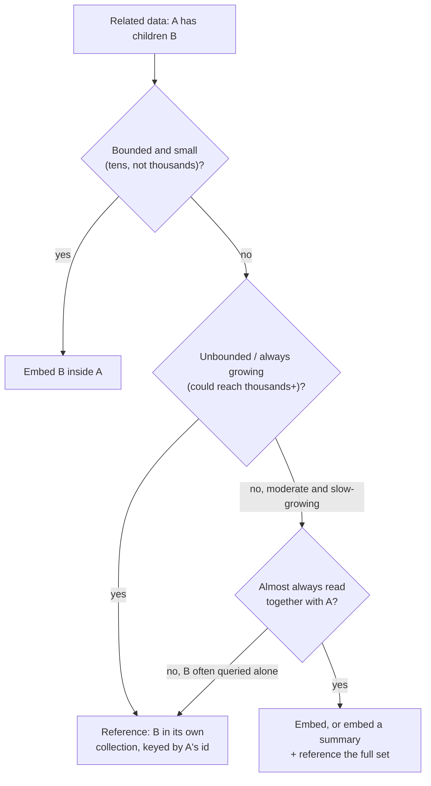

# Embedding vs. Referencing

This is the core schema-design skill in a document database — more consequential than any single query operator, because it's a decision baked into your data's shape that's expensive to reverse later. Everything else in this module (indexes, aggregation, transactions) exists partly to work around the consequences of getting this wrong.

## The question underneath every MongoDB schema decision

> "When document A relates to document(s) B, do I put B's data *inside* A (embed), or store B separately and hold a pointer to it (reference)?"

There's no universal right answer — it's a genuine tradeoff, decided by three things: **how many** B's per A, **how fast that number grows**, and **whether you usually read A and its B's together**.

## The three shapes

### One-to-few — embed

A blog post has a handful of tags, or a user has 2–3 shipping addresses. The child count is small and bounded (tens, not thousands).

```python
{
    "_id": "post_1",
    "title": "...",
    "tags": ["mongodb", "schema-design", "databases"]   # embedded array
}
```

**Embed.** There's no real cost — the array stays small, and you get the whole thing in one read, which is usually the access pattern that matters ("show the post with its tags").

### One-to-many — it depends on growth

A blog post's comments. Could be 3, could be 3,000. This is the case that actually requires judgment, not a rule.

### One-to-squillions — always reference

A time-series sensor's readings, a popular post's likes, an audit log's events tied to one user. Unbounded, always-growing, potentially huge. **Never embed** — a growing array inside a single document is a growing single document, and MongoDB has a hard **16 MB per-document limit**. Measured on this machine:

```python
import bson
for n in (20_000, 70_000):
    comments = [{"user": f"user{i}", "text": "x" * 200, "likes": 0} for i in range(n)]
    doc = {"_id": "post_hot", "title": "A post that went viral", "comments": comments}
    size_bytes = len(bson.BSON.encode(doc))
    print(n, size_bytes, "OVER" if size_bytes > 16*1024*1024 else "under", "16MB limit")
```
```
20,000 embedded comments (200 chars each) -> document size: 5,057,852 bytes (4.82 MB)  — under
70,000 embedded comments (200 chars each) -> document size: 17,757,852 bytes (16.94 MB) — OVER
```

A genuinely viral post with real-length comments (200 chars here is short — real comments run longer) blows the limit well before 70,000 comments in practice. That number also undersells the real problem: long before you hit 16 MB, a multi-megabyte document being rewritten on every new comment (see below) is already a performance disaster, independent of the hard ceiling.

**The same measurement in Go**, using the driver's own `bson.Marshal` — BSON is a fixed, language-independent binary format, so this isn't a re-implementation of the size calculation, it's the exact same encoding Python's `bson.BSON.encode` produced:

```go
for _, n := range []int{20000, 70000} {
    comments := make(bson.A, n)
    for i := 0; i < n; i++ {
        comments[i] = bson.M{"user": fmt.Sprintf("user%d", i), "text": strings.Repeat("x", 200), "likes": 0}
    }
    doc := bson.M{"_id": "post_hot", "title": "A post that went viral", "comments": comments}
    raw, _ := bson.Marshal(doc)
    fmt.Printf("%d comments -> %d bytes (%.2f MB)\n", n, len(raw), float64(len(raw))/(1024*1024))
}
```
```
20000 embedded comments (200 chars each) -> document size: 5057852 bytes (4.82 MB) — under 16MB limit
70000 embedded comments (200 chars each) -> document size: 17757852 bytes (16.94 MB) — OVER 16MB limit
```

**Byte-for-byte identical to the Python measurement above** (`5,057,852` and `17,757,852`) — not a coincidence, and worth internalizing precisely: the 16 MB limit and everything that leads up to it is a property of *BSON and the MongoDB server*, not of any particular driver or language. Whatever client you write, the document on the wire is the same bytes.

## Worked example, both ways: blog posts + comments

### Approach A — embed comments in the post

```python
db.posts_embedded.insert_one({
    "_id": "post_1",
    "title": "Why Documents Beat Tables (Sometimes)",
    "author": "njasm",
    "body": "...",
    "comments": [
        {"user": "alice", "text": "Great post!", "likes": 3},
        {"user": "bob", "text": "Disagree on point 2.", "likes": 1},
        {"user": "carol", "text": "Nice worked example.", "likes": 5},
    ],
})

post = db.posts_embedded.find_one({"_id": "post_1"})
# post["comments"] is already there — no second query
```

Measured: **0.377 ms**, one round trip, post and all 3 comments together.

### Approach B — reference comments in their own collection

```python
db.posts_referenced.insert_one({
    "_id": "post_1", "title": "Why Documents Beat Tables (Sometimes)",
    "author": "njasm", "body": "...",
})
db.comments_referenced.insert_many([
    {"post_id": "post_1", "user": "alice", "text": "Great post!", "likes": 3},
    {"post_id": "post_1", "user": "bob", "text": "Disagree on point 2.", "likes": 1},
    {"post_id": "post_1", "user": "carol", "text": "Nice worked example.", "likes": 5},
])
db.comments_referenced.create_index("post_id")

post = db.posts_referenced.find_one({"_id": "post_1"})
comments = list(db.comments_referenced.find({"post_id": "post_1"}))
```

Measured: **1.782 ms**, two round trips (or one `$lookup` aggregation — level 06 — to fold it into a single query at the cost of a join-like operation server-side).

At 3 comments the ~1.4 ms difference is noise — this measurement exists to show the *shape* of the cost (one round trip vs. two), not to claim referencing is "slow."

**Same two approaches, measured in Go** (`mongo-driver/v2`, 200 reads averaged each way instead of pymongo's timing loop):

```go
t0 := time.Now()
for i := 0; i < 200; i++ {
    var post bson.M
    postsEmbedded.FindOne(ctx, bson.M{"_id": "post_1"}).Decode(&post)
}
fmt.Printf("Embed: %.3f ms/op\n", time.Since(t0).Seconds()*1000/200)
```
```
Embed: 0.179 ms/op (avg over 200 reads)
Reference: 0.360 ms/op (avg over 200 reads, 2 round trips each)
```

**~2x here vs. ~4.7x in the Python measurement above** — both real, both honest, and the difference between 2x and 4.7x is exactly the kind of run-to-run/language-runtime noise this repo's "measured, not asserted" rule expects you to report plainly rather than paper over. What's stable across both languages and both runs is the *shape*: one round trip is cheaper than two, and the gap would only matter in practice at far higher comment counts than 3 — which is precisely why the real deciding factors below are structural, not this microbenchmark:

| | Embed (A) | Reference (B) |
|---|---|---|
| Reads (\"show post with comments\") | 1 query, always | 2 queries, or 1 `$lookup` |
| Writing a new comment | Push into the post's array (`$push`, level 07) — touches and rewrites part of a growing document | Insert a new small document — cheap and constant-size regardless of how many comments already exist |
| Document size over time | Grows without bound as comments accumulate | Post stays small forever; comments live in their own collection |
| Querying comments independent of their post (e.g. "all of alice's comments across every post") | Requires scanning every post's array — awkward, no good index shape | Trivial: `db.comments.find({"user": "alice"})`, indexable directly |
| 16 MB document limit risk | Real, for a popular post | None |

For **this specific case** (blog comments), the honest answer is: embed if comments are capped or rare (a "static site with a comments widget," a few dozen max), reference once comments are unbounded and can pile up on a single popular post — which is the realistic case for anything that could go viral. Most production blog/CMS systems reference comments for exactly this reason, even though the post-with-a-handful-of-comments case would embed just fine.

## Denormalization: duplicating data on purpose

Referencing avoids duplication (like a foreign key would), but the whole point of embedding is that duplication is sometimes the *correct* trade. A concrete middle ground: embed a **small, stable summary** of the referenced data, and keep the full record referenced elsewhere.

```python
# Denormalized: the post carries a cached comment_count and the 2 most recent
# comments (for a preview), while the full comment list still lives referenced.
{
    "_id": "post_1",
    "title": "...",
    "comment_count": 347,
    "recent_comments": [
        {"user": "zoe", "text": "Just saw this, great read"},
        {"user": "sam", "text": "Second this"},
    ],
}
```

This gives you the fast "show post + a preview" read of embedding without the unbounded-growth problem of embedding the *entire* comment history. The cost is now explicit and worth stating plainly: `comment_count` and `recent_comments` can drift out of sync with the real `comments` collection unless every write path that adds/deletes a comment also updates the summary — that's exactly the kind of multi-document consistency problem level 09 (transactions) exists to solve when the update absolutely must be atomic, and that embedding-only designs never have to worry about because there's nothing to keep in sync.

## Decision guide



## Common mistakes

- **Embedding "because it's a document database, so why not."** Embedding is a specific trade for a specific access pattern (read together, bounded growth), not the default posture. A collection of independently-queried, unbounded children belongs referenced.
- **Referencing everything out of relational habit.** Swinging the other way — normalizing every relationship into its own collection with a `$lookup` for every read — throws away the actual reason to use a document database (fetching a naturally-aggregate object in one round trip) and just rebuilds a relational schema with worse tooling for enforcing integrity.
- **Not noticing an embedded array is unbounded until it's already in production.** "Every user has a few notifications" quietly becomes "some users have 200,000 notifications" the moment the product succeeds. Ask "what's the realistic maximum, for the most extreme user" at design time, not after the 16 MB error shows up.
- **Denormalizing without a plan for keeping the copy in sync.** A cached `comment_count` that only gets incremented and never decremented (a bug that forgets the delete path) will silently drift wrong forever, and nothing in MongoDB will tell you it happened.

Level 05 is where the performance side of this shows up concretely: indexes, and a real measured comparison of a query with and without one.
