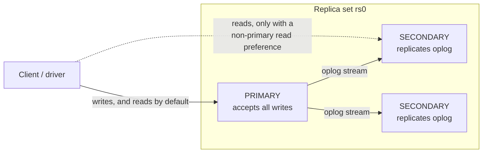

# Replication, Write Concern, and Read Preference

This level is deliberately narrow: **what write concern and read preference actually do in MongoDB, specifically** — not general replication/consensus theory, which is already covered well elsewhere in this repo. For the general theory, see:

- [`SystemDesign/building_blocks/06_database_internals.md`](../../SystemDesign/building_blocks/06_database_internals.md) — "Replication modes" and "Consensus" sections: leader-follower vs. multi-leader vs. leaderless, the quorum formula `W + R > N`, Raft/Paxos.
- [`SystemDesign/building_blocks/10_distributed_systems_theory.md`](../../SystemDesign/building_blocks/10_distributed_systems_theory.md) — CAP theorem and PACELC: the general C-vs-A tradeoff during a partition, and the latency-vs-consistency tradeoff in the normal case.

MongoDB's replica set is a concrete instance of the "leader-follower" pattern from that first file: **one primary** accepts all writes, **secondaries** replicate the primary's oplog (operation log) asynchronously by default, and if the primary becomes unreachable, the remaining members hold an election (built on a Raft-like consensus protocol) to promote a new primary automatically — typically within a handful of seconds.

## What this lab environment can and can't show

The `mongo:7` instance backing this module is a **single-node replica set** — one member, initiated with `rs.initiate()` specifically so level 09's transactions and this level's write-concern behavior could be run for real. Concretely, that means:

- **Can demonstrate live, for real:** write concern's acknowledgment semantics, read preference's routing behavior, `rs.status()`/`rs.config()` on a genuine (if minimal) replica set.
- **Cannot demonstrate live:** actual replication lag between a primary and a secondary (there is no secondary), a real election/failover (there's nothing to fail over to), or read staleness from `secondaryPreferred` actually returning older data (a real secondary here would show all of this by literally lagging behind the primary's oplog). Where this level describes that behavior, it's stated as documented, well-established MongoDB behavior, explicitly flagged as *not* something this lab's single node proved — never presented as if it were measured here.

## Replica sets, conceptually



The real `rs.config()` from this lab's single-node set:

```javascript
{
  _id: 'rs0',
  version: 1,
  members: [
    { _id: 0, host: 'localhost:27018', priority: 1, votes: 1, /* ... */ }
  ],
  writeConcernMajorityJournalDefault: true,
  /* ... */
}
```

A real 3+ node set would list multiple `members` entries; `rs.status()` reports each member's live `stateStr` (`PRIMARY`, `SECONDARY`, `ARBITER`, or a transitional state during an election). Here, with one member:

```javascript
rs.status().members.map(m => ({ name: m.name, stateStr: m.stateStr, health: m.health }))
// [ { name: 'localhost:27018', stateStr: 'PRIMARY', health: 1 } ]
```

Documented (not demonstrable on one node): if the primary in a real replica set goes down, the surviving secondaries detect the missing heartbeat and elect a new primary — the driver's connection pool discovers the new topology and re-routes writes automatically, but any writes in flight during the election window can fail or need a retry (pymongo's retryable writes, covered in level 11, handle the common case of this automatically).

## Write concern: how many nodes must acknowledge a write

**Write concern** (`w`) controls how many replica set members must confirm a write before the driver call returns as successful. It's a per-operation dial, not an all-or-nothing setting.

```python
from pymongo import WriteConcern

coll_w1   = db.notes.with_options(write_concern=WriteConcern(w=1))
coll_wmaj = db.notes.with_options(write_concern=WriteConcern(w="majority"))
```

Real timings from this lab's single-node set:

```
w=1 insert:            5.049 ms
w="majority" insert:   1.963 ms   (majority of a 1-node set = 1 node, itself)
```

The two are close here because on a single-node set, "majority" is trivially the same one node that "w=1" already waits for — there's no second node to add latency. On a real multi-node set, `w="majority"` costs measurably more latency than `w=1`, because the primary has to wait for a network round trip to at least one more voting member before it can report the write as durable, whereas `w=1` returns the instant the primary itself has it.

**The same comparison, in Go** — write concern is set per-collection via `Collection.Clone` with a `writeconcern` option, since the Go driver doesn't offer a `with_options`-style call directly on an existing handle the way pymongo does:

```go
collW1   := notes.Clone(options.Collection().SetWriteConcern(writeconcern.W1()))
collWMaj := notes.Clone(options.Collection().SetWriteConcern(writeconcern.Majority()))

t0 := time.Now()
collW1.InsertOne(ctx, bson.M{"who": "w1", "text": "test"})
fmt.Printf("w=1 insert: %.3f ms\n", time.Since(t0).Seconds()*1000)
```

Real output on this lab's single-node set:

```
w=1 insert:            9.755 ms
w="majority" insert:   1.739 ms
```

Both languages show the same single-node artifact from the paragraph above — on this run `w=1` even measured slower than `w="majority"`, which is exactly the kind of run-to-run noise you'd expect when both are waiting on the same one node: neither number reflects the *real* multi-node cost difference, which only shows up once "majority" genuinely means "wait for a second physical machine."

**This is the actual tradeoff**, stated precisely rather than hand-waved:

| Write concern | What "acknowledged" means | Durability if the primary crashes right after | Cost |
|---|---|---|---|
| `w: 1` (default) | The primary alone has the write. | **Can be lost** — if the primary crashes before replicating to any secondary, an unreplicated write is gone, even though the client was told it succeeded. | Fastest. |
| `w: "majority"` | A majority of voting members have the write. | **Survives the loss of any minority of nodes** — a majority-acknowledged write cannot be lost by any single node failure (including the old primary), because it's already durable on enough nodes to win any future election. | Extra network round trip(s); slower under real multi-node latency. |
| `w: 0` | Fire-and-forget — don't wait for any acknowledgment at all. | Weakest — you don't even know if the primary itself has it yet when the call returns. | Fastest possible, at the cost of not knowing whether the write landed. |

### What happens when write concern can't be satisfied

A genuinely useful real result from this lab: asking for `w: 2` on a set that only has **one** data-bearing node:

```python
coll_w2 = db.notes.with_options(write_concern=WriteConcern(w=2, wtimeout=2000))
coll_w2.insert_one({"who": "w2", "text": "requires 2 nodes to ack"})
```

```
w=2 insert: REJECTED after 0.6 ms -- Not enough data-bearing nodes,
  {'code': 100, 'codeName': 'UnsatisfiableWriteConcern', 'errmsg': 'Not enough data-bearing nodes', ...}

Document with who=w2 present in collection despite the rejection? True
```

**Same unsatisfiable-write-concern check, in Go:**

```go
wc2 := &writeconcern.WriteConcern{W: 2}
collW2 := notes.Clone(options.Collection().SetWriteConcern(wc2))
t0 := time.Now()
_, err := collW2.InsertOne(ctx, bson.M{"who": "w2", "text": "requires 2 nodes to ack"})
fmt.Printf("w=2 insert: REJECTED after %.1f ms -- %v\n", time.Since(t0).Seconds()*1000, err)

count, _ := notes.CountDocuments(ctx, bson.M{"who": "w2"})
fmt.Println("Document present despite rejection?", count == 1)
```
```
w=2 insert: REJECTED after 0.6 ms -- write exception: write concern error: (UnsatisfiableWriteConcern) Not enough data-bearing nodes
Document with who=w2 present in collection despite the rejection? true
```

Identical server behavior, identical timing order of magnitude (sub-millisecond rejection), identical "the write still happened" result — `UnsatisfiableWriteConcern` is a MongoDB server-side check, so every driver in every language gets the exact same fast rejection and the exact same underlying fact that the primary's own copy was written regardless of what `w` could satisfy.

Two things worth internalizing from this real result:

1. MongoDB is smart enough to reject an **unsatisfiable** write concern immediately (`UnsatisfiableWriteConcern`, in under a millisecond here) rather than making the client wait out the full `wtimeout` for something it already knows can never happen — it only actually times out (`WTimeoutError`) when the requested concern is *theoretically* satisfiable but doesn't get satisfied in time (e.g. `w: 2` on a 3-node set where a secondary happens to be down or lagging).
2. **The write itself still happened.** `who=w2` is genuinely present in the collection — write concern governs *acknowledgment*, not whether the write is applied. The primary always applies the write to its own data immediately; `w` only controls how long the driver waits, and how many other nodes must confirm, before telling your code "done." A rejected/timed-out write concern is not a rolled-back write — this is a common and consequential misunderstanding to carry into an incident: an "error" from a write-concern timeout does not by itself mean the data didn't change.

## Read preference: which node answers a read

**Read preference** controls which member(s) of the replica set a read is allowed to go to.

```python
from pymongo import ReadPreference

coll_primary  = db.notes.with_options(read_preference=ReadPreference.PRIMARY)
coll_secpref  = db.notes.with_options(read_preference=ReadPreference.SECONDARY_PREFERRED)
```

Real output on this single-node set:

```
read_preference PRIMARY count: 3
read_preference SECONDARY_PREFERRED count: 3
(SECONDARY_PREFERRED fell back to the primary -- no secondary exists in this 1-node set)
```

Both returned the same count because there is nowhere else for `SECONDARY_PREFERRED` to go — it fell back to the primary, which is exactly its documented behavior (`SECONDARY_PREFERRED` means "prefer a secondary, but use the primary if none is available or healthy," as opposed to plain `SECONDARY`, which would raise an error rather than fall back).

**Same read preference check, in Go**, via the `readpref` package:

```go
collPrimary := notes.Clone(options.Collection().SetReadPreference(readpref.Primary()))
collSecPref := notes.Clone(options.Collection().SetReadPreference(readpref.SecondaryPreferred()))

c1, _ := collPrimary.CountDocuments(ctx, bson.M{})
c2, _ := collSecPref.CountDocuments(ctx, bson.M{})
```
```
read_preference PRIMARY count: 3
read_preference SECONDARY_PREFERRED count: 3
```

Same fallback behavior, same result — read preference is routing logic the driver applies when picking which replica-set member to send the read to; on a one-member set there is only ever one place to route to, in Go exactly as in Python. On a real multi-node set, `SECONDARY_PREFERRED`/`SECONDARY` reads would actually be served by a different physical node than the one taking writes — and, because replication is asynchronous by default, that read can return **slightly stale data**: a write acknowledged to the primary a few milliseconds ago might not have replicated to the secondary a read just landed on yet.

| Read preference | Where reads go | Staleness risk | When to use it |
|---|---|---|---|
| `primary` (default) | Always the primary. | None — always the latest acknowledged data. | Default choice; anything that needs read-your-own-writes correctness. |
| `primaryPreferred` | Primary if available, else a secondary. | Possible, only during a primary outage. | Slight availability boost, keeps consistency the common case. |
| `secondary` | Only secondaries; errors if none are available/healthy. | Real, ongoing — bounded by replication lag. | Offloading read traffic (analytics, reporting) that can tolerate a few seconds of staleness. |
| `secondaryPreferred` | Secondary if available, else the primary. | Same as `secondary` when one exists. | Read scaling without a hard failure if secondaries are temporarily unavailable. |
| `nearest` | Whichever member has the lowest measured network latency, primary or secondary. | Same as whichever kind of node is nearest. | Latency-sensitive reads where staleness is acceptable and geography/network topology varies. |

This is the PACELC tradeoff from `10_distributed_systems_theory.md` made concrete: in the normal case (no partition), MongoDB lets you trade **latency/throughput** (read from a nearby, less-loaded secondary) against **consistency** (that secondary might be milliseconds to seconds behind the primary) — an explicit, per-query dial, not a global property of the deployment.

## Common mistakes

- **Assuming `w: 1` writes are durable.** They're acknowledged by the primary alone — a crash before replication can lose them. Use `w: "majority"` for anything where losing an acknowledged write would be a real incident (payments, anything a user was told succeeded).
- **Reading your own write immediately after with a non-primary read preference.** A write acknowledged with `w: 1` and then immediately read with `secondaryPreferred` can appear to not exist yet, purely due to replication lag — not a bug, but a very common source of "why did my just-written data disappear" confusion. Use `primary` (or `primaryPreferred`) for read-your-writes paths.
- **Treating a write-concern timeout/rejection as proof the write didn't happen.** As shown above, the primary's own copy is written regardless — a `WTimeoutError`/`WriteConcernError` means the *acknowledgment* didn't arrive in time or from enough nodes, not that the data is missing. Retrying blindly on that error without checking can produce a duplicate write if the operation wasn't naturally idempotent.
- **Confusing write concern with read isolation/consistency level.** Write concern only controls how many replicas must have a write before it's acknowledged; it says nothing about whether a *concurrent* read elsewhere sees it, which is governed separately by read concern (not covered in depth in this module) and read preference.

Level 11, the capstone, pulls every level in this ladder together into a small production-shaped Python service module — connection pooling, retryable writes, and timeouts — the client-side discipline that makes all of the above safe to actually rely on.
