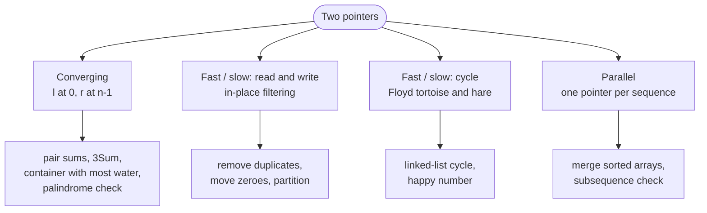
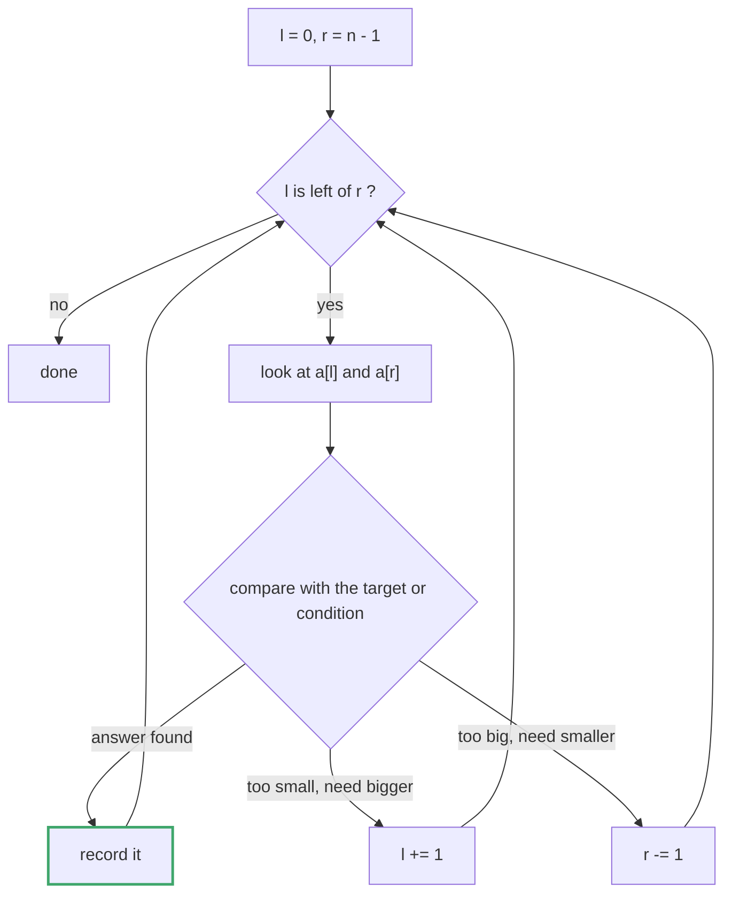
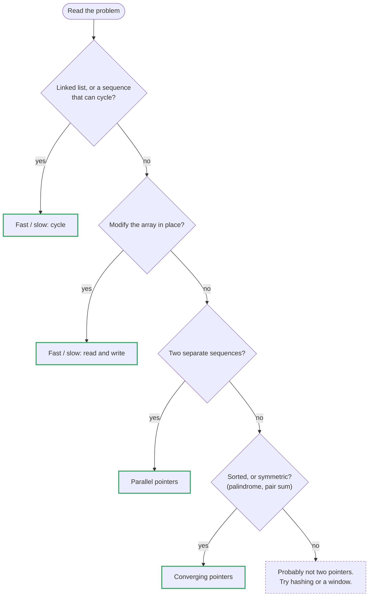

# Topic 02 · Two Pointers — Python Deep Dive

> Two pointers is not one technique. It is **four distinct patterns** that happen
> to share the phrase "two indices." Candidates who memorize one and try to force
> it onto the others get stuck; candidates who can name which of the four they
> are in solve the problem in two minutes. Part 1 is that taxonomy. Parts 2–5 are
> the Python-specific facts that make or break the implementation.

---

## Part 1 · The Four Patterns




### 1.0 Why this topic exists at all

Every problem in this folder is really the same question: *can I avoid the nested
loop?* The brute force is always O(n²) — try every pair. Two pointers gets to O(n)
by exploiting a **structural guarantee** that makes most of those pairs impossible
to be the answer, so you never examine them.

The guarantee differs per pattern. Naming it is the whole skill:

| Pattern | The guarantee it exploits | Movement |
|---|---|---|
| **Converging** | the array is **sorted** (or symmetric) | `l++`, `r--`, meet in the middle |
| **Fast/slow (read/write)** | output is a **prefix** of the input | both forward, `w <= r` always |
| **Fast/slow (cycle)** | a cycle traps a faster walker | `slow += 1`, `fast += 2` |
| **Parallel / merge** | two sequences, each already ordered | advance whichever is behind |

If you cannot say which guarantee you are using, you do not yet have a two-pointer
solution — you have a guess.

---

### 1.1 Converging pointers (`l = 0`, `r = n-1`, move inward)




```python
l, r = 0, len(a) - 1
while l < r:
    # decide, using a[l] and a[r], which side CANNOT be part of the answer
    if bad_on_left:
        l += 1
    else:
        r -= 1
```

**The enabling insight — the "elimination argument".** At every step you must be
able to prove that one of the two endpoints can be discarded forever. In sorted
2-sum:

```
a = [2, 7, 11, 15]   target = 18
     l          r     sum = 2 + 15 = 17 < 18

Because a is SORTED, a[l] is the SMALLEST remaining value. Pairing it with the
largest remaining (a[r]) already falls short. So a[l] paired with ANYTHING else
still in range falls short too — a[l] can never be part of the answer.
Discard it: l += 1. One comparison eliminated an entire row of the n² matrix.
```

That paragraph is the answer to "why is this O(n)?" — **each step permanently
removes one element from consideration**, so there are at most `n` steps. Learn to
say it out loud; interviewers ask.

**Where it applies:** Valid Palindrome (125), Two Sum II (167), 3Sum (15),
3Sum Closest (16), Container With Most Water (11), Trapping Rain Water (42).

**`while l < r` vs `while l <= r`** — this is the off-by-one that bites:

- `l < r` — you need a **pair** of distinct positions. Palindromes, 2-sum, container.
- `l <= r` — you must **process every element individually**. Binary search, or an
  in-place reverse where a lone middle element still needs handling (it usually
  does not — swapping it with itself is a no-op, so `l < r` is fine there too).

Default to `l < r` for pair problems. If you find yourself needing the `l == r`
iteration, you are probably in a different pattern.

---

### 1.2 Fast/slow, the read/write variant (in-place filtering)

```python
w = 0                       # write pointer: next slot to fill
for r in range(len(a)):     # read pointer: scans everything
    if keep(a[r]):
        a[w] = a[r]
        w += 1
return w                    # the new logical length
```

**The enabling insight:** `w <= r` is an invariant, always. You never write past
where you have already read, so overwriting is safe even though you are mutating
the array you are iterating. That single inequality is why this needs no temporary
buffer.

```
a = [1, 1, 2, 3, 3]   keep = "different from previous kept"

r=0  a[0]=1  keep  ->  a[0]=1   w=1     [1, 1, 2, 3, 3]
                                         w↑ r↑
r=1  a[1]=1  drop                        [1, 1, 2, 3, 3]
                                         w↑    r↑
r=2  a[2]=2  keep  ->  a[1]=2   w=2     [1, 2, 2, 3, 3]
r=3  a[3]=3  keep  ->  a[2]=3   w=3     [1, 2, 3, 3, 3]
r=4  a[4]=3  drop
                       return 3, with a[:3] == [1,2,3]
```

Note the tail `[3, 3]` is **garbage the caller must ignore**. LeetCode's
"return the length, we only check the prefix" contract exists precisely because
you cannot shrink a fixed-size array in C. Say this — it explains why the problem
is shaped so oddly.

**Where it applies:** Remove Duplicates (26), Remove Element (27), Move Zeroes (283).

**The generalisation worth knowing:** for "at most k duplicates," compare against
`a[w - k]` instead of `a[w - 1]`. LC 80 is LC 26 with `k = 2`, one character
different.

---

### 1.3 Fast/slow, the cycle variant (Floyd's tortoise and hare)

```python
slow = fast = head
while fast and fast.next:
    slow = slow.next
    fast = fast.next.next
    if slow is fast:
        break               # a cycle exists
```

Lives mostly in topic 08 (Linked Lists), but the arithmetic is the same on arrays
(LC 287, Find the Duplicate Number, treats `i -> nums[i]` as a linked list).

**Why the hare gains exactly one step per iteration** is the key fact: relative
speed is `2 - 1 = 1`, so once both are inside the cycle the gap shrinks by exactly
1 each tick and can never jump over 0. That is why a collision is *guaranteed* and
why a 3x hare is **not** safe — with speed difference 2, the gap can step from 1
to −1 and skip the meeting.

---

### 1.4 Parallel pointers over two sequences

```python
i = j = 0
while i < len(a) and j < len(b):
    if a[i] <= b[j]:
        out.append(a[i]); i += 1
    else:
        out.append(b[j]); j += 1
out.extend(a[i:]); out.extend(b[j:])     # exactly one of these is non-empty
```

The merge step of merge sort; also LC 88 (Merge Sorted Array), LC 349/350
(intersections), LC 986 (interval lists).

**The classic bug is the tail.** After the loop, one list still has elements. Forget
`extend` and you silently drop them. Write both `extend` lines immediately after the
`while`, before you test anything.

**LC 88 subtlety:** merging *in place* into `nums1`, which has the spare room at
the END, means you must merge **backwards** (largest first, writing from the tail).
Forward merging overwrites values you have not read yet — the `w <= r` invariant
from §1.2 runs the wrong way. Recognising when to reverse direction is the lesson.

---

## Part 2 · Python Facts That Decide the Implementation

### 2.1 Slicing copies. Always. This is the #1 hidden O(n²).

```python
s[1:-1]           # NEW string, O(k) time AND O(k) memory
a[i:j]            # NEW list, O(j-i)
```

A "two pointer" palindrome check written as recursion on slices:

```python
def is_pal(s):                       # ✗ O(n²) time, O(n²) total allocation
    if len(s) < 2: return True
    return s[0] == s[-1] and is_pal(s[1:-1])
```

...is not a two-pointer solution at all. It allocates a fresh string every level.
**Two pointers means moving INDICES over one buffer.** If your code contains a
slice inside a loop, you have probably lost the optimisation you came for.

| You want | Don't write | Write |
|---|---|---|
| reversed view | `s[::-1] == s` (O(n) copy) | `l/r` indices |
| a subrange | `a[i:j]` in a loop | pass `i, j` down |
| last element | `a[-1:]` | `a[-1]` |
| "does it start with" | `s[:k] == p` | `s.startswith(p, i)` |

`s[::-1] == s` is a perfectly good *one-liner* for a palindrome — O(n) time, O(n)
space, and genuinely fast because it is C. Use it when asked for the simplest
correct code; do not use it when asked for O(1) space.

### 2.2 Strings are immutable — you cannot two-pointer them in place

```python
s[0] = 'x'        # TypeError: 'str' object does not support item assignment
```

To mutate, convert: `chars = list(s)`, work in place, then `"".join(chars)`.
That is O(n) extra space, which is unavoidable and worth stating out loud. If the
problem says "modify in place," the input will be a `List[str]`, not a `str` —
LeetCode does this deliberately (LC 344).

### 2.3 Negative indices are a silent trap for `r`

`a[-1]` is the last element, not an error. So a converging loop whose right pointer
runs off the low end **wraps around instead of crashing**:

```python
r = -1
a[r]              # a[len(a)-1] — no exception, wrong element, wrong answer
```

This is the same trap as `abs()` in LC 448. Bound your loops with `l < r`, not with
"it will throw eventually." **Python will not throw.**

### 2.4 In-place swap needs no temporary

```python
a[l], a[r] = a[r], a[l]
```

The right-hand side is evaluated fully into a tuple *first*, then unpacked — so
there is no clobbering. This is one of the few places Python is genuinely both
shorter and clearer than C. Note it does **not** work for two names bound to the
same mutable object in the way you might hope; for list elements it is exact.

### 2.5 Character classification: `str` methods, not `ord()` arithmetic

```python
c.isalnum()       # letters + digits, UNICODE-aware
c.isalpha()       # letters
c.isdigit()       # 0-9 and other Unicode digits
c.lower()
```

`'a' <= c <= 'z'` is ASCII-only and will be wrong for any real input. The Unicode
awareness is usually what you want — but know the edge: `'²'.isdigit()` is `True`
while `int('²')` raises, and `'ß'.upper()` is `'SS'` (length changes!). For
interview inputs the `str` methods are correct and faster; just do not assume
`len(s.upper()) == len(s)`.

### 2.6 `while` loops need a guard on EVERY advance

The single most common runtime error in this topic:

```python
while l < r:
    while not s[l].isalnum():     # ✗ runs off the end on "...."
        l += 1
```

Every inner `while` that advances a pointer must re-check the outer bound:

```python
while l < r and not s[l].isalnum():
    l += 1
```

`l < r` in the inner condition, every time. This is not optional and it is not
defensive programming — inputs of all punctuation are real test cases.

---

## Part 3 · The Skip-Duplicates Pattern (3Sum's real difficulty)

3Sum is not hard because of the third pointer. It is hard because of **duplicate
triplets**, and there are exactly two places you must skip:

```python
nums.sort()
for i in range(len(nums) - 2):
    if i > 0 and nums[i] == nums[i-1]:      # (1) skip duplicate ANCHORS
        continue
    l, r = i + 1, len(nums) - 1
    while l < r:
        total = nums[i] + nums[l] + nums[r]
        if total < 0:   l += 1
        elif total > 0: r -= 1
        else:
            out.append([nums[i], nums[l], nums[r]])
            l += 1
            while l < r and nums[l] == nums[l-1]:   # (2) skip duplicate LEFTS
                l += 1
```

Three things people get wrong:

1. **`i > 0 and` is mandatory.** Without it, `nums[-1]` wraps to the last element
   (see §2.3) and you may skip a legitimate first anchor.
2. **You only need to skip on ONE side after a hit.** Advancing `l` past duplicates
   forces `r` to move too (the sum would otherwise change), so an explicit `r` skip
   is redundant. Harmless, but knowing it is redundant shows you understand the
   invariant.
3. **Skip AFTER recording, not before.** Skipping first drops the valid triplet.

The alternative — collect everything, then dedupe with a `set` of sorted tuples —
works and is a legitimate fallback, but it costs O(k) extra space and interviewers
read it as "did not think about the invariant."

---

## Part 4 · Complexity Reference for This Topic

| Operation | Cost | Note |
|---|---|---|
| `a[i]` | O(1) | index math on a pointer array |
| `a[i], a[j] = a[j], a[i]` | O(1) | tuple pack/unpack, no temp |
| `a[i:j]` | **O(j−i)** | copies — the hidden quadratic |
| `s[::-1]` | O(n) | new string |
| `list(s)` | O(n) | needed to mutate a string |
| `"".join(chars)` | O(n) | one allocation, sized up front |
| `a.sort()` | O(n log n) | in place, mutates the caller's list |
| `sorted(a)` | O(n log n) | returns a copy, input untouched |
| `a.pop()` | O(1) | from the end |
| `a.pop(0)` | **O(n)** | shifts everything — use `deque` |
| `a.insert(0, x)` | **O(n)** | same reason |
| `c.isalnum()` | O(1) | Unicode table lookup |

**Sorting is the enabler, and it is usually the dominant term.** A "two pointer
O(n)" solution that begins with `nums.sort()` is O(n log n) overall. Say the
honest total: *"O(n log n), dominated by the sort; the two-pointer scan itself is
O(n)."* Claiming O(n) for 3Sum is a red flag.

---

## Part 5 · Choosing the Pattern — a decision procedure




```
Is the input SORTED (or can I sort it without breaking the problem)?
│
├─ YES ─► Am I looking for a PAIR/TRIPLE with a target property?
│         ├─ YES ─► CONVERGING pointers. Sort first if needed.
│         │         (167 · 15 · 16 · 11 · 42)
│         └─ NO  ─► Am I removing/compacting elements in place?
│                   └─ YES ─► READ/WRITE pointers. (26 · 27 · 283)
│
└─ NO ──► Does sorting DESTROY the answer (order matters, or I must
          return original indices)?
          ├─ YES ─► Two pointers is probably the wrong tool.
          │         Reach for a HASH MAP (topic 01) or a SLIDING
          │         WINDOW (topic 03).  ← LC 1 vs LC 167 is exactly
          │           this fork: same question, different constraint,
          │           completely different answer.
          └─ NO  ─► Is it two already-ordered sequences?
                    └─ YES ─► PARALLEL/merge pointers. (88 · 349 · 986)
```

**The most important line in that diagram is the LC 1 / LC 167 fork.** Two Sum
(unsorted, return indices) *must* use a hash map, because sorting destroys the
indices you have to return. Two Sum II (sorted, return positions) *should* use two
pointers, because the sortedness is handed to you and the space drops to O(1).
Interviewers pair these deliberately to see whether you pattern-match on the
surface ("two sum!") or on the constraint.

---

## Part 6 · Sliding Window Is Not In This Topic — and why

A sliding window also uses two indices moving forward, so it looks like §1.2. The
difference:

| | Read/write (this topic) | Sliding window (topic 03) |
|---|---|---|
| What the pointers bound | a **write position** and a scan | a **contiguous subarray** |
| What you maintain | nothing | an **aggregate** (sum, counts, max) over `[l, r]` |
| Why `l` moves | never — `w` moves on a *write* | to restore a **validity condition** |
| Typical question | "remove/compact in place" | "longest/shortest subarray such that…" |

If your left pointer moves in order to *fix a broken condition* about the range
between the pointers, you are in a sliding window, and you should be in topic 03.
If it moves because you decided one endpoint is eliminated, you are here.

---

<!-- block:02_py_1_shapes -->
## Part 7 · Shapes the Four-Pattern Taxonomy Leaves Out

Part 1's four patterns cover every problem in this folder. Interviews keep asking the same
*guarantee-driven* question in five more costumes; each is short, and each was run while writing this
section.

### 7.1 Partitioning: three pointers, four regions (Dutch national flag)

Sort an array of `0`/`1`/`2` in one pass, in place, without counting (LC 75). Three pointers carve the
array into four regions and keep an invariant:

```
   [ 0 0 0 | 1 1 1 | ? ? ? ? ? | 2 2 2 ]
     ^0s     ^1s      ^unknown    ^2s
     [0,lo)  [lo,mid) [mid,hi]    (hi,n)
```

```python
def sort_colors(nums):
    lo, mid, hi = 0, 0, len(nums) - 1
    while mid <= hi:
        if nums[mid] == 0:
            nums[lo], nums[mid] = nums[mid], nums[lo]
            lo += 1; mid += 1          # what came from lo is a known 1 — safe to pass
        elif nums[mid] == 1:
            mid += 1
        else:
            nums[mid], nums[hi] = nums[hi], nums[mid]
            hi -= 1                    # do NOT advance mid: the value from hi is unexamined
    return nums
```

The one bug that "almost works": advancing `mid` after the `hi` swap. The swapped-in value has never
been inspected. The same skeleton is quicksort's three-way partition, and it is the partition step behind
Quickselect and Wiggle Sort II (topic 27).

### 7.2 Fill from the back (an output pointer)

When the answer's *largest* element is guaranteed to sit at one end of the input, fill the output from
the back. **Squares of a Sorted Array** — the largest square is at `nums[l]` or `nums[r]`:

```python
def sorted_squares(nums):
    out = [0] * len(nums)
    l, r = 0, len(nums) - 1
    for w in range(len(nums) - 1, -1, -1):
        if abs(nums[l]) > abs(nums[r]):
            out[w] = nums[l] ** 2; l += 1
        else:
            out[w] = nums[r] ** 2; r -= 1
    return out                          # [-4,-1,0,3,10] -> [0, 1, 9, 16, 100]
```

**Merge Sorted Array** (LC 88) is the same idea for a different reason: `nums1` has its spare room at the
*end*, so a forward merge overwrites values it has not read yet. Run it and watch:

```python
a = [4, 5, 6, 0, 0, 0]; b = [1, 2, 3]      # forward, in place
# ... a[w] = b[j] clobbers a[0]=4 before it is ever compared
# a == [1, 1, 1, 1, 0, 0]                   # the 4, 5, 6 are gone
```

Merged from the back (`i, j, w = m-1, n-1, m+n-1`, write the *larger* head into `a[w]`) the write pointer
never catches an unread value, because the unread region of `a` is always at or below `w`.

### 7.3 Outward pointers: expand from the centre

A palindrome is symmetric around a centre, so instead of converging you *diverge* from each candidate
centre until the symmetry breaks. There are `2n − 1` centres (`n` odd-length, `n − 1` even-length):

```python
def longest_palindrome(s):
    best = (0, 0)
    def expand(l, r):
        while l >= 0 and r < len(s) and s[l] == s[r]:
            l -= 1; r += 1
        return l + 1, r                               # half-open [l+1, r)
    for c in range(len(s)):
        for a, b in (expand(c, c), expand(c, c + 1)):  # odd centre, even centre
            if b - a > best[1] - best[0]:
                best = (a, b)
    return s[best[0]:best[1]]                          # "babad" -> "bab",  "cbbd" -> "bb"
```

O(n²) time, **O(1) space** — the DP table and Manacher's algorithm are the alternatives; this is the one to
write first. Forgetting the even centre (`expand(c, c + 1)`) is the classic miss: `"cbbd"` has no odd
palindrome longer than 1.

### 7.4 kSum, and counting whole batches at once

3Sum is "fix one, run 2Sum on the rest". The same reduction generalises to any `k`: recurse until `k == 2`,
then run the converging scan. Skip duplicates at **every** level.

```python
def k_sum(nums, target, k, start=0):          # nums sorted
    res = []
    if k == 2:
        l, r = start, len(nums) - 1
        while l < r:
            s = nums[l] + nums[r]
            if s < target: l += 1
            elif s > target: r -= 1
            else:
                res.append([nums[l], nums[r]])
                l += 1; r -= 1
                while l < r and nums[l] == nums[l - 1]: l += 1
                while l < r and nums[r] == nums[r + 1]: r -= 1
        return res
    for i in range(start, len(nums) - k + 1):
        if i > start and nums[i] == nums[i - 1]:
            continue
        for tail in k_sum(nums, target - nums[i], k - 1, i + 1):
            res.append([nums[i]] + tail)
    return res
# k_sum(sorted([1,0,-1,0,-2,2]), 0, 4) -> [[-2,-1,1,2], [-2,0,0,2], [-1,0,0,1]]
```

Time is **O(n^(k−1))** (4Sum is O(n³)). A variant worth knowing: when a *count* is asked, one successful
pair can settle many at once. **3Sum Smaller** (count triples with sum `< target`): if
`nums[i] + nums[l] + nums[r] < target`, then *every* partner in `(l, r]` also works, so add `r − l` and
move `l`:

```python
if nums[i] + nums[l] + nums[r] < target:
    count += r - l          # (l, l+1), (l, l+2), ... (l, r) all qualify
    l += 1
else:
    r -= 1
```

### 7.5 Why all of these are O(n) per scan: the potential argument

A `while` inside a `for` *looks* quadratic. It is linear whenever the inner pointer **never moves
backwards or resets**: the total number of pointer moves is bounded by `n` (or `2n`) no matter how the
loops are nested. State it as a sentence: *"each pointer only moves in one direction, so across the whole
run they move at most n times in total."* The moment a pointer resets (the `while` restarts from an
earlier index), that argument is gone and you must re-derive the complexity — that is exactly the
difference between two pointers and a hidden O(n²).

---
<!-- /block:02_py_1_shapes -->

<!-- block:02_py_2_followups -->
## Part 8 · Follow-ups the Interviewer Reaches For

| Follow-up | What changes | The answer |
|---|---|---|
| "Return *indices*, and the array is unsorted." | Sorting destroys the answer. | Hash map (topic 01). Or sort `(value, index)` pairs and two-pointer those. |
| "Count the pairs instead of listing them." | You do not need to visit each pair. | Move both pointers past runs of equal values and multiply run lengths (`C(m, 2)` when both ends are equal), or add `r − l` in bulk as in 3Sum Smaller. |
| "The input is a linked list / a stream." | No random access, so no `r = n - 1`. | Converging pointers are out (unless it is doubly linked); use fast/slow (topic 08) or a hash set. |
| "Sorted in *descending* order." | Directions flip. | Swap which side each comparison moves — re-derive the elimination argument, do not just flip signs by feel. |
| "General `k`." | 3Sum's loop becomes a recursion. | `k_sum` above: O(n^(k−1)), duplicate-skip at every level. |
| "Circular array." | The window wraps. | Index with `% n`, or double the array (`nums + nums`) and cap the window at length `n`. |
| "Search a sorted 2D matrix." | Two pointers become row/column. | Start at a corner where one direction is bigger and the other smaller (LC 240, topic 24) — the same elimination proof, one row or column per step. |
| "Do it without extra space." | Rules out the hash map and the copy. | Read/write pointers for filtering; converging for pairs — that is the entire point of the pattern. |
| "Unicode / case folding for palindromes." | `str.isalnum()` and `.lower()` are not enough for every script. | `unicodedata.normalize("NFC", s)` and `.casefold()`; state the assumption if you keep ASCII. |

---
<!-- /block:02_py_2_followups -->

<!-- problem-map:start -->
## Part 9 · Every Problem in This Topic, by Pattern

Eleven problems, five moves. Each **Trap** is one the tests in that problem's solution file actually trigger.

| Problem | Move | The idea — and the trap it sets |
|---|---|---|
| [001 · Valid Palindrome](PyDSA/02_two_pointers/001_valid_palindrome_solution.py) <br>LC 125 · Easy | Converging, symmetric | Walk the *original* string from both ends and skip junk as you meet it — never build a cleaned copy. **Trap:** inner skip loops without `l < r` (IndexError on the left, silent negative-index wraparound on the right — test with `".,;:!"`). |
| [002 · Valid Palindrome II](PyDSA/02_two_pointers/002_valid_palindrome_ii_solution.py) <br>LC 680 · Easy | Converging + one decision | Everything that matches is uninteresting; the *first mismatch* is the only choice: skip the left character **or** the right one and check the rest. **Trap:** trying only one side (fails `"cbbcc"` / `"deeee"`); `is_pal(l+1, r-1)` deletes two characters. |
| [003 · Remove Duplicates from Sorted Array](PyDSA/02_two_pointers/003_remove_duplicates_from_sorted_array_solution.py) <br>LC 26 · Easy | Read/write (sorted) | Sorted ⇒ duplicates are adjacent ⇒ compare with one previous value; "remove" means compact survivors to the front and return the count. **Trap:** `w = 0` reads `nums[-1]` (silent corruption); reaching for a `set` and ignoring the sortedness. |
| [004 · Remove Element](PyDSA/02_two_pointers/004_remove_element_solution.py) <br>LC 27 · Easy | Read/write, order-free | Same skeleton with another predicate; "order may change" *permits* pulling from the back so few writes happen when `val` is rare. **Trap:** advancing `l` after pulling from the back, leaving `val` in the prefix. |
| [005 · Move Zeroes](PyDSA/02_two_pointers/005_move_zeroes_solution.py) <br>LC 283 · Easy | Read/write + zero fill | Compact the non-zeroes, then genuinely fill the tail with zeroes — unlike 004 the tail is checked. **Trap:** `> 0` instead of `!= 0` moves negatives; borrowing 004's swap-from-back destroys the order. |
| [006 · Two Sum II - Input Array Is Sorted](PyDSA/02_two_pointers/006_two_sum_ii_input_array_is_sorted_solution.py) <br>LC 167 · Medium | Converging (sorted pair) | The sum steers: too small drops the smallest, too big drops the largest — and the *proof* that dropping is safe is the content. **Trap:** returning 0-based indices; `while l <= r` pairs an element with itself. |
| [007 · 3Sum](PyDSA/02_two_pointers/007_3sum_solution.py) <br>LC 15 · Medium | Sort + anchor + converging | 3Sum = fix one, run 006 on the rest: O(n²). The Medium difficulty is the two duplicate-skips. **Trap:** dropping `i > 0 and` (Python's `nums[-1]` does not raise, `[0,0,0]` returns `[]`); forgetting the inner skip so a triplet is emitted twice. |
| [008 · 3Sum Closest](PyDSA/02_two_pointers/008_3sum_closest_solution.py) <br>LC 16 · Medium | Sort + anchor + converging | Sortedness gives every step a *direction*; keep the sum with the smallest `abs(sum − target)`; stop at distance 0. **Trap:** `abs(s) < abs(closest)` (only right when `target == 0`); seeding `closest` with `inf`. |
| [009 · Container With Most Water](PyDSA/02_two_pointers/009_container_with_most_water_solution.py) <br>LC 11 · Medium | Converging, greedy move | Start widest and always move the **shorter** line — it caps every remaining container that keeps it. **Trap:** moving the taller line; confusing this with 010 (here the bars in between are ignored). |
| [010 · Trapping Rain Water](PyDSA/02_two_pointers/010_trapping_rain_water_solution.py) <br>LC 42 · Hard | Converging + running maxima | `water[i] = min(max_left, max_right) − h[i]`; the side with the smaller running max is the one whose water level is exactly known. **Trap:** `max` instead of `min` (water spills over the *lower* wall); not subtracting `h[i]`. |
| [011 · Boats to Save People](PyDSA/02_two_pointers/011_boats_to_save_people_solution.py) <br>LC 881 · Medium | Sort + converging (greedy) | Heaviest boards each round; the lightest joins if it fits — an exchange argument proves pairing them never costs a later pair. **Trap:** pairing the two lightest (`[1,1,2,2]`, limit 3); `while lo < hi` drops the last lone person. |

---
<!-- problem-map:end -->

## Checklist Before Leaving This Topic

- [ ] I can name which of the four patterns a problem is, before writing code.
- [ ] I can state the **elimination argument** for converging pointers — *why*
      discarding one endpoint is provably safe — without hand-waving.
- [ ] I write `while l < r and <condition>` on every inner advance, reflexively.
- [ ] I know slicing copies, and I never slice inside a loop.
- [ ] I know `a[-1]` does not raise, so I bound loops explicitly.
- [ ] I can write 3Sum's two duplicate-skips from memory and say why each exists.
- [ ] I quote O(n log n) — not O(n) — for any solution that sorts first.
- [ ] I can explain why LC 1 needs a hash map and LC 167 needs two pointers.
- [ ] I can do Trapping Rain Water (42) both ways: prefix/suffix arrays O(n) space,
      then the two-pointer O(1)-space collapse — and explain why the shorter wall
      is the safe one to commit to.
- [ ] Write the Dutch-national-flag loop and explain why `mid` does not advance after the `hi` swap <!--ca-->
- [ ] Say why Merge Sorted Array must fill from the back (and show what a forward merge destroys) <!--ca-->
- [ ] Expand around both odd and even centres, and say why that is O(n²) time but O(1) space <!--ca-->
- [ ] Generalise 3Sum to kSum, and name the complexity of 4Sum <!--ca-->
- [ ] Justify "O(n)" for a `while` nested in a `for` with the one-direction argument <!--ca-->

---

## Part 10 · Completing the Folder (008–011)

Topic 02 was 7/10 until 16 Sep 2026. The last three planned problems plus Boats to Save People
(added from the Google prep plan) are now written.

| # | Problem | Pattern | The one idea |
|---|---|---|---|
| 008 | 3Sum Closest | sort + fix one + opposite ends | Track `abs(s - target)`; move toward the target; exit on distance 0 |
| 009 | Container With Most Water | opposite ends | Move the SHORTER line — every container keeping it and moving the taller one is narrower and no taller |
| 010 | Trapping Rain Water | opposite ends with running maxima | `water[i] = min(max_left, max_right) - h[i]`; the side with the smaller running max is exactly known |
| 011 | Boats to Save People | sort + opposite ends (greedy) | Heaviest always boards; lightest joins if it fits; exchange argument proves it |

### The shared proof shape

All four rely on the same argument as Two Sum II (006): **each pointer move discards a whole row (or
column) of the n x n pair grid without examining it**, and the proof says why nothing in that row could
beat what you already have. When you can state that sentence for a problem, two pointers is correct.

### 009 vs 010 — don't confuse them

- Container: only the two chosen lines matter; bars in between are ignored.
- Trapping Rain Water: every bar holds its own column of water; bars in between are the whole point.

### Checklist additions

- [ ] I can prove "move the shorter line" for Container With Most Water.
- [ ] I can derive the two-pointer Trapping Rain Water from the prefix/suffix max version.
- [ ] I can give the exchange argument for Boats to Save People, and say why "pair the two lightest"
      is wrong (`[1,1,2,2]`, limit 3).
