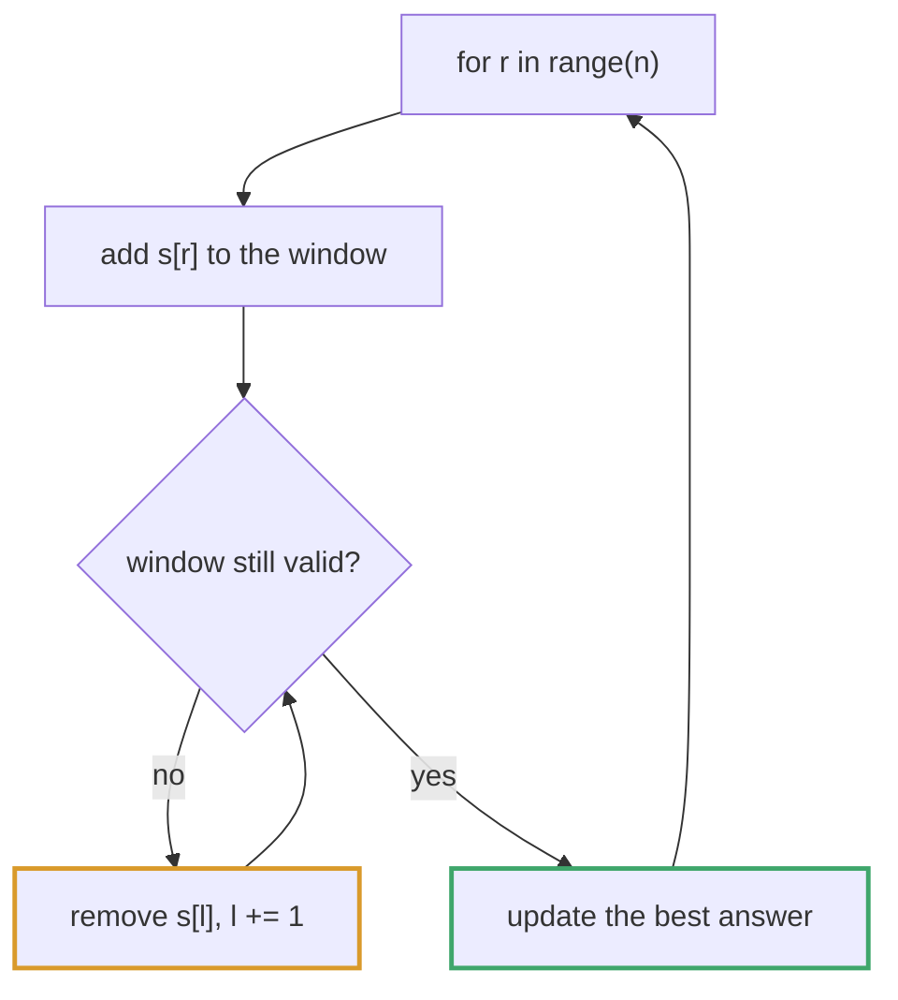
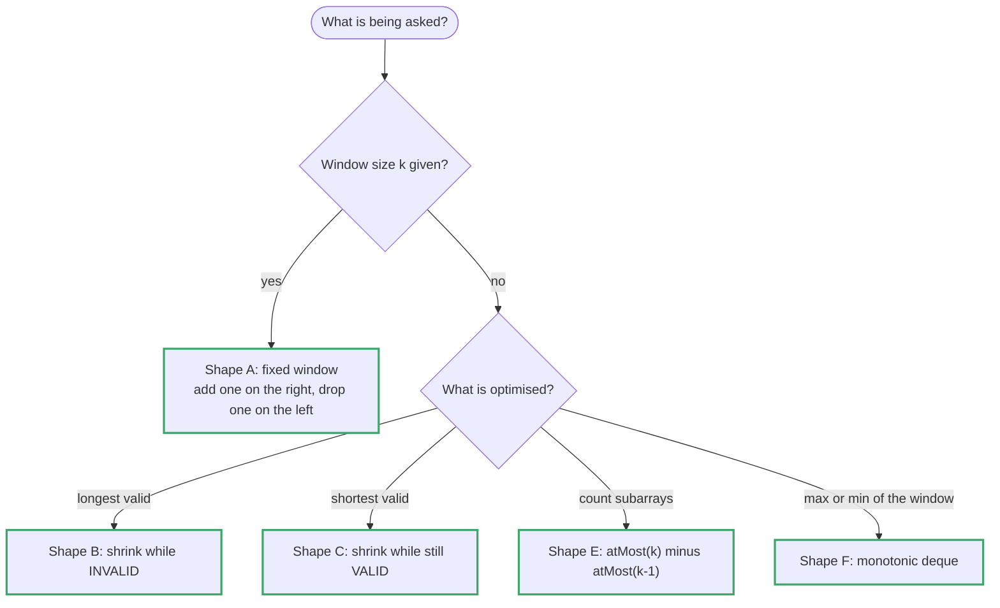

# Topic 03 · Sliding Window — Python Deep Dive

> A sliding window is the answer to one specific question: *"what is the best
> **contiguous** subarray/substring such that …?"* Every problem in this folder
> has an obvious O(n²) solution — try every `(l, r)` pair — and the window
> collapses it to O(n) by never re-examining a range it has already ruled out.
>
> But the collapse is **not always legal.** Roughly half of this guide is the
> legality condition, because candidates who skip it write windows for problems
> that cannot have one (LC 862 is the trap) and get wrong answers, not slow ones.

---

## Part 1 · The Mechanism

### 1.0 What "window" actually means

A window is a pair of indices `l <= r` denoting the contiguous range
`a[l..r]`, plus an **aggregate** maintained incrementally over that range —
a sum, a character-count map, a max, a count of distinct values.

```
a = [2, 1, 5, 1, 3, 2]
         l     r
         └─────┘   window = a[1..3] = [1,5,1], sum = 7, len = 3
```

The two operations are:

```python
# EXPAND: r moves right, one element ENTERS the window
window_sum += a[r]

# CONTRACT: l moves right, one element LEAVES the window
window_sum -= a[l];  l += 1
```

Both are **O(1)**. That is the entire trick. Recomputing the aggregate from
scratch — `sum(a[l:r+1])` — is O(r−l) and instantly restores the O(n²) you were
trying to escape. **If you cannot update your aggregate in O(1) on enter and
O(1) on leave, you do not have a sliding window.** (§1.6 is what to do then.)

---

### 1.1 Why it is O(n) despite the nested loop

The template *looks* quadratic:




```python
for r in range(n):          # outer loop
    ...
    while invalid:          # inner loop  <- looks like O(n) inside O(n)
        l += 1
```

It is not, and the argument is **amortization**, not case analysis:

```
    r only ever increases.   It moves n times total, then stops.
    l only ever increases.   l <= r <= n, so l also moves at most n times total.

    Total pointer movement across the WHOLE run <= 2n.
    Each movement does O(1) work.
    => O(n).
```

The inner `while` may run 5 times on one iteration and 0 times on the next
thirty. You do not bound it *per iteration* — you bound it **over the entire
run**. Say exactly that out loud in an interview:

> *"The inner loop isn't nested work — `l` never resets and never goes
> backwards, so across all n iterations it advances at most n times total.
> Two pointers, each making at most n monotone steps: O(n)."*

⚠️ The word doing the work is **monotone**. The instant your code contains
`l = 0` or `l -= 1` inside the loop, this argument dies and so does the
complexity. If you find yourself wanting to reset `l`, you are in a different
technique (usually prefix sums, topic 04).

---

### 1.2 The legality condition — when a window is allowed at all

This is the part that separates people who *understand* windows from people
who *recognise* them.

**For "longest valid window" problems, validity must be HEREDITARY:**

> If `a[l..r]` is valid, then every sub-range of it is also valid.
> Equivalently: if `a[l..r]` is INVALID, then `a[l'..r]` for any `l' < l`
> is invalid too — a bigger window can never repair a broken one.

That contrapositive is what licenses `l += 1` as a permanent decision. When the
window at `r` is broken, shrinking from the left is the *only* move that can fix
it, and everything you shrink past is dead forever.

```
"no repeated characters"       hereditary ✅  (a subrange of a distinct
                                              string is still distinct)
"at most k zeros"              hereditary ✅  (removing elements can only
                                              reduce the zero count)
"at most k distinct values"    hereditary ✅
"sum <= T", all a[i] >= 0      hereditary ✅  (dropping a non-negative
                                              element cannot raise the sum)
"sum <= T", a[i] may be < 0    NOT hereditary ✗  ← LC 862 lives here
"contains at least one 7"      NOT hereditary ✗  (shrinking can destroy it)
```

**For "shortest window satisfying P" problems you need the mirror property —
P must be UPWARD-CLOSED:** if `a[l..r]` satisfies P, so does any window
containing it. `sum >= T` with non-negative values is upward-closed; with
negatives it is not.

**The canonical trap — LC 209 vs LC 862.**

| | LC 209 Minimum Size Subarray Sum | LC 862 Shortest Subarray with Sum ≥ K |
|---|---|---|
| Values | `1 <= nums[i]` (positive) | `-10^5 <= nums[i]` (may be negative) |
| Question | shortest subarray with `sum >= target` | *identical wording* |
| Correct tool | **sliding window, O(n)** | **prefix sums + monotonic deque, O(n)** |
| Why | growing the window can only grow the sum | growing can *shrink* the sum, so a broken window may be repaired by extending left — `l += 1` throws away answers |

They are deliberately near-identical. Before writing a window, **check the sign
constraint.** If negatives are allowed and your aggregate is a sum, stop.

---

### 1.3 Shape A · Fixed-size window (`k` given)

The easiest shape, and the one people over-engineer. There is no validity
condition and no inner loop — the window is *always* size `k`, so every step
does one enter and one leave.

```python
def fixed(a, k):
    s = sum(a[:k])                 # prime the first window: O(k)
    best = s
    for r in range(k, len(a)):     # r = the element ENTERING
        s += a[r] - a[r - k]       # enter a[r], leave a[r-k]
        best = max(best, s)
    return best
```

```
a = [1, 12, -5, -6, 50, 3],  k = 4

  [1  12  -5  -6] 50   3      s = 2
   1 [12  -5  -6  50]  3      s = 2 + 50 - 1  = 51
   1  12 [-5  -6  50   3]     s = 51 + 3 - 12 = 42
```

Two ways to write the loop, and mixing them up is the #1 fixed-window bug:

| Style | `r` means | Leaving element | Window is full when |
|---|---|---|---|
| **Prime-then-slide** (above) | entering index | `a[r-k]` | always |
| **Single loop** | entering index | `a[r-k]` | `r >= k-1` |

```python
# Single-loop form — one loop, no priming. Prefer this; it generalises.
s = 0
for r, x in enumerate(a):
    s += x                                  # enter
    if r >= k:                              # window would be k+1 long
        s -= a[r - k]                       # leave
    if r >= k - 1:                          # window is exactly k long
        best = max(best, s)
```

⚠️ **`r >= k` for the leave, `r >= k - 1` for the answer.** Off by one here and
you either read a k+1-sized window or skip the first legitimate one.

⚠️ **Never write `sum(a[i:i+k])` inside a loop.** It is O(k) per iteration, so
O(nk) overall — the exact quadratic the window exists to remove. This is the
single most common way a "sliding window solution" is secretly brute force.

---

### 1.4 Shape B · Variable window, LONGEST valid (`while` shrink)

The workhorse. Grow greedily; shrink only as much as needed to restore validity.

```python
def longest(a):
    l = 0
    best = 0
    for r in range(len(a)):
        add(a[r])                       # 1. ENTER
        while not valid():              # 2. RESTORE (may run 0..many times)
            remove(a[l]); l += 1
        best = max(best, r - l + 1)     # 3. RECORD — window is valid here
    return best
```

The three-step body is worth memorising verbatim: **enter, restore, record.**
The order is not negotiable —

- Recording before restoring measures an invalid window.
- Restoring before entering makes the `while` condition test stale state.

⚠️ **`r - l + 1`, not `r - l`.** A window with `l == r` holds one element.
Write the `+ 1` reflexively; it is the most-missed character in this topic.

**Members:** LC 3 (no repeats), LC 904 (≤2 distinct), LC 340 (≤k distinct),
LC 1004 (≤k zeros), LC 424 (≤k replacements), LC 159, LC 1493.

---

### 1.5 Shape C · Variable window, SHORTEST valid (`while` shrink *while still valid*)

The condition flips. You shrink **while the window is still good**, recording as
you go, because a smaller good window is a better answer.

```python
def shortest(a, target):
    l = 0
    s = 0
    best = float('inf')                 # ← not 0, and not len(a)
    for r in range(len(a)):
        s += a[r]                       # ENTER
        while s >= target:              # while STILL VALID (note: not "while invalid")
            best = min(best, r - l + 1) # RECORD before shrinking
            s -= a[l]; l += 1           # SHRINK
    return 0 if best == float('inf') else best
```

Compare the two shapes side by side — this is the fork people fumble under
pressure:

```
LONGEST                                SHORTEST
  while INVALID:  shrink                 while VALID:  record, then shrink
  record AFTER the loop                  record INSIDE the loop
  best = max(...)                        best = min(...)
  init best = 0                          init best = infinity
```

⚠️ Initialise the minimum to `float('inf')` (or `n + 1`), never `0` — `min`
against `0` returns `0` forever. And translate "not found" back to whatever the
problem wants (usually `0`, sometimes `-1`).

**Members:** LC 209, LC 76 (Minimum Window Substring), LC 1234, LC 1658.

---

### 1.6 Shape D · The never-shrinking window

A genuinely different idea, and the one that makes LC 424 and LC 1004 feel like
magic. If the question is only **"how long is the longest valid window?"**, you
never need the window to shrink at all — you only need it to *stop growing*
while invalid.

```python
for r in range(n):
    add(a[r])
    if not valid():          # ← `if`, NOT `while`
        remove(a[l]); l += 1 # slide the whole window right by one
return r - l + 1             # ← the FINAL size is the answer
```

The window's length is **non-decreasing**: it grows by one on an expand and, when
invalid, stays exactly the same size (one enters, one leaves). So at the end its
width equals the largest valid width ever achieved, and you never call `max`.

**Why it is correct even though the window may be invalid at times:** you are not
claiming every intermediate window is valid. You are claiming the width never
exceeds the best valid width — because it only ever *increases* on a step that
ended valid. An invalid window of width w is proof that a valid one of width w
existed earlier; it just slides along carrying that width forward.

⚠️ Use this only for **maximise-length** questions. If you must return the window
*contents*, the actual indices, or a count of valid windows, you need the honest
`while` version from §1.4.

---

### 1.7 Shape E · COUNTING windows, and the `atMost` trick

"How many subarrays satisfy P?" is a window problem with a different final line.

**The counting identity.** When P is hereditary, and `l` is the smallest left
index such that `a[l..r]` is valid, then the valid subarrays *ending at r* are
exactly `a[l..r], a[l+1..r], …, a[r..r]`:

```python
count += r - l + 1        # ← replaces `best = max(best, r - l + 1)`
```

That single substitution turns any Shape-B window into a counter.

**The `exactly k` problem.** "Exactly k distinct" is **not hereditary** (drop an
element and you may fall to k−1), so it has no direct window. The fix is
inclusion–exclusion:

```
    exactly(k)  =  atMost(k) − atMost(k − 1)
```

`atMost(k)` *is* hereditary, so each half is a plain Shape-E window and the whole
thing stays O(n). Same identity, same shape, for "sum exactly S" over 0/1 arrays
(LC 930) and "exactly k odd numbers" (LC 1248).

⚠️ Two separate windows, two separate `l` variables. Do not try to maintain both
bounds in one pass on your first attempt — it is possible, and it is a great
follow-up answer, but it is easy to get wrong under time pressure.

**Members:** LC 992, LC 930, LC 1248, LC 713, LC 2537.

---

### 1.8 Shape F · Monotonic-deque windows (when the aggregate has no inverse)

Sum has an inverse: an element leaves, you subtract it. **Max does not.** If the
maximum leaves the window, the new maximum is somewhere in the remaining
elements and no O(1) arithmetic recovers it.

The fix is to keep a `deque` of **indices** whose values are strictly decreasing:

```python
from collections import deque

dq = deque()                       # indices, values decreasing left→right
for r, x in enumerate(a):
    while dq and a[dq[-1]] <= x:   # x makes every smaller tail useless FOREVER
        dq.pop()                   #   (x is newer AND bigger)
    dq.append(r)
    if dq[0] <= r - k:             # front fell out of the window
        dq.popleft()
    if r >= k - 1:
        out.append(a[dq[0]])       # front is the window max
```

The invariant: *the deque holds exactly the indices that could still be the
maximum of some future window, in decreasing value order.* Everything popped was
dominated — smaller **and** older — so it can never win again.

Still O(n): each index is appended once and popped at most once, so ≤ 2n deque
operations.

**Members:** LC 239 (window max), LC 862 (via prefix sums), LC 1438 (two deques —
one for max, one for min), LC 1696.

---

## Part 2 · The Four Questions (use these instead of memorising problems)

Before writing a line, answer these in order. They determine the shape
completely:




```
1. Is the window size FIXED (given k) or VARIABLE?
        FIXED    -> Shape A. No inner loop. Watch the two off-by-ones.
        VARIABLE -> continue.

2. What am I RETURNING?
        longest length          -> Shape B (or D if length is all I need)
        shortest length         -> Shape C  (while VALID: record, shrink)
        a COUNT of subarrays    -> Shape E  (count += r - l + 1)
        the window CONTENTS     -> Shape B/C, track (best_l, best_r), not just a length
        a value per window      -> Shape A or F

3. What is my AGGREGATE, and can I update it O(1) on enter AND on leave?
        sum / count of X        -> yes, plain int
        character frequencies   -> yes, dict/Counter/array[26]
        number of DISTINCT      -> yes, dict + `del` on zero (see §3.2)
        max / min               -> NO inverse -> Shape F, monotonic deque
        "is it a palindrome"    -> no -> not a window problem at all

4. Is my validity predicate HEREDITARY (§1.2)? Are all values non-negative?
        yes -> proceed
        no  -> STOP. Prefix sums (topic 04), monotonic deque, or binary search.
```

---

## Part 3 · Python Facts That Decide the Implementation

### 3.1 `Counter` vs `defaultdict(int)` vs plain `dict` — they are NOT interchangeable

⚠️ **A read miss on `defaultdict(int)` INSERTS the key. On `Counter` it does
not.** This is a live bug in every "count the distinct elements in the window"
problem, because you measure distinctness with `len()`:

```python
from collections import Counter, defaultdict

c = Counter();       _ = c['q'];  len(c)   # 0  — Counter.__missing__ returns 0, no insert
d = defaultdict(int); _ = d['q']; len(d)   # 1  — !!! a phantom key with value 0
```

So `while len(window) > k:` silently over-counts with a `defaultdict` the moment
anything merely *inspects* a missing key. Use `Counter`, or a plain dict with
`.get(x, 0)`.

### 3.2 `del` on zero — the other half of the same bug

Even with `Counter`, decrementing to zero **leaves the key present**:

```python
c = Counter("aab")
c['b'] -= 1
len(c)              # 2   ← 'b' is still a key with value 0
c == Counter("aa")  # True ← but EQUALITY ignores zero counts (Python 3.10+)
```

Both halves of that matter:

- **`len()` counts zombie keys.** If `len(window)` is your distinct-count, you
  *must* `del window[x]` when it hits 0. Every ≤k-distinct problem depends on it.
- **`==` does not.** `Counter` equality compares as a multiset and ignores
  zero-valued keys, so `window == need` is correct without cleanup. Convenient —
  but it is O(alphabet) per comparison, which is why §3.3 exists.

```python
window[x] -= 1
if window[x] == 0:
    del window[x]          # keeps len() == number of DISTINCT values in window
```

### 3.3 The `have`/`need` counter — avoid comparing dicts every step

Anagram and minimum-window problems tempt you into `if window == need:` inside
the loop. That is O(Σ) per step. Track a single integer instead:

```python
need = Counter(t)
have, required = 0, len(need)      # `have` = chars whose count is EXACTLY satisfied

# on enter:
window[c] += 1
if c in need and window[c] == need[c]:
    have += 1
# on leave:
if c in need and window[c] == need[c]:
    have -= 1                       # check BEFORE the decrement
window[c] -= 1

valid = (have == required)          # O(1)
```

⚠️ `== need[c]` (exact equality), never `>=`. With `>=` you increment `have`
again on every extra copy of the same character and the count is meaningless.

### 3.4 Fixed alphabets: a 26-slot list — and where it actually wins

When the input is guaranteed lowercase ASCII you can use `[0] * 26` indexed by
`ord(c) - 97` instead of a dict. **Measure before you believe the folklore.** On
CPython, 400k increments:

```
list[26] + ord(c) - 97      11.3 ms      <- NOT faster
plain dict, d.get(c, 0)     10.0 ms
defaultdict(int)            12.1 ms
Counter, d[c] += 1          22.0 ms      <- ~2x slower than a plain dict
```

Per-character counting is a **wash** — `ord()` is a function call, and CPython's
dict lookup on a one-character string is already about as fast. The array's real
win is in **whole-map COMPARISON**, and there it is not close (200k compares):

```
list == list             6.6 ms
Counter == Counter     464.2 ms          <- ~70x slower
```

So the rule is not "arrays are faster than dicts". It is:

- Counting one character at a time → use whatever is clearest; a plain `dict`
  with `.get` is marginally the fastest, and `Counter` is the slowest.
- **Comparing entire frequency maps inside the loop** (LC 567, LC 438) → a
  26-slot list is dramatically faster. Better still, do not compare maps at all
  — use the `have`/`need` counter in §3.3 and make it O(1).

Say the constraint out loud when you use the array: *"the problem guarantees
lowercase English letters, so a 26-slot list is enough — and it makes the
whole-map comparison a fixed 26 steps."*

### 3.5 `deque` is the only O(1)-at-both-ends container

```python
a.pop(0)        # O(n)  — shifts every remaining element. Never in a loop.
dq.popleft()    # O(1)  — collections.deque
```

A `deque` also indexes `dq[0]` and `dq[-1]` in O(1) (but `dq[len//2]` is O(n) —
it is a doubly-linked list of blocks, not an array).

### 3.6 Slicing copies — the hidden quadratic, again

`s[l:r+1]` is O(r−l). Inside a loop that runs n times, your O(n) window is
O(n²). Track `best_l` and `best_len` as integers, and slice **once** at the end:

```python
if r - l + 1 < best_len:
    best_len, best_l = r - l + 1, l    # O(1) bookkeeping
...
return s[best_l:best_l + best_len]     # one slice, after the loop
```

The same applies to building output with `res += s[r]` on strings — each `+=`
copies. Append to a list, `"".join()` once.

### 3.7 `enumerate` over `range(len(...))`

`for r, ch in enumerate(s):` avoids repeated `s[r]` lookups and reads better. Use
`range(len(s))` only when you genuinely need arithmetic on indices you do not
have values for.

---

## Part 4 · Complexity Reference for This Topic

| Operation | Cost | Note |
|---|---|---|
| `s += a[r]` / `s -= a[l]` | O(1) | the whole point |
| `sum(a[l:r+1])` | **O(r−l)** | the quadratic trap |
| `a[l:r+1]` (slice) | **O(r−l)** | copies |
| `counter[c] += 1` | O(1) avg | hashing a char |
| `del counter[c]` | O(1) avg | required for `len()` to mean "distinct" |
| `len(counter)` | O(1) | reads a field — but counts zero-valued keys |
| `counter_a == counter_b` | **O(Σ)** | Σ = distinct keys; avoid per-step |
| `dq.append` / `popleft` | O(1) | `deque` |
| `list.pop(0)` | **O(n)** | never |
| `ord(c) - 97` | O(1) | no hashing at all |
| Whole Shape-A/B/C/D pass | **O(n)** | two monotone pointers, ≤2n moves |
| Shape E `exactly(k)` | **O(n)** | two O(n) passes, still linear |
| Shape F deque pass | **O(n)** | each index pushed once, popped once |

Space is **O(1) for numeric aggregates, O(Σ) for character maps** — and Σ ≤ 26 or
≤ 128 is a constant, so say *"O(1) auxiliary space, since the alphabet is
bounded"* rather than O(n). For LC 992-style counting over arbitrary ints it is
genuinely O(k) or O(n).

---

## Part 5 · Where Sliding Window Ends

Know the neighbours, because interviewers probe the boundary:

| Symptom | Right tool | Why not a window |
|---|---|---|
| Values may be **negative**, aggregate is a sum | **prefix sums + hash map** (topic 04), or prefix + monotonic deque | growing can shrink the sum; `l += 1` discards live answers |
| Subsequence, not subarray (elements need not be adjacent) | DP (topics 16/17) | a window is contiguous by definition |
| Array is **sorted** and you want a pair | converging two pointers (topic 02) | `l` and `r` move toward each other, not both right |
| You need the k-th largest across the window | heap (topic 12) or two heaps | deque gives you the max only |
| "Any subarray with sum exactly S", negatives allowed | prefix sum + hash map | LC 560 — the classic non-window lookalike |
| Query many arbitrary ranges after the fact | prefix sums / segment tree (topics 04/26) | a window is one left-to-right pass |

**LC 560 vs LC 209 is the fork to have ready.** *"Subarray sum equals K"* with
negatives → prefix-sum hash map, O(n) but a completely different mechanism.
*"Minimal subarray sum ≥ target"* with positives → sliding window. Recognising
that the sign constraint, not the wording, picks the tool is the signal.

---

## Part 6 · The Progression in This Folder

```
  001  LC 121   Best Time to Buy/Sell Stock   the degenerate window (l snaps to r)
  002  LC 643   Maximum Average Subarray I    Shape A, the canonical fixed window
  003  LC 1456  Max Vowels in Substring       Shape A with a predicate count
  004  LC 219   Contains Duplicate II         Shape A over a SET, not a sum
  005  LC 3     Longest Substring No Repeat   Shape B — the archetype
  006  LC 1004  Max Consecutive Ones III      Shape B/D — "at most k violations"
  007  LC 424   Longest Repeating Char Repl   Shape D — the never-shrink window
  008  LC 209   Minimum Size Subarray Sum     Shape C — and the sign constraint
  009  LC 904   Fruit Into Baskets            Shape B — ≤2 distinct, `del` on zero
  010  LC 567   Permutation in String         Shape A + have/need counter
  011  LC 438   Find All Anagrams             010 generalised to every position
  012  LC 930   Binary Subarrays With Sum     Shape E — atMost, first exposure
  013  LC 992   Subarrays with K Distinct     Shape E — exactly(k) = ≤k − ≤(k−1)
  014  LC 76    Minimum Window Substring      Shape C + have/need — the boss
  015  LC 239   Sliding Window Maximum        Shape F — the monotonic deque
```

Do them in order. 005 → 006 → 007 is the same idea sharpened three times, and
010 → 011 → 015 is one machine (`have`/`need`) applied at increasing difficulty.

---

<!-- block:03_py_1_variations -->
## Part 7 · Variations You Will Meet Next — and the Follow-ups That Come With Them

Every snippet below was run against LeetCode's own examples while writing this section.

### 7.1 "At most K distinct" for general K (LC 340)

Fruit Into Baskets is this with `K = 2`. Keep a `Counter`, and `del` the key when its count reaches zero —
that is what makes `len(count)` the distinct count.

```python
def longest_k_distinct(s, k):
    if k == 0: return 0
    count, l, best = Counter(), 0, 0
    for r, ch in enumerate(s):
        count[ch] += 1
        while len(count) > k:                  # invalid: too many distinct
            count[s[l]] -= 1
            if count[s[l]] == 0: del count[s[l]]
            l += 1
        best = max(best, r - l + 1)
    return best                                # ("eceba", 2) -> 3
```

### 7.2 When the aggregate needs BOTH a max and a min: two monotonic deques (LC 1438)

"Longest subarray whose `max − min ≤ limit`." The validity test needs the window's max **and** min, and neither
has an inverse, so keep one deque for each (indices; one decreasing, one increasing):

```python
def longest_subarray_limit(nums, limit):
    maxq, minq = deque(), deque()
    l = best = 0
    for r, x in enumerate(nums):
        while maxq and nums[maxq[-1]] <= x: maxq.pop()
        maxq.append(r)
        while minq and nums[minq[-1]] >= x: minq.pop()
        minq.append(r)
        while nums[maxq[0]] - nums[minq[0]] > limit:      # invalid: shrink
            l += 1
            if maxq[0] < l: maxq.popleft()               # evict what fell out on the left
            if minq[0] < l: minq.popleft()
        best = max(best, r - l + 1)
    return best      # [8,2,4,7],4 -> 2   [10,1,2,4,7,2],5 -> 4   [4,2,2,2,4,4,2,2],0 -> 3
```

Still O(n): every index enters and leaves each deque once. This is Shape F (Part 1.8) used twice.

### 7.3 The window wraps around (circular arrays)

Append the first `k − 1` elements to the end and slide over that: every wrap-around window becomes an
ordinary one. `[5, -1, 3, 8, -2]`, `k = 3` → the best window is `[8, -2, 5]` = 11.

```python
def max_circular_window_sum(nums, k):
    ext = nums + nums[:k - 1]
    s = sum(ext[:k]); best = s
    for r in range(k, len(ext)):
        s += ext[r] - ext[r - k]
        best = max(best, s)
    return best
```

### 7.4 Windows over other units

| Setting | The window's unit | Bookkeeping |
|---|---|---|
| Concatenation of All Words (LC 30) | a whole **word**, not a character | Slide by word length, once per starting offset `0 .. wordLen-1`; the counter is over words. |
| Time-based ("hits in the last 300 s") | a **timestamp** | A `deque` of timestamps; evict from the left while `t - front >= 300` (topic 25, Design Hit Counter). |
| 2D windows (sum of a sub-rectangle) | a rectangle | Not slid at all — 2D prefix sums (topic 04) answer any rectangle in O(1). |
| Sliding window **median** | a window with an order statistic | Two heaps with lazy deletion (topic 12) or an order-statistics tree; a deque cannot do it. |

### 7.5 Follow-ups the interviewer reaches for

| Follow-up | The answer |
|---|---|
| "The input is a stream." | Windows are already single-pass and O(window) space; keep only the state and the last `k` items (a `deque`). |
| "Values can be negative." | Stop. A window's sum is no longer monotone; use prefix sums + a hash map (topic 04) or a monotonic deque over prefix sums (LC 862). |
| "Return the window, not its length." | Track `(best_l, best_r)` when you update the best; slice once at the end. |
| "What if `k` is larger than the array?" | Decide up front: return `0`/`[]`, or clamp — and check before priming the first window (`IndexError` otherwise). |
| "Do it for every `k`." | A single window cannot; that is a different problem (prefix sums, or per-`k` O(n)). |
| "Why is this O(n) and not O(n²)?" | Each pointer only moves forward, so across the whole run they move at most `n` times each — Part 1.1. |

---
<!-- /block:03_py_1_variations -->

<!-- problem-map:start -->
## Part 8 · Every Problem in This Topic, by Pattern

Fifteen problems, six window shapes (A fixed · B longest · C shortest · D never-shrinking · E counting · F monotonic deque). Numbers follow the folder; each **Trap** is one the tests in that problem's solution file actually trigger.

| Problem | Move | The idea — and the trap it sets |
|---|---|---|
| [001 · Best Time to Buy and Sell Stock](PyDSA/03_sliding_window/001_best_time_to_buy_and_sell_stock_solution.py) <br>LC 121 · Easy | The degenerate window | Treat every day as the *sell* day and carry the cheapest price so far — the left edge snaps to the right edge whenever a cheaper day arrives. **Trap:** `max(prices) - min(prices)` ignores that the buy comes *first* (`[2, 4, 1]` gives 3, not 2); seeding `best` with `-inf` on a falling array (the answer is 0). |
| [002 · Maximum Average Subarray I](PyDSA/03_sliding_window/002_maximum_average_subarray_i_solution.py) <br>LC 643 · Easy | Shape A · fixed | Prime the first window in O(k), then each step adds the entering element and subtracts the leaving one: `s += nums[r] - nums[r-k]`. **Trap:** `sum(nums[i:i+k])` inside the loop — a fake O(n) that is really O(nk); `best = 0` fails on all-negative input. |
| [003 · Maximum Number of Vowels in a Substring of Given Length](PyDSA/03_sliding_window/003_maximum_number_of_vowels_in_a_substring_solution.py) <br>LC 1456 · Medium | Shape A · predicate count | The same fixed window with the aggregate swapped from a sum to *a count of elements satisfying a predicate* (vowels). **Trap:** recounting the window each step (`s[i:i+k].count(...)`); building the vowel set inside the loop. |
| [004 · Contains Duplicate II](PyDSA/03_sliding_window/004_contains_duplicate_ii_solution.py) <br>LC 219 · Easy | Shape A · over a set | A window of the previous `k` values held in a *set*; one membership test per element. **Trap:** evicting `nums[r-k]` instead of `nums[r-k-1]` (off by one — `[1,2,3,1]`, `k=3` returns False); testing *after* inserting (always True). |
| [005 · Longest Substring Without Repeating Characters](PyDSA/03_sliding_window/005_longest_substring_without_repeating_characters_solution.py) <br>LC 3 · Medium | Shape B · longest | Expand `r`; when the incoming character is already inside, shrink from the left until it is not. Jumping `l` past the last occurrence is the optimisation. **Trap:** an unguarded `l = last[ch] + 1` (needs `max(l, …)` — `"abba"` returns 3); `r - l` instead of `r - l + 1`. |
| [006 · Max Consecutive Ones III](PyDSA/03_sliding_window/006_max_consecutive_ones_iii_solution.py) <br>LC 1004 · Medium | Shape B/D · "at most k bad" | Reframe first: "flip at most k zeros" *is* "longest subarray containing at most k zeros" — the flipping is a red herring. **Trap:** trying to decide *which* zeros to flip (greedy or DP); `r - l` instead of `r - l + 1`. |
| [007 · Longest Repeating Character Replacement](PyDSA/03_sliding_window/007_longest_repeating_character_replacement_solution.py) <br>LC 424 · Medium | Shape D · never shrinks | Window valid iff `(r-l+1) - max_freq <= k`; track the max frequency as a *count*, and let the window only grow or slide by one. **Trap:** tracking the letter's identity instead of its count; returning `len(s) - l` after a `while` that recomputes an honest max (`"AABABBA"` → 3, not 4). |
| [008 · Minimum Size Subarray Sum](PyDSA/03_sliding_window/008_minimum_size_subarray_sum_solution.py) <br>LC 209 · Medium | Shape C · shortest | Grow on the right; *while the window is still valid*, record its length and shrink from the left. **Trap:** `best = 0` (the `min` never moves off it) instead of `inf`; returning `inf` when nothing qualifies (the answer is 0). Only valid for non-negative numbers. |
| [009 · Fruit Into Baskets](PyDSA/03_sliding_window/009_fruit_into_baskets_solution.py) <br>LC 904 · Medium | Shape B · ≤ 2 distinct | Strip the story: the longest subarray with at most two distinct values (LC 340 with K = 2). **Trap:** forgetting `del count[x]` when a count hits zero, so `len(count)` never falls (infinite shrink); `defaultdict(int)` inserting phantom keys on a stray read — use `Counter`. |
| [010 · Permutation in String](PyDSA/03_sliding_window/010_permutation_in_string_solution.py) <br>LC 567 · Medium | Shape A + have/need | A permutation of `s1` is a fixed-width window with identical frequencies; slide two 26-slot lists and compare. **Trap:** not checking `len(s1) > len(s2)` first; forgetting to compare the *first* (priming) window. |
| [011 · Find All Anagrams in a String](PyDSA/03_sliding_window/011_find_all_anagrams_in_a_string_solution.py) <br>LC 438 · Medium | Shape A at every index | 010 with the verdict line changed: collect `r - k + 1` instead of returning True. **Trap:** appending `r` (every index off by `k - 1`); never testing the primed window, so a match at index 0 is missed. |
| [012 · Binary Subarrays With Sum](PyDSA/03_sliding_window/012_binary_subarrays_with_sum_solution.py) <br>LC 930 · Medium | Shape E · counting | Two reusable moves: count with `count += r - l + 1`, and get *exactly* from *at most*: `atMost(g) - atMost(g - 1)`. **Trap:** no `if k < 0: return 0` guard (`goal = 0` crashes); writing one direct window for "sum == goal" — it is not hereditary. |
| [013 · Subarrays with K Different Integers](PyDSA/03_sliding_window/013_subarrays_with_k_different_integers_solution.py) <br>LC 992 · Hard | Shape E · exactly K | A composition of two solved problems: the "at most K distinct" window from 009 and the counting trick from 012. **Trap:** trying to slide a window for "exactly k" directly (it is a band, not a suffix); omitting `del count[x]`. |
| [014 · Minimum Window Substring](PyDSA/03_sliding_window/014_minimum_window_substring_solution.py) <br>LC 76 · Hard | Shape C + have/need | A need-counter plus *one* integer, `missing`, that changes only when a character's count crosses the need boundary — validity becomes the O(1) test `missing == 0`. **Trap:** treating `t` as a set (`"a"` vs `"aa"` must be `""`); decrementing `missing` for surplus copies. |
| [015 · Sliding Window Maximum](PyDSA/03_sliding_window/015_sliding_window_maximum_solution.py) <br>LC 239 · Hard | Shape F · monotonic deque | Keep *indices* whose values decrease front to back; pop smaller-or-equal from the back (they can never be a maximum again), pop the front when it slides out. **Trap:** storing values and evicting with `nums[i-k] == dq[0]` (duplicates break it: `[5,5,1]`, `k=2` returns `[5,1]`). |

---
<!-- problem-map:end -->

## Checklist Before Leaving This Topic

- [ ] I can write the enter / restore / record template from memory, in the right
      order, with `r - l + 1`.
- [ ] I can state the **amortization argument** — why two monotone pointers make
      a nested `while` linear — in one sentence.
- [ ] I check the **sign constraint** before writing a sum-based window, and I
      can name LC 209 vs LC 862 as the pair that turns on it.
- [ ] I can say what "hereditary" means and test my predicate against it.
- [ ] I know the longest-shape (`while invalid`, record after, `max`, init 0)
      from the shortest-shape (`while valid`, record inside, `min`, init `inf`).
- [ ] I `del` a count when it hits zero, and I know exactly why `len()` breaks
      otherwise — and that `Counter.__eq__` is the one place it does not matter.
- [ ] I never call `sum()` or slice inside the loop.
- [ ] I can convert any longest-window into a counter with `count += r - l + 1`
      and justify it.
- [ ] I can derive `exactly(k) = atMost(k) − atMost(k−1)` rather than recalling it.
- [ ] I can write the monotonic deque for window max and state its invariant:
      *indices that could still be the max of a future window, values decreasing.*
- [ ] I use `Counter`, not `defaultdict(int)`, whenever `len()` is my distinct count.
- [ ] Use two monotonic deques when the validity test needs both the max and the min <!--ca-->
- [ ] Turn a circular-window problem into an ordinary one by extending the array by `k − 1` <!--ca-->
- [ ] Say what changes when the input is a stream, when values go negative, and when `k > n` <!--ca-->

---

## Part 9 · Numbering Fix and the Two Hard Problems (014–015)

**16 Sep 2026:** `tools/problems.tsv` used to list this topic with numbers that didn't match the files
on disk (e.g. the TSV said 003 was Longest Substring, the file is `005_`). The generator matches on
exact filenames, so CURRICULUM.md showed 2/10. The TSV now matches the 13 files as written, and the two
planned Hard problems are added as 014 and 015.

### 014 Minimum Window Substring — the "shortest valid window" form with an O(1) validity check

```
need = Counter(t); missing = len(t)
add s[r]:     if need[c] > 0: missing -= 1;   need[c] -= 1
while missing == 0:  record; remove s[l]: need[c] += 1; if need[c] > 0: missing += 1; l += 1
```

Negative counts mean surplus copies and never touch `missing`. Comparing two full count maps every step
is also O(m) but was measured ~14x slower at m = 100,000 with 52 distinct letters.

### 015 Sliding Window Maximum — the monotonic DEQUE

A running max can't "subtract" the element that leaves. Keep indices whose values DECREASE front to
back: pop smaller-or-equal values off the back (they can never be a maximum again), pop the front when
it leaves the window. The front is the max. Store **indices**, not values: a value deque with duplicates
evicts the wrong copy (`[5,5,1]`, k=2 -> `[5,1]`).

This is the bridge to topic 06: a monotonic stack is this deque with one end.

### Checklist additions

- [ ] I can write Minimum Window Substring with the `missing` counter from memory.
- [ ] I can explain why the monotonic deque is O(n) and why it stores indices.
