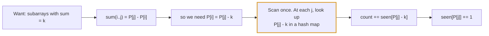
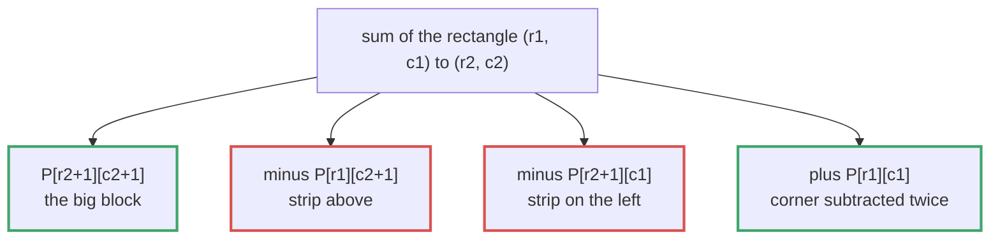
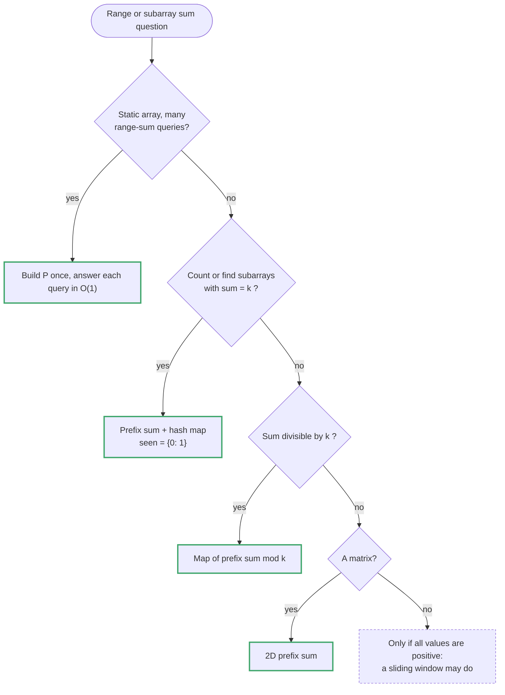

# Topic 04 · Prefix Sum — Python Deep Dive

> A prefix sum answers one question extremely well: *"what is the sum of
> **any** range `a[l..r]`, asked over and over, possibly thousands of times?"*
> Precompute once in O(n), then answer every range query in O(1). And its
> hashmap variant answers a second, less obvious question: *"does some
> contiguous subarray have property X?"* by turning a two-pointer search into
> a **lookup** — which is precisely the move that works when sliding window
> (topic 03) cannot.

---

## Part 1 · The Mechanism

### 1.0 The definition, and why the off-by-one exists on purpose

For an array `a` of length `n`, define:

```
prefix[0] = 0
prefix[i] = a[0] + a[1] + ... + a[i-1]      for i = 1 .. n
```

`prefix` has **n + 1** entries, one more than `a`. `prefix[i]` is the sum of
the first `i` elements — deliberately NOT `a[0..i]`, to keep `prefix[0] = 0`
as a real, usable "sum of nothing" sentinel. That sentinel is not decoration;
§1.3 depends on it existing.

```
a      = [ 2,  1,  5,  1,  3,  2]
index    0   1   2   3   4   5

prefix = [0,  2,  3,  8,  9, 12, 14]
index    0   1   2   3   4   5   6
```

**The range-sum formula**, the entire mechanism in one line:

```
sum(a[l..r])  =  prefix[r+1] - prefix[l]
```

```
sum(a[1..3]) = a[1]+a[2]+a[3] = 1+5+1 = 7
             = prefix[4] - prefix[1] = 9 - 2 = 7   ✓
```

Why `r+1` and not `r`: `prefix[r+1]` includes `a[r]` (it is the sum of the
first `r+1` elements, indices `0..r`), and `prefix[l]` excludes `a[l]` (sum of
the first `l` elements, indices `0..l-1`). Subtracting removes exactly the
prefix `a[0..l-1]`, leaving exactly `a[l..r]`. Draw the picture if the algebra
ever feels shaky:

```
prefix[r+1] = a[0] + a[1] + ... + a[l-1] + a[l] + ... + a[r]
prefix[l]   = a[0] + a[1] + ... + a[l-1]
              └──────────── cancels ────────────┘
difference  =                                     a[l] + ... + a[r]
```

Build it in one pass:

```python
prefix = [0] * (n + 1)
for i in range(n):
    prefix[i + 1] = prefix[i] + a[i]
```

O(n) to build, O(1) per query after that. **This is the whole trade**:
pay O(n) once, up front, to make every future range query O(1). It is a
preprocessing / query-time split, not a clever loop trick — the same family
as building a hash map once to make future lookups O(1).

---

### 1.1 The single most important idea in this topic

Read this twice; it is the fork the whole topic guide (and topic 03's) hangs
on.




> **Sliding window requires a MONOTONE validity condition** — growing the
> window can only make things better or worse in one direction, never both.
> That requires non-negative data (§1.2 of the topic 03 guide: "growing can
> only grow the sum" is what licenses `l += 1` as a permanent decision).
>
> **Prefix sum + hashmap works with ARBITRARY sign data.** It does not ask
> "should I grow or shrink a window?" at all. It asks a completely different
> question: *"have I seen this prefix value before?"* — turning a two-pointer
> search into a **dictionary lookup**.

Concretely: "does some subarray sum to exactly K?" with negative numbers
allowed has **no monotone window** — extending the window can make the sum
go up or down, so there is no principled rule for when to shrink `l`. But it
has an exact hashmap formulation:

```
sum(a[l..r]) == K
prefix[r+1] - prefix[l] == K
prefix[l] == prefix[r+1] - K
```

For each `r`, the question "does some earlier `l` work?" becomes "have I
already recorded a prefix value equal to `prefix[r+1] - K`?" — an O(1)
dictionary lookup, no matter what sign the numbers are. This is why LC 560
(topic 04, problem 004) is the direct negative-numbers answer to LC 209
(topic 03, problem 008), which is sliding window ONLY because its numbers are
positive. Same English question, different sign constraint, completely
different tool — see topic 03's guide §1.2 and Part 5 for the mirror image of
this exact argument.

**The decision in one sentence:** if the data can be negative and the
question is "does a contiguous range have property X," stop reaching for two
pointers — reach for a running aggregate and a `seen-before` map.

---

### 1.2 Why prefix sum + hashmap is O(n): the amortization is trivial here

Unlike sliding window, there is no subtle amortization argument to make. One
pass, one hashmap insert and one hashmap lookup per element, both O(1)
average:

```python
seen = {0: 1}              # prefix value -> how many times seen (the sentinel!)
running = count = 0
for x in a:
    running += x
    count += seen.get(running - K, 0)   # how many earlier prefixes make a K-sum end here
    seen[running] = seen.get(running, 0) + 1
```

O(n) time, O(n) space (the map can hold up to n+1 distinct prefix values).
There is no inner loop to amortize — the whole "why is this fast" story is
"hashmap operations are O(1) average," full stop. This is simpler to justify
than sliding window's proof, and interviewers will still want you to say it
out loud.

---

### 1.3 The `seen = {0: 1}` sentinel — the single most common bug in this topic

Initialise the map with `prefix[0] = 0` occurring **once**, before the loop
starts. Skip this and every subarray that is a prefix of the array itself
(starts at index 0) is silently undercounted or missed entirely.

```
a = [1, 1, 1],  K = 2

running prefixes as we go: 1, 2, 3  (these are prefix[1], prefix[2], prefix[3])

At running=2 (after a[1]): is there an earlier prefix equal to 2 - 2 = 0?
    Without the sentinel: seen = {1: 1} at this point -> 0 not found -> MISSED
    a[0..1] = [1, 1] sums to 2. This is a real answer being silently dropped.

    With the sentinel:    seen = {0: 1, 1: 1} -> 0 IS found -> counted ✓
```

The sentinel represents "the empty prefix before index 0," and it is what
lets a subarray starting at index 0 be recognised at all. **Whenever you
write `seen = {}` for a prefix-sum-as-hashmap problem, ask "does the whole
prefix-from-the-start case still work?" — if you didn't seed `{0: ...}`, it
usually doesn't.**

The exact seed value depends on what the map counts:

```python
seen = {0: 1}     # counting occurrences (LC 560, 974): the empty prefix
                  # has been "seen" once, before any element
seen = {0: -1}    # recording the FIRST INDEX a value was seen (LC 525, 523):
                  # the empty prefix is "at index -1," one before the array
```

---

### 1.4 Two variants of the same map, and when to use which

**Variant A — count occurrences** (LC 560, LC 974): the map stores *how many
times* each prefix value/remainder has been seen. Every earlier occurrence
contributes a separate valid subarray ending at the current index, so you
`+=` a count, and each new prefix increments its own bucket.

**Variant B — record the first index** (LC 525, LC 523): the map stores the
*earliest index* a prefix value was seen. You want the LONGEST or EARLIEST
qualifying subarray, and a longer subarray always comes from pairing with the
oldest occurrence, so you store an index once (`if value not in seen:`) and
never overwrite it.

```python
# Variant A: counting                    # Variant B: first index
seen = {0: 1}                            seen = {0: -1}
for i, x in enumerate(a):                for i, x in enumerate(a):
    running += x                             running += x
    count += seen.get(running - K, 0)        if running in seen:
    seen[running] = seen.get(          count = max(count, i - seen[running])
        running, 0) + 1                       else:
                                                   seen[running] = i
```

Confusing the two is the #2 bug in this topic: using `if value not in seen`
(Variant B) when the problem wants a count (Variant A) silently caps every
bucket at 1 and undercounts; using an incrementing counter (Variant A) when
you want the longest span forgets to keep the *earliest* index and returns a
shorter answer than the true one.

---

### 1.5 Prefix sum vs. remainder — the mod-K family (LC 974, LC 523)

"Subarray sum divisible by K" is the same hashmap trick, one layer removed:
instead of matching on the prefix value itself, you match on `prefix % K`,
because

```
(prefix[r+1] - prefix[l]) % K == 0   <=>   prefix[r+1] % K == prefix[l] % K
```

Two prefixes with the **same remainder mod K** bracket a subarray whose sum
is a multiple of K. This shrinks the map's key space from "up to n distinct
sums" to "at most K distinct remainders" — the map for LC 974 never holds
more than K entries.

⚠️ **Python-specific fact, and it is a genuine advantage over C/Java/Go
here:** Python's `%` always returns a result with the **same sign as the
divisor**. `-5 % 7` is `2` in Python, not `-5` (C-family languages give you
`-5` and you must write `((x % k) + k) % k` yourself to normalise it).
Because `K > 0` in both LC 974 and LC 523, `running % K` in Python is already
the canonical non-negative remainder — no normalisation code needed. State
this out loud if you have C/Java/Go experience; it is a real difference, not
folklore, and skipping the manual fix-up (because Python already did it) is a
legitimate thing to point out as a "gotcha I don't have to handle here."

---

## Part 2 · 2D Prefix Sums (LC 304)




### 2.0 The idea generalises by one more inclusion–exclusion step

A 1D prefix sum removes one earlier prefix. A 2D prefix sum removes a whole
rectangle, and doing that requires **inclusion–exclusion** because the two
rectangles you subtract overlap:

```
prefix[i][j] = sum of every cell in the rectangle (0,0) .. (i-1, j-1)

prefix[i][j] = matrix[i-1][j-1]
             + prefix[i-1][j]        (the rectangle above)
             + prefix[i][j-1]        (the rectangle to the left)
             - prefix[i-1][j-1]      (subtract: counted in BOTH above)
```

```
        j-1  j                         "above" and "left" both include the
   i-1 [ A ][ B ]                       top-left corner region (A) — add it
   i   [ C ][ x ]                       back once after subtracting it twice
```

Query a rectangle `(r1, c1)` to `(r2, c2)` (inclusive) with the 2D mirror of
the 1D formula — one addition, two subtractions, one addition back, all O(1):

```python
def sumRegion(r1, c1, r2, c2):
    return (prefix[r2+1][c2+1] - prefix[r1][c2+1]
            - prefix[r2+1][c1] + prefix[r1][c1])
```

```
   full rectangle to (r2+1, c2+1)
 - rectangle above the query   (rows 0..r1-1, full width)
 - rectangle left of the query (cols 0..c1-1, full height)
 + top-left corner (subtracted twice above, add back once)
```

Same trade as 1D, one dimension up: **O(m·n) to build the prefix matrix once,
O(1) per query forever after.** For a matrix queried many times (LC 304's
whole premise — `NumMatrix` is constructed once, `sumRegion` called
repeatedly), this beats recomputing a rectangle sum from scratch every query,
which is O(m·n) per query and defeats the entire point of precomputing.

---

## Part 3 · Pattern Decision Tree




```
1. Am I answering MANY range-sum queries against a FIXED array/matrix?
       YES -> plain prefix sum (1D: §1.0, 2D: Part 2). Precompute once,
              O(1) (or O(1) in 2D) per query.
       NO  -> continue.

2. Am I asking "does some contiguous subarray have property X"
       (sum == K, sum % K == 0, equal count of 0s and 1s, ...)?
       YES -> continue.
       NO  -> probably not this topic.

3. Can the underlying values be NEGATIVE, or does the property need
   arbitrary-sign arithmetic (a sum, not a monotone count)?
       YES -> prefix sum + hashmap (§1.1). NOT sliding window.
       NO, all non-negative and I want longest/shortest window
             -> sliding window (topic 03) may be simpler AND uses O(1)
                space instead of O(n) — reconsider before defaulting here.

4. What does the map need to store?
       COUNT of subarrays          -> Variant A, seen = {0: 1}, increment (§1.4)
       LONGEST / EARLIEST subarray -> Variant B, seen = {0: -1}, first-index-only (§1.4)

5. Is the match condition "sum == K" or "sum % K == 0"?
       sum == K       -> key the map on the running prefix value itself
       sum % K == 0   -> key the map on (running prefix) % K (§1.5) —
                          smaller key space, and Python's % is already
                          correctly signed for K > 0

6. Is the data 2D (a matrix)?
       YES -> Part 2's inclusion–exclusion, one query = O(1) after O(mn) build
```

---

## Part 4 · Complexity Reference for This Topic

| Operation | Cost | Note |
|---|---|---|
| Build 1D `prefix` array | O(n) | one pass, one array +1 longer than input |
| `prefix[r+1] - prefix[l]` | O(1) | the entire point |
| Recompute `sum(a[l:r+1])` per query | **O(r−l)** | the trap — O(nq) over q queries |
| Build 2D `prefix` matrix | O(m·n) | one pass with inclusion–exclusion |
| 2D `sumRegion` query | O(1) | 4 array reads, no loop |
| Recompute a 2D rectangle sum per query | **O(m·n)** | the 2D version of the same trap |
| hashmap `seen[k] = v` / `seen.get(k)` | O(1) avg | the mechanism behind §1.1 |
| Prefix-sum + hashmap, full pass | O(n) | one insert, one lookup per element |
| `running % K` in Python, `K > 0` | O(1), already normalised | see §1.5 |

Space: **O(n) for the prefix array itself (or O(1) if you only need a running
total, not random access to every prefix — see problem 001/003), O(min(n, K))
for the mod-K hashmap variant** since remainders only take K distinct values.

---

## Part 5 · Common Mistakes Across This Topic

1. Forgetting the `seen = {0: 1}` (or `{0: -1}`) sentinel — §1.3. This is the
   #1 bug and it specifically breaks answers that start at index 0.
2. Using the counting map (Variant A) when the problem wants
   longest/earliest, or the first-index map (Variant B) when it wants a
   count — §1.4.
3. Building a full `prefix` array when only a running total is needed (or the
   reverse: recomputing a running total from scratch when random access to
   every historical prefix is actually required, e.g. many out-of-order
   range queries against a fixed array — that is exactly what array-backed
   `prefix[i]` is for).
4. Off-by-one on the query formula: `prefix[r+1] - prefix[l]`, not
   `prefix[r] - prefix[l]` or `prefix[r+1] - prefix[l+1]`. Draw the picture
   in §1.0 if unsure.
5. In the mod-K family, forgetting that in **other languages** you would need
   to normalise a negative remainder — and, conversely, assuming Python needs
   that normalisation too when it does not (§1.5). Say which is true and why.
6. Reaching for a sliding window on a "contiguous subarray sum" problem
   without first checking the sign constraint. If negatives are in play,
   that is this topic, not topic 03.
7. In 2D, forgetting the `+ corner` inclusion–exclusion term and only
   subtracting the two overlapping rectangles — double-subtracts the corner.
8. Recomputing a range/rectangle sum from scratch inside a query loop instead
   of using the precomputed prefix structure — defeats the entire point of
   building one, and is the exact O(n) or O(mn)-per-query trap this topic
   exists to eliminate.

---

## Part 6 · The Progression in This Folder

```
  001  LC 1480  Running Sum of 1d Array          the mechanism, bare: prefix IS the answer
  002  LC 303   Range Sum Query - Immutable      precompute once, O(1) query forever (§1.0)
  003  LC 724   Find Pivot Index                 running total beats O(n^2) re-summing
  004  LC 560   Subarray Sum Equals K            the hashmap heart of the topic (§1.1, §1.3)
  005  LC 525   Contiguous Array                 Variant B: map 0/1 to -1/+1, first-index map
  006  LC 304   Range Sum Query 2D - Immutable   the 2D generalisation (Part 2)
  007  LC 974   Subarray Sums Divisible by K     mod-K keys, Python's signed % (§1.5)
  008  LC 523   Continuous Subarray Sum          mod-K + first-index map + a length-2 trap
```

001 → 002 → 003 build the mechanism without a hashmap at all. 004 is the pivot
of the whole topic — everything in 005/007/008 is 004's map keyed
differently (raw value, then ±1 mapping, then remainder). 006 is the one
matrix-shaped detour. Do them in order.

---

<!-- block:04_py_1_beyond -->
## Part 7 · Beyond the Sum: Difference Arrays and Other Aggregates

Part 1 answered "what is the sum of this range?". The same shifting trick has a mirror image and several
relatives that interviews ask for by name. Every snippet was run against known answers while writing this.

### 7.1 The difference array — range *updates*, read once at the end

A prefix sum answers range **queries** in O(1) after O(n) work. A **difference array** is the same idea run
backwards: it makes range **updates** O(1), then rebuilds the final array with one running-sum pass.

```python
from itertools import accumulate

def apply_updates(n, updates):                 # updates: (l, r, val), both ends inclusive
    diff = [0] * (n + 1)
    for l, r, val in updates:
        diff[l] += val                          # the effect starts at l …
        diff[r + 1] -= val                      # … and this "undo" cancels it after r
    return list(accumulate(diff[:n]))

apply_updates(6, [(1, 3, 5)])                            # [0, 5, 5, 5, 0, 0]
apply_updates(5, [(1, 3, 2), (2, 4, 3), (0, 2, -2)])     # [-2, 0, 3, 5, 3]
```

`k` updates cost O(k) plus one O(n) pass — instead of O(k · range). It is the engine behind Range Addition
(LC 370), Corporate Flight Bookings (LC 1109: `[[1,2,10],[2,3,20],[2,5,25]]`, `n = 5` → `[10, 55, 45, 25, 25]`),
and the sweep-line counting in Car Pooling (topic 19). The two are inverses: **`accumulate` of the difference
array is the array; `diff[i] = a[i] - a[i-1]` recovers it.**

### 7.2 Which aggregates can be "prefixed"?

A prefix trick works for any operation you can **undo** — that is what "subtract the earlier prefix" means.

| Operation | Invertible? | Range query in O(1)? |
|---|---|---|
| sum, count | ✅ subtract | ✅ `P[r+1] - P[l]` |
| XOR | ✅ `a ^ b ^ b == a` | ✅ `P[r+1] ^ P[l]` |
| product | ⚠️ divide — but not through a `0` | ✅ only if there are no zeros (or count zeros separately) |
| **min / max** | ❌ no inverse | ❌ use a sparse table or segment tree (topic 26) |
| gcd | ❌ | ❌ sparse table |

XOR gives the "subarray XOR equals K" variant of the flagship problem with no new idea — swap `+` for `^` and
`running - K` for `running ^ K`:

```python
def subarray_xor_k(nums, k):
    seen = defaultdict(int); seen[0] = 1; px = cnt = 0
    for x in nums:
        px ^= x
        cnt += seen[px ^ k]
        seen[px] += 1
    return cnt                      # [4,2,2,6,4], k=6  ->  4
```

### 7.3 Prefix sums explain Kadane

`sum(a[l..r]) = P[r+1] − P[l]`, so the best subarray ending at `r` is `P[r+1]` minus the **smallest earlier
prefix**. Keep that minimum as you go and you have Maximum Subarray (LC 53) without any DP table:

```python
best, prefix, min_prefix = float("-inf"), 0, 0
for x in nums:
    prefix += x
    best = max(best, prefix - min_prefix)     # best subarray ending here
    min_prefix = min(min_prefix, prefix)      # update AFTER using it, or you allow an empty subarray
# [-2,1,-3,4,-1,2,1,-5,4] -> 6
```

The same "prefix minus best earlier prefix" shape covers "longest / shortest subarray with property X" once the
property is expressed on prefixes.

### 7.4 Prefix sums + binary search

When every number is **positive**, the prefix array is strictly increasing, so "the first `j` with
`P[j] >= P[l] + target`" is a binary search (`bisect_left`). That is Minimum Size Subarray Sum in
O(n log n) — slower than the sliding window, but it survives when the array is *static and queried many times*:

```python
prefix = [0] + list(accumulate(nums))
for l in range(len(nums)):
    j = bisect_left(prefix, prefix[l] + target)
    if j <= len(nums): best = min(best, j - l)         # (7, [2,3,1,2,4,3]) -> 2
```

The identical idea picks a random index by weight (Random Pick with Weight, topic 27).

### 7.5 2D prefix sums + a hash map (LC 1074)

"Number of submatrices with sum = target" combines this whole topic: **fix a top row and a bottom row**, collapse
the columns between them into one 1D array of column sums, then run the flagship Subarray-Sum-Equals-K on it.

```python
def num_submatrix_sum_target(matrix, target):
    R, C = len(matrix), len(matrix[0]); total = 0
    for top in range(R):
        col = [0] * C
        for bottom in range(top, R):
            for c in range(C): col[c] += matrix[bottom][c]
            seen = defaultdict(int); seen[0] = 1; run = 0
            for x in col:
                run += x
                total += seen[run - target]
                seen[run] += 1
    return total     # [[0,1,0],[1,1,1],[0,1,0]], 0 -> 4     [[1,-1],[-1,1]], 0 -> 5
```

O(rows² · cols) time. Choose the *smaller* dimension for the pair of fixed lines.

### 7.6 Follow-ups the interviewer reaches for

| Follow-up | The answer |
|---|---|
| "The array is **mutable** — point updates between queries." | The prefix array goes stale (an update is O(n)). Use a Fenwick tree or segment tree (topic 26): O(log n) for both. |
| "Many queries, known in advance." | Still prefix sums; or sort them offline. Build cost is paid once either way. |
| "It is a stream." | Prefix sums are *append-only* — keep the running total and the map; never rebuild. |
| "Only ONE query." | Do not build anything: one O(n) loop wins. Prefix sums pay off with many queries. |
| "Longest subarray, sum `K`." | Variant B (first-index map, seed `{0: -1}`): Maximum Size Subarray Sum Equals k. |
| "Subarray of length at least 2." | Store the first index only, and compare `i - first >= 2` (LC 523). |
| "Overflow?" | Python has none; in Go/Java/C++ a prefix over 10⁵ values up to 10⁹ is ~10¹⁴ — fine for 64-bit, fatal for 32-bit. |
| "Why not a sliding window?" | Negative numbers make the sum non-monotone — the topic 03 sign argument (Part 1.1 above). |

---
<!-- /block:04_py_1_beyond -->

<!-- problem-map:start -->
## Part 8 · Every Problem in This Topic, by Pattern

Eight problems, five moves. Each **Trap** is one the tests in that problem's solution file actually trigger.

| Problem | Move | The idea — and the trap it sets |
|---|---|---|
| [001 · Running Sum of 1d Array](PyDSA/04_prefix_sum/001_running_sum_of_1d_array_solution.py) <br>LC 1480 · Easy | Running total | Carry `total` and append it at every index — `out[i] = prefix[i+1]` in this guide's convention. **Trap:** re-summing `nums[:i+1]` each step (a quiet O(n²)); an off-by-one in the brute-force oracle (`nums[:i]` excludes `nums[i]`). |
| [002 · Range Sum Query - Immutable](PyDSA/04_prefix_sum/002_range_sum_query_immutable_solution.py) <br>LC 303 · Easy | Prefix array, length n + 1 | Build once in the constructor; every query is `prefix[r+1] - prefix[l]`. **Trap:** a length-`n` prefix with no leading `0` (special-casing `l = 0`); `prefix[right] - prefix[left]` drops `nums[right]`. |
| [003 · Find Pivot Index](PyDSA/04_prefix_sum/003_find_pivot_index_solution.py) <br>LC 724 · Easy | Total − left − self | Derive the right side algebraically: `rightSum = total - leftSum - nums[i]`. **Trap:** updating `leftSum` *before* comparing (the element lands on both sides); re-summing slices inside the loop. |
| [004 · Subarray Sum Equals K](PyDSA/04_prefix_sum/004_subarray_sum_equals_k_solution.py) <br>LC 560 · Medium | Prefix + *count* map | `prefix[l] == prefix[r+1] - k`: count earlier prefixes with that value — valid for **any sign**, which is why it is not a window. **Trap:** `seen = {}` instead of `{0: 1}` (subarrays starting at index 0 vanish); recording `running` before the lookup (breaks `k == 0`). |
| [005 · Contiguous Array](PyDSA/04_prefix_sum/005_contiguous_array_solution.py) <br>LC 525 · Medium | Prefix + *first-index* map | Map `0 → -1`, `1 → +1`: equal prefixes bracket a balanced subarray; keep the *earliest* index for the longest span. **Trap:** `{}` instead of `{0: -1}`; overwriting the first index (`seen[running] = i` unconditionally). |
| [006 · Range Sum Query 2D - Immutable](PyDSA/04_prefix_sum/006_range_sum_query_2d_immutable_solution.py) <br>LC 304 · Medium | 2D prefix sum | A `(rows+1) × (cols+1)` matrix built with inclusion–exclusion; any rectangle is four lookups. **Trap:** sizing `rows × cols` (special cases for row 0 / column 0); dropping the `− P[i-1][j-1]` overlap term. |
| [007 · Subarray Sums Divisible by K](PyDSA/04_prefix_sum/007_subarray_sums_divisible_by_k_solution.py) <br>LC 974 · Medium | Prefix `% k` + count map | Two prefixes with the same remainder bracket a multiple of `k`; the map never holds more than `k` keys. **Trap:** no `{0: 1}` seed; `abs(running) % k` "to be safe" — a *different* operation from `running % k`. |
| [008 · Continuous Subarray Sum](PyDSA/04_prefix_sum/008_continuous_subarray_sum_solution.py) <br>LC 523 · Medium | Prefix `% k` + first index | *Existence*, not a count: first-index map `{0: -1}`, and the gap must be `>= 2`; `k = 0` is a special case. **Trap:** `> 0` instead of `>= 2` (single elements pass); mixing the prefix-array index base with the `nums` index base. |

---
<!-- problem-map:end -->

## Checklist Before Leaving This Topic

- [ ] I can derive `sum(a[l..r]) = prefix[r+1] - prefix[l]` from the picture,
      not from memory.
- [ ] I can state, in one sentence, why prefix-sum + hashmap works with
      negative numbers and sliding window does not.
- [ ] I always seed `seen = {0: 1}` or `{0: -1}` before the loop, and I can
      explain what breaks if I don't.
- [ ] I know when the map should count occurrences vs. record a first index,
      and I don't confuse the two under pressure.
- [ ] I can write the 2D inclusion–exclusion query formula from the picture
      of overlapping rectangles, not from memory.
- [ ] I know that Python's `%` is already sign-correct for a positive
      divisor, and that other languages are not.
- [ ] I check the sign constraint FIRST, before deciding between a sliding
      window and a prefix-sum hashmap.
- [ ] Build a difference array and say why `diff[r + 1] -= val` is the "undo" <!--ca-->
- [ ] Say which aggregates a prefix trick works for (sum, XOR) and which need a different structure (min, max, gcd) <!--ca-->
- [ ] Explain Kadane as "prefix minus the smallest earlier prefix" <!--ca-->
- [ ] Reduce "submatrices with sum K" to 1D by fixing two rows <!--ca-->
- [ ] Say when a prefix array goes stale (point updates) and what replaces it <!--ca-->
