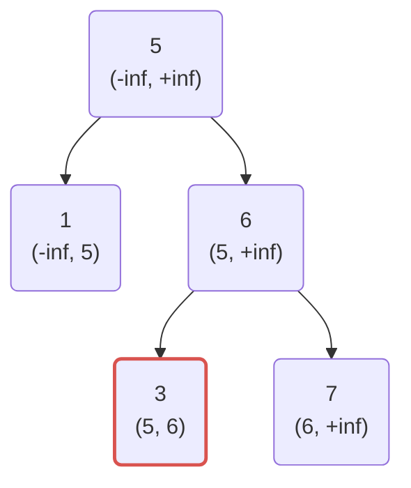
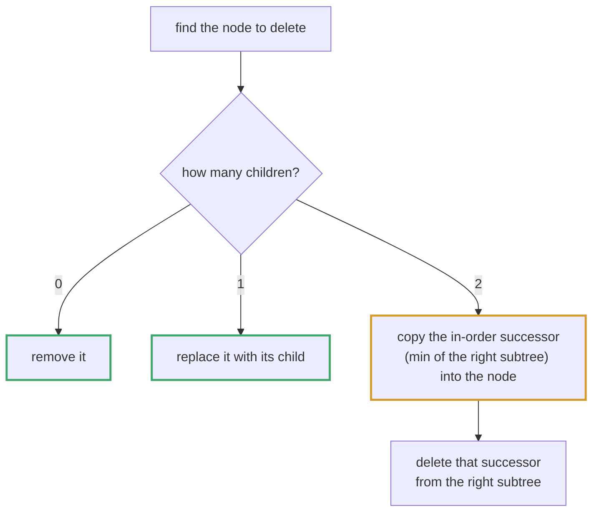
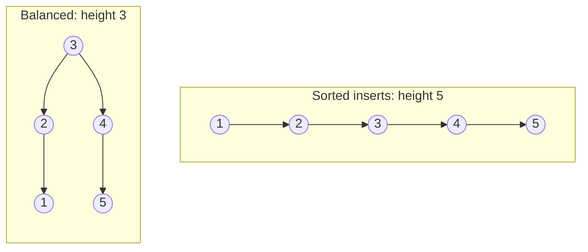
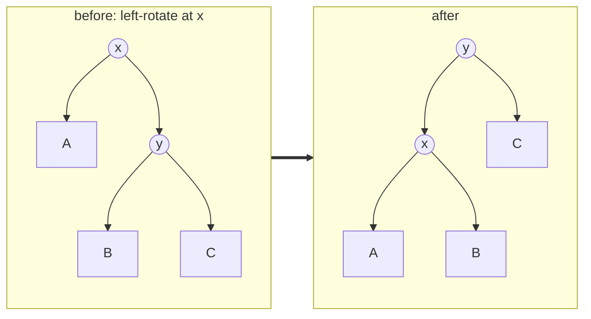

# Topic 11 · Binary Search Tree — Python Deep Dive

> Topic 10 gave you the grammar of trees — preorder/inorder/postorder, DFS vs
> BFS, "down via parameters, up via return". This topic adds exactly ONE
> new fact on top of all of that: **the values are ordered**. Every idea
> below is either "what the ordering invariant buys you for free" or "what
> breaks when you forget it's there." See the Go guide
> (`GoDSA/11_binary_search_tree/_TOPIC_GUIDE.md`) for the pointer-mutation
> mechanics of insert/delete in a language with no garbage collector safety
> net and no ordered container in std — this guide assumes you've either
> read that or don't need it, and spends its own words on what's different
> in Python: recursion-depth limits, duck-typed comparison, and the fact
> that Python doesn't have an ordered container either.

---

## Part 1 · The Invariant, and Why In-Order = Sorted

For every node `n`: everything in `n.left`'s subtree is `< n.val`, and
everything in `n.right`'s subtree is `> n.val` (strict, in this topic's
problems — duplicates are handled per-problem, see Part 2).

```
          8
        /   \
       3     10
      / \      \
     1   6      14
        / \     /
       4   7   13
```

In-order = (left, root, right). Apply the invariant recursively: everything
visited while inside `n.left` is `< n.val`, `n.val` itself is visited next,
then everything inside `n.right` is `> n.val`. By induction this holds at
every node simultaneously, so the whole traversal comes out strictly
increasing:

```python
def inorder(node, out):
    if node is None:
        return
    inorder(node.left, out)
    out.append(node.val)
    inorder(node.right, out)
```

For the tree above: `1 3 4 6 7 8 10 13 14`. This one fact is *the* reason
BST gets its own topic instead of living inside topic 10: "validate BST",
"kth smallest", "BST to sorted list", "closest value", "two sum in a BST",
"successor/predecessor" — every one of them reduces to "in-order is sorted,
now do something with a sorted sequence you never have to materialize."

Topic 10 taught you that inorder is "the one order to know cold" — this is
the payoff for why.

---

## Part 2 · The Validate-BST Trap: Local Checks Are Not Enough

The instinctive first attempt: check `left.val < node.val < right.val` at
every node. This is wrong, and the counterexample is worth memorizing:




```
       5
      / \
     1   8
        / \
       4   9      <- 4 < 8 passes locally. But 4 must be > 5 to be
                     legally in 5's RIGHT subtree. INVALID tree.
```

Every parent-child pair here is individually fine (1 < 5, 8 > 5, 4 < 8,
9 > 8). The tree is still not a BST, because the definition says the
**whole left/right subtree**, not just the immediate child. A search for 4
starting at the root goes right at 5 (4 < 5 is false... wait, 4 < 5 is
true, so it goes LEFT at 5) and never finds the 4 that's sitting in the
right subtree. The structure is unusable as a BST even though it "looks"
locally sorted.

Two correct fixes, both O(n) — know both, because interviewers sometimes
ask for the second after you give the first:

**A. Bounds threaded down the recursion.** Every call carries the open
interval `(low, high)` its value must fall inside. Going left tightens
`high` to the parent's value; going right tightens `low`. This is
"information flowing DOWN as a parameter" — topic 10 Part 4.1's pattern,
directly applied.

**B. In-order strictly increasing.** Track the previously-visited value
across an in-order walk (recursive with `nonlocal`/a box, or iterative with
an explicit stack) and compare each new value against it. This is Part 1's
fact used as a *test* rather than a transformation.

Full trace, both approaches, is in `006_validate_binary_search_tree_
solution.py` — this guide states the trap; that file proves it at runtime
against exactly the counterexample above.

---

## Part 3 · Insert, Search, Delete

### 3.1 Search and insert

```python
def search(node, target):
    while node and node.val != target:
        node = node.left if target < node.val else node.right
    return node

def insert(node, val):
    if node is None:
        return TreeNode(val)
    if val < node.val:
        node.left = insert(node.left, val)
    elif val > node.val:
        node.right = insert(node.right, val)
    return node          # duplicates: no-op here; some problems want them kept
```

The "reassign the child pointer to the (possibly new) subtree root" pattern
is the same one the Go guide leads with — it's not Go-specific, it's just
how you mutate a tree via a return value in any language without a `**Node`
or a `Node*&`. Python's `node.left = insert(node.left, val)` is the exact
same shape.

### 3.2 Delete — the three cases

Deleting the node holding `target`:




1. **Leaf.** Detach it — nothing else to do.
2. **One child.** Splice it out: the parent points straight at the single
   child.
3. **Two children.** You cannot just detach — you'd orphan a whole subtree.
   Find the **in-order successor** (walk `right`, then `left` all the way
   down — the smallest value bigger than `target`), copy that value into
   the current node, then recursively delete the successor from the right
   subtree. That recursive delete is now guaranteed to be case 1 or 2,
   because a leftmost node can never have a left child.

```python
def delete_node(node, target):
    if node is None:
        return None
    if target < node.val:
        node.left = delete_node(node.left, target)
    elif target > node.val:
        node.right = delete_node(node.right, target)
    else:
        if node.left is None:
            return node.right      # covers leaf AND "one right child"
        if node.right is None:
            return node.left       # "one left child"
        succ = node.right
        while succ.left:
            succ = succ.left
        node.val = succ.val
        node.right = delete_node(node.right, succ.val)
    return node
```

The in-order **predecessor** (max of `left`) works identically well —
pick one, be consistent, and say out loud in an interview which one you
chose and why its own removal is trivially safe. Full three-case trace and
runtime-measured demos: `004_delete_node_in_a_bst_solution.py`.

---

## Part 4 · Balance — Why an Unbalanced BST Degrades to O(n)

Insert `1, 2, 3, 4, 5, 6, 7` in that order using `insert` above. Every
value is bigger than everything already there, so every node becomes the
previous node's right child — a linked list wearing a tree costume:




```
1
 \
  2
   \
    3
     \
      4    <- height == n, every operation is now O(n)
```

Search/insert/delete were supposed to be O(log n); on this shape they are
O(n). Real ordered containers (C++ `std::map`, Java `TreeMap`) are
red-black trees specifically to prevent this — they rotate after
insert/delete to bound height at O(log n) regardless of insertion order.
This topic does not ask you to implement rotations (that's a separate,
much longer conversation — AVL/red-black), but you must be able to say,
unprompted, "this degrades to O(n) if the input arrives already sorted"
whenever you propose a plain BST as an answer.

**Python has no ordered container either.** This surprises people coming
from Java/C++ more than it surprises people coming from Go, because Python
*feels* batteries-included — but `dict`/`OrderedDict` preserve *insertion*
order, not *sorted* order, and there is nothing in `collections` that
maintains a sorted sequence under insert/delete. The closest thing is the
third-party `sortedcontainers.SortedList` (list-of-√n-blocks, O(√n)
insert/delete amortizing to something close to O(log n) in practice, not a
real tree) — worth naming if an interviewer asks "what would you actually
reach for in production," but it is not stdlib and you should say so.
Go's stdlib has literally nothing in this space either (`container/` ships
a linked list, a heap, a ring — no ordered map); the Go guide's Part 1
covers that gap in full. The two languages land in the same place for a
different reason: Python because nobody has shipped it in std, Go because
the standard library philosophy leans minimal and pushes you to
`golang.org/x/exp/btree` or hand-rolling. Either way: if a problem needs
"sorted order plus fast insert/delete," you are either building the tree
yourself (this topic) or reaching outside the standard library.

---

## Part 4a · Red-Black Tree Rebalancing, In Full

The paragraph above names the invariant and stops there — for interview
depth on "how would you actually keep this balanced," you need the
mechanics, not just the name. This is the algorithm behind C++'s
`std::map`/`std::set` and Java's `TreeMap`.

### 4a.1 The five invariants

1. Every node is **red** or **black**.
2. The root is black.
3. Every leaf (the conceptual `nil` sentinel, not a data node) is black.
4. A red node's children are both black — **no two reds in a row** on any
   root-to-leaf path.
5. Every root-to-leaf path has the **same number of black nodes** (the
   node's "black-height").

Invariant 4 + 5 together bound height: a path can alternate red/black at
most every other node, so the longest path is at most `2×` the shortest —
which is exactly `2 × black-height`. Since a tree with `n` nodes has
black-height `O(log n)` (halving the node count at least every two levels
along any path), height is **provably `O(log n)`** regardless of insertion
order — this is the proof the earlier paragraph gestures at without
showing.

### 4a.2 The two primitive rotations

Rotations locally re-parent three nodes without breaking the BST ordering
invariant — the subtree in the middle (`B` below) moves to the other side,
which is legal because it's still between the right two keys either way:




```
Left-rotate(x):            Right-rotate(y):
   x                  y        y                x
  / \                / \      / \              / \
 A   y    ──►       x   C    x   C    ──►     A   y
    / \            / \      / \                  / \
   B   C          A   B    A   B                B   C
```

Both are O(1) — pointer/reference reassignment only, no subtree copying.

### 4a.3 Insertion fixup — three cases, applied bottom-up

Insert exactly like a plain BST (Part 3), color the new node **red** (this
preserves invariant 5 automatically — a red leaf doesn't change any
black-height), then walk up from the new node fixing invariant-4
violations (a red node with a red parent). Let `z` be the current
violating red node, `parent`, `grandparent`, and `uncle` (parent's
sibling) as usual:

- **Case 1 — uncle is red.** Recolor `parent` and `uncle` black,
  `grandparent` red, then move `z` up to `grandparent` and repeat. This
  pushes the "extra red" two levels up the tree instead of fixing it
  locally — it may need to keep propagating to the root, which is why the
  loop is bottom-up and the last step is "the root is always recolored
  black" (invariant 2).
- **Case 2 — uncle is black, `z` is a "triangle"** (`z` is a right child
  and `parent` is a left child, or the mirror). Rotate `parent` in the
  direction that straightens the triangle into a line, then fall through
  to Case 3 with `z` and `parent` swapped.
- **Case 3 — uncle is black, `z` and `parent` form a "line."** Recolor
  `parent` black and `grandparent` red, then rotate `grandparent` the
  opposite direction. This is a **local, O(1) fix that terminates the
  loop** — no further propagation needed, which is why Cases 2 and 3
  together happen **at most once** per insertion, while Case 1 can repeat
  `O(log n)` times but does only recoloring (no rotations).

**Cost, precisely:** at most 2 rotations total per insertion (Cases 2+3
combine into one straighten-then-rotate), and `O(log n)` recolorings
(Case 1). This is *why* red-black trees are the default choice over AVL
in general-purpose libraries — AVL's stricter balance invariant
(heights differ by ≤1, not ≤2×) gives faster lookups but can require
`O(log n)` rotations per insert/delete, not O(1).

```python
class RBNode:
    __slots__ = ("val", "color", "left", "right", "parent")
    def __init__(self, val, color="red"):
        self.val = val
        self.color = color          # "red" | "black"
        self.left = self.right = self.parent = None

class RedBlackTree:
    def __init__(self):
        self.NIL = RBNode(None, "black")   # sentinel: every leaf points here
        self.root = self.NIL

    def _left_rotate(self, x):
        y = x.right
        x.right = y.left
        if y.left is not self.NIL:
            y.left.parent = x
        y.parent = x.parent
        if x.parent is None:
            self.root = y
        elif x is x.parent.left:
            x.parent.left = y
        else:
            x.parent.right = y
        y.left = x
        x.parent = y

    def _right_rotate(self, y):
        x = y.left
        y.left = x.right
        if x.right is not self.NIL:
            x.right.parent = y
        x.parent = y.parent
        if y.parent is None:
            self.root = x
        elif y is y.parent.left:
            y.parent.left = x
        else:
            y.parent.right = x
        x.right = y
        y.parent = x

    def insert(self, val):
        z = RBNode(val)
        z.left = z.right = self.NIL
        y, x = None, self.root
        while x is not self.NIL:
            y = x
            x = x.left if z.val < x.val else x.right
        z.parent = y
        if y is None:
            self.root = z
        elif z.val < y.val:
            y.left = z
        else:
            y.right = z
        self._insert_fixup(z)

    def _insert_fixup(self, z):
        while z.parent and z.parent.color == "red":
            grandparent = z.parent.parent
            if z.parent is grandparent.left:
                uncle = grandparent.right
                if uncle.color == "red":                        # Case 1
                    z.parent.color = "black"
                    uncle.color = "black"
                    grandparent.color = "red"
                    z = grandparent
                else:
                    if z is z.parent.right:                      # Case 2
                        z = z.parent
                        self._left_rotate(z)
                    z.parent.color = "black"                     # Case 3
                    z.parent.parent.color = "red"
                    self._right_rotate(z.parent.parent)
            else:                                                # mirror image
                uncle = grandparent.left
                if uncle.color == "red":
                    z.parent.color = "black"
                    uncle.color = "black"
                    grandparent.color = "red"
                    z = grandparent
                else:
                    if z is z.parent.left:
                        z = z.parent
                        self._right_rotate(z)
                    z.parent.color = "black"
                    z.parent.parent.color = "red"
                    self._left_rotate(z.parent.parent)
        self.root.color = "black"                                # invariant 2
```

### 4a.4 Deletion fixup — the same three-case shape, on a "double-black"

Deletion is structurally the harder half: removing a black node would
violate invariant 5 (that root-to-leaf path is now one black node short).
The fix introduces a conceptual **"double-black"** token on the node that
replaces the deleted one, then walks it up with a case analysis mirroring
insertion's — same three shapes (sibling red → recolor+rotate and
recurse; sibling black with a "far" red nephew → terminal rotation;
sibling black with only a "near" red nephew → rotate into the far case)
— also `O(log n)` recolorings and **at most 3 rotations**, terminating
the moment the double-black is absorbed by a red node or reaches the
root. The case names differ across textbooks, but the *cost bound* is
the fact worth having cold: **insertion and deletion are both O(log n)
time with O(1) rotations**, which is the guarantee AVL cannot make for
deletion (AVL deletion can cascade `O(log n)` rotations up the tree,
unlike red-black's bounded-rotation deletion) — this is the real reason
most general-purpose ordered containers (`std::map`, Java `TreeMap`,
Linux kernel's `rbtree`) pick red-black over AVL: cheaper, bounded-cost
rebalancing on the more expensive operation.

| | AVL | Red-Black |
|---|---|---|
| Balance invariant | subtree heights differ by ≤1 | longest path ≤ 2× shortest |
| Lookup | faster (tighter balance) | slightly slower |
| Insert rotations | O(log n) worst case | O(1) worst case |
| Delete rotations | O(log n) worst case | O(1) (≤3) worst case |
| Typical use | read-heavy, static-ish sets | general-purpose (`std::map`, `TreeMap`) |

---

## Part 5 · BST-Specific Algorithms That Beat the General-Tree Version

The ordering invariant lets you throw away work the general-tree version
of topic 10 was forced to do.

### 5.1 Kth smallest — in-order with an early exit

A general tree gives you no way to know "the kth-smallest value is
somewhere in here" without visiting every node. A BST's in-order sequence
IS the sorted sequence, so you can stop the instant you've counted `k`
nodes:

```python
def kth_smallest(root, k):
    stack, node = [], root
    while stack or node:
        while node:
            stack.append(node)
            node = node.left
        node = stack.pop()
        k -= 1
        if k == 0:
            return node.val
        node = node.right
    return -1
```

O(h + k) instead of O(n) for "traverse fully, then index" — the gap is
largest exactly when `k` is small and the tree is large. Problem 007
(`007_kth_smallest_element_in_a_bst_solution.py`) measures this gap
directly, and covers the standard follow-up: many `kthSmallest` calls
against a tree that also gets inserts/deletes, answered with an augmented
tree carrying subtree-size counters (O(h) per query instead of O(h+k)).

### 5.2 LCA — pure comparison, no subtree search

Topic 10's LCA (LC 236) has to search both subtrees because it has no way
to know which side `p` and `q` are on without looking — O(n), always. A
BST tells you which side without searching either:

```python
def lca(root, p, q):
    node = root
    while node:
        if p.val < node.val and q.val < node.val:
            node = node.left
        elif p.val > node.val and q.val > node.val:
            node = node.right
        else:
            return node       # split point, or one of them IS this node
    return None
```

O(h) instead of O(n), O(1) space instead of O(h) recursion stack. Problem
005 (`005_lowest_common_ancestor_of_a_binary_search_tree_solution.py`) is
the deepest treatment in this curriculum of exactly this contrast — it
implements both algorithms side by side and measures nodes-visited on a
100,000-node balanced BST (BST descent: ~17 nodes; general post-order:
essentially all 100,000). If you take one thing from that file: answering
a BST-LCA question with the general-tree algorithm is *correct* and
*wrong* at the same time — right output, wrong grade, because it shows you
didn't notice the input was ordered.

### 5.3 Floor / ceiling / predecessor / successor

Same shape as search — walk down, but remember the best candidate seen so
far instead of failing on a miss:

```python
def floor(node, target):
    best = None
    while node:
        if node.val == target:
            return node
        if node.val < target:
            best = node          # candidate; maybe improvable by going right
            node = node.right
        else:
            node = node.left
    return best
```

O(h), not O(n) — never materialize the sorted sequence just to binary
search it; the tree's shape already *is* the binary search.

---

## Part 6 · Complexity Table

| Operation | Balanced | Skewed (worst case) |
|---|:--:|:--:|
| Search | O(log n) | O(n) |
| Insert | O(log n) | O(n) |
| Delete | O(log n) | O(n) |
| In-order traversal (full) | O(n) | O(n) |
| Validate BST (bounds or in-order) | O(n) | O(n) — no pruning possible |
| Kth smallest, early exit | O(h + k) | O(n) |
| Kth smallest, augmented tree (§5.1 follow-up) | O(h) | O(n) |
| LCA (comparison descent) | O(h) | O(n) |
| Floor / ceiling / predecessor / successor | O(h) | O(n) |
| Build balanced from sorted array | O(n) | — |

`h` = tree height. `h = O(log n)` only if the tree is balanced; `h = O(n)`
for a degenerate/skewed tree. Every row above inherits this dependency —
it's the whole point of Part 4.

---

## Part 7 · Python vs. Go — Where They Diverge on This Topic

| | Python | Go |
|---|---|---|
| Ordered container in std | **No.** `sortedcontainers.SortedList` (3rd-party) is the closest thing | **No.** Nothing in `container/`; `google/btree` is the 3rd-party answer |
| Tree node | Class, `self.left` / `self.right` | Struct, pointer fields |
| Mutating via return value | `node.left = insert(node.left, v)` | Identical: `n.Left = insert(n.Left, v)` |
| Comparison | Duck-typed `<`/`>` on whatever `val` is (works on ints, strings, anything comparable) | Needs an explicit `cmp` for non-primitive keys pre-1.21 generics |
| **Recursion depth ceiling** | **~1000 frames** (`sys.getrecursionlimit()`) | Goroutine stacks start at 8KB and grow dynamically to a large default max — practically far deeper before failing |

That last row is not academic on this topic specifically: `delete_node`
and the recursive `isValidBST`/`kth_smallest` are all O(h)-deep recursions,
and this topic's problems explicitly allow degenerate/skewed BSTs (a
sorted array inserted one-by-one, or an adversarial test case) up to
10^4-10^5 nodes. A Python recursive delete or validate on a 5,000-node
skewed BST **raises `RecursionError`**; the equivalent Go recursion does
not blow up at that depth. This is exactly the same fact topic 10 Part 2.2
made about general trees — it just bites harder here because BST problems
are *more* likely to hand you a skewed tree on purpose (sorted or
near-sorted input degenerating the shape, per Part 4). Problem 005's file
demonstrates this concretely: it builds a legal 4,000-node chain, shows the
iterative LCA succeed and the recursive LCA raise `RecursionError` on the
identical input. **The fix in Python is always the same one topic 10
taught: go iterative with an explicit stack/list when `n` could be large
and the tree's shape isn't guaranteed balanced** — raising
`sys.setrecursionlimit()` is a last resort for controlled demos, not a
real fix (it just moves the crash further out and risks a C stack
overflow instead of a catchable Python exception).

---

## Part 8 · The Progression in This Folder

```
  001  LC 700  Search in a BST                     the descent, one target
  002  LC 108  Convert Sorted Array to BST          sorted array -> balanced tree, midpoint recursion
  003  LC 701  Insert into a BST                    §3.1 above, as its own problem
  004  LC 450  Delete Node in a BST                 §3.2 above, all three cases, successor-splice
  005  LC 235  Lowest Common Ancestor of a BST       §5.2 above — BST vs general-tree LCA, measured
  006  LC 98   Validate Binary Search Tree           §2 above — the local-check trap, bounds vs in-order
  007  LC 230  Kth Smallest Element in a BST         §5.1 above — early-exit in-order, augmented-tree follow-up
  008  LC 173  Binary Search Tree Iterator           lazy in-order via explicit stack, amortized O(1) next()
  009  LC 99   Recover Binary Search Tree (Hard)      in-order adjacent-dip detection, LOCATES a corruption;
                                                       Morris traversal for the O(1)-space follow-up
  010  LC 285  Inorder Successor in BST               §5.3 above, made concrete — unified comparison descent,
                                                       no separate "find p" step; predecessor is the mirror
  011  LC 530  Minimum Absolute Difference in BST      in-order-is-sorted used to bound a PAIRWISE quantity by
                                                       checking only neighbors — the O(n^2) trap, measured
```

005 -> 006 -> 007 -> 008 form an arc: 005 and 006 both establish that a BST
lets you do LESS work than the general-tree algorithm (comparison-only
descent; a range check instead of full inspection); 007 and 008 both build
on Part 1's "in-order is sorted" fact as a *traversal to control*, not just
a *sequence to check* — 007 controls it with an early exit, 008 controls it
across an *arbitrary number of external calls*, which is why 008 needs an
explicit, resumable stack instead of a single function call.

**009-011 were added beyond the original 8-problem plan** because three
real interview-pattern gaps remained even after 001-008: none of the first
eight problems asked you to *repair* a broken in-order sequence rather than
merely *validate* or *index* it (009), none isolated the pure
"comparison-descent remembering the best candidate" shape from §5.3 into
its own problem the way 005's LCA isolates the two-value split-point shape
(010), and none used in-order-is-sorted to bound a genuinely PAIRWISE
quantity, which is where the classic "adjacent-in-sorted-order is always
enough, never check all pairs" argument belongs (011). Together 009-011
also stress-test the topic's two recurring cross-cutting facts one more
time each: 009 is this topic's most direct O(n)-space-vs-O(1)-space
Morris-traversal demonstration, and 010's unified descent is the cleanest
one-paragraph illustration in the folder of "no parent pointer, no
problem — re-derive the ancestor chain from `root` instead," which is the
single most common LC 285-adjacent interview trip-up.

---

<!-- block:11_py_1_beyond -->
## Part 9 · Beyond the Eleven: Construction, Augmentation and the Ordered-Set Landscape

The eleven problems establish the invariant and the three operations. These are the variations interviews build on it.
Every snippet below was run against LeetCode's own examples while writing this section.

### 9.1 Build a BST from preorder in O(n) (LC 1008)

Preorder's first element is the root; the rest is "everything smaller, then everything larger". Instead of searching for
the split, carry an **upper bound** down and consume elements through a shared cursor: a value above the bound belongs
to an ancestor's right subtree, so this call returns `None` and leaves it unconsumed:

```python
def bst_from_preorder(pre):
    i = 0
    def go(bound):
        nonlocal i
        if i == len(pre) or pre[i] > bound: return None
        node = TreeNode(pre[i]); i += 1
        node.left = go(node.val)               # the left subtree: values < node.val
        node.right = go(bound)                 # the right subtree: values < the bound inherited from above
        return node
    return go(math.inf)                        # [8,5,1,7,10,12] -> inorder [1,5,7,8,10,12]
```

The same idea is why a BST can be **serialized in preorder without null markers** (unlike a general tree, 019): the
ordering constraint recovers the shape.

### 9.2 Use the ordering to prune

```python
def range_sum(n, lo, hi):                       # LC 938
    if not n: return 0
    if n.val < lo: return range_sum(n.right, lo, hi)      # this node and its whole left subtree are too small
    if n.val > hi: return range_sum(n.left, lo, hi)
    return n.val + range_sum(n.left, lo, hi) + range_sum(n.right, lo, hi)     # [10,5,15,3,7,None,18], 7..15 -> 32

def trim(n, lo, hi):                            # LC 669: rebuild, discarding out-of-range subtrees whole
    if not n: return None
    if n.val < lo: return trim(n.right, lo, hi)
    if n.val > hi: return trim(n.left, lo, hi)
    n.left, n.right = trim(n.left, lo, hi), trim(n.right, lo, hi)
    return n

def closest(n, target):                         # LC 270: a descent, remembering the best seen
    best = n.val
    while n:
        if abs(n.val - target) < abs(best - target): best = n.val
        n = n.left if target < n.val else n.right
    return best
```

Each of these visits O(h + output) nodes, not `n` — the payoff of the invariant. **Reverse inorder** (right, node, left)
visits values in *descending* order, which turns Convert BST to Greater Tree (LC 538) into a running total:

```python
total = 0
def dfs(n):
    nonlocal total
    if not n: return
    dfs(n.right); total += n.val; n.val = total; dfs(n.left)
# [4,1,6,0,2,5,7,None,None,None,3,None,None,None,8] -> inorder [36,36,35,33,30,26,21,15,8]
```

### 9.3 Two Sum on a BST with two iterators (LC 653)

A hash set solves it in O(n) memory. Two lazy inorder iterators — one ascending, one descending — are the two pointers of
topic 02 and use only **O(h)** memory (the BST Iterator idea, run in both directions):

```python
lo, hi = next(asc), next(desc)
while lo < hi:
    s = lo + hi
    if s == k: return True
    if s < k: lo = next(asc)
    else:     hi = next(desc)
return False                                    # [5,3,6,2,4,None,7]: k=9 -> True, k=28 -> False
```

### 9.4 Augment the tree: order statistics (rank and select)

Store a `size` in every node — the number of nodes in its subtree — and **recompute it on the way back up** from every
insert and delete. Then the k-th smallest is a descent, not a walk (this answers the classic Kth Smallest follow-up
*"the tree is modified often and `k` varies — how do you speed it up?"*):

```python
def insert(n, key):
    if not n: return Node(key)
    if key < n.key: n.left = insert(n.left, key)
    elif key > n.key: n.right = insert(n.right, key)
    else: return n
    n.size = 1 + size(n.left) + size(n.right)     # AUGMENTATION: recompute on the way back up
    return n

def select(n, k):                                  # k-th smallest, 1-based — O(h)
    left = size(n.left)
    if k <= left: return select(n.left, k)
    if k == left + 1: return n.key
    return select(n.right, k - left - 1)

def rank(n, key):                                  # how many keys are < key — O(h)
    r = 0
    while n:
        if key <= n.key: n = n.left
        else: r += size(n.left) + 1; n = n.right
    return r
# inserting 5,3,8,1,4,7,9,2,6: select(1..9) -> 1..9    rank(6) -> 5    rank(100) -> 9
```

The general principle — **any subtree aggregate you can recompute from the children** (size, sum, min, max, height)
can ride along in a node — is how interval trees, segment trees (topic 26) and AVL/red-black balance factors work.

### 9.5 Counting shapes: Catalan numbers (LC 96, 95)

The number of structurally distinct BSTs on `n` keys: pick a root `i`, then the left subtree uses `i` keys and the right
`n − 1 − i`: `C(n) = Σ C(i) · C(n − 1 − i)`. It is a DP over subtree sizes (topic 16), and the answers grow fast —
`n = 1..7` gives **1, 2, 5, 14, 42, 132, 429**. LC 95 *generates* them by the same split with the two lists of subtrees
combined by a double loop.

### 9.6 Rebalance an unbalanced BST (LC 1382)

Inorder gives the sorted keys; the midpoint recursion of Problem 002 rebuilds a balanced tree. A 4-node right-skewed chain
of height 4 becomes height 3:

```python
vals = inorder(root)
def go(lo, hi):
    if lo > hi: return None
    mid = (lo + hi) // 2
    return TreeNode(vals[mid], go(lo, mid - 1), go(mid + 1, hi))
return go(0, len(vals) - 1)
```

O(n) time and space — a full rebuild. Self-balancing trees do the same job *incrementally*, in O(log n) per operation.

### 9.7 The ordered-container landscape

| Structure | Guarantee | Notes |
|---|---|---|
| Plain BST | O(h): O(log n) on random input, **O(n)** on sorted input | Simplest; needs no rebalancing code. |
| AVL tree | Height ≤ ~1.44 log₂ n | Strictly balanced → fastest *lookups*; more rotations on update. |
| Red-black tree | Height ≤ 2 log₂(n + 1) | Looser → fewer rotations on update; the choice of C++ `std::map` and Java `TreeMap`. Part 4a. |
| Treap / skip list | O(log n) *expected* | Randomised balance (random priorities / random tower heights): far less code than red-black; skip lists are also easy to make concurrent. |
| **B-tree / B+ tree** | O(log_B n) with fan-out `B` in the hundreds | Built for **disks and databases**: one node = one page, so a lookup touches ~3–4 pages even for hundreds of millions of keys (`100³ = 10⁶`, `100⁴ = 10⁸`); B+ trees link the leaves for fast range scans. |

Python's standard library has **no ordered container**: `bisect` on a list finds in O(log n) but *inserts* in O(n) (the list
shifts its tail), and `sortedcontainers.SortedList` (third-party) is the practical answer. In an interview, say which
operations you need — insert, delete, rank, range query — and name the structure that provides them.

### 9.8 Duplicates are a policy, not an accident

A BST needs a stated rule: **reject** them (a set), keep a **count** in the node (a multiset, and it makes rank/select
weighted), or send equal keys consistently to **one side** (`<=` goes left). Validation must use the *same* rule — LC 98's
strict `<` / `>` treats duplicates as invalid — and deletion with duplicates has to remove exactly one copy.

### 9.9 Follow-ups the interviewer reaches for

| Follow-up | The answer |
|---|---|
| "The tree is modified often; `k` varies." | Augment with subtree sizes: `select(k)` in O(h) (9.4). |
| "It might be skewed." | Balance it: AVL / red-black, or a treap. Say what the plain BST degrades to (a linked list, O(n)). |
| "Search with O(1) memory and no recursion." | An iterative descent; for traversal, Morris (topic 10). |
| "Range queries?" | Prune on the bounds (9.2); or a B+ tree's linked leaves. |
| "On disk?" | A B-tree / B+ tree — fan-out, not height, is the lever. |
| "Concurrent access?" | Fine-grained locking (hand-over-hand) or a lock-free skip list; a plain BST rotates and cannot be read while written. |
| "Successor/predecessor in O(1)?" | Threaded BST (the Morris idea made permanent), or a parent pointer plus a linked list of nodes. |

---
<!-- /block:11_py_1_beyond -->

<!-- problem-map:start -->
## Part 10 · Every Problem in This Topic, by Pattern

Eleven problems, five moves (compare-and-discard · construction from inorder · deletion · use the ordering · inorder as a sequence). Each **Trap** is one the tests in that problem's solution file actually trigger.

| Problem | Move | The idea — and the trap it sets |
|---|---|---|
| [001 · Search in a Binary Search Tree](PyDSA/11_binary_search_tree/001_search_in_a_binary_search_tree_solution.py) <br>LC 700 · Easy | Compare and discard | One comparison per node discards a whole subtree — the BST invariant in action; an iterative descent is O(h) with O(1) space. **Trap:** recursing into *both* children (a plain-tree search, O(n)); comparing against `root.left.val` instead of `root.val`. |
| [002 · Convert Sorted Array to Binary Search Tree](PyDSA/11_binary_search_tree/002_convert_sorted_array_to_binary_search_tree_solution.py) <br>LC 108 · Easy | Sorted array = inorder | A sorted array *is* the target tree's inorder sequence: make the middle the root and recurse on index ranges. **Trap:** slicing (`nums[:mid]` copies O(n log n) elements); mixing the closed `[lo, hi]` convention with a half-open base case. |
| [003 · Insert into a Binary Search Tree](PyDSA/11_binary_search_tree/003_insert_into_a_binary_search_tree_solution.py) <br>LC 701 · Medium | Insertion is a failed search | Descend exactly as in 001; the `None` slot you run off is where the node goes; return the (possibly new) root at every level. **Trap:** assigning to a local (`root = TreeNode(val)`) instead of the parent's slot; not returning `root`. |
| [004 · Delete Node in a BST](PyDSA/11_binary_search_tree/004_delete_node_in_a_bst_solution.py) <br>LC 450 · Medium | Three delete cases | Leaf, one child, or two children (copy the inorder successor up, then delete it from the right subtree). **Trap:** not assigning the recursive result back (`root.left = delete(...)`); forgetting the one-child case. |
| [005 · Lowest Common Ancestor of a Binary Search Tree](PyDSA/11_binary_search_tree/005_lowest_common_ancestor_of_a_binary_search_tree_solution.py) <br>LC 235 · Medium | The split point | Walk down; the first node where `p` and `q` go different ways (or that equals one of them) is the LCA — O(h), no recursion. **Trap:** LC 236's O(n) algorithm on a sorted input. |
| [006 · Validate Binary Search Tree](PyDSA/11_binary_search_tree/006_validate_binary_search_tree_solution.py) <br>LC 98 · Medium | Bounds, not local checks | The invariant covers the whole subtree: carry `(low, high)` down, or check that inorder is *strictly* increasing. **Trap:** comparing only with the two children; `<=` / `>=` (accepts duplicates). |
| [007 · Kth Smallest Element in a BST](PyDSA/11_binary_search_tree/007_kth_smallest_element_in_a_bst_solution.py) <br>LC 230 · Medium | Inorder with an early exit | Inorder yields ascending values, so stop at the `k`-th: O(h + k). **Trap:** collecting the full list; an off-by-one in the counter. |
| [008 · Binary Search Tree Iterator](PyDSA/11_binary_search_tree/008_binary_search_tree_iterator_solution.py) <br>LC 173 · Medium | A paused inorder | The explicit stack *is* the iterator's state; `next()` pops, then pushes the right child's **entire left spine**. **Trap:** precomputing the list (valid, but fails the O(h) follow-up); pushing only `node.right`. |
| [009 · Recover Binary Search Tree](PyDSA/11_binary_search_tree/009_recover_binary_search_tree_solution.py) <br>LC 99 · Hard | The dips in inorder | Scan inorder; the *first* dip's left element and the *last* dip's right element are the swapped pair. **Trap:** overwriting `first` on every dip; setting `second` only once (adjacent swaps pass, far-apart swaps fail). |
| [010 · Inorder Successor in BST](PyDSA/11_binary_search_tree/010_inorder_successor_in_bst_solution.py) <br>LC 285 · Medium | Turn-left candidate | One descent handles both cases: each time you go left, the current node is a candidate successor. **Trap:** assuming a parent pointer exists; forgetting the has-a-right-child case. |
| [011 · Minimum Absolute Difference in BST](PyDSA/11_binary_search_tree/011_minimum_absolute_difference_in_bst_solution.py) <br>LC 530 · Easy | Adjacent in sorted order | The minimum difference must be between *adjacent* inorder values, so remember only the previous one. **Trap:** the all-pairs O(n²) loop; storing the whole list when asked for O(1) extra space. |

---
<!-- problem-map:end -->

## Checklist Before Leaving This Topic

- [ ] I can state the BST invariant and explain why in-order traversal of a
      BST yields sorted output, from first principles (Part 1).
- [ ] I can produce the parent-child-only counterexample tree from memory
      and explain why it fools a local check (Part 2).
- [ ] I can validate a BST both ways — bounds threaded down, and in-order
      strictly-increasing — and know which to offer first vs. second
      (Part 2).
- [ ] I can write search, insert, and all three delete cases (leaf, one
      child, two children via successor-splice) from memory (Part 3).
- [ ] I can explain why an unbalanced BST degrades to O(n), and that
      neither Python nor Go ships a balanced ordered container in their
      standard library (Part 4).
- [ ] I can state red-black's five invariants, explain why they bound
      height to O(log n), and walk through insertion's three fixup cases
      (uncle red / triangle / line) from memory, including why only Case 1
      can repeat while Cases 2-3 are the terminal O(1) fix (Part 4a).
- [ ] I can name at least three BST-specific algorithms that beat their
      general-tree equivalent, and say WHY in one sentence each: kth
      smallest (early exit), LCA (comparison, no search), floor/ceiling
      (descend once) (Part 5).
- [ ] I know Python's ~1000-frame recursion ceiling is a real, hittable
      constraint on this topic's problems specifically, because skewed
      BSTs are a natural (not adversarial-only) input shape here, and I
      default to iterative-with-a-stack when `n` could be large (Part 7).
- [ ] I can state the standard LC 230 follow-up (frequent insert/delete +
      many kth-smallest queries -> augmented tree with subtree-size
      counters, O(h) per query) without being prompted (Part 5.1, 007).
- [ ] I can explain why LC 173's `next()` is amortized O(1) despite a
      single call sometimes doing O(h) work — each node is pushed and
      popped exactly once across the WHOLE iteration (008).
- [ ] I can find and undo a two-node value swap using one in-order pass,
      and explain why a swap shows up as either ONE dip (adjacent nodes)
      or TWO dips (non-adjacent), and which node each case's `first`/
      `second` come from (009).
- [ ] I can find the in-order successor AND predecessor of a node with no
      parent pointer, in O(h), without a separate step to locate the node
      first — and can state the parent-pointer variant (LC 510) as a
      distinct, simpler problem (010).
- [ ] I can justify, from a three-term inequality, why the minimum
      pairwise difference in sorted data is always achieved by some
      ADJACENT pair — and why that turns an apparent O(n^2) problem into
      O(n) once you notice the data is sorted (011).
</content>
- [ ] Build a BST from preorder in O(n) with an upper bound, and say why a BST needs no null markers <!--ca-->
- [ ] Augment a BST with subtree sizes and write `select` / `rank` in O(h) <!--ca-->
- [ ] Use reverse inorder for a running total (Greater Tree) and pruning for range problems <!--ca-->
- [ ] Name the ordered-container options (AVL, red-black, treap, skip list, B+ tree) and when each is used <!--ca-->
- [ ] State a duplicate policy and keep insert, delete and validate consistent with it <!--ca-->
