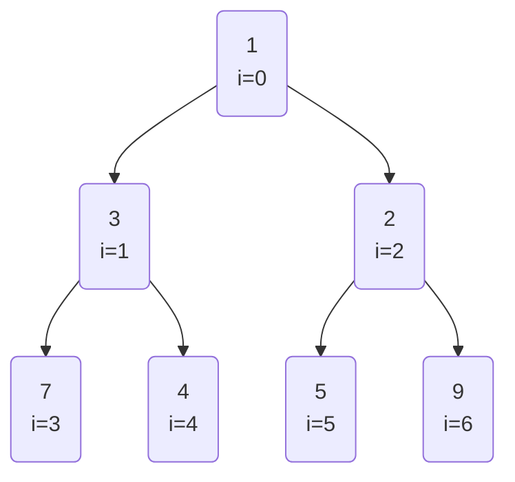
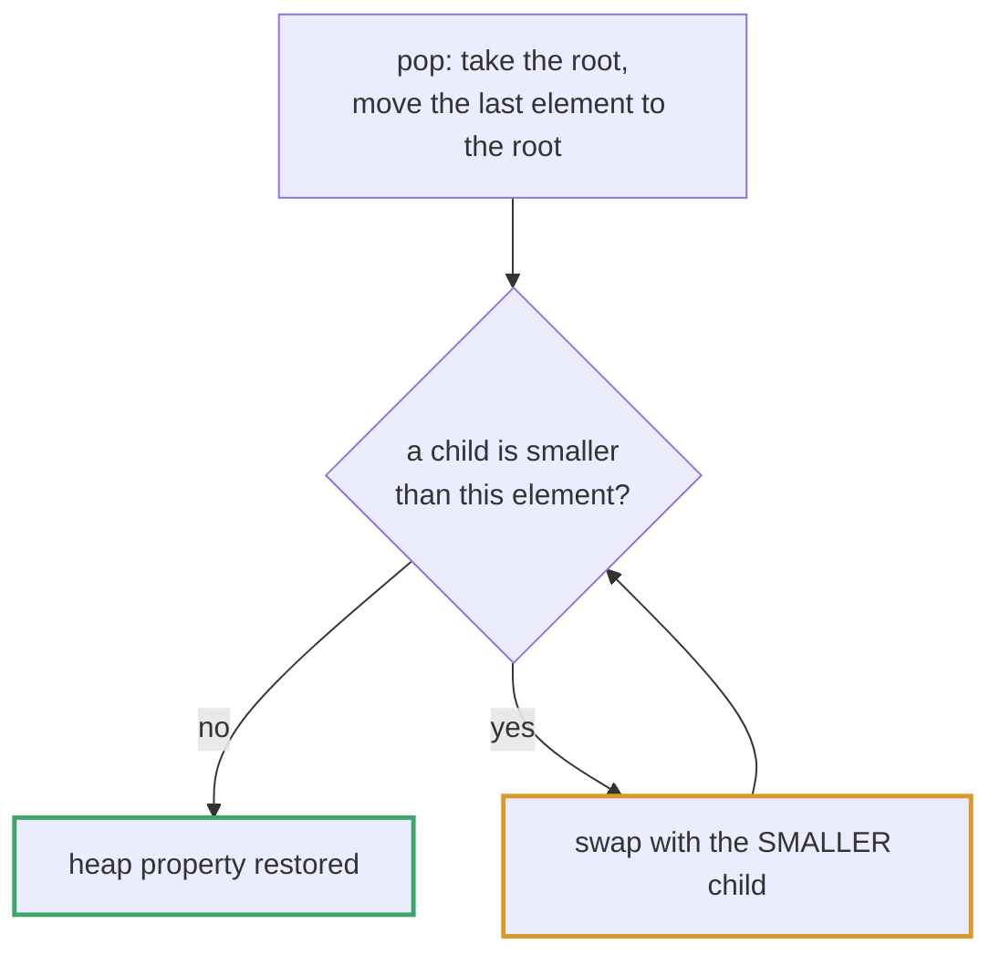
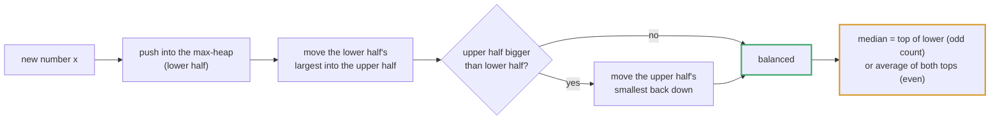
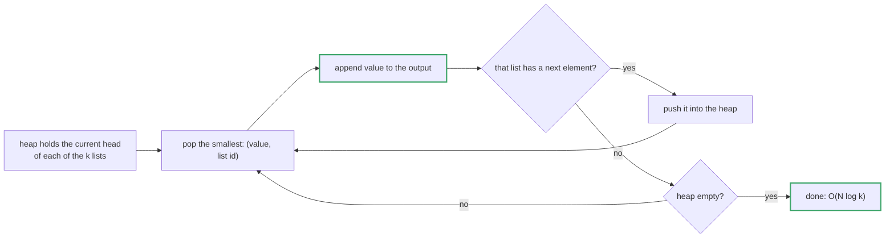
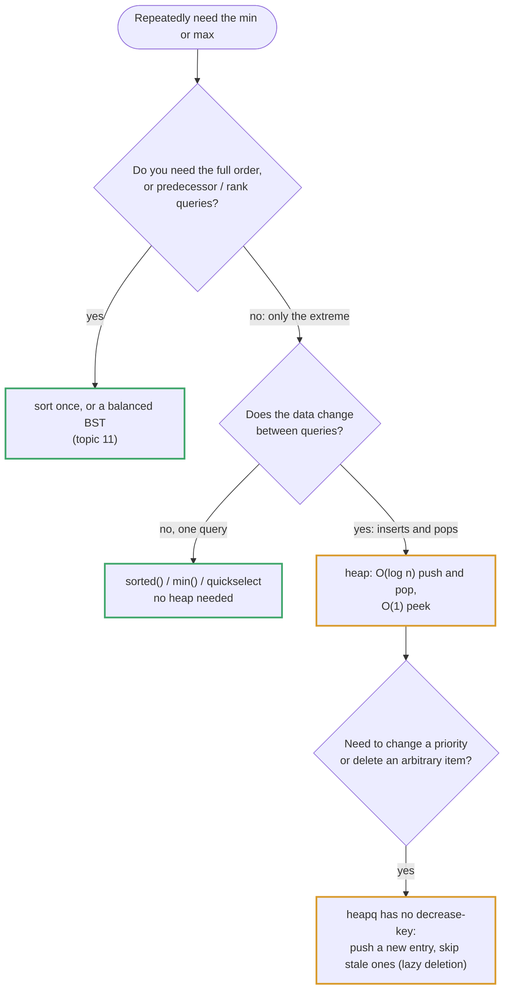

# Topic 12 · Heap / Priority Queue — Python Deep Dive

> A heap answers one question extremely well: *"what is the smallest (or
> largest) item in this collection, **right now**, while items keep being
> added and removed?"* A sorted array answers the same question in O(1) peek
> but costs O(n) per insert to stay sorted. A heap gives up full ordering and
> keeps only enough structure to answer "what's on top?" in O(1) and to fix
> itself after an insert/remove in O(log n). That's the whole trade.

---

## Part 1 · The Mechanism

### 1.1 The heap invariant

A **binary heap** is a complete binary tree (every level full except
possibly the last, which fills left-to-right) where every parent obeys the
heap property relative to its children. Two flavors:

- **Min-heap**: `parent <= both children`. Root is the global minimum.
- **Max-heap**: `parent >= both children`. Root is the global maximum.

Note what the invariant does **not** claim: siblings have no required order,
and a node deeper in the tree is not guaranteed smaller/larger than a
shallower node in a different subtree. A heap is *weakly* ordered — only
along root-to-leaf paths. That weak guarantee is exactly what makes it cheap
to maintain (you never have to re-sort the whole thing) and exactly why you
cannot binary-search a heap or iterate it in sorted order for free.

### 1.2 Array-backed representation — the index math

"Complete tree" means it can be packed into a flat array with **no
pointers**, by numbering nodes level-by-level, left-to-right, starting at
index 0:




```
Tree:                     Array (0-indexed):
        0
      /   \
     1     2          index:   0   1   2   3   4   5   6
    / \   / \          value: [a0, a1, a2, a3, a4, a5, a6]
   3   4 5   6
```

For a node at array index `i` (0-indexed, as `heapq` uses):

```
parent(i)       = (i - 1) // 2
left_child(i)   = 2*i + 1
right_child(i)  = 2*i + 2
```

Example: node at index 4 → parent = (4-1)//2 = 1, children = 9, 10 (both
out of range if the array has 7 elements → index 4 is a leaf). Walk it on
the picture above: index 1's children are 2*1+1=3 and 2*1+2=4 — matches the
drawing. This is the entire "data structure" — no `Node` class, no `.left`/
`.right` pointers, just arithmetic on list indices. That's why heap
operations are fast in practice: cache-friendly array access, no pointer
chasing.

### 1.3 sift-up (bubble up) — after insert

Append the new element at the end of the array (the next open leaf slot,
which keeps the tree complete), then repeatedly compare it to its parent and
swap upward while it violates the invariant:

```python
def sift_up(heap, i):
    while i > 0:
        parent = (i - 1) // 2
        if heap[parent] <= heap[i]:      # min-heap: stop when invariant holds
            break
        heap[parent], heap[i] = heap[i], heap[parent]
        i = parent
```

Cost: at most `log2(n)` swaps (tree height), so **O(log n)**.

### 1.4 sift-down (bubble down) — after pop

Popping the min/max removes the root. To refill: move the **last** array
element into index 0 (keeps completeness — no hole in the middle), then
repeatedly swap it with its smaller (min-heap) child until the invariant
holds:




```python
def sift_down(heap, i, n):
    while True:
        left, right = 2*i + 1, 2*i + 2
        smallest = i
        if left < n and heap[left] < heap[smallest]:
            smallest = left
        if right < n and heap[right] < heap[smallest]:
            smallest = right
        if smallest == i:
            break
        heap[i], heap[smallest] = heap[smallest], heap[i]
        i = smallest
```

Also **O(log n)** — again bounded by tree height. Note it must compare
against **both** children and pick the smaller, not just the left one —
picking the wrong child can leave the invariant violated one level down.

### 1.5 heapify — O(n), not O(n log n)

Building a heap from `n` arbitrary elements by inserting one at a time
(sift-up each) costs O(n log n). But `heapq.heapify` does better: it calls
`sift_down` on every node from the **last non-leaf node up to the root**
(skipping leaves, which are trivially valid single-node heaps):

```python
def heapify(a):
    n = len(a)
    for i in range(n // 2 - 1, -1, -1):
        sift_down(a, i, n)
```

Why this is O(n) and not O(n log n): most nodes are near the bottom of the
tree, where sift-down has almost no distance to travel. Precisely, a heap of
n nodes has ~n/2 leaves (0 work), ~n/4 nodes one level up (at most 1 swap),
~n/8 nodes two levels up (at most 2 swaps), etc. Summing
`n/4 * 1 + n/8 * 2 + n/16 * 3 + ...` converges to `O(n)` (a standard
arithmetico-geometric series), not `O(n log n)`. **This is a genuinely
common interview trip-up** — see Common Mistakes below — people assume
"heapify calls sift-down n times, each O(log n), so it must be O(n log n)."
It isn't, because sift-down's cost is proportional to *remaining height
below that node*, which is small for the vast majority of nodes.

---

## Part 2 · Python's `heapq` module

### 2.1 It is a MIN-heap. Only.

`heapq` exposes free functions operating on a plain `list`, not a class:

```python
import heapq
h = []
heapq.heappush(h, 5)
heapq.heappush(h, 1)
heapq.heappush(h, 3)
heapq.heappop(h)          # -> 1  (smallest, always)
h[0]                      # peek at min without popping, O(1)
heapq.heapify(existing_list)   # O(n) in-place, see 1.5
```

There is no `max_heap=True` flag, no separate max-heap type. **To simulate a
max-heap, negate every value going in and negate again coming out**:

```python
max_heap = []
for x in nums:
    heapq.heappush(max_heap, -x)
largest = -heapq.heappop(max_heap)
```

This is the single most common heap bug in interviews: forgetting to negate
on the way out (returning `-5` instead of `5`), or negating inconsistently
between push sites. When the heap holds tuples `(-priority, payload)`, only
the first element gets negated — `payload` should never be negated, and if
`payload` is itself sortable (e.g. also a number used as a tiebreaker) it's
easy to accidentally negate the wrong slot. Always negate at exactly one
seam (construction) and undo at exactly one seam (extraction).

### 2.2 `heappushpop` vs `heapreplace`

Two fused operations, both O(log n) (one sift instead of two separate O(log
n) push-then-pop calls):

- `heapq.heappushpop(h, x)`: push `x`, then pop-and-return the min. If `x`
  is already smaller than the current min, this is a fast no-op path
  (returns `x` itself without disturbing the heap).
- `heapq.heapreplace(h, x)`: pop-and-return the min, then push `x`. Always
  disturbs the heap, even if `x` would have been the new min. **Requires the
  heap to be non-empty** (raises `IndexError` on `[]`); `heappushpop` does
  not have that restriction since it can push first.

These matter for the fixed-size top-k pattern below: maintaining a
size-k heap where you compare the incoming element against the current
worst-of-the-k before deciding whether it's admitted is exactly
`heappushpop`'s job, done in one O(log k) call instead of two.

### 2.3 `nlargest` / `nsmallest`

`heapq.nlargest(k, iterable)` / `heapq.nsmallest(k, iterable)` do the top-k
selection described in Part 3 internally (a size-k heap swept across the
iterable) and are the right call when you just need the *answer once*, not
a live structure to keep pushing into. For a single top-k query, `nlargest`
is convenient; for a **stream** where more elements keep arriving over the
object's lifetime (see problem 001), you need to keep the heap object
around across calls — `nlargest` recomputes from scratch every time and is
the wrong tool there.

---

## Part 3 · When a heap beats sorting — top-k / streaming-k

### 3.1 The core comparison

Given `n` elements, find the `k` largest (or smallest).

| Approach | Time | Space | Fits a live stream? |
|---|---|---|---|
| Sort everything, take last k | O(n log n) | O(n) or O(1) extra (in-place sort) | No — must resort on every new element |
| Size-k heap swept once | O(n log k) | O(k) | Yes — O(log k) per new element |

When `k` is small relative to `n` (the common case — "top 10 trending", "5
nearest neighbors"), `log k` is meaningfully smaller than `log n`, and the
heap only ever holds `k` items instead of materializing/sorting all `n`.
The mechanism: maintain a **min-heap of size k** holding the k largest seen
so far (min-heap because the smallest of the current top-k — the heap's
root — is the one candidate for eviction when a bigger element shows up).
For each new element `x`: if the heap has fewer than k items, push it; else
if `x > heap[0]` (bigger than the current worst-of-the-top-k), evict the
root and admit `x` via `heapreplace`; otherwise discard `x` in O(1) without
touching the heap at all — most elements in a typical stream fail this
check and cost only a comparison, not a full log k operation.

The real trade, not just the asymptotic label: sorting does a fixed O(n log
n) of *comparison-based* work with excellent constants (CPython's Timsort
is highly optimized C code, exploits existing runs, etc.), while a heap
does O(n log k) of work with the overhead of Python-level function calls
per push (`heapq` is implemented mostly in C for the primitives themselves,
but the calling code around it is Python). For small `n`, sorting can win
in wall-clock time despite the "worse" complexity — the crossover point
depends on k/n and is worth benchmarking rather than assuming (see problem
solution files in this topic for a measured example, not just an asserted
one, per the repo's runtime-demo rule).

### 3.2 Why size-*k*, not size-*n*

A max-heap of all `n` elements would let you pop the top-k in O(k log n),
which is also below O(n log n) when k is small — but it requires O(n)
space and an O(n) heapify up front regardless of k. The size-k min-heap
variant is strictly better when you must process elements one at a time
(a stream) or want O(k) space, because it never materializes the full
input as a heap — it discards non-contenders immediately.

---

## Part 4 · Heap vs BST for "kth smallest so far"

Topic 11's BST-based solutions (`PyDSA/11_binary_search_tree/007_kth_smallest_element_in_a_bst_*`
and the BST-iterator problem `008_binary_search_tree_iterator_*`) answer a
related-but-different question: given a **static** BST that already
respects the BST invariant (left < node < right, recursively), an in-order
traversal visits nodes in fully sorted order for free, so the kth-smallest
query is answered by walking that traversal k steps (O(h + k) with an
explicit-stack iterator that yields one value at a time, O(h) space).

A heap solves a different shape of problem: **arbitrary insertion order,
no BST structure to exploit, and typically an unbounded/streaming
input.** Contrast directly:

| | BST kth-smallest (topic 11) | Heap top-k / kth-largest (topic 12) |
|---|---|---|
| Input structure required | A valid BST already built | None — any iterable or stream |
| Ordering guarantee | Full sorted order via in-order walk | Only "what's currently smallest/largest" |
| Repeated "next kth" queries | O(1) amortized per step once iterator built (topic 11 problem 008) | Each new stream element is O(log k); querying current kth-largest is O(1) peek |
| Rebalancing on insert | Not handled by a plain BST (can degrade to O(n) height — topic 11 doesn't self-balance) | Heap sift-up is always O(log n)/O(log k), height is guaranteed O(log n) by completeness |
| Best when | Data is already a BST, or you want full sorted-order iteration | Data arrives as a stream, or you only ever need the top/bottom few, not full order |

The key structural reason a heap doesn't degrade the way an unbalanced BST
can: a heap is always a **complete** tree (array-backed, no rotations
needed), so its height is provably `floor(log2 n)` no matter the insertion
order. A plain BST's height depends on insertion order and can degrade to
O(n) on sorted input (topic 11 doesn't implement AVL/red-black rebalancing,
so this is a real caveat there, not a strawman). If you need "kth smallest,
repeatedly, with inserts happening between queries" and don't have a
self-balancing tree available, a heap (or two heaps, §5) is usually the
more robust choice precisely because it can't pathologically degrade.

---

## Part 5 · Two-heap median-finding pattern

Problem 009 in this topic (`find-median-from-data-stream`) is the canonical
use of a **pair** of heaps to maintain a running median over a stream:




- `lo`: a **max-heap** (negated min-heap) holding the smaller half of the
  data seen so far.
- `hi`: a **min-heap** holding the larger half.
- Invariant kept after every insert: `len(lo) == len(hi)` or
  `len(lo) == len(hi) + 1` (lo carries the extra element on odd counts),
  and every element in `lo` <= every element in `hi`.

Insert: push the new value into `lo`, then move `lo`'s max into `hi` to
keep the cross-heap ordering invariant, then if `hi` grew larger than `lo`
move `hi`'s min back into `lo` to restore the size balance. Each insert
touches at most two heaps, each O(log n): **O(log n) per insert**.

Median: O(1) — either `lo`'s root (odd total) or the average of both roots
(even total). This is strictly better than the "keep a sorted list" or
"re-sort on every insert" approaches (O(n) or O(n log n) per insert) and is
the same family of idea as §3's size-k heap: use a heap's O(log n) sift to
maintain a boundary (here, the 50th percentile; there, the kth-largest
threshold) without ever fully sorting the data.

---

## Part 6 · Merge-k-sorted-* via heap

Topic 08's `PyDSA/08_linked_list/014_merge_k_sorted_lists_solution.py`
(LeetCode 23, Hard) already develops this pattern in full — read that file
for the complete trace and complexity derivation rather than re-deriving it
here. Short version, to connect it to this topic: keep a min-heap holding
exactly one "current frontier" element per list (`(value, list_index,
node)` tuples — the `list_index` tiebreaker matters, see Common Mistakes
#3), pop the global min, output it, push that list's next element. The
heap never holds more than k items, so this is **O(N log k)** for N total
elements across k lists — the same "size bounded by k, not by n" shape as
§3's top-k heap, just applied to a merge instead of a filter. Topic 08 also
covers the divide-and-conquer alternative (pairwise merge, same O(N log k)
complexity via a different mechanism — a merge tree of height log k instead
of a heap of size k); this topic's problems stick to the heap side of that
family.




---

## Part 7 · Common mistakes (cross-cutting, expanded per-problem below)

1. `heapq` is min-heap only — negating values to fake a max-heap and then
   forgetting to negate back on read is the single most common bug in this
   topic (see §2.1).
2. `heapify()` is O(n), not O(n log n) — assuming the naive "n inserts, each
   O(log n)" bound applies to the batch `heapify` call is wrong; see §1.5
   for why the batch version is asymptotically cheaper.
3. Tuple comparison in the heap blows up when priorities tie and Python
   falls through to comparing the second tuple element: `(dist, point)`
   where `point` is a list/dict/custom object with no `__lt__` raises
   `TypeError: '<' not supported between instances of 'list' and 'list'`
   the moment two distances tie. Fix: always include a tiebreaker that is
   itself totally ordered and cheap to compare (an insertion index, an id)
   as the *second* tuple element, so ties never reach the third.
4. Mutating the wrong element while unpacking `(priority, payload)` tuples
   after popping — e.g. negating `payload` along with `priority` by
   accident when both started as negated numbers.
5. Using a list + `sort()` inside a loop instead of a heap — turns an
   O(log n)-per-op structure into O(n log n) re-sorts, silently, because it
   still "works" on small inputs during testing.

---

## Part 8 · Added Problems (011–012) — Two Heap Techniques Worth Naming

Added 16 Sep 2026 from the Google prep plan.

### 011 IPO — "sweep one axis, heap the other"

Two independent orderings: projects become AFFORDABLE in order of capital, and among the affordable
ones you want the max PROFIT. Sort by capital and advance a pointer as capital grows (the affordable set
only grows); push newly affordable profits into a max-heap; pop k times. Single-Threaded CPU (008) and
Minimum Interval to Include Each Query (010) are the same shape.

### 012 Sliding Window Median — LAZY DELETION

Two heaps give medians under inserts (009). A sliding window also deletes, and a heap can't remove an
arbitrary element efficiently. So:

1. Record the outgoing value in a `delayed` counter instead of removing it.
2. Track LOGICAL sizes of both halves separately from `len(heap)`.
3. Pop delayed values only when they reach a heap top (the only place the median reads).

Balancing on `len(heap)` instead of logical sizes was wrong on hundreds of random inputs in the file's
demo.

**Measured honesty:** a sorted Python list with `bisect.insort` (O(k) per step via a C memmove) was about
4x FASTER than the dual heap at k = 100, and 3x / 12x slower at k = 10,000 / 50,000. Asymptotics win
only once k is large.

Lazy deletion reappears in Stock Price Fluctuation (25_design/013) and Dijkstra's "skip stale entries".

### Checklist additions

- [ ] I can explain lazy deletion and why logical size counters are required.
- [ ] I can recognize "sweep by threshold + heap by value" problems.

<!-- block:12_py_1_beyond -->
## Part 9 · Heap Patterns Beyond the Twelve: Frontiers, Updates, Ties and Heapsort

Every snippet below was run against known answers while writing this section.



### 9.1 The frontier heap: K smallest pairs (LC 373)

You cannot afford to build all `m × n` pair sums. Notice instead that the smallest *unseen* pair is always adjacent to a
pair you have already taken: start from `(0, 0)` and, each time you pop `(i, j)`, push only its two neighbours
`(i + 1, j)` and `(i, j + 1)` (with a `seen` set so a pair is pushed once):

```python
heap = [(a[0] + b[0], 0, 0)]; seen = {(0, 0)}; out = []
while heap and len(out) < k:
    s, i, j = heapq.heappop(heap)
    out.append([a[i], b[j]])
    for ni, nj in ((i + 1, j), (i, j + 1)):
        if ni < len(a) and nj < len(b) and (ni, nj) not in seen:
            seen.add((ni, nj)); heapq.heappush(heap, (a[ni] + b[nj], ni, nj))
# [1,7,11] x [2,4,6], k=3 -> [[1,2],[1,4],[1,6]]      [1,1,2] x [1,2,3], k=2 -> [[1,1],[1,1]]
```

O(k log k), independent of `m · n`. The same "expand a frontier from the best known point" shape solves Kth Smallest in a
Sorted Matrix, Smallest Range Covering K Lists and Ugly Number II.

### 9.2 A heap of *end times*: Meeting Rooms II

Sort meetings by start; keep a min-heap of the end times of rooms in use. If the earliest-ending room is free by the new
start, **reuse** it (`heapreplace`: pop and push in one O(log n) step); otherwise open a room. The heap size at the end is
the answer:

```python
ends = []
for s, e in sorted(intervals):
    if ends and ends[0] <= s: heapq.heapreplace(ends, e)
    else:                     heapq.heappush(ends, e)
return len(ends)          # [[0,30],[5,10],[15,20]] -> 2      [[7,10],[2,4]] -> 1
```

### 9.3 There is no decrease-key — use lazy deletion

`heapq` cannot change an item's priority or remove an arbitrary item in O(log n). The standard answer is to **push a new
entry and skip stale ones when they surface**. Dijkstra is the canonical use: when a shorter path to `v` is found, push
`(new_dist, v)`; when an old, longer entry is later popped, recognise it as stale (`d > dist[v]`) and ignore it:

```python
while pq:
    d, u = heapq.heappop(pq)
    if d > dist.get(u, inf): continue                 # STALE: a shorter path was already found
    for v, w in graph[u]:
        nd = d + w
        if nd < dist.get(v, inf):
            dist[v] = nd; heapq.heappush(pq, (nd, v))   # a NEW entry; the old one will go stale
# the classic 6-node example from 'a': {'a': 0, 'b': 7, 'c': 9, 'f': 11, 'd': 20, 'e': 20}
```

The heap holds at most one entry *per edge relaxation*, so it can grow to `O(E)` — still `O((V + E) log V)` overall. The
same pattern powers the sliding-window median's `delayed` counter (Problem 012) and "cancel a scheduled task".

### 9.4 Ties and unorderable payloads

`heapq` compares whole tuples. When two priorities tie, Python compares the *next* element — and if that is an object
without `__lt__`, you get a crash **only on ties**, which a small test may never produce:

```python
heapq.heappush(h, (1, Task("a")))
heapq.heappush(h, (1, Task("b")))
# TypeError: '<' not supported between instances of 'Task' and 'Task'
```

The fix is a strictly increasing **tiebreaker** in the middle: `(priority, next(counter), item)`. It also makes equal
priorities come out **first-in, first-out** (`heappop` order `a` then `b`) — heaps are *not* stable on their own. Use a
`dataclass(order=True)` with `field(compare=False)` on the payload when you prefer named fields.

### 9.5 Huffman coding: a greedy that needs a heap

To build an optimal prefix code, repeatedly merge the **two lightest** items; the total cost is the sum of every merge:

```python
heapq.heapify(weights); total = 0
while len(weights) > 1:
    a, b = heapq.heappop(weights), heapq.heappop(weights)
    total += a + b; heapq.heappush(weights, a + b)
return total          # [5, 9, 12, 13, 16, 45] -> 224
```

The same shape solves "connect sticks with minimum cost" and optimal merge patterns.

### 9.6 Heapsort in place — and why it is rarely used

Build a **max-heap** in the array itself (`heapify`, O(n)), then swap the root with the last unsorted slot and sift down
over the shrunken prefix. O(n log n) worst case, **O(1) extra space** — the only comparison sort with both:

```python
for i in range(n // 2 - 1, -1, -1): sift_down(i, n)          # heapify: O(n)
for end in range(n - 1, 0, -1):
    a[0], a[end] = a[end], a[0]; sift_down(0, end)             # the max goes to its final slot
```

It is rarely the *fastest* sort in practice: it is **not stable**, and its access pattern jumps around the array (poor
cache behaviour) where quicksort and merge sort stream through it. It earns its place as introsort's fallback and as the
answer to "sort in O(n log n) with O(1) memory".

### 9.7 Choosing the tool

| Need | Use | Cost |
|---|---|---|
| The single min or max, once | `min()` / `max()` | O(n) |
| The top `k` of a static list | `heapq.nlargest(k, xs)` (or quickselect) | O(n log k) (O(n) average) |
| The top `k` of a stream | size-`k` min-heap | O(log k) per item |
| The `k`-th largest, once | quickselect (topic 27) | O(n) average |
| The min/max of a changing set | heap | O(log n) |
| Many sorted lists merged | `heapq.merge` / a heap of cursors | O(N log k) |
| Order statistics with deletes | balanced BST / order-statistic tree (topic 11) | O(log n) |

### 9.8 Follow-ups the interviewer reaches for

| Follow-up | The answer |
|---|---|
| "Update or cancel an item." | Lazy deletion (9.3), or an *indexed* heap that tracks each item's position (Go's `heap.Fix`). |
| "Why is `heapify` O(n)?" | Most nodes sit near the leaves where sift-down does almost nothing; the sum of `height × nodes-at-that-height` converges to O(n). |
| "Is a heap sorted?" | No — only parent ≤ child. Iterating the array is not in order; `heap[1]` is not the second smallest. |
| "Top `k` but memory-bound / streaming." | The size-`k` heap is already O(k) memory. |
| "Ties must be stable." | A counter tiebreaker (9.4). |
| "Max-heap in Python?" | Negate on push *and* on read, or wrap values in a class with a reversed `__lt__`. |
| "Two heaps or one sorted structure for the median?" | Two heaps for a growing stream (O(log n) insert, O(1) median); a sorted structure when you also delete arbitrary elements. |

---
<!-- /block:12_py_1_beyond -->

<!-- problem-map:start -->
## Part 10 · Every Problem in This Topic, by Pattern

Twelve problems, five moves (size-k heap · max-heap by negation · merge and frontier · sweep + heap · two heaps). Each **Trap** is a mistake documented in that problem's solution file.

| Problem | Move | The idea — and the trap it sets |
|---|---|---|
| [001 · Kth Largest Element in a Stream](PyDSA/12_heap_priority_queue/001_kth_largest_element_in_a_stream_solution.py) <br>LC 703 · Easy | Size-k min-heap | Keep a min-heap of exactly `k` elements: its root *is* the k-th largest, and each `add` is O(log k). **Trap:** a max-heap of *all* elements (O(n) space, O(log n) per add); pushing without trimming back down to size `k`. |
| [002 · Last Stone Weight](PyDSA/12_heap_priority_queue/002_last_stone_weight_solution.py) <br>LC 1046 · Easy | Max-heap by negation | Every round needs the two largest stones — a max-heap (negate for `heapq`); push `y - x` back only if it is non-zero. **Trap:** pushing `y - x` un-negated (silently corrupts every later round); peeking `heap[1]` as "second largest" (it is not); `-heap[0]` on an empty heap. |
| [003 · K Closest Points to Origin](PyDSA/12_heap_priority_queue/003_k_closest_points_to_origin_solution.py) <br>LC 973 · Medium | Top-k keyed by a derived value | Compare *squared* distance — a monotonic transform preserves the order, so `sqrt` is wasted work — and keep a size-`k` max-heap. **Trap:** calling `sqrt`; `(dist, point)` with no index tiebreaker (fragile on ties). |
| [004 · Kth Largest Element in an Array](PyDSA/12_heap_priority_queue/004_kth_largest_element_in_an_array_solution.py) <br>LC 215 · Medium | Size-k heap or quickselect | Rank `k` from the top needs far less than a sort: a size-`k` min-heap is O(n log k), quickselect O(n) on average. **Trap:** faking a max-heap by negation and forgetting to negate back; `k` separate pushes where one `heapify` would do. |
| [005 · Task Scheduler](PyDSA/12_heap_priority_queue/005_task_scheduler_solution.py) <br>LC 621 · Medium | Greedy on the busiest task | The most frequent task sets the frame `(max_count - 1) * (n + 1) + ties`; a heap simulation places the most frequent available task each slot. **Trap:** omitting `max(len(tasks), frame)`; the `-1` (gaps, not occurrences); re-pushing a task inside its own cooldown. |
| [006 · Design Twitter](PyDSA/12_heap_priority_queue/006_design_twitter_solution.py) <br>LC 355 · Medium | k-way merge | `getNewsFeed` merges each followee's newest-first tweet list and takes 10 — a heap of `(-time, …)` cursors, never re-sorting a history. **Trap:** forgetting the caller's *own* tweets; `set.remove` instead of `discard`; wall-clock time instead of an integer counter. |
| [007 · Reorganize String](PyDSA/12_heap_priority_queue/007_reorganize_string_solution.py) <br>LC 767 · Medium | Task Scheduler with n = 1 | Always place the most frequent remaining character, then bench it for exactly one placement; feasible iff `max_count <= (len(s) + 1) // 2`. **Trap:** benching for the wrong number of slots; `len(s) // 2` (rejects valid odd lengths such as `"aab"`). |
| [008 · Single-Threaded CPU](PyDSA/12_heap_priority_queue/008_single_threaded_cpu_solution.py) <br>LC 1834 · Medium | Sweep time, heap the ready set | Sort by enqueue time; heap the *available* tasks by `(processing time, index)`; when idle, jump the clock to the next enqueue time. **Trap:** ticking one unit at a time (times out on `10⁹` spreads); losing the original index after sorting; heaping every task up front. |
| [009 · Find Median from Data Stream](PyDSA/12_heap_priority_queue/009_find_median_from_data_stream_solution.py) <br>LC 295 · Hard | Two heaps straddling the median | A max-heap `lo` (lower half) and a min-heap `hi` (upper half), routed through `heappushpop` and rebalanced to differ by at most one. **Trap:** a negation slip on `lo`; routing by a stale median; letting the imbalance exceed 1. |
| [010 · Minimum Interval to Include Each Query](PyDSA/12_heap_priority_queue/010_minimum_interval_to_include_each_query_solution.py) <br>LC 1851 · Hard | Sorted sweep with lazy expiry | Answer queries in ascending order; admit intervals with `left <= q` into a heap keyed by size; lazily pop those with `right < q`. **Trap:** not writing answers back to the original positions; eager deletion (`heapq` has no arbitrary delete). |
| [011 · IPO](PyDSA/12_heap_priority_queue/011_ipo_solution.py) <br>LC 502 · Hard | Sweep one axis, heap the other | Capital only rises, so affordable projects only accumulate: sort by capital, push profits into a max-heap, take the best each round. **Trap:** picking the *cheapest* project; subtracting capital (it is a threshold, not a cost). |
| [012 · Sliding Window Median](PyDSA/12_heap_priority_queue/012_sliding_window_median_solution.py) <br>LC 480 · Hard | Two heaps + lazy deletion | The two halves plus a `delayed` counter for elements that left the window, and logical size counters. **Trap:** integer division for even `k` (`1.5 → 1`); using `len(heap)` instead of the logical sizes. |

---
<!-- problem-map:end -->


## Checklist Before Leaving This Topic <!--ca-->

- [ ] Explain lazy deletion and use it for "change a priority" (Dijkstra) and "cancel a task" <!--ca-->
- [ ] Add a counter tiebreaker to a heap of unorderable payloads, and say it also gives FIFO order on ties <!--ca-->
- [ ] Expand a frontier from a heap (K smallest pairs) instead of building all pairs <!--ca-->
- [ ] Write in-place heapsort, and say why quicksort usually beats it <!--ca-->
- [ ] Choose between `min`, `nlargest`, quickselect, a heap and a BST for a given access pattern <!--ca-->
