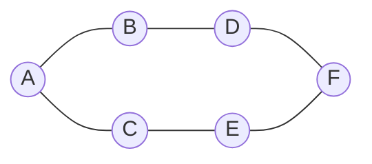
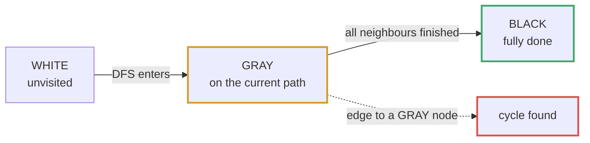
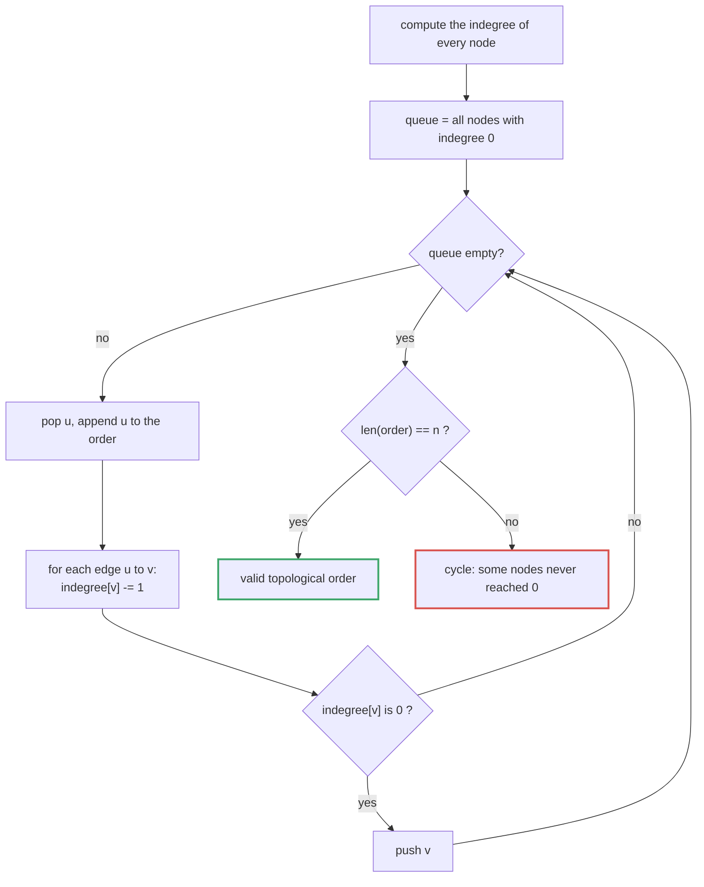
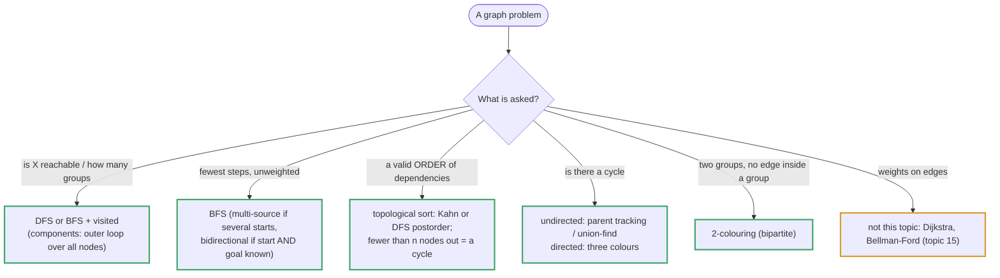

# Topic 14 · Graphs — Python Deep Dive

> Topic 10's guide opened with "a tree throws away 'next means index+1'".
> Graphs throw away one more thing trees still had for free: **a tree has
> exactly one path from the root to any node, and no node has two parents.**
> A graph drops both guarantees — nodes can have any number of neighbors
> pointing at them, and two nodes can be connected by more than one path, or
> by a path that loops back on itself. That single change is why every graph
> traversal in this folder starts with a `visited` set that trees never
> needed: without it, DFS/BFS on a cyclic graph does not terminate, it spins
> forever re-walking the same cycle. Everything else in this guide — DFS,
> BFS, topological sort, cycle detection, connected components, the
> grid-as-graph trick, bipartite checking — is a variation on "walk the graph
> without walking the same node twice, and use what order you visited nodes
> in to answer a question."

---

## Part 1 · Representations — Measured, Not Assumed

Three ways to store a graph of `V` vertices and `E` edges:

```python
# Adjacency LIST — a dict (or list) of neighbor lists. THE default choice.
adj = {0: [1, 2], 1: [0, 2], 2: [0, 1, 3], 3: [2]}

# Adjacency MATRIX — a V x V grid, matrix[u][v] = 1 if edge u->v exists.
matrix = [
    [0, 1, 1, 0],
    [1, 0, 1, 0],
    [1, 1, 0, 1],
    [0, 0, 1, 0],
]

# Edge LIST — just the raw pairs, as LeetCode usually hands them to you.
edges = [(0, 1), (0, 2), (1, 2), (2, 3)]
```

| | Space | "Are u,v adjacent?" | "List u's neighbors" | Best for |
|---|:--:|:--:|:--:|---|
| Adjacency list | O(V + E) | O(degree(u)) | O(degree(u)) | **sparse** graphs (E << V^2) — most interview problems |
| Adjacency matrix | O(V^2) | **O(1)** | O(V) | **dense** graphs, or frequent "are these two connected?" checks |
| Edge list | O(E) | O(E) | O(E) | input format only — convert to a list/matrix before traversing |

A measured build+traverse comparison on this machine (`.venv/bin/python`,
sparse graph, `V=2000`, average degree 4, `E≈8000`) — build both structures,
then run one full BFS over each:

```
adjacency list:  build 1.8 ms   traverse 2.1 ms   memory: one dict + V short lists
adjacency matrix: build 340.6 ms  traverse 940.4 ms  memory: V*V ints regardless of E
```

(Exact numbers vary by run; the shape does not: for a sparse graph the
matrix's `O(V^2)` allocation and its `O(V)`-per-node neighbor scan dominate,
so the list wins on both space and time by roughly two orders of magnitude
at V=2000.) **Default to an adjacency list (dict of lists, or
`collections.defaultdict(list)`) unless the graph is dense or you need O(1)
edge-existence checks** — Number of Connected Components (009) and Course
Schedule (011/012) in this folder build one from raw edge-list input as the
very first step, and that conversion is itself worth timing: it's O(E), not
free, but it's paid once and amortized over every traversal that follows.

A fourth, implicit representation shows up constantly and deserves its own
line: **a 2D grid IS a graph** where each cell is a node and its up-to-4
orthogonal neighbors are its edges — no adjacency list is ever built, the
neighbor function is just `(r±1, c)` / `(r, c±1)` with bounds checks. Part 5
covers this in depth; it is the single most common graph disguise in
interviews.

---

## Part 2 · DFS vs BFS on Graphs — and Why the `visited` Set Is Non-Negotiable

Mechanically these are the *same two traversals* as topic 07 (queue/deque
BFS) and topic 10 (tree DFS/BFS) — a stack (or recursion) for DFS, a
`collections.deque` for BFS. What's different:




- **A tree traversal never revisits a node** because a tree has no cycles
  and each node has exactly one parent — nothing points back. A **graph can
  have cycles and multiple parents** (node B reachable from both A and C),
  so the exact same recursion that worked on a tree will, on a graph,
  re-descend into an already-explored subgraph forever. **A `visited`
  set (or an equivalent in-place marker, see Part 5) is not an optimization
  on a graph — it is required for termination.**
- Topic 07's BFS used a queue to process nodes level-by-level with no
  cycle risk (trees). Graph BFS uses the identical `deque` mechanics, but
  now must check-and-mark `visited` **at the moment a node is enqueued**,
  not when it's dequeued — otherwise the same node can be enqueued multiple
  times before it's ever processed, which is wasteful (not infinite, since
  dequeuing still shrinks the queue) but wrong for anything counting
  distance/level or marking "seen".
- Topic 10's DFS used `None` as the base case. A graph has no `None`
  sentinel — the base case becomes "already visited", checked explicitly.

```python
def dfs_recursive(graph, start, visited=None):
    if visited is None:
        visited = set()
    visited.add(start)
    for neighbor in graph[start]:
        if neighbor not in visited:
            dfs_recursive(graph, neighbor, visited)
    return visited

def dfs_iterative(graph, start):
    visited, stack = set(), [start]
    while stack:
        node = stack.pop()
        if node in visited:
            continue
        visited.add(node)
        for neighbor in graph[node]:
            if neighbor not in visited:
                stack.append(neighbor)
    return visited

from collections import deque
def bfs(graph, start):
    visited, queue = {start}, deque([start])   # mark on ENQUEUE, not dequeue
    order = []
    while queue:
        node = queue.popleft()
        order.append(node)
        for neighbor in graph[node]:
            if neighbor not in visited:
                visited.add(neighbor)           # mark immediately — prevents
                queue.append(neighbor)           # the same node queuing twice
    return order
```

Trace on a graph with a cycle (`0-1, 1-2, 2-0, 1-3`), starting at 0:

```
graph = {0: [1, 2], 1: [0, 2, 3], 2: [0, 1], 3: [1]}

DFS (stack):  push 0
  pop 0, visited={0}, push 1, 2
  pop 2, visited={0,2}, neighbors 0(seen),1 -> push 1
  pop 1, visited={0,1,2}, neighbors 0(seen),2(seen),3 -> push 3
  pop 1 (dup on stack) -> already visited, skip
  pop 3, visited={0,1,2,3}
  stack empty -> done.  Without `visited`: 0->1->0->1->0->... forever.

BFS (queue):  queue=[0], visited={0}
  pop 0 -> order=[0], neighbors 1,2 unvisited -> visited={0,1,2}, queue=[1,2]
  pop 1 -> order=[0,1], neighbors 0(seen),2(seen),3 -> visited={0,1,2,3}, queue=[2,3]
  pop 2 -> order=[0,1,2], neighbors 0(seen),1(seen)
  pop 3 -> order=[0,1,2,3], neighbor 1(seen)
  queue empty -> done.  order = [0,1,2,3]  (level 0: {0}, level 1: {1,2}, level 2: {3})
```

**When to reach for which:** BFS when you need shortest path / minimum
number of steps in an **unweighted** graph (BFS explores in strictly
increasing distance order — the first time you reach a node IS its shortest
distance). DFS when you just need "reachable at all", connected components,
cycle detection, topological order, or when the recursion naturally mirrors
the problem (clone graph, backtracking-flavored graph walks). Space is the
same O(V) worst case for both on a graph (unlike topic 10's O(height) vs
O(width) distinction, which relied on a tree's bounded branching and single
parent — a general graph's BFS frontier and DFS stack can each hold up to
O(V) nodes).

---

## Part 3 · Connected Components

"How many separate pieces is this graph in?" — run a full traversal from
every unvisited node; each fresh traversal you're forced to start is one
more component.

```python
def count_components(n, edges):
    graph = {i: [] for i in range(n)}
    for u, v in edges:
        graph[u].append(v)
        graph[v].append(u)          # undirected: add both directions

    visited = set()
    components = 0
    for node in range(n):
        if node not in visited:
            components += 1
            stack = [node]
            while stack:
                cur = stack.pop()
                if cur in visited:
                    continue
                visited.add(cur)
                stack.extend(graph[cur])
    return components
```

This is the pattern behind Number of Connected Components (009), Max Area of
Island (003, on a grid instead of an edge list), and it's the first half of
Graph Valid Tree (010) — a tree needs *exactly one* component with *exactly
V-1* edges (Part 4 covers why both checks are required, not just one).

---

## Part 4 · Cycle Detection — Undirected and Directed Need DIFFERENT Techniques

This is the trap most likely to cost an interview: **the same `visited`-set
DFS that finds a cycle in an undirected graph gives false positives on a
directed graph**, because in an undirected graph every edge is stored twice
(`u->v` and `v->u`), so naively seeing "the node I just came from, again" is
mistaken for a cycle when it's just the edge you arrived on.

### 4.1 Undirected — track the parent, skip the edge you arrived on

```python
def has_cycle_undirected(n, edges):
    graph = {i: [] for i in range(n)}
    for u, v in edges:
        graph[u].append(v)
        graph[v].append(u)

    visited = set()
    def dfs(node, parent):
        visited.add(node)
        for nxt in graph[node]:
            if nxt == parent:            # the edge we just walked backward on
                continue                 # -- not a cycle, skip it
            if nxt in visited:
                return True               # reached an already-visited node
            if dfs(nxt, node):            # by a DIFFERENT edge -> real cycle
                return True
        return False

    for start in range(n):
        if start not in visited:
            if dfs(start, -1):
                return True
    return False
```

### 4.2 Directed — one `visited` set is NOT enough; need three states

A directed graph can revisit an already-fully-explored node legitimately
(diamond shape: `A->B, A->C, B->D, C->D` — D is visited via B, then reached
again via C; that's not a cycle, D just has two predecessors). The fix is
**three colors** instead of a boolean:




```
WHITE (unvisited)  — never touched
GRAY  (in progress) — currently on the DFS call stack (an ancestor of the
                       node we're at right now)
BLACK (done)        — fully explored, this node and everything below it is
                       already known to be cycle-free
```

A cycle exists **iff DFS reaches a GRAY node** — that means we've walked
back to one of our own ancestors, i.e. found a back edge. Reaching a BLACK
node is fine; it's a shared descendant, not a cycle.

```python
def has_cycle_directed(n, edges):
    graph = {i: [] for i in range(n)}
    for u, v in edges:
        graph[u].append(v)

    WHITE, GRAY, BLACK = 0, 1, 2
    color = [WHITE] * n

    def dfs(node):
        color[node] = GRAY
        for nxt in graph[node]:
            if color[nxt] == GRAY:
                return True               # back edge -> cycle
            if color[nxt] == WHITE and dfs(nxt):
                return True
        color[node] = BLACK
        return False

    for start in range(n):
        if color[start] == WHITE and dfs(start):
            return True
    return False
```

This exact mechanism — "can I reach a GRAY node" — is precisely what Course
Schedule (011) asks ("can all courses be finished" == "is the prerequisite
graph acyclic") and what its DFS-based solution in this folder implements
directly. Kahn's algorithm (Part 4.3 below) solves the same problem a
different way and is often preferred because it avoids recursion depth
entirely.

### 4.3 Why cycle detection and topological sort are the same question

A directed graph has a valid topological order **if and only if it is a DAG
(directed, acyclic)** — a cycle makes "finish X before starting Y" logically
impossible for the nodes on the cycle. This is why 011/012 (Course
Schedule I/II) are the same underlying algorithm: I asks "does a valid order
exist" (cycle check), II asks "produce one" (actually run topological sort
and return the order, or empty if a cycle is found).

---

## Part 5 · Topological Sort — Kahn's (BFS) vs DFS-Based

Both only work on a **DAG**; both are undefined (or must detect failure) on
a graph with a cycle, because a cycle has no valid linear order.

### 5.1 Kahn's algorithm — BFS on in-degree zero

**Idea:** a node with no unprocessed prerequisites (in-degree 0) can safely
go first. Peel those off, decrement their neighbors' in-degrees, repeat.




```python
from collections import deque

def topo_sort_kahn(n, edges):          # edges: u -> v means "u before v"
    graph = {i: [] for i in range(n)}
    indegree = [0] * n
    for u, v in edges:
        graph[u].append(v)
        indegree[v] += 1

    queue = deque(i for i in range(n) if indegree[i] == 0)
    order = []
    while queue:
        node = queue.popleft()
        order.append(node)
        for nxt in graph[node]:
            indegree[nxt] -= 1
            if indegree[nxt] == 0:
                queue.append(nxt)

    return order if len(order) == n else []   # fewer than n processed -> cycle
```

`len(order) < n` is the cycle check for free: any node stuck in a cycle
never reaches in-degree 0, so it's never enqueued, so the final order is
short. **No explicit cycle-detection pass needed** — this is Kahn's biggest
practical advantage over the DFS version.

### 5.2 DFS-based — postorder, then reverse

**Idea:** run DFS; a node is only "finished" (pushed to the result) after
ALL its descendants are finished. Finishing order is therefore a *reverse*
topological order — reverse it once at the end.

```python
def topo_sort_dfs(n, edges):
    graph = {i: [] for i in range(n)}
    for u, v in edges:
        graph[u].append(v)

    WHITE, GRAY, BLACK = 0, 1, 2
    color = [WHITE] * n
    order = []

    def dfs(node):
        color[node] = GRAY
        for nxt in graph[node]:
            if color[nxt] == GRAY:
                return False              # cycle -> no valid order
            if color[nxt] == WHITE and not dfs(nxt):
                return False
        color[node] = BLACK
        order.append(node)                # postorder: finished AFTER all descendants
        return True

    for start in range(n):
        if color[start] == WHITE and not dfs(start):
            return []
    return order[::-1]                    # reverse postorder = topological order
```

### 5.3 When to reach for which

| | Kahn's (BFS) | DFS-based |
|---|---|---|
| Cycle detection | Free (`len(order) < n`) | Needs the 3-color check bundled in |
| Recursion depth risk | None — iterative | Python recursion limit applies on deep chains |
| Natural output | Level-by-level "waves" of ready nodes (useful for "minimum semesters" style follow-ups) | Reverse-postorder, no wave structure |
| This folder | 012's primary solution | offered as the alternative approach in 012 |

Trace of Kahn's on `courses=4, prereqs=[(1,0),(2,0),(3,1),(3,2)]` (edge `u,v`
meaning "v depends on u", stored as `graph[u]=[v]`, i.e. take u before v):

```
graph: 0->[1,2], 1->[3], 2->[3], 3->[]
indegree: [0]=0, [1]=1, [2]=1, [3]=2

queue=[0] (only indegree-0 node)
pop 0 -> order=[0], decrement 1->0, 2->0 -> both hit 0 -> queue=[1,2]
pop 1 -> order=[0,1], decrement 3->1 (not yet 0)
pop 2 -> order=[0,1,2], decrement 3->0 -> queue=[3]
pop 3 -> order=[0,1,2,3]
len(order)==4==n -> valid order: [0,1,2,3]
```

---

## Part 6 · Islands / Grid-as-Graph — the Most Common Interview Disguise

A 2D grid of `'1'`/`'0'` (or land/water) is a graph where cell `(r, c)` is a
node and its edges go to the up-to-4 orthogonal neighbors that are also
"land". "Number of islands" (002) is exactly "number of connected
components" (Part 3) on this implicit graph — no adjacency list is ever
built; the neighbor function replaces it:

```python
def num_islands(grid):
    if not grid:
        return 0
    rows, cols = len(grid), len(grid[0])
    visited = set()

    def bfs(r, c):
        queue = deque([(r, c)])
        visited.add((r, c))
        while queue:
            row, col in ((cr, cc) for cr, cc in [queue.popleft()])   # illustrative
    # (see the solution files for the exact, runnable version)

    islands = 0
    for r in range(rows):
        for c in range(cols):
            if grid[r][c] == "1" and (r, c) not in visited:
                islands += 1
                bfs(r, c)
    return islands
```

(Simplified for exposition — see `002_number_of_islands_solution.py` for the
exact, tested version including the bounds-check helper.)

### 6.1 Two ways to mark "visited" on a grid — a real tradeoff

1. **Mutate the grid in place** (flip `'1'` to `'0'`, or land to `'#'`) —
   zero extra memory, but **destroys the input**. Only acceptable if the
   problem doesn't need the original grid afterward, and the interviewer
   hasn't said "don't mutate the input."
2. **A separate `visited` set of `(r, c)` tuples** — O(rows·cols) extra
   space, but the input grid is untouched, which matters if the grid is
   reused (Pacific Atlantic Water Flow, 007, runs the flood fill TWICE from
   two different border sets on the SAME grid — mutating in place on the
   first pass would corrupt the second) or the caller needs it after.

**Rule of thumb: mutate in place when the grid is single-use and the
problem is silent on mutation (or explicitly allows it, e.g. Flood Fill,
001); use a separate `visited` set the moment the grid is read more than
once, or the problem says "do not modify the input."**

### 6.2 The 4-direction bounds-check helper, used everywhere in this folder

```python
def in_bounds(r, c, rows, cols):
    return 0 <= r < rows and 0 <= c < cols

DIRECTIONS = [(-1, 0), (1, 0), (0, -1), (0, 1)]   # up, down, left, right
```

Every grid problem in this folder (001, 002, 003, 005, 006, 007, 008, 014,
015) reuses this exact shape. 015 (Shortest Path in Binary Matrix) extends
`DIRECTIONS` to all 8 neighbors (adds the diagonals) since that problem
explicitly allows diagonal movement — read the problem statement's movement
rule before assuming 4-directional.

### 6.3 Multi-source BFS — start the queue with MORE than one node

Rotting Oranges (006) and Walls and Gates (005) both start BFS from **every**
rotten orange / **every** gate simultaneously, not one at a time from a
single source. Seeding the queue with all sources before the first pop
guarantees each cell's distance is computed from its NEAREST source in one
pass — running single-source BFS once per source and taking the min would
also be correct but is O(sources · cells) instead of O(cells).

```python
queue = deque()
for r in range(rows):
    for c in range(cols):
        if grid[r][c] == SOURCE_MARKER:
            queue.append((r, c, 0))       # every source starts at distance 0
```

---

## Part 7 · Bipartite Checking — 2-Coloring

A graph is **bipartite** if its nodes split into two groups such that every
edge goes BETWEEN the groups, never within one. Equivalent, and how it's
actually checked: try to color every node with one of 2 colors such that no
edge connects two same-colored nodes ("2-coloring"). This is a BFS/DFS where
each step just alternates the color instead of merely marking visited:

```python
def is_bipartite(graph):
    color = {}
    for start in graph:
        if start in color:
            continue
        color[start] = 0
        queue = deque([start])
        while queue:
            node = queue.popleft()
            for nxt in graph[node]:
                if nxt not in color:
                    color[nxt] = 1 - color[node]     # opposite color
                    queue.append(nxt)
                elif color[nxt] == color[node]:        # same color on an edge!
                    return False
    return True
```

**Fact worth knowing cold: a graph is bipartite iff it has no odd-length
cycle.** An odd cycle forces some edge to connect two same-colored nodes no
matter how you alternate (walk it: colors alternate 0,1,0,1,...,0, and the
closing edge connects the last `0` back to the first `0`). None of this
topic's 16 problems is a pure bipartite-check LeetCode problem by title, but
the technique appears as a sub-routine family alongside cycle detection and
is worth having ready — Course Schedule's "can these be ordered" and "is
this 2-colorable" are siblings in the same "coloring/labeling during a
traversal" family, and interviewers frequently ask a bipartite follow-up
after cycle detection.

---

## Part 8 · Decision Table

| Question | Tool |
|---|---|
| Graph given as edge list — need to traverse it? | Build an adjacency list first (Part 1) — O(E), paid once |
| Need shortest path / fewest steps, unweighted graph? | BFS (Part 2) — first arrival = shortest distance |
| Need "reachable at all" / one full traversal? | DFS (recursive or iterative stack) — Part 2 |
| "How many separate groups/islands?" | Connected components — one traversal per unvisited node (Part 3) |
| Grid of cells with land/water, rooms/gates, fire spreading? | It's a graph in disguise — Part 6 |
| Need to detect a cycle, UNDIRECTED graph? | DFS tracking parent, skip the edge just walked (§4.1) |
| Need to detect a cycle, DIRECTED graph? | 3-color DFS (WHITE/GRAY/BLACK) — reaching GRAY = cycle (§4.2) |
| "Can these tasks/courses be ordered given dependencies?" | Topological sort exists iff the dependency graph is a DAG (§4.3, Part 5) |
| Need the actual valid order, not just yes/no? | Kahn's BFS (§5.1, no recursion, free cycle check) or DFS-postorder-reversed (§5.2) |
| BFS/DFS must start from several sources at once (rot spreads from every rotten orange, distance to nearest gate)? | Multi-source BFS: seed the queue with ALL sources before the first pop (§6.3) |
| Can the grid be read more than once, or must the input stay unmodified? | Use a separate `visited` set, not in-place mutation (§6.1) |
| Need to split nodes into 2 groups with no same-group edge? | 2-coloring / bipartite check (Part 7) |

---

## Part 9 · Complexity Reference

| Operation | Time | Space | Note |
|---|:--:|:--:|---|
| Build adjacency list from E edges | O(V + E) | O(V + E) | pay once, amortize over all traversals |
| DFS / BFS, adjacency list | O(V + E) | O(V) | visited set + stack/queue |
| DFS / BFS, adjacency matrix | O(V^2) | O(V^2) | scanning each row costs O(V) per node |
| Connected components | O(V + E) | O(V) | one traversal total, restarted per component |
| Cycle detection, undirected | O(V + E) | O(V) | parent-tracking DFS |
| Cycle detection, directed | O(V + E) | O(V) | 3-color DFS |
| Topological sort, Kahn's | O(V + E) | O(V) | iterative, free cycle detection |
| Topological sort, DFS | O(V + E) | O(V) | recursion depth risk on long chains |
| Grid flood fill (DFS/BFS) | O(rows · cols) | O(rows · cols) worst case | visited set or in-place marker |
| Bipartite check (2-coloring) | O(V + E) | O(V) | BFS/DFS with alternating color map |

---

## Part 10 · Common Mistakes Across This Topic

1. **Forgetting the `visited` set entirely** — the #1 graph-specific bug.
   Works fine on the tree-shaped test case, then infinite-loops the moment a
   cycle appears in a "harder" test.
2. Marking `visited` on **dequeue** instead of **enqueue** in BFS — the same
   node can be pushed multiple times before it's first processed, wasting
   work and corrupting any "distance" or "level" computed from queue state.
3. Using plain DFS cycle detection (a single `visited` set, "have I seen
   this node before") on a **directed** graph — gives false positives on
   diamond shapes (a shared descendant reached by two different paths is
   not a cycle). Directed cycle detection needs 3 colors, not a boolean
   (§4.2).
4. Forgetting to skip the parent edge in **undirected** cycle detection —
   every undirected edge is stored twice (`u->v` and `v->u`), so without the
   parent check, walking straight back the way you came always looks like a
   cycle.
5. **Mutating the input grid as a visited-marker when the grid is read more
   than once** (Pacific Atlantic Water Flow's two-pass flood fill) — the
   second pass then runs on already-corrupted data. Use a separate
   `visited` set whenever the grid is traversed more than once or the input
   must survive (§6.1).
6. Single-source BFS looped once per source instead of **seeding the queue
   with all sources up front** for a multi-source problem (rotting oranges,
   walls and gates) — correct answer, but O(sources · cells) instead of
   O(cells) (§6.3).
7. Building an adjacency list with only ONE direction for what is actually
   an undirected edge (`graph[u].append(v)` but not `graph[v].append(u)`) —
   silently turns an undirected graph into a directed one, breaking
   connectivity and cycle-detection logic that assumed symmetry.
8. Off-by-one / missing bounds check on grid neighbors (`r-1` going
   negative, or `c+1` running past `cols-1`) — Python's negative indexing
   means `grid[-1][c]` doesn't crash, it silently reads the LAST row,
   producing a wrong answer instead of a loud error.

---

## Part 11 · The Progression in This Folder

```
  001  LC 733   Flood Fill                           the mechanism, DFS/BFS on a grid, in-place OK
  002  LC 200   Number of Islands                     connected components, on a grid
  003  LC 695   Max Area of Island                    components + aggregate (track a max while walking)
  004  LC 133   Clone Graph                           DFS/BFS + a visited map that returns COPIES, not just marks seen
  005  LC 286   Walls and Gates                       multi-source BFS, in-place distance fill
  006  LC 994   Rotting Oranges                       multi-source BFS, "minutes" = BFS depth
  007  LC 417   Pacific Atlantic Water Flow            TWO reverse flood fills + set intersection; why in-place fails here
  008  LC 130   Surrounded Regions                     flood fill from the BORDER inward (the "safe" region), then flip the rest
  009  LC 323   Number of Connected Components         Part 3, on a raw edge list instead of a grid
  010  LC 261   Graph Valid Tree                        components==1 AND edges==V-1, both needed (§4.3 lead-in)
  011  LC 207   Course Schedule                         directed cycle detection == "can we finish"
  012  LC 210   Course Schedule II                       topological sort, produce the actual order (Part 5)
  013  LC 684   Redundant Connection                     union-find teaser — see note below
  014  LC 542   01 Matrix                                multi-source BFS, distance-to-nearest-zero
  015  LC 1091  Shortest Path in Binary Matrix           BFS with 8-directional movement, diagonal DIRECTIONS
  016  LC 127   Word Ladder                              BFS over an IMPLICIT graph (words are nodes, one-letter-diff is an edge)
```

**A note on 013 (Redundant Connection) and union-find:** the canonical
optimal solution uses a Union-Find / Disjoint Set Union structure, which is
topic 15's subject (Advanced Graphs — Dijkstra, Bellman-Ford, MST,
Union-Find, Tarjan all live there, not here per this repo's curriculum
split). This folder's solution solves 013 with plain DFS cycle detection
(add each edge, then DFS/BFS to check if the two endpoints were already
connected before adding it) — correct and within the topic-14 toolkit, but
O(V+E) *per edge added* (O(E·(V+E)) total) rather than union-find's
near-O(E·α(V)). The solution file notes this explicitly and points to topic
15 for the faster approach — don't reach for `DSU` here, it belongs to the
next topic.

016 (Word Ladder) is the folder's hardest problem and the one most likely to
not look like a graph at first read: there's no explicit adjacency list
anywhere in the input, just a word list and a rule ("differs by one letter").
The graph is built *implicitly* — two words are "adjacent" if they differ by
exactly one character — and BFS over that implicit graph (shortest
transformation sequence = shortest path, unweighted) is exactly Part 2's BFS
mechanism with a custom neighbor function instead of a stored adjacency
list.

---

<!-- block:14_py_1_beyond -->
## Part 12 · Beyond the Eighteen: Bidirectional BFS, Grid Variants, DFS Classification and Reachability Puzzles

The eighteen problems teach traversal, components, cycle detection, topological order, multi-source BFS and 2-coloring.
These are the variants interviews ask next. Every snippet was run against LeetCode's own examples, and every count below is
measured.



### 12.1 Bidirectional BFS: search from both ends, always expand the smaller side

When you know both the start **and** the goal (Word Ladder, Open the Lock), run two BFS's toward each other and stop when
the frontiers touch. If the graph branches by `b` and the answer is `d` steps away, one BFS explores about `bᵈ` nodes;
two explore about `2·b^(d/2)` — a *square-root* saving. The rule that makes it pay: **each round, expand whichever
frontier is smaller.**

```python
front, back = {"0000"}, {target}; seen = {"0000", target}; steps = 0
while front and back:
    if len(front) > len(back): front, back = back, front           # ALWAYS expand the smaller frontier
    nxt = set(); steps += 1
    for cur in front:
        for nb in neighbors(cur):
            if nb in back: return steps                             # the frontiers met
            if nb not in seen and nb not in dead: seen.add(nb); nxt.add(nb)
    front = nxt
return -1
```

Measured on the 10,000-state Open the Lock graph (nodes expanded, plain BFS vs bidirectional):

| Case | Plain BFS | Bidirectional |
|---|---:|---:|
| the LeetCode example (target `0202`, 5 deadends, answer 6) | 822 | **45** |
| target `5555`, no deadends, answer 20 | 10,000 | 7,491 |
| target `8888` **walled in** by its 8 neighbours (answer −1) | 9,991 | **2** |

The saving is modest when the graph is open and dense, large when either side is constrained, and enormous when the goal
is unreachable — the small side empties out immediately. Bidirectional BFS requires being able to **step backwards** (an
undirected graph, or a reversible move set) and an *unweighted* graph.

### 12.2 Grid variants: change the neighbours, the seeds, or the *key*

| Variant | The change |
|---|---|
| 8-direction moves (Shortest Path in Binary Matrix) | `for dr in (-1,0,1) for dc in (-1,0,1)`; copy-pasting the 4-direction list is the classic bug. |
| Wrap-around (a torus) | Index with `% rows` / `% cols`. |
| Number of Enclaves / Surrounded Regions | Flood from the **border** first; whatever the border cannot reach is the answer. |
| Island Perimeter | Count edges that touch water or the edge, per land cell — no traversal at all. |
| **Distinct** Islands | Record the island's shape with coordinates **relative to its first cell**; store the shape in a `set`. |
| Making a Large Island | Label every island and store its size; then for each `0`, add 1 plus the sizes of the **distinct** neighbouring labels. |
| Shortest Bridge | DFS to mark one island, then multi-source BFS from all its cells to reach the other. |

```python
# Distinct Islands (LC 694): the SHAPE is the key
def dfs(r, c, r0, c0, cells):
    seen.add((r, c)); cells.append((r - r0, c - c0))              # relative to the first cell
    ...
shapes.add(tuple(cells))                                            # example 1 -> 1 shape, example 2 -> 3

# Making a Large Island (LC 827): a SET of neighbouring labels, so one island is never counted twice
ids = {grid[r+dr][c+dc] for dr, dc in DIRS if in_bounds and grid[r+dr][c+dc] > 1}
best = max(best, 1 + sum(size[i] for i in ids))                     # [[1,0],[0,1]] -> 3   [[1,1],[1,0]] -> 4
```

Relative coordinates are what make two islands at different places compare equal; absolute coordinates make every island
distinct. (Reflections and rotations, if the problem counts them as the same, need each shape reduced to a canonical
orientation.)

### 12.3 DFS timestamps and edge classification

Record **entry** and **exit** times in a DFS and every edge falls into one of four kinds — which *explains* the
algorithms you already use:

| Edge `u → v` | When | Meaning |
|---|---|---|
| **tree** | `v` unvisited | the DFS tree itself |
| **back** | `v` is an ancestor still on the stack (grey) | **a cycle** — the three-colour check |
| **forward** | `v` already finished and entered *after* `u` | a shortcut to a descendant |
| **cross** | `v` already finished and entered *before* `u` | between unrelated branches |

For `0→1, 1→2, 2→0, 0→3, 1→3` the classification is `tree, tree, back, tree, forward`: the one back edge (`2→0`) is the
cycle. A directed graph has a cycle **iff** DFS finds a back edge; a topological order is the **reverse of exit order**
on a graph with none. In an *undirected* graph there are only tree and back edges, and the back edge to your own parent
is the one you skip.

### 12.4 Reachability and degree puzzles

- **Keys and Rooms** — is every node reachable from node 0? One DFS/BFS and `len(seen) == n`.
- **Find the Town Judge** — no traversal: track `in_degree − out_degree`; the judge has exactly `n − 1`.
- **All Paths From Source to Target** (a DAG) — DFS with a `path` list, copied at the target (a backtracking shape).
- **Eventual Safe States** (LC 802) — a node is safe iff every path from it ends at a terminal. Reverse the graph and run
  Kahn's algorithm on **out-degrees**: terminals (out-degree 0) are safe; when a node's last outgoing neighbour becomes
  safe, so does it:

```python
rev[v].append(u) for every edge u -> v;  outdeg[u] = len(graph[u])
q = deque(u for u in range(n) if outdeg[u] == 0)              # terminals
while q:
    u = q.popleft(); safe.append(u)
    for p in rev[u]:
        outdeg[p] -= 1
        if outdeg[p] == 0: q.append(p)
# [[1,2],[2,3],[5],[0],[5],[],[]] -> [2, 4, 5, 6]        [[1,2,3,4],[1,2],[3,4],[0,4],[]] -> [4]
```

### 12.5 Beyond unweighted graphs

| If the problem adds… | Reach for | Where |
|---|---|---|
| non-negative edge weights | Dijkstra (a heap) | topic 15 |
| weights of only 0 and 1 | 0-1 BFS (a deque) | topic 07 |
| negative weights / detect negative cycles | Bellman-Ford | topic 15 |
| all-pairs distances (small `n`) | Floyd–Warshall | topic 15 |
| edges arriving over time; "are these connected now?" | union-find | topic 15 |
| strongly connected components (directed) | Tarjan / Kosaraju | topic 15 |
| a minimum spanning tree | Kruskal / Prim | topic 15 |

### 12.6 Follow-ups the interviewer reaches for

| Follow-up | The answer |
|---|---|
| "Print the cycle / the shortest path." | Keep a `parent` map (BFS) or the recursion stack (DFS) and walk it back from the end node. |
| "The graph is huge / does not fit in memory." | Distributed BFS by frontier, partition by node id, or an implicit graph generated on the fly (as in Open the Lock). |
| "Why BFS for shortest path?" | Level order means every node is first reached by a fewest-edges path (unweighted only). |
| "Recursive DFS on a million-node path?" | CPython raises `RecursionError` at ~1000 frames; convert to an explicit stack (mark on *push* for BFS, on *pop* for stack-DFS). |
| "Count paths, not just find one." | DP on a DAG in topological order (topics 16/17), or memoised DFS. |
| "Thread-safe traversal?" | Read-only traversal is safe; parallelise BFS by expanding a frontier in chunks with a shared `visited` guarded by atomic test-and-set. |

---
<!-- /block:14_py_1_beyond -->

<!-- problem-map:start -->
## Part 13 · Every Problem in This Topic, by Pattern

Eighteen problems, seven moves (flood fill · components · clone/copy · multi-source BFS · directed cycles and topological order · tree/bipartite tests · implicit graphs). Each **Trap** is a mistake documented in that problem's solution file.

| Problem | Move | The idea — and the trap it sets |
|---|---|---|
| [001 · Flood Fill](PyDSA/14_graphs/001_flood_fill_solution.py) <br>LC 733 · Easy | Flood fill | DFS/BFS from one cell, recolouring the connected region of the original colour. **Trap:** re-reading `image[sr][sc]` inside the helper instead of capturing `old_color` once; missing the `color == old_color` guard (infinite recursion). |
| [002 · Number of Islands](PyDSA/14_graphs/002_number_of_islands_solution.py) <br>LC 200 · Medium | Count components on a grid | One traversal per unvisited land cell counts the islands; mark visited on **enqueue**. **Trap:** comparing to the integer `1` when the grid holds the string `"1"`; marking on dequeue (the same cell is queued many times). |
| [003 · Max Area of Island](PyDSA/14_graphs/003_max_area_of_island_solution.py) <br>LC 695 · Medium | Flood that returns a size | The traversal returns the number of cells; the answer is the max over components. **Trap:** returning a boolean (`or` short-circuits the sum); forgetting to mark the current cell before recursing. |
| [004 · Clone Graph](PyDSA/14_graphs/004_clone_graph_solution.py) <br>LC 133 · Medium | Clone with a `dict` | A map *original → clone* (a set cannot say which clone to reuse); register the clone **before** recursing. **Trap:** a set of visited originals; registering after the recursive call (a cycle recurses forever). |
| [005 · Walls and Gates](PyDSA/14_graphs/005_walls_and_gates_solution.py) <br>LC 286 · Medium | Multi-source BFS from the gates | Seed one queue with *every* gate; the first time a cell is reached is its nearest gate. O(R·C) total. **Trap:** one BFS per gate then a min per cell (O(gates · R · C)). |
| [006 · Rotting Oranges](PyDSA/14_graphs/006_rotting_oranges_solution.py) <br>LC 994 · Medium | Level-by-level BFS | Count minutes per **level**, not per cell: freeze `len(q)` before draining. **Trap:** incrementing `minutes` on every dequeue. |
| [007 · Pacific Atlantic Water Flow](PyDSA/14_graphs/007_pacific_atlantic_water_flow_solution.py) <br>LC 417 · Medium | Reverse flood fill | Flood *uphill* from each ocean's border cells, then intersect. **Trap:** using the forward rule `<=` in the reverse flood (computes the wrong question). |
| [008 · Surrounded Regions](PyDSA/14_graphs/008_surrounded_regions_solution.py) <br>LC 130 · Medium | Flood from the border | Mark everything reachable from a border `O`; flip the rest. **Trap:** flipping interior regions eagerly and trying to undo when one touches the border. |
| [009 · Number of Connected Components in an Undirected Graph](PyDSA/14_graphs/009_number_of_connected_components_in_an_undirected_graph_solution.py) <br>LC 323 · Medium | Components by DFS | An outer loop over all nodes with **one** `visited` set; count the starts. **Trap:** a one-directional adjacency list for an undirected graph; resetting `visited` per node. |
| [010 · Graph Valid Tree](PyDSA/14_graphs/010_graph_valid_tree_solution.py) <br>LC 261 · Medium | A tree is connected *and* has n−1 edges | Both conditions are required. **Trap:** checking only the edge count (two pieces can have `n − 1` edges); checking only connectivity (one cycle can hide in a connected graph). |
| [011 · Course Schedule](PyDSA/14_graphs/011_course_schedule_solution.py) <br>LC 207 · Medium | Directed cycle detection | A cycle iff DFS meets a **grey** (on-stack) node; a single `visited` set gives false positives. **Trap:** one `visited` set; reversing the edge direction (`[a, b]` means `b → a`). |
| [012 · Course Schedule II](PyDSA/14_graphs/012_course_schedule_ii_solution.py) <br>LC 210 · Medium | Topological order (Kahn) | Repeatedly remove in-degree-0 nodes; if fewer than `n` come out, a cycle left some stuck. **Trap:** the single `visited` set again; returning a partial order without checking `len(order) == n`. |
| [013 · Redundant Connection](PyDSA/14_graphs/013_redundant_connection_solution.py) <br>LC 684 · Medium | Redundant connection | The extra edge is the first whose endpoints are *already connected* — a reachability question. **Trap:** asking "is `(u, v)` already an edge?" instead of "is `v` reachable from `u`?" |
| [014 · 01 Matrix](PyDSA/14_graphs/014_01_matrix_solution.py) <br>LC 542 · Medium | Multi-source BFS from the zeros | Seed the queue with **all** zeros at once. **Trap:** one BFS per `1`-cell; marking visited on dequeue. |
| [015 · Shortest Path in Binary Matrix](PyDSA/14_graphs/015_shortest_path_in_binary_matrix_solution.py) <br>LC 1091 · Medium | BFS with 8 directions | The same BFS with eight neighbours and an early `-1` when either endpoint is blocked. **Trap:** copy-pasting the 4-direction list; skipping the endpoint checks. |
| [016 · Word Ladder](PyDSA/14_graphs/016_word_ladder_solution.py) <br>LC 127 · Hard | Word ladder | Group words by wildcard pattern (`h*t`) so neighbours cost O(L) instead of comparing every pair. **Trap:** an O(n²·L) pairwise adjacency build; forgetting to mark or remove a word once visited. |
| [017 · Is Graph Bipartite?](PyDSA/14_graphs/017_is_graph_bipartite_solution.py) <br>LC 785 · Medium | Bipartite = 2-colourable | BFS/DFS assigning alternating colours; a same-colour neighbour is an odd cycle. **Trap:** starting only from node 0 (a triangle in another component goes unchecked); colouring on dequeue. |
| [018 · Open the Lock](PyDSA/14_graphs/018_open_the_lock_solution.py) <br>LC 752 · Medium | An implicit graph | The graph is never built: `neighbors(state)` generates moves (4 digits × 2 directions). **Trap:** forgetting to check that `"0000"` is not a deadend; marking visited on dequeue. |

---
<!-- problem-map:end -->

## Checklist Before Leaving This Topic

- [ ] I can state, in one sentence, why a graph traversal needs a `visited`
      set when the equivalent tree traversal (topic 10) did not.
- [ ] I can write DFS (recursive and iterative-with-stack) and BFS
      (`collections.deque`) on an adjacency-list graph from memory, marking
      `visited` at the correct point for each (§4.2's note on BFS: enqueue,
      not dequeue).
- [ ] I know when to reach for BFS (shortest path, unweighted) vs DFS
      (reachability, components, cycle detection, topological order) — Part
      2's closing paragraph.
- [ ] I can explain why undirected and directed cycle detection need
      different techniques (parent-skip vs 3-color), and why the undirected
      technique gives false positives if applied to a directed graph (Part
      4).
- [ ] I can write Kahn's BFS-based topological sort from scratch, including
      why `len(order) < n` is a free cycle check (§5.1).
- [ ] I can spot a 2D grid as a graph problem and reuse the bounds-check +
      DIRECTIONS helper without re-deriving it (Part 6).
- [ ] I can state the tradeoff between mutating a grid in place as a
      visited-marker vs using a separate `visited` set, and give a concrete
      example where mutation breaks correctness (§6.1, Pacific Atlantic).
- [ ] I understand multi-source BFS (seed the queue with every source
      before the first pop) and can name two problems in this folder that
      need it (§6.3).
- [ ] I can explain 2-coloring / bipartite checking and state the odd-cycle
      equivalence (Part 7).
- [ ] I know that union-find belongs to topic 15, not here, and can still
      solve 013 with plain DFS/BFS cycle detection in the meantime.
</content>
- [ ] Explain bidirectional BFS, why the smaller frontier is expanded, and when it does *not* help <!--ca-->
- [ ] Classify DFS edges (tree, back, forward, cross) and say which one means a cycle <!--ca-->
- [ ] Use relative coordinates as a shape key (Distinct Islands) and a set of labels (Making a Large Island) <!--ca-->
- [ ] Solve "eventual safe states" by reversing the graph and running Kahn on out-degrees <!--ca-->
- [ ] Say what changes when the edges gain weights (0/1, non-negative, negative) <!--ca-->

---

## Part 14 · Added Problems (017–018)

Added 16 Sep 2026 from the Google prep plan.

### 017 Is Graph Bipartite? — Part 7 of this guide, now with a problem file

BFS 2-coloring from EVERY uncolored node (the graph may be disconnected). A conflict edge plus the two
BFS-tree paths to their common ancestor is an odd cycle, so "bipartite" and "no odd cycle" are the same
statement. The file demonstrates the classic bug (BFS only from node 0 misses a triangle in another
component) and a union-find alternative.

### 018 Open the Lock — the implicit graph

Nothing in the statement says "graph", which is why Google asks it. Nodes are the 10^4 codes, edges are
single-wheel turns, deadends are deleted nodes, and "fewest moves" means BFS. Generate neighbors on
demand; never build the graph.

Two measured lessons from the file:

- **Mark visited on ENQUEUE.** Marking on dequeue gives the same answer with ~4x the queue pushes
  (40,000 vs 9,999 for target 5555).
- **Bidirectional BFS** expanded 47 codes instead of 822 for target 0202, but only helped a little for
  target 5555 (7,486 vs 9,995), where the search nearly fills the 10^4-state space either way.

### Checklist additions

- [ ] I can model "turn a wheel / change a letter / move a tile" puzzles as implicit graphs in under 5 minutes.
- [ ] I can explain why mark-on-enqueue matters and when bidirectional BFS pays off.
