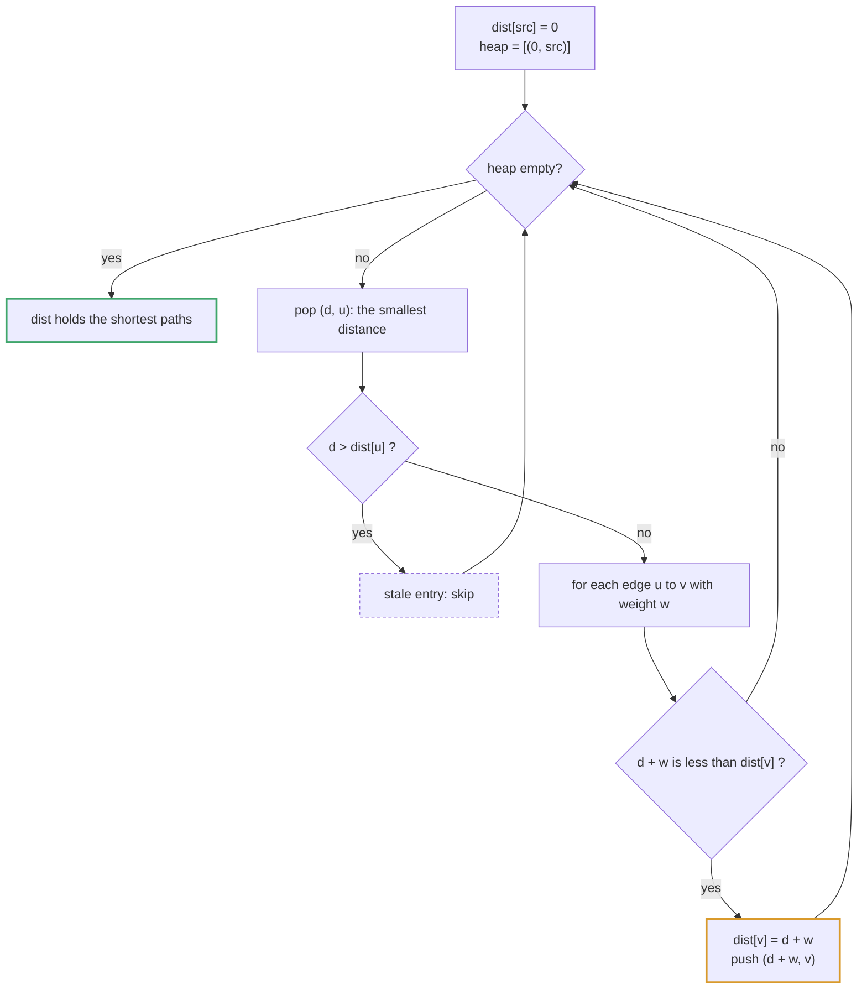
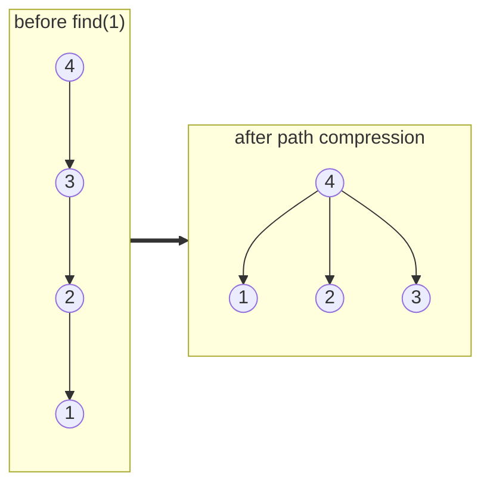
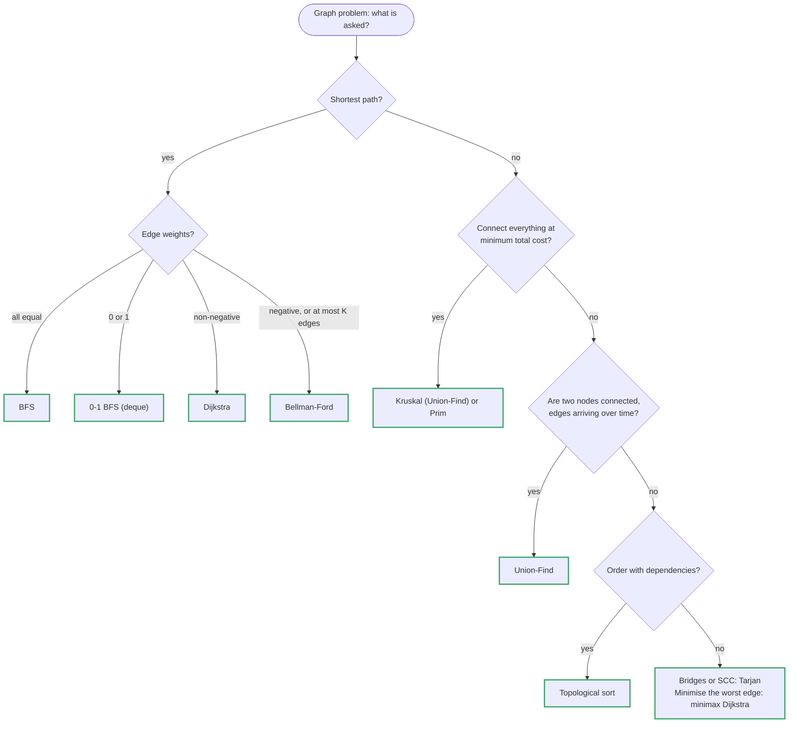
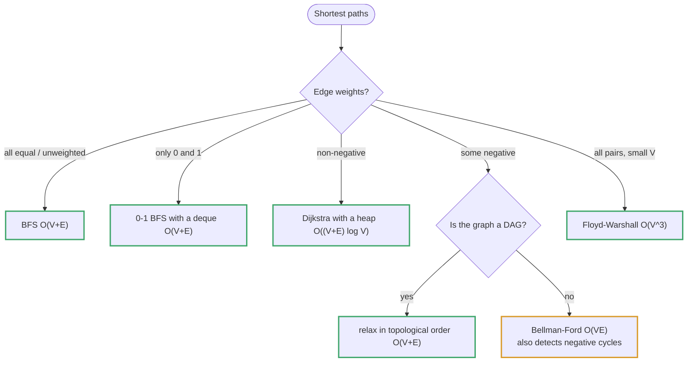

# Topic 15 · Advanced Graphs — Python Deep Dive

> Topic 14 answered "can I get from A to B, and in what order do I visit
> everything" with plain DFS/BFS. This topic adds a second axis every
> problem here cares about: **weight**. Once edges cost different amounts,
> "reachable" stops being the interesting question and "cheapest" takes
> over — and a plain BFS queue (FIFO, no notion of cost) is now the wrong
> tool. Five machines solve that one new question in five different
> regimes (non-negative weights, negative weights, minimax paths, minimum
> spanning trees, and structural weak-points that have no "weight" at all),
> and this folder is a tour of all five.

---

## Part 1 · Dijkstra's Algorithm — cheapest path, non-negative weights

**The idea:** greedily finalize the closest unvisited node first. Once a
node is popped from a min-heap ordered by distance, its shortest distance
is *locked in* — no edge discovered later can beat it, because every edge
weight is `>= 0`, so no path through an as-yet-unvisited (therefore
farther) node can ever be shorter. That non-negativity is the whole
argument; it is also exactly what breaks the algorithm the instant a
negative edge appears (§2).




```python
import heapq

def dijkstra(n, adj, src):
    dist = [float('inf')] * n
    dist[src] = 0
    heap = [(0, src)]                 # (distance, node)
    while heap:
        d, u = heapq.heappop(heap)
        if d > dist[u]:                # STALE ENTRY — see below
            continue
        for v, w in adj[u]:
            nd = d + w
            if nd < dist[v]:
                dist[v] = nd
                heapq.heappush(heap, (nd, v))
    return dist
```

**Stale heap entries.** Python's `heapq` has no `decrease-key`. Instead of
mutating an entry in place, the code simply pushes a *new* `(nd, v)` pair
whenever it finds a cheaper route to `v`, leaving the old, larger-distance
entry sitting in the heap. That old entry is still popped eventually — the
`if d > dist[u]: continue` guard is what makes that a no-op instead of a
correctness bug: by the time the stale, larger `d` comes back up, `dist[u]`
already holds something smaller, so the stale entry is discarded. Without
that guard the algorithm still terminates (nothing loops), but it may
re-scan a node's edges more times than necessary — the guard is a pruning
optimization *and* cheap insurance, always include it. Heap size is bounded
by O(E) (one push per relaxation), so this costs O(E log E) = O(E log V)
overall — same asymptotic as decrease-key with a Fibonacci heap for
interview purposes.

**Complexity.** O((V + E) log V) with a binary heap adjacency-list
implementation. Problems 003 (Network Delay Time) and 006/008 (minimax
variants, §3) all sit on this same skeleton.

---

## Part 2 · Bellman-Ford — negative weights, and "at most K edges"

Dijkstra's greedy lock-in breaks the moment a negative edge exists: a node
popped as "closest so far" can later be undercut by a path that dips
through a negative edge discovered afterward. Bellman-Ford gives up the
greedy shortcut and instead **relaxes every edge, V-1 times**:

```python
def bellman_ford(n, edges, src):
    dist = [float('inf')] * n
    dist[src] = 0
    for _ in range(n - 1):
        for u, v, w in edges:
            if dist[u] + w < dist[v]:
                dist[v] = dist[u] + w
    return dist
```

Why `V-1` rounds: the shortest simple path between any two nodes uses at
most `V-1` edges (a simple path visits each of the V nodes at most once).
Round `k` guarantees every shortest path using `<= k` edges has been found.
A `V`-th round that still finds an improvement means a **negative cycle**
exists (the "shortest path" keeps shrinking forever) — the standard
follow-up check.

**Why this matters beyond negative weights:** Bellman-Ford's round-by-round
structure gives it something Dijkstra fundamentally cannot express —
**"cheapest path using at most K edges/stops."** Dijkstra's priority queue
optimizes for globally cheapest regardless of hop count, so a 1-stop
$500 flight can permanently block relaxation of a 2-stop $50 flight if
Dijkstra is used naively with a plain `dist[]` array (see 004's "common
mistakes" for exactly this bug). Bellman-Ford limited to `K+1` rounds, using
a **snapshotted** `dist` array each round (so round `k`'s relaxations don't
leak into round `k`'s own updates), naturally enforces "at most K edges" —
that snapshot is the second subtlety problem 004 is built to teach.

O(V * E) time — much worse than Dijkstra's O(E log V), but it is the only
tool of the two that (a) tolerates negative weights and (b) can bound hop
count directly.

---

## Part 3 · Minimax paths — Dijkstra's skeleton, a different cost function

Problems 006 (Path With Minimum Effort) and 008 (Swim in Rising Water) ask
for a path minimizing the **maximum single edge weight** along it, not the
**sum** of edge weights. The Dijkstra skeleton is unchanged — pop the
locally-best node from a heap, relax neighbors, skip stale entries — only
the relax rule changes:

```python
# sum-of-edges (003, 004):           # max-of-edges / "minimax" (006, 008):
nd = d + w                            nd = max(d, w)
if nd < dist[v]: ...                  if nd < dist[v]: ...
```

The greedy argument survives intact: whichever frontier node has the
*smallest* running max-so-far is finalized first, because no alternative
route through a currently-farther node can produce a smaller max (its own
running max is already >= the current node's, by heap-pop order, and `max`
is monotone non-decreasing along any path). Same O(E log V). Problem 008
additionally admits a Union-Find/Kruskal-flavored solution (§4) and a
binary-search-on-the-answer + BFS/DFS solution — three independent correct
angles on one problem, worth naming all three in an interview.

---

## Part 4 · Minimum Spanning Tree — Prim's vs. Kruskal's

Both build a tree connecting all V nodes with the minimum total edge
weight, using V-1 edges, no cycles. They differ in what they grow from.

**Kruskal's** — sort ALL edges by weight ascending, then greedily add each
edge unless it would form a cycle (checked with Union-Find, O(α(V)) ≈
O(1) amortized per check — §5). Global, edge-centric.

```python
def kruskal(n, edges):                     # edges: (w, u, v)
    edges.sort()
    uf = UnionFind(n)
    total, used = 0, 0
    for w, u, v in edges:
        if uf.union(u, v):                 # returns False if already connected
            total += w
            used += 1
            if used == n - 1:
                break
    return total if used == n - 1 else -1  # -1: graph disconnected
```

**Prim's** — start from any single node, repeatedly pull the cheapest edge
that crosses the frontier (visited ↔ unvisited) via a min-heap, exactly
like Dijkstra but comparing edge weight instead of accumulated distance.
Local, node-centric.

```python
def prim(n, adj, start=0):
    visited = [False] * n
    heap = [(0, start)]
    total = 0
    while heap:
        w, u = heapq.heappop(heap)
        if visited[u]:
            continue
        visited[u] = True
        total += w
        for v, wt in adj[u]:
            if not visited[v]:
                heapq.heappush(heap, (wt, v))
    return total
```

**When to use which:**

| | Best when | Complexity (heap-based) |
|---|---|---|
| Kruskal's | edge list given directly, or graph is **sparse** (E close to V) | O(E log E) — dominated by the sort |
| Prim's | adjacency list/matrix given, or graph is **dense** (E close to V^2, e.g. 005's "every pair of points is an edge") | O(E log V), or O(V^2) array-based without a heap |

Problem 005 (Min Cost to Connect All Points) is the textbook dense case —
n points, C(n,2) implicit edges — where array-based O(V^2) Prim's beats
building and sorting O(V^2) edges for Kruskal's. Problem 011 (critical /
pseudo-critical MST edges) is Kruskal's run repeatedly with one edge forced
out or forced in — the edge-centric view is what makes "which edge" a
natural question to ask at all.

---

## Part 5 · Union-Find (Disjoint Set Union) — the internals

A Union-Find tracks a partition of elements into disjoint sets, supporting
`find(x)` (which set is x in — returns a representative/"root") and
`union(x, y)` (merge x's and y's sets), both in **amortized near-O(1)**.
Two independent optimizations combine to get there:




```python
class UnionFind:
    def __init__(self, n):
        self.parent = list(range(n))     # everyone is their own root initially
        self.rank = [0] * n              # union by rank: an upper bound on tree height

    def find(self, x):
        if self.parent[x] != x:
            self.parent[x] = self.find(self.parent[x])   # PATH COMPRESSION
        return self.parent[x]

    def union(self, x, y):
        rx, ry = self.find(x), self.find(y)
        if rx == ry:
            return False                  # already in the same set — this IS the cycle check
        if self.rank[rx] < self.rank[ry]: # UNION BY RANK: attach the shorter tree
            rx, ry = ry, rx               # under the taller one, never the reverse
        self.parent[ry] = rx
        if self.rank[rx] == self.rank[ry]:
            self.rank[rx] += 1
        return True
```

**Path compression** — every node visited during a `find` gets re-parented
directly to the root, so the *next* `find` on any of them is O(1). This
alone, without union-by-rank, already gives O(log n) amortized.

**Union by rank** — always hangs the shorter tree under the taller one's
root, so tree height grows by at most one, logarithmically, instead of
possibly forming a degenerate O(n)-tall chain when merges are always "big
tree absorbs small tree" done backwards.

**Together**, the amortized cost of `m` operations on `n` elements is
O(m · α(n)), where α is the inverse Ackermann function — for every n that
fits in a computer's memory, α(n) <= 4, i.e. **effectively O(1) per
operation**. The demo in problem 002's solution file times `find` with and
without path compression on a long union chain and shows the O(n) → O(1)
per-call flip directly.

`union` returning `False` exactly when `x` and `y` are already connected is
the mechanism Kruskal's (§4) uses as its cycle check, and it is what 001
(Number of Provinces) and 002 (Satisfiability of Equations) both build on
directly: connectivity queries and cycle detection are the same primitive.

---

## Part 6 · Tarjan's Bridge-Finding — low-link values

A **bridge** is an edge whose removal disconnects the graph (equivalently:
it lies on no cycle). Tarjan's algorithm finds every bridge in one O(V+E)
DFS pass using two arrays built during the traversal:

- `disc[u]` — the DFS **discovery time** (order) of node u, assigned once,
  the first time u is visited.
- `low[u]` — the **lowest discovery time reachable from u's subtree**,
  including via *at most one back-edge* to an ancestor (never through the
  edge back to u's immediate parent — that would trivially make every edge
  look non-bridging).

```
low[u] = min(
    disc[u],
    min(disc[v] for each back-edge u -> v to an already-visited ancestor v),
    min(low[c]  for each DFS-tree child c of u),
)
```

**The bridge test:** after fully exploring a DFS-tree child `c` of `u`, the
edge `(u, c)` is a bridge **iff `low[c] > disc[u]`** — meaning nothing in
`c`'s entire subtree can reach back up to `u` or higher through any other
route, so `(u, c)` is the *only* connection holding that subtree on. If
`low[c] <= disc[u]`, some back-edge inside c's subtree loops all the way up
to `u` or an ancestor, giving that subtree a second way out — not a bridge.

```
      1
     / \
    2   3
     \ /
      4 —— 5

DFS from 1: disc = {1:0, 2:1, 4:2, 3:3, 5:4}   (one valid order)
back-edge 4->3 found while exploring node 3's subtree from 4? trace carefully:
  visit 1 (disc=0) -> visit 2 (disc=1) -> visit 4 (disc=2)
    -> visit 3 (disc=3) -> back-edge 3->1 (ancestor!) -> low[3] = min(disc[3], disc[1]) = 0
    back to 4: low[4] = min(disc[4], low[3]) = 0
    -> visit 5 (disc=4), no other edges -> low[5] = disc[5] = 4
  back to 4: low[4] = min(low[4], low[5]) = min(0, 4) = 0
  back to 2: low[2] = min(disc[2], low[4]) = min(1, 0) = 0
  back to 1: low[1] = min(disc[1], low[2]) = 0

edge (2,4): low[4]=0 <= disc[2]=1  -> NOT a bridge (1-3-4 gives a second route)
edge (4,5): low[5]=4  > disc[4]=2  -> BRIDGE (5 has no other way off the graph)
edge (1,2): low[2]=0 <= disc[1]=0  -> NOT a bridge
```

**Iterative, not recursive.** A naive recursive DFS raises `RecursionError`
on a long chain (Python's default recursion limit is 1000; 012's
constraints allow up to 10^5 nodes, and a path graph is exactly the
worst-case chain). The standard fix is an **explicit stack that simulates
the call frame**, tracking, per frame, which neighbor-iterator position it
was paused at — so that after a deeper call "returns," the low-link
update against the child can still happen. Problem 012's solution
implements this iterative form and demonstrates the recursion ceiling
directly by breaking the naive recursive version on a 5,000-node chain.

The identical machine, with `low[u] >= disc[c]` (not `>`) instead, finds
**articulation points** (cut vertices) instead of bridges — a common
follow-up, not needed by any problem in this folder but worth stating.

---

## Part 7 · Topological Sort for Ordering-Constraint Problems

Covered in depth in topic 14 for course prerequisites; it resurfaces here
in problem 009 (Alien Dictionary) with a twist: the edges aren't given
directly, they must be **derived** by comparing every pair of adjacent
words in the input list to find the first differing character (that
character's word must precede the other's letter in the alien alphabet).
Kahn's BFS algorithm (indegree array + queue of indegree-0 nodes) is the
natural fit here because it detects a cycle *and* produces the order in
one pass, and — unlike DFS-based topological sort — falls out of the loop
early and cleanly when the queue empties before all letters are ordered
(a cycle, hence no valid alien alphabet).

```python
from collections import deque, defaultdict

def topo_sort_kahn(n, adj):                 # adj: node -> list of successors
    indeg = [0] * n
    for u in adj:
        for v in adj[u]:
            indeg[v] += 1
    queue = deque(u for u in range(n) if indeg[u] == 0)
    order = []
    while queue:
        u = queue.popleft()
        order.append(u)
        for v in adj[u]:
            indeg[v] -= 1
            if indeg[v] == 0:
                queue.append(v)
    return order if len(order) == n else None   # None: cycle detected
```

Problem 010 (Reconstruct Itinerary) looks related — it is also about
*ordering* — but is a genuinely different problem: it wants an **Eulerian
path** (visit every EDGE exactly once), not a topological order (visit
every NODE respecting precedence). Hierholzer's algorithm, not
topological sort, is the tool there; see the problem's own file for the
iterative stack-based construction and why naive greedy edge-picking
fails (the "dead end" trap).

---

## Part 6a · Tarjan's Algorithm for Strongly Connected Components (SCC)

§6 finds *bridges* — edges whose removal disconnects an undirected graph.
The same low-link machine, run on a **directed** graph with one extra piece
of state, answers a different question: which nodes can all reach each
other (a cycle of mutual reachability), i.e. **strongly connected
components**. This is a standard follow-up ("condense the graph," "detect
all cycles," 2-SAT) even when no problem in this folder exercises it.

**The extra state:** an explicit stack of nodes currently "on the DFS path,"
plus an `on_stack[]` boolean array. `low[u]` is now defined only over
back-edges to nodes still **on the stack** (an edge to an already-finished,
popped node points into an *already-emitted* SCC — visiting it must not
pull `low[u]` down, or two separate SCCs would incorrectly merge):

```python
def tarjan_scc(n, adj):
    disc = [-1] * n
    low = [0] * n
    on_stack = [False] * n
    stack = []
    timer = [0]
    sccs = []

    def dfs(u):
        disc[u] = low[u] = timer[0]
        timer[0] += 1
        stack.append(u)
        on_stack[u] = True
        for v in adj[u]:
            if disc[v] == -1:                  # tree edge — recurse
                dfs(v)
                low[u] = min(low[u], low[v])
            elif on_stack[v]:                  # back-edge to an ACTIVE ancestor
                low[u] = min(low[u], disc[v])  # note: disc[v], not low[v] — see below
            # else: v is finished and off-stack -> edge into a prior SCC, ignore

        if low[u] == disc[u]:                  # u is a component ROOT
            comp = []
            while True:
                w = stack.pop()
                on_stack[w] = False
                comp.append(w)
                if w == u:
                    break
            sccs.append(comp)

    for u in range(n):
        if disc[u] == -1:
            dfs(u)
    return sccs
```

**Why `disc[v]`, not `low[v]`, on a back-edge.** Using `low[v]` here would
let `low[u]` absorb information from a node `v` whose own SCC-root status
isn't decided yet, potentially propagating a value that later turns out to
belong to a *different* component once `v`'s own subtree finishes. `disc[v]`
is fixed the instant `v` is first visited and never changes — it is always
safe to fold in directly. (Bridge-finding in §6 has the same subtlety,
stated there as "never through the edge back to the immediate parent"; here
the guard is "on_stack", a strictly stronger and more general condition
because directed graphs have no symmetric "parent edge" to special-case.)

**Why `low[u] == disc[u]` marks a component root.** `low[u] == disc[u]`
means nothing in `u`'s subtree (through any tree edge or back-edge) can
reach any node discovered *before* `u` — so `u` is the earliest-discovered
member of its own SCC, i.e. its root. Every node still sitting above it on
the explicit stack at that moment (down to and including `u`) belongs to
the same component, because they were all pushed while exploring `u`'s
subtree and none of them has been popped yet (popping only happens at a
component root).

**Complexity:** O(V + E), one DFS pass — identical shape to bridge-finding.
**Kosaraju's algorithm** (two DFS passes: one to compute a finish-order,
one on the transpose graph in reverse-finish order) is the classically
taught alternative with the same O(V+E) bound; Tarjan's is preferred in
practice because it needs only one DFS and no graph transpose.

---

## Part 6b · A\* Search — Dijkstra With an Admissible Heuristic

Dijkstra (§1) explores strictly in order of *distance-so-far*, with no
notion of "and how much farther to the goal." When a single target node is
known in advance (not "shortest path to everywhere," but "shortest path to
THIS node"), A\* adds a **heuristic** `h(v)` — an estimate of the remaining
cost from `v` to the goal — and orders the heap by `f(v) = g(v) + h(v)`
(cost-so-far plus estimated cost-to-go) instead of `g(v)` alone:

```python
import heapq

def a_star(n, adj, src, goal, h):
    g = [float('inf')] * n
    g[src] = 0
    heap = [(h(src), src)]              # (f = g + h, node)
    while heap:
        f, u = heapq.heappop(heap)
        if u == goal:
            return g[u]
        if f > g[u] + h(u):             # stale entry, same guard idea as §1
            continue
        for v, w in adj[u]:
            ng = g[u] + w
            if ng < g[v]:
                g[v] = ng
                heapq.heappush(heap, (ng + h(v), v))
    return -1
```

**The one condition that keeps this correct: `h` must be admissible** — it
must never *overestimate* the true remaining cost (`h(v) <= true_cost(v,
goal)` for every `v`). Dijkstra is the degenerate case `h(v) = 0` for all
`v` (trivially admissible), which is why A\* is a strict generalization, not
a different algorithm — with `h == 0`, `f == g` and the heap order collapses
to exactly Dijkstra's. Straight-line (Euclidean) distance is the canonical
admissible heuristic on a geometric grid: no real path can be shorter than
"as the crow flies," so it never overestimates.

**Why admissibility preserves correctness.** Dijkstra's greedy lock-in
argument (§1) relies on: the popped node's *tie-breaking key* can only grow
along any path from it. With `f = g + h` and `h` admissible, `f(v) <=
g(v) + true_remaining(v) = true_total_cost_through_v`, so `f` never exceeds
the actual best total cost achievable through `v` — meaning a node popped
with the smallest `f` still cannot be beaten by a path through a
currently-unvisited (hence `f`-larger) node. If `h` overestimates even
once, this bound breaks and A\* can finalize a node before its true shortest
path has been found, i.e. it becomes an inadmissible/incorrect heuristic
search (still often used deliberately in practice — "weighted A\*" — trading
optimality for speed).

**Why it's faster than Dijkstra in practice, not in worst-case Big-O.**
Worst case (a poor or zero heuristic) A\* degrades exactly to Dijkstra's
O((V+E) log V) — no asymptotic improvement is guaranteed. Its practical win
is that a good heuristic sharply prunes which nodes the heap ever bothers
exploring in the *direction away from the goal*, which matters enormously
on large geometric graphs (pathfinding, maps) and not at all on a graph with
no meaningful geometric/goal-directed structure — which is exactly why no
problem in this folder (or on LeetCode generally) uses it: A\*'s value is
domain knowledge about the goal's location, and abstract graph problems
rarely supply one.

---

## Part 8 · Decision Tree for This Folder




```
1. Cheapest path, ALL weights >= 0, no hop-count limit?
       -> Dijkstra (§1). 003.

2. Cheapest path, weights can be negative, OR "at most K edges/stops"?
       -> Bellman-Ford (§2), snapshot dist[] each round. 004.

3. Minimize the MAXIMUM single edge weight on a path (not the sum)?
       -> Dijkstra's skeleton, max() relax instead of +() relax (§3).
          Also solvable via Union-Find-on-sorted-edges or binary-search+BFS.
          006, 008.

4. Connect ALL nodes as cheaply as possible (spanning tree)?
       -> MST: Kruskal's (sparse / edge list given) or Prim's (dense /
          adjacency given) — §4. 005. Then: "which single edge is essential
          (critical) or replaceable-without-cost (pseudo-critical)?" is
          Kruskal's re-run with one edge excluded/forced. 011.

5. Just "are these two connected", or "does adding this edge create a
   cycle" — repeatedly, incrementally?
       -> Union-Find (§5), not a fresh traversal each time. 001, 002, and
          the cycle-check inside Kruskal's itself.

6. "Which single edge, if removed, disconnects part of the graph" —
   a STRUCTURAL question with no weights at all?
       -> Tarjan's bridge-finding, low-link values, one DFS pass (§6). 012.

7. Reachability / relative order between ALL pairs, small V (<= ~400)?
       -> Floyd-Warshall, O(V^3) all-pairs, or V independent BFS/DFS runs.
          007.

8. An ORDERING must respect pairwise precedence constraints (not edge
   traversal)?
       -> Topological sort, Kahn's BFS preferred for cycle detection (§7).
          009.

9. Must traverse every EDGE exactly once (not every node)?
       -> Eulerian path, Hierholzer's algorithm, iterative (§7 note). 010.

10. DIRECTED graph — which nodes can all reach each other (mutual cycles)?
       -> Tarjan's SCC, low-link + explicit stack + on_stack[] (§6a).

11. Single known SOURCE and single known GOAL, with a domain-specific
    distance estimate available (e.g. grid Euclidean distance)?
       -> A* — Dijkstra's skeleton with f = g + h, h admissible (§6b).
```

---

## Part 9 · Complexity Reference for This Topic

| Algorithm | Time | Space | Notes |
|---|---|---|---|
| Dijkstra (binary heap) | O((V+E) log V) | O(V+E) | needs non-negative weights |
| Bellman-Ford | O(V · E) | O(V) | tolerates negative weights; detects negative cycles |
| Bellman-Ford, K-round capped | O(K · E) | O(V) | "at most K edges" constraint |
| Prim's (heap) | O(E log V) | O(V+E) | dense graphs: O(V^2) array-based, no heap |
| Kruskal's | O(E log E) | O(V) | dominated by the edge sort |
| Union-Find (path compr. + rank) | O(α(n)) amortized/op | O(V) | α(n) ≈ 4 for any real n |
| Tarjan's bridges (iterative) | O(V + E) | O(V) | single DFS pass, low-link arrays |
| Tarjan's SCC | O(V + E) | O(V) | low-link + explicit stack, directed graphs |
| A* (binary heap) | O((V+E) log V) worst case | O(V+E) | same bound as Dijkstra; wins in practice via pruning, not asymptotics |
| Floyd-Warshall (all-pairs) | O(V^3) | O(V^2) | fine for V <= ~400 |
| Topological sort (Kahn's) | O(V + E) | O(V) | detects cycles as a side effect |
| Hierholzer's (Eulerian path) | O(E log E) | O(E) | log factor from sorting/heaping destinations |

---

<!-- block:15_py_1_beyond -->
## Part 10 · Proofs, Path Reconstruction and the Rest of the Shortest-Path Family

The guide gives the algorithms; these are the questions asked *about* them. Every snippet was run, and each counter-example
below was reproduced.



### 10.1 Why Dijkstra needs non-negative weights — a counter-example

Dijkstra *finalises* a node the moment it is popped, on the promise that no later path can be shorter. A negative edge
breaks the promise. With `A→B (2)`, `A→C (3)`, `C→B (−2)`:

```
pop A(0): dist B = 2, C = 3     pop B(2): finalised at 2     pop C(3): relaxing C→B gives 1 — but B is already final
```

An implementation that finalises returns `{'A': 0, 'B': 2, 'C': 3}`; the true distances (Bellman-Ford) are
`{'A': 0, 'B': 1, 'C': 3}`. The proof of correctness is one sentence — *when `u` is popped, every unfinalised node's
distance is at least `dist[u]`, and adding a non-negative edge cannot lower it* — and it is exactly the sentence that a
negative edge falsifies. (The lazy-deletion loop without a `done` set happens to recover on small graphs, but can take
exponential time; do not rely on it.)

### 10.2 Getting the *path*, not just the distance

Store a **predecessor** each time a distance improves, then walk it back from the target and reverse:

```python
if d + w < dist.get(v, inf): dist[v] = d + w; prev[v] = u; heappush(pq, (d + w, v))
...
path, cur = [dst], dst
while cur != src: cur = prev[cur]; path.append(cur)
return dist[dst], path[::-1]           # the classic 6-node graph, a to e: (20, ['a', 'c', 'f', 'e'])
```

Return `None` (not a path of length 0) when `dst` was never reached, and remember that the *first* time the target is popped
its distance is final, so you can stop early.

### 10.3 Shortest and longest paths on a DAG, in linear time

If the graph is acyclic, **relax the edges in topological order**: each edge is relaxed exactly once and every node's
distance is final when its turn comes — O(V + E), and **negative weights are fine**. Flip `min` to `max` for the *longest*
path (critical path), which is NP-hard on general graphs:

```python
for u in order:                                     # topological order (Kahn's, topic 14)
    if dist[u] < inf:
        for v, w in adj[u]: dist[v] = min(dist[v], dist[u] + w)
# CLRS example from node 1: [inf, 0, 2, 6, 5, 3]
```

### 10.4 Negative cycles

Bellman-Ford relaxes every edge `V − 1` times; a shortest path has at most `V − 1` edges, so if a **`V`-th round still
improves something**, a negative cycle is reachable:

```python
for i in range(n):
    changed = False
    for u, v, w in edges:
        if dist[u] + w < dist[v]: dist[v] = dist[u] + w; changed = True
    if not changed: return False
    if i == n - 1 and changed: return True          # still relaxing on the n-th round
# edges (0,1,1)(1,2,-1)(2,0,-1): True   with (2,0,+1): False
```

Distances are *undefined* on a negative cycle (you can loop forever), so detect it before trusting any output. Arbitrage
detection (currency exchange) is this problem with `−log(rate)` as the weight. **SPFA** is Bellman-Ford with a queue of
"nodes whose distance just changed" — often fast in practice, still O(VE) worst case.

### 10.5 Articulation points (cut vertices) versus bridges

A **bridge** is an edge whose removal disconnects the graph (Problem 012); an **articulation point** is a *vertex* with that
property. Same DFS, one different test — and one special case for the root:

```python
for v in g[u]:
    if v == parent: continue
    if disc[v] == -1:
        children += 1; dfs(v, u); low[u] = min(low[u], low[v])
        if parent != -1 and low[v] >= disc[u]: aps.add(u)      # v's subtree cannot reach ABOVE u
    else: low[u] = min(low[u], disc[v])
if parent == -1 and children > 1: aps.add(u)                   # the ROOT is a cut vertex iff it has 2+ DFS children
```

Bridge: `low[v] > disc[u]` (strictly greater — the subtree cannot even reach `u`). Cut vertex: `low[v] >= disc[u]` (it
cannot reach *above* `u`). `[(0,1),(1,2),(2,0),(1,3),(3,4)]` → cut vertices `[1, 3]`; the path `0-1-2-3` → `[1, 2]`; a
triangle → none.

### 10.6 Choosing the algorithm

| Problem | Algorithm | Cost | Note |
|---|---|---|---|
| Single source, non-negative | Dijkstra (heap) | O((V+E) log V) | Lazy deletion instead of decrease-key. |
| Single source, dense graph | Dijkstra (array scan) | O(V²) | Beats the heap when `E ≈ V²`. |
| Single source, negative edges | Bellman-Ford | O(VE) | Detects negative cycles; "at most K edges" is K rounds of it. |
| Single source, DAG | topological relaxation | O(V+E) | Negative weights allowed; longest path too. |
| All pairs, `V ≤ ~400` | Floyd–Warshall | O(V³) | `k` outermost; also transitive closure. |
| All pairs, sparse, negative edges | Johnson's | O(VE log V) with a binary heap | Bellman-Ford once to reweight, then Dijkstra from every node. |
| Path minimising the *largest* edge | Dijkstra with `max(d, w)` | O((V+E) log V) | Or binary search + BFS, or a Kruskal-style sweep. |
| Heuristic goal-directed search | A* | ≤ Dijkstra | Admissible, consistent heuristic (Part 6b). |
| MST, sparse | Kruskal | O(E log E) | Sort + union-find. |
| MST, dense | Prim (array) | O(V²) | Problem 005. |

### 10.7 Where union-find shows up

| Use | The trick |
|---|---|
| Connectivity / components under edge insertions | `union` each edge; `find(a) == find(b)`. |
| Cycle detection in an undirected graph | An edge whose endpoints already share a root closes a cycle (Redundant Connection). |
| Kruskal's MST | Add sorted edges whose endpoints are in different sets. |
| Offline queries | Process events in a chosen order (e.g. sort edges and queries by weight) and answer connectivity as you go. |
| Equalities and inequalities | `==` unions; `!=` checks roots (Problem 002 — two passes). |
| Grouping by shared attributes | Union through the *shared thing* (an email), never through a name (Accounts Merge). |
| Ratios / potentials | Weighted union-find keeps each node's ratio to its root (Evaluate Division). |

Each operation is O(α(n)) amortised — effectively constant — with path compression and union by rank/size. It supports
*only* merging: it cannot split a component, so "delete an edge" needs offline reversal or a different structure.

### 10.8 Follow-ups the interviewer reaches for

| Follow-up | The answer |
|---|---|
| "Why not Dijkstra with negative edges?" | The finalisation promise fails (10.1) — use Bellman-Ford, or reweight with Johnson's. |
| "Return the path." | A predecessor map, walked back from the target (10.2). |
| "Now with a limit on the number of edges." | Bellman-Ford for K rounds using a *snapshot* of the last round; or Dijkstra over `(node, stops)` states. |
| "Is a path unique?" | Count shortest paths: keep `ways[v]`, adding `ways[u]` on a tie and resetting on an improvement. |
| "The graph changes." | Incremental: re-run from the changed edge; or a dynamic-graph structure. Mention that union-find only supports additions. |
| "Millions of nodes." | Bidirectional Dijkstra, A*, contraction hierarchies (real map routing), or precomputed landmarks. |

---
<!-- /block:15_py_1_beyond -->

<!-- problem-map:start -->
## Part 11 · Every Problem in This Topic, by Pattern

Fifteen problems, six moves (union-find · Dijkstra and its variants · Bellman-Ford · MST · bridges and Eulerian paths · weighted relations). Each **Trap** is a mistake documented in that problem's solution file.

| Problem | Move | The idea — and the trap it sets |
|---|---|---|
| [001 · Number of Provinces](PyDSA/15_advanced_graphs/001_number_of_provinces_solution.py) <br>LC 547 · Medium | Union-find components | Union each edge (`i < j` is enough on a symmetric matrix) and count distinct roots. **Trap:** scanning the whole matrix (double work); counting "n minus successful unions" (fragile — count distinct roots). |
| [002 · Satisfiability of Equality Equations](PyDSA/15_advanced_graphs/002_satisfiability_of_equality_equations_solution.py) <br>LC 990 · Medium | Two passes over the equations | Union every `==` first, then check every `!=` against the roots. **Trap:** interleaving both in input order (Example 4 breaks it); special-casing `a != a` (`find(a) == find(a)` already handles it). |
| [003 · Network Delay Time](PyDSA/15_advanced_graphs/003_network_delay_time_solution.py) <br>LC 743 · Medium | Dijkstra; answer is the max | Single-source shortest paths; the network is informed when the *farthest* node is. **Trap:** skipping the stale-entry guard (correct but wasteful); summing the distances instead of taking the maximum. |
| [004 · Cheapest Flights Within K Stops](PyDSA/15_advanced_graphs/004_cheapest_flights_within_k_stops_solution.py) <br>LC 787 · Medium | Bellman-Ford with a snapshot | "At most K stops" = at most K+1 edges: K+1 rounds, each relaxing against a *copy* of the previous round's distances. **Trap:** relaxing against the live array (more than one edge per round); plain Dijkstra with no stop count in the state. |
| [005 · Min Cost to Connect All Points](PyDSA/15_advanced_graphs/005_min_cost_to_connect_all_points_solution.py) <br>LC 1584 · Medium | MST on a dense graph | On a complete graph, Prim's O(n²) array scan beats heap-based Prim and Kruskal. **Trap:** a heap by textbook habit; treating a spanning-*tree* problem as a shortest-*path* problem. |
| [006 · Path With Minimum Effort](PyDSA/15_advanced_graphs/006_path_with_minimum_effort_solution.py) <br>LC 1631 · Medium | Minimax Dijkstra | The Dijkstra skeleton with the cost `max(d, w)` — the largest edge on the path. **Trap:** `d + w` (copy-pasted plain Dijkstra); skipping the stale-entry guard. |
| [007 · Course Schedule IV](PyDSA/15_advanced_graphs/007_course_schedule_iv_solution.py) <br>LC 1462 · Medium | Floyd–Warshall reachability | Transitive closure in O(V³) with the intermediate node `k` in the **outermost** loop; queries are O(1). **Trap:** `k` innermost (a plausible but incomplete table); a fresh BFS per query. |
| [008 · Swim in Rising Water](PyDSA/15_advanced_graphs/008_swim_in_rising_water_solution.py) <br>LC 778 · Hard | Dijkstra with node costs | The cost lives on the *cell entered* (its elevation): `max(d, grid[nr][nc])`, seeded with `grid[0][0]`. **Trap:** seeding `0` (the start's own elevation counts); using height *differences* (edge weights, as in 006). |
| [009 · Alien Dictionary](PyDSA/15_advanced_graphs/009_alien_dictionary_solution.py) <br>LC 269 · Hard | Topological sort from data | Adjacent words give edges from their **first** differing letter (stop there); Kahn's over the letters. **Trap:** never checking `["abc", "ab"]` (an invalid prefix order); an edge per differing position. |
| [010 · Reconstruct Itinerary](PyDSA/15_advanced_graphs/010_reconstruct_itinerary_solution.py) <br>LC 332 · Hard | Hierholzer's Eulerian path | Stack-and-commit-at-dead-end over lexically sorted edges, then reverse the route. **Trap:** greedily walking and stopping at the first dead end; forgetting the reverse. |
| [011 · Find Critical and Pseudo-Critical Edges in Minimum Spanning Tree](PyDSA/15_advanced_graphs/011_find_critical_and_pseudo_critical_edges_in_minimum_spanning_tree_solution.py) <br>LC 1489 · Hard | MST probes per edge | Exclude an edge: if the MST weight rises or the graph disconnects it is critical; include it: if the weight stays the same it is pseudo-critical. **Trap:** not checking that the excluded graph still connects all `n` nodes. |
| [012 · Critical Connections in a Network](PyDSA/15_advanced_graphs/012_critical_connections_in_a_network_solution.py) <br>LC 1192 · Hard | Tarjan's bridges | `low[v] > disc[u]` marks a bridge; skip the tree edge to the parent exactly once. **Trap:** treating the parent edge as a back edge (no bridge is ever found); recursion depth at `n = 10⁵`. |
| [013 · Accounts Merge](PyDSA/15_advanced_graphs/013_accounts_merge_solution.py) <br>LC 721 · Medium | Union-find by shared email | Union accounts through shared *emails*; group the emails by root. **Trap:** merging by name (two different Johns); a single pairwise pass that misses transitive merges. |
| [014 · Evaluate Division](PyDSA/15_advanced_graphs/014_evaluate_division_solution.py) <br>LC 399 · Medium | A weighted graph / union-find | Each `a / b = k` is an edge `a → b` of weight `k` and `b → a` of `1/k`; answer by the product along a path. **Trap:** returning `1.0` for `x / x` before checking that `x` exists; forgetting the reverse edges. |
| [015 · Minimum Cost to Make at Least One Valid Path in a Grid](PyDSA/15_advanced_graphs/015_minimum_cost_to_make_at_least_one_valid_path_in_a_grid_solution.py) <br>LC 1368 · Hard | 0-1 BFS | Following an arrow costs 0, changing one costs 1 — a deque, 0-cost neighbours to the front. **Trap:** plain BFS (treats it as unweighted); pushing both kinds to the back (SPFA-like, loses the linear bound). |

---
<!-- problem-map:end -->

## Checklist Before Leaving This Topic

- [ ] I can explain why Dijkstra's greedy lock-in requires non-negative
      weights, and what specifically breaks with a negative edge.
- [ ] I can explain why stale heap entries in a Python `heapq` Dijkstra are
      harmless, and why the `if d > dist[u]: continue` guard is still worth
      writing.
- [ ] I can state why Bellman-Ford needs exactly V-1 rounds, and how a
      V-th improving round detects a negative cycle.
- [ ] I can explain why capping Bellman-Ford at K rounds (with a
      per-round snapshot) answers "cheapest path with <= K edges" — and
      why plain Dijkstra cannot express that constraint at all.
- [ ] I can flip a sum-cost Dijkstra into a minimax (max-of-edges) Dijkstra
      by changing one line, and explain why the greedy argument still holds.
- [ ] I can choose Prim's vs. Kruskal's from graph density in one sentence.
- [ ] I can implement Union-Find with both path compression and union by
      rank from memory, and state why the combination is amortized O(1).
- [ ] I can define `disc[]` and `low[]` for Tarjan's bridge-finding and
      state the bridge test (`low[child] > disc[u]`) precisely.
- [ ] I know why Tarjan's must be written iteratively for this folder's
      constraints, not recursively.
- [ ] I can distinguish "topological order over nodes" from "Eulerian path
      over edges" and name the algorithm each one needs.
- [ ] I can explain why Tarjan's SCC checks `on_stack[v]` (not just
      "visited") on a back-edge, and why it folds in `disc[v]` rather than
      `low[v]`.
- [ ] I can state why `low[u] == disc[u]` identifies a component root.
- [ ] I can define "admissible heuristic" precisely and explain why an
      overestimating `h` breaks A*'s correctness proof.
- [ ] I can explain why A* with `h(v) = 0` is exactly Dijkstra, and why A*'s
      speedup is empirical (pruning), not a better worst-case bound.
</content>
- [ ] Give the negative-edge counter-example that breaks Dijkstra, and state the one-sentence proof it falsifies <!--ca-->
- [ ] Reconstruct the path with a predecessor map <!--ca-->
- [ ] Relax a DAG in topological order (O(V+E), negative weights allowed) and say why longest path is easy there <!--ca-->
- [ ] Detect a negative cycle with the `V`-th Bellman-Ford round <!--ca-->
- [ ] Tell bridges (`low[v] > disc[u]`) from articulation points (`>=`, plus the root rule) <!--ca-->

---

## Part 12 · Added Problems (013–015)

Added 16 Sep 2026 from the Google prep plan.

| # | Problem | Technique | The one idea |
|---|---|---|---|
| 013 | Accounts Merge | Union-Find over identifiers | Emails are nodes; each account unions its emails; people are components. Names are NOT identity |
| 014 | Evaluate Division | weighted graph / weighted Union-Find | `a/b = v` is edge a->b weight v and b->a weight 1/v; a query is a path product |
| 015 | Min Cost to Make a Valid Path in a Grid | **0-1 BFS** | Edge weights are 0 (follow the sign) or 1 (change it): deque, 0-edges to the front, 1-edges to the back |

### 0-1 BFS, stated once

When every edge weight is 0 or 1, Dijkstra's heap can be replaced by a deque. Invariant: the deque holds
distances D (front part) and D + 1 (back part) only, so popping from the front is always a minimum. Same
correctness as Dijkstra, O(V + E) time. Plain FIFO BFS is WRONG on these graphs — on random grids it
failed on a sizeable fraction of cases in the file's demo (smallest failure: `[[3,1],[4,3]]`, BFS says 2,
true answer 1).

### Weighted Union-Find, stated once

Store `weight[x] = x / parent[x]`. `find` compresses paths and multiplies weights so `weight[x] = x / root`.
Union sets `weight[ra] = v * weight[b] / weight[a]`. Queries on the same root are `weight[c] / weight[d]`.
This also detects contradictory equations (LC 2307) and underlies "parity union-find" for online
bipartiteness.

### Checklist additions

- [ ] I can pick BFS / 0-1 BFS / Dijkstra / Bellman-Ford from the edge weights alone.
- [ ] I can write weighted union-find and explain the weight formula direction.
