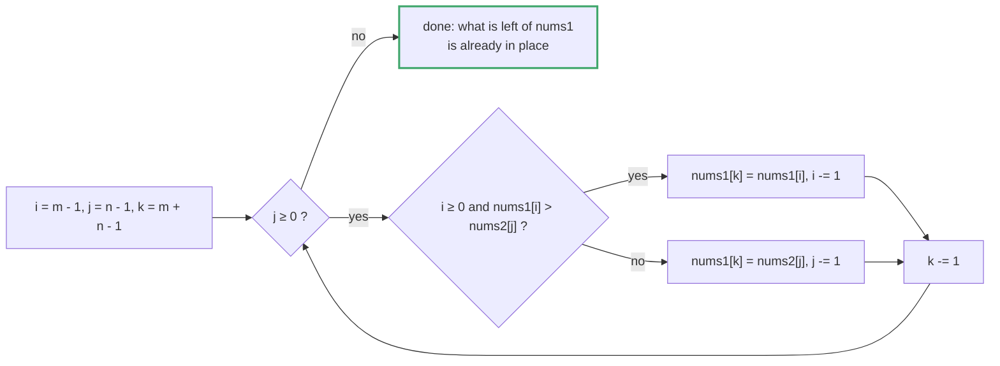
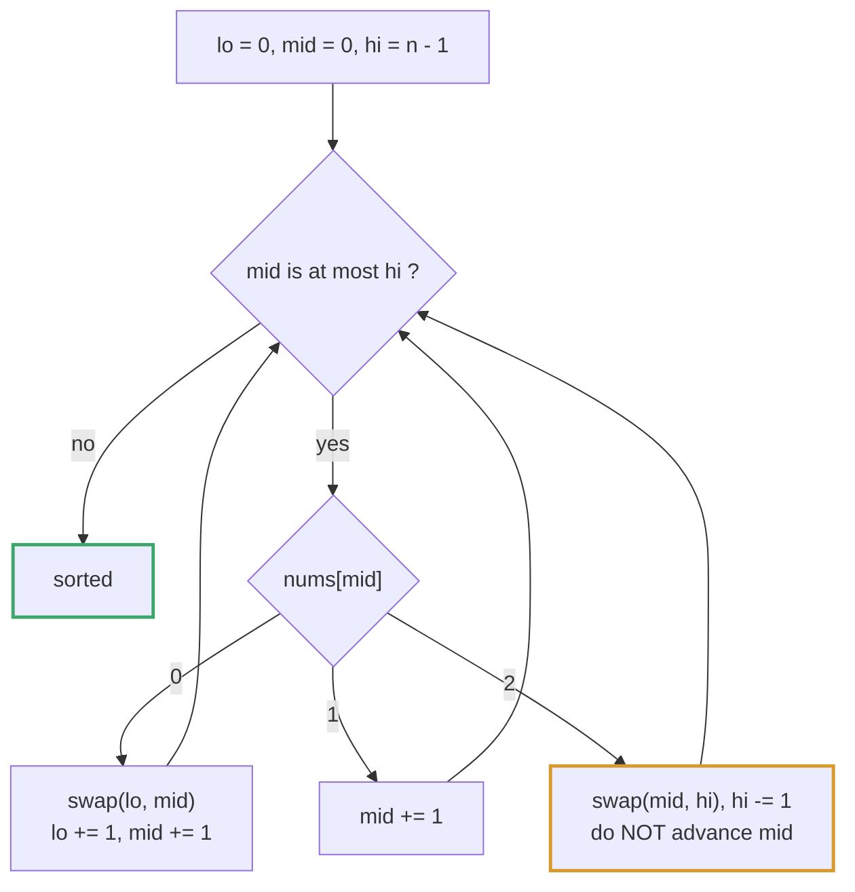
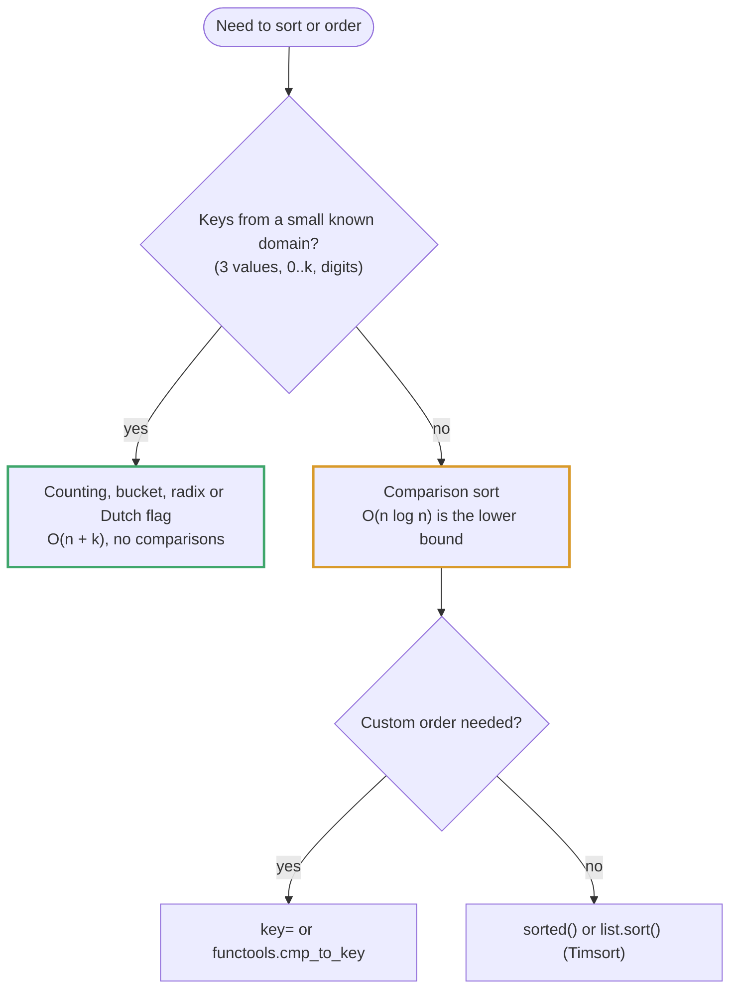
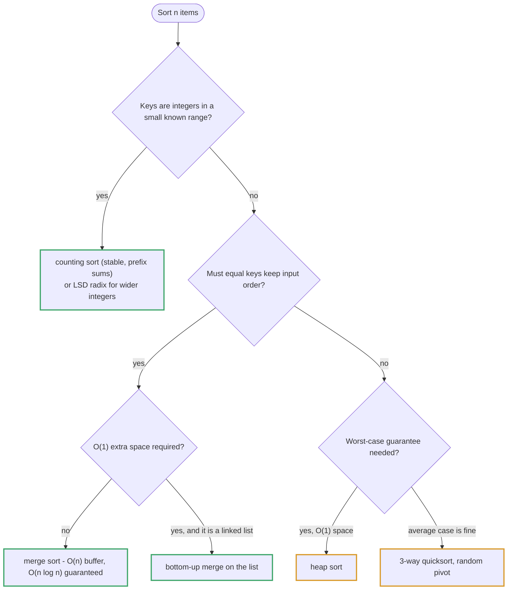

# Topic 22 · Sorting Algorithms — Python Deep Dive

> Every problem up to this point has TREATED sorting as a primitive you
> call and move past. This topic flips that: sorting IS the subject.
> The throughline is that "sort" is not one algorithm, it's a FAMILY with
> different guarantees — worst-case vs. expected time, comparison-based vs.
> not, stable vs. not, in-place vs. not — and the graded interview skill is
> picking (or building) the right member of that family for the
> constraint actually in front of you, then AUGMENTING the sort's own
> internal machinery (the merge step, the partition step, the bucket
> placement) to answer a question the plain sorted output alone can't.

---

## Part 0 · The eight problems and their tricks

**Merge from the back to reuse padded storage** (001 Merge Sorted Array):
`nums1` is simultaneously the SOURCE of its own real data and the
DESTINATION for the whole merge, with the destination's free space parked
at the far end. Writing the merge from the front (the natural way to write
it) collides — the write cursor catches up to and overwrites data not yet
read. Writing from the BACK never collides, because the write cursor
always stays ahead of both read cursors. This is the array-with-slack
special case of the merge-sort merge step; no comparison sort needed at
all, just the merge primitive run backwards.




**Reconstructing O(n log n) worst-case from scratch — merge sort as the
answer, quicksort as the caveat** (002 Sort an Array): with built-in sort
banned, this is "prove you understand why merge sort's recursive
halve-and-merge shape gives an UNCONDITIONAL O(n log n) bound, while
quicksort's partition-around-a-pivot shape only gives that bound in
EXPECTATION (and needs a random pivot plus 3-way partitioning to avoid
degrading to O(n²) on adversarial or duplicate-heavy input)." A third
variant — counting sort over `nums[i]`'s bounded `[-5·10⁴, 5·10⁴]` range —
shows a totally different, non-comparison complexity class (O(n + k)) is
available whenever the value domain is small and known, the same
trade topic 21's Sieve of Eratosthenes makes over the integer domain.

**Fixed 3-value domain collapses "sort" into one linear pass** (003 Sort
Colors): with only three possible values (0/1/2), there's no need to
choose or compare against a data-derived pivot — the "pivot" is baked in
as the value 1, and Dijkstra's Dutch National Flag algorithm partitions
the array around it with three pointers (`low`/`mid`/`high`) in exactly
one pass, O(1) space. This IS quicksort's 3-way partition step, specialized
to a domain small enough that the whole sort collapses to that one step.




**Merge sort's merge step needs no array at all — it's built for
pointers** (004 Sort List): a linked list can't do O(1) random-access
splitting (an array's `arr[:mid]` is free; a list needs a fast/slow
pointer walk, reusing topic 08's cycle-detection technique to physically
find the midpoint), but the MERGE half of merge sort is actually a
BETTER fit for a list than for an array — splicing `.next` pointers costs
zero extra allocation, versus an array merge's O(n) auxiliary buffer. The
follow-up (O(1) memory, not counting recursion) forces a bottom-up
iterative version that eliminates the call stack too, iterating merge
WIDTH instead of recursing on halves.

**Sort order isn't always numeric order — the comparator IS the
problem** (005 Largest Number): sorting the numbers themselves (by
magnitude) is provably wrong (`9` must precede `30` even though `9 < 30`,
because `"930" > "309"`). The actual sort key is "which pairwise
CONCATENATION, `a+b` or `b+a`, is larger" — fed into any general-purpose
comparator-driven sort (`functools.cmp_to_key`, or a hand-rolled merge
sort with the comparator swapped in for `<=`). The algorithmic engine
underneath is completely interchangeable; the only domain-specific piece
is the comparator, and proving the comparator produces a globally valid
order (not just a locally sensible pairwise rule) requires an exchange-
argument transitivity proof.

**Sort descending, then a MONOTONE condition finds the answer in one
scan** (006 H-Index): after sorting citations descending, `citations[i] >=
i+1` is non-increasing minus strictly increasing — it flips from true to
false EXACTLY once, so the scan can stop at the first failure. A second,
faster route notices `h` can never exceed `n` (paper count) regardless of
how large individual citation counts get, turning this into a bucket
sweep over the BOUNDED range `[0, n]` — O(n) instead of O(n log n), the
same "the answer's own range is smaller than the input's value range"
insight problem 007 exploits at Hard difficulty.

**Pigeonhole: the maximum gap can never hide inside a bucket** (007
Maximum Gap, Hard): with `n` numbers and a linear-time/space requirement
that rules out any comparison sort, split the value range into `n-1`
equal-width buckets. By pigeonhole, at least one bucket must be empty —
which means the bucket width itself is a LOWER BOUND on the true maximum
gap, and any two numbers sharing a bucket are therefore closer than that
bound. The maximum gap can only ever occur BETWEEN a bucket's max and the
next non-empty bucket's min — so the algorithm never needs to sort within
a bucket, only track each bucket's running min/max. A genuinely different
O(n) route (LSD radix sort, sorting fully via digit-by-digit counting
passes) reaches the same complexity from a completely different direction.

**Augment the merge step itself to answer a per-element query, not just
produce sorted output** (008 Count of Smaller Numbers After Self, Hard):
"how many later elements are smaller than me" is an INVERSION COUNT per
index. Sort a permutation of INDICES (not values) with merge sort, and
during each merge, track how many right-half elements have been consumed
before a given left-half element is placed — that running counter IS the
answer for that left element, because right-half indices are always
originally positioned after left-half indices. This is the deepest lesson
of the topic: a sort's internal machinery (here, the merge step) can be
augmented to answer a question the FINAL sorted array alone cannot
recover, once you've thrown away positional information. A second route —
a Binary Indexed Tree (Fenwick tree) over coordinate-compressed values,
walked right to left — reaches the same answer via an entirely different
mechanism (a dynamic prefix-sum-over-ranks structure) and is the direct
bridge into topic 26.

---

## Part 1 · Comparison sorts vs. non-comparison sorts — the real fork

Every comparison-based sort (merge sort, quicksort, heap sort, insertion
sort) is bounded below by **Ω(n log n)** in the worst case — this is an
information-theoretic limit, not an implementation weakness: there are
`n!` possible orderings of `n` distinct elements, and each single
comparison can only distinguish between two possibilities, so you need at
least `log₂(n!) ≈ n log n` comparisons to identify which ordering you're
looking at, no matter how cleverly you choose them.




**Non-comparison sorts sidestep that bound entirely** by never asking "is
A bigger than B" — they exploit STRUCTURE in the values themselves:

- **Counting sort** (002's variant, 003's Dutch-flag specialization) —
  the values live in a small, known, bounded range `[lo, hi]`; count
  occurrences of each value directly, no comparisons at all. O(n + k),
  k = range width.
- **Bucket sort / pigeonhole** (007 Maximum Gap) — you don't need to fully
  order the values, only bound where extremal relationships (here, the
  maximum gap) CAN'T occur, using an estimated bucket width derived from
  `n` itself.
- **Radix sort** (007's variant) — sort by one DIGIT position at a time
  (least-significant first), using a stable counting sort per digit; after
  processing every digit of the largest number, the array is fully sorted.
  O(d·(n+k)), d = digit count, k = digit base — effectively O(n) when d
  and k are constants (true for any fixed-width integer domain).

**The trade every non-comparison sort makes**: it needs a DOMAIN-SPECIFIC
guarantee (a bounded range, a fixed digit representation) that a general
comparison sort never requires. When that guarantee is available, a
non-comparison sort can be asymptotically faster; when it isn't (arbitrary
objects with only a `<` operator, or floating-point values with unbounded
precision), comparison sort is the only tool that still works.

---

## Part 2 · The comparator is the real interview question

001, 003, 004, 007 all reuse the SAME underlying algorithmic engine (merge
sort's merge step, or a partition), but four of the eight problems in this
folder — 002's `<=`, 004's `.val <=`, 005's `a+b > b+a`, 008's `<=` inside
the augmented merge — make it obvious that the engine is not where the
thinking happens. **The comparator (or the partition rule) is where the
thinking happens.** 005 is the sharpest example: the "obvious" comparator
(sort numerically) is provably wrong, and the correct one (`a+b` vs `b+a`)
requires an actual proof of why a PAIRWISE rule produces a globally valid
order (transitivity of the relation `a+b > b+a`) before you can trust
feeding it into a general-purpose sort at all. Treat "what's the
comparator" as a separable design question from "which sorting engine do
I run it through" — the engine is usually interchangeable (Timsort via
`cmp_to_key`, or a hand-rolled merge sort, as 005 demonstrates directly by
coding both).

---

## Part 3 · Augmenting a sort's internals — the Hard-difficulty throughline

007 and 008, the two Hard problems in this topic, both share a structural
move: **don't just call a sort and read off the final array — hook into
what the sort's internal machinery is ALREADY computing, and extract more
information than the sorted order alone would give you.**

- 007 hooks into the BUCKETING phase of a bucket sort and extracts a
  pigeonhole bound on the answer without ever sorting within a bucket.
- 008 hooks into the MERGE phase of a merge sort and extracts a per-
  element inversion count that the final sorted array (having thrown away
  original positions) could never recover on its own.

This is the single highest-value transferable skill in the topic: **when
a problem needs something ADJACENT to "sorted order" (a bound on a gap, a
count of inversions, a rank), look at what the sorting algorithm's
intermediate state already knows, before reaching for a separate data
structure.** That said, a separate data structure is sometimes the
cleaner tool for the exact same question — 008's Fenwick tree variant
proves the point by solving the identical problem through a completely
different mechanism.

---

## Part 4 · Cross-references worth remembering

- **001 ↔ topic 08** (`002_merge_two_sorted_lists`): the same merge-two-
  sorted-sequences primitive; 001 runs it backwards into padded array
  storage, topic 08 splices linked-list pointers forward.
- **002 ↔ topic 12** (Heap / Priority Queue): heap sort (named, not coded,
  in 002) is the sort that trades merge sort's O(n) auxiliary space for
  true O(1) in-place sorting by repeatedly popping a max-heap — topic 12
  develops the heap machinery this would be built on.
- **002/007's Quickselect connection ↔ topic 27** (Classic Algorithms):
  the SAME random-pivot partition used in 002's quicksort variant, run
  with recursion on only ONE side instead of both, is exactly how topic
  27 finds a Kth-ranked element in expected O(n) without a full sort.
- **007's pigeonhole bucketing ↔ topic 21** (`008_count_primes`, Sieve of
  Eratosthenes): both trade a bit of extra space for a fundamentally
  faster complexity class by exploiting a BOUNDED, KNOWN domain instead of
  treating the input as arbitrary.
- **008 ↔ topic 26** (Binary Indexed Tree / Segment Tree, upcoming): the
  Fenwick-tree variant of 008 IS the canonical "count of elements less
  than X seen so far, under insertions" application that topic 26 builds
  out in depth — this topic's coverage is the first real encounter with
  that data structure's use case, ahead of its dedicated topic.
- **008 ↔ counting inversions** (a classic, not separately in this
  curriculum): 008's per-element counts sum to the TOTAL inversion count
  of the array — the single-number version of this exact algorithm is one
  of the most common "augment merge sort" exercises in interview prep
  broadly, and Reverse Pairs (LC 493) is its direct cousin (same
  augmentation shape, a scaled comparison instead of a plain one).
- **003 ↔ topic 02** (Two Pointers, `Move Zeroes`): 003's Dutch flag is a
  3-way generalization of the simpler 2-way "partition in place with a
  slow/fast pointer" pattern topic 02 covers.

---

## Part 5 · Where this topic ends

Eight problems span the full comparison-vs-non-comparison spectrum: plain
merge (001), the two canonical general-purpose engines side by side
(merge sort's guarantee vs. quicksort's expectation, 002), a bounded-
domain partition collapsing to one pass (003), the same merge sort
retargeted at a pointer-based structure (004), a problem where the
comparator is the entire insight (005), a monotone-scan-after-sort
pattern that bridges into bucket sweeps (006), a pure pigeonhole argument
at Hard difficulty (007), and a merge-sort augmentation that computes
something the sorted array itself cannot recover (008). The transferable
skill across all eight: **sorting is a tool with several interchangeable
engines and one almost-always-domain-specific comparator/partition rule —
know which guarantee (worst-case vs. expected, comparison vs. structural)
the problem is actually demanding before picking the engine, and be ready
to hook into the engine's own internal state when the question is
adjacent to, but not identical to, "give me the sorted array."**

<!-- block:22_py_1_builtin -->
## Part 6 · Python's Built-in Sort — What `sorted()` Guarantees, What It Costs, and Where It Bites

Parts 0–5 explain the eight problems. The questions an interviewer asks *around* them are about the tool you would really
use — `sorted()` and `list.sort()` — so this Part pins down its guarantees and its sharp edges. Every number was measured
on CPython 3.13 on this machine (best of several runs); every snippet was run.

### 6.1 Timsort: stable, adaptive, and close to the information-theoretic limit

CPython's sort is **Timsort**: it finds *natural runs* (already-ascending stretches, and strictly descending ones, which it
reverses), extends short runs with insertion sort, and merges runs with a stable merge. Three guarantees follow: it is
**stable**, it is **O(n log n) in the worst case**, and it is **adaptive** — the more order the input has, the fewer
comparisons it needs. Counting comparisons with a `__lt__` that increments a counter, for `n = 100,000`:

| Input | Comparisons | Reading |
|---|--:|---|
| already sorted | 99,999 | exactly `n − 1`: one pass, one run |
| strictly reversed | 99,999 | a descending run is detected and reversed in place |
| sorted, then 1 % random swaps | 272,269 | mostly runs, a little merging |
| 4 distinct values | 564,385 | many equal keys shorten the merges |
| random permutation | 1,531,850 | **≈ 1 % above the lower bound** |

The lower bound is `⌈log₂(n!)⌉`, which for `n = 100,000` is **1,516,704** (`math.lgamma(n + 1) / math.log(2)`); `n·log₂ n` is
1,660,964, an overestimate. So no comparison sort can beat Timsort on random data by more than about 1 %. In time, `sorted()`
on a million ints took **101 ms** when shuffled, **2.9 ms** when already sorted, **3.0 ms** when reversed and **31 ms** with
four distinct values. Auxiliary space is at most `n/2` extra slots (a merge only buffers the *shorter* run), plus `n` slots for the cached keys when you pass `key=`.

### 6.2 The API you should be fluent in

```python
sorted(iterable, key=None, reverse=False)   # returns a NEW list, accepts any iterable
lst.sort(key=None, reverse=False)           # sorts IN PLACE and returns None
```

- **`key=` is called exactly once per element** — sorting 1,000 items called `key` 1,000 times — so an expensive key costs
  `n`, not `n log n`, calls. Comparison then uses the cached keys.
- **`reverse=True` keeps the sort stable.** `sorted([(1,'a'),(0,'b'),(1,'c'),(0,'d')], key=lambda r: r[0], reverse=True)`
  returns `[(1,'a'), (1,'c'), (0,'b'), (0,'d')]` — the tied `a`, `c` stay in input order (it is *not* `sorted(...)[::-1]`).
- **Tuple keys** give lexicographic multi-key sorts; negate a *numeric* field to flip one direction:
  `sorted(words, key=lambda w: (-len(w), w))` → `['abc', 'aa', 'bb', 'cc', 'a', 'b', 'c']`.
- **Stability makes multi-pass sorts work** — sort by the *secondary* key first, then the *primary*. For fields you cannot negate
  (strings), that is the way: `sorted(sorted(words), key=len, reverse=True)` gives the identical result to the tuple key above.
- **Case-insensitive order:** `sorted(['b','A','a','B'])` is `['A','B','a','b']` (code-point order); with `key=str.casefold`
  it is `['A','a','b','B']` — `A` and `a` tie, and stability keeps them in input order.
- **`operator.itemgetter` / `attrgetter` beat a lambda key.** On a million `(float, int)` tuples, `key=itemgetter(1)` took
  **93 ms** against **149 ms** for `key=lambda p: p[1]`.
- **`functools.cmp_to_key` is the slow path.** On 100,000 ints, plain `sorted` took **7.5 ms**; the same sort through
  `cmp_to_key(lambda a, b: (a > b) - (a < b))` took **60 ms** — every comparison becomes a Python call. Use it only when the
  order is genuinely pairwise (Problem 005: `''.join(sorted(map(str, [3, 30, 34, 5, 9]), key=cmp_to_key(cmp)))` →
  `'9534330'`, whereas a plain string sort of `['10', '2']` gives `['10', '2']`, not the answer `'210'`).

### 6.3 Three ways the built-in sort bites

| Trap | What happens (all run) |
|---|---|
| `nums = nums.sort()` | `list.sort()` returns `None` — `[3, 1, 2].sort()` prints `None` |
| Mixed types | `sorted([3, 'a'])` raises `TypeError: '<' not supported between instances of 'str' and 'int'` |
| `float('nan')` | Every comparison with NaN is `False`, so the result is *unspecified*: `sorted([3, nan, 1, 2])` returned `[3, nan, 1, 2]` (unsorted) while `sorted([3, 1, nan, 2])` returned `[1, nan, 2, 3]` — filter NaN out first |

Sorting compares only with `<`, so a custom class needs `__lt__` (or a `key=`); two objects that are neither `<` each other
are treated as equal.

### 6.4 When you do not need a full sort

| Need | Tool | Cost |
|---|---|---|
| Smallest / largest `k` of `n` | `heapq.nsmallest(k, xs)` / `nlargest` | O(n log k); for `k = 10` over a million ints, **7.1 ms** against **103 ms** for `sorted(xs)[:10]` |
| Merge already-sorted inputs | `heapq.merge(*iterables)` — lazy, O(N log k) for `k` inputs | `list(heapq.merge([1,4,7],[2,5,8],[0,3,6,9]))` → `[0, 1, …, 9]` |
| Keep a list sorted under inserts | `bisect.insort(xs, x)` | O(log n) search + O(n) shift |
| Each element at most `k` slots from its final position | min-heap of size `k + 1`: `heappushpop` for each new element | O(n log k); run on a 50-element array with displacement 2 |
| One order statistic (the `k`-th) | quickselect | O(n) expected — topic 27 |

An **external sort** (data larger than memory) is exactly this table's second row: sort memory-sized chunks into runs, then
`heapq.merge` the runs — three sorted runs of eight random values merged to the same result as `sorted(sum(runs, []))`.

---
<!-- /block:22_py_1_builtin -->

<!-- block:22_py_2_algorithms -->
## Part 7 · The Sorting Algorithms From Scratch — Properties, Code and Failure Modes

Problem 002 bans `sorted()` and Problems 007–008 hook into a sort's internals, so you must be able to *write* the
algorithms, state their properties without hesitation, and say how each one fails. All the code below passed 400 random
checks against `sorted()` (values in `[-10, 10]`, lengths 0–40, so duplicates and negatives are exercised).



| Algorithm | Best | Average | Worst | Extra space | Stable |
|---|---|---|---|---|:-:|
| Insertion sort | O(n) | O(n²) | O(n²) | O(1) | yes |
| Selection sort | O(n²) | O(n²) | O(n²) | O(1) | no |
| Merge sort (array) | O(n log n)¹ | O(n log n) | O(n log n) | O(n) | yes |
| Quicksort, random pivot | O(n log n) | O(n log n) | O(n²) | O(log n)² | no |
| Heap sort | O(n log n) | O(n log n) | O(n log n) | O(1) | no |
| Counting sort | O(n + k) | O(n + k) | O(n + k) | O(n + k) | yes³ |
| LSD radix sort | O(d·(n + b)) | O(d·(n + b)) | O(d·(n + b)) | O(n + b) | yes |
| Bucket sort | O(n + k) | O(n + k) | O(n²) | O(n + k) | if the inner sort is |
| Timsort (`sorted`) | O(n) | O(n log n) | O(n log n) | up to n/2 | yes |

¹ O(n) if you skip the merge when `a[mid-1] <= a[mid]`. ² only if you recurse on the *smaller* side and loop on the larger;
otherwise O(n) stack. ³ in the prefix-sum form below. `k` = key range, `d` = digit count, `b` = digit base.

### 7.1 Insertion sort and merge sort (the stable pair)

```python
def insertion_sort(a):
    for i in range(1, len(a)):
        v, j = a[i], i - 1
        while j >= 0 and a[j] > v:          # strict > : an equal element is never jumped over => stable
            a[j + 1] = a[j]; j -= 1
        a[j + 1] = v

def merge_sort(a):                           # top-down, ONE shared buffer, index ranges (no slicing)
    buf = a[:]
    def rec(lo, hi):
        if hi - lo <= 1: return
        mid = (lo + hi) // 2
        rec(lo, mid); rec(mid, hi)
        if a[mid - 1] <= a[mid]: return      # already in order: skip the merge
        buf[lo:hi] = a[lo:hi]
        i, j = lo, mid
        for k in range(lo, hi):
            if j >= hi or (i < mid and buf[i] <= buf[j]):   # <= : the left element wins a tie => stable
                a[k] = buf[i]; i += 1
            else:
                a[k] = buf[j]; j += 1
    rec(0, len(a))
```

Recursing on `a[:mid]` and `a[mid:]` copies at every level (still O(n log n) overall, but slower and allocation-heavy); index
ranges over one shared buffer avoid it. A **bottom-up** version needs no recursion: merge runs of width 1, 2, 4, … ping-ponging
between `a` and a buffer (copy back at the end if the number of passes was odd).

### 7.2 Quicksort — the naive pivot, the duplicate trap, and the 3-way fix

The fixed-pivot Lomuto version is what most people write first:

```python
def quicksort_naive(a, lo, hi):              # pivot = a[hi]
    while lo < hi:
        pivot, i = a[hi], lo
        for j in range(lo, hi):
            if a[j] <= pivot: a[i], a[j] = a[j], a[i]; i += 1
        a[i], a[hi] = a[hi], a[i]
        quicksort_naive(a, lo, i - 1); lo = i + 1
```

Fed an **already sorted** list, every pivot is the maximum, so the recursion is `n` deep. Measured with CPython's default
recursion limit of 1,000: `n = 900` is fine and `n = 1,100` raises **`RecursionError`**. Two fixes are needed, and they fix
*different* problems:

1. A **random pivot** defeats sorted and reversed inputs.
2. A **3-way (Dutch-flag) partition** defeats *duplicates* — a random pivot does not. With a 2-way partition, `a[j] <= pivot`
   sends *every* equal element to one side, so an all-equal array peels off a single element per pass.

```python
import random

def quicksort_3way(a, lo, hi):               # random pivot; recurse on the SMALLER side, loop on the larger
    while lo < hi:
        pivot = a[random.randint(lo, hi)]
        lt, i, gt = lo, lo, hi               # a[lo:lt] < pivot   a[lt:i] == pivot   a[gt+1:hi+1] > pivot
        while i <= gt:
            if a[i] < pivot:   a[lt], a[i] = a[i], a[lt]; lt += 1; i += 1
            elif a[i] > pivot: a[i], a[gt] = a[gt], a[i]; gt -= 1
            else:              i += 1
        if lt - lo < hi - gt: quicksort_3way(a, lo, lt - 1); lo = gt + 1
        else:                 quicksort_3way(a, gt + 1, hi); hi = lt - 1
```

Comparison counts for `n = 20,000` (random pivot in both):

| Input | 2-way Lomuto | 3-way |
|---|--:|--:|
| random | 320,037 | 378,251 |
| all equal | **199,990,000** | **20,000** |
| 4 distinct values | 50,049,259 | 50,136 |

The 3-way version does slightly *more* work on random data (378 k against 320 k) and enormously less on duplicates
(`n(n−1)/2 = 199,990,000` against `n`). Recursing on the smaller side caps the stack at O(log n).

### 7.3 Heap sort, counting sort, radix sort

```python
def heap_sort(a):                            # in place, O(1) extra space, not stable
    def sift(i, n):
        while True:
            big, l, r = i, 2 * i + 1, 2 * i + 2
            if l < n and a[l] > a[big]: big = l
            if r < n and a[r] > a[big]: big = r
            if big == i: return
            a[i], a[big] = a[big], a[i]; i = big
    n = len(a)
    for i in range(n // 2 - 1, -1, -1): sift(i, n)          # build the max-heap in O(n)
    for end in range(n - 1, 0, -1):
        a[0], a[end] = a[end], a[0]; sift(0, end)           # move the max to its final slot, repair the heap

def counting_sort(a):                        # stable; the offset makes negatives work
    if not a: return []
    lo, hi = min(a), max(a)
    count = [0] * (hi - lo + 2)
    for v in a: count[v - lo + 1] += 1
    for i in range(1, len(count)): count[i] += count[i - 1]   # count[k] = first output index of key k
    out = [0] * len(a)
    for v in a:                                               # left to right => stable
        out[count[v - lo]] = v; count[v - lo] += 1
    return out

def radix_sort(a, base=256):                 # LSD: one STABLE pass per digit, least significant first
    if not a: return a
    lo = min(a); shifted = [v - lo for v in a]
    exp, mx = 1, max(shifted)
    while mx // exp > 0:
        buckets = [[] for _ in range(base)]
        for v in shifted: buckets[(v // exp) % base].append(v)
        shifted = [v for b in buckets for v in b]
        exp *= base
    return [v + lo for v in shifted]
```

Why the **prefix sum** matters: turning counts into *starting positions* is what lets the placement loop keep equal keys in
input order — and radix sort is correct *only because* each digit pass is stable (a later, more significant pass must not
scramble the order an earlier pass established). Forgetting the `- lo` offset raises `IndexError` on negatives.

### 7.4 In CPython, the built-in wins — and why that is not a contradiction

Measured on this machine (best of three):

| Workload | `sorted()` | Hand-written |
|---|--:|---|
| `n = 10⁵` random ints | **7.6 ms** | merge sort 104 ms · bottom-up merge 94 ms · 3-way quicksort 161 ms · heap sort 177 ms · radix (base 256) 18 ms |
| `n = 10⁶`, values in `[0, 1000)` | 68 ms | pure-Python counting sort 92 ms · `Counter` + sorted keys **31 ms** |
| `n = 10⁶` random 30-bit | 104 ms | radix sort 315 ms |

The asymptotically better algorithms lose whenever they run as interpreted Python, because `sorted()` runs its comparisons in C.
The exception in the table is the `Counter` version — it counts in C too. So: in production code, call `sorted()`; in an
interview, write the algorithm the problem is *about* and be ready to say why complexity class and wall-clock time are
different questions.

### 7.5 Follow-ups the interviewer reaches for

| Follow-up | The answer |
|---|---|
| "Sort an array of 0s, 1s and 2s in one pass." | Dutch national flag — Problem 003. |
| "Find the `k`-th largest without sorting." | Quickselect (expected O(n), topic 27) or a size-`k` heap (O(n log k)). |
| "The array is `k`-sorted." | Min-heap of size `k + 1` — O(n log k). |
| "The data does not fit in memory." | External merge sort: sorted runs, then a `k`-way `heapq.merge`. |
| "Sort a linked list in O(1) extra space." | Bottom-up merge — Problem 004. |
| "Sort a million 32-bit integers without comparisons." | LSD radix: 4 stable passes of 8 bits. |
| "Count inversions." | Merge sort, adding the number of remaining left elements each time a right element is placed — Problem 008. |
| "Why can't a comparison sort beat `n log n`?" | `n!` orderings, and each comparison at most halves the candidates: `⌈log₂ n!⌉ ≈ n log₂ n − 1.44 n`. |
| "Which sorts are stable?" | Insertion, merge, counting, radix, Timsort; **not** quicksort, heap sort, selection sort. |

---
<!-- /block:22_py_2_algorithms -->

<!-- problem-map:start -->
## Part 8 · Every Problem in This Topic, by Pattern

Eight problems, six moves (merge into padding from the back · a guaranteed-O(n log n) engine · partition around a known domain · merge on pointers · the comparator as the whole problem · bucketing instead of comparing · augmenting the merge step). Each **Trap** is a mistake documented in that problem's solution file.

| Problem | Move | The idea — and the trap it sets |
|---|---|---|
| [001 · Merge Sorted Array](PyDSA/22_sorting_algorithms/001_merge_sorted_array_solution.py) <br>LC 88 · Easy | Merge from the back | `i, j, k = m-1, n-1, m+n-1`; loop `while j >= 0`, taking `nums1[i]` only when `i >= 0 and nums1[i] > nums2[j]`. **Trap:** merging from the front (overwrites unread data); looping `while i >= 0 and j >= 0` (strands `nums2` values); dropping the `i >= 0` guard (Python's `nums1[-1]` wraps silently). |
| [002 · Sort an Array](PyDSA/22_sorting_algorithms/002_sort_an_array_solution.py) <br>LC 912 · Medium | Merge sort as the guaranteed answer | Halve, recurse, merge in O(n): unconditional O(n log n), where quicksort is only expected. **Trap:** a fixed pivot (O(n²) on sorted input — a `RecursionError` past ~1,000 elements); a 2-way partition on duplicate-heavy data; forgetting the `- min` offset in counting sort; slicing `arr[:mid]` (copies); dropping the leftover tail after the merge. |
| [003 · Sort Colors](PyDSA/22_sorting_algorithms/003_sort_colors_solution.py) <br>LC 75 · Medium | Dutch national flag | `low`/`mid`/`high`: a `0` swaps with `low` and advances both, a `1` advances `mid`, a `2` swaps with `high`, shrinks `high` and does **not** advance `mid`. **Trap:** advancing `mid` after the 2-swap; `while mid < high`; presenting the two-pass count as the final answer. |
| [004 · Sort List](PyDSA/22_sorting_algorithms/004_sort_list_solution.py) <br>LC 148 · Medium | Merge sort on a linked list | Fast/slow pointers to the middle, cut at the node *before* `slow`, recurse, splice `.next`; bottom-up gives O(1) extra space. **Trap:** not cutting the list; a single-step `fast`; cutting at `slow` instead of `prev`; forgetting `tail.next = l1 or l2`. |
| [005 · Largest Number](PyDSA/22_sorting_algorithms/005_largest_number_solution.py) <br>LC 179 · Medium | The comparator is the problem | Sort the strings by `a + b > b + a` (`cmp_to_key`), join, and collapse an all-zero result to `"0"`. **Trap:** numeric or lexicographic order (`[3,30,34,5,9]`, `[10,2]`); a comparator with the sign flipped (gives the *smallest* number); `[0,0,0]` → `"000"`. |
| [006 · H-Index](PyDSA/22_sorting_algorithms/006_h_index_solution.py) <br>LC 274 · Medium | Sort descending, or bucket by `min(c, n)` | After a descending sort the answer is the largest `i + 1` with `c[i] >= i + 1`; or count `min(c, n)` in `n + 1` buckets and sweep down. **Trap:** an ascending sort with the condition backwards (`c[i] >= n - i`); an uncapped bucket array; aggregate conditions (sum, average). |
| [007 · Maximum Gap](PyDSA/22_sorting_algorithms/007_maximum_gap_solution.py) <br>LC 164 · Hard | Pigeonhole buckets | Width `max(1, (hi - lo) // (n - 1))`, `(hi - lo) // width + 1` buckets, keep only each bucket's min and max; the gap is the next bucket's min minus the previous *non-empty* bucket's max. **Trap:** no `max(1, …)` (division by zero); sorting inside buckets; resetting `prev_max` on an empty bucket; one bucket too few. |
| [008 · Count of Smaller Numbers After Self](PyDSA/22_sorting_algorithms/008_count_of_smaller_numbers_after_self_solution.py) <br>LC 315 · Hard | Augment the merge step | Merge-sort a permutation of *indices*; when a left element is placed, add the number of right elements already placed. Or a Fenwick tree over compressed ranks, right to left. **Trap:** `<` instead of `<=` on ties; sorting values instead of indices; skipping the leftover-left pass; no coordinate compression in the Fenwick version. |

---
<!-- problem-map:end -->


## Checklist Before Leaving This Topic <!--ca-->

- [ ] Quote Timsort's measured behaviour: `n − 1` comparisons on sorted or reversed input, about 1 % above the `log₂(n!)` bound on random input <!--ca-->
- [ ] Sort with `key=`, `reverse=True`, tuple keys and a stable two-pass sort, and say why `cmp_to_key` is ~8× slower <!--ca-->
- [ ] Name the three built-in traps: `list.sort()` returns `None`, mixed types raise `TypeError`, NaN gives an unspecified order <!--ca-->
- [ ] Write merge sort with one shared buffer and the "skip the merge if already ordered" check <!--ca-->
- [ ] Write 3-way quicksort recursing on the smaller side, and reproduce the 2-way O(n²) failure on all-equal input <!--ca-->
- [ ] Write a stable counting sort (prefix sums, `- min` offset) and an LSD radix sort, and say why each digit pass must be stable <!--ca-->
- [ ] Explain why a pure-Python O(n) sort loses to `sorted()` in CPython <!--ca-->
