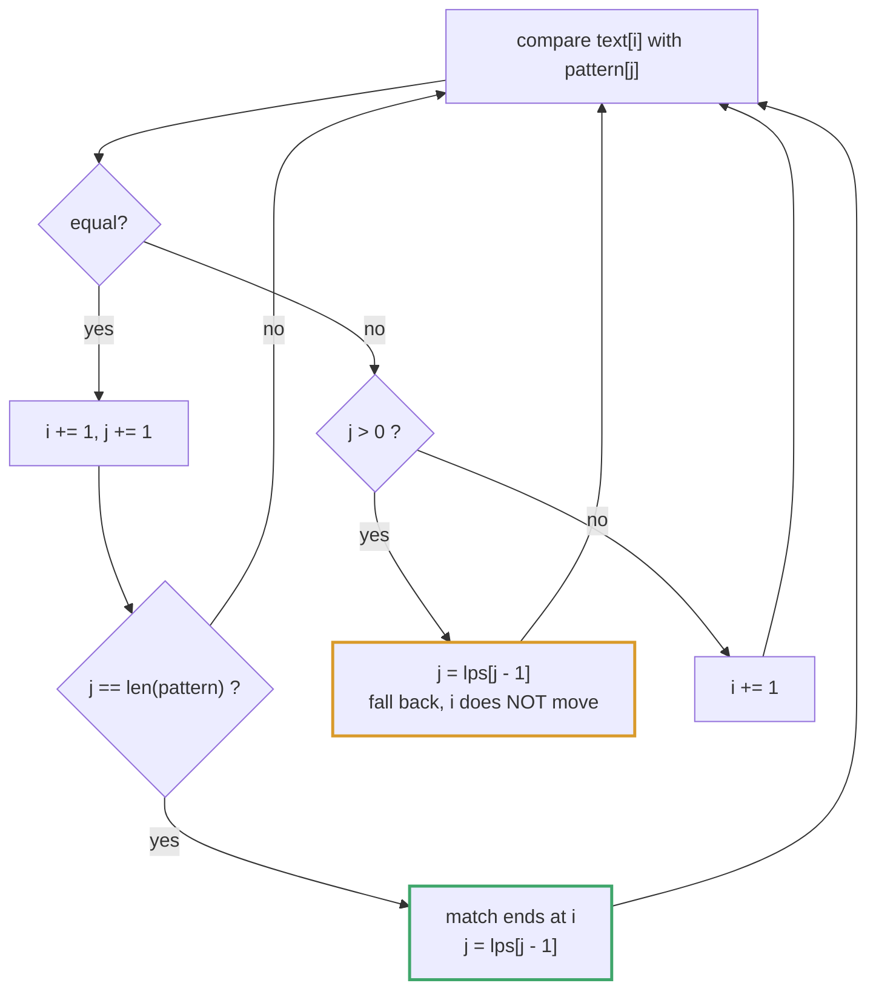
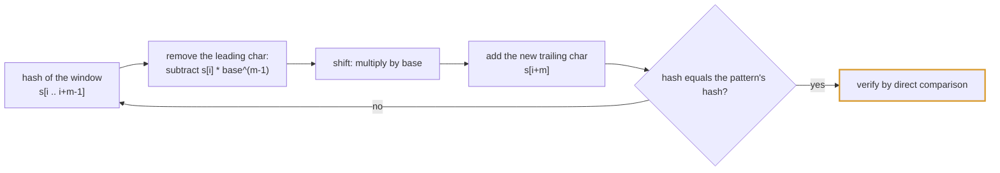
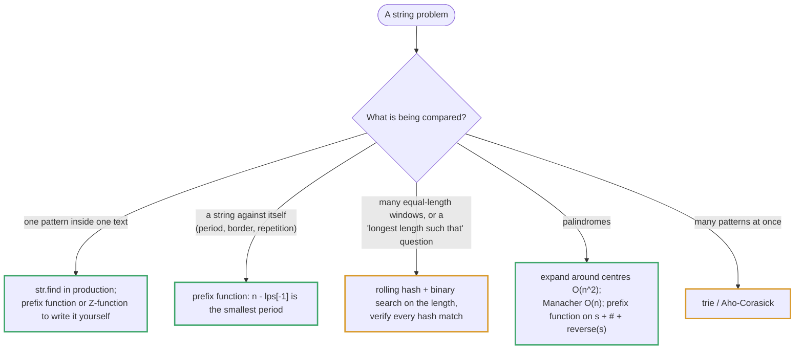

# Topic 23 · String Algorithms — Python Deep Dive

> Every earlier string-adjacent problem (topics 01-03's anagrams and
> windows, topic 02's palindrome checks) treated a string as a container
> you scan once, left to right, with O(1) or O(26) bookkeeping per
> character. This topic is different: it's about strings that need to be
> compared AGAINST THEMSELVES or against OTHER STRINGS at scale — "does
> this pattern occur in this text," "is this string built from repeats,"
> "what's the longest substring that occurs twice," "which of these 5000
> words concatenate into a palindrome." Brute-force comparison is
> quadratic-or-worse for every one of these; the entire throughline of
> this topic is **precompute a structure over the string ONCE (a failure
> function, a rolling hash, a reversed-word index) so that every
> subsequent comparison collapses to O(1) or O(length), instead of
> O(length) or O(length²) per comparison.**

---

## Part 0 · The eight problems and their tricks

**KMP's failure function as a "how much do I already know" cache** (001
Find the Index of the First Occurrence in a String): the naive substring
search re-checks characters it has already seen, throwing away
information on every mismatch. The `lps` ("longest proper prefix that is
also a suffix") array precomputed over the NEEDLE in O(m) lets the search
pointer jump forward on a mismatch instead of restarting — the haystack
pointer never moves backwards, giving O(n+m) total. This is the single
most reused piece of machinery in the whole topic: 002 and 006 both call
the exact same `_build_lps` helper on a DIFFERENT constructed string to
answer a completely different question.




**The failure function encodes more than search jumps — it encodes
PERIODICITY** (002 Repeated Substring Pattern): `lps[-1]` (computed on
`s` itself, as its own "pattern") gives the length of `s`'s longest
prefix-that's-also-a-suffix. The value `len(s) - lps[-1]` is `s`'s
SMALLEST PERIOD. `s` is built from whole-number repeats of a shorter
string exactly when that period evenly divides `len(s)`. Same array,
completely different question than 001 — the reuse here is conceptual,
not just code-level.

**Manual state-machine parsing, phase by phase, never backtracking**
(003 String to Integer atoi): no clever algorithm here — the skill being
tested is writing a careful linear scanner (skip whitespace → read one
optional sign → read digits → clamp) that stops immediately and silently
on any character that doesn't fit the current phase, rather than
searching ahead or raising an error. The "hard part" is edge-case
discipline, not asymptotic complexity.

**A fixed small alphabet turns a rolling hash into a PERFECT hash, no
collisions possible** (004 Repeated DNA Sequences): with only 4 possible
characters and a fixed window length of 10, encoding each nucleotide as
2 bits makes a full window an exact 20-bit integer — a bijection, not a
lossy hash. Sliding the window is O(1) via bit-shift-and-mask instead of
O(10) string re-slicing. This is the SPECIAL CASE of Rabin-Karp where the
key space is small enough to be represented exactly; contrast directly
with 007, where the key space is far too large for that trick and a
probabilistic hash + verification is required instead.

**Bound the search space with arithmetic before searching at all** (005
Repeated String Match): rather than trying an open-ended sequence of
repeat counts, prove that the answer (if it exists) can only ever be one
of exactly two candidate counts (`ceil(len(b)/len(a))` or that value
plus one, to cover a boundary-straddling match), then just test those
two. The "algorithm" is really a length-arithmetic proof that collapses
an apparently unbounded search into two lookups.

**KMP's failure function applied to a CONSTRUCTED string, not a literal
needle/haystack pair** (006 Shortest Palindrome): build `t = s + '#' +
reverse(s)` (the `'#'` separator prevents any cross-boundary spurious
match) and read `lps[-1]` off of `t` — it turns out to be exactly the
length of `s`'s longest palindromic PREFIX. Once you know that length,
the answer is a direct O(n) construction: mirror everything after the
palindromic prefix and prepend it. The deep lesson: KMP's failure
function is a general tool for extracting "how much of this constructed
string overlaps with itself," not a substring-search-specific trick.

**Binary search on the ANSWER LENGTH + Rabin-Karp with mandatory
verification** (007 Longest Duplicate Substring): "does a duplicate of
length L exist" is a MONOTONE predicate over L (topic 05's "search on
the answer space" pattern, applied here to string structure instead of a
numeric answer), so binary search collapses "find the longest length"
into O(log n) yes/no checks. Each check uses a large-modulus rolling
hash — but CRITICALLY, unlike problem 004's perfect hash, a large
arbitrary-alphabet key space always carries real collision risk, so
every hash match MUST be verified with a direct substring comparison
before being trusted. This is the topic's most rigorous demonstration of
"a hash is a fast FILTER, not a proof, unless the key space is provably
small enough to be a bijection."

**Reverse-and-lookup instead of pairwise comparison** (008 Palindrome
Pairs): `words[i] + words[j]` is a palindrome exactly when one piece
(split at some point in one of the two words) is already a palindrome
and the OTHER piece is the exact reverse of some other word in the list.
Precompute a `word -> index` hashmap once, then for every word and every
split point, an O(length) two-pointer palindrome check plus an O(1)
hashmap lookup replaces an O(n²) all-pairs comparison entirely. The
"trie of reversed words" variant (named, not implemented) generalizes
this to the problem's literally-stated linear bound, at real
implementation cost — directly foreshadowed by topic 13's trie material.

---

## Part 1 · The two load-bearing tools, and when each applies

This topic really has TWO core tools, reused across all eight problems
in different combinations:

**1. The KMP failure function (`lps` array).** Built once over some
string in O(n), it answers "for every prefix of this string, what's the
longest proper prefix that's also a suffix?" That single array answers
three DIFFERENT-looking questions depending on what string you build it
over and how you read it:
   - Built over the needle, used to skip re-comparisons during a search
     → substring search (001).
   - Built over `s` itself, read as `len(s) - lps[-1]` → smallest period
     → repetition detection (002).
   - Built over `s + '#' + reverse(s)`, read as `lps[-1]` directly →
     longest palindromic prefix → shortest-palindrome construction (006).

**2. The rolling hash (Rabin-Karp family).** Maintains a running hash of
a sliding window in O(1) per slide instead of O(window length). Two
regimes, and knowing which one you're in matters:
   - **Small, fixed alphabet + fixed window length** → the encoding CAN
     be made a perfect hash (bijective, zero collision risk) — problem
     004's 2-bit-per-nucleotide encoding is the textbook example. No
     verification step needed, ever.
   - **Arbitrary alphabet and/or variable length** → collisions are
     mathematically possible no matter how large the modulus. A large
     prime modulus makes them RARE, but "rare" is not "impossible" — any
     serious solution (problem 007) must verify a hash match against the
     real substrings before trusting it. This is the exact same
     probabilistic-filter-then-verify discipline as a Bloom filter.




Problems 003, 005, and 008 don't use either tool directly — 003 is pure
careful parsing, 005 is length-arithmetic, and 008 is a hashmap-of-exact-
strings (no hashing algorithm needed, since Python dicts already hash
strings exactly) combined with a straightforward two-pointer palindrome
check. They're included in this topic because they're still fundamentally
about STRING STRUCTURE (periodicity, numeric grammar, self-similarity,
reversal), not because they use KMP or Rabin-Karp specifically.

---

## Part 2 · Problem-by-problem map

| # | Problem | Difficulty | Core trick |
|---|---|---|---|
| 001 | Find the Index of the First Occurrence in a String | Easy | KMP failure function, O(n+m) substring search |
| 002 | Repeated Substring Pattern | Easy | `len(s) - lps[-1]` = smallest period |
| 003 | String to Integer (atoi) | Medium | careful 4-phase state-machine parsing |
| 004 | Repeated DNA Sequences | Medium | 2-bit perfect rolling hash over a 4-letter alphabet |
| 005 | Repeated String Match | Medium | bound the answer to 2 candidate repeat counts |
| 006 | Shortest Palindrome | Hard | KMP `lps` on `s + '#' + reverse(s)` |
| 007 | Longest Duplicate Substring | Hard | binary search on length + Rabin-Karp + verification |
| 008 | Palindrome Pairs | Hard | reverse-and-lookup via hashmap, avoids all-pairs O(n²) |

---

## Part 3 · Cross-references worth remembering

- **001 ↔ 002 ↔ 006**: all three build and read a KMP `lps` array; the
  only thing that changes is WHAT string you build it over and how you
  interpret the resulting array. Once `_build_lps` is written once, it's
  a two-line reuse for the other two.
- **004 ↔ 007**: both are Rabin-Karp rolling hashes over a sliding
  window, but sit at opposite ends of the collision-risk spectrum — 004
  has a provably perfect hash (small fixed alphabet, fixed length) and
  needs no verification; 007 has an unbounded key space and MUST verify
  every hash match. Confusing these two regimes (skipping verification
  where it's actually needed, or over-engineering verification where a
  perfect hash makes it redundant) is the most common conceptual error
  in this topic.
- **007 ↔ topic 05 (Binary Search)**: "does a duplicate of length L
  exist" is a monotone predicate over an integer, exactly topic 05's
  "search on the answer space" family (there usually phrased as "minimum
  capacity to ship in D days"-style problems) — applied here to a
  string-structure question instead of a numeric one.
- **007 ↔ topic 03 (Sliding Window)**: the rolling hash's O(1)-per-slide
  update is mechanically identical to every fixed-window problem in
  topic 03 — the "aggregate" being maintained is a polynomial hash
  instead of a running sum or character count.
- **008 ↔ topic 13 (Trie)**: the trie-of-reversed-words variant
  (described, not implemented, in 008's solution) is a direct advanced
  application of topic 13's "index strings by shared prefixes" pattern,
  walked in reverse to turn a suffix-matching question into a
  prefix-matching one.
- **008 ↔ topic 01 (Arrays & Hashing)**: the `word -> index` hashmap
  that replaces an O(n²) all-pairs scan with O(1) lookups is the exact
  same "index the collection by a transformed key" discipline as Group
  Anagrams — there the transform is "sort the characters," here it's
  "reverse a piece of the word."
- **002/006's palindrome and periodicity checks ↔ topic 02 (Two
  Pointers)**: the underlying "is this a palindrome" primitive, when
  checked directly rather than via a failure function, is exactly Valid
  Palindrome's two-pointer scan (used explicitly inside 008's per-split
  checks).

---

## Part 4 · Where this topic ends, and what's genuinely hard about it

Unlike topic 21 (Math & Geometry), where each problem was a
self-contained trick, this topic has real internal structure: two tools
(KMP failure function, rolling hash) get reused and recombined across
five of the eight problems. The genuinely hard part isn't memorizing
either tool in isolation — it's recognizing, given a new string problem,
WHICH tool applies, and inside the rolling-hash tool, whether you're in
the "perfect hash, no verification needed" regime or the "probabilistic
filter, verification mandatory" regime. Getting that classification wrong
either wastes effort (verifying when a perfect hash made it unnecessary)
or — far worse — ships a solution that's silently wrong on some inputs
and passes by luck on others. The collision demo in 007's solution file
exists specifically to make that failure mode concrete and measured,
not hypothetical.

<!-- block:23_py_1_search -->
## Part 5 · The Search Toolkit — Prefix Function, Z-Function, Find-All, Periods and Borders

Parts 0–4 tell you *which* trick each problem uses. This Part is the machinery itself, written out and measured: the two
linear-time "self-overlap" tables (the KMP prefix function and the Z-function), how to list *every* match, and what the
tables say about periods and borders. Every function below was checked against brute force on 3,000 random binary strings.



### 5.1 The prefix function (the `lps` array) and why it is linear

`pi[i]` is the length of the longest **proper** prefix of `s[:i+1]` that is also a suffix of it (a *border*). For `'ababaca'` it
is `[0, 0, 1, 2, 3, 0, 1]`.

```python
def prefix_function(s):
    pi = [0] * len(s)
    k = 0
    for i in range(1, len(s)):
        while k and s[i] != s[k]: k = pi[k - 1]      # fall back; i does NOT move
        if s[i] == s[k]: k += 1
        pi[i] = k
    return pi
```

The running time is O(n) even though there is a `while` inside a `for`: `k` grows by at most 1 per character, and every
fallback strictly decreases it, so the total number of fallbacks can never exceed the total number of increments, `n`. The same
argument bounds the search scan (Problem 001), where `i` never moves backwards.

### 5.2 The Z-function — the same information, read the other way

`z[i]` is the length of the longest common prefix of `s` and `s[i:]` (with `z[0] = n`). For `'aabxaab'` it is
`[7, 1, 0, 0, 3, 1, 0]`.

```python
def z_function(s):
    n = len(s); z = [0] * n; z[0] = n
    l = r = 0                                    # [l, r) = the rightmost prefix-match window found so far
    for i in range(1, n):
        if i < r: z[i] = min(r - i, z[i - l])    # reuse the mirror position inside the window
        while i + z[i] < n and s[z[i]] == s[i + z[i]]: z[i] += 1
        if i + z[i] > r: l, r = i, i + z[i]
    return z
```

Both tables are O(n) and interconvertible; pick whichever reads better. The prefix function answers "how much of my prefix can
I reuse after a mismatch" (search, periods); the Z-function answers "how far does the prefix match *starting here*", which makes
"match at every position" a one-liner.

### 5.3 Finding every match — overlapping ones included

```python
def find_all_kmp(text, pat):                     # every start index, overlapping matches included
    if not pat: return list(range(len(text) + 1))
    pi, k, out = prefix_function(pat), 0, []
    for i, c in enumerate(text):
        while k and c != pat[k]: k = pi[k - 1]
        if c == pat[k]: k += 1
        if k == len(pat):
            out.append(i - k + 1); k = pi[k - 1]   # keep going: reuse the border instead of restarting
    return out

def find_all_z(text, pat):
    z = z_function(pat + '\x00' + text)          # a separator that occurs in neither string
    return [i - len(pat) - 1 for i in range(len(pat) + 1, len(z)) if z[i] >= len(pat)]
```

`find_all_kmp('aaaa', 'aa')` is `[0, 1, 2]` — three overlapping matches — whereas `'aaaa'.count('aa')` is `2`, because
`str.count` counts **non-overlapping** occurrences. Both functions agreed with brute force on all 3,000 random cases. The
separator `'\x00'` matters for the same reason it does in Problem 006: without it a match could straddle the join.

### 5.4 Periods and borders: what the table says about the string itself

- **Borders.** Following `k = pi[k - 1]` from `pi[-1]` lists *every* border, longest first: for `'abaaba'` they are lengths
  `3` and `1` (`'aba'`, `'a'`).
- **Smallest period.** `p = n - pi[-1]`. It is a *period* for any string (`s[i] == s[i + p]`), but Problem 002 asks for
  something stricter — that `s` is made of **whole** repeats — which additionally needs `n % p == 0` and `p != n`:
  `'abcabcabc'` → 3 (a repetition), `'abac'` → 4 = `n` (none), `'aaaa'` → 1, and `'abcab'` has period 3 but `3` does not divide
  `5`, so it is **not** a repetition. Confusing "has a period" with "is a repetition" is the classic slip.
- **Shortest palindrome (Problem 006).** `t = s + '\x00' + s[::-1]`; `pi[-1]` is the length `k` of the longest palindromic
  *prefix* of `s`; the answer is `s[k:][::-1] + s`. It matched brute force on 3,000 random strings (`'aacecaaa'` → `'aaacecaaa'`,
  `'abcd'` → `'dcbabcd'`). **Leave the separator out and it breaks**: with `t = s + s[::-1]` the result was wrong on **203 of 3,000**
  random strings over `{a, b}` — for `'abbab'` it returned `'abbab'` itself, though the true answer is `'babbab'`.

### 5.5 In practice: `str.find` against the algorithms you write

| Case (CPython 3.13, best of a few runs) | Naive | KMP (pure Python) | `str.find` |
|---|--:|--:|--:|
| worst case, `n = 10,000`, `m = 200` (`'a'…` against `'a'…ab`) | 50.5 ms | 0.56 ms | 0.004 ms |
| `n = 10⁶` `'a'`s, `m = 1,000` (`'a'*999 + 'b'`) | — | 73 ms | 0.28 ms |

On an adversarial needle — `'a'*(m/2) + 'b' + 'a'*(m/2 − 1)` against a text of a million `'a'`s, where the last character
matches at every window — `str.find` took 0.9 ms for `m = 100`, 0.8 ms for `m = 1,000`, 0.8 ms for `m = 10,000`, 1.0 ms
for `m = 100,000` and 1.8 ms for `m = 400,000`: essentially flat in `m`. (CPython's search uses a skip-based scan for short needles and, since
3.10, the linear-time Two-Way algorithm for long ones.) So in production code use `find`, `in`, `startswith` and `count`;
write KMP or Z when the *table* is the point — periods, borders, palindromic prefixes — or when an interviewer forbids the
built-in (Problem 001).

### 5.6 Follow-ups the interviewer reaches for

| Follow-up | The answer |
|---|---|
| "Find *all* occurrences, overlapping too." | Keep scanning after a full match with `k = pi[k - 1]`. |
| "Many patterns against one text." | Aho–Corasick: a trie of the patterns plus KMP-style failure links, O(text + total pattern length + matches). |
| "The same needle against millions of texts." | Build `pi` once and reuse it. |
| "Is `t` a rotation of `s`?" | `len(s) == len(t) and t in s + s`. |
| "Smallest string to append/prepend to make a palindrome?" | The prefix function on `s + sep + reverse(s)` — Problem 006. |
| "Count the distinct substrings / longest repeated substring." | Suffix array + LCP (the palindromes-and-suffixes Part below). |

---
<!-- /block:23_py_1_search -->

<!-- block:23_py_2_hashing -->
## Part 6 · Rolling Hashes Done Right — Collision Math, Randomised Bases, and the Thue–Morse Attack

Part 1 says a hash match is a *candidate*, never a proof, unless the key space is a bijection. This Part turns that into numbers you
can quote: how likely a collision is, which modulus to pick, and one input family that defeats a popular choice regardless of base.

### 6.1 Prefix hashes: any substring's hash in O(1)

```python
import random
M = (1 << 61) - 1                       # a Mersenne prime: collisions are astronomically rare for our sizes
B = random.randrange(256, M)            # a random base drawn at run time — nothing to reverse-engineer

def build(s):
    n = len(s); H = [0] * (n + 1); P = [1] * (n + 1)
    for i, c in enumerate(s):
        H[i + 1] = (H[i] * B + ord(c)) % M      # H[i] = hash of s[:i]
        P[i + 1] = P[i] * B % M                 # P[i] = B**i
    return H, P

def sub_hash(H, P, l, r):               # hash of s[l:r]
    return (H[r] - H[l] * P[r - l]) % M      # Python's % is non-negative: no "+ M" fix-up needed
```

Two substrings of equal length with different hashes are **definitely different**; equal hashes mean "probably equal". The
update rule "subtract the leading digit, shift, add the trailing one" is the fixed-window slide from topic 03 with a polynomial
instead of a sum.

### 6.2 How likely is a collision? Measured

By the birthday bound, `n` distinct strings hashed into `m` buckets collide about `n² / 2m` times. Hashing **100,000 distinct random
10-letter strings** and counting pairs with equal hashes but different text:

| Modulus | Collisions observed | Expected `n²/2m` |
|---|--:|--:|
| `10⁹ + 7` | **3** | 5.0 |
| `2⁶¹ − 1` | **0** | ~ 2·10⁻⁹ |

So a single 30-bit modulus *will* collide on inputs of the size Problem 007 uses (tens of thousands of windows) — which is why the
solution verifies — while a 61-bit modulus effectively never does. **Verification turns a Monte-Carlo test into a Las-Vegas one:**
the answer is always correct, and only the running time is random.

### 6.3 The modulus `2⁶⁴` is not safe, whatever the base

Fixed-width languages get "free" reduction modulo `2⁶⁴` from unsigned overflow, and it is tempting. It is also breakable: the
**Thue–Morse** strings — `0`, `01`, `0110`, `01101001`, … each built by appending the bitwise complement of the previous — and their
complements have the *same* polynomial hash modulo `2⁶⁴` for **every odd base**. Why: the difference of the two hashes is
`±∏ (B^(2ⁱ) − 1)` over `i < k`, and for odd `B` each factor is divisible by `2^(i+2)` (`2` for `i = 0`), so by `k = 10` — length 1,024 — the
product is divisible by `2⁶⁴`. Measured (emulating `mod 2⁶⁴` explicitly):

| Base | First Thue–Morse collision |
|---|---|
| 131 | length 1,024 (`k = 10`) |
| 911,382,323 | length 1,024 |
| 1,000,003 | length 1,024 |
| a random 62-bit odd number | length 512 (`k = 9`) |

The same 2,048-character pair does **not** collide modulo `10⁹ + 7` or `2⁶¹ − 1`. This is why Problem 007's notes warn against
power-of-two moduli: they depend only on the low bits of the polynomial, and a structured input can make those cancel exactly.
Use a large prime (ideally `2⁶¹ − 1`), draw the base at random, and verify.

### 6.4 Longest Duplicate Substring, complete

```python
def longest_dup(s):
    n = len(s); a = [ord(c) - 97 for c in s]
    M = (1 << 61) - 1; B = random.randrange(256, M)
    def dup(L):                                   # start index of a duplicate of length L, or -1
        h = 0
        for i in range(L): h = (h * B + a[i]) % M
        top = pow(B, L, M); seen = {h: [0]}
        for i in range(1, n - L + 1):
            h = (h * B - a[i - 1] * top + a[i + L - 1]) % M      # slide: drop a[i-1], add a[i+L-1]
            if h in seen:
                for j in seen[h]:
                    if s[j:j + L] == s[i:i + L]: return i         # VERIFY — a hash match is only a candidate
                seen[h].append(i)
            else: seen[h] = [i]
        return -1
    lo, hi, best = 1, n - 1, ''
    while lo <= hi:                               # binary search on the LENGTH: "a duplicate of length L exists" is monotone
        mid = (lo + hi) // 2
        i = dup(mid)
        if i != -1: best = s[i:i + mid]; lo = mid + 1
        else: hi = mid - 1
    return best
# longest_dup('banana') = 'ana'   longest_dup('abcd') = ''      (1,500 random strings checked against brute force)
```

Why the binary search is valid: if a duplicate of length `L` exists, so does one of every shorter length (drop the last character
of both copies). Overlapping copies are allowed — `'aa'` inside `'aaa'` counts. Cost: O(log n) rounds of O(n) expected work.

### 6.5 Problem 004: when the alphabet is tiny the "hash" is exact

```python
def repeated_dna(s, L=10):
    enc = {'A': 0, 'C': 1, 'G': 2, 'T': 3}; mask = (1 << (2 * L)) - 1
    seen, rep, h = set(), set(), 0
    for i, c in enumerate(s):
        h = ((h << 2) | enc[c]) & mask               # shift in 2 bits, mask off the character that left the window
        if i >= L - 1:
            if h in seen: rep.add(s[i - L + 1:i + 1])
            seen.add(h)
    return sorted(rep)
```

Four letters need 2 bits, so a 10-mer is a 20-bit integer — a bijection, no modulus, no verification needed. It matched
`collections.Counter` over all windows on 500 random strings, and on the LeetCode example returns
`['AAAAACCCCC', 'CCCCCAAAAA']`. Forgetting the mask lets the old characters' bits pile up and two equal windows stop matching.

---
<!-- /block:23_py_2_hashing -->

<!-- block:23_py_3_palindromes -->
## Part 7 · Palindromes and Suffix Structures — Manacher, Suffix Array with LCP, Palindrome Pairs

Problems 006 and 008 are about palindromes; the topic's opening question — "what is the longest substring that occurs twice" — is
the doorway to suffix structures. All code here was checked against brute force on thousands of random strings.

### 7.1 The palindrome toolbox

| Tool | Time | Use it for |
|---|---|---|
| Expand around each of the `2n − 1` centres | O(n²), O(1) space | the interview default for "longest palindromic substring" |
| **Manacher's algorithm** | **O(n)** | the linear-time follow-up |
| Prefix function on `s + sep + reverse(s)` | O(n) | the longest palindromic **prefix** (Problem 006) |
| Hash of `s[l:r]` against the hash of its reverse | O(1) per query after O(n) setup | many palindrome queries; binary search on a radius |
| Word → index map + split points | O(n · L²) | Palindrome Pairs (Problem 008) |

### 7.2 Manacher's algorithm

Interleave separators so odd and even palindromes become the same case, then reuse each centre's *mirror* radius inside the
rightmost palindrome found so far instead of expanding from scratch:

```python
def manacher(s):
    """Return (start, length) of the longest palindromic substring, in O(n)."""
    if not s: return 0, 0
    t = '^#' + '#'.join(s) + '#$'                # sentinels stop the expansion loop without bounds checks
    p = [0] * len(t)                             # p[i] = radius of the palindrome centred at t[i]
    c = r = 0                                    # centre and right edge of the rightmost palindrome so far
    for i in range(1, len(t) - 1):
        if i < r: p[i] = min(r - i, p[2 * c - i])           # the mirror of i about c, capped by the edge
        while t[i + 1 + p[i]] == t[i - 1 - p[i]]: p[i] += 1  # grow past what the mirror guarantees
        if i + p[i] > r: c, r = i, i + p[i]
    length, centre = max((v, i) for i, v in enumerate(p))
    return (centre - length) // 2, length
# manacher('babad') = (1, 3) → 'aba'      manacher('cbbd') = (1, 2) → 'bb'      manacher('a') = (0, 1)
```

The pointer `r` only moves right, and the `while` loop only runs when `i + p[i]` is about to push `r` further, so the total work is
O(n) — the same amortisation as the prefix function. Its answers had the same *length* as brute force on 3,000 random strings (and
the returned slice was a palindrome every time).

### 7.3 Palindrome Pairs (Problem 008), split by split

`words[i] + words[j]` is a palindrome exactly when, splitting one word as `left | right`, either (`left` is a palindrome and the
other word is `reverse(right)`, placed *before*) or (`right` is a palindrome and the other word is `reverse(left)`, placed *after*).

```python
def palindrome_pairs(words):
    idx = {w: i for i, w in enumerate(words)}
    is_pal = lambda x: x == x[::-1]
    out = []
    for i, w in enumerate(words):
        for j in range(len(w) + 1):
            left, right = w[:j], w[j:]
            if is_pal(left):                     # reverse(right) goes BEFORE w
                k = idx.get(right[::-1])
                if k is not None and k != i: out.append((k, i))
            if j != len(w) and is_pal(right):    # j != len(w): the empty-right split was already handled above
                k = idx.get(left[::-1])
                if k is not None and k != i: out.append((i, k))
    return sorted(set(out))
# palindrome_pairs(['abcd','dcba','lls','s','sssll']) = [(0, 1), (1, 0), (2, 4), (3, 2)]     ['a', ''] → [(0, 1), (1, 0)]
```

Matched brute force on 2,000 random word lists (including the empty string). The two guards are the documented traps: `k != i`
(a palindromic word must not pair with itself) and `j != len(w)` — drop it and the example returns
`[(1,0), (0,1), (0,1), (1,0), (3,2), (2,4)]`, with every full-reverse pair **duplicated**. Per word this is O(L²) (L splits, each
a palindrome check and a slice), so O(n · L²) overall — the "trie of reversed words" version reaches the problem's stated
bound at real implementation cost.

### 7.4 Suffix array + LCP: repeated substrings without hashing

A **suffix array** lists the start indices of all suffixes in sorted order; the **LCP array** stores the longest common prefix of
each adjacent pair. The longest substring occurring at least twice is the maximum LCP value — no hash, so no collisions:

```python
def suffix_array(s):
    return sorted(range(len(s)), key=lambda i: s[i:])        # simple, O(n² log n) worst case (repetitive input)

def kasai(s, sa):                                # LCP in O(n): lcp[i] = LCP(suffix sa[i-1], suffix sa[i])
    n = len(s); rank = [0] * n
    for i, p in enumerate(sa): rank[p] = i
    lcp, h = [0] * n, 0
    for i in range(n):
        if rank[i]:
            j = sa[rank[i] - 1]
            while i + h < n and j + h < n and s[i + h] == s[j + h]: h += 1
            lcp[rank[i]] = h
            if h: h -= 1                          # moving to the next suffix shortens the LCP by at most 1
        else: h = 0
    return lcp

def longest_repeated(s):
    if not s: return ''
    sa = suffix_array(s); lcp = kasai(s, sa)
    i = max(range(len(s)), key=lambda i: lcp[i])
    return s[sa[i]:sa[i] + lcp[i]]
# for 'banana': suffix_array = [5, 3, 1, 0, 4, 2]   lcp = [0, 1, 3, 0, 0, 2]   longest_repeated = 'ana'   ('abcd' → '')
```

It agreed with brute force on 2,000 random strings. Building the array by sorting slices is easy to write and hits O(n²) memory
(each `s[i:]` is a copy) — fine for `n` in the thousands. Prefix doubling gives O(n log² n) and SA-IS gives O(n); a suffix array
also answers "how many distinct substrings" (`n(n+1)/2 − Σ lcp`) and pattern search by binary search over the array.

| Structure | Build | Answers |
|---|---|---|
| Trie | O(total length) | prefix queries, many-word lookups (topic 13) |
| Aho–Corasick | O(total pattern length) | all occurrences of many patterns in one pass |
| Suffix array + LCP | O(n log n) – O(n) | longest repeated substring, distinct substrings, LCP of any two suffixes |
| Suffix automaton | O(n) | distinct-substring counts, occurrence counts, shortest non-occurring string |

---
<!-- /block:23_py_3_palindromes -->

<!-- block:23_py_4_pyspecifics -->
## Part 8 · Python String Facts That Decide the Answer

The string algorithms above sit on top of Python's own string model. These are the behaviours interviewers probe, each run on
CPython 3.13.

### 8.1 Immutable strings and the cost of building one

`s[i:j]` and `s + t` allocate and copy. Building a string by repeated `+=` is quadratic *in principle*; CPython often hides it.
Measured for a million single characters: `s += 'x'` in a loop took **24 ms**, `''.join(list)` **10 ms**, `io.StringIO` **15 ms**. But the fast
path relies on the string having a single reference: with a second reference alive (`keep.append(s)` before each append) building
just **10⁵** characters took **540 ms** against **0.2 ms** for `join` — the quadratic cost, exposed. That optimisation is a
CPython implementation detail; write `''.join(parts)`.

Other copy costs: `s[i:]` inside a loop is O(n²) overall; use `s.startswith(prefix, i)` / `s.find(sub, start)` to avoid the slice;
and `s[::-1]` is a new O(n) string.

### 8.2 Digits are wider than `0`–`9` (Problem 003)

| Expression | Result |
|---|---|
| `int(' 42 ')` | `42` — surrounding whitespace is accepted |
| `int('1_0')` | `10` — underscores are accepted |
| `int('٣')` (Arabic-indic three) | `3` — non-ASCII decimal digits are accepted |
| `'²'.isdigit()` / `'²'.isdecimal()` | `True` / `False` |
| `int('²')` | `ValueError: invalid literal for int() with base 10: '²'` |
| `ord('٣') - 48` | `1587` — not the digit's value |

So `str.isdigit()` is the wrong test for "is this an ASCII digit" (it accepts `'²'`), and `int()` accepts input a hand-written
`atoi` must *reject*. Test `'0' <= c <= '9'`, accumulate `10 * n + (ord(c) - 48)`, and clamp the **signed** result to
`[-2³¹, 2³¹ − 1]`. In a fixed-width language the clamp must happen *before* the multiply overflows; Python's integers do not overflow.

### 8.3 Code points are not characters

`len` counts code points. `'é'` is 1 (precomposed) or 2 (`'e'` + a combining accent) — and the two forms are **not** `==`
until normalised (`unicodedata.normalize('NFC', …)`). `len('🇮🇳')` is 2 (two regional-indicator code points), `len('👨‍👩‍👧')` is 5,
`'ß'.upper()` is `'SS'` (length 2), and `len('İ'.lower())` is 2. Reversing `'éx'` gives `'x́e'` — the accent now sits on the
wrong letter. For case-insensitive comparison use `casefold()`, not `lower()`. Interview problems almost always promise lowercase ASCII;
say that assumption aloud, and note what changes if it does not hold (grapheme clusters need a library, not slicing).

### 8.4 Small API traps

- `str.count` counts **non-overlapping** matches: `'aaaa'.count('aa')` is `2`, not `3`.
- `lstrip`/`rstrip`/`strip` take a **set of characters**, not a prefix: `'oops'.lstrip('op')` is `'s'`; use
  `removeprefix` / `removesuffix` (3.9+) — `'oops'.removeprefix('oo')` is `'ps'`.
- `re` backtracks: `re.match(r'(a+)+$', 'a'*n + 'b')` took 22 ms, 89 ms, 358 ms and 1,435 ms for `n = 20, 22, 24, 26` — every two
  extra characters multiply the time by about 4. Do not use a nested quantifier on untrusted input.
- Strings compare and sort by code point: `sorted(['b', 'A', 'a', 'B'])` is `['A', 'B', 'a', 'b']`.

---
<!-- /block:23_py_4_pyspecifics -->

<!-- problem-map:start -->
## Part 9 · Every Problem in This Topic, by Pattern

Eight problems, five moves (the prefix function reused three ways · exact keys when the alphabet is tiny · arithmetic that bounds a search · binary search on the length with a verified hash · reverse-and-lookup instead of all pairs). Each **Trap** is a mistake documented in that problem's solution file.

| Problem | Move | The idea — and the trap it sets |
|---|---|---|
| [001 · Find the Index of the First Occurrence in a String](PyDSA/23_string_algorithms/001_find_the_index_of_the_first_occurrence_in_a_string_solution.py) <br>LC 28 · Easy | KMP substring search | Build `lps` over the needle; scan the haystack with `i` that never moves back, falling back with `j = lps[j-1]`. Match start is `i - j`. **Trap:** moving `i` backwards; advancing `i` in the fallback branch; returning `i` instead of `i - j`; an empty needle with no guard. |
| [002 · Repeated Substring Pattern](PyDSA/23_string_algorithms/002_repeated_substring_pattern_solution.py) <br>LC 459 · Easy | Period from the prefix function | `p = len(s) - lps[-1]`; a repetition iff `p != len(s)` and `len(s) % p == 0`. **Trap:** dropping the `lps[-1] != 0` guard (every string then "repeats"); treating `lps[-1]` itself as the period; in the `(s+s)[1:-1]` trick, trimming only one end. |
| [003 · String to Integer (atoi)](PyDSA/23_string_algorithms/003_string_to_integer_atoi_solution.py) <br>LC 8 · Medium | A four-phase parser | Skip spaces → one optional sign → digits → clamp the *signed* result. **Trap:** skipping whitespace after the sign; a second sign or a sign after digits; treating `.` as part of the number; multiplying by 10 before the overflow check in a fixed-width language; `isdigit()` accepting `'²'`. |
| [004 · Repeated DNA Sequences](PyDSA/23_string_algorithms/004_repeated_dna_sequences_solution.py) <br>LC 187 · Medium | An exact 2-bit code | `h = ((h << 2) \| code) & mask` gives a 20-bit integer for a 10-mer: a perfect hash. Report a window the *second* time it is seen. **Trap:** no mask (old bits corrupt later windows); reporting on the first sighting; reaching for a modular hash that can only add false positives. |
| [005 · Repeated String Match](PyDSA/23_string_algorithms/005_repeated_string_match_solution.py) <br>LC 686 · Medium | Two candidate repeat counts | `q = ceil(len(b)/len(a))`; test `a*q` and `a*(q+1)` (the second covers a match straddling the boundary). **Trap:** testing only `q`; floor instead of ceiling; looping over ever more repeats. |
| [006 · Shortest Palindrome](PyDSA/23_string_algorithms/006_shortest_palindrome_solution.py) <br>LC 214 · Hard | Prefix function on `s + sep + reverse(s)` | `lps[-1]` is the longest palindromic *prefix*; the answer is `reverse(s[L:]) + s`. **Trap:** no separator (wrong on 203 of 3,000 random strings — measured); a separator that occurs in `s`; a palindromic *substring* instead of a *prefix*; mirroring `s[:L]` instead of `s[L:]`. |
| [007 · Longest Duplicate Substring](PyDSA/23_string_algorithms/007_longest_duplicate_substring_solution.py) <br>LC 1044 · Hard | Binary search on length + verified hash | "A duplicate of length `L` exists" is monotone in `L`; slide a hash over each window and compare real substrings before trusting a match. **Trap:** trusting the hash alone; a power-of-two or 32-bit modulus; recomputing each window's hash from scratch; binary searching on the string; forbidding overlapping copies. |
| [008 · Palindrome Pairs](PyDSA/23_string_algorithms/008_palindrome_pairs_solution.py) <br>LC 336 · Hard | Reverse-and-lookup at every split | For each word and split `left \| right`: `left` palindromic → look up `reverse(right)`; `right` palindromic → look up `reverse(left)`. **Trap:** no `k != i` guard; not excluding `j == len(w)` in the second case (duplicate pairs); testing only whole-word reverses; the O(n²·L) all-pairs scan. |

---
<!-- problem-map:end -->


## Checklist Before Leaving This Topic <!--ca-->

- [ ] Write the prefix function and the Z-function, and say why each is O(n) despite the nested loop <!--ca-->
- [ ] List every (overlapping) match with KMP, and say why `str.count` returns fewer <!--ca-->
- [ ] Distinguish "has period `p`" from "is a repetition" (`n % p == 0` and `p != n`) <!--ca-->
- [ ] Quote the collision math: `n²/2m`, 3 observed collisions for 10⁵ strings mod `10⁹+7`, none mod `2⁶¹−1` <!--ca-->
- [ ] Explain why a `mod 2⁶⁴` polynomial hash is breakable (Thue–Morse) and why the base must be random <!--ca-->
- [ ] Write Manacher's algorithm, and Kasai's LCP for the longest repeated substring <!--ca-->
- [ ] Write Palindrome Pairs with both guards (`k != i`, `j != len(w)`) and say what each prevents <!--ca-->
- [ ] Reject `isdigit()`, `int()` and non-ASCII digits in a hand-written `atoi`, and name the Unicode traps (`len`, normalisation, `casefold`) <!--ca-->
