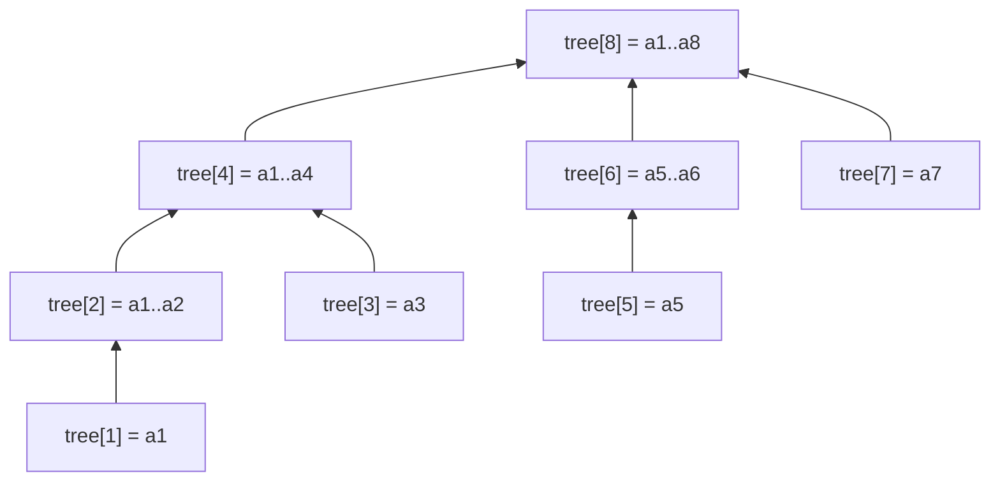
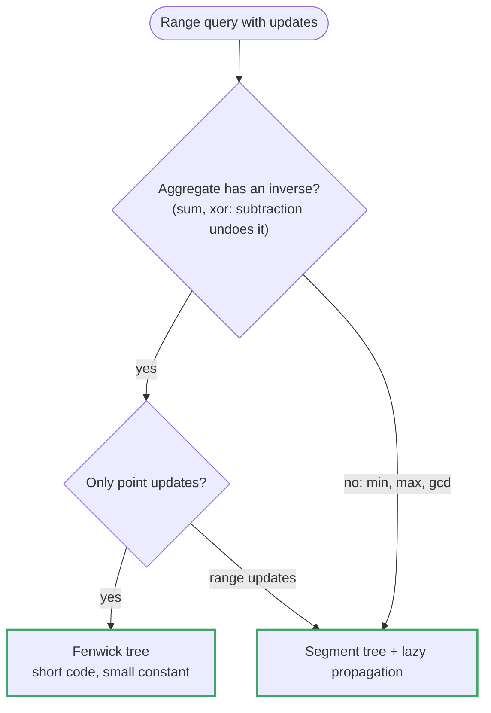
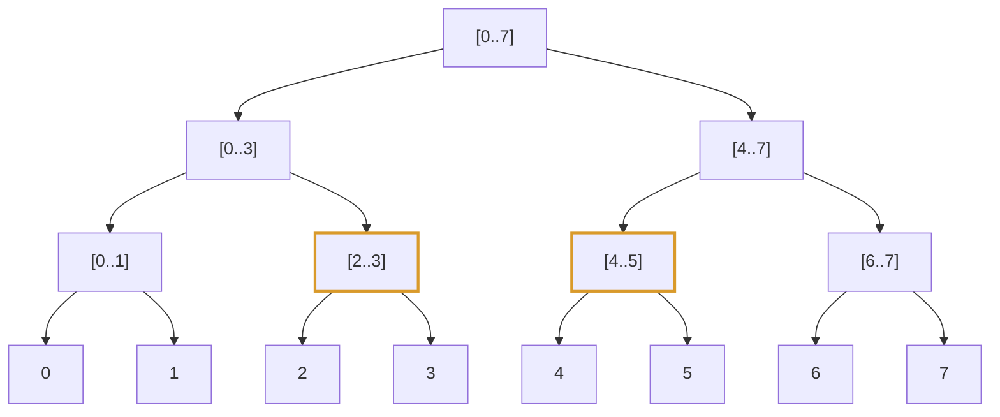
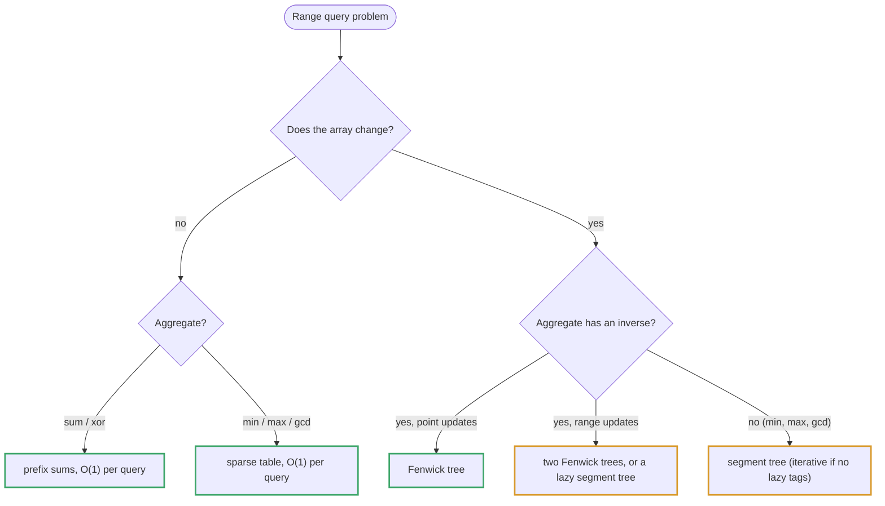

# Topic 26 · Segment Tree & Fenwick (Binary Indexed Tree) — Python Deep Dive

> Every problem so far that needed a "sum/min/max of a range" answer either
> had a STATIC array (topic 04's prefix sum — precompute once, query forever,
> O(1) per query) or didn't need a range at all. This topic is what happens
> when the array **changes** between queries. A single `update(i, val)`
> invalidates every prefix sum that covers index `i`, so recomputing a naive
> prefix-sum array after every update costs O(n) per update — no better than
> just re-summing the range directly. The entire topic is the answer to one
> question: **how do you support both `update` and `range query` in
> O(log n), instead of O(1)-one-O(n)-the-other?** Two structures answer it —
> the Binary Indexed Tree (Fenwick tree) and the segment tree — and a third
> technique, divide-and-conquer counting via merge sort, answers a narrower
> but very common sub-question ("how many pairs/subarrays satisfy an
> order/sum condition") without building either structure at all.

---

## Part 0 · The six problems and their tricks

**Point update, range sum, 1D — the canonical Fenwick tree** (001 Range Sum
Query - Mutable): the textbook motivating problem. `update(i, val)` changes
one element; `sumRange(l, r)` must answer in better than O(n). A Fenwick
tree (BIT) stores, at each 1-indexed slot `i`, the sum of a specific range
of the original array determined by `i`'s lowest set bit — `i & (-i)`. That
one arithmetic trick (`i & -i` isolates the lowest set bit, giving the
"jump size") is what makes both `update` (walk UP: `i += i & -i`) and
`prefix_query` (walk DOWN: `i -= i & -i`) run in O(log n) — each walk visits
at most `log2(n)` ancestors. `sumRange(l, r) = prefix(r) - prefix(l-1)`, the
exact same inclusion-exclusion idea as topic 04's prefix sum, just backed by
a structure that keeps the prefix answer current in O(log n) per mutation
instead of O(n).




**Point update, range sum, 2D — Fenwick of Fenwicks** (002 Range Sum Query
2D - Mutable): the natural generalization. A 2D BIT is literally a BIT
where every "node" is itself a 1D BIT over the other dimension — `update`
walks UP in both row and column simultaneously (nested `i & -i` /
`j & -j` loops), `region query` uses 2D inclusion-exclusion on four corner
prefix sums (`+D +A -B -C`, the same rectangle trick as topic 04's 2D
prefix sum). O(log n · log m) per operation instead of O(n·m) per query or
O(1) update / O(n·m) rebuild.

**Counting inversions under a transformed comparison — merge sort's free
byproduct** (003 Reverse Pairs): count pairs `i < j` where
`nums[i] > 2 * nums[j]`. This is NOT a running-sum problem — it needs to
count pairs across the WHOLE array satisfying a cross-index inequality, and
merge sort already produces exactly the machinery to do this for free: when
merging two SORTED halves, for every element in the left half you can count
in O(1) amortized how many elements in the right half satisfy
`left[i] > 2*right[j]`, because both halves are sorted and a two-pointer
scan through them never backtracks. Total O(n log n), and merge sort's
recursion does the sorting AND the cross-counting in the same pass. A BIT
with coordinate compression solves this too (compress values to ranks,
insert from the back, query how many smaller/valid elements are already
inserted) — genuinely equivalent asymptotically, but the merge-sort version
needs no separate compression step and is the cleaner one to trace by hand.

**The same merge-sort-counting idea, generalized to a RANGE condition, not
just an inequality** (004 Count of Range Sum): count subarrays whose sum
falls in `[lower, upper]`. First reduce "subarray sum" to "difference of
two prefix sums" (topic 04's core identity: `sum(i..j) = prefix[j+1] -
prefix[i]`), turning the problem into "count pairs of prefix-sum indices
`i < j` with `lower <= prefix[j] - prefix[i] <= upper`" — structurally
identical to 003's cross-pair counting, except now each left element counts
a CONTIGUOUS WINDOW of the right half (two two-pointers, one for the lower
bound and one for the upper bound, both monotonic) instead of a single
threshold. Same merge-sort skeleton as 003, generalized from one moving
pointer to two.

**Coordinate compression + a range-update/range-query structure — the
"stack of intervals" problem in disguise** (005 Falling Squares): each
falling square lands on top of the MAX height already present under its
horizontal span, then raises that whole span to `landing_height + side`.
This is a range-max-query + range-assignment (or range-max-update) problem
over a coordinate axis that's sparse (positions can be up to 10^8, but only
`2n` distinct x-coordinates actually matter across `n` squares) — so the
mandatory first step is COORDINATE COMPRESSION: map the up-to-`2n` distinct
left/right edges to `0..2n-1` dense indices, THEN build a segment tree with
lazy propagation over that compressed axis supporting range-max-query and
range-assign. The alternative taught here (cleaner for n up to ~2000, which
LeetCode's constraint allows): skip the tree entirely and do an O(n^2)
sorted-interval sweep — for each new square, scan all PREVIOUS squares
whose x-range overlaps it, take the max of their heights, that's brute
force but simple; the segment-tree version is the one that scales past
n=2000 and is what's taught as primary here since interviewers usually want
to see the general technique.

**Coordinate compression + range-max, read as a sweep-line over critical
x-coordinates — not a stack of intervals** (006 The Skyline Problem): the
output silhouette only changes AT a building's left or right edge, so
collect every such x-coordinate, sort them, and at each one ask "what's the
tallest building alive right now?" A multiset/heap of "currently active
building heights, lazily removing expired ones" answers that sweep in
O(n log n) directly (the approach taught here, since it reads cleanly as an
event-sweep — the same event-processing shape as topic 06's monotonic-stack
problems and topic 19's interval-merging). A coordinate-compressed
segment-tree-with-lazy-max, updating `[left, right)` to `height` per
building and querying the tree's boundary points, is the alternative
mentioned — genuinely equivalent, heavier machinery, worth naming because
it's the same tool as 005.

---

## Part 1 · Fenwick tree (BIT) vs segment tree — the real tradeoff

Both answer "range query + point/range update in O(log n)." They are not
interchangeable in general, and knowing WHEN each wins is the graded skill:




| | Fenwick tree (BIT) | Segment tree |
|---|---|---|
| What it answers | Prefix-invertible aggregates only: sum, XOR — anything with a working inverse (`prefix(r) - prefix(l-1)`) | ANY associative aggregate: sum, min, max, gcd, "count in range" — no inverse needed |
| Range MIN/MAX | Cannot do it directly (no inverse: `min` has no "subtract") — needs a sparse table or segment tree instead | Native |
| Code size | ~10 lines, one array, two tiny loops (`i & -i`) | ~40-60 lines: build/update/query, optionally lazy propagation |
| Range update + range query | Needs a second BIT trick (difference-array BIT) to support both | Native with lazy propagation |
| Space | O(n), one array | O(4n) typical (recursive tree stored in an array) |
| Constant factor | Smaller — pure array + bit tricks, no recursion | Larger — recursion or an explicit tree array |
| When to reach for it | Range-SUM problems specifically (001, 002 here; also the BIT-based alternative for 003/004) | Range MIN/MAX/anything-non-invertible (005, 006 here) |

**The one-line decision rule:** if the aggregate has an inverse (sum does,
XOR does; min/max/gcd do NOT), a Fenwick tree is strictly simpler and
should be the default. If it doesn't (min/max, as in 005/006's "tallest
building/tower so far"), you need a segment tree (or, for 005/006
specifically, a cleverer sweep that avoids needing range-min/max at all).

---

## Part 2 · Coordinate compression — the technique that makes sparse-range problems tractable

001/002 have SMALL, DENSE index ranges (`nums` has n real elements — you
build the BIT directly over `0..n-1`). 005/006 have positions up to `10^8`
but only `O(n)` of them are ever actually queried or landed on — building a
segment tree over `10^8` raw positions would be both wasteful and (for a
recursive array-backed tree) memory-prohibitive.

**Coordinate compression**: collect every x-coordinate that will ever be
touched (all left/right edges across all intervals), sort and dedupe them,
and map each to its RANK (`0, 1, 2, ...`) in that sorted list via a
dict/`bisect`. Build the segment tree over ranks (size `O(n)`, not
`O(max_coordinate)`) instead of over raw values. Every operation on a real
coordinate first passes through this rank lookup. This is the same
"replace an astronomically large or continuous domain with the O(n) values
that actually matter" idea used implicitly in interval-merging (topic 19)
and explicitly whenever a BIT/segment-tree problem's value range vastly
exceeds the number of elements actually being processed — **always
coordinate-compress before building a BIT/segment tree over a value range
you did not choose (as opposed to an index range `0..n-1`, which is already
dense and needs no compression).**

---

## Part 3 · Divide-and-conquer counting via merge sort — the "free" BIT alternative for a specific problem shape

003 and 004 both reduce to "count index pairs `i < j` satisfying a
condition comparing `a[i]` and `a[j]`." Two genuinely different tools solve
this shape:

1. **BIT + coordinate compression**: sort/rank all relevant values,
   iterate the array (usually right-to-left or left-to-right depending on
   what's being counted), and for each element query "how many previously
   inserted values are `<`/`>`/in-range" via a BIT prefix query, then
   insert the current element. O(n log n).
2. **Modified merge sort**: during the merge step of ordinary merge sort,
   BOTH halves are already sorted, so a two-pointer scan across them counts
   cross-pairs satisfying a monotone condition in O(n) per merge level,
   O(n log n) total, with NO separate data structure and NO coordinate
   compression step — sortedness alone is what a BIT would have needed
   compression + insertion to simulate.

They are asymptotically identical. The merge-sort version is taught as
PRIMARY for 003/004 in this topic because it is easier to trace by hand (no
`i & -i` arithmetic to track alongside the counting logic) and because it
connects directly to **topic 14/15's divide-and-conquer framing** (split,
recurse, combine) rather than introducing a new data structure mid-problem.
The BIT version is documented as the alternative in each solution file
because it generalizes better once a problem ALSO needs live point updates
interleaved with the counting (which 003/004 do not — the array is static
once given).

---

## Part 4 · Cross-references

- **Topic 04 (Prefix Sum)**: `sumRange(l, r) = prefix(r) - prefix(l-1)` is
  the exact identity a Fenwick tree accelerates. Topic 04's arrays are
  static (build once, O(1) query forever); this topic's arrays mutate,
  which is the ONLY reason a smarter structure is needed at all. 002's 2D
  region-sum inclusion-exclusion (`+D +A -B -C`) is identical to topic 04's
  2D static prefix sum, just recomputed incrementally per update instead of
  once.
- **Topic 06 (Stack & Monotonic Stack)**: 006's sweep-line "what's the
  tallest active building right now" alternative reads like a
  monotonic-stack-adjacent event sweep — both process a sorted sequence of
  events and maintain a running "best so far" structure that only changes
  at event boundaries.
- **Topic 14/15 (Graphs, Advanced Graphs / Divide & Conquer)**: the
  merge-sort-counting technique in 003/004 IS the same recursive
  split-recurse-combine shape as topic 15's divide-and-conquer content
  (and topic 27's "Different Ways to Add Parentheses") — recursion that
  does real combining work at the merge step, not just at the base case.
- **Topic 19 (Intervals, upcoming/adjacent)**: 005/006 are fundamentally
  interval problems (landing spans, building spans) wearing a
  data-structure costume — coordinate compression is the same "only the
  O(n) endpoints matter" idea interval-merging relies on.

---

## Part 4a · Segment Tree From Scratch, With Lazy Propagation (Full Code)

005/006 above name lazy propagation as the general tool but lean on
coordinate-compression + sweep alternatives for the actual solution files.
Here is the machinery itself, in full, because "I know the concept" and "I
can write it correctly in fifteen minutes" are different skills and only the
second one survives an interview.




**The two arrays.** `tree[node]` holds node's aggregate (sum, here) **as if
every pending update on it were already applied**. `lazy[node]` holds an
amount still owed to node's **children only** — node's own `tree[node]` is
never stale.

```python
class SegTreeLazy:
    def __init__(self, nums):
        self.n = len(nums)
        self.tree = [0] * (4 * self.n)
        self.lazy = [0] * (4 * self.n)
        self._build(nums, 1, 0, self.n - 1)

    def _build(self, nums, node, lo, hi):
        if lo == hi:
            self.tree[node] = nums[lo]
            return
        mid = (lo + hi) // 2
        self._build(nums, 2 * node, lo, mid)
        self._build(nums, 2 * node + 1, mid + 1, hi)
        self.tree[node] = self.tree[2 * node] + self.tree[2 * node + 1]

    def _push(self, node, lo, hi):
        """Hand node's pending debt down to both children. A debt of `v`
        (add v to every element) shifts a child's SUM by v * (child's range
        length) but the LAZY value handed down stays v — lazy is a
        per-element rate, tree[] is a range total."""
        if self.lazy[node] == 0:
            return
        mid = (lo + hi) // 2
        left, right = 2 * node, 2 * node + 1
        left_len, right_len = mid - lo + 1, hi - mid
        self.tree[left] += self.lazy[node] * left_len
        self.tree[right] += self.lazy[node] * right_len
        self.lazy[left] += self.lazy[node]
        self.lazy[right] += self.lazy[node]
        self.lazy[node] = 0            # fully discharged

    def update_range(self, l, r, val, node=1, lo=0, hi=None):
        if hi is None:
            hi = self.n - 1
        if r < lo or hi < l:
            return                      # no overlap
        if l <= lo and hi <= r:
            # TOTAL overlap: apply now, defer descending to children
            self.tree[node] += val * (hi - lo + 1)
            self.lazy[node] += val
            return
        self._push(node, lo, hi)        # about to read children — flush first
        mid = (lo + hi) // 2
        self.update_range(l, r, val, 2 * node, lo, mid)
        self.update_range(l, r, val, 2 * node + 1, mid + 1, hi)
        self.tree[node] = self.tree[2 * node] + self.tree[2 * node + 1]

    def query_range(self, l, r, node=1, lo=0, hi=None):
        if hi is None:
            hi = self.n - 1
        if r < lo or hi < l:
            return 0
        if l <= lo and hi <= r:
            return self.tree[node]
        self._push(node, lo, hi)
        mid = (lo + hi) // 2
        return (self.query_range(l, r, 2 * node, lo, mid) +
                self.query_range(l, r, 2 * node + 1, mid + 1, hi))
```

**Correctness invariant, stated once:** before a node's children are ever
*read* (recursed into on the PARTIAL-overlap branch), that node's `lazy`
value has already been fully pushed down. `_push` is called at exactly the
two call sites that are about to recurse into children — the TOTAL-overlap
branch returns immediately without touching children at all, which is the
entire reason the O(n)→O(log n) win exists: a range update whose target
fully contains a node's range costs that node O(1), not "O(1) per leaf
inside it."

**Cost proof.** Each call to `update_range`/`query_range` walks root-to-leaf
along at most two recursion paths (query can fork into two at the point
`[l, r]` splits across a node's midpoint, then each fork is single-path),
each of length O(log n), pushing at most one node per level — so the total
work per call is O(log n), matching the Fenwick tree's bound but now for
**range** updates too, which no inverse-based BIT trick can give you
directly.

**Swapping the aggregate.** For range-min/-max, change the combine step
(`self.tree[node] = min(...)`/`max(...)`) and `_push`'s update rule stays
additive only if the pending op is "add v to a range" — for "assign v to a
range" instead, `_push` overwrites rather than adds, and the "no pending
op" sentinel must move off `0` (since `0` is then a legitimate assign
target) to e.g. `None`.

---

## Part 5 · Problem-by-problem map

| # | Problem | Difficulty | Core trick |
|---|---|---|---|
| 001 | Range Sum Query - Mutable | Medium | 1D Fenwick tree (BIT), `i & -i` update/query walks |
| 002 | Range Sum Query 2D - Mutable | Hard | 2D Fenwick tree, nested `i & -i` / `j & -j`, 2D inclusion-exclusion |
| 003 | Reverse Pairs | Hard | modified merge sort, cross-pair counting during merge (BIT+compression alt.) |
| 004 | Count of Range Sum | Hard | prefix sums + modified merge sort, two-pointer window per merge (BIT alt.) |
| 005 | Falling Squares | Hard | coordinate compression + segment tree w/ lazy max (O(n^2) sorted-interval alt.) |
| 006 | The Skyline Problem | Hard | sweep-line over critical x-coords + max-heap of active heights (segment-tree alt.) |

---

## Part 6 · Where this topic ends

Six problems, two data structures (Fenwick tree, segment tree), and one
divide-and-conquer counting technique that substitutes for a data structure
entirely when the array never needs live updates. The transferable
skill: recognize whether a problem needs (a) point-update + invertible
range aggregate → Fenwick tree, (b) point/range-update + non-invertible
range aggregate → segment tree (± lazy propagation, ± coordinate
compression if the domain is sparse), or (c) a static array's cross-index
pair/subarray count → divide-and-conquer via merge sort, no structure
needed at all. Getting the classification right is most of the battle —
the implementations, once you know which of the three you're building, are
each under sixty lines.

<!-- block:26_py_1_toolkit -->
## Part 7 · The Toolkit in Full — Fenwick Variants, an Iterative Segment Tree, a Sparse Table, and the Numbers

Parts 1–4a give the two structures and the decision rule; the six solution files build only what each problem needs. This Part writes out the rest of what an interview asks about, and measures it.
Every class below was checked against a brute-force reference on hundreds of random operation sequences (non-power-of-two sizes included), on CPython 3.13.



### 7.1 The Fenwick tree, complete — linear build, and the one bug everyone makes

```python
class Fenwick:
    def __init__(self, n_or_list):
        if isinstance(n_or_list, int): self.n, self.t = n_or_list, [0] * (n_or_list + 1)
        else:                                            # O(n) build: push each node's total to its parent once
            a = n_or_list; self.n = len(a); self.t = [0] + list(a)
            for i in range(1, self.n + 1):
                j = i + (i & -i)
                if j <= self.n: self.t[j] += self.t[i]
    def add(self, i, delta):                             # i is 1-INDEXED; delta is a CHANGE, not a new value
        while i <= self.n: self.t[i] += delta; i += i & -i
    def prefix(self, i):                                 # sum of a[1..i]
        s = 0
        while i > 0: s += self.t[i]; i -= i & -i
        return s
    def range_sum(self, l, r): return self.prefix(r) - self.prefix(l - 1)
```

The linear build produced exactly the same tree as `n` calls to `add` on 500 random arrays, and `add`/`range_sum` matched a running sum over 15,000 random operations. The recurring bug (Problem 001's first trap) is
passing the **new value** to `add` instead of `new − old`: with `update(i, v)` written as `self.f.add(i + 1, v)`, the total was wrong in **500 of 500** random sessions — the second update already double-counts. Keep a plain array of current values next to the tree and add `v − a[i]`.
The other classic — mixing "sum of the first `i` elements" (a count, 1-indexed) with "sum up to index `i`" (0-indexed endpoint) — is why every call site needs an explicit `+ 1`.

### 7.2 Order statistics: the `k`-th element by descending the tree

If the tree holds *counts* (`a[v]` = how many times `v` was inserted), the smallest `v` whose prefix count reaches `k` is found in O(log n) by binary lifting — no binary search over `prefix`:

```python
def kth(self, k):                                    # smallest i with prefix(i) >= k; all values must be >= 0
    pos, step = 0, 1 << self.n.bit_length()
    while step:
        nxt = pos + step
        if nxt <= self.n and self.t[nxt] < k: pos = nxt; k -= self.t[nxt]     # skip this whole block
        step >>= 1
    return pos + 1
```

It matched a brute-force scan for every `k` on 300 random count arrays. This is the standard answer to "median of a stream with deletions" and "k-th smallest in a dynamic set".

### 7.3 Range update, range query — two Fenwick trees

A single BIT over the *difference array* gives range-add with point query. To also get range **sum**, keep two: `prefix(x) = B1(x)·x − B2(x)`.

```python
class RangeBIT:
    def __init__(self, n): self.n, self.b1, self.b2 = n, [0] * (n + 1), [0] * (n + 1)
    def _add(self, b, i, v):
        while i <= self.n: b[i] += v; i += i & -i
    def _sum(self, b, i):
        s = 0
        while i > 0: s += b[i]; i -= i & -i
        return s
    def range_add(self, l, r, v):                       # add v to a[l..r]
        self._add(self.b1, l, v); self._add(self.b1, r + 1, -v)
        self._add(self.b2, l, v * (l - 1)); self._add(self.b2, r + 1, -v * r)
    def prefix(self, i): return self._sum(self.b1, i) * i - self._sum(self.b2, i)
    def range_sum(self, l, r): return self.prefix(r) - self.prefix(l - 1)
```

It matched a naive array on 500 random sessions of range adds and range sums. It does the job of Part 4a's lazy segment tree for *sum* in about a fifth of the code — but only for sum; min/max range updates still need the segment tree.

### 7.3a What a Fenwick tree *can* do with min — and what it cannot

Part 1 says a BIT cannot do range-min. The precise statement: it can answer **prefix**-min if every update only *lowers* a value (`t[i] = min(t[i], v)` on the same upward walk), because then nothing ever needs to be "taken back out". It matched a brute force on 300 random sessions. It still cannot answer a
*range* min `[l, r]`, and a single value that rises again breaks it — that is the segment tree's job.

### 7.4 The 2D tree (Problem 002), complete

```python
class Fenwick2D:
    def __init__(self, m, n): self.m, self.n, self.t = m, n, [[0] * (n + 1) for _ in range(m + 1)]
    def add(self, r, c, d):                              # r, c are 1-indexed
        i = r
        while i <= self.m:
            j = c
            while j <= self.n: self.t[i][j] += d; j += j & -j
            i += i & -i
    def prefix(self, r, c):                              # sum of the top-left r × c block
        s, i = 0, r
        while i > 0:
            j = c
            while j > 0: s += self.t[i][j]; j -= j & -j
            i -= i & -i
        return s
    def region(self, r1, c1, r2, c2):                    # inclusion–exclusion: +D −B −C +A
        return self.prefix(r2, c2) - self.prefix(r1 - 1, c2) - self.prefix(r2, c1 - 1) + self.prefix(r1 - 1, c1 - 1)
```

Tested on non-square matrices (1–6 rows and columns) against a direct sum: the two-axis index swap and the missing `+1` on one axis (Problem 002's traps) only show up when `m != n`. Each operation is O(log m · log n).

### 7.5 An iterative segment tree for any associative operation

When there is no lazy propagation, the bottom-up layout is shorter and faster than the recursive one: leaves live at `n … 2n−1`, node `i` has children `2i` and `2i+1`, and a query walks two boundaries upward.

```python
class SegMin:
    def __init__(self, a):
        self.n = len(a); self.t = [math.inf] * self.n + list(a)
        for i in range(self.n - 1, 0, -1): self.t[i] = min(self.t[2 * i], self.t[2 * i + 1])
    def update(self, i, v):                              # 0-indexed point assignment
        i += self.n; self.t[i] = v
        while i > 1: i >>= 1; self.t[i] = min(self.t[2 * i], self.t[2 * i + 1])
    def query(self, l, r):                               # min of a[l..r], inclusive
        res = math.inf; l += self.n; r += self.n + 1     # half-open [l, r)
        while l < r:
            if l & 1: res = min(res, self.t[l]); l += 1  # l is a right child: take it, move right
            if r & 1: r -= 1; res = min(res, self.t[r])  # r is a right boundary: take the node before it
            l >>= 1; r >>= 1
        return res
```

It needs only `2n` slots and works for **any** `n`, powers of two or not (tested on sizes 1–40 against `min(a[l:r+1])`). Swap `min` for `max`, `+`, `math.gcd` or any associative function; for a *non-commutative* combine, keep left and right accumulators separate.

### 7.6 How big must the recursive tree's array be? Measured

The recursive layout (`2i`, `2i+1`, root 1) uses node indexes up to `2^(⌈log₂ n⌉+1) − 1`, and `2^⌈log₂ n⌉ < 2n`, so `4n` is always enough. Brute-forcing every `n` from 1 to 2,048 confirmed that the largest index touched never exceeded `2^(⌈log₂ n⌉+1) − 1` and stayed below `4n`.
Two useful facts: `2n` is **not** enough — `n = 6` already touches index 13 — and the worst ratio up to `n = 4,096` was 3.88 (at `n = 2,080`, index 8,065). Sizes like `n = 2^k + 1` need only about `2n`, so the "one over a power of two" story is not the worst case. If memory matters, allocate `2 * next_power_of_two(n)`.

### 7.7 Static range minimum: the sparse table

If the array never changes, min/max queries need no tree: precompute `t[k][i] = min(a[i … i + 2^k − 1])` in O(n log n), and answer any `[l, r]` in O(1) with two overlapping blocks (legal because `min` is idempotent — overlap does not double-count):

```python
class Sparse:
    def __init__(self, a):
        self.t = [list(a)]; j = 1
        while (1 << j) <= len(a):
            p = self.t[-1]; self.t.append([min(p[i], p[i + (1 << (j - 1))]) for i in range(len(a) - (1 << j) + 1)]); j += 1
    def query(self, l, r):
        k = (r - l + 1).bit_length() - 1; return min(self.t[k][l], self.t[k][r - (1 << k) + 1])
```

Correct on 300 random arrays. It does not work for sum (overlap would double-count) — use prefix sums there.

### 7.8 The numbers

`n = 10⁵` values and 20,000 mixed operations (half point updates, half range sums), best of the runs, CPython 3.13:

| Approach | Time |
|---|--:|
| Re-sum the slice for every query | 2,435 ms |
| Rebuild a prefix-sum array after every update | 13,390 ms |
| **Fenwick tree** (including the linear build) | **26 ms** |

The prefix-sum rebuild is *worse* than naive re-summing because each update pays O(n) and half the operations are updates — exactly the gap the topic's opening paragraph describes.

### 7.9 Follow-ups the interviewer reaches for

| Follow-up | The answer |
|---|---|
| "Range add *and* range sum." | Two Fenwick trees (`prefix(x) = B1(x)·x − B2(x)`) or a lazy segment tree. |
| "The k-th smallest in a changing multiset." | A Fenwick tree of counts with the binary-lifting `kth`, over compressed values. |
| "Range minimum, values never change." | A sparse table: O(n log n) build, O(1) query. |
| "Range minimum with point updates." | A segment tree (iterative is fine); a Fenwick tree cannot do range-min. |
| "Values up to 10⁹, only n distinct." | Coordinate-compress before indexing a BIT (Part 2). |
| "Why is the segment tree array `4n`?" | Node indexes reach `2^(⌈log₂ n⌉+1) − 1 < 4n`; `2n` fails already at `n = 6`. |

---
<!-- /block:26_py_1_toolkit -->

<!-- block:26_py_2_problems -->
## Part 8 · The Six Problems in Code — Fenwick, Merge-Sort Counting, Compression, and the Sweep

The solution files carry the full, annotated versions. These are the compact forms of the parts that decide correctness, each compared with a brute-force reference on 1,500–2,000 random small inputs, plus what happens when the decisive line is wrong.

### 8.1 Problem 001: Range Sum Query – Mutable

```python
class NumArray:
    def __init__(self, nums): self.a = nums[:]; self.f = Fenwick(nums)          # linear build
    def update(self, i, v): self.f.add(i + 1, v - self.a[i]); self.a[i] = v     # the DELTA, and 1-indexed
    def sumRange(self, l, r): return self.f.range_sum(l + 1, r + 1)             # two prefix queries
```

(`Fenwick` is the class from Part 7.1.) The three `+ 1`s convert LeetCode's 0-indexed positions into the tree's 1-indexed space; the difference `v − self.a[i]` is what the tree stores.

### 8.2 Problem 003: Reverse Pairs — count *before* you merge

```python
def reverse_pairs(nums):
    a = nums[:]
    def sort(lo, hi):                                    # sorts a[lo:hi]; returns #pairs i<j with a[i] > 2*a[j]
        if hi - lo <= 1: return 0
        mid = (lo + hi) // 2
        cnt = sort(lo, mid) + sort(mid, hi)              # pairs entirely inside one half
        j = mid
        for i in range(lo, mid):                         # both halves are sorted, so j only moves forward
            while j < hi and a[i] > 2 * a[j]: j += 1     # strict >; a separate condition from the merge order
            cnt += j - mid                               # every right element before j qualifies
        a[lo:hi] = sorted(a[lo:hi])                      # merge AFTER counting (a linear merge works too)
        return cnt
    return sort(0, len(a))
# reverse_pairs([1, 3, 2, 3, 1]) = 2      reverse_pairs([2, 4, 3, 5, 1]) = 3
```

A BIT gives the same answer: compress the values *and* their doubles, scan right to left, query how many stored keys `2·y` are `< x`, then store `2·x`. Both matched a brute force on 1,500 random arrays. Moving the count *after* the merge — the third documented trap — was wrong on **898 of 1,000**
random arrays, because once the halves are mixed there is no way to tell which pairs cross the split.

### 8.3 Problem 004: Count of Range Sum — two pointers per left element

```python
def count_range_sum(nums, lo, hi):
    pre = [0] + list(itertools.accumulate(nums))         # prefix[0] = 0 is a real entry
    a = pre[:]
    def sort(l, r):
        if r - l <= 1: return 0
        m = (l + r) // 2; cnt = sort(l, m) + sort(m, r)
        j = k = m
        for i in range(l, m):                            # window of right-half j with lo <= a[j] - a[i] <= hi
            while j < r and a[j] - a[i] < lo: j += 1     # first j with a[j] - a[i] >= lo
            while k < r and a[k] - a[i] <= hi: k += 1    # first k with a[k] - a[i] >  hi
            cnt += k - j
        a[l:r] = sorted(a[l:r])
        return cnt
    return sort(0, len(a))
# count_range_sum([-2, 5, -1], -2, 2) = 3
```

Sums of subarrays are differences of **prefix** sums, so the recursion runs over the prefix array, not `nums`. The lower pointer stops at the first difference `>= lo`, the upper at the first `> hi` — the window is inclusive on both ends. Matched a brute force on 1,500 random arrays and ranges.

### 8.4 Problem 005: Falling Squares — compress, then a segment tree with a "raise the floor" tag

```python
def falling_squares(positions):
    xs = sorted({x for l, s in positions for x in (l, l + s)}); idx = {x: i for i, x in enumerate(xs)}
    n = len(xs) - 1                                      # elementary segments [xs[i], xs[i+1])
    mx = [0] * (4 * n); lz = [0] * (4 * n)               # max height; lz = "every position here is at least this high"
    def upd(node, lo, hi, l, r, h):
        if r < lo or hi < l: return
        if l <= lo and hi <= r: mx[node] = max(mx[node], h); lz[node] = max(lz[node], h); return
        mid = (lo + hi) // 2; upd(2 * node, lo, mid, l, r, h); upd(2 * node + 1, mid + 1, hi, l, r, h)
        mx[node] = max(mx[2 * node], mx[2 * node + 1], lz[node])
    def qry(node, lo, hi, l, r):
        if r < lo or hi < l: return 0
        if l <= lo and hi <= r: return mx[node]
        mid = (lo + hi) // 2
        return max(lz[node], qry(2 * node, lo, mid, l, r), qry(2 * node + 1, mid + 1, hi, l, r))
    out, best = [], 0
    for l, s in positions:
        a, b = idx[l], idx[l + s] - 1                    # compressed index range: the right edge needs the - 1
        h = qry(1, 0, n - 1, a, b) + s
        upd(1, 0, n - 1, a, b, h); best = max(best, h); out.append(best)   # running max, not this square's own height
    return out
# falling_squares([(1,2),(2,3),(6,1)]) = [2, 5, 5]      falling_squares([(100,100),(200,100)]) = [100, 100]
```

The tag here never needs pushing down: it only *raises a floor*, and a query takes the maximum of the tags it passes on the way. It matched an O(n²) scan on 1,500 random inputs. Treating the intervals as **closed** — letting squares that merely touch count as overlapping — turns
`[(100,100),(200,100)]` into `[100, 200]` instead of `[100, 100]`. The half-open `[left, left+size)` convention must be used everywhere, including the oracle.

### 8.5 Problem 006: The Skyline — resolve all events at an `x`, then compare

```python
def skyline(buildings):
    events = sorted({x for l, r, h in buildings for x in (l, r)})
    bs = sorted(buildings); i = 0; heap = []; out = []
    for x in events:
        while i < len(bs) and bs[i][0] <= x: heapq.heappush(heap, (-bs[i][2], bs[i][1])); i += 1   # add everything that starts by x
        while heap and heap[0][1] <= x: heapq.heappop(heap)                                         # lazily drop expired tops
        h = -heap[0][0] if heap else 0
        if not out or out[-1][1] != h: out.append([x, h])                                           # only emit a change
    return out
# skyline([(2,9,10),(3,7,15),(5,12,12),(15,20,10),(19,24,8)]) = [[2,10],[3,15],[7,12],[12,0],[15,10],[20,8],[24,0]]
```

Matched a brute force (max height at every critical `x`, deduplicated) on 2,000 random building sets. Order matters inside one `x`: adding the buildings that start there *before* reading the top. Reading the top first on `[(0,2,3), (2,5,3)]` produced
`[[0, 0]]` instead of `[[0, 3], [5, 0]]`. The right edge is exclusive (`left <= x < right`), an empty heap means height `0`, and one key point is emitted per `x` and only when the height changes.
A segment tree over the compressed `x`s with range-chmax is the same tool as Problem 005.

### 8.10 Which approach for which problem

| Problem | Structure | Why not the other |
|---|---|---|
| 001 | Fenwick | Sum has an inverse, point updates only |
| 002 | 2D Fenwick | Same, in two axes — O(log m · log n) |
| 003, 004 | Merge sort counting (or BIT + compression) | Static array: no live updates, so no structure is needed |
| 005 | Compression + segment tree (or an O(n²) scan for n ≤ 1,000) | Range-max with range assignment: not invertible |
| 006 | Sweep + heap with lazy deletion (or the same segment tree) | Only the *top* of the active set is ever needed |

---
<!-- /block:26_py_2_problems -->

<!-- problem-map:start -->
## Part 9 · Every Problem in This Topic, by Pattern

Six problems, three tools (a Fenwick tree for invertible aggregates · merge-sort counting when the array is static · compression plus a max-structure for sparse coordinates). Each **Trap** is a mistake documented in that problem's solution file.

| Problem | Move | The idea — and the trap it sets |
|---|---|---|
| [001 · Range Sum Query - Mutable](PyDSA/26_segment_tree_fenwick/001_range_sum_query_mutable_solution.py) <br>LC 307 · Medium | Point update, range sum: Fenwick | `add(i + 1, v - a[i])`, `sumRange = prefix(r + 1) - prefix(l)`; keep the current values in a plain array. **Trap:** passing `val` instead of `val - a[i]` (wrong in 500 of 500 random sessions); forgetting the tree is 1-indexed (`0 & -0 == 0` loops forever); mixing the count and endpoint conventions of `prefix`; an O(n log n) build when O(n) is available. |
| [002 · Range Sum Query 2D - Mutable](PyDSA/26_segment_tree_fenwick/002_range_sum_query_2d_mutable_solution.py) <br>LC 308 · Hard | The same in two axes | Nested `i & -i` / `j & -j` loops; region = `+D −B −C +A`. **Trap:** wrong inclusion–exclusion signs; swapping row and column somewhere (only visible on non-square matrices); the `+1` on one axis only; rebuilding the tree on every update. |
| [003 · Reverse Pairs](PyDSA/26_segment_tree_fenwick/003_reverse_pairs_solution.py) <br>LC 493 · Hard | Count during merge sort | Both halves sorted → a forward-only pointer counts `a[i] > 2*a[j]` per left element, *then* merge. **Trap:** using the count condition as the merge comparison; resetting `j` per `i` (O(n²)); counting after merging (wrong on 898 of 1,000 random arrays); `>=` instead of `>`; a midpoint that can overflow in a fixed-width language. |
| [004 · Count of Range Sum](PyDSA/26_segment_tree_fenwick/004_count_of_range_sum_solution.py) <br>LC 327 · Hard | The same on prefix sums, two pointers | Run on the prefix array (with `prefix[0] = 0`); `j` = first difference `>= lower`, `k` = first `> upper`; add `k - j`. **Trap:** running on `nums` instead of prefix sums; resetting the pointers per `i`; one pointer instead of two; an inclusive/exclusive slip; dropping `prefix[0]`. |
| [005 · Falling Squares](PyDSA/26_segment_tree_fenwick/005_falling_squares_solution.py) <br>LC 699 · Hard | Compress, then a max-structure | Compress edges; a square covers segments `idx(l) … idx(r) - 1`; height = query + side; keep a running maximum. **Trap:** a tree over raw coordinates; the missing `- 1` on the right edge; treating touching squares as overlapping (`[100, 200]` instead of `[100, 100]`); returning this square's own height instead of the running max. |
| [006 · The Skyline Problem](PyDSA/26_segment_tree_fenwick/006_the_skyline_problem_solution.py) <br>LC 218 · Hard | Sweep over critical x's with a heap | At each `x`: push everything starting by `x`, pop expired tops, read the max, emit only on change. **Trap:** emitting after every push/pop; removing from the middle of the heap (use lazy deletion); emitting every `x`; an inclusive right edge; forgetting the empty-heap height `0`; reading the top before pushing the starts (`[[0, 0]]` on two touching buildings). |

---
<!-- problem-map:end -->


## Checklist Before Leaving This Topic <!--ca-->

- [ ] Write a Fenwick tree with the O(n) build, and update with a *delta* (new − old), not the new value <!--ca-->
- [ ] Find the `k`-th element of a count-Fenwick tree by binary lifting, and build the two-tree range-add / range-sum <!--ca-->
- [ ] State exactly what a Fenwick tree can do with min (prefix-min with decreasing updates) and what it cannot (range-min) <!--ca-->
- [ ] Write the 2D tree's four-term inclusion–exclusion and test it on a non-square matrix <!--ca-->
- [ ] Write the iterative segment tree (`n + i` leaves, two boundaries walking up) for any associative operation <!--ca-->
- [ ] Explain why the recursive tree needs `4n` and why `2n` fails (`n = 6` touches index 13) <!--ca-->
- [ ] Choose between prefix sums, a sparse table, a Fenwick tree and a segment tree from "does it change?" and "is the aggregate invertible?" <!--ca-->
- [ ] Count Reverse Pairs *before* merging, with a forward-only pointer, and use prefix sums for Count of Range Sum <!--ca-->
- [ ] Use half-open intervals and a `- 1` when converting to compressed segment indexes (Falling Squares) <!--ca-->
- [ ] Emit skyline key points only after resolving every event at an `x`, and only when the height changes <!--ca-->
