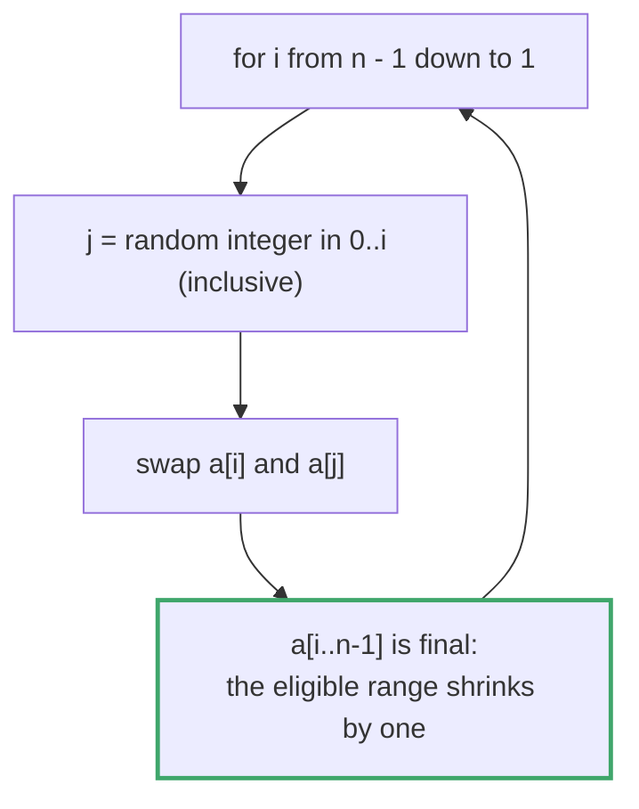
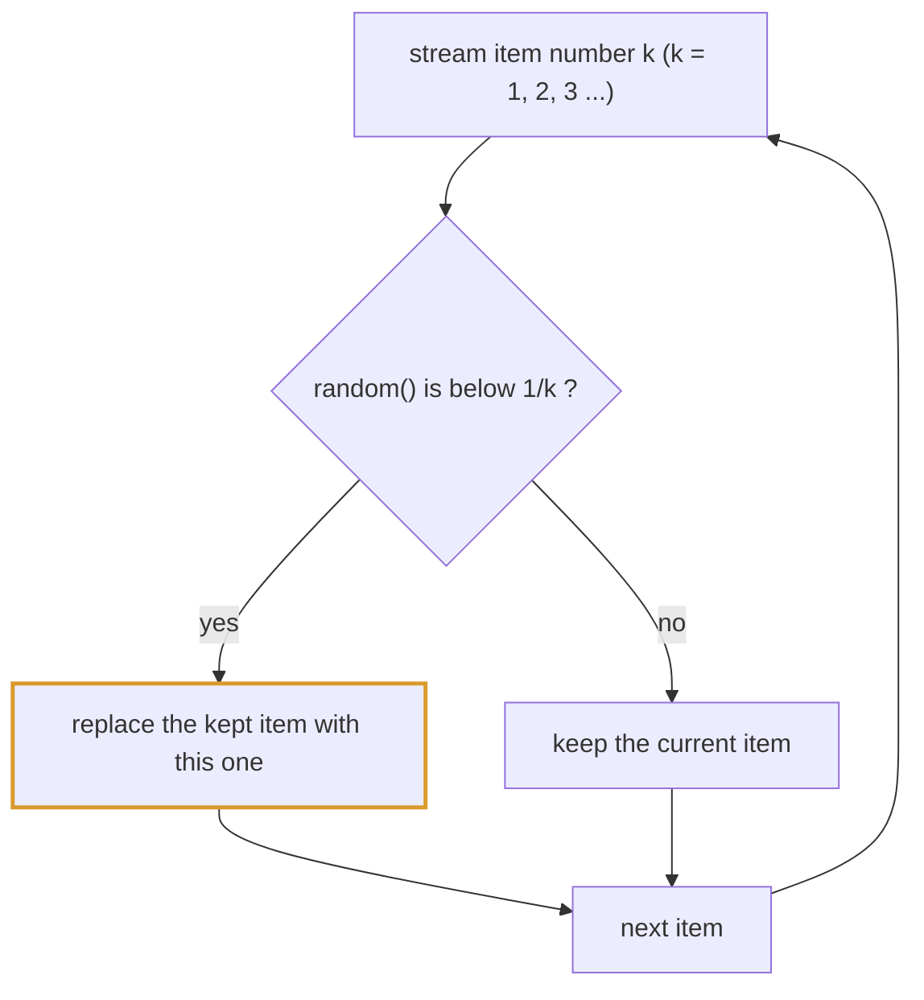
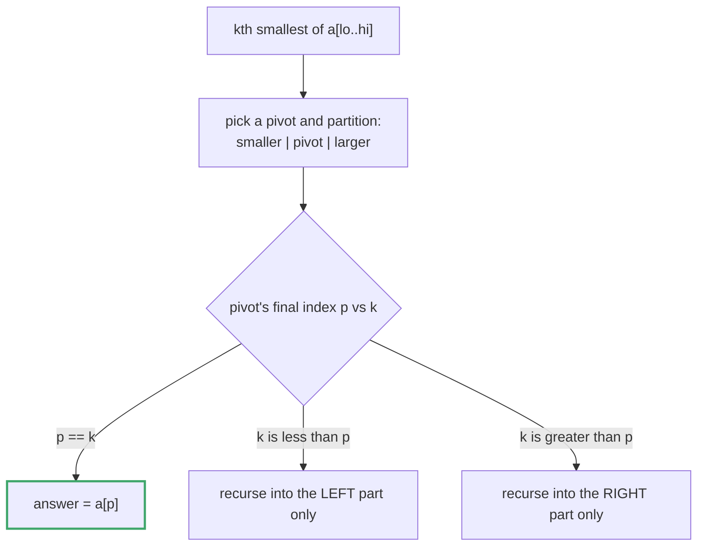

# Topic 27 · Classic Algorithms (Randomized, Divide & Conquer, Quickselect) — Python Deep Dive

> Every prior topic organized itself around a DATA STRUCTURE (arrays, trees,
> heaps, tries, graphs). This topic is different on purpose: it collects
> four algorithm DESIGN PARADIGMS that cut ACROSS data structures — you'll
> reuse an array, a linked list, a plain integer prefix-sum table, and a
> string, and the interesting content is never "what structure holds the
> data," it's "what guarantee does the algorithm make, and can you prove
> it." That's the throughline: correctness proofs and complexity trade-offs
> that live independently of any one container.

---

## Part 0 · The four paradigms in this folder

**(a) Randomized algorithms with a correctness proof, not just a plausible
result.** 001, 002, 003, 004 all produce a RANDOM output, and "it looks
random when I eyeball it" is not good enough — the interview bar is
proving EVERY outcome is equally likely (uniform), or that a weighted
outcome hits its exact target probability. Three techniques:







- **Fisher-Yates / Knuth shuffle** (001): shrink the "still eligible"
  range by one each step, swap the current slot with a uniformly random
  eligible slot. Produces exactly `n!` equally-likely permutations.
- **Reservoir sampling** (002, 003): pick uniformly from a stream of
  unknown or unbounded length in ONE pass, O(1) extra space, by accepting
  the k-th item with probability `1/k` and proving by induction that this
  keeps every item's final probability at `1/n`.
- **Weighted random via prefix sum + binary search** (004): turn weights
  into a monotonic prefix-sum array, draw one uniform random float, and
  `bisect_right` finds which weight-bucket it landed in — O(log n) per
  pick after O(n) preprocessing.

**(b) Quickselect / 3-way (Dutch-flag-style) partitioning** (005, 007): a whole
class of "order statistics" problems (kth largest, median, top-k) do NOT
need a full `O(n log n)` sort — Quickselect's partition-and-recurse-into-
one-side gets the k-th smallest/largest in expected `O(n)`, same partition
scheme as quicksort but throwing away the side you don't need instead of
recursing into both. The interview signal here: reaching for quickselect
instead of `sorted()` when the question only asks for ONE positional
statistic, not a fully ordered array. 007 is the CANONICAL exercise for this
technique in the topic: it forces a CUSTOM comparator (numeric strings must
compare by length first, then lexicographically — `"9" > "10"` as strings
but `9 < 10` as numbers) instead of relying on `<` doing the right thing by
default, proving the technique generalizes beyond natural numeric order.




**(c) Divide & Conquer with memoization over a STRING, not an array index**
(006): naive recursion that splits a problem at every possible operator
position re-derives the same sub-expression's answer many times — but the
"overlap" here is keyed by a **substring of an expression**, not an array
index range. Contrast this directly with topic 16/17: DP-1D's `dp[i]` and
DP-2D's `dp[i][j]` are both indexed into the ORIGINAL array/string by
position; this problem's cache key is "which substring of the expression,"
and the recursion decides where to SPLIT rather than where to STOP. Same
memoize-the-overlap instinct, different axis of overlap.

**(d) Randomized O(1)-space remapping for a punctured domain** (008): when
you need a uniform pick from `[0, n-1]` EXCLUDING a blacklist, and n is too
large to materialize, reject-and-resample is correct but has unbounded
expected calls to the random source as the blacklist fraction grows. The
sharper technique: shrink the draw range to exactly `whitelist_size = n -
len(blacklist)`, then remap (once, in O(B) preprocessing) every blacklisted
number that falls INSIDE that shrunk range to a valid number OUTSIDE it —
one random() call, O(1) work, every pick. Contrast directly with 002/003's
reservoir sampling, which solves a different constraint (stream of unknown
length) with a different tool (accept-with-probability-1/k over one pass,
not a precomputed remap).

---

## Part 1 · Why these don't belong in earlier topics

Every one of these problems could superficially be filed elsewhere —
001/002/003/004 touch arrays and linked lists, 005/007 look like sorting
problems, 006 looks like a string/DP problem, 008 looks like a plain design
problem. They're pulled out here because the array/list/string is
incidental; the graded skill is:

1. Can you produce (or reason about) a distribution and PROVE uniformity —
   not just write code that "looks random"?
2. Can you recognize when full information (full sort, full array
   materialization, full memo table indexed by position) is strictly more
   work than the question actually requires?
3. Can you tell the difference between "recursion overlaps on array
   position" (DP as taught in 16/17) and "recursion overlaps on a
   sub-expression / sub-range that isn't simply `[i:j]` of the original
   index space" (divide & conquer with memoization)?

---

## Part 2 · Problem-by-problem map

| # | Problem | Paradigm | The provable claim |
|---|---|---|---|
| 001 | Shuffle an Array | Fisher-Yates | every one of the `n!` permutations is equally likely |
| 002 | Random Pick Index | Reservoir sampling, size 1 | each matching index is returned with probability exactly `1/k` |
| 003 | Linked List Random Node | Reservoir sampling over a stream | O(1) space regardless of list length, still uniform |
| 004 | Random Pick with Weight | Prefix sum + binary search | `P(pick i) = weight[i] / total`, exactly, not approximately |
| 005 | Wiggle Sort II | Quickselect + 3-way partition | O(n) expected, correct reordering without a full sort |
| 006 | Different Ways to Add Parentheses | D&C + memoization on substrings | every distinct parenthesization is enumerated exactly once, overlapping sub-expressions solved once |
| 007 | Find the Kth Largest Integer in a String | Quickselect, custom comparator | length-first-then-lexicographic ordering finds the true k-th largest numeric value, O(n) expected |
| 008 | Random Pick with Blacklist | Randomized O(1) remap over a punctured domain | every non-blacklisted value in `[0, n-1]` is returned with probability exactly `1/whitelist_size` |
| 009 | Implement Rand10() Using Rand7() | Rejection sampling on a uniform grid | `(rand7() − 1)·7 + rand7()` is uniform on 1..49; keeping 1..40 and rejecting 41..49 keeps it uniform |

---

## Part 3 · The naive-vs-correct trap that shows up 3 times

A recurring failure mode across 001/002/003: code that superficially looks
random but is measurably NOT uniform. The fix is always the same shape —
shrink the eligible range as you go (001), or weight acceptance by `1/k`
as the stream grows (002/003) — and the only way to be sure you got it
right is to run it thousands of times and look at the empirical frequency
table, which is exactly what each solution file's runtime demo does
(measured, not asserted — see repo `CONTEXT.md` §6). A shuffle or a random
pick that "looks fine" on one run and is subtly biased is one of the most
common ways this topic goes wrong in an interview, because the bug is
invisible without a frequency count.

---

## Part 4 · Where this topic ends

This is a closed set of nine problems illustrating five techniques (the ninth, Rand10 from Rand7, is rejection sampling — Part 5.8), not an
open-ended pattern family like DP or graphs — there is no "topic 28" that
continues it. The value is recognizing these shapes fast: "pick uniformly
from something I can't fully materialize" → reservoir sampling; "I only
need one order statistic, not a sorted array" → quickselect (even under a
custom comparator, per 007); "recursion splits a string/expression at every
possible point and re-derives the same substring's answer" → memoize by
substring, divide & conquer; "uniform pick over [0, n-1] minus a blacklist,
n too large to materialize" → shrink the range and remap once, O(1) per
pick, per 008.

<!-- block:27_py_1_randomness -->
## Part 5 · Randomness Done Right — Proving Uniformity, and Measuring It

Part 3 says "run it thousands of times and look at the frequency table". This Part turns that into a recipe, shows the standard wrong answers *failing* the recipe, and adds the pieces the eight solution files leave out. Every experiment below ran on CPython 3.13.

### 5.1 How to test a randomized algorithm: the chi-square recipe

Count the outcomes over many trials and compare with the expected counts using the **chi-square statistic**:

```python
def chi2(observed, expected):
    return sum((o - e) ** 2 / e for o, e in zip(observed, expected))
```

For an algorithm that is uniform over `k` outcomes, the statistic follows a chi-square distribution with `k − 1` degrees of freedom; it exceeds the **5 % critical value** only about one run in twenty. Critical values: 5.99 for 3 outcomes, 9.49 for 5, 11.07 for 6, 16.92 for 10.
A biased algorithm does not creep past the line — it overshoots it by orders of magnitude, which is what makes the test decisive. Use enough trials that each expected count is at least ~5 (here 100,000+), and never eyeball "looks random".

### 5.2 Shuffles: three ways to get it wrong (Problem 001)

```python
def fisher_yates(a):
    for i in range(len(a) - 1, 0, -1):
        j = random.randint(0, i)                 # INCLUSIVE: j may equal i, so the element may stay where it is
        a[i], a[j] = a[j], a[i]
```

Six permutations of `[0, 1, 2]`, 600,000 shuffles each, expected 100,000 per permutation:

| Algorithm | Distinct permutations seen | Counts | χ² (critical 11.07) |
|---|--:|---|--:|
| **Fisher–Yates** | 6 | 99,795 … 100,164 | **1.3** |
| Sort by a random key (`a.sort(key=lambda _: random.random())`) | 6 | 99,676 … 100,289 | 4.3 |
| Naive: swap each position with a random position in the *whole* array | 6 | 88,934 … 111,248 | **7,240.8** |
| Off by one: `randint(0, i - 1)` | **2** | 299,932 and 300,068 | 1,200,000 |

- The **naive** version has `3³ = 27` equally likely swap sequences spread over 6 permutations; 27 is not divisible by 6, so the probabilities are multiples of 1/27 — measured as 4.0, 5.0, 5.0, 5.0, 4.0, 4.0 twenty-sevenths. No amount of "more swaps" repairs a count that cannot divide evenly.
- The **off-by-one** (`randint(0, i - 1)`, equivalently `randrange(0, i)`) is *Sattolo's algorithm*: it can never leave an element in place, so it produces only cyclic permutations — 2 of the 6, and nothing in `n!` more generally (only `(n−1)!`). It "looks" shuffled and is not.
- **Sorting by a random key** is uniform but O(n log n); it is a valid one-liner as long as the keys do not tie.
- Store a **copy** of the input for `reset()` — keeping a reference means `shuffle()` corrupts the original (Problem 001's second trap). `random.shuffle` *is* Fisher–Yates; use it in production.

### 5.3 `random` API facts that cause off-by-ones

`random.randint(a, b)` is **inclusive** of both ends (`randint(1, 3)` produced `1, 2, 3`); `random.randrange(a, b)` excludes `b` (`randrange(1, 3)` produced `1, 2`). `random.random()` is in `[0, 1)`. `random.choice(seq)`, `random.sample(population, k)` (without replacement) and `random.choices(population, weights=, k=)`
(with replacement) exist — `choices` builds cumulative weights and bisects, exactly Problem 004's algorithm. `random.seed(s)` makes a run reproducible; a test that fixes the seed checks *one* outcome, not the distribution.

**Modulo bias.** Reducing a uniform generator with `% n` is uniform only if `n` divides the generator's range. With a 3-bit generator (values 0–7) reduced `% 6`, the measured frequencies of 0…5 were 0.251, 0.250, 0.125, 0.125, 0.124, 0.125 — values 0 and 1 are twice as likely because 6 and 7 wrap onto them. `random.randrange` avoids this by rejection; a hand-rolled `getrandbits(k) % n` does not.
This is exactly Problem 009's lesson.

### 5.4 Reservoir sampling (Problems 002, 003)

```python
def reservoir1(stream):                          # one uniform item from a stream of unknown length
    pick = None
    for k, x in enumerate(stream, 1):
        if random.randrange(k) == 0: pick = x    # keep the k-th item with probability 1/k
    return pick

def reservoir_k(stream, k):                      # k uniform items (Algorithm R)
    res = []
    for i, x in enumerate(stream):
        if i < k: res.append(x)
        else:
            j = random.randrange(i + 1)          # replace a random slot with probability k/(i+1)
            if j < k: res[j] = x
    return res
```

The proof by induction: after item `m`, each of the `m` items is held with probability `1/m`; item `m + 1` is kept with `1/(m+1)`, and each earlier item survives with `(1/m)·(m/(m+1)) = 1/(m+1)`. Measured over 200,000 runs on a 5-item stream:
counts 39,856 / 40,134 / 39,973 / 40,137 / 39,900 (χ² = 1.7 against a critical 9.49); `reservoir_k(range(10), 3)` included each item with frequency 0.299–0.302 (expected 0.3). Problem 002 is the same code counting only the *matching* indices — over `[1, 2, 3, 3, 3]`,
target 3, the indices 2, 3, 4 came out 0.332, 0.335, 0.333. The classic off-by-one, `randrange(k + 1) == 0`, keeps the k-th item with probability `1/(k+1)`: the first item survives only half the time and the function returned `None` in **16.5 %** of runs (each real item appeared 1/6 of the time, not 1/5).

### 5.5 Weighted picks: three conventions, one correct (Problem 004)

```python
class Weighted:
    def __init__(self, w): self.pre = list(itertools.accumulate(w)); self.total = self.pre[-1]
    def pick(self): return bisect.bisect_left(self.pre, random.randint(1, self.total))   # 1..total INCLUSIVE, bisect_left
```

With weights `[1, 3, 6]` (expected 0.1 / 0.3 / 0.6) and 300,000 picks:

| Draw | Search | Result | Verdict |
|---|---|---|---|
| `randint(1, total)` | `bisect_left` | 0.100 / 0.300 / 0.600 | correct |
| `random() * total` (a float in `[0, total)`) | `bisect_right` | 0.100 / 0.301 / 0.600 | correct |
| `randint(1, total)` | `bisect_right` | 0 / 0.300 / 0.700 | index 0 is **never** picked |
| `randint(0, total)` | `bisect_left` | 0.182 / 0.273 / 0.546 | the extra `0` value lands on index 0 |

The rule: the integer draw `1..total` pairs with `bisect_left`; the float draw `[0, total)` pairs with `bisect_right`. Mixing them shifts every bucket boundary by one and starves the smallest weight. Preprocessing is O(n), a pick O(log n).
The **alias method** makes a pick O(1) after an O(n) build (one uniform index, one biased coin, at most one alias jump); it matched the target on `[1, 3, 6]` (0.100 / 0.301 / 0.598), and for 10⁵ weights and 200,000 picks it took **51 ms** against **87 ms** for the bisect version. Weights must be positive integers for the integer draw; floats need the float draw.

### 5.6 Blacklist: shrink, then remap once (Problem 008)

```python
class Blacklist:
    def __init__(self, n, blacklist):
        self.k = n - len(blacklist); bl = set(blacklist)
        free = iter(x for x in range(self.k, n) if x not in bl)         # whitelisted values OUTSIDE the shrunk range
        self.map = {b: next(free) for b in blacklist if b < self.k}      # remap each blacklisted value INSIDE it
    def pick(self):
        r = random.randrange(self.k); return self.map.get(r, r)
```

Draw uniformly from `0 … k−1` (where `k` is the whitelist size); if the draw is a blacklisted number, swap in a whitelisted number from `k … n−1`. Blacklisted values already `>= k` are never drawn and need no entry; each remap target is used **once** (the iterator
moves on), or that target would be twice as likely. For `n = 7`, blacklist `[2, 3, 5]`, 200,000 picks: 0, 1, 4 and 6 each came out 0.250. Reject-and-resample, the alternative, needs a geometrically distributed number of draws: with 90 % of `n = 1000` blacklisted it averaged **9.92** random calls per pick (theory: 10), against exactly one for the remap.

### 5.7 Different numbers of parentheses: Catalan, and what memoisation saves (Problem 006)

```python
def ways(expr, memo):
    if expr in memo: return memo[expr]
    res = []
    for i, ch in enumerate(expr):
        if ch in '+-*':
            for a in ways(expr[:i], memo):
                for b in ways(expr[i + 1:], memo):
                    res.append(a + b if ch == '+' else a - b if ch == '-' else a * b)
    if not res: res = [int(expr)]                # no operator: the whole slice is a (possibly multi-digit) number
    memo[expr] = res
    return res
# sorted(ways('2-1-1', {})) = [0, 2]     sorted(ways('2*3-4*5', {})) = [-34, -14, -10, -10, 10]
```

The number of results for `n` operands is the Catalan number `C(n−1)`: nine operands (`1+2+…+9`) give **1,430** values. The recursion is keyed by *substring* (two occurrences of `"1+1"` share an entry, which is correct). Counting calls for nine operands: **11,934 without memoisation, 1,519 with**.
A base case that checks "is this one character?" instead of "does this slice contain an operator?" breaks on multi-digit numbers such as `"11"`.

### 5.8 Problem 009: Rand10 from Rand7 — rejection sampling on a uniform grid

`(rand7() − 1) · 7 + rand7()` is uniform on `1…49` (a 7 × 7 grid). Keep `1…40`, map with `% 10`, and reject `41…49`: the accepted values are still uniform because 40 is a multiple of 10. Expected `rand7` calls: `2 / (40/49) = 2.45` (measured 2.448). Two tempting wrong answers, both measured over 300,000 draws:
`rand7() + rand7()` mapped to `1…10` gave 0.101, 0.082, 0.082, 0.082, 0.081, 0.082, 0.102, 0.122, 0.142, 0.123 (a sum of two dice is triangular); and reducing all 49 outcomes `% 10` *without* rejecting gave 0.101 for 1…9 but 0.081 for 10.

The rejected outcomes carry entropy; recycle them and the expected cost drops to **2.19 calls** (measured 2.193):

```python
def rand10():
    a, span = 0, 1                               # invariant: a is uniform on 0..span-1
    while True:
        a, span = a * 7 + (rand7() - 1), span * 7
        if span >= 10:
            lim = span - span % 10               # the largest multiple of 10 that fits
            if a < lim: return a % 10 + 1
            a, span = a - lim, span - lim        # the rejected remainder is still uniform: keep it
```

### 5.9 Follow-ups the interviewer reaches for

| Follow-up | The answer |
|---|---|
| "Prove your shuffle is uniform." | Position `i` receives each of the `i + 1` eligible items with probability `1/(i+1)`; the product over positions is `1/n!`. |
| "Shuffle a stream / sample `k` of it." | Reservoir sampling (Algorithm R). |
| "Pick with weights, many times." | Prefix sums + bisect, or the alias method for O(1) picks. |
| "Weights change between picks." | A Fenwick tree with descent (topic 26's `kth`) — O(log n) pick and update. |
| "How would you test it?" | A chi-square test over many trials; fixing the seed tests one outcome, not the distribution. |
| "Why not `rand() % n`?" | Modulo bias: uniform only when `n` divides the generator's range. |

---
<!-- /block:27_py_1_randomness -->

<!-- block:27_py_2_selection -->
## Part 6 · Order Statistics — Quickselect Measured, Wiggle Sort II, and Numeric Strings

### 6.1 Quickselect with a 3-way partition

```python
def quickselect(a, k):                           # k-th smallest, 1-indexed; expected O(n); works on a copy
    a = a[:]; lo, hi = 0, len(a) - 1; k -= 1
    while True:
        if lo == hi: return a[lo]
        pivot = a[random.randint(lo, hi)]
        lt, i, gt = lo, lo, hi                   # a[lo:lt] < pivot   a[lt:i] == pivot   a[gt+1:hi+1] > pivot
        while i <= gt:
            if a[i] < pivot: a[lt], a[i] = a[i], a[lt]; lt += 1; i += 1
            elif a[i] > pivot: a[i], a[gt] = a[gt], a[i]; gt -= 1
            else: i += 1
        if k < lt: hi = lt - 1                   # the answer is left of the pivots
        elif k > gt: lo = gt + 1                 # ... or right of them
        else: return pivot                       # ... or it is the pivot value itself
```

It matched `sorted(a)[k - 1]` on 2,000 random arrays with heavy duplication. It is the same partition as the sorting topic's 3-way quicksort, but it follows **one** side only, so the work is `n + n/2 + n/4 + …`. Counting element comparisons on `n = 100,000` distinct values (mean of 20 runs):

| `k` | Comparisons |
|---|--:|
| 1 (the minimum) | 2.07 n |
| n / 2 (the median) | **3.27 n** (the worst case for a random pivot; theory says about 3.39 n) |
| n (the maximum) | 1.83 n |

A **fixed last-element pivot** on already-sorted input, asking for `k = 1`, performed **1,999,000** comparisons for `n = 2,000` — `n²/2` — because every partition removes one element. A random pivot removes that failure for every input order, and the 3-way partition keeps duplicates from reviving it. Deterministic O(n) worst case is possible with *median of medians*, at a constant factor that is rarely worth it.

**In CPython the built-in still wins.** For the median of 10⁶ random ints: `sorted(a)[k - 1]` **105 ms**, the pure-Python quickselect **152 ms**, `heapq.nsmallest(10, a)` **7 ms**, `heapq.nlargest(500_000, a)` **779 ms**. The lesson is the same as for sorting: use `heapq.nsmallest/nlargest` when `k` is small, `sorted` otherwise, and write quickselect
when the algorithm is the point (topic 22's Part on CPython applies here too).

### 6.2 Problem 007: the k-th largest *numeric string*

Numeric strings compare wrong lexicographically — `sorted(['9', '10', '2'])` is `['10', '2', '9']` — and cannot be converted blindly: `int('9' * 5000)` raises `ValueError: Exceeds the limit (4300 digits) for integer string conversion` (CPython 3.11+'s default limit, adjustable with `sys.set_int_max_str_digits`). The order that is
both correct and conversion-free is **length first, then lexicographic**:

```python
def kth_largest_number(nums, k):
    return sorted(nums, key=lambda s: (len(s), s), reverse=True)[k - 1]
# ['3','6','7','10'], k=4 → '3'    ['2','21','12','1'], k=3 → '2'    ['0','0'], k=2 → '0'
```

It matched `sorted(map(int, nums))` on 1,000 random inputs with numbers up to 30 digits. This relies on there being **no leading zeros** (the problem promises it) — with `'007'` and `'10'` the length comparison would be wrong. The same key works as the comparator for quickselect: compare the tuples `(len(s), s)`. A tuple key needs no `cmp_to_key`; and putting the length *second* re-introduces the lexicographic bug (Problem 007's third trap).

### 6.3 Problem 005: Wiggle Sort II — median, then a virtual index

Reorder so that `nums[0] < nums[1] > nums[2] < nums[3] …`. Put the smaller half in the even slots and the larger half in the odd slots — *each half in decreasing order*, so equal values near the median end up far apart:

```python
def wiggle_sort(nums):
    n = len(nums); mid = sorted(nums)[(n - 1) // 2]         # the median (quickselect gives it in O(n))
    idx = lambda i: (1 + 2 * i) % (n | 1)                   # virtual index: the odd slots first, then the even slots
    i, lo, hi = 0, 0, n - 1                                 # 3-way partition over the VIRTUAL positions
    while i <= hi:
        if nums[idx(i)] > mid: nums[idx(i)], nums[idx(lo)] = nums[idx(lo)], nums[idx(i)]; i += 1; lo += 1
        elif nums[idx(i)] < mid: nums[idx(i)], nums[idx(hi)] = nums[idx(hi)], nums[idx(i)]; hi -= 1
        else: i += 1
# [1,5,1,1,6,4] → [1,5,1,4,1,6]      [1,3,2,2,3,1] → [2,3,1,3,1,2]
```

Large values are packed at the front of the virtual order (odd real slots), small ones at the back (even slots), the median in between — so a large value is never adjacent to another large one. `(n | 1)` rounds `n` up to the next odd number; `% n` would break the mapping for even `n` (Problem 005's fourth trap). It produced a valid wiggle for every one of **2,603** random solvable inputs
(where "solvable" was decided by trying every permutation). The simpler sort-and-interleave is correct *only* with each half reversed: interleaving the sorted halves as they are was **invalid on 195 of 2,299** solvable random inputs (ties across the boundary), with each half reversed on none.

### 6.4 Follow-ups the interviewer reaches for

| Follow-up | The answer |
|---|---|
| "Median of a stream." | Two heaps (topic 12); quickselect needs the whole array. |
| "Top `k` when `k` is tiny." | A size-`k` heap (`heapq.nlargest`) — O(n log k). |
| "Worst-case O(n) selection." | Median of medians (groups of 5). |
| "Select from data that does not fit in memory." | Sample to pick a pivot, count how many fall on each side per pass, narrow the range. |
| "The k-th largest of a stream." | A min-heap of size `k`; its top is the answer. |

---
<!-- /block:27_py_2_selection -->

<!-- problem-map:start -->
## Part 7 · Every Problem in This Topic, by Pattern

Nine problems, five techniques (Fisher–Yates · reservoir sampling · prefix sums + bisect · quickselect with a 3-way partition · divide-and-conquer with memoisation, plus remapping and rejection sampling for a punctured or mismatched domain). Each **Trap** is a mistake documented in that problem's solution file.

| Problem | Move | The idea — and the trap it sets |
|---|---|---|
| [001 · Shuffle an Array](PyDSA/27_algorithms/001_shuffle_an_array_solution.py) <br>LC 384 · Medium | Fisher–Yates | For `i` from `n-1` down to `1`, swap `a[i]` with `a[randint(0, i)]` (inclusive); keep a *copy* for `reset`. **Trap:** drawing from the full range every step (probabilities become multiples of 1/27 for `n = 3`; χ² 7,240 — measured); `randrange(0, i)` (only cyclic permutations: 2 of 6); storing the caller's list instead of a copy. |
| [002 · Random Pick Index](PyDSA/27_algorithms/002_random_pick_index_solution.py) <br>LC 398 · Medium | Reservoir over matching indices | Count matches; keep the m-th match with probability `1/m` via `randint(1, m)`. **Trap:** `randint(0, m)` (an extra outcome); a counter that survives across `pick` calls; "first" or "last" match (valid but not uniform); special-casing a single match. |
| [003 · Linked List Random Node](PyDSA/27_algorithms/003_linked_list_random_node_solution.py) <br>LC 382 · Medium | Reservoir over a linked list | Walk once; keep node `m` with probability `1/m`; no length needed. **Trap:** converting to an array on every call; `1/(m+1)` or `1/(m-1)`; a separate length pass; assuming `head` is never `None`. |
| [004 · Random Pick with Weight](PyDSA/27_algorithms/004_random_pick_with_weight_solution.py) <br>LC 528 · Medium | Prefix sums + bisect | `pre = accumulate(w)`; draw `randint(1, total)` and `bisect_left`. **Trap:** mixing conventions (`randint(1, total)` with `bisect_right` never picks index 0 — measured 0 / 0.30 / 0.70); independent per-weight coin flips; rebuilding the prefix array per pick. |
| [005 · Wiggle Sort II](PyDSA/27_algorithms/005_wiggle_sort_ii_solution.py) <br>LC 324 · Medium | Median + virtual-index 3-way partition | `idx(i) = (1 + 2*i) % (n \| 1)`; partition around the median so large values sit in odd slots and small in even. **Trap:** `nums.sort()` by reflex; a fixed pivot (O(n²)); interleaving unreversed halves (invalid on 195 of 2,299 solvable inputs); `% n` instead of `% (n \| 1)`. |
| [006 · Different Ways to Add Parentheses](PyDSA/27_algorithms/006_different_ways_to_add_parentheses_solution.py) <br>LC 241 · Medium | Split at every operator, memoise by substring | For each operator, combine every left result with every right result; a slice with no operator is the number. **Trap:** a base case that only recognises one digit; memoising by position when text keys are equally valid; the wrong operator applied at a split; forcing it into a 2-D `dp` table. Nine operands: 11,934 calls plain, 1,519 memoised. |
| [007 · Find the Kth Largest Integer in a String](PyDSA/27_algorithms/007_find_the_kth_largest_integer_in_a_string_solution.py) <br>LC 1985 · Medium | Quickselect with the `(len, s)` key | Compare by length first, then lexicographically; select index `k-1` in descending order. **Trap:** `sorted(nums)` or `max(nums)` on the strings (`'9' > '10'`); `int()` on every string (and the 4,300-digit limit); the comparator backwards; targeting the k-th *smallest*. |
| [008 · Random Pick with Blacklist](PyDSA/27_algorithms/008_random_pick_with_blacklist_solution.py) <br>LC 710 · Hard | Shrink to the whitelist size, remap once | Draw from `0..n-len(bl)-1`; remap each blacklisted value below that bound to an unused whitelisted value at or above it. **Trap:** reject-and-resample as the final answer (≈ 10 calls at 90 % blacklisted); remapping values already `>= k`; reusing a remap target (twice as likely); materialising the whitelist. |
| [009 · Implement Rand10() Using Rand7()](PyDSA/27_algorithms/009_implement_rand10_using_rand7_solution.py) <br>LC 470 · Medium | Rejection sampling on a 7×7 grid | `idx = (rand7()-1)*7 + rand7()` is uniform on 1..49; return `(idx-1) % 10 + 1` for `idx <= 40`, retry otherwise (≈ 2.45 calls; recycling the remainder ≈ 2.19). **Trap:** `rand7() + rand7()` (triangular); reducing all 49 outcomes `% 10` (value 10 is rarer); rejecting nothing; forgetting the loop. |

---
<!-- problem-map:end -->


## Checklist Before Leaving This Topic <!--ca-->

- [ ] Test a randomized algorithm with a chi-square recipe (many trials, expected counts, the 5 % critical value) instead of eyeballing <!--ca-->
- [ ] Write Fisher–Yates with an inclusive `randint(0, i)` and show that the naive swap-with-any-index gives 4/27, 5/27 … instead of 1/6 <!--ca-->
- [ ] Explain why `randint(0, i - 1)` (Sattolo) yields only cyclic permutations, and why `% n` on a smaller generator is biased <!--ca-->
- [ ] Write reservoir sampling for one item and for `k`, and prove the `1/m` invariant by induction <!--ca-->
- [ ] Pair the integer draw `1..total` with `bisect_left` and the float draw with `bisect_right`; know the alias method's O(1) pick <!--ca-->
- [ ] Write the blacklist remap so each remap target is used once, and quote reject-and-resample's cost (≈ 10 calls at 90 % blacklisted) <!--ca-->
- [ ] Write quickselect with a random pivot and 3-way partition, and quote 3.27 n comparisons for the median (worst case 1,999,000 for a fixed pivot on n = 2,000) <!--ca-->
- [ ] Order numeric strings by `(len, s)`, never by `int()` for very long strings (the 4,300-digit limit) <!--ca-->
- [ ] Explain the wiggle-sort virtual index `(1 + 2*i) % (n | 1)` and why each half must be reversed when interleaving <!--ca-->
- [ ] Derive Rand10 from Rand7 by rejection (2.45 calls) and improve it by recycling the remainder (≈ 2.19) <!--ca-->
