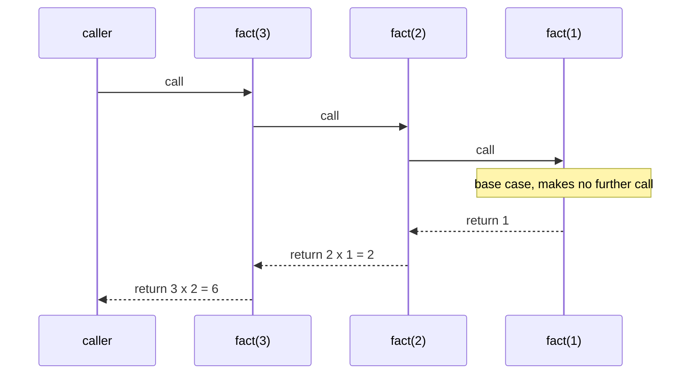

# Topic 28 · Recursion Mastery — Python Deep Dive

Topic 09 (`09_recursion_backtracking`) teaches backtracking: choose/explore/
unchoose over a decision tree, collecting leaves. This topic is different on
purpose. It is a **pure recursion ladder** — 25 problems, each exactly one
notch harder than the last, that teach how to *think in recursive terms at
all*: what a call stack actually does, how to design a base case, how to
combine multiple recursive calls into one answer, and where recursion stops
being the right tool. Do this topic before, or alongside, topic 09 — it is
the foundation topic 09's decision trees are built on.

---

## Part 0 · What a recursive call actually does to your machine

Every call to a Python function pushes a **stack frame**: the function's
local variables, its current line number, and the address to return to.
`f(5)` calling `f(4)` does not "become" `f(4)` — it *pauses*, remembers
exactly where it was, and waits for `f(4)` to hand back a value. Nothing
magic happens at the base case either: it is simply the first call in the
chain that returns *without* making another call, so the pile of paused
frames finally has something to unwind with.




```
call fib(3)
  call fib(2)
    call fib(1) -> base case, returns 1      (frame 3 popped)
    call fib(0) -> base case, returns 0      (frame 3 popped)
  fib(2) resumes, computes 1+0=1, returns 1  (frame 2 popped)
  call fib(1) -> base case, returns 1        (frame 3 popped)
fib(3) resumes, computes 1+1=2, returns 2    (frame 1 popped)
```

Two facts fall directly out of this model, and every bug in this topic is a
violation of one of them:

1. **A function that never reaches a base case never stops pushing frames.**
   Python's default recursion limit is ~1000; blow past it and you get
   `RecursionError`, not a hang. `sys.setrecursionlimit` exists but raising
   it just delays the crash — the real fix is almost always an iterative
   rewrite or a smaller recursion depth by construction (e.g. recursing on
   `n // 2` instead of `n - 1`).
2. **Every recursive call must make INPUT STRICTLY SMALLER, MOVING TOWARD
   the base case.** "Smaller" doesn't have to mean numerically smaller — a
   linked list's `.next`, a string's slice, a tree's child, a number
   shrinking via `// 10` or `// 2` — but it must be *provably* getting
   closer to a base case every single call, or you have infinite recursion
   with a correct-looking base case that is simply never reached.

Python has **no tail-call optimization** — unlike Scheme or Erlang, a
recursive call that is the very last thing a function does still gets a
full new stack frame, not a jump. This is deliberate upstream (Guido has
said TCO would make tracebacks misleading) and it means "just make it
tail-recursive" is not a real optimization technique in Python the way it
is in other languages — the fix for deep recursion in Python is almost
always "rewrite as a loop," not "restructure the recursion."

---

## Part 1 · Designing a base case (before writing a single line of the
recursive step)

The order that avoids the most bugs: **write the base case(s) first**,
then write the recursive step assuming the base case is correct and
trust it (this is "leap of faith" recursion — do not mentally unwind the
whole call tree to convince yourself the recursive step is right; trust
that a strictly-smaller call already does its job correctly, by
induction).

Three shapes cover almost every base case in this topic:

```python
def f(n):
    if n == 0:            # exact-value base case (factorial, digit sums)
        return 1

def f(node):
    if node is None:      # null/empty-structure base case (trees, lists)
        return 0

def f(s, i):
    if i == len(s):       # index-past-the-end base case (strings, arrays)
        return ""
```

A base case that is merely "small" instead of "exactly minimal" is a
classic bug source: `if n <= 1` when the true minimal case is `n == 0`
silently returns the wrong value for `n == 1` if the arithmetic doesn't
happen to agree at that boundary — always check the SMALLEST valid input
by hand, not just "does it terminate."

---

## Part 2 · Three call shapes, three cost models

```arch
%% caption: Linear: depth n, one path. Branching with overlap: exponential unless memoized. Divide and conquer: the halves are disjoint, the depth is log n, and there is nothing to memoize.
route straight
grid 80x85
node L0 "Linear" at 0,0 color=amber sub="f(n) calls f(n-1)" w=150
node l1 "f(4)" at 2,0 shape=circle color=blue
node l2 "f(3)" at 3,0 shape=circle color=blue
node l3 "f(2)" at 4,0 shape=circle color=blue
node T0 "Branching" at 0,1 color=amber sub="f(n-1) and f(n-2)" w=150
node t1 "f(4)" at 3,1 shape=circle color=blue
node t2 "f(3)" at 2,2 shape=circle color=blue
node t3 "f(2)" at 4,2 shape=circle color=red
node t4 "f(2)" at 1.5,3 shape=circle color=red
node t5 "f(1)" at 2.5,3 shape=circle color=blue
node D0 "Divide and conquer" at 0,4 color=amber sub="two halves" w=150
node d1 "n" at 3.5,4 shape=circle color=green
node d2 "n/2" at 2.5,5 shape=circle color=green
node d3 "n/2" at 4.5,5 shape=circle color=green
node d4 "n/4" at 2,6 shape=circle color=green
node d5 "n/4" at 3,6 shape=circle color=green
node d6 "n/4" at 4,6 shape=circle color=green
node d7 "n/4" at 5,6 shape=circle color=green
L0 -> l1 -> l2 -> l3
T0 -> t1
t1 -> t2
t1 -> t3
t2 -> t4
t2 -> t5
D0 -> d1
d1 -> d2
d1 -> d3
d2 -> d4
d2 -> d5
d3 -> d6
d3 -> d7
```


| Shape | Pattern | Calls made | Complexity driver |
|---|---|---|---|
| **Linear** | `f(n)` calls `f(n-1)` once | 1 per level | O(depth) calls total |
| **Tree (branching)** | `f(n)` calls `f(n-1)` AND `f(n-2)` (or more) | >1 per level | O(branches^depth) — exponential unless subproblems overlap (then memoize) |
| **Divide & conquer** | `f(n)` calls `f(n/2)` twice (or similar) | 2 per level, but depth is O(log n) | O(n log n) typical — halving the input each level is what keeps this cheap despite branching |

Naive Fibonacci (topic 09, problem 001) is the canonical **tree** shape
with overlapping subproblems — that overlap is *why* memoization helps.
Merge sort is the canonical **divide & conquer** shape — its two
recursive calls do NOT overlap (they operate on disjoint halves), so
there is nothing to memoize; the win there comes from the depth being
`log n` instead of `n`. Confusing these two is the single most common
reason someone reaches for memoization on a problem that doesn't need it
(divide & conquer over disjoint ranges) or fails to reach for it on one
that desperately does (branching recursion over overlapping ranges).
Problems 011/012 and 020/021 in this folder make you feel both shapes
directly.

---

## Part 3 · Combining sub-results — the real skill

Once the recursive call returns, you have a value (or several, for a tree
node's children) representing the answer to a strictly smaller
subproblem. The entire remaining work is: **how do you combine those
sub-answers into the answer for the current, larger problem?** This is
where the real design thinking happens — the recursive *call* is
almost always one line; the combining step is the problem.

Four recurring combine patterns in this folder:

- **Reduce to a scalar going up**: `return combine(f(left), f(right))` —
  e.g. summing, counting, finding a max. (`Sum Root to Leaf Numbers`,
  `House Robber III`.)
- **Build a new structure going up**: each level constructs a new node/
  list/string from its children's already-built pieces, rather than
  mutating a shared structure. (`Unique Binary Search Trees II`,
  `All Possible Full Binary Trees`.)
- **Pass extra state going down** (an accumulator parameter): the
  recursive call receives not just "what's left to process" but also
  "what has been decided so far" — the parameter list grows an
  accumulator. (`Reverse String`'s two-pointer version, `Add Digits`.)
- **Return a pair/tuple carrying two pieces of information at once**,
  because one recursive pass needs to report both "the answer for this
  subtree" and "some fact my parent needs to combine correctly" —
  the hallmark of the hardest problems in this folder.
  (`Lowest Common Ancestor of Deepest Leaves`, `Binary Tree Cameras`,
  `Distribute Coins in Binary Tree`.)

---

## Part 4 · Mutual recursion

Two functions can call each other instead of themselves — `is_even(n)`
calls `is_odd(n-1)` which calls `is_even(n-2)`, etc. Nothing about the
call-stack model changes; there are just two function names involved
instead of one, and the base case can live in either (or both).
`Flatten Nested List Iterator` (problem 009) is this folder's real
example: flattening an element mutually recurses between "this is a
list, recurse into each child" and "this is an integer, it's a leaf" —
in Python this is usually written as one function with an `isinstance`
branch rather than two named functions, but the mutual-recursion
structure (each branch's recursive call can re-trigger the other branch)
is identical.

---

## Part 5 · When memoization enters (and when it's a distraction)

The instant you notice the SAME (input) pair is being asked for from
different branches of the recursion tree, that's the overlapping-
subproblems signal — cache it. `functools.lru_cache` is the fastest way
to try this in Python; a hand-rolled dict is more explicit about what
the cache key actually is (important the moment the "input" is more than
one plain hashable argument, e.g. `(node, remaining_budget)`). This
folder introduces memoization gently (`Unique Binary Search Trees`,
problem 011) specifically so topics 16/17 (1D/2D Dynamic Programming)
aren't the first time you've seen the pattern — DP *is* memoized
recursion (or its bottom-up mirror image), nothing more mystical than
that.

```arch
%% caption: Memoize only when the same arguments really are called more than once.
grid 230x105
node Q "Recursive solution" at 0.5,0 shape=pill
node A "Same arguments called more than once?" at 0.5,1 shape=diamond color=amber
node B "Memoize" at 0,2 color=green sub="cache keyed by the arguments, functools.cache" w=210
node C "Do not memoize" at 1,2 color=slate sub="disjoint subproblems, the cache never hits" w=210
Q -> A
A -> B : "yes"
A -> C : "no"
```


The flip side matters equally: **not every recursive problem has
overlapping subproblems.** Tree-shaped recursion over a real tree
(`Sum Root to Leaf Numbers`, `Distribute Coins in Binary Tree`) visits
every node exactly once no matter what — there is nothing to cache,
because there is no repeated subproblem to hit a second time. Reaching
for `@lru_cache` there adds overhead and signals a misunderstanding of
why memoization helped in the cases where it did.

---

## Part 6 · The progression in this folder

Each problem is exactly one notch harder than the last. Read the
docstring's UNDERSTANDING THE PROBLEM section even for the "easy" ones —
the point of problems 001-006 is not that they're hard, it's that they
force clean base-case and combine-step thinking before any branching
enters the picture.

| # | LC | Problem | What's new this step |
|---|---|---|---|
| 001 | 1342 | Number of Steps to Reduce a Number to Zero | Absolute basics: one recursive call, one base case, an accumulator going down |
| 002 | 344 | Reverse String | Two-pointer recursion; recursing on an index RANGE, not a shrinking number |
| 003 | 258 | Add Digits | Recursion on a value derived from the input (digit sum), not the input itself |
| 004 | 231 | Power of Two | Recursing by DIVISION (`n // 2`) instead of subtraction — depth is O(log n), not O(n) |
| 005 | 326 | Power of Three | Same shape as 004, but division doesn't cleanly halve — different termination reasoning |
| 006 | 119 | Pascal's Triangle II | Building a whole output ROW from the previous row — combine step outputs a list, not a scalar |
| 007 | 24 | Swap Nodes in Pairs | First linked-list recursion: the recursive call returns "the new head of what follows," a pattern reused constantly |
| 008 | 92 | Reverse Linked List II | Same structure as 007 but the recursion only applies to a SUBRANGE of the list — extra state must travel down |
| 009 | 341 | Flatten Nested List Iterator | Mutual recursion via `isinstance` branching (Part 4) |
| 010 | 445 | Add Two Numbers II | Recursion combined with an explicit stack to reverse processing order — when recursion alone isn't quite enough |
| 011 | 96 | Unique Binary Search Trees | First real overlapping-subproblems + memoization case (Part 5) |
| 012 | 95 | Unique Binary Search Trees II | Same recurrence as 011, but building STRUCTURES (trees) instead of counting — the "build going up" combine pattern |
| 013 | 129 | Sum Root to Leaf Numbers | Accumulator passed DOWN through a tree (the path-so-far), combined going up |
| 014 | 337 | House Robber III | First "return a pair going up" problem — each call reports two numbers, not one |
| 015 | 894 | All Possible Full Binary Trees | Structure-building recursion over a SPLIT (left size + right size), memoized |
| 016 | 372 | Super Pow | Divide & conquer recursion (Part 2) meets modular arithmetic |
| 017 | 776 | Split BST | Recursion that returns TWO structures (a pair of trees) from one call |
| 018 | 979 | Distribute Coins in Binary Tree | Return-value doubles as a side-channel: each call reports a "flow" its parent must account for globally |
| 019 | 1123 | Lowest Common Ancestor of Deepest Leaves | Return a (node, depth) pair — the combine step must compare depths across subtrees |
| 020 | 1130 | Minimum Cost Tree From Leaf Values | Divide & conquer over every possible SPLIT POINT of a range — exponential unless memoized/greedy-reduced |
| 021 | 1028 | Recover a Tree From Preorder Traversal | Recursion driven by a shared, mutating cursor/index into a flat traversal — state that must NOT reset per call |
| 022 | 761 | Special Binary String | Recursive decomposition into balanced sub-blocks, each independently recursed and then reassembled |
| 023 | 87 | Scramble String | Recursion branches over every split point AND a swap-or-not choice at each level — memoization is no longer optional |
| 024 | 282 | Expression Add Operators | Recursion + backtracking + pruning fused together — the capstone bridge back into topic 09 |
| 025 | 968 | Binary Tree Cameras | Hardest combine step in the folder: a 3-state return value driving a greedy decision made possible only by post-order recursion |

---

## Part 7 · Recursion vs iteration — always ask

Every problem here CAN be written recursively (that's the point of the
topic), but several have a natural, often faster, iterative twin (linked-
list problems especially — an iterative pointer-rewiring pass usually
beats recursion in both time and O(1) vs O(n) stack space). The solution
files measure this directly where it's instructive, rather than asserting
"recursion is elegant but iteration is faster" as received wisdom. Always
be ready to answer, for any problem in this folder: *"what would the
iterative version cost, in time and in stack space, compared to this
recursive one?"* — that question is asked in nearly every real interview
that starts with a recursive solution.

---

<!-- block:28_py_1_measured -->
## Part 8 · Recursion, Measured — Depth Limits, Call Counts, and the Recurrence Behind Each of the 25 Problems

Parts 0–7 give the model. This Part puts numbers on it (CPython 3.13, best of several runs) and lists the recurrence and cost of every problem in the ladder, so "what does this recursion cost?" always has a checked answer.

```arch
%% caption: A RecursionError has four fixes, in order of preference: shrink the depth by construction, iterate with an explicit stack, memoise so fewer distinct calls happen, and only then raise the limit.
grid 290x105
node Q "RecursionError, or depth that could be large" at 0,0 shape=pill w=260
node A "Can each call halve the input?" at 0,1 shape=diamond color=amber
node B "recurse on n // 2: depth log n" at 1,1 color=green sub="binary exponentiation, divide and conquer" w=260
node C "Is it a linear chain or a tree walk?" at 0,2 shape=diamond color=amber
node D "iterate" at 1,2 color=green sub="a loop, or an explicit stack of (node, state)" w=260
node E "Same arguments repeated?" at 0,3 shape=diamond color=amber
node F "memoise" at 1,3 color=amber sub="fewer calls, and often less depth" w=260
node G "setrecursionlimit as a last resort" at 0,4 color=red sub="it costs memory" w=260
Q -> A
A -> B : "yes"
A -> C : "no"
C -> D : "yes"
C -> E : "no, branching"
E -> F : "yes"
E -> G : "no"
```

### 8.1 The stack limit, measured

- The default limit is **1,000**. A plain `f(k) = 1 + f(k − 1)` called from module level succeeded for `k = 997` and raised `RecursionError: maximum recursion depth exceeded` beyond it — a few frames are already in use.
- `sys.setrecursionlimit` works much deeper on CPython 3.13 than folklore says, because since 3.11 a Python-to-Python call reuses the interpreter loop instead of consuming C stack. With the limit raised, depth 10,000 took 0 ms and 15 MB, depth **100,000** took 5 ms and 28 MB, and depth **1,000,000** took 51 ms and **159 MB** of resident memory. So the limit is a
  guard against runaway recursion and a memory cost, not a hard ceiling — but relying on it in a shared or older interpreter is fragile, and it is never a fix for *unbounded* depth.
- Real inputs hit it sooner than you expect. Recursively reversing a linked list failed at **2,000 nodes**; the height of a right-skewed binary tree failed at **1,200 nodes** while the iterative version (an explicit stack of `(node, depth)`) handled **100,000**. LeetCode trees reach 10⁴ nodes.
- Python has no tail-call optimisation, so rewriting `f(n, acc)` as "tail-recursive" changes nothing: `linear_pow(3, 5000, m)`, which makes one call per exponent step, died after **999** calls, while binary exponentiation (`pow(x, n) = pow(x, n // 2)²`) needed **31** calls for `n = 10⁹` — depth 31 instead of depth `n`.

### 8.2 The three call shapes, counted

| Shape | Example | Measured |
|---|---|---|
| Linear | `rsum(n) = n + rsum(n − 1)` | 900 calls per evaluation; recursive **7.9 ms** vs iterative **2.4 ms** per 200 evaluations of `n = 900` (call overhead, ~3×) |
| Branching, overlapping | naive `fib` | `fib(20)` = 21,891 calls, `fib(25)` = 242,785, `fib(30)` = **2,692,537 calls (108 ms)**; `fib(35)` would make 2·F(36) − 1 = 29,860,703. Memoised `fib(30)`: **31** distinct calls, 0.025 ms |
| Divide and conquer | merge-sort-shaped halving over 1,024 items | **2,047 calls** = 2n − 1; nothing to memoise because the halves are disjoint |
| Linear with linear work | `T(n) = T(n − 1) + n` | total work for `n = 500`: 125,250 = n(n + 1)/2 |

### 8.3 Solving a recurrence — the table to keep in your head

| Recurrence | Solution | Example in this folder |
|---|---|---|
| `T(n) = T(n − 1) + O(1)` | O(n) | 006 Pascal's row, 007 Swap Pairs, 013 Sum Root to Leaf (per node) |
| `T(n) = T(n/2) + O(1)` | O(log n) | 004 Power of Two, 016 Super Pow (per digit) |
| `T(n) = 2T(n/2) + O(n)` | O(n log n) | merge sort; 020's divide-and-conquer reading |
| `T(n) = 2T(n/2) + O(1)` | O(n) | a balanced tree walk (014, 018, 019, 025) |
| `T(n) = T(n − 1) + O(n)` | O(n²) | 002-style reversal by slicing |
| `T(n) = T(n − 1) + T(n − 2)` | Θ(φⁿ) | naive Fibonacci; memoised: O(n) |
| `T(n) = Σ T(i)·T(n − 1 − i)` (Catalan) | Θ(4ⁿ / n^1.5) results | 011, 012, 015 |

Recursion *depth* is the space cost (each frame is real memory): O(n) for a chain, O(log n) for halving, O(h) for a tree of height `h` — which is O(n) for a skewed tree.

### 8.4 The Catalan family (Problems 011, 012, 015)

`numTrees(n) = Σ numTrees(i) · numTrees(n − 1 − i)` gives 1, 2, 5, 14, 42, 132, 429, 1,430, 4,862, 16,796 for `n = 1…10` — the Catalan numbers. Without memoisation `numTrees(5)` makes **135** calls, `numTrees(10)` **32,805** and `numTrees(12)` **295,245**; with memoisation
the number of *distinct* subproblems is `n + 1` (11 for `n = 10`). The number of full binary trees with `n` nodes (Problem 015, `n = 1, 3, 5, …, 21`) is 1, 1, 2, 5, 14, 42, 132, 429, 1,430, 4,862, 16,796 — the same Catalan sequence, indexed by the number of internal nodes `(n − 1)/2`, and
zero for every even `n`. Problems 012 and 015 must *return the trees* (so the output size is Catalan-large, and no algorithm can beat that); 011 only *counts*, so O(n²) time with the memo.

### 8.5 The hard end of the ladder, measured

- **023 Scramble String.** Memoising on `(i, j, length)` bounds the states by `n³`; in practice far fewer are reached. On a 10-letter non-scramble over a 4-letter alphabet, plain recursion made **498** calls and the memoised version visited **148** states. The character-multiset prune (`sorted(a) != sorted(b)`) is what keeps unmemoised
  runs feasible — the fourth documented trap. Both the no-swap pairing (`a[:i]`↔`b[:i]`) and the swap pairing (`a[:i]`↔`b[-i:]`) must be tried.
- **024 Expression Add Operators.** Enumerating every expression for `"123456789"` (digits joined or separated by one of three operators) makes **87,382** recursive calls. The trick that makes `*` correct in a left-to-right recursion is to carry the *last signed term*: on `*`, undo it and re-apply it multiplied — `value − last + last·cur`, new `last = last·cur`. Multiplying the running value instead (ignoring
  precedence) finds `2*3+2` for `"232"` target 8 but **misses `2+3*2`**. Every operand needs the leading-zero guard, not just the first.
- **020 Minimum Cost Tree From Leaf Values.** The interval DP `dp[i][j] = min over k of dp[i][k] + dp[k+1][j] + max(i..k)·max(k+1..j)` is O(n³); a monotonic stack does it in O(n). They agreed on 1,000 random arrays; at `n = 150` the DP took **46 ms** and the stack **0.02 ms**. The examples `[6, 2, 4]` → 32 and `[4, 11]` → 44 hold for both.
- **016 Super Pow.** `a^[b₁…b_k] = (a^[b₁…b_{k−1}])¹⁰ · a^{b_k}` reduces `mod 1337` at every step and recurses on the *last* digit; with up to 2,000 digits the recursion needs a raised limit or a loop over the digits — the fourth documented trap.

### 8.6 Two recursion bugs worth seeing run

```python
def collect(n, acc=[]):                  # the default list is created ONCE, at definition time
    if n == 0: return acc
    acc.append(n); return collect(n - 1, acc)
collect(2)  # [2, 1]
collect(2)  # [2, 1, 2, 1]   ← the second call starts from the first call's list
```

Use `acc=None` and create the list inside. And in collect-the-leaves recursion, `res.append(path)` stores the *same* list object every time — over `[1, 2]` the results were `[[], [], [], []]` — while `res.append(path[:])` gave `[[1, 2], [1], [2], []]`.

### 8.7 The recursion-to-iteration recipe

For a tree walk, replace the call stack with a list of `(node, state)`:

```python
def height_it(root):
    best, stack = 0, [(root, 1)] if root else []
    while stack:
        node, depth = stack.pop(); best = max(best, depth)
        if node.left: stack.append((node.left, depth + 1))
        if node.right: stack.append((node.right, depth + 1))
    return best
```

It returned 1,200 for the skewed tree where the recursive version raised `RecursionError`, and 100,000 for the large one. Anything that needs post-order information going *up* (the pair-return problems 014, 019, 025) needs a second "visited" state on the stack — that is when recursion is worth keeping and the fix is a larger limit or a smaller tree.

### 8.8 Follow-ups the interviewer reaches for

| Follow-up | The answer |
|---|---|
| "What is the space complexity?" | The maximum depth of the recursion (the call stack), plus any memo table or output. |
| "It overflows on a skewed tree." | An explicit stack, or Morris traversal for O(1) space (topic 10). |
| "Can you make it tail-recursive?" | Not usefully in Python (no TCO); make it a loop. |
| "Count without generating." | A memoised count on the size (011) instead of building the trees (012). |
| "Why is the memo keyed on `(i, j)`?" | Those are all the state the subproblem depends on; anything else in the key defeats the cache. |

---
<!-- /block:28_py_1_measured -->

<!-- problem-map:start -->
## Part 9 · Every Problem in This Topic, by Pattern

Twenty-five problems, each one notch harder — from a single base case to a three-state post-order return. Each **Trap** is a mistake documented in that problem's solution file.

| Problem | Move | The idea — and the trap it sets |
|---|---|---|
| [001 · Number of Steps to Reduce a Number to Zero](PyDSA/28_recursion_backtracking/001_number_of_steps_to_reduce_a_number_to_zero_solution.py) <br>LC 1342 · Easy | One call, one base case | `steps(n) = 0` at `n == 0`, else `1 + steps(n // 2 if even else n - 1)`; depth ≤ 2·log₂ n. **Trap:** forgetting the `+ 1`; `n / 2` (a float); always subtracting 1 (ignoring the even rule). |
| [002 · Reverse String](PyDSA/28_recursion_backtracking/002_reverse_string_solution.py) <br>LC 344 · Easy | Two-pointer recursion | Swap `s[lo]`, `s[hi]`, recurse on `(lo + 1, hi - 1)`, base `lo >= hi`. **Trap:** `lo == hi` (pointers cross on even lengths); returning a reversed copy instead of mutating; slicing instead of passing bounds; depth n/2 in a language with no TCO. |
| [003 · Add Digits](PyDSA/28_recursion_backtracking/003_add_digits_solution.py) <br>LC 258 · Easy | Recurse on a derived value | Sum the digits and recurse on the sum; or the digital root `1 + (n - 1) % 9`. **Trap:** `n % 9` (returns 0 for multiples of 9); missing the `n == 0` case in the formula; mixing string and arithmetic digit extraction. |
| [004 · Power of Two](PyDSA/28_recursion_backtracking/004_power_of_two_solution.py) <br>LC 231 · Easy | Recurse by halving | `n == 1` → true; odd or `n <= 0` → false; else recurse on `n // 2`. **Trap:** testing `n % 2` before `n <= 0` (infinite recursion on 0); no `n == 1` base case; the bit trick without `n > 0`; ignoring negatives. |
| [005 · Power of Three](PyDSA/28_recursion_backtracking/005_power_of_three_solution.py) <br>LC 326 · Easy | The same in base 3 | Divide while `n % 3 == 0`; no bit trick exists; or `3**19 % n == 0` with `n > 0`. **Trap:** `n % 3` before `n <= 0`; expecting a bitmask; the trick without the `n > 0` guard; the wrong largest exponent. |
| [006 · Pascal's Triangle II](PyDSA/28_recursion_backtracking/006_pascals_triangle_ii_solution.py) <br>LC 119 · Easy | Build a row from the previous row | `row(k)` = 1, adjacent sums of `row(k-1)`, 1. **Trap:** dropping the bookend 1s; `range(len(prev))` instead of `range(1, len(prev))`; mutating the shared previous row; confusing the 0-indexed `rowIndex` with a 1-indexed row. |
| [007 · Swap Nodes in Pairs](PyDSA/28_recursion_backtracking/007_swap_nodes_in_pairs_solution.py) <br>LC 24 · Medium | Return "the new head of what follows" | Swap the first two nodes, attach the recursion on `second.next`. **Trap:** assigning `second.next` before `first.next = recurse(...)`; no single-node base case; swapping values; returning `first` instead of `second`. |
| [008 · Reverse Linked List II](PyDSA/28_recursion_backtracking/008_reverse_linked_list_ii_solution.py) <br>LC 92 · Medium | Recurse on a sub-range | Walk to `left`, then `reverseFirstN`; keep the successor only at the deepest call. **Trap:** recomputing `successor` at every level; decrementing only `left`; returning `head` from `reverseFirstN`; returning the recursion's result from the non-base branch. |
| [009 · Flatten Nested List Iterator](PyDSA/28_recursion_backtracking/009_flatten_nested_list_iterator_solution.py) <br>LC 341 · Medium | Mutual recursion by `isinstance` | A list recurses into each child; an integer is a leaf; lazily, an explicit stack with children pushed in reverse. **Trap:** a `hasNext` that mutates without checking the top; forward-order pushes; calling `getList()` on an integer; treating it as binary. |
| [010 · Add Two Numbers II](PyDSA/28_recursion_backtracking/010_add_two_numbers_ii_solution.py) <br>LC 445 · Medium | Recursion plus alignment | Pad the shorter list, recurse in parallel, return `(node, carry)`. **Trap:** no padding; carry in a shared variable; forgetting the final carry; appending instead of prepending. |
| [011 · Unique Binary Search Trees](PyDSA/28_recursion_backtracking/011_unique_binary_search_trees_solution.py) <br>LC 96 · Medium | Memoised counting | `numTrees(n) = Σ numTrees(i) · numTrees(n - 1 - i)`, `numTrees(0) = 1`. **Trap:** base case 0; a wrong-side factor; memoising on values instead of the count; no memo (135, 32,805, 295,245 calls for n = 5, 10, 12). |
| [012 · Unique Binary Search Trees II](PyDSA/28_recursion_backtracking/012_unique_binary_search_trees_ii_solution.py) <br>LC 95 · Medium | The same, building trees | `build(lo, hi)` returns every tree over `lo..hi`; an empty range returns `[None]`. **Trap:** returning `[]` for the empty range; a `zip` instead of a nested loop; caching by size (the values differ); sharing subtrees when a caller later mutates them. |
| [013 · Sum Root to Leaf Numbers](PyDSA/28_recursion_backtracking/013_sum_root_to_leaf_numbers_solution.py) <br>LC 129 · Medium | Accumulator down, subtotal up | `f(node, acc)`: `acc = acc * 10 + val`; a leaf returns `acc`, otherwise the sum of the children. **Trap:** a one-child node treated as a leaf; recursing into `None`; updating `acc` after the leaf check; a shared running total. |
| [014 · House Robber III](PyDSA/28_recursion_backtracking/014_house_robber_iii_solution.py) <br>LC 337 · Medium | Return a pair | `(rob, skip)`: `rob = val + skipL + skipR`, `skip = max(L) + max(R)`. **Trap:** one number per subtree (exponential); `rob` from the children's *robbed* values; `skip` without `max`; forgetting `max` at the root. |
| [015 · All Possible Full Binary Trees](PyDSA/28_recursion_backtracking/015_all_possible_full_binary_trees_solution.py) <br>LC 894 · Medium | Split by node count | `F(n)`: for odd `L`, combine `F(L)` × `F(n - 1 - L)` under a new root; memoise on `n`. **Trap:** looping every `L` instead of odd ones; no even-`n` early return; mutating shared cached subtrees; confusing the count split with 012's value split. |
| [016 · Super Pow](PyDSA/28_recursion_backtracking/016_super_pow_solution.py) <br>LC 372 · Medium | Recurse on the last digit | `a^[b…] = (a^[b[:-1]])¹⁰ · a^{last digit} mod 1337`. **Trap:** reducing only at the end; `**` instead of 3-argument `pow`; peeling the first digit; a 2,000-digit input exceeding the recursion limit. |
| [017 · Split BST](PyDSA/28_recursion_backtracking/017_split_bst_solution.py) <br>LC 776 · Medium | Return a pair of trees | Split at `target`: only one side straddles; reattach the recursion's result on that side. **Trap:** recursing into both children; reattaching the wrong half; an inconsistent return order; misplacing `node` itself. |
| [018 · Distribute Coins in Binary Tree](PyDSA/28_recursion_backtracking/018_distribute_coins_in_binary_tree_solution.py) <br>LC 979 · Medium | The return value is the excess | `excess = val + L + R - 1`; `moves += abs(L) + abs(R)`. **Trap:** no `abs`; forgetting the `- 1`; returning the move count instead of the excess; `+=` on a closure int without `nonlocal`. |
| [019 · Lowest Common Ancestor of Deepest Leaves](PyDSA/28_recursion_backtracking/019_lowest_common_ancestor_of_deepest_leaves_solution.py) <br>LC 1123 · Medium | Return `(depth, node)` | Equal depths → this node; else the deeper child's answer, depth + 1. **Trap:** returning `node` instead of the deeper child's result; forgetting `+ 1`; depth of `None` as −1; taking a provisional answer as final. |
| [020 · Minimum Cost Tree From Leaf Values](PyDSA/28_recursion_backtracking/020_minimum_cost_tree_from_leaf_values_solution.py) <br>LC 1130 · Medium | Split-point recursion or a monotonic stack | `dp[i][j]` over every split (O(n³)); or pop the smaller neighbour with a stack (O(n)). **Trap:** no memo on `(lo, hi)`; re-slicing `max` per split; adding the leaf values themselves; no `inf` sentinel. |
| [021 · Recover a Tree From Preorder Traversal](PyDSA/28_recursion_backtracking/021_recover_a_tree_from_preorder_traversal_solution.py) <br>LC 1028 · Hard | A shared cursor | Read dashes → depth, then the number; attach to the stack entry at `depth - 1`. **Trap:** mixing the dash and digit loops; `stack[:depth]` copies; `not parent.left` instead of `is None`; assuming the root is `stack[0]`. |
| [022 · Special Binary String](PyDSA/28_recursion_backtracking/022_special_binary_string_solution.py) <br>LC 761 · Hard | Decompose into balanced blocks | Split by running balance; recurse on each block's interior; sort descending; join. **Trap:** ascending order; not recursing inside; splitting on a character instead of the balance; assuming length decides order. |
| [023 · Scramble String](PyDSA/28_recursion_backtracking/023_scramble_string_solution.py) <br>LC 87 · Hard | Split point × swap-or-not | `go(i, j, n)`: try every split with both pairings; prune by character multiset; memoise. **Trap:** only one pairing; memoising as if it were one fixed-pair substring DP; skipping the multiset prune; the complementary halves reversed. |
| [024 · Expression Add Operators](PyDSA/28_recursion_backtracking/024_expression_add_operators_solution.py) <br>LC 282 · Hard | Backtracking with a carried term | `go(i, path, value, last)`; on `*`: `value - last + last * cur`. **Trap:** no leading-zero guard (or only on the first operand); an unsigned `last`; rebuilding the path at the leaf; multiplying the running value (misses `2+3*2`). |
| [025 · Binary Tree Cameras](PyDSA/28_recursion_backtracking/025_binary_tree_cameras_solution.py) <br>LC 968 · Hard | A three-state post-order return | 0 = not covered, 1 = camera, 2 = covered; `None` is state 2; any child 0 → place a camera. **Trap:** `None` as state 0; checking "child 2" before "child 0"; a camera on every leaf; forgetting the root check. |

---
<!-- problem-map:end -->

## Checklist Before Leaving This Topic

- [ ] Can you state, for any problem here, the exact base case AND explain
      why it's the *minimal* case, not just *a* small one?
- [ ] Can you point to the line where each recursive call's argument is
      provably smaller/closer to the base case than the current call's?
- [ ] Can you classify a new recursive problem as linear / branching-tree /
      divide-and-conquer within a few seconds of reading it?
- [ ] Can you tell, before writing any code, whether a problem has
      overlapping subproblems (memoize) or not (don't bother)?
- [ ] Have you written at least three "return a pair/tuple going up"
      solutions (014, 019, 025) until that pattern feels natural instead
      of surprising?
- [ ] For every linked-list/tree problem here, can you sketch what the
      iterative version would look like, even if you don't write it out?
- [ ] Quote the measured depth facts: the default limit gives depth 997, a linked-list reversal fails at 2,000 nodes, a skewed tree at 1,200, and 1,000,000 frames cost about 159 MB when the limit is raised <!--ca-->
- [ ] Name the recurrence and its solution for each shape (linear, halving, divide and conquer, Fibonacci-like, Catalan) <!--ca-->
- [ ] Say why naive `fib(30)` makes 2,692,537 calls and the memoised one 31, and why merge sort makes exactly `2n − 1` calls and needs no memo <!--ca-->
- [ ] Recognise the Catalan family (011, 012, 015) and know that returning the trees is unavoidably Catalan-large <!--ca-->
- [ ] Carry the last signed term for `*` in Expression Add Operators, and apply the leading-zero guard to every operand <!--ca-->
- [ ] Explain the mutable-default-argument bug and the shared-`path` bug (`path[:]`) <!--ca-->
- [ ] Convert a tree recursion to an explicit stack, and say which problems need a post-order state to do it <!--ca-->
