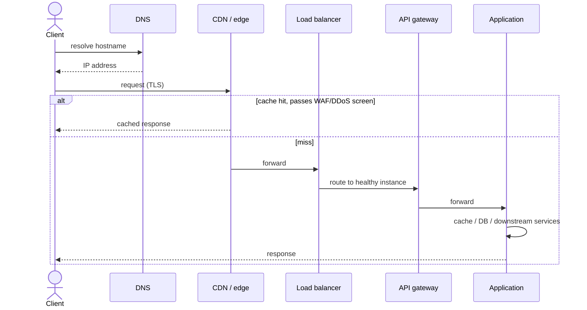

# Networking

A request from a browser to your service crosses more layers than most designs draw. Each layer can fail, add latency, or silently change behavior (caching, retries, connection reuse). This file covers the path end to end; load-balancing *algorithms* and autoscaling live in `13_scaling_and_load_balancing.md` — this file covers what a load balancer's job is, not how it picks an instance.

## The request path



Every hop is a place latency, failure, or a trust boundary is introduced. Treat this as a checklist when asked "walk me through what happens when a user hits your <abbr title="Application Programming Interface">API</abbr>," not just a diagram to memorize.

## DNS

DNS resolves a hostname (`api.example.com`) to an IP address (or another name, via `CNAME`). Resolution is **cached at multiple layers** — OS resolver, browser, ISP resolver — each honoring the record's **TTL**. A short TTL (seconds) lets you redirect traffic faster during a failover or migration, but it is not a real-time control: some resolvers and clients ignore TTL or cache longer than advertised, and a change is not instantly visible everywhere.

| Record | Purpose |
|---|---|
| `A` / `AAAA` | Hostname → IPv4/IPv6 address |
| `CNAME` | Hostname → another hostname (can't coexist with other records at the same name) |
| `NS` | Delegates a zone to authoritative name servers |
| `TXT` | Arbitrary text — domain verification, SPF/DKIM for email |
| `SRV` | Service location (host + port) for a named service |

**Do not use DNS as a per-request health/load decision.** DNS-based failover (updating a record to point away from a dead region) is a coarse, slow lever bounded by TTL and caching behavior you don't fully control — real health-aware routing happens at the load balancer or via anycast, not DNS record changes.

The single-region view above stops at the edge of one deployment. How traffic is steered *between* regions (geo-aware DNS, anycast, health-based failover, and what to do about the TTL and caching limits above at that scale) is covered in [27_multi_region_and_global_traffic.md](27_multi_region_and_global_traffic.md).

## CDN

A CDN is a globally distributed cache sitting in front of your origin. It serves cacheable responses from an edge location near the user, cutting both latency (physical distance) and origin load.

- **Cache key**: typically path + query string + a chosen subset of headers. Two requests with the same key get the same cached response — so a personalized response cached under a public key is a data leak, not a bug you want to discover in production.
- **TTL / freshness**: `Cache-Control: max-age=…` on the origin response, or CDN-configured overrides.
- **Invalidation**: purge by key/path, or version the URL (`app.4f2a.js`) and set a very long TTL — versioned assets never need purging, only cache misses on a new deploy.
- **Stale-while-revalidate**: serve a stale cached copy while asynchronously refetching, trading a small freshness window for zero-latency cache misses.

CDNs are not a substitute for authorization — never rely on "the CDN won't serve it to someone without the link" for anything sensitive; use short-lived signed URLs/cookies for protected content, or don't cache it at the edge at all.

This section is the general-purpose CDN primer. Large-object and video delivery (cache hierarchy, origin protection, adaptive-bitrate streaming) has its own trade-offs and is covered in [29_cdn_and_streaming_media.md](29_cdn_and_streaming_media.md).

## WAF and DDoS protection

A **WAF** (web application firewall) filters requests matching known attack signatures (SQL injection patterns, malformed headers, known bad user agents) before they reach the origin. **DDoS protection** absorbs volumetric/protocol-level attack traffic (SYN floods, amplification attacks) at the network edge, often via anycast scrubbing centers, before it ever reaches your infrastructure. Neither replaces application-level rate limiting or business-logic abuse prevention — they screen out traffic that's obviously not a legitimate individual request; token-bucket rate limiting and behavioral abuse detection are still needed for "a real client, calling too much" — worked example of that mechanism lives in `04_api_design_low_level.md`.

## TCP fundamentals

TCP gives you an ordered, reliable byte stream between two endpoints — nothing more. Every TCP connection starts with a **three-way handshake** (`SYN` → `SYN-ACK` → `ACK`), which costs one round trip before any application data moves — this is part of why TLS-over-TCP costs multiple round trips before the first byte of a response (handshake, then TLS negotiation).

Critical fact for distributed systems: **a TCP connection can break after the server finishes handling a request but before the response reaches the client.** The client sees a timeout or connection reset and cannot tell, from the transport layer alone, whether the server's work happened. This is the root cause requiring idempotency keys and safe-retry design (see `03_api_design_high_level.md`) — it is not solvable by "just retry," because retry without idempotency can duplicate the effect.

TCP also runs congestion control (slow-start, window scaling) and retransmission — a lossy or high-latency network path reduces effective throughput independent of your application, which is why cross-region calls over the public internet behave worse than the raw bandwidth number suggests.

## TLS

TLS authenticates the server (via certificate chain to a trusted CA) and encrypts the connection. **Termination** — the point where encrypted traffic is decrypted — commonly happens at the load balancer or CDN edge, not at the application server. That means:

- Traffic between edge and origin may be plaintext unless you deliberately re-encrypt it (TLS all the way, or mTLS internally — see `14_security.md`).
- The load balancer, not the app, sees the client's real TLS handshake and certificate; the app trusts headers like `X-Forwarded-For`/`X-Forwarded-Proto` only because it trusts the LB, not because it verified them itself.

Mutual TLS (mTLS) — both sides present certificates — is common for service-to-service trust inside a mesh; see `04_api_design_low_level.md` for the wire-level mechanics and `14_security.md` for the broader trust model.

## HTTP/1.1 vs HTTP/2 vs HTTP/3 (QUIC)

| | Transport | Multiplexing | Head-of-line blocking |
|---|---|---|---|
| HTTP/1.1 | TCP | One request in flight per connection (pipelining rarely used); browsers open several parallel connections instead | A slow response blocks that connection; mitigated only by opening more connections |
| HTTP/2 | TCP | Multiple streams multiplexed over **one** TCP connection | App-layer streams don't block each other, but a single lost TCP packet stalls *all* streams on that connection (TCP-level HOL blocking) |
| HTTP/3 | QUIC (over UDP) | Multiple streams, each an independent QUIC stream | A lost packet only stalls the stream it belongs to — transport-level HOL blocking across streams is gone |

**Head-of-line blocking** generally: something ahead in a queue delays everything behind it, even if the thing behind is otherwise ready. It shows up in a TCP connection (as above), a single worker/thread handling requests serially, a database row lock, or an application thread pool sized too small. Naming the protocol doesn't fix HOL blocking if the actual bottleneck is one of those other queues — find the real shared resource before picking a protocol as the fix.

None of HTTP/1.1, /2, or /3 provide application-level backpressure, authorization, or idempotency — those remain your responsibility regardless of transport.

## Latency budget — worked example

Start from an end-to-end SLO and allocate a budget across hops so no service, in isolation, can blow the whole budget:

```text
User p99 target                    300 ms
Edge/network (DNS+TLS+CDN miss)     50 ms
Gateway/auth                        25 ms
Application work                    55 ms
Database/cache dependency           90 ms
Reserved slack/retry/serialization  80 ms
```

The numbers are illustrative — the principle is what matters: a downstream call's *timeout* must be smaller than the caller's *remaining* budget, not the caller's total budget. If the app layer has already spent 60ms by the time it calls the database, the DB call's timeout should reflect the ~240ms left, not the original 300ms SLO — otherwise a single slow dependency call can blow the entire request's deadline after everything upstream already did its job correctly. Propagate deadlines explicitly (pass remaining budget downstream); a client-side timeout alone does not cancel work already in flight on the server unless the server explicitly honors cancellation.

## Load balancer's job (mechanics, not algorithms)

A load balancer routes each request/connection to a healthy backend instance. Its core responsibilities:

- **Health checks**: a cheap, representative endpoint (not just "process is up" — ideally "can serve real requests," e.g. can reach its DB) polled on an interval; an unhealthy instance is pulled from rotation.
- **Connection draining**: on deploy/scale-down, stop sending *new* requests to an instance but let in-flight requests finish before terminating it — killing a pod mid-request without draining shows up as a spike in 5xx/reset errors during every deploy.
- **Sticky sessions** (routing a client to the same backend repeatedly, often via cookie): use only when required (e.g., an in-memory session not externalized yet) — it undermines even load distribution and makes instance failure lose that client's affinity. Prefer stateless instances with externalized session/cache state so any healthy instance can serve any request.

Algorithm choice (round robin, least-connections, consistent hashing, power-of-two-choices) and autoscaling triggers are covered in `13_scaling_and_load_balancing.md` — this file stops at "what the LB's job is."

## Related building blocks

- [00_overview.md](00_overview.md)
- [01_operating_systems.md](01_operating_systems.md)
- [03_api_design_high_level.md](03_api_design_high_level.md)
- [04_api_design_low_level.md](04_api_design_low_level.md)
- [13_scaling_and_load_balancing.md](13_scaling_and_load_balancing.md)
- [14_security.md](14_security.md)
- [10_distributed_systems_theory.md](10_distributed_systems_theory.md)
- [27_multi_region_and_global_traffic.md](27_multi_region_and_global_traffic.md) — steering users between regions (DNS, anycast, failover).
- [29_cdn_and_streaming_media.md](29_cdn_and_streaming_media.md) — CDN design for large objects and video.
