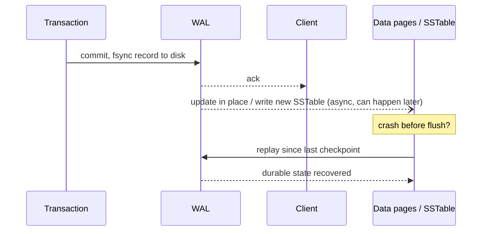

# Database Internals: How They Actually Work

Choosing "a database" is not enough in an interview. You need to know which family fits the access pattern, what the storage engine trades off, how the database survives a crash, how it spreads data across machines, and how it keeps copies of that data in sync. This file is the "under the hood" layer beneath `05_databases.md`.

## Database families

| Family | Data/access model | Strength | Why not default everywhere |
|---|---|---|---|
| Relational (PostgreSQL/MySQL) | Tables, joins, constraints, transactions. | Correctness and flexible query; excellent default. | Horizontal write scaling/cross-region coordination needs care. |
| Key-value | `key → value`. | Very fast simple lookup and distribution. | Secondary queries, joins, and constraints are application work. |
| Document | <abbr title="JavaScript Object Notation - A lightweight data-interchange format that is easy for humans to read/write and machines to parse/generate.">JSON</abbr>-like aggregate documents. | Flexible evolving aggregate. | Cross-document joins/transactions/indexes vary; duplicate data. |
| Wide-column | Partitioned rows/columns designed around queries. | High throughput at scale. | Requires deliberate partition-key/query model. |
| Graph | Nodes/edges/traversals. | Relationship-heavy traversal. | Operational/query complexity; ordinary adjacency often fits relational DB. |
| Search engine | Inverted index/relevance. | Full text, faceting, ranking. | Derived index with eventual freshness; not source of truth. |
| Time-series | Timestamped measurements. | Retention/downsampling/aggregation. | High-cardinality labels can explode cost. |
| Columnar warehouse | Large analytic scans/aggregates. | OLAP efficiency. | Not for low-latency transactional writes. |

Pick by access pattern, not by hype: point lookups at massive scale → key-value; flexible per-record shape that evolves fast → document; relationship traversal is the primary query → graph; everything else that needs joins/constraints/transactions → relational, until a specific proven limit says otherwise.

## Storage engine intuition: B-tree vs <abbr title="Log-Structured Merge-tree. A data structure with performance characteristics that make it attractive for providing indexed access to files with high insert volume.">LSM</abbr> tree


```arch
%% caption: LSM trees buffer writes in memory, then flush sequential immutable files to disk, merging them in the background.
node write "Write" at 0,1 icon=edit color=blue
node mem "Memtable\n(In-Memory)" at 2,1 icon=cpu color=green
group disk "Disk (Immutable)" color=slate style=dashed
node sst1 "SSTable (L0)" at 4,0 in disk icon=file
node sst2 "SSTable (L1)" at 4,2 in disk icon=file

write -> mem : "append"
mem -> sst1 : "flush"
sst1 -> sst2 : "background\ncompaction"
```
**B-tree** stores keys in sorted pages in place. A write finds the right page and updates it directly.

```text
B-tree write:  find leaf page → modify in place → write page (+ WAL record)
B-tree read:   walk root → internal → leaf, O(log n) page fetches
```

- Read/range-scan friendly: data is already sorted on disk, so a range query walks contiguous pages.
- Write cost: an update to a random key touches a random page — under heavy random writes this means a lot of random I/O and page fragmentation.

**<abbr title="Log-Structured Merge-tree. A data structure with performance characteristics that make it attractive for providing indexed access to files with high insert volume.">LSM</abbr> tree (log-structured merge tree)** buffers writes in memory (memtable), flushes sorted immutable files (SSTables) sequentially, and merges them later in the background (compaction).

```text
LSM write:  append to memtable (in-memory) + WAL → sequential, fast
            memtable full → flush as new sorted SSTable file
            background: compact multiple SSTables → fewer, larger sorted files
LSM read:   check memtable → check SSTables newest-to-oldest (bloom filter to skip files) → merge
```

- Write-friendly: writes are always sequential appends, which is why <abbr title="Log-Structured Merge-tree. A data structure with performance characteristics that make it attractive for providing indexed access to files with high insert volume.">LSM</abbr> engines (RocksDB, Cassandra, LevelDB) dominate write-heavy workloads.
- Read cost: a point read may have to check several SSTables before finding the latest version (read amplification), mitigated by bloom filters. Compaction itself burns background I/O and <abbr title="Central Processing Unit - The primary component of a computer that acts as its 'brain', executing instructions of a computer program.">CPU</abbr> (write amplification from rewriting data multiple times as it's merged down levels).

| | B-tree | <abbr title="Log-Structured Merge-tree. A data structure with performance characteristics that make it attractive for providing indexed access to files with high insert volume.">LSM</abbr> tree |
|---|---|---|
| Write pattern | In-place, random I/O | Append-only, sequential I/O |
| Write throughput | Lower under random writes | High |
| Read (point) | Predictable O(log n) | Can require checking multiple SSTables |
| Read (range scan) | Strong, data already sorted in place | Good, but merges multiple sorted runs |
| Space | No compaction overhead | Extra space/<abbr title="Central Processing Unit - The primary component of a computer that acts as its 'brain', executing instructions of a computer program.">CPU</abbr> for compaction |
| Typical use | PostgreSQL/MySQL InnoDB | Cassandra, RocksDB, LevelDB, many wide-column stores |

You don't need to implement either for an interview. You need to say "this workload is write-heavy with few range scans, so an <abbr title="Log-Structured Merge-tree. A data structure with performance characteristics that make it attractive for providing indexed access to files with high insert volume.">LSM</abbr>-based engine trades some read amplification for sequential write throughput" and mean it.

## Write-ahead log and crash recovery

A **write-ahead log (<abbr title="Write-Ahead Logging. A family of techniques for providing atomicity and durability in database systems by writing modifications to a log before they are applied.">WAL</abbr>)** records the intent of a change durably *before* the corresponding data pages are updated. On crash, the database replays the <abbr title="Write-Ahead Logging. A family of techniques for providing atomicity and durability in database systems by writing modifications to a log before they are applied.">WAL</abbr> from the last checkpoint to reconstruct any changes that were committed but not yet flushed to the main data pages.



This is why "durable" and "the data page is written" are different moments — durability is guaranteed the instant the <abbr title="Write-Ahead Logging. A family of techniques for providing atomicity and durability in database systems by writing modifications to a log before they are applied.">WAL</abbr> record is fsynced, not when the eventual page write happens.

## <abbr title="Multi-Version Concurrency Control. A concurrency control method commonly used by database management systems to provide concurrent access without locking.">MVCC</abbr> and the cost of long transactions

**Multi-version concurrency control (<abbr title="Multi-Version Concurrency Control. A concurrency control method commonly used by database management systems to provide concurrent access without locking.">MVCC</abbr>)** lets readers see a consistent snapshot of the database while writers keep working, by keeping multiple versions of a row instead of locking it for reads. A reader that started its transaction before a write commits keeps seeing the old version; it never blocks on a writer, and a writer never blocks on a reader.

The cost: old row versions can't be garbage-collected until no open transaction still needs them. A long-running transaction (a forgotten open transaction, a slow analytical query in the same database) pins old versions in place — this is "table bloat" in PostgreSQL terms, or in general, a rising number of unreclaimed dead tuples that slow down every subsequent scan and inflate storage until a vacuum/compaction process catches up. Interview-relevant takeaway: keep transactions short, and never hold one open while waiting on a remote call (payment <abbr title="Application Programming Interface">API</abbr>, email service).

## Partitioning strategies

Partitioning splits data across nodes so no single node has to hold or serve all of it.

| Strategy | Mechanism | Strength | Weakness |
|---|---|---|---|
| Hash partition | `partition = hash(key) % N` (or onto a hash ring). | Even distribution, efficient point lookups. | Range scans hit every partition. |
| Range partition | Contiguous key ranges assigned to partitions. | Efficient range scans, data locality. | Recent/sequential keys concentrate on one partition — hot range. |
| Directory-based routing | A lookup service maps key → partition explicitly. | Flexible placement, easy rebalancing/migration. | The directory itself becomes a dependency/bottleneck to protect. |
| Consistent hashing | Nodes and keys placed on a hash ring; each key owned by the next node clockwise. | Adding/removing a node remaps only a small fraction of keys (vs. `% N` remapping almost everything). | Needs virtual nodes to smooth load variance across physical nodes. |

```text
Consistent hash ring (virtual nodes):
   node A-v1        node B-v1
       \             /
        \           /
   key ──►  clockwise search  ──► owning virtual node → physical node
        /           \
       /             \
   node B-v2        node A-v2
```

A bad partition key creates a **hot partition**: one node absorbs disproportionate read/write/storage load while siblings sit idle. Common causes: a low-cardinality key (partition by `status` when 90% of rows are `active`), a monotonic key under range partitioning (partition by timestamp — all new writes land on the newest range), or a celebrity/viral key under hashing (one user ID gets 1000x normal traffic). Monitor per-partition <abbr title="Queries Per Second - A common metric used to measure the rate of traffic passing through a particular server or system.">QPS</abbr>, storage size, and latency continuously, not just at launch — a key distribution can become hot months later as usage patterns shift. Don't shard preemptively; shard when a single node's proven read/write/storage limit is reached or clearly imminent.

## Replication modes

| Mode | Write/read behavior | Benefit | Cost |
|---|---|---|---|
| Leader–follower async | Writes go to the leader; followers apply the log after the fact. | Fast writes, horizontal read scale. | Stale reads; possible data loss in the failover window. |
| Leader–follower sync | Leader waits for at least one follower to acknowledge before committing. | Stronger durability — an acknowledged write survives leader loss. | Higher write latency; availability drops if the sync follower is unreachable. |
| Multi-leader | Multiple nodes (often per region) accept writes independently. | Local write latency and availability per region. | Conflicting writes to the same key need resolution; replication loops possible. |
| Leaderless/quorum | Clients write/read to a configurable subset of replicas directly, no fixed leader. | No single leader bottleneck or single point of failure for writes. | Reconciliation (read repair, hinted handoff) and consistency reasoning get harder. |

**Quorum rule:** for `N` replicas, choosing write quorum `W` and read quorum `R` such that `W + R > N` guarantees any read quorum overlaps any write quorum by at least one replica — so a read is guaranteed to see the latest acknowledged write, *in principle*. The caveat that matters in an interview: `W + R > N` alone does not hand you full linearizability in a real system. Sloppy quorums (writing to a substitute node when the "real" one is down), hinted handoff, background repair timing, and clock skew during conflict resolution all still need explicit design. State the caveat, don't just cite the formula.

## Consensus

**Consensus** lets a set of replicas agree on a single value (or an ordered log of values) despite node failures and message delays — this is what elects a leader, or keeps a replicated log consistent even if some nodes crash or the network partitions. Raft and Paxos are the well-known algorithm families; Raft is more commonly implemented because its leader-election and log-replication story is easier to reason about.

Use case in real systems: a small amount of control-plane state that must be strongly consistent — cluster membership, leader election, configuration, service discovery metadata (etcd, ZooKeeper, Consul). Don't route your actual application event stream or every user request through a consensus store — it's built and tuned for a small, low-throughput, strongly-consistent dataset, not bulk traffic.

**FLP result** (Fischer–Lynch–Paterson): in a fully asynchronous system where even one node might crash, no deterministic algorithm can guarantee consensus always terminates — you can't simultaneously guarantee agreement, validity, and termination without some extra assumption (timeouts, failure detectors, partial synchrony). This is the theoretical reason every real consensus system relies on timeouts to *suspect* a node is dead, not prove it — which is exactly why split-brain protection and fencing tokens exist: a "dead" leader might just be paused, and could wake up believing it's still in charge.

## Related building blocks

- [05_databases.md](05_databases.md)
- [10_distributed_systems_theory.md](10_distributed_systems_theory.md)
- [11_transactions_and_concurrency.md](11_transactions_and_concurrency.md)
- [13_scaling_and_load_balancing.md](13_scaling_and_load_balancing.md)
- [16_platform_and_infra.md](16_platform_and_infra.md)
