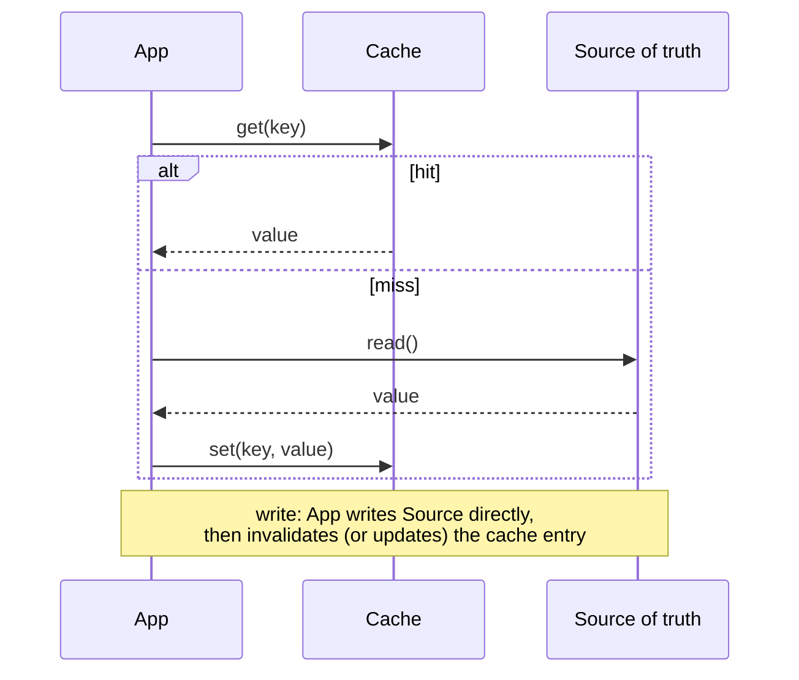
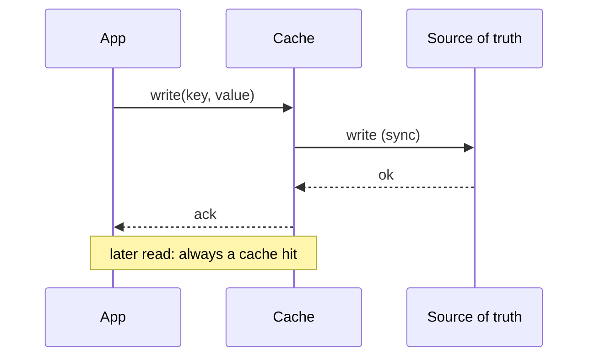
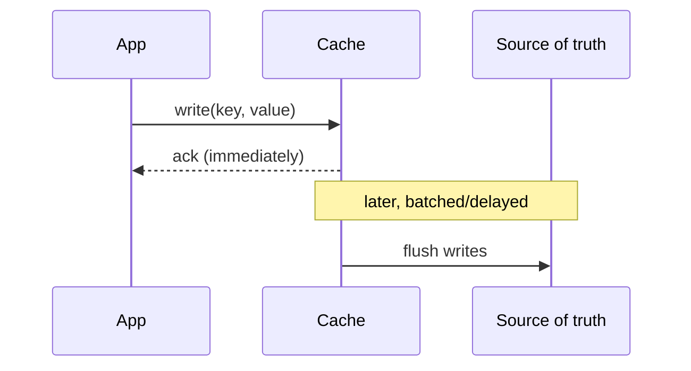
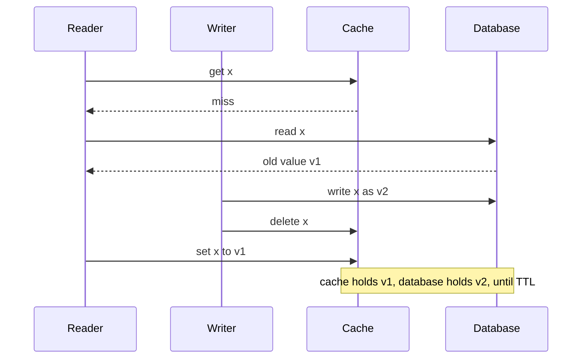

# Caching

A cache stores a derived, disposable copy of data close to where it's read, to cut latency and load on the source of truth. Before adding one, answer: what's the source of truth, what's the cache key, what's the value shape, what's the TTL, how does invalidation happen, and what happens when the cache is unreachable. If you can't answer the last question, you haven't designed a cache — you've designed a second, undeclared source of truth.

## Cache-aside, write-through, write-back

**Cache-aside (lazy loading)** is the default pattern. The application owns both reads and writes explicitly.



Why default to it: the application controls exactly what gets cached and when, and the cache can be wiped or removed entirely without losing data — the source of truth is untouched. Weakness: a miss (cold start, eviction, expiry) means the first reader pays full source latency, and if many callers miss the same key at once, they can stampede the source together.

**Write-through** writes go through the cache, which synchronously writes to the source of truth before acknowledging.



Cache and source stay consistent by construction, and reads are simple — no miss-then-populate dance. Cost: every write pays cache-write latency plus source-write latency, and a cold cache still needs a read-side cache-aside fallback for keys it's never seen. Choose write-through over cache-aside when read-after-write consistency through the cache matters more than write latency, and writes are not the dominant load.

**Write-back (write-behind)** writes go to the cache immediately and are acknowledged, then flushed to the source of truth asynchronously (batched or delayed).



> ⚠️ If the cache dies between the ack and the flush, the write is gone — the caller was already told it succeeded. That's the trade you're making, not an edge case to patch later.

Fastest write path and can batch/coalesce many writes into fewer source writes — good for high write-volume, bursty workloads (metrics counters, view counts). Cost: a cache failure before the flush completes loses data that was already acknowledged to the caller — this is the pattern most likely to violate "cache is disposable." Only use it when the data is either reconstructible, tolerant of loss (approximate counters), or the cache layer itself is made durable enough to be trusted (which usually means it's no longer "just a cache").

| Pattern | Write latency | Read latency (after write) | Data-loss risk on cache failure | Use when |
|---|---|---|---|---|
| Cache-aside | Source-write only | Cache hit fast, first-miss slow | None — source is always current | Default; read-heavy, tolerant of a miss stampede with mitigation |
| Write-through | Cache + source, sync | Always hits | None — source updated before ack | Need read-after-write consistency, moderate write volume |
| Write-back | Cache only, async flush | Always hits | Real — acked writes can be lost | Very high write volume, loss-tolerant or batchable data |

## Cache key, TTL, and invalidation design

- **Key**: encode everything the value depends on — user ID, locale, <abbr title="Application Programming Interface">API</abbr> version, filter parameters. A key that's too coarse serves wrong data to some callers; too fine and you fragment the cache and tank hit rate.
- **TTL**: bound by the product's actual staleness tolerance, not a default. "Product price" and "user's last-seen timestamp" do not deserve the same TTL.
- **Invalidation**: either let TTL expire it naturally, or explicitly invalidate/update on write. Explicit invalidation is more correct but couples the write path to every place that might have cached the value — miss one and you serve stale data indefinitely. TTL-only is simpler and self-healing but bounds correctness by TTL length, not by "immediately."

## Stampede mitigation

A stampede happens when many concurrent requests miss the same key at once (cold start, mass expiry, evicted hot key) and all fall through to the source simultaneously, multiplying load by however many callers were waiting.

| Technique | Mechanism |
|---|---|
| TTL jitter | Randomize TTL by ±some percent per key so millions of entries set at the same time don't all expire in the same second. |
| Request coalescing (single-flight) | The first miss for a key triggers the source fetch; concurrent misses for the same key wait on that one in-flight fetch instead of issuing their own. |
| Stale-while-revalidate | Serve the (slightly) expired value immediately while one background request refreshes it, instead of making every caller wait on a fresh fetch. |
| Negative caching | Cache "not found" results too (short TTL), so a burst of lookups for a nonexistent key doesn't hammer the source repeatedly. |

```arch
%% caption: The same 1000 concurrent misses, without and with request coalescing.
group wo "Without coalescing" color=red icon=warn
node a1 "1000 concurrent misses" at 0,0 in wo color=red
node a2 "1000 source queries" at 0,1 in wo color=red
node a3 "Source falls over" at 0,2 in wo color=red
group w "With coalescing" color=green icon=check
node b1 "1000 concurrent misses" at 1,0 in w color=green
node b2 "1 source query" at 1,1 in w color=green sub="999 wait on it"
node b3 "Source sees 1 extra query" at 1,2 in w color=green
a1 -> a2 -> a3
b1 -> b2 -> b3
```

## Hot-key mitigation

A single very popular key (viral post, trending product) can exceed what one cache node/shard can serve even though the overall cluster has headroom — the problem is concentration, not aggregate capacity. Detect it with per-key <abbr title="Queries Per Second - A common metric used to measure the rate of traffic passing through a particular server or system.">QPS</abbr> metrics, not just aggregate hit rate. Mitigate with a small number of replicas of that specific key across nodes (spread the read load), or a short-TTL local/in-process near-cache in front of the shared cache tier so the hottest keys never even leave the calling process. Don't replicate every key uniformly — that trades away the cache's memory efficiency for a problem only a handful of keys actually have.

## Cache outage behavior

> 🎯 "What happens when your cache goes down?" is one of the most common system-design follow-ups, precisely because a rehearsed architecture diagram rarely covers it. Have the fail-open-with-a-timeout answer ready, by name.

The cache must never be the only copy of anything the business depends on. State this explicitly for every cached value: "if this cache vanished right now, would any fact be lost?" If yes, that value doesn't belong in a cache-only pattern (see write-back's risk above) — either write through, or store it durably first and cache is purely additive.

When the cache is unreachable, the correct default is fail open to the source with a short deadline: give the cache a tight timeout, and on timeout or error, read the source directly rather than blocking or erroring the whole request. This turns a cache outage into a latency and source-load problem, not a correctness or availability problem — but only if the source has headroom (or a load-shedding plan) to absorb the full traffic that the cache was previously absorbing. Size that headroom deliberately; a cache outage without source headroom is just a delayed full outage. This is the same "cache is never truth" posture worked through end-to-end, with consistent hashing, coalescing, and replica sizing, in `solutions/018_distributed_cache_solution.md` — that file is the full system design; this one is the primer underneath it.

## Eviction policies

When memory is full the cache must choose a victim, and that choice decides your hit ratio at a given memory size. Memory is the cost driver of a cache, so eviction quality is money.

- **<abbr title="Least Recently Used - A cache replacement policy that discards the least recently used items first when the cache reaches its capacity.">LRU</abbr>** evicts the key unused for longest. It suits recency-skewed traffic and is easy to reason about. Exact <abbr title="Least Recently Used - A cache replacement policy that discards the least recently used items first when the cache reaches its capacity.">LRU</abbr> needs a linked list reordered on every hit, a shared mutation on the hot path, so real systems approximate it. **Redis** keeps no global list: it samples `maxmemory-samples` keys (default 5) and evicts the one idle longest, which costs a timestamp per key instead of two list pointers. Raising the sample count to 10 gets close to true <abbr title="Least Recently Used - A cache replacement policy that discards the least recently used items first when the cache reaches its capacity.">LRU</abbr> for more <abbr title="Central Processing Unit - The primary component of a computer that acts as its 'brain', executing instructions of a computer program.">CPU</abbr> (Redis docs, "Using Redis as an <abbr title="Least Recently Used - A cache replacement policy that discards the least recently used items first when the cache reaches its capacity.">LRU</abbr> cache"). **CLOCK** arranges entries in a ring with a reference bit that a hit sets and a sweeping hand clears, giving a "second chance" to recently used entries. A hit then writes one bit and reorders nothing, which is why operating systems favour it.
- **<abbr title="Least Frequently Used. A cache replacement policy that discards the least frequently used items first.">LFU</abbr>** evicts the least frequently used key. It wins when popularity is stable, such as a product catalogue. Pure counts never forget, so yesterday's hot key lingers. Redis 4.0 offers `allkeys-lfu` with a small probabilistic counter that decays (`lfu-decay-time`).
- **ARC** (Megiddo and Modha, FAST 2003) keeps a recency list and a frequency list, plus "ghost" lists of recently evicted keys, and shifts the boundary toward whichever list would have earned more hits. It adapts without tuning, at the price of extra metadata and complexity.
- **TinyLFU and W-TinyLFU** (Einziger, Friedman, Manes, "TinyLFU: A Highly Efficient Cache Admission Policy", ACM Transactions on Storage, 2017) split *admission* from *eviction*. A new key enters only if its estimated frequency beats the would-be victim's. Frequencies live in a compact approximate counter that is periodically halved so old popularity fades. W-TinyLFU puts a small <abbr title="Least Recently Used - A cache replacement policy that discards the least recently used items first when the cache reaches its capacity.">LRU</abbr> window in front (1% of the cache in the paper) so a burst of new keys can build a count before facing the filter. The Caffeine cache for Java implements it.
- **Size-aware eviction.** One 5 MB value displaces 5,000 values of 1 KB. Evict by expected benefit per byte, meaning hit probability times miss cost divided by size. GDSF (Cherkasova, 1998) is the classic form. The cheap version caps object size at admission or sends large values to their own pool ([30_social_graph_and_caching_at_scale.md](30_social_graph_and_caching_at_scale.md) covers pools).
- **Scan resistance.** One pass over 10^7 keys that will not be read again flushes a plain <abbr title="Least Recently Used - A cache replacement policy that discards the least recently used items first when the cache reaches its capacity.">LRU</abbr> of its whole hot set. Defences are segmented <abbr title="Least Recently Used - A cache replacement policy that discards the least recently used items first when the cache reaches its capacity.">LRU</abbr> or 2Q (a key must be hit twice to be promoted), an admission filter like TinyLFU, or a separate pool for batch traffic.

| Policy | Wins when | Loses when | Cost |
|---|---|---|---|
| <abbr title="Least Recently Used - A cache replacement policy that discards the least recently used items first when the cache reaches its capacity.">LRU</abbr> (or sampled <abbr title="Least Recently Used - A cache replacement policy that discards the least recently used items first when the cache reaches its capacity.">LRU</abbr>) | Recency-skewed traffic, simple operations | Scans, floods of one-hit keys | List mutation per hit, or sampling <abbr title="Central Processing Unit - The primary component of a computer that acts as its 'brain', executing instructions of a computer program.">CPU</abbr> |
| CLOCK | Same as <abbr title="Least Recently Used - A cache replacement policy that discards the least recently used items first when the cache reaches its capacity.">LRU</abbr>, with cheap concurrent hits | Same as <abbr title="Least Recently Used - A cache replacement policy that discards the least recently used items first when the cache reaches its capacity.">LRU</abbr> | One bit per entry |
| <abbr title="Least Frequently Used. A cache replacement policy that discards the least frequently used items first.">LFU</abbr> | Stable popularity, scan-heavy traffic | Popularity shifts, unless counters decay | Counter per key |
| ARC | Traffic that swings between recency and frequency | Memory-tight caches, since ghost lists cost metadata | Two lists plus two ghost lists |
| W-TinyLFU | Skewed traffic with scans and bursts | Little gain on pure-recency traces | Sketch plus window, more code |
| Size-aware (GDSF) | Wide spread of object sizes | Uniform sizes, where it reduces to <abbr title="Least Frequently Used. A cache replacement policy that discards the least frequently used items first.">LFU</abbr>-like | Size tracking |

**A hit-ratio sensitivity example (computed).** Take Zipf popularity with exponent 1 (key *i* is requested with probability proportional to 1/*i*) over 10^6 keys, and a cache that holds the *C* most popular keys, which is what an ideal frequency policy converges to. The hit ratio is H(*C*) ÷ H(10^6), where H is the harmonic sum of 1/*i*. At 100k requests/s:

| Cache size C | Share of keys | Hit ratio | Origin load |
|---|---|---|---|
| 1,000 | 0.1% | 52.0% | 48k/s |
| 10,000 | 1% | 68.0% | 32k/s |
| 100,000 | 10% | 84.0% | 16k/s |
| 200,000 | 20% | 88.8% | 11.2k/s |

Ten times the memory (1% to 10%) halves origin load, and the next doubling cuts it only 30% more (16k to 11.2k), so memory has sharply diminishing returns under a Zipf(1) curve. Real hit ratios of 95% or more come from more skewed traffic or a small working set. Now the policy gap, from a seeded simulation I ran (10^5 keys, Zipf exponent 1, cache of 1,000 keys, 10^6 requests): ideal frequency caching hits 61.9%, plain <abbr title="Least Recently Used - A cache replacement policy that discards the least recently used items first when the cache reaches its capacity.">LRU</abbr> hits 50.6%. That 11-point gap means <abbr title="Least Recently Used - A cache replacement policy that discards the least recently used items first when the cache reaches its capacity.">LRU</abbr> sends 0.494 ÷ 0.381 = 1.3× the origin traffic. Interleave one never-repeated scan key per real request and <abbr title="Least Recently Used - A cache replacement policy that discards the least recently used items first when the cache reaches its capacity.">LRU</abbr>'s hit ratio on real keys falls to 41.9%, or 1.5× the ideal's origin load, while an admission filter that refuses one-hit keys leaves the resident hot set alone. Your traffic differs, so **decision rule:** default to the store's own policy (`allkeys-lru` or `allkeys-lfu` for a pure Redis cache, Caffeine in the <abbr title="Java Virtual Machine. An abstract computing machine that enables a computer to run a Java program.">JVM</abbr>), and if hit ratio matters enough to tune, replay a real trace against candidate policies instead of guessing.

## TTL expiry, memory limits, and fragmentation

**Expiry is lazy plus sampled.** A key is not removed the instant its TTL passes. Redis expires passively when a client touches the key, and actively by sampling: as its `EXPIRE` documentation describes, ten times a second it tests 20 random keys that have a TTL, deletes the expired ones, and repeats if more than 25% were expired (details vary by version). Memcached likewise checks on access and has a background crawler that reclaims expired items. Two consequences: expired-but-unread keys can hold memory for a while, so "TTL passed" does not mean "memory freed"; and keys given the same deadline expire in a wave that hits <abbr title="Central Processing Unit - The primary component of a computer that acts as its 'brain', executing instructions of a computer program.">CPU</abbr> and then the origin, which is why TTL jitter appears under stampede mitigation above.

**Memory limits.** Set an explicit ceiling (`maxmemory` in Redis) and an eviction policy. The `volatile-*` policies evict only keys that have a TTL, so on a cache where keys lack TTLs they behave like `noeviction` and writes start failing. For a pure cache use an `allkeys-*` policy.

**Fragmentation.** Memcached's slab allocator stores each item in the smallest chunk that fits, and chunk sizes grow by a factor of 1.25 by default. An item just above one chunk size lands in a chunk 25% larger, wasting 0.25 ÷ 1.25 = 20% in the worst case and about 10% on average for evenly spread sizes. Memory pages assigned to a slab class stay there until rebalanced, so when the item-size mix shifts one class starves while another holds idle pages (memcached has a slab rebalancer for this). In Redis, compare `mem_fragmentation_ratio` (resident memory over used memory) and consider `activedefrag`. If you snapshot with fork, copy-on-write can double memory under heavy writes, so leave headroom.

**Decision rule:** plan capacity as data × (1 + per-key overhead + fragmentation) ÷ the fraction of <abbr title="Random Access Memory - A form of computer memory that can be read and changed in any order, typically used to store working data.">RAM</abbr> you let the cache use, and alert on evictions per second and the fragmentation ratio as well as hit ratio.

## Cache invalidation races

The classic race with cache-aside is a **set after delete**. The reader misses, reads the old row, and is slow. The writer commits the new row and deletes the key. The reader then finishes and sets its old value, which nothing will remove until the TTL fires.



| Approach | How it closes the race | Cost |
|---|---|---|
| TTL as backstop | Bounds staleness to the TTL. Every design needs this | Staleness up to the full TTL |
| Delete twice, second after a delay | Second delete removes a stale set that landed in the window | A guess: the delay must exceed read latency plus replication lag |
| Lease token | The miss returns a token, a delete voids it, and a set with a voided token is rejected. See [30_social_graph_and_caching_at_scale.md](30_social_graph_and_caching_at_scale.md) for the Facebook design | Extra round trip and cache support |
| Versioned values | Store `(version, value)` using the row version or commit position, and let a set succeed only if its version is at least the cached one, via compare-and-set or a script. Keep a short-lived tombstone with a version instead of a bare delete, or a stale set finds nothing to compare against | Version on every row and an atomic cache operation |
| CDC-driven invalidation | Tail the database commit log and apply invalidations in commit order, so there is no application dual write and no crash between commit and delete | Pipeline latency (assume sub-second) and an extra system. The fill race still needs a lease or version |

**Delete versus update.** Updating the cache from the writer avoids the miss after a write, but two writers can commit *v1* then *v2* and deliver their cache sets as *v2* then *v1*, leaving *v1* cached indefinitely. Deletes are idempotent and order-insensitive, so the default is to delete on write and let the next reader refill. Update in place only when values carry versions the cache enforces.

> 🎯 "How do you keep the cache and the database consistent?" Answer in five steps: the database is the source of truth and the cache is derived. Write the database, then delete the key after commit. Every entry has a TTL as the outer bound. For hot or critical keys, add a lease or versioned compare-and-set to close the set-after-delete race. Feed invalidations from the commit log (CDC) so a crash between commit and delete cannot strand a stale entry. Then say the honest limit: this is bounded staleness, not linearizability, and for the writer's own next read you route to the primary or set a short-lived "recently written" marker.

## Layered caching

A request can hit six caches before it reaches the disk. Each layer has its own key, lifetime and invalidation mechanism, and you must know which of them you control.

| Layer | Key | Typical TTL (example) | Invalidation | Watch out for |
|---|---|---|---|---|
| Browser | URL plus `Vary` headers | `max-age` of seconds to a year | Fingerprinted URLs (new content, new URL). You cannot purge a browser | Anything you cannot version is stale for the full lifetime |
| <abbr title="Content Delivery Network - A geographically distributed network of proxy servers and their data centers used to deliver content with low latency.">CDN</abbr> or edge | URL plus normalized headers and query | `s-maxage` of tens of seconds to hours | Purge <abbr title="Application Programming Interface">API</abbr> or surrogate keys ([29_cdn_and_streaming_media.md](29_cdn_and_streaming_media.md)) | Cookies or random query params in the key kill hit ratio |
| App-local (in-process) | Domain key | 1 to 10 seconds | TTL only, or a pub/sub broadcast | Instances disagree, memory is multiplied by fleet size |
| Distributed (Redis, Memcached) | Domain key | Seconds to hours | Delete on write, CDC, leases | Network hop of about a millisecond, hot keys ([25_partitioning_and_hot_keys.md](25_partitioning_and_hot_keys.md)) |
| Database buffer pool | Page id | None, replacement policy | Automatic, since writes update pages in place | Cold after a restart, sized by <abbr title="Random Access Memory - A form of computer memory that can be read and changed in any order, typically used to store working data.">RAM</abbr> you buy |

```arch
%% caption: Each layer removes a share of the traffic, so with these assumed hit ratios only 1.4 of 100 requests reach the database and 0.07 reach disk.
node R "100 requests" at 0,0 shape=pill color=slate
node B "Browser" at 1,0 icon=browser sub="30% hit"
node CD "CDN" at 2,0 icon=cdn sub="60% hit"
node L "App-local" at 3,0 icon=cache sub="50% hit"
node RD "Redis" at 3,1 icon=redis sub="90% hit"
node DB "DB buffer pool" at 2,1 icon=db sub="95% hit"
node DK "Disk" at 1,1 icon=disk
R -> B
B -> CD : "70"
CD -> L : "28"
L -> RD : "14"
RD -> DB : "1.4"
DB -> DK : "0.07"
```

**Staleness adds up.** With no invalidation, a write at time zero can still be served after the sum of the layer TTLs, because each layer may have just fetched from the one behind it. With Redis at 300 s, app-local 5 s, <abbr title="Content Delivery Network - A geographically distributed network of proxy servers and their data centers used to deliver content with low latency.">CDN</abbr> 60 s and browser 30 s, the worst case is 300 + 5 + 60 + 30 = 395 s. So give the product's staleness budget to the layers as a *split*, not to each layer in full. **Decision rule:** cache as close to the user as the data's staleness tolerance and shareability allow, and remember every layer you add is another one to invalidate.

## Sizing and hit-ratio math

Average latency is h·t_cache + (1 − h)·t_source, where *h* is the hit ratio. If a miss also pays the failed lookup, add t_cache to the miss term. With t_cache = 1 ms and t_source = 20 ms:

| Hit ratio | Average latency | Origin load at 100k req/s |
|---|---|---|
| 90% | 0.9 × 1 + 0.1 × 20 = 2.9 ms | 10,000/s |
| 99% | 0.99 × 1 + 0.01 × 20 = 1.19 ms | 1,000/s |
| 99.9% | 0.999 × 1 + 0.001 × 20 = 1.02 ms | 100/s |

Average latency barely moves between 99% and 99.9% (1.19 ms to 1.02 ms), but **origin load drops 10×**, because origin traffic is (1 − h) × Q and 1 − h goes from 0.01 to 0.001. That is why the last nines of hit ratio are about protecting the source and its capacity bill. The tail behaves the same way: if more than 1% of requests miss, the p99 is the miss path (about 21 ms here), and only above about 99% hits does p99 equal the cache's own latency.

**Memory example.** Suppose the working set is 200M keys of 500 B values plus 64 B of key and metadata overhead each: 200M × 564 B = 113 GB. Add slab rounding of about 10% for 124 GB. If you let the cache use 75% of <abbr title="Random Access Memory - A form of computer memory that can be read and changed in any order, typically used to store working data.">RAM</abbr>, you need 124 ÷ 0.75 = 165 GB of <abbr title="Random Access Memory - A form of computer memory that can be read and changed in any order, typically used to store working data.">RAM</abbr>, so 3 nodes of 64 GB, plus a replica each for availability, 6 in all. At 100k requests/s the primaries see about 33k each, well inside one node's capacity, so **capacity sets the fleet size, not <abbr title="Queries Per Second - A common metric used to measure the rate of traffic passing through a particular server or system.">QPS</abbr>**. Then check the two failure inputs: with an origin sized for 1,000/s, a 99% hit ratio is the contract, and dropping to 95% means 5,000/s. Alert on hit ratio and evictions per second, not on cache <abbr title="Central Processing Unit - The primary component of a computer that acts as its 'brain', executing instructions of a computer program.">CPU</abbr>.

## Cold start and warm-up

A cold cache (new node, restart, failover, deploy that changes the key format) has a hit ratio near 0, so the origin sees the full request rate, 100× the 1,000/s it normally serves in the example above. Warm-up strategies, from cheapest to most involved:

- **Gradual ramp.** Shift traffic to the cold cache in steps as its hit ratio recovers. If the origin can take 5,000/s and the offered load is 100k/s, the admissible traffic fraction is 5,000 ÷ (100,000 × (1 − h)) = 0.05 ÷ (1 − h):

| Cache hit ratio | Traffic you can admit |
|---|---|
| 0% | 5% |
| 50% | 10% |
| 80% | 25% |
| 90% | 50% |
| 95% | 100% |

- **Pre-warm the hot keys.** Replay the top keys from an access log or a snapshot before taking traffic. Under the Zipf(1) example above, the top 10,000 keys give a 68% hit ratio and load at 5,000 keys/s in about 2 s. The top 100,000 give 84% in about 20 s, after which the admissible fraction is already about 30%. Rate-limit the loader and coalesce it with single-flight so warming does not itself stampede the source.
- **Warm from a peer.** Let the cold cache read from a warm cache instead of the database. Facebook's cold-cluster warm-up does this and needs a hold-off on deletes to avoid inserting stale data ([30_social_graph_and_caching_at_scale.md](30_social_graph_and_caching_at_scale.md)).
- **Mirror or shadow traffic.** Send a copy of reads to the new cache and discard the responses, so it fills before it is live.
- **Persist the cache.** Snapshots (for example Redis RDB) let a restarted node reload in minutes. Reloaded entries may be stale, so combine with TTLs or versions, and treat the file as an accelerator, never as truth.
- **Consistent hashing when scaling.** Adding one node to N remaps about 1/(N+1) of the keys, so a resize is a small cold start, not a full one.

**Decision rule:** never send full traffic to a cold cache. Compute the admissible fraction from origin headroom, pre-warm the top keys, and ramp.

## Related building blocks

- [05_databases.md](05_databases.md)
- [06_database_internals.md](06_database_internals.md)
- [12_application_resilience_patterns.md](12_application_resilience_patterns.md)
- [13_scaling_and_load_balancing.md](13_scaling_and_load_balancing.md)
- [15_observability_and_reliability.md](15_observability_and_reliability.md)
- [25_partitioning_and_hot_keys.md](25_partitioning_and_hot_keys.md)
- [29_cdn_and_streaming_media.md](29_cdn_and_streaming_media.md)
- [30_social_graph_and_caching_at_scale.md](30_social_graph_and_caching_at_scale.md)
- [../solutions/018_distributed_cache_solution.md](../solutions/018_distributed_cache_solution.md)
