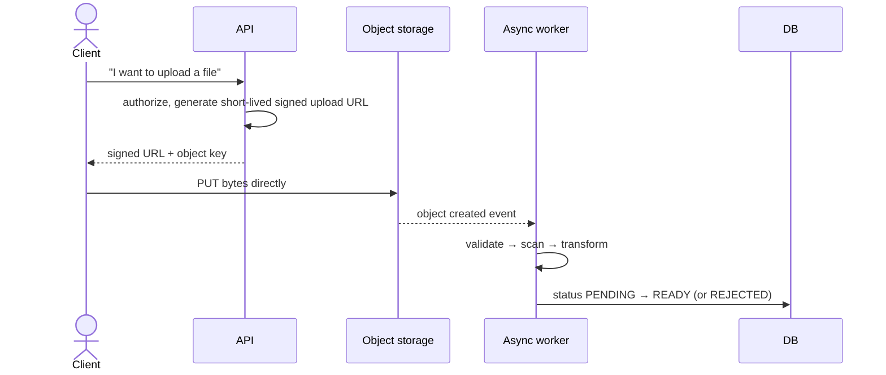
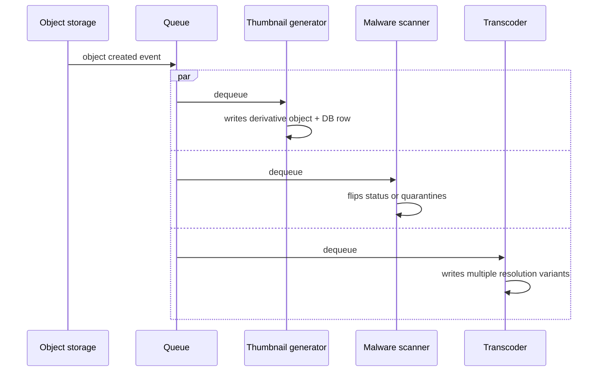

# Object Storage

Object storage (S3-like) holds large, unstructured blobs — images, video, documents, backups, exports — as opaque objects addressed by key, with metadata but no query language. It is not a database and not a filesystem; treat it as durable, cheap, horizontally-scaled bytes-at-rest, and keep everything queryable (owner, status, content hash, size, access rules) in your actual database instead.

This file starts with what an object store is and how it works inside, then goes as deep as a
senior design round: presigned URLs built from scratch, a durability model comparing replication
with erasure coding, multipart uploads measured on a flaky link, lifecycle tiers costed, how to
serve objects, and a worked photo-upload design.

## Foundations — What an Object Store Is

### The interface is deliberately small

An object store offers a handful of operations on a flat namespace of keys inside a bucket:

| Operation | What it does |
|---|---|
| `PUT key` | Store a whole object (bytes plus a little metadata), replacing any previous one |
| `GET key` | Read the object, or a byte range of it (`Range: bytes=0-1048575`) |
| `DELETE key` | Remove it (or, with versioning on, hide it behind a delete marker) |
| `LIST prefix` | List keys in sorted order that start with a prefix, a page at a time |
| `HEAD key` | Read size, content type, checksum (ETag) and custom metadata without the bytes |

What is missing matters as much. There is no "change bytes 100–200 of this object", no append on
most stores, no rename (a "rename" is copy + delete), no query by anything but key and prefix, and
no transactions across objects. Objects are **immutable blobs replaced whole**. That restriction
is what lets the store spread exabytes across hundreds of thousands of disks: with no in-place
updates there is nothing to lock, and every copy of an object is either the old version or the new
one.

"Folders" don't exist. `photos/2026/09/a.jpg` is one key; consoles draw folders by splitting keys on
`/`, and `LIST photos/2026/` is a range scan over the sorted keys.

### What sits behind the API

```arch
%% caption: A PUT goes through a stateless front end; the metadata service records where the fragments live, and the data lives on storage nodes in several zones.
node client "Client" at 0,0 icon=client color=blue
node fe "Front end\n(auth, routing)" at 2,0 icon=api color=slate
node meta "Metadata / index\n(key → fragments)" at 4,0 icon=kv color=purple
group zones "Storage nodes, 3 zones" color=green style=dashed
node z1 "Zone A disks" at 0,2 in zones icon=storage
node z2 "Zone B disks" at 2,2 in zones icon=storage
node z3 "Zone C disks" at 4,2 in zones icon=storage

client -> fe : "PUT / GET"
fe -> meta : "lookup / commit"
fe -> z1 : "fragments"
fe -> z2
fe -> z3
```

1. The **front end** authenticates the request, checks the signature or IAM policy, and streams
   the bytes.
2. The bytes are split into fragments and written to **storage nodes** in several failure domains
   (disks, racks, zones), as full replicas or as erasure-coded pieces.
3. Only after enough fragments are durable does the **metadata service** commit "key → this
   version, these fragment locations". That commit is the moment the PUT succeeds, which is why a
   crashed upload leaves no half-written object.
4. A GET looks the key up in the metadata, fetches enough fragments, and streams the object back.

The metadata service is a large, partitioned, sorted key-value store (the same design as
[Databases: Source of Truth](05_databases.md) and [Partitioning, Shard Keys, and Hot Keys](25_partitioning_and_hot_keys.md)). The storage nodes are simple and
numerous. That split is why listing is a range scan, why per-prefix request rates are limited and
then split automatically, and why the store can be both huge and strongly consistent.

### Consistency

Major object stores (Amazon S3 since December 2020, Google Cloud Storage, Azure Blob Storage) give
strong read-after-write consistency: after a successful PUT, every GET and LIST sees the new
object. Two things still aren't consistent:

- **Anything in front of the store.** A CDN or cache holding the old bytes keeps serving them until
  it expires or is purged. That is why published objects should use **versioned keys**
  (`avatar/u17/3f9a.jpg`, new key on every change) instead of overwriting `avatar/u17.jpg`.
- **Your database versus the store.** Writing the row and the object are two separate operations,
  so a crash between them leaves an orphan object or a row pointing at nothing. The `PENDING`
  row pattern below exists for that reason.

### Vocabulary

| Term | Meaning |
|---|---|
| Bucket | A namespace of keys with its own permissions, region and lifecycle rules |
| Key / prefix | An object's full name; the leading part used to list or apply rules |
| ETag / checksum | A hash that identifies the object's content; used for integrity and conditional requests |
| Versioning | Keeping old versions on overwrite and delete, so mistakes can be undone |
| Presigned URL | A URL carrying a signed, expiring permission for one operation on one key |
| Multipart upload | Uploading an object as independent parts, then committing them as one |
| Erasure coding | Splitting data into k pieces plus m parity pieces, any k of which rebuild it |
| Durability vs availability | The chance the bytes still exist vs the chance you can read them right now |
| Lifecycle rule | A policy that moves objects to cheaper tiers or deletes them by age or prefix |

## Why not a DB BLOB or a filesystem on one box

| Option | Problem |
|---|---|
| BLOB column in the relational DB | Bloats table/index size, slows backups and replication (the whole row set now includes megabytes of binary), and burns transactional-database capacity on something that doesn't need transactions or joins. |
| Filesystem on a single application/box | Not durable past that box (no built-in replication), doesn't scale past that disk, and ties file availability to that specific instance being up — breaks the "any healthy instance can serve" property of a stateless app tier. |
| Object storage | Durable by replication across the service, scales independently of the app tier, and the app never touches the bytes directly — it just authorizes access. |

The rule: your database holds the *fact* that an object exists and its metadata; object storage holds the *bytes*. Losing the bytes and losing the fact are different failure modes and should be handled separately.

## Direct/presigned upload flow


```arch
%% caption: By generating a presigned URL, the API server authorizes the upload without handling the large payload bytes itself.
node client "Client" at 0,1 icon=client color=blue
node api "API Server\n(Generates URL)" at 2,0 icon=server color=slate
node obj "Object Storage\n(S3 / GCS)" at 2,2 icon=db color=green

client -> api : "1. Request upload URL"
api ..> client : "2. Signed URL"
client ==> obj : "3. Direct PUT bytes"
```
Routing large file bytes through your application servers wastes their capacity on pass-through I/O and pushes bandwidth cost onto infrastructure that should be doing business logic. Let the client upload directly to object storage instead, authorized by a short-lived signed URL.



The API server never sees the file bytes — it only issues authorization. This is the same shape as the CDN/edge principle: keep large-byte traffic off the tier that runs your business logic.

## Content validation after upload

Never trust a client-supplied MIME type, filename, or file extension — a client can label anything `image/png` and it's just a request header, not a guarantee about the bytes. After upload, a worker must:

- Sniff the actual content type from the byte signature (magic bytes), not the client's claimed `Content-Type`.
- Reject or re-derive the extension/type from the real content, not the filename.
- Run malware/virus scanning before the object is marked usable, for anything a user can upload and another user can later retrieve.
- Enforce size limits server-side (signed URL can cap size, and the worker double-checks).

The object's DB row should stay in a `PENDING`/`UNVERIFIED` state — not linkable or servable to other users — until validation completes and flips it to `READY`. This closes the gap where a client uploads something malicious and other users could fetch it before scanning finishes.

## Event-driven post-processing

Object storage upload events are the natural trigger for everything that has to happen to the object before it's usable: thumbnailing an image, transcoding a video into multiple resolutions, extracting text from a document, running a malware scanner. This keeps heavy transformation work off the request path entirely — the upload succeeds immediately, and derivative generation happens asynchronously.



See [Messaging and Streaming](09_messaging_and_streaming.md) for the queue/worker mechanics (visibility timeout, retries, DLQ) that make this reliable — an object storage event is just another producer into that same async-work machinery.

## Lifecycle tiers and expiry

Object storage classes typically split into hot (frequent access, higher per-GB cost), cool/infrequent-access (cheaper storage, retrieval fee), and archive (cheapest storage, slow/expensive retrieval, meant for compliance retention or backups nobody expects to read soon). Define a lifecycle policy per object class up front:

| Tier | Use for | Cost shape |
|---|---|---|
| Hot | Actively served user content (profile photos, current catalog images). | Higher storage cost, cheap/fast retrieval. |
| Cool/infrequent | Older content still occasionally accessed (past order invoices). | Lower storage cost, retrieval fee applies. |
| Archive | Compliance retention, backups, rarely-if-ever read. | Lowest storage cost, slow and costly to retrieve. |

Automate the transition (e.g., "move to cool after 90 days of no access") and set explicit expiry for anything with a retention policy — logs, temp exports, expired user uploads — rather than relying on someone to remember to delete it manually.

## Multipart / resumable upload

For large files (video, large datasets), a single PUT is fragile — one network blip and the whole upload restarts. Multipart upload splits the file into chunks uploaded independently (and in parallel), each acknowledged separately, with a final "complete multipart upload" call that stitches the parts together server-side. This bounds retry cost to one failed chunk instead of the whole file, and enables resuming an interrupted upload from where it left off rather than from zero. Use it above a size threshold (commonly a low tens-of-MB cutoff) — below that, the coordination overhead isn't worth it.

## Delete propagation to derivatives

Deleting an object is rarely just one object. A user photo might have a thumbnail, a few resized variants, and a CDN-cached copy. Deleting the source object without propagating to its derivatives leaves orphaned data (a compliance problem for user-requested deletion) and dangling references (a correctness problem — code that expects the thumbnail to exist). Track derivative relationships in the DB (a `parent_object_id` or similar), and make delete a workflow: mark source deleted → enqueue derivative cleanup → invalidate any CDN cache entries → confirm all derivatives gone before considering the delete complete. Treat "delete" the same way you'd treat any other multi-step operation with partial-failure risk — see the saga pattern in [Application Resilience Patterns](12_application_resilience_patterns.md).

## Presigned URLs, built

The upload flow above rests on one mechanism: the API server signs a description of exactly one
permitted operation, and the object store verifies that signature without calling the API server
back. Here it is in thirty lines, including the content sniffing a worker should do afterwards:

```python
"""A presigned URL is a request the server has already authorised: method, key,
limits and expiry, signed with a secret only the server and the object store
share. The store checks the signature; the client can't change any signed part."""
import hashlib, hmac
from urllib.parse import urlencode, parse_qs, urlparse

SECRET = b"shared-between-api-and-object-store"


def sign(method, key, expires_at, max_bytes):
    msg = f"{method}\n{key}\n{expires_at}\n{max_bytes}".encode()
    return hmac.new(SECRET, msg, hashlib.sha256).hexdigest()


def presign(method, key, ttl_s, max_bytes, now):
    exp = int(now + ttl_s)
    q = urlencode({"exp": exp, "max": max_bytes, "sig": sign(method, key, exp, max_bytes)})
    return f"https://store.example/{key}?{q}"


def store_accepts(method, url, body_len, now):
    u = urlparse(url)
    key, q = u.path.lstrip("/"), {k: v[0] for k, v in parse_qs(u.query).items()}
    expected = sign(method, key, q["exp"], q["max"])
    if not hmac.compare_digest(expected, q["sig"]):
        return "403 signature mismatch"
    if now > int(q["exp"]):
        return "403 expired"
    if body_len > int(q["max"]):
        return "413 too large"
    return "200 stored"


now = 1_760_000_000                       # a fixed clock, so the output is reproducible
url = presign("PUT", "uploads/u17/3f9a.jpg", ttl_s=300, max_bytes=10_000_000, now=now)
print(url[:60] + "...")
cases = [
    ("as issued",             "PUT", url, 2_400_000, now + 10),
    ("after 10 minutes",      "PUT", url, 2_400_000, now + 600),
    ("file too large",        "PUT", url, 50_000_000, now + 10),
    ("key changed",           "PUT", url.replace("u17", "u18"), 2_400_000, now + 10),
    ("limit raised in URL",   "PUT", url.replace("max=10000000", "max=99000000"), 50_000_000, now + 10),
    ("used for GET",          "GET", url, 0, now + 10),
]
for name, method, u, size, t in cases:
    print(f"  {name:22} -> {store_accepts(method, u, size, t)}")

# Never trust the client's Content-Type: sniff the first bytes instead.
MAGIC = {b"\xff\xd8\xff": "image/jpeg", b"\x89PNG\r\n\x1a\n": "image/png",
         b"%PDF-": "application/pdf", b"MZ": "application/x-msdownload (Windows executable)"}

def sniff(data):
    return next((t for m, t in MAGIC.items() if data.startswith(m)), "unknown")

for claimed, data in [("image/jpeg", b"\xff\xd8\xff\xe0...JFIF"), ("image/png", b"MZ\x90\x00...")]:
    print(f"  claimed {claimed:10} sniffed {sniff(data)}")
```

```text
https://store.example/uploads/u17/3f9a.jpg?exp=1760000300&ma...
  as issued              -> 200 stored
  after 10 minutes       -> 403 expired
  file too large         -> 413 too large
  key changed            -> 403 signature mismatch
  limit raised in URL    -> 403 signature mismatch
  used for GET           -> 403 signature mismatch
  claimed image/jpeg sniffed image/jpeg
  claimed image/png  sniffed application/x-msdownload (Windows executable)
```

- Everything that matters is inside the signature: method, key, expiry and size limit. Changing
  the key, raising the limit or using the URL for a different method all fail, because the client
  can't produce a valid signature without the secret.
- The URL is a **bearer token** for its lifetime. Anyone who sees it can use it, so keep the expiry
  short (minutes), put a random component in the key, and never log full presigned URLs.
- The second half is why validation happens after upload: the client said `image/png`, the bytes
  are a Windows executable. Only the bytes are evidence.

Real stores (AWS Signature Version 4, GCS V4 signing) sign more fields, such as headers, region and
a hash of the payload, but the idea is the same. Downloads of private objects use the same
mechanism: the API checks the user may see the object, then returns a presigned GET that expires in
minutes.

## Durability: replication vs erasure coding, modelled

"Eleven nines" means the chance of losing a given object in a year is about 10⁻¹¹. Where does such
a number come from, and why do large stores use **erasure coding** instead of keeping three copies?

**Erasure coding in one paragraph.** Split an object into k data pieces and compute m parity
pieces, so that *any* k of the n = k + m pieces rebuild the object. The simplest case is one parity
piece: with data pieces A and B, store P = A XOR B; lose A and rebuild it as P XOR B. Reed–Solomon
codes generalise this to any m. RS(10,4) stores 14 pieces, survives any 4 losses, and uses 1.4× the
space, where 3-way replication survives 2 losses and uses 3×. The price: a read needs 10 nodes
instead of 1, and rebuilding one lost piece reads 10 others.

The model: each fragment sits on a different disk; disks fail at random; a failed fragment is
rebuilt elsewhere, taking about a repair time; data is lost only if more than n − k fragments are
down at once. It is small enough to solve exactly, and step 1 checks the exact solution against a
brute-force simulation at failure rates high enough to observe:

```python
"""How likely is an object to be lost? Store it as n fragments on n different
disks, any k of which can rebuild it (3-way replication is n=3, k=1). Disks fail
at random; a failed fragment is rebuilt elsewhere. Data is lost only if more than
n-k fragments are down at the same moment.

The model is a small Markov chain (state = fragments currently down). Step 1
checks the exact solution against a brute-force simulation at failure rates high
enough to observe; step 2 uses it at realistic rates, where losses are far too
rare to simulate."""
import random

HOURS_PER_YEAR = 8766


def mttdl_exact(n, k, fail_per_h, repair_h):
    """Mean hours until more than n-k fragments are down at once.
    State i = fragments down; failures at rate (n-i)*fail, repairs at rate i/repair_h."""
    f = n - k                                  # failures the stripe survives
    # T[i] = expected time to loss from state i; solve the tridiagonal system.
    size = f + 1
    A = [[0.0] * size for _ in range(size)]
    b = [0.0] * size
    for i in range(size):
        up, down = (n - i) * fail_per_h, i / repair_h
        A[i][i] = up + down
        if i + 1 < size:
            A[i][i + 1] = -up                  # moving to i+1 = f+1 means loss (T=0)
        if i > 0:
            A[i][i - 1] = -down
        b[i] = 1.0
    for c in range(size):                      # Gaussian elimination
        for r in range(c + 1, size):
            m = A[r][c] / A[c][c]
            for j in range(c, size):
                A[r][j] -= m * A[c][j]
            b[r] -= m * b[c]
    T = [0.0] * size
    for r in reversed(range(size)):
        T[r] = (b[r] - sum(A[r][j] * T[j] for j in range(r + 1, size))) / A[r][r]
    return T[0]


def mttdl_simulated(n, k, fail_per_h, repair_h, runs, seed=7):
    rng, total = random.Random(seed), 0.0
    for _ in range(runs):
        t, down = 0.0, 0
        while down <= n - k:
            up, rep = (n - down) * fail_per_h, down / repair_h
            t += rng.expovariate(up + rep)
            down += 1 if rng.random() < up / (up + rep) else -1
        total += t
    return total / runs


print("Step 1 - exact model vs simulation, at exaggerated rates (disk life 1,000 h, repair 100 h)")
for name, n, k in [("3 replicas", 3, 1), ("RS(6,3)", 9, 6)]:
    exact = mttdl_exact(n, k, 1 / 1000, 100)
    sim = mttdl_simulated(n, k, 1 / 1000, 100, runs=4000)
    print(f"  {name:11} exact {exact:9,.0f} h   simulated {sim:9,.0f} h")

def fmt(x):
    return f"{x:,.0f}" if x >= 1 else f"{x:.1e}"


print("\nStep 2 - realistic: 2% of disks fail per year")
afr = 0.02 / HOURS_PER_YEAR
print(f"  {'scheme':11} {'storage':>7}  {'P(lose object)/yr, 24 h repair':>31}  {'with 7-day repair':>18}  {'lost/yr of 10 billion (24 h)':>29}")
for name, n, k in [("2 replicas", 2, 1), ("3 replicas", 3, 1), ("RS(6,3)", 9, 6), ("RS(10,4)", 14, 10)]:
    row = [HOURS_PER_YEAR / mttdl_exact(n, k, afr, rh) for rh in (24, 168)]
    print(f"  {name:11} {n / k:6.1f}x  {row[0]:31.1e}  {row[1]:18.1e}  {fmt(row[0] * 1e10):>29}")

print("\nOne rack loses power: fragments on it are all unavailable at once")
for name, n, k, per_rack in [("3 replicas, same rack", 3, 1, 3), ("3 replicas, 3 racks", 3, 1, 1),
                             ("RS(10,4), 14 racks", 14, 10, 1), ("RS(10,4), 7 racks", 14, 10, 2), ("RS(10,4), 3 racks", 14, 10, 5)]:
    survives = n - per_rack >= k
    print(f"  {name:22} -> {'readable' if survives else 'UNAVAILABLE'}")
```

```text
Step 1 - exact model vs simulation, at exaggerated rates (disk life 1,000 h, repair 100 h)
  3 replicas  exact    46,833 h   simulated    46,556 h
  RS(6,3)     exact     5,923 h   simulated     6,088 h

Step 2 - realistic: 2% of disks fail per year
  scheme      storage   P(lose object)/yr, 24 h repair   with 7-day repair   lost/yr of 10 billion (24 h)
  2 replicas     2.0x                          2.2e-06             1.5e-05                         21,899
  3 replicas     3.0x                          1.8e-10             8.8e-09                              2
  RS(6,3)        1.5x                          1.7e-12             5.7e-10                        1.7e-02
  RS(10,4)       1.4x                          1.8e-15             4.3e-12                        1.8e-05

One rack loses power: fragments on it are all unavailable at once
  3 replicas, same rack  -> UNAVAILABLE
  3 replicas, 3 racks    -> readable
  RS(10,4), 14 racks     -> readable
  RS(10,4), 7 racks      -> readable
  RS(10,4), 3 racks      -> UNAVAILABLE
```

What the numbers say:

- **Two copies aren't enough at scale.** 2 × 10⁻⁶ per object per year sounds tiny, but across ten
  billion objects it is about 22,000 lost objects a year.
- **Erasure coding is both cheaper and safer.** RS(10,4) uses less than half the space of three
  replicas and is about 100,000 times less likely to lose an object in this model, because it
  survives four simultaneous failures instead of two.
- **Repair speed is part of durability.** Stretching repair from a day to a week makes three
  replicas about 50 times more likely to lose data: every extra hour a fragment stays missing is an
  hour in which the other copies must not fail. Big stores rebuild in parallel across many disks
  to keep this window short.
- **Placement decides what a correlated failure does.** The independent-failure numbers only
  hold if fragments are in separate failure domains. Three replicas in one rack are one power
  failure away from unavailability, and RS(10,4) packed into three racks loses 5 fragments with one
  rack.

In practice correlated failures dominate: a bad firmware batch, a zone-wide outage, a software bug
that deletes the wrong data, or a person deleting the bucket. No erasure code helps with the last
two, which is why **versioning, delete protection and a copy in another account or region** belong
in every design where the data matters.

## Multipart uploads, measured

A 5 GiB video over a connection that drops on average once every 2 GB: a single PUT has to start
over after every drop. Multipart upload sends independent parts, retries only the failed part, and
can send several parts at once:

```python
"""Upload a 5 GiB video. One TCP connection manages 12.5 MB/s (limited by
round trips, not bandwidth); the uplink tops out at 50 MB/s shared by all
connections. A connection drops on average once every 2 GB sent.
A dropped single PUT starts again from byte 0; a dropped part re-sends only
that part. Each request also costs a 60 ms round trip to start."""
import random, statistics

GIB, MB = 1024**3, 1_000_000
SIZE, RATE, LINK, DROP_EVERY, RTT = 5 * GIB, 12.5 * MB, 50 * MB, 2_000 * MB, 0.060


def send(nbytes, rate, rng):
    """Seconds spent until nbytes get through on one connection, with restarts."""
    spent = 0.0
    while True:
        spent += RTT
        dies_after = rng.expovariate(1 / DROP_EVERY)     # bytes until the next drop
        if dies_after >= nbytes:
            return spent + nbytes / rate
        spent += dies_after / rate                      # wasted work, then retry


def upload(part, streams, rng):
    parts = [min(part, SIZE - off) for off in range(0, SIZE, part)]
    rate = min(RATE, LINK / streams)                    # streams share the uplink
    lanes = [0.0] * streams                             # each stream takes the next part
    for p in parts:
        i = lanes.index(min(lanes))
        lanes[i] += send(p, rate, rng)
    return max(lanes) + RTT                             # + "complete multipart upload"


print(f"5 GiB at {RATE / MB:.1f} MB/s: {SIZE / RATE / 60:.1f} min if nothing ever fails")
print(f"  {'strategy':32} {'median':>8} {'p95':>8} {'requests':>9}")
for name, part, streams in [("single PUT", SIZE, 1), ("parts of 1 GiB", GIB, 1),
                            ("parts of 64 MiB", 64 * 2**20, 1), ("parts of 1 MiB", 2**20, 1),
                            ("parts of 64 MiB, 4 streams", 64 * 2**20, 4),
                            ("parts of 64 MiB, 16 streams", 64 * 2**20, 16)]:
    rng = random.Random(3)
    times = sorted(upload(part, streams, rng) for _ in range(400))
    n = -(-SIZE // part)
    print(f"  {name:32} {statistics.median(times) / 60:6.1f} m {times[379] / 60:6.1f} m {n:9,}")
```

```text
5 GiB at 12.5 MB/s: 7.2 min if nothing ever fails
  strategy                           median      p95  requests
  single PUT                         30.7 m   94.6 m         1
  parts of 1 GiB                      9.3 m   12.8 m         5
  parts of 64 MiB                     7.4 m    7.5 m        80
  parts of 1 MiB                     12.3 m   12.3 m     5,120
  parts of 64 MiB, 4 streams          1.9 m    1.9 m        80
  parts of 64 MiB, 16 streams         2.1 m    2.2 m        80
```

- **A single PUT is slow and unpredictable.** The median upload takes about 4 times as long as a
  clean one, and the slowest 5% take about 13 times as long. The longer the upload, the more
  likely a drop, and each drop throws away everything sent so far.
- **Parts turn failures into small, bounded retries.** With 64 MiB parts the upload is almost as
  fast as a clean one, and the p95 barely differs from the median.
- **Parts that are too small cost requests.** 1 MiB parts need 5,120 requests, and their round
  trips add about 5 minutes. Most stores also cap the number of parts (S3 allows 10,000, each at
  least 5 MiB except the last).
- **Parallel parts beat a slow connection, up to the uplink.** Four streams fill the 50 MB/s
  uplink and finish in under 2 minutes; sixteen streams don't help and add contention.

The client needs one more thing: to resume after the app restarts, it stores the upload ID and the
list of completed parts. The server needs one too: a lifecycle rule that aborts incomplete multipart
uploads after a few days, because uploaded parts of never-completed uploads are billed but
invisible in normal listings.

## Lifecycle tiers, costed

Colder tiers charge less to store and more to read. The right transition age depends on how often
objects are still read, so it has to be computed, not guessed. One million 2 MB photos, each read
30 times in its first month and half as often every month after:

```python
"""When should a lifecycle rule move photos to a colder tier? One million 2 MB
photos; each gets 30 reads in its first month, halving every month after.
Prices are illustrative but in the ratio of typical public list prices, per GB:
storage per month, and a fee per GB read back. Request fees are ignored."""

TIERS = {             # storage $/GB-month, retrieval $/GB, minimum billable object size
    "hot":     (0.023,  0.0,  0),
    "cool":    (0.0125, 0.01, 128_000),
    "archive": (0.004,  0.03, 0),       # reads take hours to restore: not for serving
}
PHOTOS, SIZE, MONTHS = 1_000_000, 2_000_000, 36


def reads(age_months):
    return 30 * 0.5 ** age_months


def month_cost(tier, age, size=SIZE, count=PHOTOS):
    store, fetch, min_size = TIERS[tier]
    billed_gb = max(size, min_size) * count / 1e9
    read_gb = reads(age) * size * count / 1e9
    return billed_gb * store + read_gb * fetch


def policy_cost(rules, size=SIZE, count=PHOTOS):
    """rules: [(from_age_month, tier)], in order."""
    total = 0.0
    for age in range(MONTHS):
        tier = [t for start, t in rules if age >= start][-1]
        total += month_cost(tier, age, size, count)
    return total


print("Cost of one month for 1M photos, by age")
print(f"  {'age':>5} {'reads/photo':>11} {'hot':>8} {'cool':>8} {'archive':>8}")
for age in (0, 1, 2, 3, 4, 5, 6, 8, 12):
    c = [month_cost(t, age) for t in TIERS]
    print(f"  {age:>3} m {reads(age):11.2f} {c[0]:8,.0f} {c[1]:8,.0f} {c[2]:8,.0f}")

print(f"\nTotal over {MONTHS} months")
for name, rules in [("always hot",                   [(0, "hot")]),
                    ("cool after 1 month",           [(0, "hot"), (1, "cool")]),
                    ("cool after 3 months",          [(0, "hot"), (3, "cool")]),
                    ("cool after 6 months",          [(0, "hot"), (6, "cool")]),
                    ("cool 6 m, archive 12 m",       [(0, "hot"), (6, "cool"), (12, "archive")])]:
    print(f"  {name:26} ${policy_cost(rules):9,.0f}")

print("\nThe same rules applied to 20 KB thumbnails (billed at 128 KB in cool)")
for name, rules in [("always hot", [(0, "hot")]), ("cool after 6 months", [(0, "hot"), (6, "cool")])]:
    print(f"  {name:26} ${policy_cost(rules, size=20_000):9,.0f}")
```

```text
Cost of one month for 1M photos, by age
    age reads/photo      hot     cool  archive
    0 m       30.00       46      625    1,808
    1 m       15.00       46      325      908
    2 m        7.50       46      175      458
    3 m        3.75       46      100      233
    4 m        1.88       46       62      120
    5 m        0.94       46       44       64
    6 m        0.47       46       34       36
    8 m        0.12       46       27       15
   12 m        0.01       46       25        8

Total over 36 months
  always hot                 $    1,656
  cool after 1 month         $    1,521
  cool after 3 months        $    1,113
  cool after 6 months        $    1,045
  cool 6 m, archive 12 m     $      637

The same rules applied to 20 KB thumbnails (billed at 128 KB in cool)
  always hot                 $       17
  cool after 6 months        $       51
```

- **A cold tier used too early costs more than it saves.** In months 1–4 the cool tier is more
  expensive than hot, because retrieval fees exceed the storage saving. Cool wins only once a
  photo is read less than about once a month.
- **Over three years the right rules roughly halve the bill**, from $1,656 to $1,045 with cool at 6
  months, and to $637 with archive at 12 months. Archive restores take hours, though, so it only
  fits objects nobody will request interactively: backups, compliance copies, raw originals once
  derivatives exist.
- **Small objects can cost more in a colder tier.** Cool tiers commonly bill a minimum object size
  (here 128 KB), so 20 KB thumbnails cost three times as much after "saving" by moving them.
  Minimum storage durations (30, 90 or 180 days) have the same effect on short-lived objects.

The general approach: measure the access curve by prefix or object class (access logs, storage
analytics), compute the break-even, and write lifecycle rules per class. Where access is
unpredictable, "intelligent" tiers that move each object by its own access history, for a small
monitoring fee, are often the right default.

## Serving objects to users

- **Put a CDN in front of public or widely read objects.** The store is built for durability and
  throughput, not low latency to every city; a CDN serves hot objects from the edge
  ([CDN and Streaming Media](29_cdn_and_streaming_media.md)).
- **Use content-addressed or versioned keys with long cache lifetimes.** A new key for new content
  (`/img/3f9a1c.jpg`, `Cache-Control: max-age=31536000, immutable`) means no invalidation
  is ever needed, and old versions can't be served by mistake.
- **Support range requests.** Video players and download managers fetch byte ranges; stores and
  CDNs serve them natively, so seeking in a video doesn't download the whole file.
- **Serve private objects through short-lived signed GET URLs** or signed CDN cookies, generated
  after the API checks permissions.
- **Spread request load across key prefixes.** Stores partition their index by key range and scale
  each range's request rate up gradually. A sudden burst to one prefix can be throttled (S3 returns
  `503 Slow Down`) until the store splits it. Random or hashed key prefixes spread the load from
  the start.

## A worked design: photo uploads at scale

50 million daily users, 20% of them upload 1 photo a day at about 3 MB, and the app shows each
photo in three sizes.

| Quantity | Estimate |
|---|---|
| Uploads per day | 50M × 0.2 = 10M, about 116/s on average, about 350/s at a 3× peak |
| Ingress bandwidth at peak | 350/s × 3 MB ≈ 1 GB/s, straight into the store via presigned URLs |
| New bytes per day | 10M × (3 MB + about 0.5 MB of derivatives) ≈ 35 TB |
| Logical bytes per year | ≈ 12.8 PB; with RS(10,4) about 18 PB of raw disk (the provider's concern, but it's what you pay for) |
| Metadata rows per year | 10M × 365 × 4 objects ≈ 15 billion rows, so a partitioned table keyed by `photo_id` |
| Post-processing | 116 photos/s × about 1 CPU-second of resizing ≈ 120 cores on average, 350+ at peak, autoscaled on queue depth |

The design follows from the numbers:

1. The client requests an upload; the API writes a `PENDING` row and returns a presigned PUT for a
   random key.
2. The client uploads directly, multipart above about 16 MB.
3. The store's "object created" event goes to a queue. Workers sniff, scan, strip EXIF location
   data, write derivatives under versioned keys, and set the row to `READY`.
4. Reads go through a CDN with immutable cache headers. Private photos use signed URLs.
5. Lifecycle rules move originals to cool storage after about 6 months and to archive after a year
   (derivatives stay hot), abort incomplete uploads after 7 days, and delete orphaned objects: a
   daily job compares store listings with `READY` rows.
6. Versioning plus a replicated copy in a second region protects against deletion bugs and regional
   loss.

## What each level should know

| Topic | L4 · Mid | L5 · Senior | L6+ · Staff |
|---|---|---|---|
| **When to use object storage** | Stores files in object storage, metadata in the DB | Explains immutability, the missing operations, and consistency with caches and the DB | Sets the organisation's data-placement rules (what lives in DB, object store, archive) |
| **Upload path** | Uses presigned URLs | Designs validation, `PENDING` state, multipart and resumable uploads, and the event pipeline | Handles abuse (malware, quotas, content moderation) and cost at platform scale |
| **Durability** | Knows the store is replicated | Explains erasure coding, repair time and failure domains, and why versioning is still needed | Designs cross-region and cross-account protection, and verifies it with restore drills |
| **Cost** | Knows colder tiers are cheaper | Computes break-even access rates, minimum sizes and durations; writes lifecycle rules | Owns storage cost across products, with measurement by class and prefix |

## Interview checklist

- [ ] I can explain what an object store offers and what it deliberately doesn't (no partial writes, rename, queries or transactions).
- [ ] I can describe the internals: front end, metadata index, storage nodes in failure domains.
- [ ] I can draw the presigned upload flow and say what the signature covers and why it expires.
- [ ] I can explain why uploads start `PENDING` and what validation runs before `READY`.
- [ ] I can explain erasure coding, compare it with replication on storage and durability, and say why repair time matters.
- [ ] I can say when to use multipart upload, how to size parts, and what cleanup it needs.
- [ ] I can compute when moving objects to a colder tier saves money, and when it costs more.
- [ ] I can design serving: CDN, versioned keys, range requests, signed GETs, and key prefixes.
- [ ] I can size a photo-upload system: request rate, bandwidth, storage per year, metadata rows and workers.

## Related building blocks

- [Messaging and Streaming](09_messaging_and_streaming.md)
- [Databases: Source of Truth](05_databases.md)
- [Security](14_security.md)
- [Scaling and Load Balancing](13_scaling_and_load_balancing.md)
- [Platform and Infrastructure](16_platform_and_infra.md)
- [CDN and Streaming Media](29_cdn_and_streaming_media.md)
