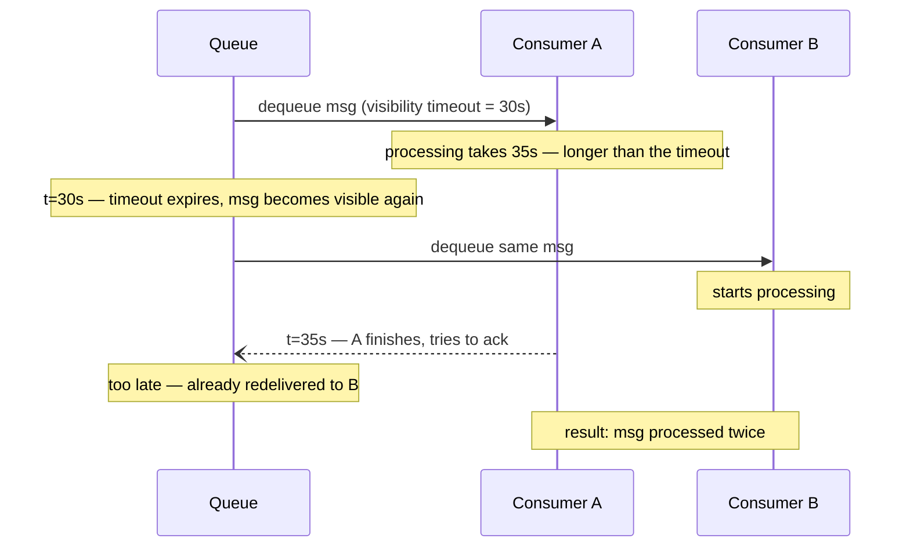
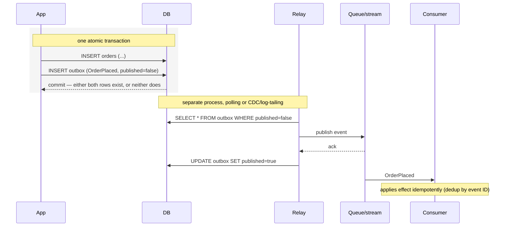

# Messaging and Streaming

Asynchronous work moves a task or a fact off the request path so the caller doesn't wait for it. The mistake this file exists to prevent is reaching for "a queue" or "Kafka" by reflex — the four primitives below solve different problems, fail differently, and the wrong pick costs you either lost work or an unreadable ordering model.

## Work queue vs pub/sub vs durable event stream vs workflow engine

| Primitive | What it means | Example | Critical design questions |
|---|---|---|---|
| Work queue | One consumer group handles each job exactly once (logically); message removed once processed. | Resize an image, send an email. | Visibility timeout, concurrency, retry, DLQ. |
| Pub/sub | Whoever is currently subscribed receives the event; no subscriber, no delivery. | Live UI invalidation, cache-busting broadcast. | Is loss to a temporarily-absent subscriber acceptable? |
| Durable event stream | Retained, ordered log; independent consumers each track their own offset and can replay. | `OrderPlaced` feeding fulfillment, analytics, and search indexing independently. | Partition key/order, retention window, replay, offset management. |
| Workflow engine | Durably orchestrates a multi-step process with state, retries, and compensation baked in. | Payment → inventory hold → shipment, spanning minutes to days. | State versioning, compensating actions, per-activity idempotency. |

The decision, in order: does exactly-once-processing-per-job matter and is there one logical consumer group → work queue. Do you need many independent consumers to each see every event, replay history, or reconstruct state from a log → durable stream. Is loss acceptable if nobody's listening right now (a UI nicety, not a business fact) → pub/sub. Does the "job" span multiple services/steps with its own long-lived state and need to survive a step failing halfway → workflow engine, built on top of one of the other three as its event/task substrate.

> 💡 "We need a queue" names none of these four. Naming which one, and why the other three don't fit, is the actual design decision — the technology name is not a substitute for it.

This file stays at the level of choosing the primitive and designing the consumer. If you pick the durable stream, the follow-up an interviewer asks is how that log stays durable and ordered under failure (replication and the commit point, segments, retention and compaction, consumer offsets), which is covered in [26_distributed_log_internals.md](26_distributed_log_internals.md).

## Visibility timeout and redelivery

A work queue hands a message to a consumer and starts a **visibility timeout** — the window during which no other consumer can see that message. If the consumer finishes and acknowledges (deletes) the message within that window, it's done. If the consumer crashes, hangs, or simply takes longer than the timeout, the message becomes visible again and another consumer picks it up.

Set the visibility timeout comfortably above your p99 processing time, or the queue will manufacture duplicate processing even when nothing actually failed. Too long, and a genuinely crashed consumer's message sits invisible-but-undelivered for that whole window before anyone else can retry it.

## Dead-letter queue design

A message that fails processing repeatedly (bad data, a bug that always throws, a downstream dependency permanently rejecting it) should not retry forever and should not silently vanish. After N delivery attempts, route it to a **dead-letter queue (DLQ)** instead of redelivering again.

- Track delivery/attempt count per message (most managed queues do this natively).
- Alert on DLQ depth — a growing DLQ means something is systematically broken, not just one bad message.
- Keep enough context in the DLQ entry (original payload, error, attempt history) to diagnose and manually replay after a fix, without needing to reconstruct what happened from logs.
- Don't let a DLQ become a silent graveyard — someone/something must own triaging it.

## Ordering scope

"We need global order" is usually the wrong ask, and agreeing to it early commits you to a single-writer/single-partition bottleneck for no real benefit. Almost no product actually needs a total order across all events in the system — it needs order *within some scope*: per conversation, per user, per aggregate, per resource.

| Ask | Actual requirement | Right scope |
|---|---|---|
| "Messages must be in order" (chat) | Order within one conversation, not across all conversations globally. | Partition/consumer key = conversation ID. |
| "Feed must be in order" (news feed) | Order within one user's feed generation, not globally across all users' posts. | Partition/consumer key = user/feed ID. |
| "Inventory updates must be in order" | Order per SKU, not across the whole catalog. | Partition/consumer key = SKU. |

A durable stream partitioned by that key guarantees order within the partition (all messages for the same key land on the same partition, processed in the order they arrived) while letting different keys process fully in parallel across partitions. Ask "order relative to what, for whom" before designing the partition key — get that answer wrong and you either bottleneck the whole system on unnecessary global ordering, or silently lose the ordering guarantee a feature actually depends on.

## Consumer idempotency patterns

At-least-once delivery is the practical default — a message can be redelivered (see visibility timeout above) or a producer can retry a send that actually succeeded. The consumer's business effect must be safe to apply more than once.

| Pattern | Mechanism |
|---|---|
| Unique event ID + dedup table | Consumer checks (or inserts with a unique constraint on) the event ID before applying the effect; a duplicate delivery either no-ops or fails the insert harmlessly. |
| Conditional state transition | Apply the effect as a conditional update keyed on current state (`UPDATE orders SET status='SHIPPED' WHERE id=? AND status='PAID'`) so replaying the same event again is a no-op once the transition has already happened. |

"Exactly once" is a claim about a bounded system boundary (e.g., a stream processor's internal state with transactional commits), not an end-to-end guarantee across an arbitrary consumer's side effects — don't promise it for "send an email" or "call a third-party API" without the consumer itself being idempotent.

## Transactional outbox

The classic gap: your business transaction commits to the database, then the process crashes before it publishes the corresponding event — the database says it happened, but nothing downstream ever finds out. Or the reverse: the event publishes, then the transaction rolls back, and downstream systems now believe something happened that didn't.

The **transactional outbox** pattern closes this by writing the business change and an outbox row for the event *in the same database transaction*, so they commit or roll back together — atomically consistent by construction, no distributed transaction needed. A separate relay process then reads unpublished outbox rows and publishes them to the queue/stream, marking them published once acknowledged.

The relay can crash and re-publish an already-published row — that's fine, it's why the consumer still dedups. What the outbox actually guarantees is that an event is never published for a transaction that didn't commit, and never silently lost for one that did.

## Poison-message handling

A poison message is one that will never succeed no matter how many times it's redelivered — malformed payload, a schema the consumer can't parse, a permanently-broken downstream dependency for that specific record. Left unhandled, it either blocks the partition/queue behind it (if ordering is enforced) or burns retry budget forever.

- Validate and fail fast on unparseable payloads — route straight to the DLQ rather than retrying something that structurally cannot succeed.
- Distinguish transient failures (retry with backoff) from permanent ones (DLQ immediately) in the consumer's error handling — don't treat every exception the same.
- For an ordered partition, a stuck poison message at the head can block everything behind it; decide up front whether the consumer skips-and-DLQs to keep the partition moving, or truly must halt that partition until a human intervenes (rare, but sometimes ordering correctness demands it).

## Related building blocks

- [08_object_storage.md](08_object_storage.md)
- [12_application_resilience_patterns.md](12_application_resilience_patterns.md)
- [10_distributed_systems_theory.md](10_distributed_systems_theory.md)
- [05_databases.md](05_databases.md)
- [15_observability_and_reliability.md](15_observability_and_reliability.md)
- [26_distributed_log_internals.md](26_distributed_log_internals.md) — how the replicated, partitioned log behind a durable stream works internally.
