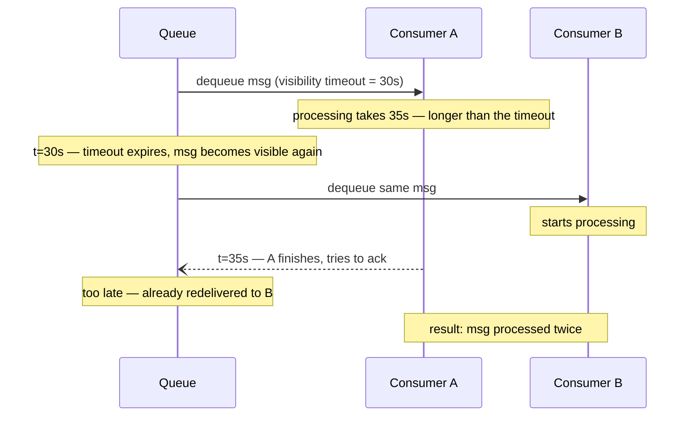
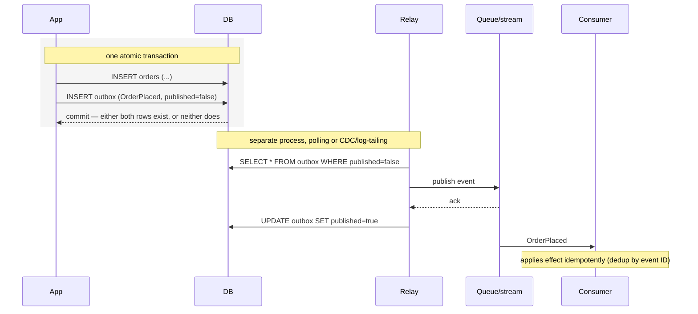

# Messaging and Streaming

Asynchronous work moves a task or a fact off the request path so the caller doesn't wait for it. The mistake this file exists to prevent is reaching for "a queue" or "Kafka" by reflex — the four primitives below solve different problems, fail differently, and the wrong pick costs you either lost work or an unreadable ordering model.

## Foundations — Why Systems Talk Asynchronously

### What asynchronous messaging buys you

In a synchronous call, the caller waits for the callee, so the two must be up at the same time,
fast at the same time, and scaled together. Putting a **broker** between them — a service that
stores messages until someone takes them — breaks all three couplings:

- **Availability decoupling.** The producer succeeds as long as the broker accepts the message;
  the consumer can be down, deploying or slow.
- **Load levelling.** A burst of 10,000 requests a second becomes a backlog the consumers work
  through at their own pace, instead of an overload that fails requests.
- **Fan-out and independence.** One event (`OrderPlaced`) can feed billing, email, search indexing
  and analytics, each owned by a different team, none of them known to the producer.

The price is paid elsewhere: the producer no longer knows when (or whether) the work happened;
failures appear as growing backlogs and dead letters instead of errors; messages can be duplicated
and reordered; and "eventually" needs a bound someone monitors.

### The moving parts

| Part | What it does |
|---|---|
| **Producer** | Writes messages; decides the key that determines ordering and partition |
| **Broker** | Stores messages durably (replicated) and hands them out: SQS, RabbitMQ, Kafka, Pub/Sub, Kinesis |
| **Topic / queue** | A named channel; a topic is split into **partitions** for parallelism |
| **Consumer group** | A set of consumers sharing the work of one subscription; each message goes to one member |
| **Offset / ack** | How a consumer records progress: an offset per partition (logs) or an acknowledgement per message (queues) |
| **Dead-letter queue** | Where messages go after repeated failure |

### Vocabulary

| Term | Meaning |
|---|---|
| At-least-once / at-most-once | Redelivered until acknowledged / never redelivered ([Distributed Systems Fundamentals](../../CSFundamentals/15_distributed_systems_deep_dive.md) §8) |
| Consumer lag | How far behind a consumer is: messages (or seconds) between the newest message and its position |
| Backpressure | Slowing producers when consumers can't keep up, instead of growing the backlog forever |
| Retention | How long a log keeps messages, whether or not they were consumed |
| Rebalance | Reassigning partitions among a consumer group's members when one joins or leaves |
| Head-of-line blocking | One stuck message at the front holding up everything behind it |

## Work queue vs pub/sub vs durable event stream vs workflow engine

| Primitive | What it means | Example | Critical design questions |
|---|---|---|---|
| Work queue | One consumer group handles each job exactly once (logically); message removed once processed. | Resize an image, send an email. | Visibility timeout, concurrency, retry, DLQ. |
| Pub/sub | Whoever is currently subscribed receives the event; no subscriber, no delivery. | Live UI invalidation, cache-busting broadcast. | Is loss to a temporarily-absent subscriber acceptable? |
| Durable event stream | Retained, ordered log; independent consumers each track their own offset and can replay. | `OrderPlaced` feeding fulfillment, analytics, and search indexing independently. | Partition key/order, retention window, replay, offset management. |
| Workflow engine | Durably orchestrates a multi-step process with state, retries, and compensation baked in. | Payment → inventory hold → shipment, spanning minutes to days. | State versioning, compensating actions, per-activity idempotency. |

The decision, in order: does exactly-once-processing-per-job matter and is there one logical consumer group → work queue. Do you need many independent consumers to each see every event, replay history, or reconstruct state from a log → durable stream. Is loss acceptable if nobody's listening right now (a UI nicety, not a business fact) → pub/sub. Does the "job" span multiple services/steps with its own long-lived state and need to survive a step failing halfway → workflow engine, built on top of one of the other three as its event/task substrate.

> 💡 "We need a queue" names none of these four. Naming which one, and why the other three don't fit, is the actual design decision — the technology name is not a substitute for it.

This file stays at the level of choosing the primitive and designing the consumer. If you pick the durable stream, the follow-up an interviewer asks is how that log stays durable and ordered under failure (replication and the commit point, segments, retention and compaction, consumer offsets), which is covered in [Distributed Log Internals](26_distributed_log_internals.md).

## Visibility timeout and redelivery

A work queue hands a message to a consumer and starts a **visibility timeout** — the window during which no other consumer can see that message. If the consumer finishes and acknowledges (deletes) the message within that window, it's done. If the consumer crashes, hangs, or simply takes longer than the timeout, the message becomes visible again and another consumer picks it up.


```mermaid
sequenceDiagram
    %% caption: Why this is at-least-once, never exactly-once
    participant Q as Queue
    participant A as Consumer A
    participant B as Consumer B
    Q->>A: dequeue msg (visibility timeout = 30s)
    Note over A: processing takes 35s — longer than the timeout
    Note over Q: t=30s — timeout expires, msg becomes visible again
    Q->>B: dequeue same msg
    Note over B: starts processing
    A--)Q: t=35s — A finishes, tries to ack
    Note over Q: too late — already redelivered to B
    Note over A,B: result: msg processed twice
```

Set the visibility timeout comfortably above your p99 processing time, or the queue will manufacture duplicate processing even when nothing actually failed. Too long, and a genuinely crashed consumer's message sits invisible-but-undelivered for that whole window before anyone else can retry it.

## Dead-letter queue design

A message that fails processing repeatedly (bad data, a bug that always throws, a downstream dependency permanently rejecting it) should not retry forever and should not silently vanish. After N delivery attempts, route it to a **dead-letter queue (DLQ)** instead of redelivering again.

- Track delivery/attempt count per message (most managed queues do this natively).
- Alert on DLQ depth — a growing DLQ means something is systematically broken, not just one bad message.
- Keep enough context in the DLQ entry (original payload, error, attempt history) to diagnose and manually replay after a fix, without needing to reconstruct what happened from logs.
- Don't let a DLQ become a silent graveyard — someone/something must own triaging it.

## Ordering scope

"We need global order" is usually the wrong ask, and agreeing to it early commits you to a single-writer/single-partition bottleneck for no real benefit. Almost no product actually needs a total order across all events in the system — it needs order *within some scope*: per conversation, per user, per aggregate, per resource.

| Ask | Actual requirement | Right scope |
|---|---|---|
| "Messages must be in order" (chat) | Order within one conversation, not across all conversations globally. | Partition/consumer key = conversation ID. |
| "Feed must be in order" (news feed) | Order within one user's feed generation, not globally across all users' posts. | Partition/consumer key = user/feed ID. |
| "Inventory updates must be in order" | Order per SKU, not across the whole catalog. | Partition/consumer key = SKU. |

A durable stream partitioned by that key guarantees order within the partition (all messages for the same key land on the same partition, processed in the order they arrived) while letting different keys process fully in parallel across partitions. Ask "order relative to what, for whom" before designing the partition key — get that answer wrong and you either bottleneck the whole system on unnecessary global ordering, or silently lose the ordering guarantee a feature actually depends on.

## Consumer idempotency patterns

At-least-once delivery is the practical default — a message can be redelivered (see visibility timeout above) or a producer can retry a send that actually succeeded. The consumer's business effect must be safe to apply more than once.

| Pattern | Mechanism |
|---|---|
| Unique event ID + dedup table | Consumer checks (or inserts with a unique constraint on) the event ID before applying the effect; a duplicate delivery either no-ops or fails the insert harmlessly. |
| Conditional state transition | Apply the effect as a conditional update keyed on current state (`UPDATE orders SET status='SHIPPED' WHERE id=? AND status='PAID'`) so replaying the same event again is a no-op once the transition has already happened. |

"Exactly once" is a claim about a bounded system boundary (e.g., a stream processor's internal state with transactional commits), not an end-to-end guarantee across an arbitrary consumer's side effects — don't promise it for "send an email" or "call a third-party API" without the consumer itself being idempotent.

## Transactional outbox


```arch
%% caption: The outbox pattern guarantees a database mutation and its corresponding event are committed atomically before a background relay publishes it.
grid 170x180
node app "Application" at 0.5,0 icon=app color=blue
group db "Database Transaction" color=amber style=dashed
node tbl "Domain Table" at 0,1 in db icon=db
node out "Outbox Table" at 1,1 in db icon=db
node relay "Relay Process" at 1,2 icon=timer color=slate sub="polling / CDC"
node q "Message Broker" at 2,2 icon=queue color=green

app -> tbl : "1. write"
app -> out : "1. write event"
out -> relay : "2. read unpublished"
relay -> q : "3. publish"
relay -> out : "4. mark published"
```
The classic gap: your business transaction commits to the database, then the process crashes before it publishes the corresponding event — the database says it happened, but nothing downstream ever finds out. Or the reverse: the event publishes, then the transaction rolls back, and downstream systems now believe something happened that didn't.

The **transactional outbox** pattern closes this by writing the business change and an outbox row for the event *in the same database transaction*, so they commit or roll back together — atomically consistent by construction, no distributed transaction needed. A separate relay process then reads unpublished outbox rows and publishes them to the queue/stream, marking them published once acknowledged.


```mermaid
sequenceDiagram
    participant App
    participant DB
    participant Relay
    participant Stream as Queue/stream
    participant Consumer
    rect rgba(127,127,127,0.08)
    Note over App,DB: one atomic transaction
    App->>DB: INSERT orders (...)
    App->>DB: INSERT outbox (OrderPlaced, published=false)
    DB-->>App: commit — either both rows exist, or neither does
    end
    Note over Relay,DB: separate process, polling or CDC/log-tailing
    Relay->>DB: SELECT * FROM outbox WHERE published=false
    Relay->>Stream: publish event
    Stream-->>Relay: ack
    Relay->>DB: UPDATE outbox SET published=true
    Stream->>Consumer: OrderPlaced
    Note over Consumer: applies effect idempotently (dedup by event ID)
```

The relay can crash and re-publish an already-published row — that's fine, it's why the consumer still dedups. What the outbox actually guarantees is that an event is never published for a transaction that didn't commit, and never silently lost for one that did.

## Poison-message handling

A poison message is one that will never succeed no matter how many times it's redelivered — malformed payload, a schema the consumer can't parse, a permanently-broken downstream dependency for that specific record. Left unhandled, it either blocks the partition/queue behind it (if ordering is enforced) or burns retry budget forever.

- Validate and fail fast on unparseable payloads — route straight to the DLQ rather than retrying something that structurally cannot succeed.
- Distinguish transient failures (retry with backoff) from permanent ones (DLQ immediately) in the consumer's error handling — don't treat every exception the same.
- For an ordered partition, a stuck poison message at the head can block everything behind it; decide up front whether the consumer skips-and-DLQs to keep the partition moving, or truly must halt that partition until a human intervenes (rare, but sometimes ordering correctness demands it).

## Partitions, consumer groups, and parallelism

In a partitioned log (Kafka, Kinesis, Pub/Sub Lite), **a partition is the unit of both ordering
and parallelism**. Within a consumer group, each partition is read by exactly one consumer at a
time, which is what preserves per-key order. Three consequences come up in every design review:

- **Maximum parallelism = number of partitions.** 12 partitions and 20 consumers means 8 idle
  consumers. Choose the partition count for the peak consumer parallelism you expect (it is easy to
  add consumers, harder to add partitions: adding partitions changes `hash(key) % partitions`, so
  keys move and per-key order is broken across the change).
- **One slow key slows its whole partition.** Every other key hashed there waits behind it; a hot
  key concentrates load exactly as in [Partitioning, Shard Keys, and Hot Keys](25_partitioning_and_hot_keys.md).
- **Rebalances pause consumption.** When a consumer joins, leaves or misses heartbeats, partitions
  are reassigned; with older "eager" protocols the whole group stops briefly. Deploying a consumer
  group of 50 instances one by one can mean 50 rebalances. Cooperative/incremental rebalancing and
  static membership exist to reduce this.

Work queues (SQS, RabbitMQ) trade the other way: any consumer can take any message, so parallelism
is unlimited and one slow message doesn't block others — but there is no ordering beyond what FIFO
queues with message groups provide, and no replay once a message is acknowledged.

## Lag, backlog, and catch-up time, measured

Consumer lag is the most important health metric of an asynchronous system, and its arithmetic is
simple enough to do in an interview. A stream producing 1,000 messages a second, consumers down for
ten minutes, then restarted:

```python
"""Consumer lag: a steady 1,000 msg/s stream, a 10-minute consumer outage,
then recovery. How long until the backlog is gone depends on headroom."""

def run(capacity, produce=1000, outage=(300, 900), horizon=7200):
    backlog, peak, drained_at = 0, 0, None
    for t in range(horizon):                       # one step per second
        backlog += produce
        if not (outage[0] <= t < outage[1]):
            backlog -= min(backlog, capacity)
        peak = max(peak, backlog)
        if t >= outage[1] and backlog == 0 and drained_at is None:
            drained_at = t
    return peak, drained_at - outage[1] if drained_at is not None else None

print("consumers down for 10 min; producers keep writing 1,000 msg/s")
for cap in (1100, 1250, 1500, 2000, 4000):
    peak, catch_up = run(cap)
    print(f"consumer capacity {cap:5}/s ({cap / 1000 - 1:4.0%} headroom): backlog peaks at "
          f"{peak:7,} msgs; caught up {catch_up / 60:5.1f} min after restart")
```

```text
consumers down for 10 min; producers keep writing 1,000 msg/s
consumer capacity  1100/s ( 10% headroom): backlog peaks at 600,000 msgs; caught up 100.0 min after restart
consumer capacity  1250/s ( 25% headroom): backlog peaks at 600,000 msgs; caught up  40.0 min after restart
consumer capacity  1500/s ( 50% headroom): backlog peaks at 600,000 msgs; caught up  20.0 min after restart
consumer capacity  2000/s (100% headroom): backlog peaks at 600,000 msgs; caught up  10.0 min after restart
consumer capacity  4000/s (300% headroom): backlog peaks at 600,000 msgs; caught up   3.3 min after restart
```

- **The backlog is produce rate × outage**: 600,000 messages, whatever the consumers can do.
- **Catch-up time is backlog ÷ headroom**, not backlog ÷ capacity: while draining, the consumers must
  also keep up with new messages. With 10% headroom the ten-minute outage takes **100 minutes** to
  recover from; with 100% headroom, ten. This is the most commonly missed number in queue designs.
- **Messages age while they wait.** Right after restart, the oldest message is already ten minutes
  old, and with thin headroom it stays old for over an hour — so alert on **lag in seconds** (age of
  the oldest unprocessed message), not only on message counts, and size consumers for recovery, not
  for steady state.
- **Retention must exceed the worst recovery.** If the log keeps messages for 24 hours and a
  consumer bug goes unnoticed for a day, messages are deleted before they are read. Retention is a
  data-loss setting, not a disk setting.

## Retries versus ordering, measured

The per-key ordering that partitions provide is easy to lose by accident, and the usual culprit is
the retry path. Three updates to one account (`v1`, `v2`, `v3`) arrive in order on one partition,
and applying `v2` fails once with a timeout:

```python
"""Per-key ordering meets retries. Three updates to one account arrive in
order v1, v2, v3 on one partition; applying v2 fails once (a timeout)."""

def run(strategy):
    state, retry_topic, log = {"version": 0}, [], []
    fail_once = {"v2"}
    def apply(ev):
        if ev["id"] in fail_once:
            fail_once.discard(ev["id"])
            raise TimeoutError
        if strategy == "retry topic + version check" and ev["version"] <= state["version"]:
            log.append(f"skip {ev['id']} (stale)")
            return
        state["version"] = ev["version"]
        log.append(f"apply {ev['id']}")
    events = [{"id": f"v{i}", "version": i} for i in (1, 2, 3)]
    for ev in events:
        try:
            apply(ev)
        except TimeoutError:
            if strategy == "block and retry in place":
                log.append(f"retry {ev['id']} (partition paused)")
                apply(ev)                          # nothing behind it moves until this succeeds
            else:
                log.append(f"{ev['id']} -> retry topic")
                retry_topic.append(ev)             # the partition keeps moving
    for ev in retry_topic:                         # the retry consumer runs later
        apply(ev)
    return state["version"], log

for strategy in ("retry topic", "block and retry in place", "retry topic + version check"):
    final, log = run(strategy)
    print(f"{strategy:28} final version v{final}  {'OK ' if final == 3 else 'WRONG'}  | " + ", ".join(log))
```

```text
retry topic                  final version v2  WRONG  | apply v1, v2 -> retry topic, apply v3, apply v2
block and retry in place     final version v3  OK   | apply v1, retry v2 (partition paused), apply v2, apply v3
retry topic + version check  final version v3  OK   | apply v1, v2 -> retry topic, apply v3, skip v2 (stale)
```

- **A retry topic reorders.** Sending the failed `v2` to a separate retry topic keeps the partition
  moving — `v3` applies — and then `v2` is applied on top, leaving the account at version 2. The
  final state is wrong, and nothing errored.
- **Blocking in place preserves order** at the cost of head-of-line blocking: nothing behind `v2`
  moves until it succeeds, and a poison message stops the partition entirely (see *Poison-message
  handling* above).
- **Making the write order-aware fixes it without blocking.** Each event carries a version (or a
  sequence number per key), and the consumer applies it only if it's newer than the stored one — a
  conditional write. The late `v2` is recognised as stale and skipped.

So the rule is: retry topics and DLQs are only safe for consumers whose effects are
**commutative** (counters, set membership) or **version-checked**. For state that must follow the
event order, either block the partition or carry versions.

## Throughput vs latency: batching, and push vs pull

Brokers get their throughput from **batching**: a producer that waits a few milliseconds to send
100 messages in one request pays one network round trip and one disk write for all of them (Kafka's
`linger.ms` and `batch.size`, compression per batch). The same trade appears on the consumer side
with fetch sizes. More batching means higher throughput and higher per-message latency; for most
event pipelines a few milliseconds of linger is a large win, while for user-facing request paths it
may not be.

**Pull** (Kafka, SQS long polling) lets each consumer take work at its own pace — backpressure is
built in, because a slow consumer simply falls behind. **Push** (RabbitMQ with prefetch, Pub/Sub push
subscriptions, webhooks) delivers with lower latency but needs a limit on in-flight messages per
consumer (prefetch count, flow control), or a slow consumer is overwhelmed.

**Backpressure all the way up.** A backlog is fine when it drains; unbounded growth is an incident
waiting to happen. When lag keeps rising, the options are: add consumers (up to the partition
count), shed or defer low-priority work, or slow producers — reject or rate-limit at the API that
creates the messages ([Overload Control and Graceful Degradation](28_overload_control_and_graceful_degradation.md)).

## What each level should know

| Topic | L4 · Mid | L5 · Senior | L6+ · Staff |
|---|---|---|---|
| **Choosing the primitive** | Uses a queue for background jobs | Chooses among work queue, pub/sub, durable stream and workflow engine with reasons | Sets the eventing strategy across teams: schemas, ownership, retention, replay |
| **Delivery and idempotency** | Knows messages can be redelivered | Designs idempotent consumers, outbox, DLQ and poison handling | Defines end-to-end exactly-once effects across system boundaries |
| **Ordering and partitions** | Knows Kafka orders within a partition | Picks the ordering scope and partition key; explains why retries reorder and how versions fix it | Plans partition counts and key changes over years without breaking order |
| **Lag and capacity** | Monitors queue depth | Computes backlog and catch-up time; alerts on lag in seconds; sizes headroom for recovery | Sets retention and recovery objectives as data-loss and availability policy |
| **Throughput** | Uses default client settings | Tunes batching and prefetch; applies backpressure | Designs multi-tenant brokers with quotas and isolation |

## Interview checklist

- [ ] I can explain what a broker decouples (availability, load, fan-out) and what it costs.
- [ ] I can choose between a work queue, pub/sub, a durable stream and a workflow engine.
- [ ] I can explain visibility timeouts, DLQs, poison messages and consumer idempotency.
- [ ] I can explain why partitions cap consumer parallelism and why adding partitions breaks key order.
- [ ] I can compute backlog and catch-up time after an outage, and explain why headroom matters more than capacity.
- [ ] I can explain how a retry topic reorders updates and how versions or blocking prevent it.
- [ ] I can explain batching, push vs pull, and backpressure.

## Related building blocks

- [Object Storage](08_object_storage.md)
- [Application Resilience Patterns](12_application_resilience_patterns.md)
- [Distributed Systems Theory](10_distributed_systems_theory.md)
- [Databases: Source of Truth](05_databases.md)
- [Observability and Reliability](15_observability_and_reliability.md)
- [Distributed Log Internals](26_distributed_log_internals.md) — how the replicated, partitioned log behind a durable stream works internally.
