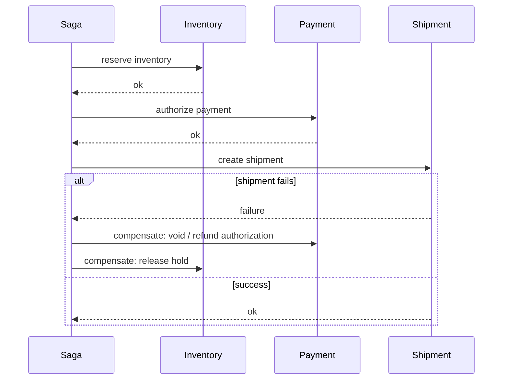

# Transactions, Isolation, Locking, and Sagas

## ACID, precisely

A transaction groups changes so all of them succeed or none do.

- **Atomicity:** all-or-nothing — a crash mid-transaction leaves no partial write.
- **Consistency:** the database enforces its own declared constraints (foreign keys, uniqueness, check constraints) across the transaction.
- **Isolation:** concurrent transactions appear to not interfere, to a degree defined by the chosen isolation level (not automatically "fully").
- **Durability:** once committed, the change survives a crash.

**What ACID does NOT promise:** anything about other replicas. A committed transaction on the primary is durable and isolated *on that node* — a follower can still be lagging behind it. ACID is a single-node (or single-cluster-with-consensus) guarantee; consistency across replicas is a separate, explicit choice (see `10_distributed_systems_theory.md`). Don't let "the DB is ACID" imply "reads anywhere are correct."

## Isolation anomalies

Weaker isolation levels trade correctness for concurrency throughput. Know which anomaly each level actually blocks.

| Anomaly | Concrete example | Typical defense |
|---|---|---|
| Lost update | Two requests both read `stock=10`, each computes `9`, both write `9` — one decrement is silently lost even though two units sold. | Row lock, compare-and-swap/version check, a single atomic conditional `UPDATE`, or a level that detects the conflict (snapshot isolation in PostgreSQL aborts the loser with `40001`; serializable) — see the table below, because this is database-dependent. |
| Dirty read | Transaction A reads a value transaction B wrote but hasn't committed yet; B then rolls back — A acted on data that never existed. | Read committed or stronger — never read uncommitted data. |
| Non-repeatable read | Transaction A reads a row, does other work, reads the same row again — it changed because B committed an update in between. | Repeatable read, locking read, or a consistent snapshot (MVCC). |
| Phantom | Transaction A runs `SELECT ... WHERE status='pending'` twice in one transaction; the second run sees a new row B inserted and committed in between. | Serializable isolation, predicate locking, or explicit re-validation. |
| Write skew | Two transactions each independently check a *different* row and see their own local condition holds (e.g. "at least one of two on-call doctors is scheduled"), but the combination they jointly produce violates the invariant (both go off-call). | Serializable isolation, or an explicit materialized constraint/lock covering the actual invariant, not just each transaction's own row. |

### What each isolation level actually defends

The level *names* are a SQL-standard vocabulary, and databases implement them differently. Read the table as "what is true for that mechanism," not "what the label guarantees everywhere":

| Level | Dirty read | Non-repeatable read | Phantom | Lost update | Write skew |
|---|---|---|---|---|---|
| Read committed | blocked | possible | possible | possible (for a read, compute in the app, write pattern) | possible |
| Repeatable read (the SQL-standard label, and MySQL/InnoDB's default level) | blocked | blocked | usually blocked (DB-dependent) | possible ¹ | possible |
| Snapshot isolation (PostgreSQL's `REPEATABLE READ`; Oracle's `SERIALIZABLE`; SQL Server's `SNAPSHOT`) | blocked | blocked | blocked for reads of the snapshot | blocked ² (the second writer to a row is aborted, you retry) | **possible** |
| Serializable | blocked | blocked | blocked | blocked | blocked ³ |

¹ **MySQL/InnoDB.** A plain `SELECT` reads a snapshot fixed at the transaction's first read, but `UPDATE`, `DELETE` and locking reads (`FOR UPDATE`) act on the *latest committed* row, not the snapshot (MySQL reference manual, "Consistent Nonlocking Reads"). So "read `stock=10`, compute `9` in the app, `UPDATE ... SET stock = 9`" can silently overwrite a concurrent committed change: the lost update is still possible unless you use `FOR UPDATE`, a version check, or an atomic `SET stock = stock - 1`.

² **PostgreSQL.** `REPEATABLE READ` is snapshot isolation. If your transaction tries to update or lock a row that another transaction changed and committed after your snapshot, PostgreSQL raises `could not serialize access due to concurrent update` (SQLSTATE `40001`) instead of overwriting it, and your code must retry the whole transaction (PostgreSQL manual, "Transaction Isolation"). The lost update is prevented, but write skew is not, because two transactions that update *different* rows never conflict. The repo's own demo of this exact behaviour, with real output, is in [SQL/09_transactions_and_isolation_levels.md](../../SQL/09_transactions_and_isolation_levels.md) (Demo 1 for the lost update and the `FOR UPDATE` fix, Demo 2 for `REPEATABLE READ` aborting with `40001`).

³ **Serializable is implemented differently too.** PostgreSQL uses serializable snapshot isolation: it lets transactions run optimistically and aborts one with `40001` when it detects a dangerous pattern, so you need retry logic. MySQL/InnoDB implements it with locking (plain reads become shared-locking reads), so you get blocking and deadlocks instead. Oracle's level named `SERIALIZABLE` is really snapshot isolation, so write skew is possible there; check the vendor's documentation before you trust the label.

Read committed is a common default (PostgreSQL, Oracle, SQL Server, and most OLTP workloads) because it's cheap and blocks the anomaly people picture when they say "dirty data." It does **not** protect an inventory-style read-modify-write. That needs a row lock (`SELECT ... FOR UPDATE`), a version check, or a conditional update (`WHERE available >= :qty`), and the conditional update is the one that is correct at *every* isolation level because the read and the write happen inside one atomic statement. Stronger levels can also fix it (footnotes ² and ³), but only if the application catches `40001` and retries. In an interview, say the mechanism you rely on, not just the level name.

> 💡 Snapshot isolation is the answer to "does REPEATABLE READ stop lost updates?" It depends on the database: yes in PostgreSQL, not by itself in InnoDB. Neither stops write skew, which needs serializable isolation or an explicit lock or constraint that covers the invariant.

## Optimistic vs. pessimistic concurrency control

**Optimistic (OCC):** read a value plus its version; commit only if the version hasn't changed.

```text
SELECT balance, version FROM accounts WHERE id = :id;
-- ... compute new_balance in application code ...
UPDATE accounts SET balance = :new_balance, version = version + 1
  WHERE id = :id AND version = :version_just_read;
-- rowcount = 0 → someone else won, retry the whole read-modify-write
```

Good when conflicts are rare — no lock is held while the application computes the new value, so throughput stays high under low contention. Bad when conflicts are common — you pay repeated wasted round trips retrying.

**Pessimistic locking:** acquire the lock (`SELECT ... FOR UPDATE`, or an app-level mutex) before doing any work, so no one else can read-modify-write the same row concurrently.

```sql
BEGIN;
SELECT available FROM inventory WHERE sku = :sku FOR UPDATE;  -- blocks other writers on this row
UPDATE inventory SET available = available - :qty WHERE sku = :sku;
COMMIT;
```

Good under high contention (hot row that many transactions want). Costs: waiting transactions queue behind the lock holder, and **deadlock risk** — two transactions each holding a lock the other wants, waiting forever, until the database's deadlock detector kills one. The standard defense is **lock ordering**: always acquire locks on multiple rows in the same global order (e.g. always lock the lower account ID first in a transfer) so two transactions can never form a cycle.

### Keep transactions short

Never hold a database lock — or an open transaction at all — across a remote call (payment provider, email service, another microservice). A slow or hung downstream call turns into a long-held lock, which turns into every other transaction on that row queuing behind a call you don't control. Do the remote call outside the transaction: reserve locally (conditional update, short transaction), call out, then commit the final state in a second short transaction. This is exactly why the saga pattern below exists — a single ACID transaction across services isn't available at all.

## The saga pattern

A distributed "transaction" spanning independent services/databases has no cheap global ACID equivalent (two-phase commit exists but is a coordination and availability liability few systems accept). A **saga** replaces it with a sequence of local, durable steps, each with an explicit compensation for undoing its effect if a later step fails.



If shipment creation fails after payment succeeded: run the payment step's compensation (refund), then the reservation step's compensation (release hold) — compensations run in reverse order back through the completed steps.

Key rules, all non-negotiable:

1. **A compensation is a new business action, not a rollback.** A shipped parcel can't be "un-shipped" — the compensation is a return/refund workflow, a genuinely different operation with its own side effects, not deleting a row.
2. **Every step and every compensation must be idempotent.** Sagas run on top of at-least-once messaging/retries; the same step or compensation can execute more than once and must produce the same end state (see the outbox/idempotent-consumer pattern in `09_messaging_and_streaming.md`).
3. **Steps must be observable.** You need to know which step a given saga instance is on, or you can't diagnose a stuck order or manually intervene.

### Orchestration vs. choreography

| Style | How it works | Choose it when | Cost |
|---|---|---|---|
| Orchestration | One coordinator service explicitly calls each step and its compensation, holding the saga's state machine. | You need clear visibility into where every saga instance is, and central control over ordering/retries. | The orchestrator becomes a required dependency and a single place that must be built well — but it's also the single place you look at to debug anything. |
| Choreography | Each service reacts to events from the previous step and emits its own event; no central coordinator. | Small number of steps, loosely coupled teams who don't want a shared coordinator dependency. | As the flow grows, understanding "what happens after X" means chasing event subscriptions across every service — much harder to reason about or debug at scale. |

Default to orchestration once a saga has more than a couple of steps or crosses team boundaries — the debuggability win outweighs the extra coordinator component.

## Related building blocks

- [10_distributed_systems_theory.md](10_distributed_systems_theory.md)
- [06_database_internals.md](06_database_internals.md)
- [09_messaging_and_streaming.md](09_messaging_and_streaming.md)
- [12_application_resilience_patterns.md](12_application_resilience_patterns.md)
