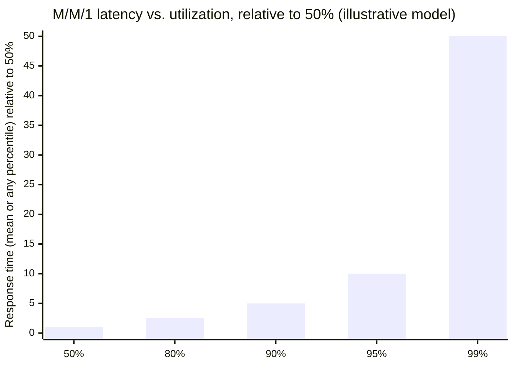

# Application Resilience Patterns

An application service should be horizontally scalable and should fail in predictable, contained ways. These six patterns are the standard toolkit for both. They compose — a single dependency call typically goes through connection pool → timeout → retry → circuit breaker → bulkhead, in that order.

## Connection pool sizing

A pool reuses expensive-to-establish connections (TCP handshake, TLS, DB auth) instead of paying that cost per request. The failure mode is not "too small" — it's forgetting that pool size is a *fleet-wide* number, not a per-instance one.

```text
N app instances × pool_size_per_instance ≤ database's max safe concurrent connections
```

A pool sized generously per instance (say 100) looks harmless on one box, but at 50 instances that's 5,000 connections hammering a database that chokes past a few hundred — each connection carries real memory and scheduling overhead on the DB side, so more connections do not mean more throughput past the point where the DB's own concurrency (roughly bounded by its core count and I/O concurrency, see `01_operating_systems.md`'s core-count discussion) is saturated. A small, correctly-sized pool with requests queuing briefly beats an oversized pool that overwhelms the DB into thrashing. Size the pool from the dependency's actual capacity divided by expected instance count, not from "big number feels safe."

## Timeout budgets and deadline propagation

Every dependency call needs a deadline **smaller than the caller's own remaining deadline** — otherwise a service can return "success" to its caller after its caller has already given up and moved on, which wastes the work and can cause double-handling upstream.

```arch
%% caption: A 300ms budget, spent down hop by hop — not re-issued per hop
grid 160x100
node start "User p99 target: 300 ms" at 0,0 shape=pill color=slate
node gw "Gateway/auth: 25 ms" at 0,1 shape=card icon=gateway sub="275 ms remain" w=270
node app "Application work: 20 ms" at 0,2 shape=card icon=app sub="255 ms remain" w=270
node db "Call DB, deadline = 150 ms" at 0,3 shape=card icon=db sub="105 ms remain if DB takes all 150" w=270
node slack "Slack/serialization: 80 ms" at 0,4 shape=card icon=timer sub="reserved; 25 ms margin" w=270
start -> gw -> app -> db -> slack
```

The application must set the DB call's deadline to something meaningfully less than its own remaining 255ms — not 255ms itself — because it still needs time to serialize the response and let the reply travel back. Propagate the *remaining* deadline down the call chain (as a header/context value), not a fixed per-hop timeout — a fixed 100ms timeout at every hop in a 5-hop chain burns 500ms of possible waiting when the end-to-end budget was only 300ms. Cancellation (the callee actually stopping work when the deadline is blown) is a nice-to-have optimization; it must never be the *only* mechanism protecting downstream capacity — the timeout on the caller side is what actually bounds the damage.

## Retry policy

Retry only transient errors, and only when the operation is idempotent or protected by an idempotency key (see `10_distributed_systems_theory.md`'s three-outcomes table — a timeout is not evidence of failure). The standard policy:

- **Exponential backoff:** wait `base * 2^attempt` between attempts, so retries spread out rather than immediately re-hammering a struggling dependency.
- **Jitter:** randomize the wait within a range, so a thundering herd of clients that failed at the same moment don't all retry at the same moment again.
- **Cap:** stop after N attempts or a max total wait — don't retry forever.
- **Retry budget:** limit total retries as a fraction of total request volume (e.g. retries may not exceed 10% of primary request rate) fleet-wide, not just per-request.

### The retry storm failure mode

Retries are a load multiplier, and that's dangerous exactly when a dependency is already struggling:

```arch
%% caption: A feedback loop — the retries are the fuel, not a bystander
node a "Dependency degrades" at 0,0 shape=pill color=amber sub="requests start timing out"
group loop "Retry storm" color=red icon=sync
node b "Every caller retries" at 0,1 in loop color=red sub="the slow/failing calls"
node c "Retry traffic adds load" at 0,2 in loop color=red sub="on an already-overloaded dependency"
node d "Dependency gets slower" at 0,3 in loop color=red sub="and fails more"
a -> b -> c -> d
d:R -> b:R : "triggers MORE retries"
```

This is why a retry budget and backoff are not optional polish — without them, the very mechanism meant to paper over a transient blip becomes the thing that turns a blip into a full outage. Pair retries with a circuit breaker (next section) so that once a dependency is clearly down, callers stop hammering it entirely instead of retrying into the void.

## Circuit breaker

Stops calling a dependency that is failing, so callers fail fast instead of piling up threads/connections waiting on a dependency that won't answer anyway.

```arch
%% caption: The breaker cycles between passing calls, failing fast, and testing recovery with a trickle of real calls.
grid 210x140
node s "start" at 0,0 shape=pill color=slate
node closed "Closed" at 0,1 color=green sub="calls pass through, failures counted"
node open "Open" at 2,1 color=red sub="calls fail fast / fallback, nothing reaches the dependency" w=300
node half "Half-Open" at 2,2 color=amber sub="a small trickle of real calls tests recovery" w=300
s -> closed
closed -> open : "failure rate exceeds threshold"
open -> half : "cool-down timer expires"
half:L -> closed:B : "trial call succeeds"
half:R -> open:R : "trial call fails"
```

> 🎯 The one-sentence version to have ready: "closed counts failures, open stops sending traffic so the dependency can breathe, half-open tests recovery with a trickle before fully reopening the gate."

- **Closed:** normal operation, failures are counted against the threshold.
- **Open:** calls short-circuit immediately (fail fast or return a fallback) — no load reaches the struggling dependency, giving it room to recover.
- **Half-open:** after a cool-down, let a small number of real requests through to test whether the dependency has actually recovered before fully reopening the gate.

The breaker's real job is protecting the *caller's own resources* (threads, connections) from piling up waiting on a dependency that isn't going to answer — and, as a side effect, giving the failing dependency breathing room instead of adding retry-storm load to its recovery.

## Bulkhead isolation

Named after ship compartments that keep one hull breach from sinking the whole vessel. Separate thread pools, connection pools, or queues **per tenant or per dependency**, so one slow/misbehaving consumer can't exhaust the capacity that every other consumer also needs.

```arch
%% caption: One shared pool lets a single slow tenant starve everyone; separate pools contain the damage.
group wo "Without bulkheads" color=red icon=warn
node tx "Tenant X's slow calls" at 0,0 in wo color=red
node shared "One shared thread pool" at 2,0 in wo color=red icon=thread sub="for all callers"
group w "With bulkheads" color=green icon=shield
node pa "Tenant pool A" at 0,1 in w color=green icon=thread
node pb "Tenant pool B" at 1,1 in w color=green icon=thread
node pc "Slow dep C's own pool" at 2,1 in w color=amber icon=thread
tx ..> shared : "exhaust it, starving everyone"
```

> ✅ Pools A and B stay healthy while C is starved — the failure is contained to exactly the callers who depend on C, not everyone who happens to share a process with them.

Without isolation, one noisy tenant or one slow downstream dependency exhausts the shared pool and every unrelated caller starves too, even though their own dependency is healthy. The cost is fragmentation — capacity dedicated to tenant A sits idle while tenant B is saturated — which is the correct trade for fault containment; size each bulkhead from expected per-tenant/per-dependency load, not an even split.

## Backpressure

When a producer generates work faster than a consumer can process it, something must give: either the queue between them grows without bound (memory exhaustion, and requests waiting so long behind a huge backlog that the response is useless by the time it's produced), or the system makes the pressure visible and acts on it. Backpressure means the latter: **bounded queues**, and an explicit decision (reject, shed load, slow the producer) once a queue is full — rather than an unbounded queue quietly hiding the problem until it becomes an OOM or a latency cliff.

### Little's Law and why tail latency explodes near saturation

**Little's Law is an identity, not an explanation.** For any stable system, the long-run average number of requests inside it (`L`) equals the arrival rate (`λ`) times the average time each request spends inside (`W`): `L = λW`. It holds regardless of arrival pattern, service-time distribution or scheduling order, which is exactly why it cannot tell you *why* latency blows up. What it does give you is a sizing tool: `2,000 req/s × 0.05 s = 100` requests in flight on average, so a pool or thread count below 100 will queue by construction. It also tells you that if `W` doubles at a fixed arrival rate, the number of in-flight requests (threads, connections, memory) doubles too.

**The blow-up itself comes from queueing at high utilization.** Let `ρ = λ/μ` be utilization (arrival rate over service capacity). In the textbook M/M/1 queue (one server, random arrivals, exponentially distributed service times, first come first served), the mean time in the system is `W = (1/μ) / (1 − ρ)` and the mean time spent waiting before service is `(ρ / (1 − ρ)) × (1/μ)`. The intuition: the server's spare capacity, `μ − λ = μ(1 − ρ)`, is the only rate at which it can drain a backlog. A random burst of `B` extra requests takes `B / (μ(1 − ρ))` to clear, which is `2B/μ` at 50% utilization but `20B/μ` at 95%. Substituting into Little's Law then gives the queue length, `L = ρ / (1 − ρ)`: 1 request at 50%, 4 at 80%, 9 at 90%, 19 at 95%, 99 at 99%. Beyond `ρ = 1` there is no steady state at all and the queue grows until something is rejected or times out.



The bars are `0.5 / (1 − ρ)`, that is the `1 / (1 − ρ)` queueing term normalised to the 50% case. In M/M/1 the whole response-time distribution is exponential with rate `μ(1 − ρ)`, so the mean and every percentile scale by the same factor (the p99 is about `4.6 / (μ(1 − ρ))`, since `ln 100 ≈ 4.6`). The exact numbers are model-dependent: a pool with `c` servers keeps latency flat until higher utilization and then bends just as sharply, while a service-time distribution with a heavy tail (a few slow queries) makes waits longer than M/M/1 at the same `ρ`, because in M/G/1 the wait is proportional to `(1 + Cs²)/2 × ρ/(1 − ρ)`. What carries over to real systems is the shape, not the values.

A pool running at 95% average utilization looks "mostly fine" on a CPU dashboard but has terrible p99 latency, because the *average* hides how close to the cliff the system is. This is the quantitative reason to keep headroom on any critical pool (connections, threads, queue consumers) rather than running it near 100% "for efficiency", and to alert on queue depth or saturation rather than mean CPU. See `13_scaling_and_load_balancing.md` for the autoscaling-signal implications of this same curve. Bounded queues are the local defence. For what to do once you are already past the knee (shed low-value work, protect the critical path, degrade features deliberately), see [28_overload_control_and_graceful_degradation.md](28_overload_control_and_graceful_degradation.md).

> 🎯 In an interview: "Little's Law tells me how many requests are in flight, `λ × W`. Latency explodes near saturation because of queueing, and waiting time scales like `ρ / (1 − ρ)`, so I run this pool at 60-70% and shed load before it reaches the knee."

## Related building blocks

- [13_scaling_and_load_balancing.md](13_scaling_and_load_balancing.md)
- [01_operating_systems.md](01_operating_systems.md)
- [10_distributed_systems_theory.md](10_distributed_systems_theory.md)
- [15_observability_and_reliability.md](15_observability_and_reliability.md)
- [28_overload_control_and_graceful_degradation.md](28_overload_control_and_graceful_degradation.md) (shedding, admission control and degradation once you are past the knee)
