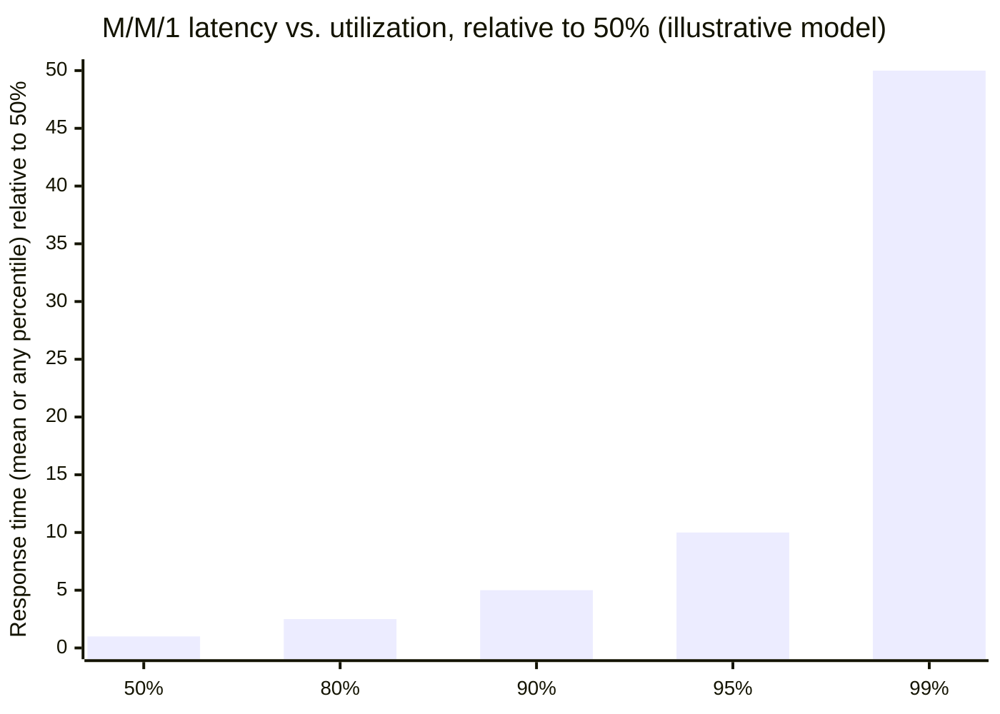

# Application Resilience Patterns

An application service should be horizontally scalable and should fail in predictable, contained ways. These six patterns are the standard toolkit for both. They compose — a single dependency call typically goes through connection pool → timeout → retry → circuit breaker → bulkhead, in that order.

## Foundations — Why One Slow Dependency Takes Down a Healthy Service

### How failures spread

A service rarely fails because its own code breaks. It fails because something it calls got
**slow**. Follow one slow database through a typical service:

1. Each request now holds a thread and a connection for 2 s instead of 20 ms.
2. At the same arrival rate, Little's Law (`L = λW`, below) says 100× more requests are in flight
   — so the thread pool and connection pool fill up.
3. New requests queue behind them, including requests that never touch the database.
4. Callers of *this* service time out, and retry, which adds load.
5. Their threads fill up the same way. The slowness has climbed one level up the call graph.

This is a **cascading failure**, and the six patterns in this file each cut the chain at one
point: pools bound what a slow dependency can hold (step 1), timeouts bound how long (1–2),
bulkheads keep one dependency's slowness away from unrelated requests (3), circuit breakers and
retry budgets stop feeding the fire (4), and backpressure makes overload visible instead of
silently queuing (2–3).

### Failure is usually partial and gray

Dependencies seldom fail cleanly. The common cases are **slow** (still answering, 50× later),
**partially failing** (5% of requests error), or **gray** (health checks pass while real requests
fail). Patterns tuned only for "the dependency is down" miss all three, which is why timeouts,
outlier ejection ([Scaling and Load Balancing](13_scaling_and_load_balancing.md)) and
error-rate-based breakers matter more than a simple up/down check.

### Vocabulary

| Term | Meaning |
|---|---|
| Cascading failure | Overload or slowness spreading from one component to its callers |
| Metastable failure | A state that persists after its trigger is gone, sustained by the system's own reaction (usually retries) |
| Goodput | Requests completed usefully — before the client gave up — as opposed to raw throughput |
| Deadline propagation | Passing the remaining time budget down the call chain so every hop knows when to stop |
| Fan-out | One request calling many backends in parallel and waiting for all of them |
| Hedged request | A second copy of a slow request sent to another replica; the first answer wins |
| Load shedding | Rejecting some work on purpose to protect the rest |

## Connection pool sizing

A pool reuses expensive-to-establish connections (TCP handshake, TLS, DB auth) instead of paying that cost per request. The failure mode is not "too small" — it's forgetting that pool size is a *fleet-wide* number, not a per-instance one.

```text
N app instances × pool_size_per_instance ≤ database's max safe concurrent connections
```

A pool sized generously per instance (say 100) looks harmless on one box, but at 50 instances that's 5,000 connections hammering a database that chokes past a few hundred — each connection carries real memory and scheduling overhead on the DB side, so more connections do not mean more throughput past the point where the DB's own concurrency (roughly bounded by its core count and I/O concurrency, see [Operating Systems for System Design](01_operating_systems.md)'s core-count discussion) is saturated. A small, correctly-sized pool with requests queuing briefly beats an oversized pool that overwhelms the DB into thrashing. Size the pool from the dependency's actual capacity divided by expected instance count, not from "big number feels safe."

## Timeout budgets and deadline propagation

Every dependency call needs a deadline **smaller than the caller's own remaining deadline** — otherwise a service can return "success" to its caller after its caller has already given up and moved on, which wastes the work and can cause double-handling upstream.

```arch
%% caption: A 300ms budget, spent down hop by hop — not re-issued per hop
grid 160x100
node start "User p99 target: 300 ms" at 0,0 shape=pill color=slate
node gw "Gateway/auth: 25 ms" at 0,1 shape=card icon=gateway sub="275 ms remain" w=270
node app "Application work: 20 ms" at 0,2 shape=card icon=app sub="255 ms remain" w=270
node db "Call DB, deadline = 150 ms" at 0,3 shape=card icon=db sub="105 ms remain if DB takes all 150" w=270
node slack "Slack/serialization: 80 ms" at 0,4 shape=card icon=timer sub="reserved; 25 ms margin" w=270
start -> gw -> app -> db -> slack
```

The application must set the DB call's deadline to something meaningfully less than its own remaining 255ms — not 255ms itself — because it still needs time to serialize the response and let the reply travel back. Propagate the *remaining* deadline down the call chain (as a header/context value), not a fixed per-hop timeout — a fixed 100ms timeout at every hop in a 5-hop chain burns 500ms of possible waiting when the end-to-end budget was only 300ms. Cancellation (the callee actually stopping work when the deadline is blown) is a nice-to-have optimization; it must never be the *only* mechanism protecting downstream capacity — the timeout on the caller side is what actually bounds the damage.

## Retry policy

Retry only transient errors, and only when the operation is idempotent or protected by an idempotency key (see [Distributed Systems Theory](10_distributed_systems_theory.md)'s three-outcomes table — a timeout is not evidence of failure). The standard policy:

- **Exponential backoff:** wait `base * 2^attempt` between attempts, so retries spread out rather than immediately re-hammering a struggling dependency.
- **Jitter:** randomize the wait within a range, so a thundering herd of clients that failed at the same moment don't all retry at the same moment again.
- **Cap:** stop after N attempts or a max total wait — don't retry forever.
- **Retry budget:** limit total retries as a fraction of total request volume (e.g. retries may not exceed 10% of primary request rate) fleet-wide, not just per-request.

### The retry storm failure mode

Retries are a load multiplier, and that's dangerous exactly when a dependency is already struggling:

```arch
%% caption: A feedback loop — the retries are the fuel, not a bystander
node a "Dependency degrades" at 0,0 shape=pill color=amber sub="requests start timing out"
group loop "Retry storm" color=red icon=sync
node b "Every caller retries" at 0,1 in loop color=red sub="the slow/failing calls"
node c "Retry traffic adds load" at 0,2 in loop color=red sub="on an already-overloaded dependency"
node d "Dependency gets slower" at 0,3 in loop color=red sub="and fails more"
a -> b -> c -> d
d:R -> b:R : "triggers MORE retries"
```

This is why a retry budget and backoff are not optional polish — without them, the very mechanism meant to paper over a transient blip becomes the thing that turns a blip into a full outage. Pair retries with a circuit breaker (next section) so that once a dependency is clearly down, callers stop hammering it entirely instead of retrying into the void.

## Circuit breaker

Stops calling a dependency that is failing, so callers fail fast instead of piling up threads/connections waiting on a dependency that won't answer anyway.

```arch
%% caption: The breaker cycles between passing calls, failing fast, and testing recovery with a trickle of real calls.
grid 210x140
node s "start" at 0,0 shape=pill color=slate
node closed "Closed" at 0,1 color=green sub="calls pass through, failures counted"
node open "Open" at 2,1 color=red sub="calls fail fast / fallback, nothing reaches the dependency" w=300
node half "Half-Open" at 2,2 color=amber sub="a small trickle of real calls tests recovery" w=300
s -> closed
closed -> open : "failure rate exceeds threshold"
open -> half : "cool-down timer expires"
half:L -> closed:B : "trial call succeeds"
half:R -> open:R : "trial call fails"
```

> 🎯 The one-sentence version to have ready: "closed counts failures, open stops sending traffic so the dependency can breathe, half-open tests recovery with a trickle before fully reopening the gate."

- **Closed:** normal operation, failures are counted against the threshold.
- **Open:** calls short-circuit immediately (fail fast or return a fallback) — no load reaches the struggling dependency, giving it room to recover.
- **Half-open:** after a cool-down, let a small number of real requests through to test whether the dependency has actually recovered before fully reopening the gate.

The breaker's real job is protecting the *caller's own resources* (threads, connections) from piling up waiting on a dependency that isn't going to answer — and, as a side effect, giving the failing dependency breathing room instead of adding retry-storm load to its recovery.

## Bulkhead isolation

Named after ship compartments that keep one hull breach from sinking the whole vessel. Separate thread pools, connection pools, or queues **per tenant or per dependency**, so one slow/misbehaving consumer can't exhaust the capacity that every other consumer also needs.

```arch
%% caption: One shared pool lets a single slow tenant starve everyone; separate pools contain the damage.
group wo "Without bulkheads" color=red icon=warn
node tx "Tenant X's slow calls" at 0,0 in wo color=red
node shared "One shared thread pool" at 2,0 in wo color=red icon=thread sub="for all callers"
group w "With bulkheads" color=green icon=shield
node pa "Tenant pool A" at 0,1 in w color=green icon=thread
node pb "Tenant pool B" at 1,1 in w color=green icon=thread
node pc "Slow dep C's own pool" at 2,1 in w color=amber icon=thread
tx ..> shared : "exhaust it, starving everyone"
```

> ✅ Pools A and B stay healthy while C is starved — the failure is contained to exactly the callers who depend on C, not everyone who happens to share a process with them.

Without isolation, one noisy tenant or one slow downstream dependency exhausts the shared pool and every unrelated caller starves too, even though their own dependency is healthy. The cost is fragmentation — capacity dedicated to tenant A sits idle while tenant B is saturated — which is the correct trade for fault containment; size each bulkhead from expected per-tenant/per-dependency load, not an even split.

## Backpressure

When a producer generates work faster than a consumer can process it, something must give: either the queue between them grows without bound (memory exhaustion, and requests waiting so long behind a huge backlog that the response is useless by the time it's produced), or the system makes the pressure visible and acts on it. Backpressure means the latter: **bounded queues**, and an explicit decision (reject, shed load, slow the producer) once a queue is full — rather than an unbounded queue quietly hiding the problem until it becomes an OOM or a latency cliff.

### Little's Law and why tail latency explodes near saturation

**Little's Law is an identity, not an explanation.** For any stable system, the long-run average number of requests inside it (`L`) equals the arrival rate (`λ`) times the average time each request spends inside (`W`): `L = λW`. It holds regardless of arrival pattern, service-time distribution or scheduling order, which is exactly why it cannot tell you *why* latency blows up. What it does give you is a sizing tool: `2,000 req/s × 0.05 s = 100` requests in flight on average, so a pool or thread count below 100 will queue by construction. It also tells you that if `W` doubles at a fixed arrival rate, the number of in-flight requests (threads, connections, memory) doubles too.

**The blow-up itself comes from queueing at high utilization.** Let `ρ = λ/μ` be utilization (arrival rate over service capacity). In the textbook M/M/1 queue (one server, random arrivals, exponentially distributed service times, first come first served), the mean time in the system is `W = (1/μ) / (1 − ρ)` and the mean time spent waiting before service is `(ρ / (1 − ρ)) × (1/μ)`. The intuition: the server's spare capacity, `μ − λ = μ(1 − ρ)`, is the only rate at which it can drain a backlog. A random burst of `B` extra requests takes `B / (μ(1 − ρ))` to clear, which is `2B/μ` at 50% utilization but `20B/μ` at 95%. Substituting into Little's Law then gives the queue length, `L = ρ / (1 − ρ)`: 1 request at 50%, 4 at 80%, 9 at 90%, 19 at 95%, 99 at 99%. Beyond `ρ = 1` there is no steady state at all and the queue grows until something is rejected or times out.


```mermaid
xychart-beta
    title "M/M/1 latency vs. utilization, relative to 50% (illustrative model)"
    x-axis ["50%", "80%", "90%", "95%", "99%"]
    y-axis "Response time (mean or any percentile) relative to 50%" 0 --> 50
    bar [1, 2.5, 5, 10, 50]
```

The bars are `0.5 / (1 − ρ)`, that is the `1 / (1 − ρ)` queueing term normalised to the 50% case. In M/M/1 the whole response-time distribution is exponential with rate `μ(1 − ρ)`, so the mean and every percentile scale by the same factor (the p99 is about `4.6 / (μ(1 − ρ))`, since `ln 100 ≈ 4.6`). The exact numbers are model-dependent: a pool with `c` servers keeps latency flat until higher utilization and then bends just as sharply, while a service-time distribution with a heavy tail (a few slow queries) makes waits longer than M/M/1 at the same `ρ`, because in M/G/1 the wait is proportional to `(1 + Cs²)/2 × ρ/(1 − ρ)`. What carries over to real systems is the shape, not the values.

A pool running at 95% average utilization looks "mostly fine" on a CPU dashboard but has terrible p99 latency, because the *average* hides how close to the cliff the system is. This is the quantitative reason to keep headroom on any critical pool (connections, threads, queue consumers) rather than running it near 100% "for efficiency", and to alert on queue depth or saturation rather than mean CPU. See [Scaling and Load Balancing](13_scaling_and_load_balancing.md) for the autoscaling-signal implications of this same curve. Bounded queues are the local defence. For what to do once you are already past the knee (shed low-value work, protect the critical path, degrade features deliberately), see [Overload Control and Graceful Degradation](28_overload_control_and_graceful_degradation.md).

> 🎯 In an interview: "Little's Law tells me how many requests are in flight, `λ × W`. Latency explodes near saturation because of queueing, and waiting time scales like `ρ / (1 − ρ)`, so I run this pool at 60-70% and shed load before it reaches the knee."

## Retry storms, measured: backoff alone does not save you

The retry-storm diagram above describes a feedback loop. A simulation shows how strong it is,
and which defences actually break it. A server handles 1,000 requests a second; clients send 800
and give up after one second; for 20 seconds the new traffic spikes to 1,300. Timed-out requests
are retried up to three times:

```python
"""A retry storm, simulated. A server handles 1,000 requests/s in FIFO order.
Clients send 800 new requests/s and give up on a request after 1 s. For 20 s
(t = 30..50) new traffic spikes to 1,300/s. Timed-out requests are retried
according to the policy. Does the system recover when the spike ends?"""
import heapq
import random
from collections import deque

CAPACITY, TIMEOUT, TICK = 1000, 1.0, 0.01


def simulate(policy, drop_expired=False, horizon=180, seed=1):
    rng = random.Random(seed)
    queue = deque()                      # (deadline, attempt) waiting at the server
    retries = []                         # heap of (send_time, attempt)
    good = [0] * horizon                 # answered before the client gave up
    wasted = [0] * horizon               # served after the client gave up
    sent = [0] * horizon
    budget_tokens, credit = 0.0, 0.0
    for step in range(int(horizon / TICK)):
        t = step * TICK
        sec = int(t)
        rate = 1300 if 30 <= t < 50 else 800
        credit += rate * TICK
        while credit >= 1:                                   # new requests this tick
            credit -= 1
            queue.append((t + TIMEOUT, 0))
            sent[sec] += 1
            budget_tokens = min(budget_tokens + 0.1, 100)    # budget: 10% of new traffic
        while retries and retries[0][0] <= t:                # retries due now
            _, attempt = heapq.heappop(retries)
            queue.append((t + TIMEOUT, attempt))
            sent[sec] += 1
        served = 0
        while queue and served < CAPACITY * TICK:
            deadline, attempt = queue.popleft()
            if drop_expired and deadline < t:
                expired = True                               # skipped: costs no capacity
            else:
                served += 1
                expired = deadline < t
                if expired:
                    wasted[sec] += 1
                else:
                    good[sec] += 1
            if expired and attempt < 3:                      # the client timed out: retry?
                if policy == "immediate":
                    heapq.heappush(retries, (t, attempt + 1))
                elif policy == "backoff + jitter":
                    delay = rng.uniform(0, 0.2 * 2 ** (attempt + 1))
                    heapq.heappush(retries, (t + delay, attempt + 1))
                elif policy == "retry budget" and budget_tokens >= 1:
                    budget_tokens -= 1
                    heapq.heappush(retries, (t + rng.uniform(0, 0.4), attempt + 1))
    return good, wasted, sent


def window(xs, a, b):
    return sum(xs[a:b]) / (b - a)


def recovered_at(good):
    """First second after the spike from which goodput stays >= 760/s (95% of demand)."""
    for s in range(50, len(good) - 5):
        if all(g >= 760 for g in good[s:]):
            return f"t = {s} s"
    return "never"


print("goodput = requests answered before the client gave up (per second)")
print("policy                      before  spike  after (70-120 s)  wasted after  offered after  recovered")
for policy, drop in (("none", False), ("immediate", False), ("backoff + jitter", False),
                     ("retry budget", False), ("immediate", True)):
    good, wasted, sent = simulate(policy, drop)
    name = policy + (" + drop expired" if drop else "")
    print(f"{name:27} {window(good, 10, 30):6.0f} {window(good, 30, 50):6.0f} {window(good, 70, 120):10.0f}"
          f" {window(wasted, 70, 120):13.0f} {window(sent, 70, 120):14.0f}  {recovered_at(good)}")
```

```text
goodput = requests answered before the client gave up (per second)
policy                      before  spike  after (70-120 s)  wasted after  offered after  recovered
none                           800    218        720           120            800  t = 76 s
immediate                      800    218          0          1000           1733  never
backoff + jitter               800    218          0          1000           1731  never
retry budget                   800    218        173           807            865  t = 111 s
immediate + drop expired       800   1000        800             0            800  t = 50 s
```

- **Without retries the system recovers on its own.** During the spike the queue grows past the
  1-second deadline and goodput collapses to 218/s — but once traffic returns to 800/s the backlog
  drains and goodput is back by t = 76 s.
- **With retries it never recovers — a metastable failure.** Every timed-out request comes back up
  to three times, so the offered load after the spike is 1,730/s against a capacity of 1,000. The
  server stays 100% busy answering requests whose clients have already given up (1,000 wasted/s)
  and goodput stays at **zero, 130 seconds after the trigger ended**. The spike started the
  failure; the retries keep it alive.
- **Exponential backoff with jitter changes nothing here.** It spreads retries out in time, which
  prevents synchronised thundering herds, but every request still retries three times, so the
  *amount* of retry traffic — the fuel — is the same. This is the most common misunderstanding
  about retries.
- **A retry budget** (retries capped at 10% of new requests) limits the extra load to 865/s. The
  system is sick for a while but recovers by t = 111 s.
- **Dropping expired work** is the strongest fix: if the server checks each request's deadline
  (propagated from the client) and skips requests nobody is waiting for any more, it spends its
  capacity only on requests that can still succeed. Goodput stays at full capacity *during* the
  spike and recovery is immediate — even with immediate retries.

The lessons that follow are the defences real systems combine: **retry budgets** at the client
(gRPC and Envoy support them), **deadline propagation** with servers that drop expired work,
**load shedding** that rejects early and cheaply when queues grow
([Overload Control and Graceful Degradation](28_overload_control_and_graceful_degradation.md)),
**circuit breakers** that stop retries when failure is clearly persistent, and retries at **one
layer only** — three layers each retrying three times multiply a single failure into 64 attempts
(4 × 4 × 4) at the bottom.

## Tail latency at scale: fan-out and hedged requests

A service that fans out to many backends (search across index shards, a feed built from many
sources, a page built from many microservices) waits for the **slowest** one, so rare slow calls
become common slow requests. With calls that take about 10 ms, except for 1% that hit a ~150 ms
hiccup:

```python
"""Tail latency at scale. One backend call usually takes ~10 ms, but 1% of calls
hit a hiccup (GC, a cold cache, a noisy neighbour) and take ~150 ms. A request
that fans out to N backends waits for the SLOWEST one."""
import random
import statistics


def backend(rng):
    if rng.random() < 0.01:
        return rng.uniform(120, 180)                   # the 1% hiccup
    return rng.gauss(10, 2)


def pct(xs, p):
    return statistics.quantiles(xs, n=1000)[int(p * 10) - 1]


rng = random.Random(42)
TRIALS = 20_000
print("fan-out   p50      p99      P(at least one slow call)")
for n in (1, 10, 100):
    lat = [max(backend(rng) for _ in range(n)) for _ in range(TRIALS)]
    print(f"{n:5}   {pct(lat, 50):6.1f} ms {pct(lat, 99):6.1f} ms   {1 - 0.99 ** n:6.1%}")

# Hedged requests: if a call hasn't answered by 15 ms (above its p95), send a
# second copy to another replica and take whichever answers first.
HEDGE_AFTER = 15.0


def hedged(rng):
    first = backend(rng)
    if first <= HEDGE_AFTER:
        return first, 1
    return min(first, HEDGE_AFTER + backend(rng)), 2


for n in (1, 100):
    lat, calls = [], 0
    for _ in range(TRIALS):
        results = [hedged(rng) for _ in range(n)]
        lat.append(max(r for r, _ in results))
        calls += sum(c for _, c in results)
    print(f"fan-out {n:3} with hedging after {HEDGE_AFTER:.0f} ms: p50 {pct(lat, 50):5.1f} ms  "
          f"p99 {pct(lat, 99):5.1f} ms  extra backend calls {calls / (TRIALS * n) - 1:5.1%}")
```

```text
fan-out   p50      p99      P(at least one slow call)
    1     10.0 ms   16.5 ms     1.0%
   10     13.2 ms  172.8 ms     9.6%
  100    138.3 ms  179.4 ms    63.4%
fan-out   1 with hedging after 15 ms: p50  10.0 ms  p99  15.9 ms  extra backend calls  1.5%
fan-out 100 with hedging after 15 ms: p50  24.0 ms  p99  31.4 ms  extra backend calls  1.6%
```

- **Fan-out turns a 1% problem into a 63% problem.** A request that calls 100 backends almost
  always meets at least one hiccup (1 − 0.99¹⁰⁰ = 63%), so its *median* latency is the backends'
  tail: 138 ms instead of 10. This is the core point of "The Tail at Scale" (Dean and Barroso,
  2013), and why large systems care about backend p99 and p999, not averages.
- **Hedged requests fix it cheaply.** If a call hasn't answered by 15 ms (a little above its p95),
  send a copy to another replica and use whichever answers first. Only the ~1.5% of slow calls get a
  second copy, so extra load is about 1.6%, yet the 100-way fan-out's p99 drops from 179 ms to 31 ms.
  Variants: *tied requests* (both copies know about each other and the loser cancels) and backup
  requests only when a replica is known to be slow.
- **Hedging needs idempotent reads** and a cap on how many hedges are in flight, or it becomes a
  retry storm of its own under real overload.

## What each level should know

| Topic | L4 · Mid | L5 · Senior | L6+ · Staff |
|---|---|---|---|
| **Cascading failure** | Knows a slow dependency can hurt callers | Traces a cascade through pools, Little's Law and timeouts; names which pattern cuts each step | Designs services so partial and gray failures stay local |
| **Pools, timeouts, deadlines** | Sets timeouts on every call | Sizes pools fleet-wide; propagates deadlines; drops expired work | Sets organisation-wide timeout and deadline conventions |
| **Retries** | Retries with backoff and jitter | Explains why backoff doesn't stop a metastable storm; uses budgets and single-layer retries | Builds retry budgets and load shedding into the platform |
| **Breakers and bulkheads** | Knows the three breaker states | Uses error-rate breakers and per-dependency bulkheads; explains fallbacks | Decides isolation boundaries (per tenant, per dependency, per priority) |
| **Tail latency** | Reads p99 from a dashboard | Explains fan-out amplification and hedged requests with numbers | Sets latency SLOs per tier so fan-out services can meet theirs |

## Interview checklist

- [ ] I can explain how one slow dependency cascades into callers, step by step, and which pattern stops each step.
- [ ] I can size a connection pool fleet-wide and set deadlines that shrink hop by hop.
- [ ] I can explain a metastable retry storm, why exponential backoff and jitter don't prevent it, and what does (budgets, dropping expired work, shedding, breakers).
- [ ] I can explain why retries should happen at one layer only, with the multiplication.
- [ ] I can describe the circuit breaker states and bulkhead isolation.
- [ ] I can compute how fan-out amplifies tail latency and explain hedged requests and their cost.
- [ ] I can explain Little's Law and the ρ / (1 − ρ) queueing cliff, and why pools run at 60–70%.

## Related building blocks

- [Scaling and Load Balancing](13_scaling_and_load_balancing.md)
- [Operating Systems for System Design](01_operating_systems.md)
- [Distributed Systems Theory](10_distributed_systems_theory.md)
- [Observability and Reliability](15_observability_and_reliability.md)
- [Overload Control and Graceful Degradation](28_overload_control_and_graceful_degradation.md) (shedding, admission control and degradation once you are past the knee)
