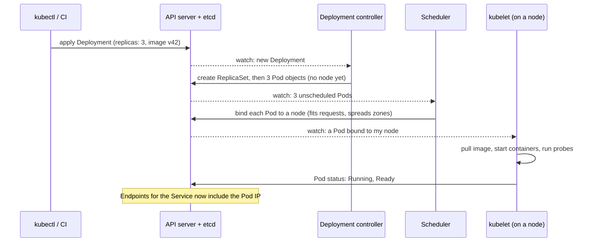

# Platform and Infrastructure

This file covers the userspace-visible packaging and orchestration layer: containers, Kubernetes, service mesh, eBPF, and delivery tooling. It sits directly on top of the OS-level primitives (processes, cgroups, namespaces) covered in [Operating Systems for System Design](01_operating_systems.md) — read that first if the process/kernel mechanics underneath containers are unclear; this file does not repeat that detail.

## Foundations — What a Platform Is For

### The layers under a service

Between your code and the hardware sit several layers, each hiding the one below:

| Layer | What it gives you | Examples |
|---|---|---|
| Physical or virtual machine | CPUs, memory, disks and a network card | Bare metal, EC2, GCE |
| Operating system | Processes, files, sockets, isolation primitives | Linux ([Operating Systems & Hardware Symbiosis](../../CSFundamentals/01_operating_systems_deep_dive.md)) |
| Container runtime | A packaged process with its own filesystem, namespaces and cgroup limits | containerd, CRI-O |
| Orchestrator | Places containers on machines, restarts them, connects them, scales them | Kubernetes, Borg, Nomad, ECS |
| Platform services | Deploys, config, secrets, service discovery, traffic policy, observability | CI/CD, a service mesh, a secrets manager |

A **platform** is the set of those layers a company offers its engineers so each team doesn't
rebuild them. The design question in an interview is rarely "how does Kubernetes work" for its
own sake — it is "what does the platform promise my service (restarts, placement, discovery,
limits), and what does it still leave to me (graceful shutdown, idempotency, capacity)?"

### The one idea behind modern orchestration: reconciliation

Older tools ran **imperative** scripts: "start 3 copies on these hosts." If a host died at 3 a.m.,
nothing noticed. Borg, Kubernetes and their descendants are **declarative**: you store the *desired
state* ("3 replicas of image v42, each with 1 CPU"), and **controllers** run a loop forever:

1. Observe the actual state.
2. Compare it with the desired state.
3. Take one step to reduce the difference.

A crashed container, a lost node or a hand-edited resource is just another difference, fixed by the
same loop. This is why deploying is "change the desired state and wait," why the system heals
itself, and why GitOps works: put the desired state in Git, and a controller reconciles the cluster
to it.

### Vocabulary

| Term | Meaning |
|---|---|
| Image | An immutable, versioned filesystem snapshot plus a start command |
| Container | A running instance of an image: a process in its own namespaces and cgroup |
| Desired / actual state | What you declared vs what is running; controllers close the gap |
| Control plane / data plane | The components that decide (API server, schedulers, controllers) vs the ones that serve traffic (nodes, proxies) |
| Request / limit | The resources a scheduler reserves for a container / the most it may use |
| Rollout | Replacing one version with another: rolling, blue-green or canary |
| Blast radius | How much breaks if a change is bad |

## Containers vs VMs

| | VM | Container |
|---|---|---|
| Isolation unit | Full guest OS + kernel per VM. | Process(es) sharing the host kernel, isolated via namespaces/cgroups. |
| Startup time | Seconds to minutes (boots a kernel). | Milliseconds to seconds (starts a process). |
| Density | Fewer per host (each carries a full OS). | Many per host (shared kernel overhead only). |
| Isolation strength | Stronger — separate kernel. | Weaker by default — shared kernel is a shared attack surface. |
| What it packages | An entire machine. | A process and its dependencies (the exact bytes it needs to run, not a whole OS). |

A container is not a VM and not a security boundary by itself — it is dependency packaging plus OS-level isolation primitives. Do not treat "it's containerized" as equivalent to "it's sandboxed against a hostile workload"; that guarantee needs additional controls (gVisor/Kata-style stronger isolation, seccomp profiles, non-root users, read-only filesystems) on top of the base container.

## Kubernetes core concepts

| Concept | Problem it solves |
|---|---|
| Pod | Smallest deployable unit — one or more tightly-coupled containers that must be scheduled, scaled, and networked together. |
| Deployment | Declarative rollout and self-healing for stateless replicas — desired replica count is continuously reconciled. |
| StatefulSet | Stable network identity and stable storage per replica, for workloads that aren't interchangeable (a DB node, not a stateless web server). |
| Service | A stable virtual IP/DNS name that load-balances across a changing set of pod IPs — pods come and go, the Service address doesn't. |
| Ingress / Gateway | External HTTP(S) routing into the cluster, with host/path rules, without a load balancer per service. |
| ConfigMap / Secret | Externalizes configuration from the container image so the same image runs in every environment; Secret still needs real access control — it is not encryption by default. |
| Namespace | Logical partition of a cluster for multi-team/multi-env isolation of names and RBAC scope. |
| Requests/limits | Tells the scheduler how much CPU/memory a pod needs (request) and caps what it can consume (limit) — prevents one workload from starving others on a shared node. |
| HPA (Horizontal Pod Autoscaler) | Adjusts replica count from a metric (CPU, custom queue-depth metric) instead of a human watching a dashboard. |
| Liveness/readiness/startup probes | Distinguishes "restart this container" (liveness) from "stop sending it traffic but don't restart it" (readiness) from "still starting, don't do either yet" (startup) — conflating these causes either premature traffic or unnecessary restarts. |

## When Kubernetes is actually justified

Kubernetes is a good answer when an organization already has multiple teams, multiple services, and enough operational complexity (varied scaling needs, multi-environment consistency, a platform team to own it) that the orchestration primitives pay for themselves. For a small team shipping one or a handful of services, a managed application/container platform (a managed container-as-a-service offering, a PaaS) is usually the better first operational choice — it gets the same "don't hand-manage servers" benefit without the cluster's own operational surface (upgrades, RBAC, networking CNI choices, etcd health) becoming a second product to run. Reaching for Kubernetes because it's the default system-design-interview answer, without the team/scale to justify it, is a tell, not a strength.

## Service mesh

A service mesh adds a uniform layer of service-to-service traffic policy, mutual TLS, retries/timeouts at the network layer, and telemetry — implemented via sidecar proxies (or increasingly, node-level/eBPF-based dataplanes) rather than per-service library code.

```arch
%% caption: A service mesh moves network concerns (mTLS, retries, telemetry) out of application code and into an adjacent sidecar proxy.
group podA "Pod A" color=blue style=dashed
node svcA "Service A" at 0,0 in podA icon=app
node prxA "Sidecar Proxy" at 0,1 in podA icon=internet color=slate

group podB "Pod B" color=green style=dashed
node svcB "Service B" at 2,0 in podB icon=app
node prxB "Sidecar Proxy" at 2,1 in podB icon=internet color=slate

svcA -> prxA : "localhost"
prxA <-> prxB : "mTLS + Retries"
prxB -> svcB : "localhost"
```

What it buys: consistent security and traffic controls applied at the infra layer instead of reimplemented in every service's application code, across languages.

What it costs: added latency per hop (proxy in the path), a new debugging surface (is the failure in my code or in the mesh's policy), and real operational complexity to run correctly. Critically, a service mesh does not replace application-level timeouts and idempotency — mesh-level retries on a non-idempotent operation cause the exact same duplicate-side-effect bug that application-level retries would, just relocated to infrastructure you don't control as directly.

## eBPF

eBPF runs small, verified programs inside the Linux kernel at defined hook points, without writing a kernel module. It is increasingly used for low-overhead networking (mesh dataplanes that skip a userspace proxy hop), observability (capturing syscalls/network events with far less overhead than traditional agents), and security enforcement. Know what it is and why it's attractive (near-zero overhead compared to userspace instrumentation), but it is not something to reach for as a default interview answer — it is a specialized platform capability that shows up when you already have a large fleet and a dedicated platform team optimizing tail overhead, not a starting design choice.

## IaC, GitOps, and progressive delivery

| Practice | What it buys | What it does not replace |
|---|---|---|
| Infrastructure as Code (IaC) | Provisioned resources defined in reviewable, versioned files instead of manual console clicks — repeatable, diffable, auditable changes. | A tested backup/restore plan — IaC recreates infrastructure shape, not lost data. |
| GitOps | Desired state lives in Git; a controller continuously reconciles the live system to match it, giving a clear audit trail and rollback-by-revert. | Correct application-level rollback semantics (schema/data migrations don't revert just because config does). |
| Progressive delivery | Releases to a small cohort first, watches guardrail metrics, then expands — bounds the blast radius of a bad deploy. | A rollback plan for the cohort that already got the bad version, or for state changes that already happened. |

Each of these reduces operational risk and human error. None of them substitutes for the two things that actually save you during a real incident: a backup you have restored and verified, and a rollback path you have actually exercised before you need it under pressure.

## How Kubernetes works underneath

The concept table above lists the objects. What happens when you apply a Deployment shows how they
fit together, and every step is one of the reconcile loops from the Foundations:



- **The API server backed by etcd** (a Raft-replicated key-value store,
  [Distributed Systems Fundamentals](../../CSFundamentals/15_distributed_systems_deep_dive.md) §6) is the only source of truth. Every other
  component *watches* it and writes back; they never call each other. Losing a controller for a minute
  delays reconciliation; losing etcd quorum stops all changes to the cluster (running pods keep running).
- **The scheduler** places a pod on a node whose free *requests* (not actual usage) fit the pod's
  requests, then scores candidates — spreading replicas across zones, packing or spreading load.
- **The kubelet** on each node makes its pods real: pulls images, starts containers through the
  container runtime, runs liveness/readiness probes, and reports status.
- **Networking:** every pod gets its own IP routable across the cluster (the CNI plugin arranges it). A
  **Service** gets a stable virtual IP and DNS name; `kube-proxy` (iptables or IPVS rules) or an eBPF
  dataplane translates that virtual IP to one of the ready pod IPs. That is the L4 balancing of
  [Scaling and Load Balancing](13_scaling_and_load_balancing.md) — per connection, which is why
  long-lived gRPC connections need L7 or client-side balancing.

## CPU limits and throttling, worked

Requests and limits look similar and behave completely differently:

- A **CPU request** is a scheduling reservation and a *weight*: under contention, containers get CPU in
  proportion to their requests. A container can use more than its request when the node is idle.
- A **CPU limit** is a hard ceiling enforced by the kernel's CFS bandwidth control **per 100 ms
  period**: a limit of 0.5 cores means at most 50 ms of CPU time in each 100 ms window, across all the
  container's threads. When the quota runs out, every thread of the container is paused until the next
  period starts.
- A **memory limit** is enforced by the OOM killer: exceed it and the container is killed (exit code
  137, [Operating Systems & Hardware Symbiosis](../../CSFundamentals/01_operating_systems_deep_dive.md) §10). Memory can't be throttled, only taken
  away.

The per-period enforcement is what surprises people. A multithreaded service burns its quota in a
burst and then sits frozen for the rest of the period:

```python
"""CPU limits are enforced per 100 ms period (Linux CFS bandwidth control).
A request needs 40 ms of CPU, spread over 4 threads (10 ms each, in parallel),
arriving at the start of a period. How long does it take with each limit?"""

PERIOD = 100.0                          # ms, the kernel default cfs_period_us


def latency(cpu_ms, threads, limit_cores):
    quota = limit_cores * PERIOD        # CPU-ms the container may use per period
    remaining, t, periods_throttled = cpu_ms, 0.0, 0
    while True:
        burn = min(remaining, quota)
        wall = burn / threads           # threads run in parallel on idle cores
        remaining -= burn
        if remaining <= 0:
            return t + wall, periods_throttled
        t += PERIOD                     # quota exhausted: wait for the next period
        periods_throttled += 1


print("request = 40 ms of CPU on 4 threads; unthrottled it takes 10 ms")
for limit in (4.0, 1.0, 0.5, 0.25):
    ms, throttled = latency(40, 4, limit)
    print(f"  limit {limit:4} cores (quota {limit * PERIOD:5.0f} ms/period): "
          f"{ms:6.1f} ms, throttled in {throttled} period(s)")
print("average CPU use at 5 requests/s:", 5 * 40 / 1000, "cores")
```

```text
request = 40 ms of CPU on 4 threads; unthrottled it takes 10 ms
  limit  4.0 cores (quota   400 ms/period):   10.0 ms, throttled in 0 period(s)
  limit  1.0 cores (quota   100 ms/period):   10.0 ms, throttled in 0 period(s)
  limit  0.5 cores (quota    50 ms/period):   10.0 ms, throttled in 0 period(s)
  limit 0.25 cores (quota    25 ms/period):  103.8 ms, throttled in 1 period(s)
average CPU use at 5 requests/s: 0.2 cores
```

The container averages 0.2 cores, so a 0.5-core limit looks generous on a dashboard. But each request
needs 40 ms of CPU *now*: with a 0.5-core limit it gets 50 ms of quota per period and finishes in
10 ms; with 0.25 cores it gets 25 ms, is frozen for the rest of the period, and finishes after
**104 ms** — ten times slower, at low average CPU. This is the classic Kubernetes "p99 spikes while CPU
looks idle" incident, and the metric that reveals it is `container_cpu_cfs_throttled_periods_total`,
not CPU usage.

The common guidance follows: set CPU **requests** accurately (they drive scheduling and fair sharing),
be cautious with CPU **limits** on latency-sensitive services (many organisations omit them or set them
well above requests), always set **memory limits**, and match runtime settings to the limit (`GOMAXPROCS`
to the CPU limit in Go, `-XX:ActiveProcessorCount` or container-aware defaults in the JVM), or a runtime
that sees 64 host cores will start 64 threads that burn the quota in parallel.

## Rollouts, and how long a canary must run

Every deploy strategy trades speed, cost and blast radius:

| Strategy | How | Blast radius | Cost / catch |
|---|---|---|---|
| **Recreate** | Stop old, start new | Everything, with downtime | Only for dev or batch |
| **Rolling** | Replace instances a few at a time | Grows as the rollout proceeds | Old and new versions run side by side, so both must be compatible |
| **Blue-green** | Start a full new fleet, switch traffic at once | Everything, but rollback is one switch | Double capacity during the switch |
| **Canary** | Send a small slice of traffic to the new version, compare, then expand | The slice | Needs automated analysis and enough traffic to see a difference |
| **Feature flag** | Deploy dark, enable per user or cohort | Chosen cohort | Flag debt; the code path still ships |

A canary is only as good as its ability to *see* a regression, and small slices see slowly. Simulating
a subtle regression — the error rate doubles from 0.5% to 1.0% — at 2,000 requests a second, with a
statistical test on the canary versus the baseline:

```python
"""How long must a canary run to catch a regression? Baseline error rate 0.5%;
the new version fails 1.0% of requests. 2,000 requests/s in total; the canary
gets a slice. Every 10 s a one-sided two-proportion z-test compares canary and
baseline, and declares a regression once z > 3.5."""
import math
import random


def poisson(rng, lam):
    """Knuth's method: exact for the small per-second error counts here."""
    limit, k, p = math.exp(-lam), 0, 1.0
    while True:
        p *= rng.random()
        if p <= limit:
            return k
        k += 1


def minutes_to_alarm(slice_, bad, base=0.005, rps=2000, seed=0, max_min=240):
    rng = random.Random(seed)
    nc = ec = nb = eb = 0
    c = rps * slice_
    b = rps - c
    for second in range(1, max_min * 60 + 1):
        ec += poisson(rng, c * bad)
        eb += poisson(rng, b * base)
        nc, nb = nc + c, nb + b
        if second % 10:
            continue
        p = (ec + eb) / (nc + nb)
        se = math.sqrt(p * (1 - p) * (1 / nc + 1 / nb)) if 0 < p < 1 else 0
        if se and (ec / nc - eb / nb) / se > 3.5:
            return second / 60
    return None


RUNS = 40
print("regression: 0.5% -> 1.0% errors; no regression: both 0.5%")
for slice_ in (0.001, 0.01, 0.05, 0.25):
    hits = sorted(t for t in (minutes_to_alarm(slice_, 0.010, seed=s) for s in range(RUNS)) if t is not None)
    false = sum(minutes_to_alarm(slice_, 0.005, seed=1000 + s) is not None for s in range(RUNS))
    med = f"median {hits[len(hits) // 2]:5.1f} min" if len(hits) > RUNS // 2 else "median  > 4 h   "
    print(f"canary slice {slice_:5.1%} ({2000 * slice_:4.0f} req/s): regression caught in {len(hits):2}/{RUNS} runs, "
          f"{med}; false alarms with no regression: {false}/{RUNS}")
```

```text
regression: 0.5% -> 1.0% errors; no regression: both 0.5%
canary slice  0.1% (   2 req/s): regression caught in 40/40 runs, median  16.5 min; false alarms with no regression: 3/40
canary slice  1.0% (  20 req/s): regression caught in 40/40 runs, median   1.2 min; false alarms with no regression: 0/40
canary slice  5.0% ( 100 req/s): regression caught in 40/40 runs, median   0.5 min; false alarms with no regression: 0/40
canary slice 25.0% ( 500 req/s): regression caught in 40/40 runs, median   0.2 min; false alarms with no regression: 1/40
```

The smaller the slice, the fewer canary requests, the longer until the difference is distinguishable
from noise: the 0.1% canary needed a median of **16.5 minutes** to notice an error rate that had
*doubled*, against about a minute at 1%. It also raised the most false alarms, because a test run
every 10 seconds for hours will eventually see a noise spike — the "peeking" problem, which real
systems handle with sequential tests designed for continuous monitoring and a minimum sample size
before any verdict. A tiny canary limits the blast radius; it doesn't give you a fast or a
trustworthy answer. Hence the practices of real canary systems: **stepped traffic**
(1% → 5% → 25% → 50%) with a bake time at each step sized to the traffic, comparison against a
**baseline cohort** of the old version running at the same time (not against yesterday), **several
signals** (errors, latency percentiles, saturation, business metrics), and automatic rollback when a
guardrail trips. Large regressions are caught in seconds at any slice; the subtle ones are what the
math is for.

Two things no rollout strategy fixes: **schema and data changes** must be backward-compatible across
the versions running side by side (expand, migrate, then contract), and a **rollback must be rehearsed**
— including what happens to data written by the bad version.

## What each level should know

| Topic | L4 · Mid | L5 · Senior | L6+ · Staff |
|---|---|---|---|
| **Containers and orchestration** | Packages a service as an image and deploys it | Explains the reconcile loop, the control plane components and what happens on apply | Decides when Kubernetes is justified and what platform to build or buy |
| **Resources** | Sets requests and limits | Explains CPU throttling per period, OOM kills, and runtime settings under limits | Sets fleet-wide resource policy, bin-packing and cost targets |
| **Networking and discovery** | Uses a Service name | Explains pod IPs, virtual IPs, kube-proxy/eBPF, and L4 vs L7 inside the cluster | Chooses mesh vs library vs eBPF dataplanes with their operating cost |
| **Delivery** | Uses the team's pipeline | Chooses rolling, blue-green or canary; sizes canary steps; keeps versions compatible | Owns progressive-delivery policy, automated analysis and rollback standards |

## Interview checklist

- [ ] I can explain what a platform provides a service and what it leaves to the service.
- [ ] I can explain declarative reconciliation and trace a Deployment from `apply` to a Ready pod.
- [ ] I can explain the difference between CPU requests and limits, why limits throttle per 100 ms, and how that causes latency spikes at low average CPU.
- [ ] I can explain memory limits and exit code 137.
- [ ] I can explain how Services route to pods and why long-lived connections need L7 or client-side balancing.
- [ ] I can compare recreate, rolling, blue-green, canary and feature-flag rollouts.
- [ ] I can explain why small canaries detect subtle regressions slowly and how stepped canaries with baselines fix it.

## Related building blocks

- [Operating Systems for System Design](01_operating_systems.md) — the cgroups/namespaces primitives containers are built from.
- [Scaling and Load Balancing](13_scaling_and_load_balancing.md) — HPA and autoscaling triggers tie directly into this file's Kubernetes section.
- [Observability and Reliability](15_observability_and_reliability.md) — service mesh telemetry and eBPF observability feed the signals covered there.
