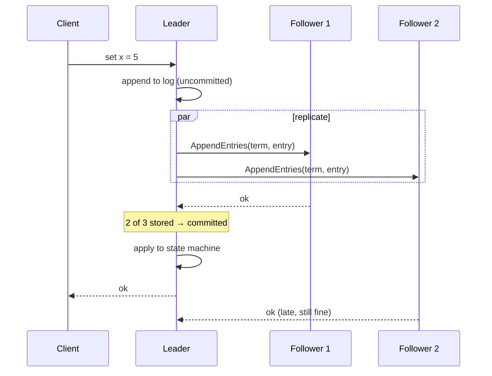
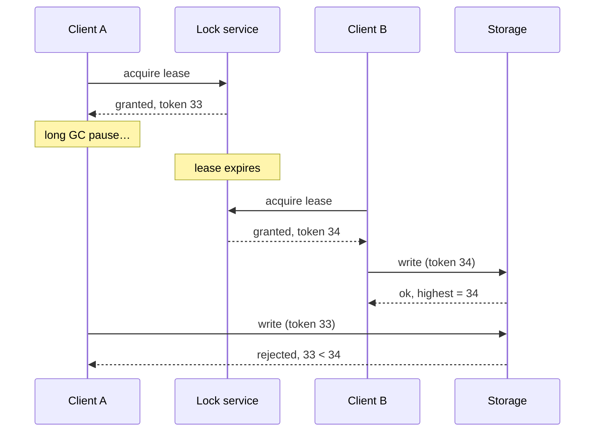

# Consensus and Coordination

Most of a large system should avoid coordination: it is slow, and it couples failures together. But a few decisions must be made exactly once, by everyone, even when machines crash and networks split — who the leader is, whether a transaction committed, which configuration is current. This file covers the tools for those decisions and when each one is worth its cost.

> 💡 Coordinate the small control plane (membership, leadership, locks, config); keep the data plane partitioned and coordination-free. A consensus store in the path of every user request is almost always a design smell.

## Why agreement is hard

A remote call has three outcomes: success, failure, and "I don't know". A node that stops responding might be dead, slow, or cut off by a partition — and it may still believe it is in charge. The [FLP result](06_database_internals.md) says no deterministic algorithm can guarantee agreement in a fully asynchronous network with even one crash, so every practical protocol uses **timeouts to suspect** failure and **majorities to decide**, so that two groups can never both believe they are the majority.

## Quorums and R + W > N

With `N` replicas, a write succeeds after `W` acknowledgements and a read queries `R` replicas and keeps the newest version.

- If `R + W > N`, every read set overlaps every write set in at least one replica, so a read sees the latest successful write.
- If `W > N / 2`, two conflicting writes cannot both succeed.
- Typical settings: `N = 3, W = 2, R = 2` (balanced) or `N = 3, W = 1, R = 3` (fast writes, slow reads).

| Setting | Consistency | Availability | Latency |
|---|---|---|---|
| `W = N` | Strong for reads with `R = 1` | One dead replica blocks writes | Write waits for the slowest replica |
| `W = 1` | Reads can miss recent writes unless `R = N` | Writes survive `N − 1` failures | Fast writes |
| `R + W > N` (majority) | Latest committed value visible | Survives a minority of failures | Waits for the median replica |

Quorums are not linearizability by themselves: concurrent writes, clock-based versions, and "sloppy" quorums that accept writes on stand-in nodes during partitions can still expose anomalies. Dynamo-style stores trade that away deliberately for availability.

```arch
%% caption: If R + W > N, the read and write quorums must overlap on at least one node, guaranteeing the read sees the latest write.
node cw "Client (Write)" at 0,0 icon=client color=blue
node cr "Client (Read)" at 0,2 icon=client color=green
group rep "Replicas (N=3)" color=slate style=dashed
node r1 "Node 1" at 3,-1 in rep icon=db color=blue
node r2 "Node 2 (Overlap)" at 3,1 in rep icon=db color=amber
node r3 "Node 3" at 3,3 in rep icon=db color=green

cw -> r1 : "writes"
cw -> r2 : "writes (W=2)"
cr -> r3 : "reads"
cr -> r2 : "reads (R=2)"
```

## Raft

Raft is the consensus algorithm most systems implement today (etcd, Consul, CockroachDB, TiKV, many internal Google-style control planes use Paxos-family equivalents). It turns consensus into two sub-problems you can explain in an interview:

**Leader election.** Every server is a follower with a randomised election timeout (e.g. 150–300 ms). If it hears no heartbeat before the timeout, it becomes a candidate, increments the **term**, votes for itself, and asks others to vote. A server grants at most one vote per term, and only to a candidate whose log is at least as up to date as its own. A candidate with votes from a majority becomes leader and starts sending heartbeats. Randomised timeouts make split votes rare; a split just leads to a new term.

**Log replication.** Clients send commands to the leader, which appends them to its log and replicates them with `AppendEntries`. An entry is **committed** once it is stored on a majority *and* belongs to the leader's current term; only then is it applied to the state machine and acknowledged. A follower whose log disagrees is repaired by overwriting it with the leader's log.

**Safety properties worth naming:**

- *Election safety*: at most one leader per term (majorities overlap).
- *Leader completeness*: a committed entry is present in the log of every future leader (the voting rule guarantees it).
- A leader cut off in a minority partition cannot commit anything — the minority side is unavailable for writes. That is Raft choosing consistency under partition.



**Reads.** Reading from the leader's local state can be stale if that leader has been deposed without knowing it. Options: route reads through the log (slow, always correct), use a *ReadIndex* check (confirm leadership with a heartbeat round before serving), or use leader *leases* that rely on bounded clock drift.

## Paxos and Multi-Paxos, briefly

Paxos solves agreement on a single value with *proposers*, *acceptors* and *learners* in two phases (prepare/promise, accept/accepted). **Multi-Paxos** keeps a stable leader to skip the first phase for a sequence of values, which in practice makes it very similar to Raft. Google's Chubby and Spanner use Paxos; in an interview, "a Paxos/Raft replicated log" is an acceptable level of detail unless the interviewer asks for more.

## Leases, locks and fencing tokens

A **lease** is a lock with an expiry: the holder must renew it before it runs out, so a crashed holder eventually releases it without anyone detecting the crash.

The classic bug: a leaseholder pauses (<abbr title="Garbage Collection. A form of automatic memory management that attempts to reclaim garbage, or memory occupied by objects that are no longer in use by the program.">GC</abbr>, <abbr title="Virtual Machine. The virtualization/emulation of a computer system.">VM</abbr> migration), its lease expires, a new holder is granted the lease, and then the old holder wakes up and writes anyway. The fix is a **fencing token** — a number that increases every time the lease is granted. The protected resource remembers the highest token it has seen and rejects writes carrying an older one.



> ⚠️ A distributed lock without fencing is only a performance optimisation (it reduces duplicate work). It is not a correctness guarantee.

## Coordination services: Chubby, ZooKeeper, etcd

| Service | Model | Typical use |
|---|---|---|
| Chubby (Google) | Paxos-replicated lock service with a small file system; coarse-grained locks held for hours. | Leader election for GFS/Bigtable masters, storing small config and root pointers. |
| ZooKeeper | Znodes (tree of small data), ephemeral nodes that vanish when a session ends, watches. | Leader election, group membership, config in Kafka (historically), HBase. |
| etcd | Raft-replicated key-value store with leases, watches, and transactions (compare-and-swap). | Kubernetes cluster state, service discovery, distributed locks. |

Design rules: keep the data small (kilobytes, not gigabytes), keep write rates low, prefer coarse-grained locks, and always handle the "lost my session" event.

## Membership and failure detection

- **Heartbeats with timeouts** are simple but binary: too short and you get false positives during <abbr title="Garbage Collection. A form of automatic memory management that attempts to reclaim garbage, or memory occupied by objects that are no longer in use by the program.">GC</abbr> pauses; too long and failover is slow.
- **Phi-accrual detectors** (Cassandra, Akka) output a suspicion level based on the observed heartbeat-interval distribution, so each consumer can pick its own threshold.
- **Gossip protocols** (SWIM, Cassandra, Consul's Serf) spread membership and health state by having each node periodically exchange state with a few random peers. Information reaches all `N` nodes in `O(log N)` rounds, there is no central coordinator, and load per node is constant. The trade-off is eventual, not instant, agreement on membership.

## Anti-entropy: read repair, hinted handoff, Merkle trees

Leaderless systems let replicas drift, then repair them in three complementary ways:

1. **Read repair**: when a quorum read sees different versions, the coordinator writes the newest version back to the stale replicas. Cheap, but only repairs keys that are read.
2. **Hinted handoff**: if a target replica is down during a write, another node stores the write with a "hint" and forwards it when the target returns. Keeps writes available during short outages.
3. **Merkle-tree anti-entropy**: each replica builds a hash tree over its key ranges (leaves hash key ranges, parents hash their children). Two replicas compare roots; if they match, they are in sync. If not, they descend only into mismatching subtrees, so finding a handful of differing keys among billions takes a few dozen hash comparisons instead of a full scan. Dynamo, Cassandra and Riak use this for background repair.

## Clocks and ordering

| Tool | What it gives | Limit |
|---|---|---|
| NTP-synchronised wall clocks | Human time; roughly right (ms) | Drift, jumps backwards, skew between machines. Never the sole authority for ordering. |
| Lamport clock | A counter that respects causality: if A caused B, then `L(A) < L(B)` | Cannot tell concurrent events from causally related ones. |
| Vector clock | Detects concurrency (neither dominates) | Size grows with the number of writers. Used for conflict detection in Dynamo-style stores. |
| Hybrid logical clock (HLC) | Physical time plus a logical counter; causal and close to wall time | Needs bounded clock skew; used by CockroachDB, MongoDB. |
| TrueTime (Spanner) | An interval `[earliest, latest]` guaranteed to contain true time, from GPS and atomic clocks | Requires special hardware; Spanner waits out the uncertainty (commit wait) to give external consistency. |

> 🎯 Spanner in one sentence: every transaction gets a TrueTime timestamp, the leader waits until that timestamp is definitely in the past before acknowledging, and so timestamp order matches real commit order globally — which is what lets it offer lock-free consistent snapshot reads across regions.

## Two-phase commit vs consensus

They solve different problems. **Consensus** makes *replicas of the same data* agree and tolerates a minority of failures. **Two-phase commit** makes *different participants* (shards, services) all commit or all abort, and it blocks if the coordinator fails between prepare and commit. Production systems combine them: Spanner runs 2PC across shards where each participant and the coordinator are themselves Paxos groups, so the coordinator cannot simply disappear. Across service or company boundaries, prefer sagas ([11_transactions_and_concurrency.md](11_transactions_and_concurrency.md)).

## Interview angles

- "How does leader election work?" → randomised timeouts, terms, majority votes, the up-to-date-log rule, what the old leader does when it comes back.
- "What if the network partitions?" → the majority side elects a leader and makes progress; the minority side cannot commit. Name the availability cost.
- "How do you make sure only one worker processes a job?" → lease plus fencing token checked by the resource, or an idempotent job with a conditional state transition.
- "How do replicas that missed writes catch up?" → hinted handoff, read repair, Merkle-tree anti-entropy.

## Related building blocks

- [06_database_internals.md](06_database_internals.md)
- [10_distributed_systems_theory.md](10_distributed_systems_theory.md)
- [11_transactions_and_concurrency.md](11_transactions_and_concurrency.md)
- [25_partitioning_and_hot_keys.md](25_partitioning_and_hot_keys.md)
- [24_google_papers.md](24_google_papers.md)
