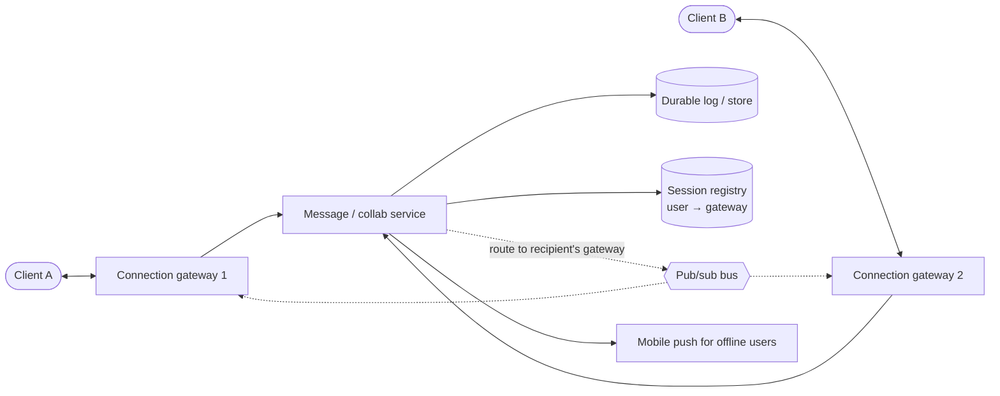

# Real-Time Communication and Collaboration

Chat, live notifications, multiplayer cursors, and collaborative documents all break the request/response model: the server needs to reach the client the moment something happens, and several people may change the same state at once. This file covers the transports, the server architecture for millions of open connections, presence, and the two families of algorithms that make concurrent editing converge.

## Choosing a transport

| Transport | How it works | Latency | Cost per idle client | Direction | Good for |
|---|---|---|---|---|---|
| Short polling | Client asks every N seconds. | Up to N seconds | A full HTTP request every interval | Client → server | Rare updates, simplest possible client |
| Long polling | Server holds the request open until there is data (or a timeout), then the client re-opens. | Near-instant | One hanging request; a new request per message | Server → client | Legacy environments, firewalls that block WebSockets |
| Server-sent events (SSE) | One long-lived HTTP response streaming `text/event-stream`. Automatic reconnect with `Last-Event-ID`. | Instant | One connection | Server → client only | Live feeds, notifications, token streaming from LLMs |
| WebSocket | HTTP upgrade to a persistent full-duplex TCP connection; small frames. | Instant | One connection | Both | Chat, collaborative editing, games, presence |
| WebTransport / QUIC | Multiplexed streams and datagrams over HTTP/3. | Instant | One connection | Both | Emerging: media, games with unreliable datagrams |
| Mobile push (APNs/FCM) | Platform-owned connection wakes the app. | Seconds, best effort | Free for you | Server → device | Offline users, background delivery |

> 🎯 Default answer: WebSockets for bidirectional interactive features, SSE when updates only flow from server to client, and mobile push for users who are not connected. Always add a way to catch up from durable storage — no transport guarantees you did not miss something while disconnected.

## Architecture for millions of connections

A WebSocket is state pinned to one server. The design keeps that server thin and stateless apart from the socket itself:

- **Connection gateways** terminate WebSockets, authenticate, apply per-connection rate limits and backpressure (bounded outbound buffers; drop and let the client resync if it is too slow). A single well-tuned host can hold on the order of 100K–1M idle connections; the limit is usually memory per connection and file descriptors.
- **Session registry**: which gateway holds which user's connection, with a TTL heartbeat. The service publishes a message to the recipient's gateway (directly or via a pub/sub channel per gateway).
- **Durability first**: persist, then fan out. A client that reconnects asks for everything after its last acknowledged sequence number.
- **Load balancing**: L4 or L7 with long-lived connections means new connections distribute well but existing ones do not rebalance. Drain gateways gracefully on deploy (tell clients to reconnect with jittered backoff to avoid a reconnect storm).

## Presence

"Online / typing / viewing this doc" is soft state: frequently updated, cheap to lose, and never a source of truth.

- Clients heartbeat every 10–30 s; the registry stores `user → last_seen` with a TTL. Missing heartbeats → offline after the TTL.
- Fan presence out only to people who can see it (friends, doc collaborators), batched and rate limited — a user with 5,000 contacts flapping online/offline must not generate 5,000 writes per flap.
- Never infer delivery from presence. "Online" can be minutes stale.

## Collaborative editing: why naive merges fail

Two users edit the same document at the same moment. Each sends an operation expressed against the version *they* saw, e.g. "insert 'H' at position 1" and "delete position 2". When the second operation arrives at the first user, positions have already shifted, so applying it blindly deletes the wrong character — and the two copies diverge permanently. Last-writer-wins on the whole document is worse: it throws away someone's work.

## Operational transformation (OT)

OT transforms each incoming operation against the concurrent operations that have already been applied locally, adjusting positions so the *intent* is preserved:

- An insert before your position shifts your position right; a delete before it shifts it left.
- Two inserts at the same position are ordered by a deterministic tie-break (e.g. site ID).
- A delete of an already deleted character becomes a no-op.

In practice (Google Docs, Google Wave's lineage), a **central server** assigns a total order to operations. Each client sends ops tagged with the last server revision it has seen; the server transforms them against everything that happened since and broadcasts the result. That central ordering keeps the transformation rules tractable. The costs: a server is required for convergence, transformation functions are notoriously hard to get right for rich text, and offline editing produces long histories to transform.

## CRDTs

A **conflict-free replicated data type** is designed so that replicas can apply the same set of operations in any order and still converge, with no central coordinator.

- For text, each character gets a permanent unique ID (e.g. `(site, counter)`), and operations refer to IDs: "insert 'H' after character o1", "delete character o3". Positions are derived, never sent.
- Concurrent inserts after the same character are ordered by ID, so every replica sorts them the same way.
- Deleted characters remain as **tombstones** so later operations can still reference them; periodic garbage collection removes them once all replicas have seen the delete.

Families to name: counters (G-Counter, PN-Counter), registers (last-writer-wins with hybrid logical clocks), sets (OR-Set), and sequence CRDTs for text (RGA, Logoot, and modern implementations such as Yjs and Automerge).

| | OT | CRDT |
|---|---|---|
| Needs a central server | Usually yes | No |
| Offline and peer-to-peer | Painful | Natural |
| Metadata overhead | Small | IDs per element and tombstones; mitigated by run-length encoding |
| Implementation difficulty | Transformation correctness | Data-structure design and memory |
| Typical users | Google Docs, classic collaborative editors | Figma-style multiplayer (with a server authority), Automerge/Yjs apps, local-first software |

## A collaborative document service, end to end

1. Clients open a WebSocket to a **session server** that owns the live document (route by document ID with consistent hashing, so all editors of one document hit the same server).
2. The session server keeps the current document in memory, sequences operations (OT) or merges them (CRDT), and appends every operation to a durable **operation log**.
3. Periodically write a **snapshot** so loading a document means "latest snapshot + ops since", not replaying years of history.
4. Broadcast accepted operations and cursor/selection updates to connected collaborators; cursor updates are ephemeral and can be dropped under load.
5. Offline clients buffer operations locally and submit them on reconnect; the server transforms or merges them against what happened meanwhile.
6. Permissions are checked when the session opens *and* on each operation, so a revoked share takes effect immediately.
7. If the session server dies, clients reconnect; the document is reloaded from snapshot + log on another server. Unacknowledged client ops are re-sent (idempotent by op ID).

## Related building blocks

- [03_api_design_high_level.md](03_api_design_high_level.md)
- [09_messaging_and_streaming.md](09_messaging_and_streaming.md)
- [10_distributed_systems_theory.md](10_distributed_systems_theory.md)
- [19_consensus_and_coordination.md](19_consensus_and_coordination.md)
