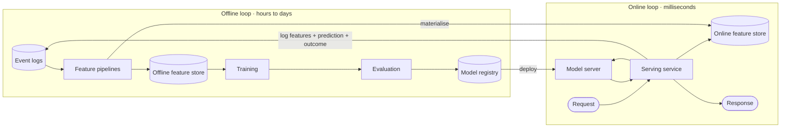

# ML and LLM Systems

Google designs increasingly include a model somewhere: a recommendation feed, search ranking, spam detection, or an LLM-powered feature. You are not expected to design the model. You are expected to design the **system around it** — how features get to the model, how predictions are served within a latency budget, how the model is kept fresh, how it is evaluated, and what it costs.

> 💡 Treat a model as a dependency with unusual properties: expensive per call, sometimes slow, probabilistic, silently degradable, and dependent on data pipelines that can break without any error.

## The two loops

## Feature stores and training-serving skew

A **feature store** keeps two views of the same features: an offline store (a warehouse table with full history, for training) and an online store (a low-latency key-value store with the latest value per entity, for serving). The main thing it prevents is **training-serving skew**: the model was trained on features computed one way and served features computed another way, so it quietly performs worse in production.

- Compute each feature with one definition, materialised to both stores.
- Use **point-in-time correct** joins for training — the feature value as it was when the label event happened, not today's value — to avoid label leakage.
- Log the exact features used at serving time so training can reuse them.

## Retrieval and candidate generation

Recommendation and search systems cannot score every item for every request. They use a funnel, and each stage is 10–100× more expensive per item and sees 10–100× fewer items:

| Stage | Input → output | Technique | Budget |
|---|---|---|---|
| Candidate generation (retrieval) | Millions → ~1,000 | Embedding nearest-neighbour search, co-visitation lists, rules, followed accounts | ~10–30 ms |
| Ranking | ~1,000 → ~100 | Heavier model with rich user/item/context features | ~50 ms |
| Re-ranking | ~100 → page | Diversity, freshness, business rules, deduplication, fairness | ~10 ms |

Several retrievers usually run in parallel and their candidates are merged, so fan-out and tail latency matter just as in search.

### Approximate nearest-neighbour search

Embeddings turn users, items, queries, and documents into vectors where similar things are close. Exact nearest-neighbour search over hundreds of millions of vectors is too slow, so systems use approximate indexes:

| Index | Idea | Trade-off |
|---|---|---|
| HNSW | Multi-layer proximity graph; search greedily walks from coarse to fine layers. | Excellent recall and latency; memory-hungry; slower to build and update. |
| IVF (inverted file) | Cluster vectors with k-means; search only the few nearest clusters. | Memory-efficient; recall depends on how many clusters you probe. |
| Product quantization (PQ) | Compress vectors into short codes; compare compressed distances. | Huge memory savings; some accuracy loss. Often combined with IVF. |
| ScaNN (Google) | Anisotropic quantization tuned for maximum inner product search. | State-of-the-art speed/recall for dot-product similarity at Google scale. |

Operational points: shard the index (by item partition) and fan out queries; rebuild or incrementally update as items change; filter (e.g. "in stock, in region") either before search with partitioned indexes or after with over-fetching.

## Model serving

- **Latency budget first**: decide how much of the request's p99 the model may use, and choose model size, hardware, and caching to fit.
- **Batching**: GPUs and TPUs are efficient only when they process many inputs at once. A serving system collects requests for a few milliseconds and runs them as one batch — trading a small, bounded latency increase for several times the throughput.
- **CPU vs accelerator**: small ranking models often run on CPU next to the service; large models need GPUs/TPUs in a dedicated serving tier.
- **Caching**: cache predictions for repeated inputs (popular queries, logged-out homepages) and cache embeddings for items that rarely change.
- **Fallbacks**: if the model is slow or down, serve a cheaper model, a cached result, or a heuristic (most popular). A recommender that times out should still show a page.
- **Rollout**: shadow traffic, then canary, then an A/B test on online metrics — offline metrics alone do not decide a launch.

## LLM serving

LLM inference has two phases with different bottlenecks:

1. **Prefill** processes the whole prompt in parallel and produces the first token. Cost grows with prompt length; this sets time-to-first-token.
2. **Decode** generates one token at a time, each step reading the growing **KV cache** (attention keys and values for all previous tokens). This is memory-bound and sets tokens per second.

Key techniques to name:

| Technique | What it does | Why it matters |
|---|---|---|
| Token streaming (SSE) | Send tokens as they are produced. | Perceived latency drops to time-to-first-token. |
| Continuous batching | Add new requests to the running batch as soon as any sequence finishes. | Several times higher throughput than static batching (vLLM, TGI). |
| PagedAttention | Allocate KV cache in fixed-size blocks instead of one contiguous region per request. | Near-zero fragmentation → more concurrent sequences per GPU. |
| Prefix (prompt) caching | Reuse the KV cache for a shared prefix such as a long system prompt or document. | Cuts prefill cost and latency for repeated context. |
| Quantization | Store weights in 8 or 4 bits. | Fits bigger models or more batch per GPU; small quality cost. |
| Speculative decoding | A small draft model proposes tokens; the large model verifies several at once. | 2–3× faster decoding with identical outputs. |
| Semantic caching | Return a stored answer for a sufficiently similar earlier question. | Saves full generations; risk of serving a wrong answer if the threshold is loose. |

### Cost and quotas

LLM cost scales with tokens, so product decisions are cost decisions. Put per-user and per-tenant **token quotas** and rate limits at the gateway, choose the smallest model that meets quality per task (route easy requests to cheap models), cap `max_tokens`, cache aggressively, and track cost per feature as a first-class metric.

### Safety and quality

- Input filtering (prompt-injection and abuse classifiers) and output filtering (policy classifiers, PII redaction) around the model.
- Grounding: retrieval-augmented generation with citations for factual features.
- Evaluation: an offline eval set with automated graders for every model or prompt change, plus online feedback signals and human review samples.

## Monitoring ML systems

Everything in [15_observability_and_reliability.md](15_observability_and_reliability.md) still applies, plus signals that normal monitoring misses:

- **Data quality**: missing or null feature rates, schema changes, feature pipeline freshness.
- **Drift**: input distributions (PSI, KS test) and prediction distributions versus the training baseline.
- **Model quality**: online metrics (click-through, conversion, user ratings) sliced by segment, with delayed labels joined back.
- **Cost and capacity**: GPU utilisation, batch sizes, queue time, tokens per second, cost per request.

## Interview angles

- "Design YouTube recommendations" → funnel (candidates → ranking → re-ranking), embeddings + ANN for retrieval, feature store, logging for training, freshness of new videos (cold start), A/B testing.
- "Add an AI assistant to Gmail" → gateway with quotas, streaming, context assembly from the user's data with permission checks, prefix caching of the system prompt, safety filters, cost controls, graceful fallback when the model is unavailable.
- "How do you know the model got worse?" → drift and data-quality monitors, delayed-label quality metrics, canary comparisons against the previous model.

## Going deeper

This file is the overview. [31_ranking_recommendation_and_experimentation.md](31_ranking_recommendation_and_experimentation.md) goes further on what interviews actually probe: the ranking cascade with per-stage budgets, position bias and feedback loops, exploration and cold start, offline versus online metrics, and how experimentation platforms decide whether a model change worked. For a full worked design, see [032 Ranked Home Feed](../solutions/032_ranked_home_feed_solution.md) and [037 Experimentation Platform](../solutions/037_experimentation_platform_solution.md).

## Related building blocks

- [13_scaling_and_load_balancing.md](13_scaling_and_load_balancing.md)
- [20_specialized_data_structures.md](20_specialized_data_structures.md)
- [21_batch_and_stream_processing.md](21_batch_and_stream_processing.md)
- [31_ranking_recommendation_and_experimentation.md](31_ranking_recommendation_and_experimentation.md)
