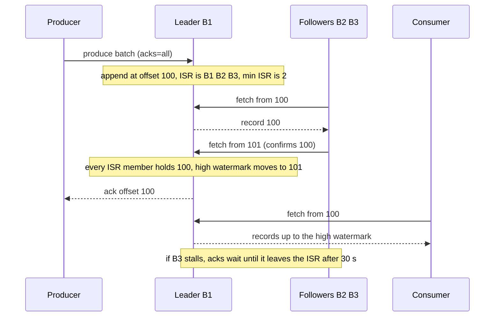

# Distributed Log Internals

A durable event stream ([09](09_messaging_and_streaming.md)) is not a queue with a bigger disk. It is a **partitioned, replicated, append-only log** whose consumers own their read position. That one choice explains its throughput, its ordering guarantee, its replay, and every way it fails. Saying "Kafka" commits you to all of it, so this block states the property first and the product second (Kafka, per its 4.0 documentation and the 2011 paper by Kreps, Narkhede and Rao).

> 🎯 Say the commitments, not the brand: "An append-only log partitioned by `order_id`. Order holds per partition only. A write is durable once every in-sync replica has it and at least two exist. Consumers commit after processing, so delivery is at-least-once and handlers are idempotent. I watch consumer lag, not CPU."

## The log abstraction

A **partition** is one log. Records are appended at the end, never modified, and numbered with increasing **offsets**. The log is stored as **segments**: files that are closed at a size or age limit and then immutable. A read is "records from offset *n*", so the broker keeps no per-message delivery state; the consumer remembers *n*.

| Piece | What it is | Documented fact |
|---|---|---|
| Segment | File named for its first offset; appends go to the last one only. | Rolls at 1 GiB or 7 days. |
| Sparse offset index | Offset to byte position, one entry per chunk of log, not per record. | One entry per 4 KiB (`log.index.interval.bytes`). |
| Time index | Timestamp to offset, so a consumer can "seek to 10 minutes ago". | A `.timeindex` file per segment. |
| Retention | Deletes whole segments by age or size, never the one being written. | 7 days, no size limit by default. |

```arch
%% caption: A read is two binary searches and a short scan, so its cost does not grow with the amount of data retained.
grid 160x100
node req "Fetch from offset 1,234,567" at 0,0 shape=pill color=slate
node seg "Binary search segments" at 0,1 shape=card icon=search sub="by first offset" w=260
node idx "Sparse index" at 0,2 shape=card icon=index sub="largest entry at or below the target" w=260
node scan "Scan forward" at 0,3 shape=card icon=file sub="at most about 4 KiB" w=260
node ret "Return a chunk from there" at 0,4 shape=pill color=green
req -> seg -> idx -> scan -> ret
```

The paper describes the same shape: segment files of about 1 GB, appends to the last, and an in-memory sorted list of each segment's first offset. Modern Kafka numbers records densely (the 2011 paper used byte positions). Because retention deletes whole segments, a quiet partition can keep data past `retention.ms` until its segment rolls.

**Decision rule:** "replay", "a second consumer later" or "rebuild state" means a log. "Each job once, then gone" means a queue.

## Why it is fast

| Property | Mechanism (Kafka docs unless noted) | Where it stops helping |
|---|---|---|
| Sequential I/O | Appends only. Docs: about 600 MB/s linear against about 100 KB/s random writes on their reference array. | Many partitions per spinning disk. |
| Page cache | No in-process cache; caught-up consumers cause no disk reads. | A consumer far behind reads from disk. |
| Batching | Producer batches per partition (`batch.size` 16 KiB, `linger.ms` 5 in 4.0), consumer fetches big chunks, batches stay compressed on disk. | Linger is latency added on purpose. |
| Zero-copy | `sendfile`: the paper counts 4 copies and 2 syscalls without it. | Not used with TLS. |
| Durability by replication | Flush is left to the OS by default; the docs say fsync on every write costs two to three orders of magnitude. | Loss of every replica's unflushed data at once. |

The paper measured 50,000 and 400,000 msgs/s for batch sizes 1 and 50 (200-byte messages, one producer, 2011). Quote the ratio, not the absolute: batching bought about 8x. In the sizing example below, 200 MB/s in 16 KiB batches is 12,200 batches/s instead of 200,000 records/s, a 16x cut in requests.

**What to say:** "Random writes become sequential, the OS does the caching, bytes skip user space, and durability comes from replication rather than fsync."

## Partitions: the unit of order and parallelism

Each partition is a separate log with its own leader. A key hashes to a partition; with no key the default partitioner sticks to one partition until it has produced `batch.size` bytes. Order exists **within** a partition only, and each partition has one consumer per group, so **partition count caps consumer parallelism and per-log throughput**.

- **Count:** `partitions >= max(T/p, T/c)` from target throughput `T`, measured per-partition produce rate `p` and per-consumer rate `c` (Jun Rao's 2015 Confluent post). Over-provision: the docs say partitions cannot be reduced, and adding them changes `hash(key) % n`, so keys move and per-key order breaks at the change.
- **Key:** the entity whose events must stay ordered (`conversation_id`, `account_id`, `sku`); ask "order relative to what" first ([09](09_messaging_and_streaming.md)).
- **Hot partition:** a key with 5% of 200 MB/s is 10 MB/s. Split the key if per-key order is not needed, pre-aggregate, or isolate the tenant ([25](25_partitioning_and_hot_keys.md)). More partitions never helps one key.
- **Too many:** more files, replication streams and elections per broker failure. Use the smallest count that meets the formula with 2x headroom.

**Decision rule:** partition by the key you would shard the database on; treat count as a one-way door.

## Replication: ISR, high watermark, leader epochs

Each partition has a leader and `RF - 1` followers that **pull** from it like consumers. The leader tracks the **in-sync replica set (ISR)**: followers with a live session that caught up within `replica.lag.time.max.ms` (30 s). A record is **committed** when every ISR member has it, only committed records reach consumers, and the **high watermark** marks the last one. This is not a majority quorum ([19](19_consensus_and_coordination.md)): it survives `f` failures with `f + 1` replicas, at the cost that commit latency follows the slowest ISR member, not the median.



**Leader epochs:** each leadership term gets an increasing epoch, checkpointed per partition. After failover a follower asks the new leader where the previous epoch ended and truncates there instead of trusting the high watermark. KIP-101 introduced this because high-watermark truncation could lose committed data or diverge logs after a fast leader change.

| Setting | Ack sent when | Loses data if | Write availability |
|---|---|---|---|
| `acks=0` | No wait (offset -1) | Any failure | Highest |
| `acks=1` | Leader wrote locally | Leader dies before followers fetch | High |
| `acks=all`, `min.insync.replicas=1` (default) | All *current* ISR, possibly only the leader | The last replica dies | High |
| `acks=all`, RF 3, `min.insync.replicas=2` | At least 2 replicas | 2 of 3 die before re-replication | Rejects writes if ISR is below 2 |
| `acks=all`, `min.insync.replicas=RF` | Every replica | Least likely | One broker down stops writes |

"All" means all *in-sync* replicas, so the guarantee is only as strong as `min.insync.replicas`. **Unclean leader election** (default off since 0.11) lets an out-of-sync replica lead when the whole ISR is gone: the partition stays available and may lose committed records. Rack awareness (`broker.rack`) spreads replicas across racks or zones, which is what makes RF 3 mean "survives a zone" ([15](15_observability_and_reliability.md)).

## Producer semantics

- **Retries duplicate.** After a network error the producer cannot know if the write committed (the docs compare it to inserting with an auto-generated key), so retrying is at-least-once. Retries are effectively unbounded, capped by `delivery.timeout.ms` (2 min).
- **Idempotent producer** (default in 4.0; needs `acks=all`, `max.in.flight <= 5`): the broker de-duplicates by producer ID and per-partition sequence number, so retries neither duplicate nor reorder. It covers one producer session, not a client that sends the same business event twice.
- **Transactions** (`transactional.id`): atomic writes to several partitions plus the consumer offsets; a restarted instance aborts its predecessor's open transaction. `read_committed` consumers read only up to the last stable offset, so **one hung transaction holds back every such consumer of that partition** until `transaction.timeout.ms` (60 s).

| "Exactly-once" holds for | It does not hold for |
|---|---|
| Kafka in, process, Kafka out: Kafka Streams, or transactional producer + `read_committed` + offsets in the same transaction. | Email, payment APIs, database writes. The docs say these need cooperation, such as storing the offset with the output. |
| Retries by one producer (idempotence). | Two client calls producing the same event: de-duplicate by event ID ([21](21_batch_and_stream_processing.md)). |

## Consumer groups, rebalancing, and offsets

Consumers sharing a `group.id` split the partitions; a **group coordinator** broker tracks members and stores committed offsets in an internal topic. A member is dropped if it stops heartbeating (`session.timeout.ms` 45 s) or does not call `poll()` within `max.poll.interval.ms` (5 min); each change triggers a **rebalance**.

| Mode | Effect | Cost |
|---|---|---|
| Eager (`RangeAssignor`, classic default) | Every member drops all partitions, then re-joins. | Whole group pauses. |
| Cooperative (`CooperativeStickyAssignor`) | Only partitions that must move are revoked, incrementally. | Needs a rolling upgrade. |
| Static (`group.instance.id`) | A restarting member keeps its partitions if back within the session timeout. | Real failures are detected later. |
| KIP-848 (GA in 4.0, opt in via `group.protocol=consumer`) | Broker-side assignment, no stop-the-world. | Needs 4.0-era clients and brokers. |

```arch
%% caption: The order of commit and processing decides whether a crash loses work or repeats it.
node poll "poll returns offsets 100 to 199" at 1,0 shape=pill color=slate
node a "Commit order" at 1,1 shape=diamond color=amber
node a1 "crash during processing" at 0,2 color=red
node a2 "restart at 200" at 0,3 color=red sub="100 to 199 skipped · AT-MOST-ONCE"
node b1 "crash before commit" at 2,2 color=orange
node b2 "restart at 100" at 2,3 color=orange sub="records repeated · AT-LEAST-ONCE"
poll -> a
a -> a1 : "commit 200 first"
a1 -> a2
a -> b1 : "process first"
b1 -> b2
```

Auto-commit (default on, every 5 s) can repeat a few seconds of work after a crash. Default to at-least-once with idempotent handlers; choose at-most-once only when a lost record is cheaper than a duplicate. **Consumer lag** (log end offset minus committed offset, per partition) is the primary SLI. Alert on lag *growing* over a window, and convert it to time: `lag / (capacity - inflow)`. With 6M records behind and 250k/s capacity against 200k/s inflow, drain time is 6M / 50k = 120 s.

## Retention versus compaction

| Policy | Keeps | Use for | Caveat |
|---|---|---|---|
| Delete | Everything newer than the time or size limit. | Event streams: clicks, logs, `OrderPlaced`. | Size limit is per partition. |
| Compact | At least the last record per key; a null value deletes the key. | Changelogs: CDC feeds, cache and index rebuilds, event-sourced and stream-processor state (docs). | Background job, skips the active segment, offsets never change; a consumer lagging more than `delete.retention.ms` (24 h) can miss deletes. |

Compaction lets one topic serve both the live tail and "bootstrap a new replica from full state" without unbounded growth.

## Metadata, the controller, and tiered storage

A **controller** tracks broker registration and, when a broker dies, elects new leaders from each partition's ISR in batches. The 2011 design used ZooKeeper; **KRaft** replaces it with a Raft-replicated metadata log on 3 or 5 controllers (a majority must live: 3 tolerates 1, 5 tolerates 2), one active and the rest hot standbys. Kafka 4.0 removed ZooKeeper mode. For an interview: a small consensus control plane plus an ISR data plane, and neither sits in a healthy produce path ([19](19_consensus_and_coordination.md)).

**Tiered storage** (KIP-405) moves completed segments to a remote tier such as S3 or HDFS through a plugin (Kafka ships none). `local.retention.*` bounds the disk, `retention.*` bounds the total. It buys disk decoupled from broker count; it costs slower cold reads and an extra system, and compacted topics are unsupported.

## What ordering can you claim?

| Claim | Holds? | Condition |
|---|---|---|
| One partition read in write order | Yes | Always (paper, docs). |
| One key ordered | Yes | Same partition, idempotent producer, partition count unchanged. |
| Across partitions or topics | No | One partition, or a downstream sequencer. |
| Across a rebalance | Per partition | Work may repeat; a thread pool inside a consumer breaks order unless keyed. |

## Comparison: which log or queue?

From each vendor's documentation; verify quotas before quoting them.

| | Kafka-style log | Pulsar-style | Managed pub/sub (Google Cloud Pub/Sub) | SQS-style queue | Kinesis Data Streams |
|---|---|---|---|---|---|
| Storage | Partition logs on broker disks (+ tier) | Brokers serve, BookKeeper stores segments | Managed, no partitions | Managed, deleted on ack | Managed shards |
| Order | Per partition | Per partition or key | Per ordering key (opt-in) | FIFO: per message group | Per shard |
| Replay | Any retained offset | Cursor reset | Seek to timestamp | None | 24 h to 365 days retention |
| Scale unit | Partition | Partition or subscription mode | Subscription | Workers | Shard (2 MB/s read) |
| You operate | Brokers, disks, partitions | Brokers and bookies | Nothing | Nothing | Shard count |
| Pick when | Replay, fan-out, throughput | Same, storage scaled apart | Managed fan-out, per-message ack | Jobs, retries, no order | AWS-native streams |

## Failure modes and what to say

| Failure | What you see | What to say |
|---|---|---|
| Slow follower | `acks=all` p99 rises, ISR shrinks after 30 s, under-replicated partitions alert. | "Commit follows the slowest ISR member; with `min.insync.replicas=2` a second loss rejects writes rather than losing data." |
| Broker dies | Leaders move in seconds; producers retry after a metadata refresh. | "Controlled shutdown moves leaders first (milliseconds). Replicas span zones." |
| Poison message | One partition's lag grows at a fixed offset. | "The plain consumer has no DLQ: catch permanent errors, publish to a dead-letter topic, commit past it, alert on depth" ([09](09_messaging_and_streaming.md)). |
| Rebalance storm | Members churn, lag climbs; often a slow batch exceeds `max.poll.interval.ms`. | "Lower `max.poll.records`, move slow work off the poll thread, use cooperative or KIP-848 and static membership." |
| Hot partition | One leader saturated, one consumer behind. | "Skewed key: split it or isolate the tenant." |
| Whole ISR lost | Partition offline. | "Default waits for the ISR (consistency). Unclean election trades committed records for uptime: a business call." |

## Worked example: sizing a 200k msgs/s stream

Assumptions (ours): 200,000 records/s peak at 1 KB, RF 3, 3 consumer groups, 3-day retention, brokers with 20 TB disk kept under 70% full, 10 Gbps NICs, 10 MB/s per partition to produce, 5 MB/s per consumer.

| Quantity | Arithmetic | Result | So we need... |
|---|---|---|---|
| Ingest | 200,000 x 1 KB | 200 MB/s | A small cluster: disk capacity, not speed, is the problem. |
| Retained, replicated | 200 MB/s x 86,400 s x 3 days x RF 3 | 51.8 TB raw, 155.5 TB replicated | Disk binds. |
| Brokers | 155.5 / (20 x 0.7) | 11.1, so 12 | 65% full, 71% after losing one. |
| Network per broker | Egress (2 followers + 3 groups) x 200 MB/s = 1 GB/s, / 12 | 83 MB/s of 1.25 GB/s (7%) | Network is not a constraint. |
| Partitions | max(200/10, 200/5) = 40, x2 growth | 96 | 288 replicas, 24 per broker. |
| Per partition | 200 MB/s / 96 | 2.1 MB/s, one segment per 8.6 min, about 500 in 3 days | A 5% key is 10 MB/s: at the ceiling. |
| Page cache | 48 GB / (600 MB/s replicated ingest / 12) | 16 min of tail | Consumers over 16 min behind hit disk. |
| Tiered, 6 h local | 200 MB/s x 21,600 s x 3 | 13 TB | Disk stops deciding: size by RF and zone headroom (6 brokers). |

An `acks=all` write across regions would put the inter-region round trip in every produce, so the standard answer is one cluster per region plus asynchronous mirroring (the docs' Geo-Replication section): see [27](27_multi_region_and_global_traffic.md).

## Interview angles

- **"Why is it fast, and durable?"** Sequential appends, page cache, batching, zero-copy; durability from replication and `min.insync.replicas`, not fsync.
- **"What does acks=all guarantee?"** Every *in-sync* replica has it; with min ISR 2 and RF 3 you survive one broker loss and stop writing at two.
- **"How many partitions?"** `max(T/p, T/c)` from measured rates, 2x headroom, one-way door, hot key.
- **"Exactly-once?"** Inside Kafka via transactions and `read_committed`; external effects need idempotent handlers or offsets stored with the output.
- **"Lag is climbing."** One partition means poison message or hot key; all means capacity. Convert to drain time, check rebalances.

## Related building blocks

- [09_messaging_and_streaming.md](09_messaging_and_streaming.md): log versus queue, ordering scope, DLQ.
- [10_distributed_systems_theory.md](10_distributed_systems_theory.md): consistency and ordering vocabulary.
- [19_consensus_and_coordination.md](19_consensus_and_coordination.md): Raft, quorums, why the ISR protocol differs.
- [21_batch_and_stream_processing.md](21_batch_and_stream_processing.md): exactly-once boundaries.
- [25_partitioning_and_hot_keys.md](25_partitioning_and_hot_keys.md): shard keys, hot keys.
- [15_observability_and_reliability.md](15_observability_and_reliability.md): failure domains, SLIs.
- [27_multi_region_and_global_traffic.md](27_multi_region_and_global_traffic.md): cross-region replication.
