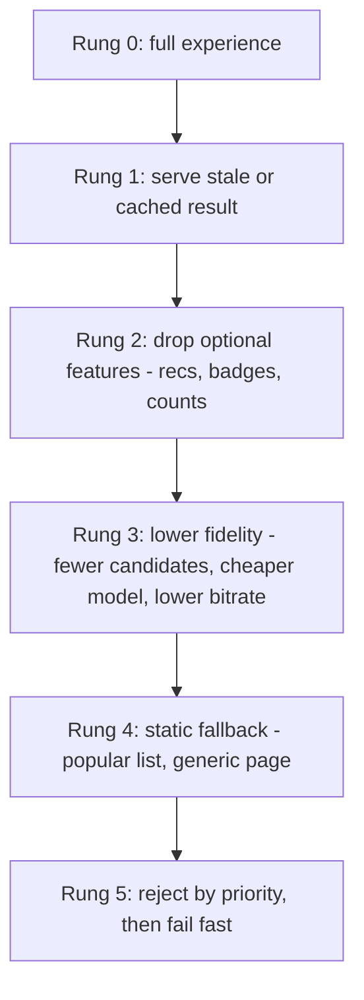
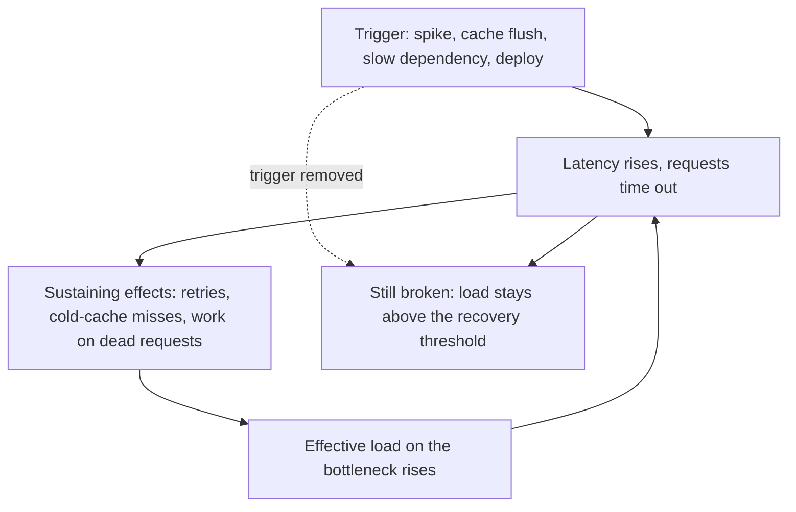

# Overload Control and Graceful Degradation

[12_application_resilience_patterns.md](12_application_resilience_patterns.md) gives you the per-call tools (timeouts, retries, breakers, bulkheads, bounded queues) and [13_scaling_and_load_balancing.md](13_scaling_and_load_balancing.md) gives you capacity and autoscaling. This block covers what happens when demand or latency exceeds capacity anyway: which work you refuse, how much you admit, which features you drop, and how you avoid a failure that outlives its cause. Every design survives the happy path, so Netflix, Meta and Google interviewers dig here.

> 🎯 The one-liner: "Past the knee the goal is goodput, not throughput. I bound every queue and concurrency, reject early and cheaply by priority, budget retries so layers cannot multiply, degrade optional features before failing anything, and rehearse it all with fault injection, because an overloaded system does not fail proportionally, it collapses."

## Why overload collapses instead of slowing down

**Goodput** is the rate of requests completed *usefully* (correct and inside the caller's deadline); **throughput** counts work done whether or not anyone still wants the result. Below capacity they are equal. Above it a naive server keeps throughput at 100% while goodput falls toward zero: queues grow until waits exceed caller timeouts, the server works on requests whose callers already left, and timed-out callers retry, raising offered load.

The utilisation math is in [12](12_application_resilience_patterns.md): Little's Law `L = λW` is an identity that sizes pools, and the blow-up comes from `W = (1/μ)/(1 − ρ)` (10× service time at ρ = 0.9, 20× at 0.95). Past ρ = 1 there is no steady state. Worked example: 100 workers × 100 ms give `μ = 100 / 0.1 s = 1,000 rps`. Offer 1,500 rps; clients time out at 1 s and do not cancel.

| Server policy | What happens (derived) | Goodput |
|---|---|---|
| Unbounded FIFO | Queue grows 500/s, so a request arriving at second `t` waits `500t / 1,000 = 0.5t` s. It is useful only if the wait is ≤ 0.9 s, so after `t = 1.8 s` every reply is for a client that left. | 1,000 rps, then **0** at 100% busy |
| FIFO, drop expired at dequeue | Expired requests cost almost nothing, but every served request waited ≈ 0.9 s. | ≈ 1,000 rps, all at the deadline edge |
| Bounded queue of 100 | Wait ≤ `100 / 1,000 = 0.1 s`. The other 500 rps (33%) are rejected in microseconds. | 1,000 rps at ≈ 0.2 s |

So: overload control has one job, to spend capacity only on work whose result will be used and refuse the rest before it costs anything. **Decision rule:** never put an unbounded queue in front of a bounded resource.

## Admission control and load shedding: where and what

| Layer | Sees | Use it for |
|---|---|---|
| Client-side throttle | Its own accept/reject history | Stopping a fleet hammering a struggling backend. The SRE book (ch. 21, "Handling Overload") rejects locally with probability `max(0, (requests − K × accepts) / (requests + 1))`, `K = 2`: no throttling above a 50% accept ratio, about 50% local rejection at 25%. |
| Edge / gateway / LB | Tenant, endpoint, priority header | Cheapest rejection (before auth and body parsing): quotas, criticality classes, blunt mass shedding |
| Server entry | True in-flight count and latency | Protecting the process from any source of load (next section) |
| Dependency call site | Dependency health | Skipping optional calls (breaker, brownout) |

**What to shed.** By *criticality*: the SRE book describes four classes (CRITICAL_PLUS, CRITICAL, SHEDDABLE_PLUS, SHEDDABLE) carried in RPC metadata so downstream services honour upstream intent. By *cost*: scan-heavy and high-fan-out requests first. By *fairness*: per-tenant limits. By *sunk work*: a request rejected after four hops wasted them, so reject at the first hop that can.

**Rejection must be cheap.** Say serving costs 1 CPU unit and rejecting 0.1. With budget `C` and offered load `X`, accepted `a` satisfies `a + 0.1(X − a) = C`, so `a = (C − 0.1X) / 0.9`: `0.78C` of goodput at 3× overload, `0.56C` at 5×, **zero** at 10×, where the server spends everything saying no. So excess beyond a few × must be dropped at the LB or edge. **Decision rule:** reject at the cheapest layer that can choose, label every request with a criticality, keep rejection under ~5% of serving cost, and return `Retry-After` plus a "do not retry at this layer" signal.

## Adaptive concurrency limits

A fixed rate limit needs you to know capacity, which shifts with every deploy, noisy neighbour and dependency slowdown. Limit **concurrency** and let the server measure: Little's Law ties it to what saturates, `limit ≈ throughput × no-load latency` (1,000 rps × 0.1 s ≈ 100 in flight), and requests over the limit are rejected at once. Netflix's open-source `concurrency-limits` library and its 2018 tech-blog post "Performance Under Load" frame this as TCP congestion control for RPC: the limit is the congestion window, latency or drops are the signal.

| Limiter | Rule | Reacts to | Weakness |
|---|---|---|---|
| Static | Fixed, from a load test | Nothing | Stale after any change |
| AIMD | +1 per window while calls stay under a latency threshold, ×0.9 on drop or timeout (like TCP Reno) | Loss, timeouts | Reacts after damage, saw-tooth |
| Gradient / Vegas-style | `limit ← limit × (RTT_noload / RTT_now) + queue allowance`, smoothed | Rising delay, before failures | Noisy latency (GC, mixed-cost calls) makes it jitter |

When latency triples the gradient is 0.33 and the limit shrinks in a few windows *before* requests fail, which fits "slower, not down", the usual failure. Use one limiter per endpoint or cost class. **Decision rule:** a delay-based adaptive limit at server entry, plus a static bulkhead per dependency behind it.

## Queues, disciplines and deadlines

Under overload FIFO serves the oldest requests, the likeliest already abandoned. Facebook's "Fail at Scale" (Maurer, ACM Queue, 2015) describes **adaptive LIFO** (FIFO normally, LIFO once a queue builds) and controlled delay. CoDel (Nichols and Jacobson, ACM Queue, 2012) drops on *sojourn time* rather than length: bursts are absorbed, but a queue that never drains below a target delay over an interval is cut. The SRE book (ch. 22, "Addressing Cascading Failures") covers the same bounded-queue ideas.

| Discipline | Serves under overload | Gains | Costs |
|---|---|---|---|
| Bounded FIFO | Oldest first | Simple, fair | Old requests die in the queue |
| Adaptive LIFO | Newest once a queue builds | Fair when healthy, useful when not | Two modes to test, old work needs a timeout |
| CoDel-style | Drops by wait time | No length tuning | Needs a per-request timestamp |
| Priority queue | Critical first | Protects the critical path | Sheddable starves, so reserve a floor |

**Deadlines** ([12](12_application_resilience_patterns.md), [02](02_networking.md)) finish the job. At **dequeue**, drop any request whose remaining deadline is below the expected service time. Pass the remaining deadline and criticality in metadata. Cancel downstream work when the caller gives up, but never rely on cancellation alone. **Decision rule:** every request has a deadline and a criticality, and every queue is bounded, timestamped and drops expired work.

## Retry budgets and amplification

Retries multiply across layers. A gateway calls A, A calls B, B calls a database, each layer making 3 attempts (one try plus 2 retries). If the database is failing, one user request becomes `3 × 3 × 3 = 27` database calls, and with 3 *retries* (4 attempts) per layer it is `4³ = 64`, landing on the layer that can least afford it. Backoff and jitter ([12](12_application_resilience_patterns.md), AWS Builders' Library "Timeouts, retries, and backoff with jitter") spread retries but do not cap them. **Budgets** cap them:

- **Per-request cap** of a few attempts, plus a **per-client budget**: retry only while retries stay under ~10% of requests. gRPC's retry throttling (gRFC A6) is a token bucket where retries cost a token and successes refill 0.1. At 10% per layer the worst case is `1.1³ ≈ 1.33×`, not 27×.
- **Retry at one layer**, the one directly above the failing dependency, and pass "do not retry" upward (SRE book, ch. 21 and 22).

**Decision rule:** retries are a resource with a budget, owned by exactly one layer.

## Hedged requests and their cost

A hedged request sends a second copy of an idempotent read to another replica if the first has not answered by about p95, takes the first reply and cancels the other. Dean and Barroso, "The Tail at Scale" (CACM, 2013) report that hedging after 10 ms cut the 99.9th-percentile latency of a 1,000-key BigTable fan-out from 1,800 ms to 74 ms for about 2% extra requests, and describe *tied requests* that cancel on start.

Derived tail math: with 100 backends each slow 1% of the time, `1 − 0.99¹⁰⁰ = 63%` of requests hit a slow one ([18](18_back_of_envelope_estimation.md)). With an independent hedge a call is slow only if both copies are, `0.01² = 10⁻⁴`, so `1 − (1 − 10⁻⁴)¹⁰⁰ ≈ 1%`: a 63× cut for 5% extra load (the share unanswered at p95). The catch is the utilisation curve: at ρ = 0.9, +5% load gives ρ = 0.945 and `1/(1 − ρ)` goes from 10 to 18. Overload-driven slowness is *correlated* across replicas, so independence fails and the hedge feeds the fire. **Decision rule:** hedge only idempotent reads, only with headroom, count hedges against the retry budget, and switch them off when shedding starts.

## Circuit breaker vs shedding vs throttling

| | Decided by | Signal | Protects | Failure mode |
|---|---|---|---|---|
| Circuit breaker | Caller | Error or latency rate of one dependency | Caller's threads, gives the dependency room | All-or-nothing, flaps, ignores priority |
| Load shedding / concurrency limit | Callee or gateway | Own in-flight count, queue delay | The callee, per request by priority and cost | Needs cheap rejection and correct labels |
| Client-side throttle | Caller | Callee's accept ratio | The callee and the network | Needs per-backend history |

The breaker protects the caller from the callee, shedding protects the callee from everyone. Run both, and give the breaker a *latency* trigger, not only errors.

## Graceful degradation

| Product | Concrete rungs (design patterns, not any company's internals) |
|---|---|
| Feed | Serve the last ranked page (stale), drop "people you may know", rank with the light model only |
| Search | Cut candidates from 500 to 100 ([31](31_ranking_recommendation_and_experimentation.md)), skip spell-correct and ads |
| Video | Lower the default bitrate (Netflix publicly cut European bitrates in March 2020, reporting about 25% less traffic), disable previews |
| Checkout | Keep pay and order paths, drop recommendations, reviews and live stock badges |

**Brownouts** (Klein et al., ICSE 2014) automate the middle rungs by switching an optional component off for a fraction of requests when response time crosses a threshold. Netflix's Hystrix write-ups describe fallbacks such as cached or non-personalised data. Fallbacks rarely run, so exercise them continuously (Gabrielson, AWS Builders' Library, "Avoiding fallback in distributed systems"): a ladder never climbed will not work in an incident.

| Mode | When the dependency is unreachable | Use for |
|---|---|---|
| Fail-closed | Deny or error | Authorization, payments, safety checks |
| Fail-open | Allow, skip or use a default | Rate limiter, recommendations, flags, cache ([07](07_caching.md)) |
| Fail-static | Keep serving the last known good config or data | Routing and control-plane config, feature snapshots |

**Decision rule:** before the review ends, name a rung, a trigger and a fail mode for every dependency.

## Metastable failures

Bronson, Aghayev, Charapko and Zhu, "Metastable Failures in Distributed Systems" (HotOS 2021), define failures where a **trigger** (a spike, a cache flush, a slow dependency, a deploy) pushes the system into a bad state and a **sustaining effect** keeps it there after the trigger is gone. The system can be below its normal capacity and still not recover, because the bad state is stable and load must fall far below the trigger level (hysteresis).

Worked cold-cache loop (assumptions ours): 15,000 rps front load, 90% hit ratio, database capacity 2,000 rps. Healthy database load is `15,000 × 0.1 = 1,500 rps` (75%). A flush sends 15,000 rps at it (7.5×). It slows, requests time out, and the cache cannot refill because the reads that would refill it fail. To recover at a 0% hit ratio and 70% database utilisation, admitted load must be `0.7 × 2,000 = 1,400 rps`, 9% of normal, so you shed about **91%** until the cache warms. So: shed to the *recovery* level, not the safe level.

**Designing out:** remove the amplifiers (retry budgets, bounded queues, no work on expired requests); stop cache misses turning into database load (request collapsing, database-side admission control, pre-warmed or persisted caches, [07](07_caching.md)); give shedding a manual override that can go down to 5%; reproduce the trigger in a game day.

## After the storm: herds, ramp-up and autoscaling limits

When the dependency recovers, every client retries at once and every cache is cold, so recovery can knock it over again. Use jittered backoff, admit traffic on a ramp (5%, 20%, 50%, 100% at fixed intervals while watching latency), warm caches before taking traffic, use LB slow-start weights and warm-up readiness gates (SRE book ch. 22 covers slow start and cold caching).

Autoscaling is not an overload defence. New instances take tens of seconds to minutes ([13](13_scaling_and_load_balancing.md)), cold ones can fail health checks and flap, and more front-end capacity in front of a *slow dependency* only adds concurrent calls to the thing that is failing. Scale on queue delay or in-flight count, cap the maximum, and let shedding hold the line meanwhile.

## Chaos engineering and game days

Chaos engineering runs experiments on a live system to build confidence in it ("Principles of Chaos Engineering", principlesofchaos.org; Basiri et al., IEEE Software, 2016). Define a **steady-state** metric (for Netflix, stream starts per second), hypothesise it holds under a fault, inject the fault with a small **blast radius**, compare with a control, abort on a guard metric, fix what you learn. Netflix's documented practice runs from Chaos Monkey (random instance termination during working hours) through Chaos Kong (evacuating a whole AWS region) to ChAP, which routes a small share of traffic to matched control and experiment clusters. Google's DiRT ([15](15_observability_and_reliability.md)) is the same idea run by people, as is a **game day**: pick a scenario (dependency 3× slower, cache flushed, zone lost), write the predicted outcome, inject, record the gap. **Decision rule:** an untested rung or breaker is a hypothesis, so test each one in production with a small blast radius.

## Worked scenario: a dependency gets 3× slower

Assumptions (ours): service A has 20 instances × 50 threads = 1,000 threads. A request spends 10 ms in A and 40 ms waiting on dependency D, so 50 ms and capacity `1,000 / 0.05 = 20,000 rps`. Load is 12,000 rps, ρ = 0.6. D becomes 3× slower (120 ms). A request now holds a thread for 130 ms, capacity falls to `1,000 / 0.13 ≈ 7,700 rps`, and Little's Law says `12,000 × 0.13 = 1,560` threads are needed: ρ = 1.56 with no CPU or traffic change. A slow dependency is an overload on you. The excess is `12,000 − 7,700 = 4,300 rps` (36%).

| Defences stacked (top to bottom) | Outcome at A | Load on D |
|---|---|---|
| None: unbounded FIFO, 1 s client timeout, retries | Queue grows 4,300/s, goodput hits 0 after ≈ 1.6 s (queue ≈ 6,700), retries push offered load toward 36,000 rps | Every admitted request, plus A's retries at up to 3× |
| + deadlines, drop expired at dequeue | Goodput ≈ 7,700 rps (64%), p99 ≈ 1 s | Unchanged |
| + concurrency limit (≈ 1,000 = 7,700 × 0.13 s), bounded queue | 4,300 rps rejected in microseconds, p99 ≈ 150 ms | ≤ 7,700 rps |
| + criticality: 5,000 of the 12,000 rps is sheddable | All 7,000 rps of critical traffic served, sheddable gets the spare 700 | Unchanged |
| + brownout: skip D's optional widget for half of requests | Average `0.5 × 10 + 0.5 × 130 = 70 ms`, capacity `1,000 / 0.07 ≈ 14,300 rps`, ρ = 0.84: nothing rejected, half degraded | ≈ 6,000 rps |
| + breaker opens on D's latency | If D is optional a request costs 10 ms and capacity is 100,000 rps. If critical, requests needing D fail in ≈ 1 ms and the rest are untouched | Near zero, so D can recover |

Retry budgets apply to every row: if A retries each timed-out D call twice, D sees `12,000 × 3 = 36,000 rps` while slow; a 10% budget caps it near `12,000 × 1.1 ≈ 13,200`. **So:** rows 1 to 3 are about not collapsing, rows 4 and 5 about who gets served (degrading beat shedding, since row 5 rejects nobody), and row 6 about giving D room.

## The decision ladder to say aloud

1. Name the knee and keep headroom: about 60% average utilisation, under ~90% after losing a zone ([18](18_back_of_envelope_estimation.md)).
2. Bound everything: queues, concurrency, and a deadline on every request.
3. Reject early, cheaply and by criticality, with an adaptive limiter.
4. Budget retries at one layer, jitter them, hedge only with headroom.
5. Degrade optional features before failing requests, and name each rung and trigger.
6. Pick fail-open, fail-closed or fail-static per dependency.
7. Design out metastability: shed to the recovery level, ramp back up, protect cold caches.
8. Prove it with fault injection, a written hypothesis and a small blast radius.

## Interview angles

- **"A downstream service gets 3× slower. What happens?"** Compute new capacity and ρ (Little's Law shows the threads run out), then walk the defences in order, with numbers.
- **"Why not just autoscale?"** Lag, cold instances, a slow dependency behind the tier, quotas. Autoscaling handles the trend, shedding holds the line during it.
- **"3 layers each retry 3 times. What does the database see?"** 27× (64× with 3 retries), then budgets and retry-at-one-layer.
- **"Breaker versus load shedding?"** Caller-side versus callee-side, all-or-nothing versus per request by priority.
- **"The dependency is back but we are still down."** Metastable failure: name the sustaining loop, shed below the recovery level, ramp up.
- **"Would you hedge here?"** Yes for idempotent reads with headroom (63% to 1%), no when overloaded, always counted against the budget.
- **"How do you know the fallback works?"** A brownout or chaos experiment exercises it continuously, not first in an incident.

## Related building blocks

- [12_application_resilience_patterns.md](12_application_resilience_patterns.md) — timeouts, retries, breakers, bulkheads, queueing theory
- [13_scaling_and_load_balancing.md](13_scaling_and_load_balancing.md) — headroom, autoscaling signals and lag
- [15_observability_and_reliability.md](15_observability_and_reliability.md) — SLOs, alerts, canaries, incident response
- [07_caching.md](07_caching.md) — stampede protection and cache outage behaviour
- [18_back_of_envelope_estimation.md](18_back_of_envelope_estimation.md) — the arithmetic used here
- [02_networking.md](02_networking.md) — deadline and latency budgets
- [27_multi_region_and_global_traffic.md](27_multi_region_and_global_traffic.md) — shifting load between regions
- [31_ranking_recommendation_and_experimentation.md](31_ranking_recommendation_and_experimentation.md) — shrinking candidate counts as a degradation rung
