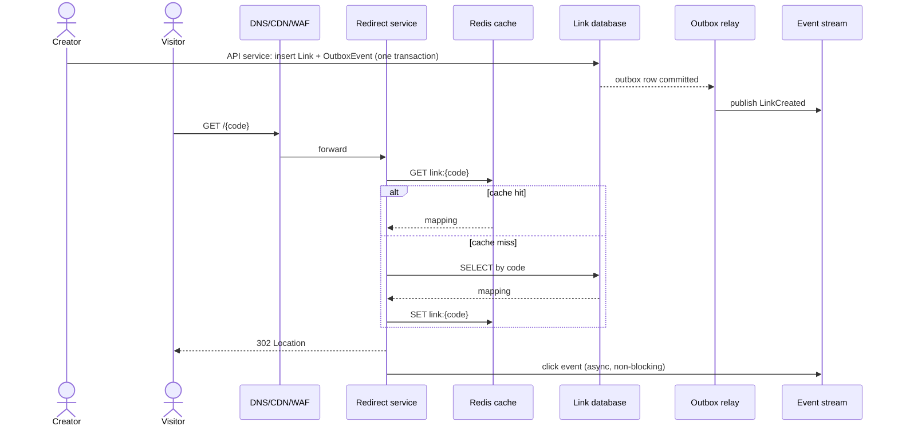

# 001 — URL Shortener: Detailed Solution

This is one strong starting design, not the only correct answer. Its central decision is simple: link mappings are authoritative durable data; redirect analytics are derived asynchronous data. That keeps a user’s redirect fast even when analytics is slow or unavailable.

## 1. Scope and assumptions

**In scope:** create a link, redirect, custom alias, disable link, basic click event. **Out of scope:** malware classification implementation, billing, collaborative ownership, complex branded domains, and detailed analytics dashboard.

The product promises that an enabled link redirects to its current destination. It does *not* promise that a just-created link is globally visible in every edge cache instantly. It promises analytics delivery within five minutes, not synchronously per click.

## 2. Estimate the workload

```text
Traffic (the question's contract: 100M creates + 10B redirects per month, 100:1)
100M creates/month ÷ 2.6M seconds/month ≈ 38 average creates/s
10B redirects/month ÷ 2.6M seconds/month ≈ 3,850 average redirects/s
Assume 5× peak: about 190 create/s and 19k redirect/s

Storage (assume 1 KB per link including URL, metadata and indexes)
100M × 1 KB ≈ 100 GB/month ≈ 1.2 TB/year
"Links are durable" → plan a 10-year horizon: 12B links ≈ 12 TB, ≈ 36 TB with 3 replicas

Bandwidth (assume ~500 B per request and ~500 B per 302 response, headers included)
19k/s × 0.5 KB ≈ 9.5 MB/s ≈ 76 Mbps each way at peak
monthly egress: 10B × 0.5 KB ≈ 5 TB

Hot set and cache (assumption: link popularity is Zipf-like with exponent 1 over 12B links,
so the top k links carry about (ln k + 0.58) / (ln 12B + 0.58) of the clicks; ~250 B per cache entry)
top 10M links  ≈ 2.5 GB   → ~70% of redirects
top 100M links ≈ 25 GB    → ~80% of redirects
top 1B links   ≈ 250 GB   → ~90% of redirects
```

Redirects are overwhelmingly read-heavy, and each number ends in a decision:

- **Bandwidth is not the constraint; connections are.** 76 Mbps is a fraction of one NIC, but a fresh TLS handshake per visitor costs CPU (roughly a millisecond each, an assumption), so terminate TLS at the edge with session resumption and keep-alive to the redirect tier.
- **Peak writes (190/s) never force sharding; storage does.** At 1.2 TB/year a single primary that comfortably holds ~4 TB (assumption) lasts about three years, so start unsharded but choose a `code`-hashable key now and plan the split by year 3.
- **Size the cache to the database's read budget, not to 99%.** 25 GB (about 100M entries) gives ~80% hits, so misses are 20% × 19k ≈ 3.8k reads/s at peak, a primary-key lookup a single SSD-backed node handles. Going to 250 GB buys ten more points for ten times the RAM. Real traffic also has recency (new links are clicked most), which only raises the hit rate, so treat the Zipf figure as conservative and measure the real exponent first.

The first scale investments are therefore edge/redirect cache, connection efficiency, and a compact indexed mapping lookup, not a sharded write database on day one.

## 3. API contract

```http
POST /v1/links
Authorization: Bearer …
Idempotency-Key: 58f0…

{ "destination_url":"https://example.com/products/123", "custom_alias":"summer-sale" }

201 Created
{ "code":"summer-sale", "short_url":"https://sho.rt/summer-sale", "status":"ACTIVE" }

DELETE /v1/links/{code}
204 No Content

GET /{code}
302 Found
Location: https://example.com/products/123
```

Why `302`? It permits changing destination/disable behavior. A permanent `301/308` may be cached aggressively by clients and intermediaries, making later changes difficult. Choose permanent redirects only for mappings explicitly intended to be immutable.

Creation needs an idempotency key: if the database succeeds but the response disappears, retry must return the same link, not create another one. A `409 Conflict` is appropriate when a requested custom alias belongs to someone else.

## 4. Data model

```text
Link(
  code PRIMARY KEY,
  destination_url,
  owner_id,
  status,              -- ACTIVE / DISABLED / EXPIRED
  created_at,
  expires_at NULL,
  version
)

IdempotencyKey(
  owner_id, key, request_hash, response_payload, expires_at,
  PRIMARY KEY(owner_id, key)
)

OutboxEvent(event_id PRIMARY KEY, type, payload, created_at, published_at NULL)
```

`code` is the direct lookup key for the hottest query. `owner_id, created_at` is useful for “list my links.” `status` is stored with the mapping because a redirect decision must consult authoritative current link state. Analytics is *not* stored synchronously in this table because it would turn every redirect into a write bottleneck.

## 5. Code generation choices

**Random base62 code:** choose random characters from 62 symbols. Seven characters offer `62^7` (about 3.5 trillion) possible codes. Attempt insert with a unique constraint; on rare collision, generate another. This is simple and makes enumeration harder than sequential IDs.

**Encoded unique ID:** generate a unique numeric ID and base62 encode it. No collision retry, but predictable sequences can aid enumeration unless obfuscated. A centralized incrementing ID generator may become a dependency; distributed time/worker IDs reduce that risk but make implementation more complex.

**ID-space math (why seven characters, and why the unique constraint is mandatory).**

```text
Codes needed in 10 years: 100M/month × 12 × 10 = 12B links
62^7 = 3.52T codes  →  fill at year 10 = 12B / 3.52T ≈ 0.34%
Expected insert attempts per create at fill f: 1 / (1 − f) ≈ 1.003 at year 10
6 characters: 62^6 = 56.8B → 21% full at year 10 → ~1.27 attempts per create (too crowded)
8 characters: 62^8 = 218T → room for a 100× growth
Birthday bound: a 50% chance of at least one collision after ~1.18 × √(3.52T) ≈ 2.2M random codes
Total colliding inserts over 10 years ≈ n² / 2N = (12B)² / (2 × 3.52T) ≈ 20M (about 0.17% of creates)
Density of live codes: 0.34% → a scanner guessing 10k codes/s finds ~34 live links/s
```

So seven characters have plenty of room, the retry path is rare but *will* run about 20 million times, which means the database unique constraint is the correctness mechanism and application-level "generate and hope" is not acceptable. The density line matters for abuse: random codes deter only casual enumeration, so pair them with rate limits and miss-ratio detection (section 8). Keep the code length a variable in the schema and the validator from day one so moving to eight characters later is a config change.

**Alternative: pre-allocated key ranges (a key-generation service).** A range allocator hands each creator instance a block of counter values (say 1M) with one atomic step such as `UPDATE ranges SET next = next + 1000000 RETURNING next`. The instance maps each counter value to a code through a keyed format-preserving permutation (for example NIST SP 800-38G FF1), so codes are unique by construction yet not sequential.

- *Numbers:* with 10 creator instances at 19 creates/s each at peak, a 1M block lasts about 14.6 hours, so the allocator sees roughly one request per instance per half day and is not a hot dependency.
- *What it gives:* no collision retries, no random-key probe on the unique index, and collision-free creation in several regions without cross-region coordination if each region is given disjoint ranges.
- *What it costs:* an allocator to run and make durable (lease state must be persisted before it is handed out, or two instances can issue the same block); a crash strands up to 1M unused values (about 0.00003% of the space, harmless); a permutation key to protect and rotate, since a leaked key makes codes predictable; and more moving parts than "insert and retry".
- *Decision:* random codes plus a unique constraint at this scale (0.3% retries, 190 creates/s). Switch to ranges when creation becomes multi-region active-active, or when creates grow ~100× and the fill (and retry rate) or the cross-region uniqueness check starts to hurt.

**Custom alias:** validate allowed syntax/reserved words, then rely on the unique primary key insert. Do not “check alias available” then insert as separate unprotected operations; two requests can race.

## 6. Baseline architecture and flows



### Create flow

1. Authenticate and authorize creator; validate destination URL and alias policy.
2. Check idempotency record. If same key/request exists, return saved response.
3. Generate code or reserve custom alias.
4. In one transaction insert `Link`, `IdempotencyKey`, and `OutboxEvent(LinkCreated)`.
5. Return created link. The outbox relay later publishes cache-warm/audit/analytics events.

Why outbox? If application process crashes after committing the link but before publishing an event, a separate relay sees the committed outbox row. Without it, downstream systems miss a real change.

### Redirect flow

1. Edge/WAF rejects obvious abuse and may serve a safely cacheable mapping.
2. Redirect service validates the code format and checks cache key `link:{code}`.
3. On cache miss, read `Link` by primary key from database. Cache active mapping for a bounded TTL; cache absent/disabled result briefly to resist repeated invalid-code probes.
4. Return `302` with destination only when status is active.
5. Enqueue click event asynchronously, with a bounded nonblocking path. If analytics path is unhealthy, redirect still succeeds and metrics record dropped/deferred events.

The redirect service should not synchronously call an analytics database, URL scanner, or remote authorization service per request unless the product’s security requirement demands it. Each call harms the latency and availability budget.

## 7. Cache trade-offs

Cache-aside reduces database reads at 19k peak redirect QPS; section 2 sizes it (about 25 GB for ~80% hits, leaving ~3.8k reads/s for the database). Mapping changes are rare, so a TTL is effective. The cache is not authoritative: on miss/outage, database lookup still works.

| Situation | Behavior |
|---|---|
| Cache hit | Fast redirect. |
| Cache miss | Read primary/replica according to freshness policy, populate cache. |
| Cache stampede | Coalesce requests per code; TTL jitter; allow stale-while-revalidate if disabled-link delay is acceptable. |
| Cache down | Database fallback with admission control; watch DB saturation. |
| Link disabled | Invalidate key immediately plus TTL as safety net; choose TTL to meet disable-propagation promise. |

If the owner must disable a malicious link globally within seconds, long unpurgeable CDN caches contradict that requirement. Either use short TTL/edge purge plus an origin check, or state a bounded propagation delay honestly.

## Click event schema and pipeline sizing

Analytics is derived data, so it gets its own schema, its own sizing and its own failure story.

```text
ClickEvent {
  event_id      uuid        -- dedupe key for at-least-once delivery
  code          string
  link_version  int         -- which destination was served
  ts            timestamp   -- server receive time, UTC (never the client clock)
  status        int         -- 302 / 404 / 410, so invalid-code probes are counted too
  country, region           -- from edge geo lookup
  ua_class      enum        -- browser family + device class + bot flag (raw UA discarded)
  referrer_host string      -- host only, not the full URL
  ip_hash       bytes       -- salted and truncated, raw IP not stored
  pop           string      -- serving location
}
```

```text
~200 B per event as JSON (assumption); 10B redirects/month
avg 3,850 events/s × 200 B ≈ 0.77 MB/s; peak 19k/s × 200 B ≈ 3.9 MB/s
per day 10B/30 × 200 B ≈ 67 GB; per month ≈ 2 TB raw
7-day stream retention × replication 3 ≈ 67 GB × 7 × 3 ≈ 1.4 TB
raw archive: 2 TB/month; columnar compression of roughly 5× (assumption) → ~0.4 TB/month
```

- **Throughput is small; partitions are for parallelism.** 3.9 MB/s peak is well within what a handful of partitions of a Kafka-style log carry, so pick 12-24 partitions for consumer parallelism and headroom, not for bandwidth.
- **Partition by `event_id`, not by `code`.** A viral link taking half the peak is ~9.6k events/s on one code, which would pin one partition and serialize its consumer. Counts are additive and commute, so each consumer pre-aggregates `(code, minute)` locally and writes deltas; ordering by key is not needed.
- **Freshness budget for "within five minutes":** 60 s aggregation window + under 2 min consumer lag + under 1 min OLAP ingest ≈ 4 min worst case, leaving a minute of slack. Alert when consumer lag passes 3 minutes.
- **Redirect-side delivery:** an in-process bounded buffer (say 10k events) flushed in batches. When it is full, drop the oldest and increment `click_events_dropped`; the redirect never waits. Analytics is at-least-once with `event_id` dedupe over a 10-minute window in the aggregator, or an accepted sub-percent overcount that you state. Billing-grade exactness needs the design in [027 — ad click aggregation](027_ad_click_aggregation_solution.md).
- **Storage tiers:** raw events to object storage as columnar files partitioned by day, plus an OLAP rollup by `(code, hour, country)` for dashboards. Rollup rows can never exceed raw events, and under a Zipf distribution top links collapse into few rows, so size the rollup from the measured distinct count.
- **Poison and replay:** malformed events go to a dead-letter topic with an alert; a consumer bug is fixed and replayed from the retained stream, so the 7-day retention is the repair window.

## 8. Failure, abuse, and security

- **Duplicate create:** idempotency table returns original result.
- **Code collision:** unique constraint rejects insert; retry generation.
- **Database temporarily unavailable:** creation fails safely; redirects can serve cached mappings until TTL/edge policy expires.
- **Cache unavailable:** fallback may overload database; rate limit invalid traffic, apply load shedding, add capacity, preserve core redirect function.
- **Analytics consumer fails:** retained events build lag; alert on lag; replay after recovery. Do not block redirect.
- **Open redirect abuse/phishing:** URL policy, malware/reputation pipeline, reporting, owner/account controls, rate limits, takedown/kill switch, audit trail. Validation alone cannot eliminate destination risk.
- **Enumeration:** random/long codes, rate limits, negative caching, abuse detection. Do not regard obscurity as authorization.
- **Tenant isolation:** owner endpoints authorize ownership; redirect endpoint needs only public mapping decision.

## 9. Observability and SLOs

| Signal | Why |
|---|---|
| Redirect success rate and p50/p95/p99 by region | User-facing SLI/SLO. |
| Cache hit rate, miss latency, eviction/memory | Detect cache effectiveness and pressure. |
| DB latency, connection pool saturation, error rate | Detect fallback risk. |
| Queue/consumer lag, click event drop count | Analytics freshness/data-quality promise. |
| Link disable propagation delay | Safety/product promise. |
| Create idempotency replay/conflict rate | Client/network behavior and misuse. |
| Invalid-code and WAF/rate-limit rate | Enumeration/abuse indicator. |

Example SLOs: 99.9% of valid redirect requests succeed in 28 days; p99 redirect <100 ms in primary region; 99% of click events available in analytics within five minutes. These targets let you decide when an edge/cache/database change is worth the complexity.

## 10. Scale and evolution

**Launch:** one region, relational link table with primary key, managed cache, object/stream service for analytics, backup/restore tested. This is intentionally boring.

**At read pressure:** increase CDN coverage, cache capacity, redirect instances, read replicas only if creation freshness behavior is handled. Compact link mappings may fit cache working set well.

**At database write/storage pressure:** at 190 creates/s writes are not the trigger; storage is (1.2 TB/year, so roughly year 3 for a node that comfortably holds ~4 TB). Partition links by a stable hash of code. A directory or consistent hash layer routes reads. Avoid cross-shard query on the redirect path. Keep owner listings in a separate query/index path if necessary.

**Multi-region:** route users to nearby redirect caches/services; replicate mappings. Creation/custom alias requires a clear uniqueness rule: home-region writes or a globally consistent allocator. Decide whether a newly created/disabled link has a bounded global propagation delay or pays coordination latency.

## 11. Why not these tempting designs?

| Temptation | Why not by default |
|---|---|
| Use sequential database IDs directly. | Easy enumeration and may expose volume; workable only if this is acceptable or IDs are obfuscated. |
| Put every click in the relational link transaction. | Redirect becomes write-bound and analytics outage becomes user outage. |
| Use Kafka/stream for link mapping as only database. | Point lookup/current state, uniqueness, admin mutation, and operational simplicity may be worse; choose only if event sourcing is a deliberate fit. |
| Cache forever. | Disable/destination changes and abuse response need invalidation/expiry. |
| Start globally active-active. | Alias uniqueness, conflict, replication, and operations become much harder before data proves the need. |
| Use a microservice per concern at launch. | Network/operational overhead without justified independent scaling; begin modular. |

## Follow-ups the interviewer will ask

1. **"How does this work across regions?"** Redirects read a regional replica of the mapping, so a link created in region A can 404 in region B for the replication lag (assume seconds); on a local miss for a well-formed code, fall back once to the home region before returning 404, and cap that fallback rate. Uniqueness is the hard part: give each region a disjoint slice of the code space (a leading region character, then 6 random characters; 4B links per region is 7% of 56.8B, so ~1.08 attempts) or disjoint key ranges, and route custom-alias creation, which is rare and can afford 100-200 ms, to one alias authority.
2. **"What changes at 10× and 100×?"** At 10×, peak is 190k redirects/s and about 38k cache-miss reads/s at 80% hits, so cache more and shard the mapping by `hash(code)`. At 100×, peak is 1.9M redirects/s and 19k creates/s, the corpus is 1.2T links (about 1.2 PB at 1 KB), and 7 characters would be 34% full with ~1.5 attempts per create, so move to 8 characters and to a horizontally scalable key-value store. Edge caches with short TTLs plus an in-process hot-set cache then serve most redirects.
3. **"What if disabling must take effect globally in seconds, or a creator must click their new link immediately anywhere?"** Read-your-writes on create: return the mapping in the create response and route the creator's first reads to the home region or write it through to the cache. For disable, keep a small denylist of disabled and blocked codes (10M codes × 8 B is about 80 MB per node), stream it to every redirect node, and check it before any cached mapping; that bounds propagation at seconds while mapping TTLs stay at minutes.
4. **"What dominates cost?"** Not the mapping (1.2 TB/year) or egress (about 5 TB/month) but the click pipeline: 2 TB/month raw plus the OLAP store. Levers: pre-aggregate per `(code, minute)` on each redirect node before sending, sample clicks for free-tier accounts, keep raw events 30 days and rollups longer, and add `Cache-Control: private, max-age=60` to the 302 so repeat visitors skip the server for a bounded time. Under RFC 9111 a 302 is cacheable only with explicit freshness, so this bounds the effect, unlike a 301, which browsers may cache indefinitely and which would hide repeat clicks and make disabling impossible.
5. **"How do you stop abuse?"** Rate limits per account and per IP at creation (see [002 — rate limiter](002_rate_limiter_solution.md)), reputation checks on the destination at create time and on a rescan schedule, a kill switch that writes to the denylist, an interstitial for flagged destinations, and rejection of destinations that are themselves short links (loops and chains). On the read side, watch the per-IP 404 ratio, because at 0.34% density a scanner at 10k guesses/s finds ~34 live links/s.
6. **"One link gets 10% of all traffic. What breaks?"** At today's peak that is ~1.9k requests/s on one cache key, which one Redis node handles easily. At 100× it is ~190k/s, past a single node, so serve the top few hundred codes from an in-process cache with a 1-5 s TTL on every redirect instance (a hot-key replica, see [25 — partitioning and hot keys](../building_blocks/25_partitioning_and_hot_keys.md)), and let the CDN absorb the rest.
7. **"Why random codes? A counter with base62 is simpler and has no collisions."** Sequential IDs let anyone enumerate every link and read your creation volume off the latest code, and a single counter is a coordination point. If enumeration does not matter (an internal tool) I would take a counter handed out in ranges. The middle path is a counter through a keyed permutation: no collisions, but not guessable.
8. **"If two people shorten the same URL, do they get the same code?"** No. Each create yields a new code, because owners need independent analytics, expiry and disable. Deduplication by URL hash would let one owner's takedown break another's link and would need a 32-byte index over 12B rows (~380 GB). If duplicates hurt, dedupe per `(owner_id, hash(url))` and return the owner's existing code.

## Common mistakes

1. **Saying "62^7 is huge, so collisions do not happen".** The birthday bound gives a 50% collision chance after only ~2.2M codes, and about 20M colliding inserts occur over 10 years. Keep a unique constraint and a retry path, and show the fill math.
2. **Check-then-insert for custom aliases.** Two requests both see the alias free, and both insert. Insert directly and treat the unique-key violation as `409`.
3. **Writing every click into the mapping database.** 19k writes/s at peak on a table that is otherwise read-only turns an analytics outage into a redirect outage. Emit asynchronously to a bounded buffer and a stream.
4. **Sharding for write QPS on day one.** Peak writes are 190/s. Storage (1.2 TB/year) is what eventually forces a split, so use a plain database plus cache and plan a `hash(code)` split for year 3.
5. **Using 301 by default, or caching forever.** Both make disable and destination changes unreliable, and 301 also hides repeat clicks. Use 302, give it an explicit short freshness if you want bounded browser caching, and state the disable-propagation delay.
6. **Keying the analytics stream by code.** A viral link then owns one partition and its consumer becomes the bottleneck. Partition by event id and aggregate additive counts downstream.
7. **Deriving the code from a hash of the URL.** Truncated hashes collide, and identical URLs from different owners share one code, so analytics and disabling get entangled. Generate codes independently of the destination.
8. **Ignoring the redirect-time abuse path.** A shortener is a phishing amplifier: skipping destination reputation checks, denylist propagation and scan-rate limits is a security gap, not an optimisation.

## Going from L5 to L6

- **Migration and rollout path.** Make code length and the store behind `code` replaceable from day one: variable-length codes, a repository interface, and a cutover done by dual-read then dual-write then verify then flip. Moving from one primary to `hash(code)` shards at year 3 and from 7 to 8 characters at 100× are planned, reversible migrations, not emergencies.
- **Cost model.** Show the cost per billion redirects and per million stored links as separate lines, and identify that the click pipeline, not the mapping, is the growing cost, with sampling, edge pre-aggregation and retention as the three levers.
- **Ownership and blast radius.** Split the control plane (create, manage, abuse review) from the data plane (redirect). The data plane holds a replicated read-mostly copy and a last-known-good cache, so a control-plane or database outage does not stop redirects; deploy each with canaries and separate on-call.
- **Build versus buy.** Serving redirects from a CDN's edge compute plus a key-value store is often cheaper and faster than running your own tier; a managed OLAP store and a URL reputation feed are also buy decisions. The build-worthy part is the abuse policy and the disable semantics.
- **What to measure first.** The real popularity exponent, the share of clicks within seven days of creation, the fraction of creates that are repeat URLs, and the abuse rate. They set the cache size, the CDN strategy and the denylist budget.
- **Phased evolution.** Ship a single-region relational mapping with a cache and an outbox, then add edge caching, then the denylist, then regional replicas, then sharding or a wide-column store, adding each only when its number (miss rate, propagation delay, latency, storage) crosses its threshold.

## 12. Build exercise

Build a local version with an HTTP API, PostgreSQL/SQLite, and cache abstraction.

1. Add link creation with random base62 codes and a database unique constraint.
2. Add idempotency key storage; kill the request after commit to simulate lost response.
3. Add redirect and cache-aside lookup; report hit/miss metrics.
4. Add a persisted outbox table and relay that writes click events to a file/queue.
5. Disable a link; test invalidation/TTL behavior.
6. Write a one-page ADR explaining random IDs vs encoded IDs and cache TTL choice.

Named assertions:

- `test_collision_retries_then_succeeds`: make the code generator return an existing code twice; assert the third attempt persists and exactly one row exists.
- `test_alias_race_returns_one_winner`: send two concurrent creates for `summer-sale`; assert one `201` and one `409`.
- `test_lost_response_replays_same_link`: commit, drop the response, retry with the same `Idempotency-Key`; assert the same `code` and one row.
- `test_analytics_outage_does_not_fail_redirect`: make the stream unavailable; assert redirects still return `302` and `click_events_dropped` increases.
- `test_disabled_link_denylist_beats_cache`: warm the cache, disable the link; assert the next redirect is not a `302` even though the cached mapping is still fresh.

If you can build and explain this system—including what fails—you have used most of the foundational building blocks correctly.
