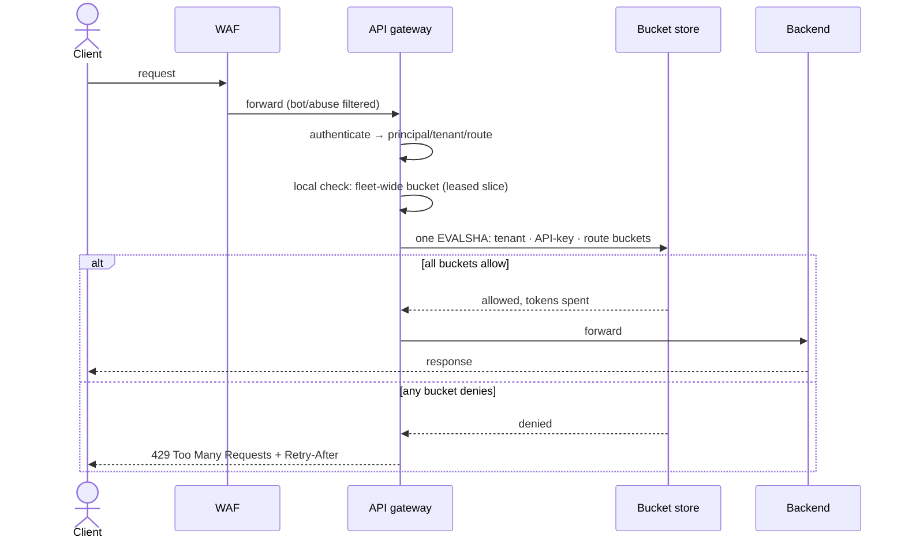

# 002 — Distributed Rate Limiter: Full System Design Solution

## Goal and contract

A rate limiter decides whether an actor may consume more work now. It protects availability, fairness, cost, and abuse boundaries; it is not merely a security feature.

The question's constraints are the contract (millions of keys, tens of thousands of requests per second, under 5 ms added at p99, no single point of failure, policy changes within a minute). The numbers below are the assumptions this solution picks inside those ranges:

- Each API key may make 100 requests/minute and burst to 20 requests.
- `POST /checkout` has a stricter 10 requests/minute limit.
- A tenant has a total plan quota independent of individual keys.
- The fleet has **5M active keys** and **50k peak requests/second** across about 50 stateless gateways. The limiter adds under **5 ms at p99**, and a policy change reaches every gateway within **one minute**.

The response contract includes decision, remaining allowance, and retry guidance:

```http
HTTP/1.1 429 Too Many Requests
Retry-After: 12
X-RateLimit-Remaining: 0
```

The key product decision is what each route does when the limiter's backing store is unavailable. The question is explicit that checkout must keep working in a safe degraded mode, so "fail closed" is not the answer for every sensitive route. State it per route:

| Route class | Limiter unavailable | Why |
|---|---|---|
| `POST /checkout` | **Degrade, do not reject:** a local conservative limit plus a per-gateway concurrency cap; keep serving | Rejecting all checkouts costs revenue, while unlimited checkouts invite card testing. Downstream fraud and payment limits still apply. |
| Authentication, expensive AI or report calls | **Fail closed** (or a much stricter local limit) | Unbounded cost or brute force is worse than rejecting some callers. |
| Cached product browse | **Fail open with a bounded local fallback** | Cheap, low risk, and rate limiting there is about fairness, not safety. |

## Algorithms

| Algorithm | How it behaves | Choose it when | Main weakness |
|---|---|---|---|
| Fixed window | Counter resets at a time boundary. | Coarse simple quota. | Boundary burst: nearly 2× quota in seconds. |
| Sliding log | Store every request timestamp in a window. | Small-volume exact policy. | Memory/write expensive. |
| Sliding counter | Combine current/previous window counts. | Smooth approximation. | Not perfectly exact. |
| Token bucket | Refill tokens steadily; spend per request; cap burst. | Most API limits. | Needs atomic time/refill/spend operation. |
| Leaky bucket | Drain accepted work at fixed rate. | Smooth downstream work/output. | Queues/delay rather than immediate admission. |

Use token bucket here. Store `(tokens, last_refill_ms)` under key `rl:{policy}:{actor}`. On each request, atomically calculate elapsed refill, cap at capacity, and either subtract cost or deny. Do not implement read → calculate → write as separate operations: concurrent requests will overspend.

Parameters that follow from the policies: the per-key bucket has capacity 20 and refill `100/60 = 1.67` tokens/s, so a key that has been idle can send 20 requests at once and then 1.67/s; it can only reach 100 in a minute by sending steadily. The checkout bucket has capacity 3 (an assumption) and refill `10/60 = 0.17` tokens/s.

## Atomic token bucket script (Redis Lua)

One `EVALSHA` per request checks every applicable bucket and spends from all of them or from none. This script was exercised against Redis 7: 120 concurrent calls against a fresh 20-token bucket admitted 21 (the capacity plus one second of refill) and never more.

```lua
-- KEYS: bucket keys that share one hash tag, e.g. rl:{t42}:key:k1  rl:{t42}:route:k1:checkout
-- ARGV: per bucket i: capacity_i, refill_per_second_i, cost_i
local t = redis.call('TIME')
local now = t[1] * 1000 + math.floor(t[2] / 1000)          -- ms, from the store's clock
local n, wait_ms, denied, tokens = #KEYS, 0, false, {}
for i = 1, n do                                            -- pass 1: refill and test, spend nothing
  local cap, rate, cost = tonumber(ARGV[3*i-2]), tonumber(ARGV[3*i-1]) / 1000, tonumber(ARGV[3*i])
  local h = redis.call('HMGET', KEYS[i], 'tokens', 'ts')
  local tk, ts = tonumber(h[1]), tonumber(h[2])
  if tk == nil then tk, ts = cap, now end                  -- missing key means a full bucket
  tk = math.min(cap, tk + math.max(0, now - ts) * rate)
  tokens[i] = tk
  if tk < cost then
    denied = true
    wait_ms = math.max(wait_ms, math.ceil((cost - tk) / rate))
  end
end
if denied then return {0, wait_ms} end                     -- all-or-nothing across buckets
local remaining = tokens[1] - tonumber(ARGV[3])
for i = 1, n do                                            -- pass 2: spend everywhere
  local cap, rate, cost = tonumber(ARGV[3*i-2]), tonumber(ARGV[3*i-1]) / 1000, tonumber(ARGV[3*i])
  local left = tokens[i] - cost
  redis.call('HSET', KEYS[i], 'tokens', left, 'ts', now)
  redis.call('PEXPIRE', KEYS[i], math.ceil(cap / rate))    -- idle for cap/rate ms means full again
  remaining = math.min(remaining, left)
end
return {1, math.floor(remaining)}
```

Why each detail is there:

- **One atomic call for several buckets.** A denied request spends nothing (verified against Redis 7: a request denied by the checkout bucket left the key bucket's tokens unchanged), so a request blocked by a stricter limit does not also burn the general allowance. In Redis Cluster all `KEYS` must hash to one slot, so the tenant, key and route buckets share the hash tag `{t42}`; otherwise the call fails with `CROSSSLOT`.
- **The store's clock, not the client's.** `TIME` inside the script gives one clock per shard. Redis replicates script effects rather than the script text (the default since Redis 5), so a non-deterministic call is safe.
- **Expiry is lossless.** After `capacity / refill` with no traffic a bucket would be full anyway, so the TTL is 12 s for the key bucket and 18 s for checkout. A missing key is treated as full, which makes idle buckets free.
- **Policy is in `ARGV`.** A changed limit applies to the very next request, and `min(cap, …)` clamps existing tokens to a lowered capacity, so no migration of stored state is needed.
- **Failure of a spend is safe in one direction.** If the reply is lost after a spend, a retry spends again, which under-admits and never over-admits.

## Architecture and policy evaluation



Evaluate cheapest broad limits first, then more specific limits. A request must pass all applicable policies. Identity comes from validated credentials, not a caller-supplied `user_id` header. Use IP limits as a secondary abuse signal because NAT can combine many legitimate users and attackers can rotate addresses.

The fleet-wide bucket is not in the atomic call because it would have to share a hash tag with every tenant and become one hot shard. Instead each gateway holds a local slice of it and refills the slice periodically. Only authenticated requests reach the store, so a flood of made-up keys cannot create bucket state.

## Capacity and storage

```text
Assumptions (inside the question's "millions of keys" and "tens of thousands of req/s"):
  5M active keys, 50k req/s peak, ~50 gateways, p99 added latency < 5 ms

Bucket record: key name + 2 fields (tokens, ts) ≈ 150 B with Redis overhead (assumption, measure it)
Upper bound: 5M keys × ~2 buckets × 150 B ≈ 1.5 GB (3 GB with one replica)
TTL trick: TTL = capacity / refill → 20 / 1.67 = 12 s (key bucket), 3 / 0.17 = 18 s (checkout)
  live buckets ≤ requests in the TTL window ≈ 50k × 12 s = 600k → about 135 MB at peak

Operations: one EVALSHA per request = 50k calls/s
  each call runs ~10 commands (TIME, then HMGET + HSET + PEXPIRE for each of 3 buckets)
CPU: ~15 µs per call (assumption; benchmark with redis-benchmark) → 50k × 15 µs ≈ 0.75 of one core
Bandwidth: ~200 B per call → 10 MB/s ≈ 80 Mbps; effect replication to replicas ≈ 15 MB/s

Latency budget (same-AZ, assumptions):
  network RTT ≈ 0.5 ms + script ≈ 0.02-0.05 ms + client pool and serialisation ≈ 0.3 ms → p50 ≈ 1 ms
  p99 target ≤ 3 ms; hard client timeout 4 ms; local fallback decision ≈ 0.05 ms → worst case < 5 ms
```

Each number ends in a decision:

- **Memory is not the constraint; throughput and tail latency are.** 135 MB live or 1.5 GB worst case fits one node, but one core at 75% utilisation queues badly at the tail, which would break the 5 ms p99. So shard by hash tag into **8 shards** (each ≈ 6.3k calls/s, about 9% of a core), each with a replica.
- **A hot tenant concentrates on one shard.** Hash-tagging by tenant puts all of a tenant's buckets together: a tenant at 10k req/s costs 10k × 15 µs = 15% of a core, at 20k it costs 30%. Above roughly 10k req/s split the tenant into `k` slices (`{t42:0}` … `{t42:k-1}`), each with `1/k` of the quota, choosing the slice by `hash(api_key) mod k`.
- **Do not budget for more than one round trip.** Cross-AZ RTT to the primary is 1-2 ms (assumption), which still fits inside the 4 ms timeout but leaves no room for a second call. That is why all the buckets go in one script.
- **Policy propagation.** Policies live in a config store; gateways poll every 10 s with jitter and keep the last good version in memory, so propagation is about 15-20 s worst case, inside one minute. Expose the policy version per gateway and alert when any gateway is more than 60 s behind. New policies are validated against sanity bounds and applied to 1% of gateways for 15 s before everyone.

```text
Policy(policy_id, scope: global|tenant|key|route, match, capacity, refill_per_s,
       cost_rules, fail_mode: closed|degrade|open, version)
Bucket (in Redis): rl:{tenant}:key:{key}, rl:{tenant}:route:{key}:{route}  → {tokens, ts}, TTL = capacity/refill
```

For very high volume, use two levels:

```text
edge/local limiter: approximate small allocation, reduces shared calls
shared limiter: authoritative tenant/global decision
```

This trades exact per-request global count for availability/performance. Explain whether that approximation is acceptable for the route.

## Multi-region limiting

Cross-region round trips are 70-150 ms (assumption), which is 14-30× the whole 5 ms budget, so no hot-path decision may wait for another region.

| Strategy | How it works | Added latency | Over-admission | Under-admission | Use it for |
|---|---|---|---|---|---|
| Per-region budgets | Split the limit across regions (say 50/30/20 %) and rebalance every 10-30 s from observed usage | none | none, since the slices sum to the limit | yes: idle budget cannot be borrowed until the next rebalance, and small per-key slices are tiny (a 20-token burst becomes 10/6/4) | Large tenant and fleet quotas (a 10k req/s tenant becomes 5k/3k/2k) |
| Global synchronous | One authoritative counter, every check crosses regions | 70-150 ms | none | the authority's availability | Rare, high-value limits (signup, password reset) where 100 ms is fine |
| Eventual reconciliation | Each region counts locally, ships deltas about every 1 s, and enforces local plus last-known remote usage | none | transient at most `(R−1) × (burst + rate × interval)` = 2 × (20 + 1.7) ≈ 43 extra requests for a burst-20 key in 3 regions, then it converges | rare | Per-key limits where clients are mostly regional and a small overshoot is acceptable |

Choose per limit class, not once: large quotas get per-region budgets, per-key limits get local enforcement with delta reconciliation, and low-volume, high-stakes limits pay the cross-region cost. The trade-off is that a key that sprays traffic across all regions can briefly get up to `R×` its burst; that costs a bounded amount of extra backend load and buys zero added latency and no cross-region dependency.

## The limiter as a shared dependency

Every request now depends on the limiter, so its availability multiplies into the API's. If the API is 99.99% available (4.3 minutes of downtime per 30 days) and the limiter is 99.9% (43 minutes), a hard dependency on every route gives 0.9999 × 0.999 ≈ 99.89%, about 47 minutes: an error budget 10× worse than the API alone. So the limiter must be a *soft* dependency on nearly every route, which is what the per-route table sets up.

- **Deadline, not retries.** Timeout 4 ms. By Little's law the in-flight calls are `50k/s × latency`: 50 at 1 ms, 200 at the 4 ms cap, 2,500 if the store stalls at 50 ms, and 25,000 at 500 ms, which exhausts connection pools and threads. There is no retry to another shard, because a bucket lives on exactly one; a lost reply that is retried can only double-spend, which errs toward rejecting.
- **Circuit breaker.** When more than 50% of calls in a 1 s window time out, stop calling the store and use the route's fallback for 5 s, then probe with about 1% of traffic. This saves 4 ms per request and stops hammering a sick shard.
- **Blast radius.** One shard of eight down puts 12.5% of keys on their fallback for the failover window (assume 10-30 s), not everyone. Run checkout on its own small shard pool so a browse flood cannot starve it.
- **Sizing the local fallback.** A per-gateway limit of `L × k / N` (limit `L`, `N = 50` gateways, safety factor `k = 4`) gives 8/min per gateway for a 100/min key. A key spread evenly over all gateways could then reach 400/min, a bounded 4× over-admission, and only keys concentrated on fewer than `N/k` gateways see false rejections. That is acceptable for a degraded mode measured in minutes.
- **Checkout needs a different fallback.** The same formula gives 10 × 4 / 50 = 0.8/min per gateway, which is unusable. Either hash-route checkout by API key to at most 2 gateways so a local bucket is nearly exact (limit × 4 / 2 = 20/min per gateway), or cap checkout admission per gateway and per IP, and lean on downstream fraud and payment limits. Expect to over-admit an abusive key for the outage's duration and alert loudly.
- **Recovery.** A shard that loses state (asynchronous replication loses the last writes on failover) restarts every bucket full, so each active key gets at most one extra burst of 20. That is harmless for browse; for checkout, start buckets at half capacity for the first minute after a failover.
- **Clock skew after failover.** A new primary whose clock is behind is clamped by `max(0, now − ts)`; one that is ahead by 200 ms adds at most `0.2 s × 1.67 = 0.33` tokens. Negligible.

## Failure and abuse behavior

| Case | Correct behavior |
|---|---|
| Limiter store slow | 4 ms timeout, then the route's policy; do not queue all requests. The circuit breaker opens after 50% timeouts in 1 s. |
| Limiter node fails | Promote the shard's replica (seconds to tens of seconds); that shard's keys use the route fallback meanwhile. No retry to another shard, and no retry storm. |
| Whole limiter tier or region down | Every route runs its fallback: checkout degraded, browse open, auth and AI closed. Page on it only if a sensitive route is in fallback. |
| Bad deploy or bad policy | Validate and canary policy changes (1% for 15 s); reject limits below 1/min or more than 100× the previous value without an override; one-click rollback by version. |
| Hot API key | One key should not create a hot shard; a single key is one bucket at one shard and a bounded number of calls, so reject early and monitor it. |
| Hot tenant | Split the tenant bucket into `k` slices when it exceeds ~10k req/s. |
| Clock issue | Use server/store time in the atomic operation; do not trust client clocks. |
| Policy update | Version/configure centrally, distribute and cache with bounded staleness (≤ 20 s) and audit. |
| Attack spreads over keys | Add tenant/IP/device/action/cost-based limits and WAF/anomaly controls. |
| Attack with random keys | Authenticate first, so only valid keys create state; TTL bounds live buckets to about 600k. |

Rate limit cost can be weighted: a search request costs one token; an expensive report/export costs ten. This is often more useful than a raw request count.

## Observability and interview close

Measure allowed/denied by route/tenant policy, limiter latency (p99 against the 5 ms budget) and error rate, fallback use by route, hot keys/shards, policy version skew across gateways, backend saturation before/after limits, and false-positive user complaints. Alert on limiter error plus sensitive-route fallback, not every ordinary 429.

Interview close: “I use an atomic token bucket because it permits bounded burst while enforcing average rate. One script call checks tenant, key and route buckets and spends all or nothing, and the limiter is a soft dependency with a 4 ms deadline and a per-route fallback: checkout degrades to a conservative local limit, authentication and expensive calls fail closed, and browse fails open. Across regions I trade exactness for latency and bound the over-admission.”

## Follow-ups the interviewer will ask

1. **"A tenant has a 10k req/s quota and traffic arrives in three regions. How do you enforce it?"** Give each region a budget slice (say 5k/3k/2k), enforced locally with no cross-region call, and rebalance every 10-30 s from observed usage or lease tokens in chunks from a global allocator. Over-admission is zero because the slices sum to the quota; the cost is under-admission when a region's slice sits idle. I would not do a synchronous global counter here, since 70-150 ms per request is 14-30× the latency budget.
2. **"What changes at 10× and 100×?"** At 10× (500k req/s) the store needs 7.5 cores at 15 µs per call, so about 30 shards to stay near 25% utilisation, and the shared store becomes the main cost. At 100× (5M req/s) that is roughly 300 shards, which is not sensible, so move to local token leasing: each gateway takes a batch of tokens (say 10% of a key's per-second refill) and settles with the store asynchronously, keeping central checks only for small, strict per-key limits.
3. **"What if the quota must be exact, such as a billing plan of 1M calls a month?"** Per-request synchronisation is the wrong tool. Keep a durable counter per tenant and hand each gateway a lease (say 1% of the remaining quota); over-admission is bounded by the outstanding leases, and leases shrink as the quota runs out, so the hard cap is enforced by leasing rather than by a per-request round trip. Stricter still: for a strict no-overshoot cap across regions, pin the tenant to one home region and pay the cross-region latency for the others.
4. **"What does this cost?"** Very little relative to what it protects: 16 small nodes (8 shards with replicas) for 50k req/s, and under 1.5 GB of state. The real cost is the extra 1 ms round trip on every request, so the levers are local pre-filters and token leasing for big tenants, plus skipping the store for routes with no quota. If only 0.01% of keys ever hit a limit (measure it), most checks are wasted.
5. **"How does someone abuse the limiter itself?"** By sending random or spoofed keys to create state, so authenticate first and create buckets only for valid principals, with the TTL bounding live buckets to about 600k; by spreading a credential-stuffing attack over a million IPs so that per-key limits never trigger, which needs per-tenant, per-IP/ASN, per-device and cost-weighted limits plus a challenge rather than only a 429; and by hammering one key to make its shard hot, which a bounded call cost and early rejection contain.
6. **"What happens to token refill if the store's clock is wrong after a failover?"** The refill uses `max(0, now − ts)`, so a clock that jumped backward adds nothing, and a clock 200 ms ahead adds at most 0.33 tokens. Only a large forward jump matters, and the timing source is a single store clock per shard, never the client or the gateway.
7. **"Why not fail open everywhere? It is simpler and keeps availability."** It is a legitimate default for low-risk routes and I use it for browse. But the limiter matters most during an attack or overload, exactly when its store may be stressed too, and unlimited expensive or credential-guessing traffic is worse than rejecting some callers. So it is a per-route setting with a fallback, not a global one, and checkout, which must keep working, gets a conservative local limit rather than either extreme.
8. **"Why a shared store at all? Enforce limit ÷ N at each gateway."** That works only if a key's traffic is spread evenly over the `N` gateways. For 10/min over 50 gateways it is 0.2/min each, and any skew or session affinity causes false rejections, while an even spread of 400/min goes unnoticed. I would use local-only limiting for coarse, high-volume protections such as per-IP flood control and keep the shared store for per-key and tenant quotas.

## Common mistakes

1. **Read, calculate, then write in application code.** Concurrent requests read the same token count and overspend. Use one atomic script, or a compare-and-set loop with a retry cap.
2. **One global fail-open or fail-closed switch.** Fail open on checkout invites card testing, and fail closed on it loses revenue. Decide per route and state the degraded behaviour.
3. **No deadline on the limiter call.** By Little's law a 500 ms stall at 50k req/s ties up 25,000 in-flight calls. Set a hard timeout, add a circuit breaker and use the fallback.
4. **Fixed-window counters for burst-sensitive limits.** A client can send nearly 2× the quota around the boundary. Use a token bucket or sliding counter.
5. **Trusting caller-supplied identity or time.** A `user_id` header or a client timestamp lets attackers pick their own bucket or refill. Take identity from a validated credential and time from the store.
6. **Creating limiter state for unauthenticated traffic.** Random keys then exhaust memory. Authenticate first and expire idle buckets after `capacity / refill`.
7. **Forgetting Redis Cluster slot rules and hot shards.** A script over keys in different slots fails with `CROSSSLOT`, and tenant hash tags pile a big tenant onto one shard. Use hash tags for one atomic call and split tenants above about 10k req/s.
8. **Returning `429` with no `Retry-After`.** Clients then retry immediately and multiply the load. Return the wait computed from the tokens, and document client backoff with jitter.

## Going from L5 to L6

- **Migration and rollout path.** Run new limits in shadow mode first (evaluate and log, do not enforce), then enforce for 1% of traffic and ramp; grandfather existing customers when a limit tightens. To replace the limiter tier, dual-run both and compare decisions before switching.
- **Cost model.** Show that limiter cost is tiny next to the backend it protects (16 small nodes and 1 ms per request), that it scales linearly with req/s until about 100× where leasing takes over, and which single knob (local pre-filter hit rate) reduces shared-store calls.
- **Ownership and blast radius.** Own the limiter as a platform service with its own SLO, separate shard pools for critical routes (checkout), and a client library that carries the fallback logic so no team re-implements it. A limiter outage must degrade routes, never take them down.
- **Build versus buy.** For standard per-key and per-tenant quotas, use the gateway's native limiter or a proven service (for example the open-source `envoyproxy/ratelimit` service, which is backed by Redis) rather than writing one. Build only what is genuinely yours: cost-weighted tokens, checkout's degraded mode and the tenant slicing.
- **What to measure first.** The per-key traffic distribution (how top-heavy), the share of keys that ever hit a limit, per-route deny rate, and the gateway-to-limiter latency tail. They set the shard count, whether local pre-filters pay off, and which routes need which fallback.
- **Phased evolution.** Start with one Redis and a local fallback, shard by hash tag with hot-tenant slicing, add local leases for big tenants, then per-region budgets when you go multi-region. Add each only when its number forces it.

## Build exercise

Implement the atomic token bucket from this page in Redis (or an in-memory locked map); issue concurrent requests; compare fixed-window boundary burst with token bucket; then simulate limiter timeout and assert different route policies. Named assertions:

- `test_no_overspend_under_concurrency`: fire 200 concurrent requests at a fresh capacity-20 bucket; assert allowed ≤ 20 + `ceil(rate × elapsed_seconds)`.
- `test_denied_spends_nothing`: deny on the checkout bucket and assert the key bucket's tokens are unchanged.
- `test_fixed_window_boundary_burst`: send 100 requests just before and 100 just after a window boundary; assert the fixed window admits about 200 and the token bucket admits about the capacity plus refill.
- `test_idle_bucket_expires_full`: wait `capacity / refill` seconds with no traffic; assert the key is gone and the next request sees a full bucket.
- `test_policy_change_applies_next_request`: lower the capacity mid-run; assert tokens are clamped and the next decision uses the new limit.
- `test_route_fallbacks_on_timeout`: inject a 50 ms store delay; assert checkout is served under the local limit, the AI route is rejected, browse is allowed, and added latency stays under 5 ms.
- `test_cluster_slot_or_fail`: call the script with keys in different hash tags; assert it errors instead of silently splitting the check.
