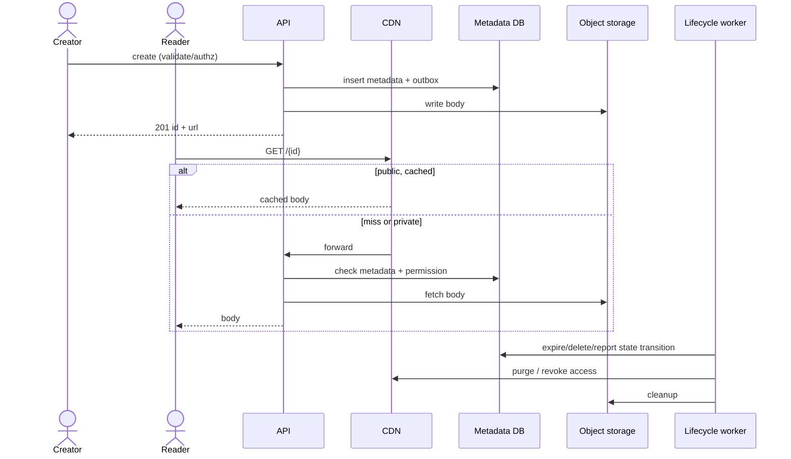

# 003 — Pastebin: Full System Design Solution

## Goal and requirements

Users create text snippets up to 10 MB. A snippet is public, unlisted, or private; it may expire. Reads are 1,000× writes and public reads should be globally fast. Owners may delete a snippet; abuse reports can disable it.

The important distinction is visibility:

- **Public:** may be discovered/shared and safely CDN cached according to policy.
- **Unlisted:** not indexed/listed, but anyone with link can read. It is not private.
- **Private:** requires authenticated, resource-level permission check.

## Estimates

The question fixes only the ratio (reads are 1,000× writes), the 10 MB cap, a 150 ms p99 read and expiry within a few minutes. Everything else here is a labelled assumption for a mid-sized product, and each line ends in the decision it forces.

```text
Traffic (assumption: 1M new snippets/day)
  writes: 1M ÷ 86,400 ≈ 12/s average, 5× peak ≈ 58/s
  reads = 1,000 × writes: 1B/day ≈ 11.6k/s average, 5× peak ≈ 58k/s

Size mix (assumption: 99% small at ~5 KB, 1% large at ~1 MB, capped at 10 MB)
  mean = 0.99 × 5 KB + 0.01 × 1 MB ≈ 15 KB, and the 1% large snippets are ~2/3 of all bytes
Storage
  bodies:   1M × 15 KB ≈ 15 GB/day ≈ 5.5 TB/year (before the object store's own redundancy)
  metadata: ~300 B/row × 1M/day ≈ 300 MB/day ≈ 110 GB/year (365M rows/year), about 50× smaller than the bodies

Egress (assumption: mean bytes per read = 15 KB)
  1B reads/day × 15 KB ≈ 15 TB/day ≈ 1.4 Gbps average, ≈ 7 Gbps at 5× peak
CDN offload (assumption: 90% of reads are public/unlisted and cacheable; 90% CDN hit ratio on those)
  origin share = 0.9 × 0.1 + 0.1 private (uncacheable) = 19% of reads ≈ 11k origin requests/s at peak
  origin egress ≈ 19% × 15 TB ≈ 2.8 TB/day ≈ 0.26 Gbps, so the CDN removes ~81% of origin bytes
  each point of hit ratio on the cacheable 90% moves ~135 GB/day of origin egress

Other
  expiry: assume half of snippets expire → 500k/day ≈ 6 expiries/s
  abuse case: 58 writes/s × 10 MB = 580 MB/s ≈ 4.6 Gbps of ingest
  a 10 MB body takes 10 MB × 8 ÷ 100 Mbps = 0.8 s to reach a 100 Mbps client
```

- **Bytes and metadata are different workloads, 50× apart.** So bodies go to object storage and metadata to a relational store; the metadata (110 GB/year) sits on one primary with read replicas for years, and sharding waits for measurements.
- **The CDN carries the bytes; the origin carries lookups.** 7 Gbps at peak is a CDN job. The origin's ~11k requests/s are mostly small metadata lookups (`id → status, visibility, expires_at, object_key`), so put a short-TTL metadata cache and read replicas in front of the database rather than sharding it.
- **The 150 ms p99 lands on the miss path.** With 10% of cacheable reads and all private reads going to origin, far more than 1% of requests are misses, so the p99 *is* a miss-path latency. A cross-ocean origin call alone can be 150 ms (assumption), so the origin needs regional replicas of metadata and objects or an origin shield near each edge cluster. Define the target as time to first byte for large snippets, because a 10 MB body cannot arrive in 150 ms on a 100 Mbps link. Serve large text compressed (text often shrinks several times, an assumption) and stream it.
- **Large uploads must bypass the API tier.** The 4.6 Gbps abuse case says never proxy a 10 MB body through API servers: above ~64 KB use a signed direct upload to a staging key, and enforce a per-account bytes-per-day quota (say 100 MB/day) besides the rate limit.
- **A mean-based CDN bound is optimistic.** With an average of 1,000 reads per snippet spread over at most ~50 edge locations, a snippet needs at most 50 origin fetches, so the hit ratio could be up to 95%. But the mean hides a tail: most snippets are read a handful of times, so plan for 90% and measure.

## Data, API, and IDs

```text
Snippet(id PK, owner_id, visibility, status, object_key, checksum,
        created_at, expires_at, deleted_at)
SharePermission(snippet_id, principal_id, role)
IdempotencyKey(owner_id, key, request_hash, response, expires_at)
```

```http
POST /v1/snippets
Idempotency-Key: …
{ "content":"…", "visibility":"unlisted", "expires_at":"…" }

201 { "id":"8fzK…", "url":"https://paste.example/8fzK…" }

GET /v1/snippets/{id}
```

Use a random opaque ID. It reduces enumeration but is not an authorization boundary. Idempotency prevents duplicate pastes if a client times out after a successful create.

## Architecture

```arch
%% caption: Metadata is the truth for visibility and expiry, immutable bodies live in object storage behind a CDN, and a background worker purges and cleans up.
node creator "Creator" at 1,0 icon=user
node reader "Reader" at 2,0 icon=users
node cdn "CDN" at 2,1 icon=cdn sub="public bodies, s-maxage"
group origin "Origin" color=blue icon=cloud
node api "API" at 1,2 in origin icon=api sub="validate, authorize"
node db "Metadata DB" at 0,3 in origin icon=db sub="status, expiry, ACL"
node obj "Object storage" at 2,3 in origin icon=blob sub="immutable bodies"
node worker "Lifecycle worker" at 1,4 icon=worker sub="expire, delete, report"
creator -> api : "create"
reader -> cdn : "GET /{id}"
cdn:B -> api:R : "miss or private"
api:L -> db:T
api:B -> obj:T
worker:L -> db:B : "status first"
worker:R -> obj:B : "cleanup"
worker:B ..> cdn:R : "purge"
```



For small snippets, storing body in relational storage can be acceptable. At 10 MB and read-heavy global delivery, object storage separates blob capacity/egress from metadata transactions and works naturally with CDN/lifecycle policies. Metadata is still truth for expiry, visibility, and deletion.

Bodies are immutable, which is what makes edge caching safe. Small bodies (≤ ~64 KB, 99% of snippets by count) can be posted inline in the create request; larger ones use a signed upload URL straight to object storage so the 10 MB body never crosses the API tier.

Upload flow must avoid a visible metadata record pointing to a missing object. Either store body first into a private staging key then transactionally create metadata/commit state, or use an upload state machine (`PENDING_UPLOAD`, `ACTIVE`, `FAILED`) with cleanup. Validate size, encoding/content policy, and abuse limits; never trust only filename/content-type.

## Read, caching, and deletion flow

For public active snippets, a CDN may serve content using a key that includes immutable content/version. For unlisted, CDN can still cache if product policy allows; access is link possession. For private, authorize before issuing a short-lived signed object URL or proxying read—do not send a long-lived object URL.

**Expiry needs no purges if the cache lifetime is aligned to it.** Because a body is immutable, the origin sends `Cache-Control: public, s-maxage=N` with `N = min(3600, seconds until expires_at)`. The edge then stops serving a snippet at its expiry by itself, which meets "unreadable within a few minutes" without one purge per expiry (500k expiries/day would be about 6 purges/s of pure overhead). Purges are reserved for deletes and takedowns, which are rare (assume 0.1%, about 1,000/day). The 1-hour cap bounds how long a stale copy can live if a purge is lost, and the purge worker retries and alerts on failure. Private snippets use `Cache-Control: private, no-store` and are never held by the shared cache. Expiry is also checked from `expires_at` on every origin read, so the sweeper is cleanup, not the correctness path.

Deletion/expiry must first change authoritative status so origin denies future reads, then purge/invalidate edge cache and asynchronously remove object bytes. This means the product must define propagation: for example, “deleted public content is inaccessible at origin immediately and purged from CDN within one minute.” A cache TTL alone may be unacceptable for abuse takedown.

## Failure, security, and scale

If object storage is slow/unavailable, creation can fail safely; existing CDN-cached public reads may still work. If metadata DB is down, private/expiry-sensitive reads fail rather than bypass permission. Cache outage falls back to object store/metadata with rate limiting; do not let invalid-ID probing exhaust storage.

Serve raw snippet bytes from a separate content domain (not the application's own origin), as `text/plain` or an attachment with `X-Content-Type-Options: nosniff`, so an HTML or script paste cannot run in the app's origin and steal sessions. Mark unlisted pages `noindex`.

Rate limit by account/IP (see [002 — rate limiter](002_rate_limiter_solution.md)), cap content, scan/report malicious content as policy requires, log owner/admin actions, encrypt storage, and never log private snippet contents by default. Search indexing is separate and only indexes public permitted content.

At scale, CDN absorbs read bandwidth, object store handles bytes, and metadata DB handles far fewer creates/status checks. Partition metadata by snippet ID only after measurements show need; use owner index for account listings.

## Follow-ups the interviewer will ask

1. **"How does this work across regions?"** Metadata has one write primary with asynchronous read replicas in each region, and the object store replicates bodies across regions (or an origin shield pulls on demand). A snippet just created in region A and read in B can miss; B's origin falls back to A once. Expiry is safe everywhere because it is a timestamp check, but a delete depends on replication lag plus the purge, so takedown-critical checks read the primary.
2. **"What changes at 10× and 100×?"** At 10× peak reads are 580k/s and about 70 Gbps, which is still a CDN job, and metadata growth is 1.1 TB/year. At 100× the body storage is about 550 TB/year and metadata about 11 TB/year with 36B rows, so shard metadata by snippet ID, tier cold bodies to cheaper storage, and expect ~1.1M origin requests/s, which needs a bigger metadata cache tier and origin shields. Egress cost, not compute, becomes the design driver.
3. **"What if a takedown or expiry must be enforced within seconds, not minutes?"** Purge is vendor-dependent (usually seconds to a minute, a hedge), so for takedown-sensitive content add a second control: short-lived signed URLs (60 s) or an edge-checked denylist of disabled IDs. The origin always checks `status` and `expires_at`, so the only exposure is a copy already cached at an edge that has not seen the purge.
4. **"What dominates cost?"** Egress: 15 TB/day of delivery, not the 5.5 TB/year of storage. Levers are compression, a higher hit ratio (each point is ~135 GB/day of origin egress), longer `s-maxage` on immutable public bodies with purges for removals, tiering snippets nobody has read in 90 days (assumption; measure it) to infrequent-access storage, and a default expiry for anonymous snippets.
5. **"How is it abused?"** Malware and phishing hosting, leaked credentials being pasted and indexed, illegal content, and large-upload floods. Controls: account and IP rate limits, a bytes-per-day quota, asynchronous scanning (known-bad hash lists, secret scanners) that can flip `status` and trigger a purge, a report-to-disable path with an audit log, `noindex` on unlisted, and a separate content domain with `nosniff`.
6. **"One snippet goes viral at 100k requests/s. What breaks?"** Nothing at the edge, but a cold or just-purged copy can send every edge to the origin at once. Use request coalescing at the edge and an origin shield so the origin sees one fetch per shield, and keep immutable bodies cached long so expiry, not TTL, ends the entry.
7. **"How do you expire a few hundred million rows?"** Reads check `expires_at` against the clock, so correctness never depends on a sweep. A sweeper scans a partial index on `expires_at` (only rows that have one) in small batches, marks rows `EXPIRED`, and enqueues object deletion; at ~6 expiries/s that is trivial. Bodies are removed by lifecycle rules or the worker, with an orphan report to catch leaks.
8. **"Most snippets are 5 KB. Storing each as an object is wasteful, so put them in the database."** For small bodies I agree: store bodies up to ~64 KB inline and larger ones in object storage. The costs are two code paths and a bigger metadata tier: 1M × 5 KB is ~1.8 TB/year, so put small bodies in a key-value or wide-column store rather than the relational primary. Metadata stays the source of truth either way, and large bodies still need object storage and the CDN.

## Common mistakes

1. **Treating "unlisted" as "private".** Anyone with the link can read an unlisted snippet. Give private snippets an authenticated resource-level check and no shared-cache entry.
2. **Relying on TTL alone for expiry and deletion.** A long CDN TTL keeps an expired or taken-down snippet visible for hours. Align `s-maxage` to expiry, purge on delete, and check status at the origin.
3. **Serving user content from the application's origin.** A pasted HTML page then runs with the app's cookies. Use a separate content domain, `nosniff`, and a safe content type.
4. **Proxying 10 MB uploads through the API tier.** A few dozen concurrent large uploads pin workers and memory. Use a signed direct upload and a bytes quota.
5. **Metadata that points at a missing object, or an object nobody points at.** Use `PENDING_UPLOAD → ACTIVE` with cleanup for orphans, and report the orphan count.
6. **Sizing from the mean.** The 1% large snippets are about two thirds of the bytes and drive storage and egress; model the distribution, not just the average.
7. **Handing out long-lived object URLs for private content.** A leaked URL is a permanent leak. Authorize first and issue a short-lived signed URL, or proxy the read.
8. **Putting 10 MB bodies in the relational database.** Row bloat, replication lag and backup size follow. Keep bodies in object storage and metadata in the database.

## Going from L5 to L6

- **Migration and rollout path.** Launch with object storage, one metadata primary and a CDN. Add regional replicas when the p99 miss path shows the need, the inline small-body tier once measurement shows it pays, and cold-storage tiering when the read-age distribution supports it. Each step is behind the metadata layer, so bodies can be migrated with dual-read.
- **Cost model.** Frame it as egress first: the hit ratio is the single lever (135 GB/day per point), then storage tiers, then default expiry. Show the numbers per 1M snippets and per TB served.
- **Ownership and blast radius.** Separate the read path, the write and upload path, the moderation pipeline and the purge service, each with its own SLO and on-call. A scanning backlog or a purge outage must not affect reads.
- **Build versus buy.** Object storage and CDN are buy decisions; hash-match and abuse-detection feeds are integrations; the visibility and expiry state machine and the takedown workflow are what you build.
- **What to measure first.** Size distribution (tail), reads per snippet (share never read), hit ratio by visibility, expiry share and abuse rate. They decide inline versus object, tiering thresholds and the TTL cap.
- **Phased evolution.** Ship public and unlisted with expiry, add private with signed URLs, then moderation and takedown tooling, then multi-region read replicas, adding each when its number crosses a threshold.

## Metrics and build exercise

Track creation/read success and p99, CDN hit rate, origin bytes, expiry/delete propagation, object orphan count, abuse reports/takedown latency, authorization denials, and storage/retention growth.

Build a local service with SQLite/PostgreSQL metadata and filesystem/object-store abstraction. Add private read authorization, expiry, idempotency replay, a cache layer, and a deletion test that proves an expired snippet cannot be served even if a cached body exists. Named assertions:

- `test_expired_snippet_not_served_from_cache`: warm the cache, advance the clock past `expires_at`; assert the next read is `404` or `410` and the cache-control lifetime was capped at the expiry.
- `test_private_never_cached`: read a private snippet; assert the response is `private, no-store` and a second user without permission gets `403`.
- `test_idempotent_create_replays`: send the same `Idempotency-Key` twice; assert one row and the same `id`.
- `test_no_dangling_metadata`: fail the upload after the metadata insert; assert the snippet stays `PENDING_UPLOAD` and is never readable, and cleanup removes it.
- `test_large_upload_bypasses_api`: assert a 5 MB body is accepted only through the signed upload URL and the inline endpoint rejects it.
- `test_takedown_denied_at_origin_before_purge`: disable a public snippet while the purge is failing; assert the origin denies reads immediately.
