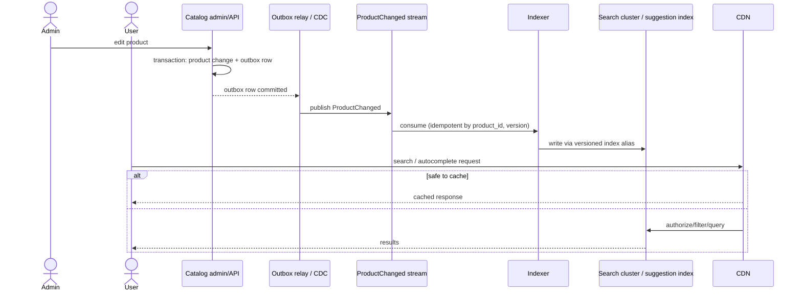
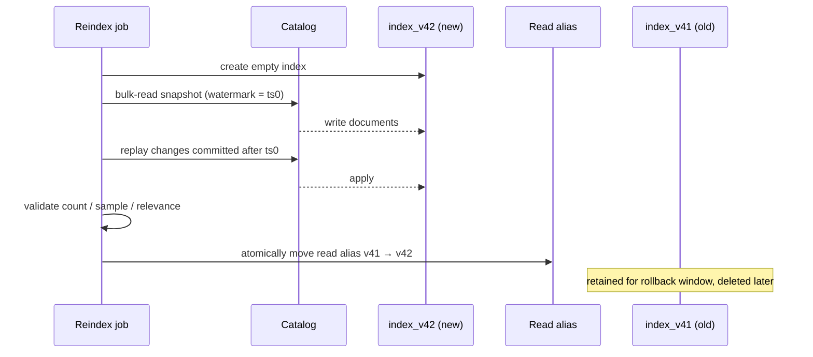

# 009 — Search and Autocomplete: Full System Design Solution

This chapter is deliberately detailed. Do not memorize its diagram. Learn the reasoning: the catalog is authoritative, search is a fast rebuildable projection, and autocomplete is a separate interaction with a much tighter latency budget.

## 1. Clarify the product before designing

Assume an e-commerce catalog.

### Functional requirements

- Users search products by words such as `wireless headphones`.
- They filter by category, price range, brand, stock/availability, and rating.
- They receive ranked, paginated results and typo-tolerant matching.
- As users type, autocomplete returns up to 10 suggestions.
- Catalog edits appear in search within five minutes.
- A product not visible to a user's tenant/region must never appear in a result or suggestion.

### Non-functional requirements

- Search p99 < 150 ms; autocomplete p99 < 50 ms (the question's contract, measured at the API edge and excluding the client's own network, since a 30 ms mobile round trip would otherwise consume the autocomplete budget).
- The question says "tens of millions" of items and "tens of thousands" of QPS, so assume 30 million products; 100 product updates/second peak; 10,000 search QPS peak; 50,000 autocomplete QPS peak (60,000 in total).
- Search may be eventually consistent for up to five minutes. Product checkout/inventory remains strongly checked against the catalog/order system—not the search index.
- Index must be recoverable without losing the catalog.

### Explicit non-goals

Full recommendation/personalization, ad auction, and arbitrary natural-language product assistant are separate systems. They may add ranking signals later but must not be silently assumed in the first design.

## 2. Estimate capacity

```text
Traffic
10,000 search requests/s peak × 3 KB average response ≈ 30 MB/s egress
50,000 autocomplete requests/s peak × 1 KB response ≈ 50 MB/s egress

Index size (30M products, assumption)
30M products × 5 KB searchable document ≈ 150 GB raw index source
inverted index + stored fields + doc values ≈ 2× raw (assumption, measure it) ≈ 300 GB per copy
3 copies (primary + 2 replicas) ≈ 900 GB
shards at a target of ~30 GB each (assumption inside the common 10-50 GB guidance) → 300 / 30 = 10 primary shards, 30 shard copies

Query CPU (assumption: ~3 ms of CPU per shard-query)
10,000 queries/s × 10 shards = 100,000 shard-queries/s → ≈ 300 busy cores
at a 50% utilisation target ≈ 600 cores ≈ 38 nodes of 16 cores

Tail latency: a query waits for its slowest shard
P(at least one of 10 shards is slower than its own p99) = 1 − 0.99^10 ≈ 9.6%
so the query's p99 is roughly each shard's p99.9; at 100 shards that probability is 63%

Freshness
100 updates/s × 300 seconds freshness budget = 30,000 changes potentially waiting
bulk indexing at ~2,000 docs/s (assumption) drains a full 5-minute backlog in ~15 s
full reindex of 30M docs at ~20,000 docs/s (assumption) ≈ 1,500 s = 25 min,
  during which 100/s × 1,500 s = 150,000 changes must be replayed after the snapshot watermark
```

Each number forces a decision:

- **Autocomplete has the most QPS, the tightest latency and the smallest responses, and catalog writes are modest.** So it gets a separate, cache-friendly suggestion path, and indexing is asynchronous.
- **Replicas buy latency as well as availability.** With a 10-shard fan-out, each shard's p99.9 sets the query's p99, so budget the 150 ms against shard p99.9, keep shards small, and send a hedged request to a second replica after roughly the shard's p95 latency (the tail-at-scale technique from Dean and Barroso, 2013), at the cost of a few percent extra load.
- **Do not add shards casually.** Every extra shard raises the tail probability and the CPU per query, so grow throughput by adding replicas and grow data by tenant/region routing before raising fan-out.
- **A full-catalog rebuild is a 25-minute operation, not a script.** That is why reindexing uses a snapshot watermark, a replay of about 150k changes and an alias swap (section 6), and why the five-minute freshness promise has to be protected from bulk imports with a separate lane (see the follow-ups).

## 3. Data ownership and model

The **catalog database** owns product truth. It enforces product lifecycle, price, inventory policy, and visibility. Search owns only an index/projection that can be deleted and rebuilt.

```text
Product (authoritative)
  product_id PK
  tenant_id
  title, description, brand, category_id
  price, currency
  visibility_state
  available_for_sale
  updated_at, version

CatalogOutbox
  event_id PK, product_id, product_version, event_type, payload, published_at

SearchDocument (derived index document)
  product_id, tenant_id, locale, title tokens, description tokens,
  filters/facets, ranking fields, version
```

Index the queries you need. The search document deliberately denormalizes fields used to filter/rank so the search engine does not need synchronous joins to the catalog on every query. The cost is duplicate data and eventual synchronization; that is acceptable because the catalog remains truth.

## 4. API contracts

```http
GET /v1/search?q=wireless+headphones&category=audio&min_price=50&max_price=300
    &cursor=eyJzY29yZSI6MC44OSwiaWQiOiI4NzIifQ

200 OK
{
  "results": [{"product_id":"872", "title":"...", "price":129.00, "score":0.89}],
  "next_cursor":"...",
  "facets":{"brand":[{"value":"Acme","count":42}]},
  "index_freshness_seconds":12
}
```

```http
GET /v1/autocomplete?q=wirel&locale=en-US

200 OK
{
  "suggestions":[
    {"text":"wireless headphones", "type":"query"},
    {"text":"Wireless Headphones X2", "type":"product", "product_id":"872"}
  ]
}
```

Use cursor pagination based on a stable sort tuple such as `(score, product_id)` or `(updated_at, product_id)`, not offset pagination. New index writes can shift offsets, causing duplicate/missing results. A cursor must encode only signed/validated server state; never trust a client-provided raw query plan.

## 5. Architecture



The outbox is important. A catalog transaction can commit and the application can crash before publishing an event. By saving the product change and an outbox row together, a relay later emits every committed change. The indexer uses `(product_id, version)` so replayed/out-of-order events cannot overwrite a newer document with an older one.

## 6. Indexing flow in detail

1. Catalog service validates and commits product change plus `ProductChanged` outbox event in one transaction.
2. Relay publishes event and marks publication safely; duplicates are allowed.
3. Indexer consumes event. It validates schema/version, reads enough authoritative data if event payload is intentionally thin, and produces a document.
4. Indexer writes document only if its version is newer than indexed version. Deletes/unpublish events remove or mark document unavailable with priority.
5. Indexer records checkpoint/lag metrics and sends permanently invalid events to a DLQ with a replay tool.

Why not update search index synchronously inside catalog request? It makes a product editor depend on search cluster availability and exposes the catalog write path to search latency. A synchronous update might be chosen for a narrow product rule requiring immediate discovery, but then the availability/latency consequence must be accepted explicitly.

### Reindexing safely

Schema/analyzer changes often require a full reindex.



The snapshot watermark prevents the classic gap where a product changes while bulk indexing is running. Reindex is an operational workflow, not an ad-hoc script.

## 7. Query and ranking flow

1. Authenticate request; resolve tenant, locale, eligibility, and safe query limits.
2. Parse/normalize query: Unicode normalization, language analyzer, spelling/synonym policy, stop words where appropriate. Never blindly interpolate user query into an engine-specific query language.
3. Add mandatory authorization/tenant/visibility filters before executing search.
4. Query index with text match plus typed filters and a bounded result/facet request.
5. Rank using text relevance plus product signals such as availability, popularity, quality, and business policy. Keep ranking explainable and evaluate changes against a labeled relevance set.
6. Return cursor, results, facets, and optional freshness metadata. For purchase, fetch/validate authoritative price and availability again downstream.

**Typo tolerance.** The requirement is at least one-character edits on common queries. Two cheap layers cover it. First, a spelling-correction map built from the query log: keep the top million or so queries, index their one-edit variants (for example, a symmetric-delete lookup), and rewrite a query before search; this costs microseconds per query and only touches common queries. Second, engine-side fuzzy matching on the remaining terms, limited so it stays affordable: fuzziness by term length (Elasticsearch's `AUTO` uses 0 edits for 1-2 characters, 1 for 3-5 and 2 above that), a required exact first character or prefix length, and fuzzy expansion only when the exact query returns few results. Fuzzy expansion walks the term dictionary, so its cost grows with dictionary size and edit distance, which is why it is bounded and not applied to every term of every query.

Search ranking is a product decision. A simple launch ranking may be BM25/text relevance plus availability. Introducing machine-learned ranking requires offline labels, online experiment guardrails, feature freshness, bias/feedback-loop awareness, and fallback behavior.

## 8. Autocomplete is not just small search

Autocomplete fires on every keystroke. It must be cheap and should not execute a full broad search query on each character.

Options:

| Approach | Why use it | Limitation |
|---|---|---|
| Search-engine completion/prefix field | Reuses search platform and supports ranking. | Index/storage tuning and prefix query cost. |
| Edge n-gram index | Matches typed prefixes efficiently. | Index size grows; language handling matters. |
| Trie/FST-like dictionary | Very fast prefix lookup for known terms. | Separate build/update path; less flexible ranking/filtering. |
| Cached popular prefixes | Lowest latency/cost for repeated queries. | Cold long-tail still needs source; popularity/privacy rules. |

Use client debounce (for example 100–200 ms), cancel stale in-flight requests, minimum query length, per-user/IP quota, and a hard cap on suggestions. Suggestions must honor tenant/region/visibility rules. A leaked autocomplete product name is still a security incident.

## 9. Caching plan

Cache only a well-defined result key: normalized query + filters + locale + tenant/visibility class + index version. Do not share a cache entry across authorization contexts unless it is proven safe.

| Layer | Cache | Invalidation / safety |
|---|---|---|
| Browser | Short-lived autocomplete response. | User/tenant-safe cache headers; cancel stale requests. |
| CDN | Public catalog query/suggestions if genuinely public. | Versioned/fresh TTL; no private result caching. |
| API cache | Hot search/prefix results. | Short TTL, index-version key, size limits, request coalescing. |
| Search-engine cache | Repeated filter/query internals. | Managed by engine; monitor memory/eviction. |

Cache does not solve index freshness. It can worsen it, so cache TTL must fit the five-minute freshness promise and deletion policy. For urgent product removal, invalidate cache and prioritize delete propagation.

## 10. Failure modes and correct behavior

| Failure | User/system behavior | Mitigation |
|---|---|---|
| Search cluster slow | Return bounded timeout/error; do not exhaust app threads. | Deadline, circuit breaker, partial/degraded response only if honest. |
| Indexer down | Search remains stale; catalog continues. | Durable stream, lag alert, replay after recovery. |
| Duplicate/out-of-order event | Never regress document. | Versioned idempotent index write. |
| Reindex fails | Existing index remains serving. | Read alias switch only after validation; rollback alias. |
| Cache stampede | Search cluster gets burst. | Coalescing, TTL jitter, rate limit, bounded cache. |
| Visibility deletion delayed | Possible data leak. | Priority delete path, short safe cache TTL, audit/alert; choose stronger synchronous gate if requirement demands. |
| Query abuse | Expensive wildcard/facet scan exhausts cluster. | Query allowlist/complexity limits, timeout, rate limits, WAF. |

## 11. Observability and SLOs

**User-facing SLOs:** 99.9% search availability; p99 search under 150 ms; p99 autocomplete under 50 ms; 99% catalog changes searchable under five minutes.

Track query rate/error/p95-p99, search cluster CPU/heap/thread queues, cache hit/eviction, index lag (`now - event timestamp`), consumer lag/DLQ count, reindex document-count mismatch, zero-result rate, click-through/conversion, and authorization-filter denials. Trace one request from API to search engine and one catalog edit through outbox/indexer to indexed document.

Relevance is also observable: retain a privacy-safe judged query set and compare ranking changes before rollout. Business click metrics alone are vulnerable to position bias.

## 12. Security and privacy

- Search API derives tenant/role/region from authenticated identity; it does not trust query parameters such as `tenant_id`.
- Enforce permissions in every query or partition indexes so cross-tenant retrieval cannot occur.
- Restrict index/admin APIs, encrypt data, audit index access and configuration changes.
- Do not log raw sensitive queries, identifiers, or result payloads without classification/redaction/retention policy.
- Limit query syntax, payload, page depth, facet count, and wildcard/fuzzy expansions to resist resource exhaustion.

## 13. Evolution plan and trade-offs

**Launch:** one catalog DB, outbox, one managed search cluster, basic text ranking, async indexer, short autocomplete cache.

**At read growth:** replicas/shards of search index, query/result cache, separate autocomplete capacity, CDN only for public safe entries.

**At catalog/tenant growth:** partition index by tenant/region/language where isolation or scale demands it; route queries deliberately and prevent scatter-gather where possible.

**At ranking maturity:** controlled feature store/experiments, fallback ranking, offline relevance evaluation. Do not introduce personalized ML because it sounds modern; use it when simple ranking demonstrably misses product objectives.

### Why not use these as the primary design?

- **Relational `LIKE '%query%'`:** weak full-text relevance and costly scans for broad product search.
- **Cache-only autocomplete:** misses long-tail/new terms and cannot independently enforce freshness/visibility.
- **Synchronous dual write to DB + search:** couples catalog availability to derived index; outbox is safer by default.
- **One globally shared index with no tenant filter:** unacceptable data isolation risk.
- **Offset pagination:** result drift under index updates; use cursor/search-after approach.

## Follow-ups the interviewer will ask

1. **"How does this work across regions?"** The index is a derived projection, so replicate the `ProductChanged` stream, not the index bytes: each region runs its own indexer and serves from a local index, with region-specific visibility rules evaluated locally. Cross-region traffic is tiny (100 updates/s × ~1 KB is about 100 KB/s), freshness becomes stream replication lag plus indexing, and a region that loses its index rebuilds from the stream and the catalog. Catalog writes stay single-primary; that failover is the catalog's problem.
2. **"What changes at 10× and 100×?"** At 10× traffic (100k search and 500k autocomplete QPS) the query load is about 3,000 busy cores, so add replicas and result caching before adding shards. At 100× (1M search QPS) it is about 30,000 cores with no cache and 15,000 at a 50% hit rate, so caching, an in-memory suggestion structure and edge delivery of popular prefixes carry most of the load. If the catalog also grows 10×, fan-out grows with shards (100 shards means a 63% chance of a shard tail event per query), so route by category, tenant or language to a subset of shards and tier hot and cold products.
3. **"What if a product must vanish from search in seconds, or an admin must see an edit instantly?"** The five-minute freshness applies to ordinary edits; takedowns take a priority delete lane (a separate high-priority topic and indexer consumer targeting seconds). As defence in depth, check the top results (say 20-50 ids) against an authoritative, cached visibility lookup before returning them, and invalidate caches on takedown. For admin read-your-writes, the console reads from the catalog, not from search. Checkout price and stock always come from the catalog.
4. **"What dominates cost?"** Index storage and RAM multiplied by replicas (about 900 GB across 30 shard copies) and query CPU (about 600 cores at 50% utilisation). Levers: index only searchable and filterable fields, not full descriptions; tier out-of-stock or old products to a small cold index queried on fallback; fewer replicas in low-traffic regions; higher cache hit rates (there are only about 18,000 one-to-three-letter prefixes in Latin letters, so precompute them all per locale); and an in-memory suggestion structure instead of running prefix queries on the search cluster.
5. **"How is it abused?"** Scraping the catalog through deep pagination, so cap depth (say 1,000 results) and use cursors with rate limits per key; expensive queries, so reject leading wildcards and limit fuzzy and facet expansion with timeouts; enumeration of hidden products through autocomplete, so apply visibility as a pre-filter and rate limit; ranking manipulation by merchants stuffing keywords, so keep ranking signals resistant to it; and cache poisoning, so never put user-specific content in a shared cache key.
6. **"How do you deliver typo tolerance without making every query expensive?"** Correct common queries from a log-derived spelling map with one-edit variants, which is microseconds per query, and apply bounded fuzzy matching to the rest: fuzziness by term length, a fixed first character, and only when the exact query returns few results. Fuzzy expansion cost grows with dictionary size and edit distance, so unrestricted two-edit fuzzy on every term is a latency and CPU risk.
7. **"A merchant uploads 5 million product updates. What happens to the five-minute freshness?"** At 2,000 docs/s that is 2,500 s, about 42 minutes, during which the real-time edits queue behind the bulk load. Use a separate lower-priority bulk lane with its own throttled consumers, keep a reserved share of indexing capacity for real-time edits, and for very large imports build a new index and swap the alias, exactly like a reindex. Alert on freshness per lane.
8. **"Why a separate autocomplete path? Use the search cluster's prefix queries."** At small scale that is right and I would start there, with an edge n-gram field. The reason to separate is isolation: autocomplete is 50k QPS against 10k for search, with a 50 ms p99, so on shared CPU and thread pools it would crowd out search or the reverse. I would first give it its own index and node group on the same engine, and move to an in-memory FST or cached prefix store when cost or latency demands it.

## Common mistakes

1. **Updating the search index synchronously in the catalog request.** An editor then depends on search availability. Use an outbox and an idempotent, versioned indexer.
2. **Offset pagination and deep paging.** Results shift under writes and the cost grows with `from + size` across every shard. Use cursors on a stable sort tuple and cap page depth.
3. **Sharing cache entries across authorization contexts.** One tenant's hidden product leaks to another. Key the cache by tenant and visibility class, or do not cache.
4. **Applying visibility as a post-filter.** Pages come back short and facet counts leak hidden products. Put tenant and visibility filters inside the query, before ranking and facets.
5. **Reindexing in place, or without a watermark.** The index is unavailable or misses changes made during the bulk read. Build a new versioned index, replay from the watermark, validate, and swap the alias.
6. **Running a full search per keystroke.** Without debounce, cancellation and a minimum length, autocomplete multiplies load. Use a dedicated suggestion path, client debounce and hard caps.
7. **Sizing shards by document count and ignoring fan-out.** Ten shards give a 9.6% chance of a per-query shard tail event, and a hundred give 63%. Size by bytes, watch fan-out, and use replicas and hedging for tails.
8. **Treating the index as the source of truth.** Using search results for checkout price or stock, or having no rebuild path, turns a stale projection into a business error. The catalog is authoritative and the index must be rebuildable.

## Going from L5 to L6

- **Migration and rollout path.** Ship analyzer, schema and ranking changes as a new versioned index behind the alias: run shadow queries against old and new, compare result overlap and judged-set quality, ramp traffic, and keep the old index for rollback. The same dual-run approach applies when migrating to a new engine.
- **Cost model.** Present cost per million queries and per million indexed products, show the drivers (replicas, RAM per shard copy, query CPU), and the levers (cache hit rate, cold tier, autocomplete off the search cluster).
- **Ownership and blast radius.** Split the catalog (source of truth), the indexing pipeline, query serving and relevance across teams. Isolate autocomplete from search, and use per-tenant quotas and query limits so one expensive query or tenant cannot take down the cluster. Cells by region or tenant bound a poison query.
- **Build versus buy.** A managed search service or an open-source engine is the default; build only the differentiators: the visibility filter, the outbox indexing pipeline and the relevance evaluation. Treat vector or hybrid retrieval as a later ranking-stage addition, not a launch requirement.
- **What to measure first.** The query distribution (head, torso, tail), the zero-result rate, the share of queries with typos, filter usage, and update-rate burstiness including bulk imports. They decide cache design, the correction map, shard routing and the freshness lanes.
- **Phased evolution.** Launch with one catalog database, an outbox, one managed cluster and basic BM25 ranking; then separate autocomplete, add replicas and caches, then tenant or region routing, and only then learned ranking with experiments.

## 14. Interview close and build exercise

Close an interview answer by stating: “The catalog is authoritative. Search is an asynchronously rebuilt projection with a five-minute freshness SLO. I protect visibility at query time, make indexing idempotent by document version, and use versioned index aliases so reindexing cannot interrupt reads. I separate autocomplete because its 50 ms p99 at 50k QPS differs from broad search.”

**Build:** index a local product dataset; create an outbox table and index worker; implement `GET /search` with filters/cursor; add a prefix suggestion endpoint; simulate duplicate/out-of-order events; perform index-v1 → index-v2 alias migration; add metrics for index lag and query p95. Named assertions:

- `test_out_of_order_event_does_not_regress`: deliver version 5 then version 4 of a product; assert the index holds version 5.
- `test_duplicate_event_idempotent`: deliver the same event twice; assert one document and unchanged version.
- `test_alias_swap_has_no_gap`: change a product during a reindex after the watermark; assert the new index contains the change before the alias moves and reads never fail.
- `test_visibility_prefilter`: index a product hidden from tenant B; assert it never appears in tenant B's results, facet counts or suggestions.
- `test_cursor_pagination_stable`: page through results while inserting new documents; assert no duplicates or skips.
- `test_typo_one_edit_finds_common_query`: search a one-character misspelling of a common query; assert the intended product is in the top 10.
- `test_bulk_lane_does_not_starve_realtime`: run a 100k-document bulk load; assert a real-time edit is searchable within the freshness budget.
