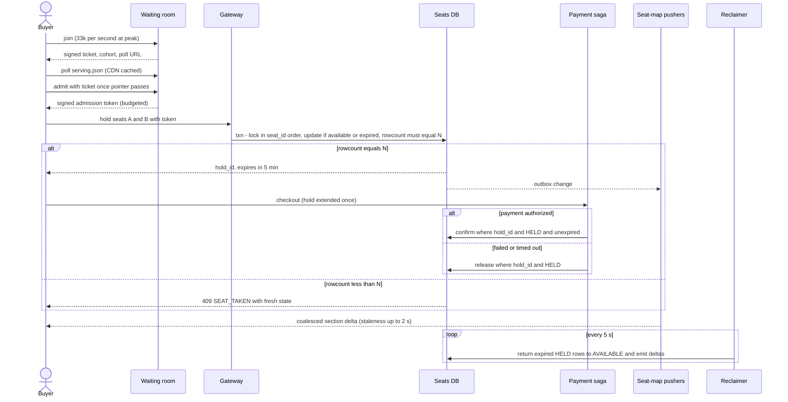

# 010 — Seat Reservation: Full System Design Solution

## Goal and contract

A seat reservation system sells a finite set of seats for a concert or flight to a surge of buyers arriving in minutes, without ever selling the same seat twice. The seat state row in a transactional database is the source of truth; nothing else (cache, search index, UI display, waiting-room ticket) is allowed to make a sale decision.

Assume (the user count, hold time, latency target, and real-time map come from the question; the seat count and everything after it are labelled assumptions):

- **2M users** arrive within a few minutes of on-sale (I use 3 minutes, front-loaded).
- The venue has 20–80k seats (assumption; I use **60k seats** in 200 sections of 300).
- A held seat is reserved for a specific buyer for **5 minutes** to complete payment.
- Seat selection responds in **under 300 ms p99** for users past the waiting room, and the seat map is "real-time".
- Payment can fail, time out, or complete after the hold has technically expired.
- Assumption: a party buys 1–4 seats (2.5 on average, capped at 4 per order and 8 per account), and the seat-partition database sustains about 5k simple conditional updates per second at low latency (benchmark it).

The contract: each seat is always in exactly one of `AVAILABLE`, `HELD(hold_id, holder, expiry)`, or `SOLD`, and every transition is atomic and conditional on the seat's current state. A `HELD` row whose expiry has passed is **logically `AVAILABLE`**: every conditional update treats it that way, so correctness never depends on a background sweeper having run. Only the *current, unexpired* hold may confirm a sale — a stale or expired hold attempting to confirm must fail, not silently succeed. A multi-seat request either takes every seat or none. This is not "no user ever sees a seat disappear" (that's a UX/waiting-room problem) — it is "no seat is ever sold to two different buyers," which must hold even under massive concurrent contention on the same row.

The one hard decision is what protects what. The **database row** protects the seat, the **waiting room** protects the database from a crowd ~33× larger than the seat supply (2M ÷ 60k) that arrives ~26× faster than the database can admit it (33k joins/s ÷ 1,250 admissions/s), and the **seat map** is advisory. Each layer is allowed to be wrong except the first.

## Estimates

- **Arrivals**: 2M users over 3 minutes ≈ **11k joins/s** on average. Assume half arrive in the first 30 s: 1M ÷ 30 ≈ **33k joins/s peak**. A join is a signed ticket and one counter increment (about 100k simple ops/s per Redis-class instance, assumption), with no database write. So the join path is an autoscaled stateless tier or edge function, and nothing in it touches the seat database.
- **Who can win**: 60k seats ÷ 2.5 seats per party = **24k winning parties, about 1.2% of the 2M**. So the waiting room's main job is to say "no" to 98.8% of arrivals cheaply and fairly.
- **Queue polling**: 2M waiting users polling every 10 s (jittered) = **200k requests/s**. Per-user rank lookups at that rate would be a 200k/s stateful service; a cached ~100-byte `serving.json` at the CDN is ~20 MB/s of cache hits. So position is derived client-side from one published pointer, not looked up per user.
- **Admission the database can sustain**: an admitted user issues about 4 write transactions (2 hold attempts of which one may lose, 1 checkout/extend, 1 confirm or release). At 5k writes/s that is 5,000 ÷ 4 = **1,250 admissions/s**. By that rate the room could admit 2M users in 27 minutes, but it never needs to: to sell 60k seats at ~70% hold-to-purchase conversion (assumption) it needs about 24,000 ÷ 0.7 ≈ 34k buyers through the door, which is 27 s at the cap.
- **Supply-based admission**: the binding limit is seats, not the database. Admit so that users inside ≈ 2 × available seats ÷ party size = 2 × 60,000 ÷ 2.5 = **~48k inside** (the 2× covers picky buyers and holds that fall through). At 1,250/s that target is reached in 48,000 ÷ 1,250 ≈ 38 s, and after that admission follows departures (a 3-minute average session gives ~270/s at steady state). So the room needs a **control loop** with two limits (database rate and seat supply), not a fixed drip rate.
- **Seat-hold writes**: 1,250 admits/s × ~3 hold attempts ≈ **3.8k conditional updates/s** at the peak. A `rowcount = 0` loser costs about a millisecond and no lock wait. The hottest single section might see 100× the average per-section rate (6/s average, so ~600/s), which a single-threaded in-memory allocator handles easily and 300 rows can absorb.
- **Seat-map bytes**: 60,000 seats × 2 bits (available, held, sold) = **15 KB** for the whole venue. Pushing that once a second to 48k clients is 720 MB/s (5.8 Gbps): wasteful. One section is 300 × 2 bits = **75 B**; a client watching 2 sections at 1 Hz costs ~150 B/s, so 48k clients ≈ **7 MB/s**. Pushing every raw change (about 3k/s × 12 B) to everyone would be 1.7 GB/s. So: one cached full snapshot on entry, then coalesced per-section deltas.
- **Connections**: only *admitted* users need the live map: ~48k SSE or WebSocket connections, about 5 nodes at ~10k connections each (conservative assumption). Waiting-room users never open one.
- **Storage**: 60k seat rows × ~150 B = **9 MB** per event; orders add ~24 MB. Everything fits in RAM many times over. So partitioning here is for write throughput, concurrent events, and blast radius, not for size.
- **Latency budget (target)**: token verification at the gateway 2 ms, hold transaction 25 ms (row locks plus a synchronous commit), network and serialization 50 ms, about 80 ms in total against the 300 ms p99. The slack is for contention and the retry of a lost seat.

## Mechanisms compared

| Mechanism | Behavior | Choose it when | Main weakness |
|---|---|---|---|
| Check-then-update ("if available, then set held") as two operations | Read seat state, decide in application code, write new state. | Never for the seat-sale decision. | Classic TOCTOU race — two buyers can both read AVAILABLE before either writes, double-selling the seat. |
| Conditional atomic update (`UPDATE ... WHERE status='AVAILABLE'`) | Single statement transitions state only if current state matches; rowcount=0 means someone else won. | The authoritative hold/confirm operation. | Still needs correct indexing/partitioning to avoid the whole table being a lock hotspot on one popular event. |
| Distributed lock per seat in a cache (Redis-style) then a DB write | Take a TTL lock in a cache, then write the sale to the database. | Never as the arbiter. | Two systems must agree; a lock TTL shorter than the hold, a paused client, or a failover lets two owners both believe they hold the seat. |
| Cache-based availability read for display | Serve "likely available" seat map from cache for browsing. | Read-only map rendering before a buyer commits to a seat. | Must never be trusted as the arbiter for the actual hold/sale — cache staleness would double-sell. |
| Virtual waiting room / admission token | Signed token admits a bounded rate of users into the actual reservation flow. | Massive simultaneous demand (2M arriving in minutes) against a much smaller seat pool. | Adds a queueing layer and a token-forgery/replay surface to defend. |

## API

```text
POST /v1/events/{event_id}/queue/join
  → 202 { ticket, cohort, poll_url, poll_after_ms }        # ticket is HMAC-signed, no server row
GET  /queue/{event_id}/serving.json                         # static, CDN-cached 1 s
  → { serving: {cohort, threshold}, rate_per_s, closed: false, sold_out: false, ts }
POST /v1/events/{event_id}/queue/admit   { ticket }
  → 200 { admission_token, expires_at }                     # single use per ticket
  → 425 { retry_after_ms }                                  # pointer has not reached you, or budget spent
  → 410 { code: "SOLD_OUT" }

GET  /v1/events/{event_id}/seatmap                          # Authorization: admission token
  → 200 { map_version, sections: [{id, price_tier, seats: "packed 2-bit states"}] }   # ETag, cached
GET  /v1/events/{event_id}/seatmap/stream                   # SSE, Last-Event-ID resumes
  → event: delta   data: { section_id, map_version, changes: [{seat_id, state}] }

POST /v1/events/{event_id}/holds       Idempotency-Key required
  Body: { seat_ids: [...] }  or  { section_id, quantity, contiguous: true, price_tier }
  → 201 { hold_id, seats: [...], expires_at, price }
  → 409 { code: "SEAT_TAKEN", unavailable: [...], suggestions: [...] }
  → 403 bad or expired admission token      → 429 per-token rate limit
DELETE /v1/holds/{hold_id}             → 204 (idempotent release)
POST   /v1/holds/{hold_id}/checkout    → 202 { order_id }   # extends the hold once, hands off to the payment saga
```

- **Idempotency.** `POST /holds` is deduplicated on `(event_id, holder_id, Idempotency-Key)`; a retry returns the same hold. Confirm and release are naturally idempotent because they are conditional on `hold_id` and `status`.
- **The token is the only credential the seat API accepts.** It is verified statelessly at the gateway (signature and expiry) before any request reaches the database, so an attacker without a token costs one HMAC check, not a transaction.
- **A stale click is a normal outcome**, not an error to hide: `409 SEAT_TAKEN` carries the fresh state of the seats asked for and up to three nearby alternatives.
- The payment half (authorization, capture, refunds, provider webhooks) is the same saga as in [008 — Checkout](008_checkout_solution.md); here the seat hold plays the role of the inventory hold, and the confirm is the pivot before capture.

## Data model

| Entity | Key and shape | Role | Partitioning |
|---|---|---|---|
| `events` | `event_id` → `venue_id, on_sale_at, max_party=4, state` | Configuration | Replicated |
| `seats` | `(event_id, seat_id)` → `section_id, row_no, seat_no, price_tier, status (AVAILABLE/HELD/SOLD), hold_id, holder_id, hold_expires_at, order_id, version` | **Source of truth** for what is sold | By `(event_id, section_id)`, so contention on one section never blocks another and each section can live on its own node |
| `holds` | `hold_id` → `event_id, holder_id, seat_ids, status (ACTIVE/CONFIRMED/RELEASED), expires_at, extended, idem_key`, `UNIQUE(event_id, holder_id, idem_key)` | The group record that makes a multi-seat hold one unit and gives hold-level idempotency | With the event's seats |
| `orders` | `order_id` → `hold_id, user_id, seat_ids, amount, payment_state` | Hand-off to the payment saga | By `user_id` |
| `seat_events` (outbox) | `(event_id, seq)` → `section_id, seat_id, new_state` | Written in the same transaction as the change; feeds the seat map | With the seats |
| Ticket and admission state | `admit:{ticket_id}` (single-use flag, TTL 15 min), `inside_count`, a monotonic pointer | **Ephemeral**; loss degrades fairness, never safety | Small Redis-class store |

Indexes are deliberately few, because every index on a hot mutable column adds write cost: the primary key, `(event_id, section_id, status, row_no, seat_no)` for best-available scans, and a partial index on `hold_expires_at WHERE status='HELD'` for the reclaimer.

## Architecture and flow

```arch
%% caption: The waiting room and CDN absorb the crowd, only token-bearing calls reach the seat service, and the seat map is a coalesced projection off the outbox that never feeds back into the sale decision.
node buyer "Buyer" at 1.5,0 icon=users
node cdn "CDN" at 0,1 icon=cdn sub="serving.json, map snapshot"
node wait "Waiting room" at 1,1 icon=timer sub="tickets, admission tokens"
node gw "Gateway" at 2,1 icon=gateway sub="verifies token"
node pushers "Seat-map pushers" at 0,2 icon=websocket sub="SSE, section deltas"
node seatsvc "Seat service" at 2,2 icon=service sub="per-section allocator"
node saga "Payment saga" at 3,2 icon=payment
node agg "Map relay + aggregator" at 0,3 icon=stream sub="coalesce 1 s"
node seatsdb "Seats DB" at 2,3 icon=sql sub="partitioned by section"
node rec "Reclaimer" at 3,3 icon=timer sub="every 5 s"
buyer -> cdn : "poll"
buyer -> wait : "join, admit"
buyer -> gw : "hold + token"
gw -> seatsvc
gw:R -> saga:T : "checkout"
saga:L -> seatsvc:R : "confirm / release"
seatsvc -> seatsdb : "conditional txn"
rec -> seatsdb : "expire holds"
seatsdb ..> agg : "outbox"
agg -> pushers
agg:L -> cdn:L : "snapshot"
pushers:R ..> buyer:L : "deltas"
```



The waiting room exists purely to protect the reservation system from an instantaneous 2M-request spike hitting a 60k-row hot table — it does not make sale decisions, it only paces admission. The hard decision is that every state transition (hold, confirm, release) is a single conditional statement keyed on both seat ID and the current hold ID, never a read followed by a separate write. This trades a slightly more awkward query shape for eliminating the entire class of double-sell races that a check-then-update pattern would introduce under contention. Payment happens *after* the hold is won, never before — the hold, not the payment call, is what protects the seat.

**One write, end to end** (a buyer takes seats 12 and 13 in section B). The client presents its admission token to the gateway, which verifies signature, expiry, and a per-token rate limit (5 hold attempts/s) without touching storage. The seat service opens one transaction on the section's partition, locks rows 12 and 13 in ascending `seat_id` order with fail-fast semantics, runs the conditional `UPDATE`, checks that `rowcount = 2`, inserts the `holds` row and a `seat_events` outbox row, and commits. The commit is the moment the seats are the buyer's. The response returns in ~80 ms. Later the payment saga calls confirm, which is another conditional update; the outbox row drives the map delta.

**One read, end to end** (opening the map). The client fetches the cached venue snapshot for its price tier (`map_version` N, 15 KB, edge-cached) and opens the SSE stream for the sections it is viewing. The pushers send coalesced deltas newer than N. A seat the buyer clicks is *never* validated against the map: the click goes to the hold endpoint and the database answers.

## Capacity and storage

For a single popular event, all contention concentrates on one partition of ~60k seat rows (20–80k in the original assumptions) — this is a small enough table (about 9 MB) to keep as high-throughput conditional-update targets, but it will see extremely high per-row contention if many buyers target the same seat (e.g. auto-assigned "best available" seat). Partition/shard by venue and section so that concurrent buyers spread across sections don't serialize behind a single hot row; for auto-assign flows, pick a candidate seat via an in-memory/queue-based allocator per section rather than having every request scan and race for row 1. With 200 sections the average per-section rate is ~6 allocations/s and a front-section spike is ~600/s (derived above), which is tiny for an in-memory allocator and comfortable for the row locks behind it.

Sharding is about concurrency, not size: a mega-tour that opens 50 dates at once is 50 independent events and 50 independent partitions, so one event's rush cannot starve another. Give each event its own admission budget so the shared components (gateway, token service, payment saga) are the only shared fate.

Do not read seat availability from a cache and then write the sale decision back later — that reintroduces the exact TOCTOU bug the conditional update was designed to prevent; cache is for map rendering only. Do not let the waiting room's admission rate exceed what the conditional-update path can sustain — the whole point of the waiting room is to convert an unbounded spike into a bounded, sustainable arrival rate at the actual database.

## All-or-nothing multi-seat holds

**The problem.** A party wants seats 12 to 15 together. If the system takes them one at a time, a failure on seat 14 leaves three seats held by a buyer who cannot use them, visible to the whole crowd for the time it takes to compensate. And two buyers asking for the same seats in different orders can deadlock.

| Approach | Behavior | Costs |
|---|---|---|
| N independent conditional updates plus compensation | Take seat by seat; on a miss, release the ones already taken | Partial holds are visible and can be sniped, the compensation itself can fail, and N round trips |
| **One transaction: lock in a fixed order, one conditional `UPDATE`, require `rowcount = N`** (chosen) | Atomic by the database; a shortfall rolls back and nothing was ever visible | Holds row locks for the transaction (a few ms), and needs the lock order discipline below |
| Cache-side multi-key script (Lua-style) then persist | Atomic in the cache | The arbiter becomes the cache, so failover and persistence gaps can double-sell |
| Seat-group rows (a hold on a pre-built block) | One row per block, so single-row atomicity | Only sells pre-defined blocks; breaks when a block is partially sold |

```sql
BEGIN;
-- 1. Lock the requested rows in a fixed order, failing fast instead of waiting.
SELECT seat_id FROM seats
 WHERE event_id = :e AND seat_id = ANY(:ids)
 ORDER BY seat_id
 FOR UPDATE NOWAIT;          -- lock_not_available means someone else is mid-transaction: answer SEAT_TAKEN

-- 2. Take only what is effectively available (lazy expiry, next section).
UPDATE seats
   SET status = 'HELD', hold_id = :h, holder_id = :u, version = version + 1,
       hold_expires_at = clock_timestamp() + interval '5 minutes'
 WHERE event_id = :e AND seat_id = ANY(:ids)
   AND (status = 'AVAILABLE' OR (status = 'HELD' AND hold_expires_at < clock_timestamp()));

-- 3. rowcount = N: insert the holds row and the outbox rows, COMMIT.
--    rowcount < N: ROLLBACK. Nothing changed and nothing was ever visible.
```

**Why the order matters.** Buyer A asks for {12, 13} and buyer B for {13, 12}. Without a fixed order A locks 12 and waits for 13 while B locks 13 and waits for 12: a deadlock, which PostgreSQL only breaks after its `deadlock_timeout` (1 s by default), already over the 300 ms budget. Sorting by `seat_id` makes both lock 12 first; the loser fails immediately. **Why fail-fast.** Waiting on a locked seat is pointless: by the time the lock frees, the seat is `HELD` or `SOLD` and the loser's update would match nothing. `NOWAIT` (or `SKIP LOCKED`, which skips locked rows so the count comes back short) turns contention into a fast, cheap `409` instead of a queue of 50 waiters behind the front-row seat. This trades an occasional spurious `SEAT_TAKEN` (the other transaction might have rolled back a millisecond later) for a bounded latency; the buyer's client retries once automatically and otherwise shows the fresh map.

The confirm is symmetrical: `UPDATE seats SET status='SOLD', order_id=:o WHERE hold_id=:h AND status='HELD' AND hold_expires_at > clock_timestamp()`, and the seat service requires `rowcount = N` (the hold's seat count) or rolls back. On failure the payment saga voids the authorization (see [008 — Checkout](008_checkout_solution.md)) so a lapsed hold never becomes a captured charge.

## Lazy expiry inside the conditional update

**The problem.** A sweeper that flips expired holds back to `AVAILABLE` runs periodically. If correctness depended on it, then between expiry and the next sweep an expired hold would either block a valid buyer (safe but wasteful) or, worse, be confirmed against a seat someone else has taken.

| Approach | Behavior | Costs |
|---|---|---|
| Sweeper is the only thing that frees expired holds | A background job flips `HELD` to `AVAILABLE` | Seats sit unsellable for up to a sweep interval, and a sweeper outage stalls the sale (a liveness dependency that looks like a correctness one) |
| **Expiry evaluated inside every conditional update** (chosen) | The predicate `status='AVAILABLE' OR (status='HELD' AND hold_expires_at < now)` treats an expired hold as available at that instant | A slightly longer predicate; all instances must agree on the clock, so use the database's own time, never the application server's |
| TTL keys in a cache | Expiry is automatic | The cache would be deciding availability; see the mechanisms table |

**Decision.** Put expiry in the predicate, and keep the reclaimer purely cosmetic and hygienic: it exists so the seat map and counters show the truth within seconds and so `HELD` rows do not accumulate, and it uses the same guarded update (`WHERE status='HELD' AND hold_expires_at < clock_timestamp()`, in batches of about 500 with `SKIP LOCKED`, every 5 s). This trades a marginally more complex predicate for removing a whole failure class; the cost is acceptable because the clock authority is the single database primary and the predicate is evaluated inside the same row lock that makes the update atomic.

Consequences that keep the contract tight:

- **The confirm is strict.** A hold that expired cannot confirm, even if nobody took the seat yet. To avoid punishing a buyer who starts paying at 4:59, `POST /holds/{id}/checkout` **extends the hold once** (to about 2 more minutes) with a conditional update that requires the hold to be unexpired and `extended = false`. The extension is bounded so seats cannot be hoarded, and the payment deadline is inside it.
- **A late payment is compensated, not honored.** If authorization succeeds after the seat was retaken, the confirm returns `rowcount < N`, the authorization is voided, and the customer gets an apology and a fresh chance. The seat row, not the payment result, says who owns the seat.
- **Reclaiming twice is a no-op.** The sweeper's update is conditional, so a duplicate run or two overlapping sweepers change nothing the second time.

## Best-available selection

**The problem.** "Give me 4 together in the $150 tier" cannot be answered by a click on a specific seat. If every request scans for the first good run, thousands of buyers race for the same front-row block, all but one lose, and each loser retries: a self-inflicted retry storm.

| Approach | Behavior | Costs |
|---|---|---|
| `SELECT … WHERE status='AVAILABLE' ORDER BY row_no, seat_no LIMIT k FOR UPDATE SKIP LOCKED` | Each concurrent transaction locks the first k *unlocked* available seats, so allocators get different seats without blocking | Great for "any k seats"; **cannot guarantee adjacency**, because a locked seat in the middle of a row is skipped and the result may be seats 1, 2, 4, 5 |
| Read the candidate runs, pick the best, then use the multi-seat conditional update | Optimistic: compute runs, then take one atomically | Every buyer picks the same best run, so nearly all lose the race, unless the choice is randomized among the top M runs |
| **Per-section in-memory allocator that proposes, with the database still arbitrating** (chosen for contiguous requests) | A single-writer owner per section holds a bitmap (300 seats is ~40 bytes), finds the best contiguous run in microseconds, then runs the multi-seat conditional update | A stateful owner per section and a failover gap; if its bitmap is stale after a failover, the database's conditional update rejects the proposal, so the worst case is a wasted attempt, never a double sell |

**Decision.** Use per-section allocators for contiguous best-available and `SKIP LOCKED` for non-contiguous "any k seats". The allocator serializes the *choosing*, which is where the herd forms, and leaves the *selling* to the database, which is where correctness lives. This trades a new stateful component for removing the retry storm; the cost is acceptable because the state is rebuildable from the seats table in well under a second per section and because the database rejects any stale proposal. For adjacency search over a row, a gaps-and-islands query (`seat_no − row_number()` grouped per row) finds runs of at least k available seats in one pass. At ~600 allocations/s in the hottest section a single thread is nowhere near saturated (the search is microseconds, the database call dominates), so the allocator is a per-section queue, not a bottleneck.

## The real-time seat map

The requirement says users see availability in real time. The design says what "real time" means, because a promise of instant, exact availability at 2M users is a promise no one can keep and nobody needs.

```arch
%% caption: The map is a derived, coalesced, cached projection of the seats table, so it can lag by seconds or fail entirely without ever affecting whether a seat is sold.
node seats "Seats DB" at 0,0 icon=sql
node relay "Change relay" at 1,0 icon=sync
node agg "Section aggregator" at 2,0 icon=sigma sub="coalesce 1 s"
node snap "Cached snapshot" at 3,0 icon=cache sub="venue and section, versioned"
node pub "Pub-sub topic" at 2,1 icon=topic sub="per section"
node cdn "Edge cache" at 3,1 icon=cdn sub="ETag"
node push "SSE / WebSocket pushers" at 2,2 icon=websocket sub="about 5 nodes"
node client "Admitted client" at 3,2 icon=users sub="subscribed to viewed sections"
seats -> relay : "outbox rows"
relay -> agg
agg -> snap
agg -> pub -> push -> client
snap -> cdn -> client
```

**Staleness contract.** The map lags the seats table by at most about 2 s under normal load (1 s coalescing plus delivery). It is advisory: clicking a seat always goes to the database, and a stale "available" turns into `409 SEAT_TAKEN` with the fresh state. Under overload the pushers degrade first (longer coalescing, then polling), never the sale path.

| Delivery | Behavior | Costs |
|---|---|---|
| Client polls the snapshot | Simple, cacheable | 48k clients × 15 KB per second would be 720 MB/s if polled at 1 Hz for the whole venue; fine per section (75 B) |
| **SSE or WebSocket push of coalesced section deltas** (chosen) | Server pushes only changed seats for subscribed sections; `Last-Event-ID` or `map_version` resumes | Connection state on ~5 nodes; a reconnect storm after a node loss needs jitter and a snapshot fallback |
| Push every raw change to everyone | Lowest latency | ~1.7 GB/s at the peak change rate, and it is wasted: a seat you are not looking at is not news to you |

**Decision.** Full snapshot on entry (cached, versioned), then per-section deltas coalesced to 1 s, plus a tiny venue-level heat map (200 sections × 2 B of availability counts) so users can choose a section without subscribing to all 200. A client that reconnects with a `map_version` older than the retained deltas gets a fresh section snapshot instead of a replay. This trades exact instantaneous truth for a bounded, cheap, cacheable feed; the cost is acceptable because the sale decision never reads it and the losers of a stale click get instant, precise feedback.

## Waiting room design

**The problem.** 2M arrivals, about 24k winners, and a database that can serve ~1,250 admissions/s. The room must (a) be cheap enough to face 33k joins/s and 200k polls/s, (b) admit at a rate the database can bear and seats can use, (c) be fair, and (d) resist bots that will try to jump the queue and buy in bulk.

```arch
%% caption: Admission is the minimum of a database-rate limit, a seat-supply limit, and a latency guard, so the room slows down when any of them tightens.
grid 180x100
group loop "Budget loop, every second" color=blue icon=timer
node tick "Every second" at 1,0 in loop shape=pill
node supply "Supply limit" at 0,1 in loop sub="2 x available seats / party size, minus users inside"
node dbcap "Rate cap" at 1,1 in loop sub="DB sustainable rate"
node lat "Hold p99 above 150 ms?" at 2,1 in loop shape=diamond color=amber
node cut "Rate x 0.7" at 2,2 in loop color=red
node grow "Rate + 5 percent" at 3,1 in loop color=green sub="up to cap"
node budget "Budget" at 1,3 in loop sub="min of supply, rate, cap"
node pointer "Advance pointer" at 1,4 in loop sub="by budget / show-up rate"
node publish "Publish serving.json to CDN" at 1,5 in loop shape=pill
group adm "Per request" color=purple icon=api
node admit "Client calls admit with ticket" at 1,6 in adm shape=pill
node bucket "Token bucket has budget and ticket at or below pointer?" at 1,7 in adm shape=diamond color=amber w=240
node tok "Issue single-use signed token" at 0,8 in adm color=green
node retry "425" at 2,8 in adm color=red sub="jittered Retry-After"
tick -> supply
tick -> dbcap
tick -> lat
lat -> cut : "yes"
lat -> grow : "no"
supply -> budget
cut -> budget
grow -> budget
dbcap -> budget
budget -> pointer -> publish
admit -> bucket
bucket -> tok : "yes"
bucket -> retry : "no"
```

**Queue design.** A ticket is a signed blob `{event_id, ticket_id, cohort, rank, join_ts}` signed with a rotating HMAC key (with a `kid`), issued with no server-side row. A single published pointer says how far the room has advanced. Clients poll that cached file, compare it to their own rank, and show an estimated wait (`(rank − serving) ÷ rate`). Only when their rank is below the pointer do they call `/admit`, which is the one stateful, rate-limited call. So the expensive part of the room, 2M users asking "am I in yet", is one static object.

**Fairness.** FIFO by arrival rewards the fastest connection and the best script. I use **randomize within a cohort, FIFO across cohorts**: the room opens ahead of on-sale (say 30 minutes, assumption) and everyone joining before on-sale forms cohort 0; the burst at on-sale forms cohort 1 for the first W = 5 minutes; later joiners are FIFO behind. Within a cohort the rank is derived from `HMAC(secret, ticket_id)`, so nobody's position depends on how fast they connected and a script gains nothing from firing early. The cost is that position is honest only once a cohort closes: users see "you are in the draw" and an estimate after that. Publishing a commitment to the secret before on-sale (a hash) and revealing it after makes the draw auditable.

**Admission token.** On `/admit` the server checks the ticket signature, `rank ≤ pointer`, and a token bucket; sets `admit:{ticket_id}` with `SET NX EX 900` so a ticket admits exactly once; and returns a token `{event_id, ticket_id, sub, exp = now + 15 min, jti, max_seats = 4}` signed with a separate key. The gateway verifies it statelessly on every seat call. Tokens are short-lived (a session cannot be squatted for hours), bound to the account and a soft device fingerprint, and rate limited per token.

**Bot and scalper defence** (each layer costs something, so state it):

1. **Identity at join**: a verified account (phone or payment method) and one active ticket per account per event; per-IP and per-network join limits. Cost: friction for legitimate users and shared-NAT false positives, so limits are soft signals feeding a score, not hard bans.
2. **Proof of work or a challenge on join**: makes each of 33k/s joins cost the sender CPU or a human step. Cost: accessibility, conversion loss; apply it adaptively by risk score.
3. **No bypass**: the seat API rejects anything without a valid admission token before it touches the database, so hammering the hold endpoint directly does nothing.
4. **Purchase limits**: 4 seats per order, 8 per account per event, a limit on cards per account. This bounds what a bot that gets in can take.
5. **Non-transferable, non-guessable tickets**: the rank is inside a signed blob, so nobody can forge an earlier position; a stolen ticket is one admission.
6. **Behavior analysis inside the door**: hold-and-release churn, impossible click rates, and identical seat-pick patterns across accounts push a score, and a high score gets a challenge or a revoked token.

**Closing the room.** When the last seat is `SOLD` and no holds are outstanding, the room sets `sold_out: true` in `serving.json` and every remaining waiter learns it from the next poll, which is one cached object flipping for ~2M clients. When holds expire and seats reappear the pointer moves again with a small budget, so late seats go to the queue's next cohort members in order rather than to whoever refreshes fastest.

## Failure and abuse behavior

| Case | Correct behavior |
|---|---|
| Two buyers race the same seat | Conditional update guarantees only one `UPDATE` affects a row in `AVAILABLE` (or expired-`HELD`) state; the loser gets rowcount=0 or a fail-fast lock error and is routed to pick another seat — never a silent double-sell. |
| Two multi-seat requests overlap in opposite orders | Fixed `seat_id` lock order plus fail-fast locking: no deadlock, and the loser gets a `409` in milliseconds. |
| Hold expires while payment is still in flight | The checkout call extended the hold once. If it still lapses, the reclaimer and the confirm both check `hold_id` and `status`; the late confirm's conditional update finds a different state and fails cleanly, triggering compensation (void or refund) rather than granting a sale on an expired hold. |
| Payment succeeds after expiry already fired | Order/payment saga is compensated (void or refund plus apology) rather than force-assigning a now-possibly-resold seat; the seat state, not the payment result, is authoritative for who owns it. |
| Reclaimer stopped or lagging | Safe: expiry is evaluated inside every conditional update, so seats are still sellable at the moment of expiry. Only the seat map lags, and a lag alert fires. |
| Waiting-room token replay/forgery | Tokens are signed, single-use per ticket, and short-lived; a replayed ticket is rejected at `/admit` by the `SET NX`, keeping the pacing guarantee intact. A rotated signing key invalidates forged tickets. |
| Release/expiry sweep runs twice on the same hold | Release update is itself conditional on `hold_id` and `status='HELD'`, so a duplicate sweep run is a no-op — idempotent by construction. |
| Payment provider callback lost, buyer never confirms | The hold lapses on its own; the seat is sellable again after 5 minutes (7 if extended) regardless of provider callback status — the hold is authoritative, not the callback. |
| Seat-DB primary fails during the on-sale | Synchronous replicas in other zones promote in seconds; in-flight transactions abort and clients retry with the same `Idempotency-Key`. The room's latency guard cuts the admission rate during the failover instead of piling load onto a cold primary. Committed holds are not lost because commit waits for a replica. |
| Seat-map pusher or CDN failure | Clients fall back to jittered polling of the section snapshot; sales are unaffected because the map is advisory. |
| Waiting-room store (pointer, counters) lost | Restore the pointer from its last durable value; tickets are stateless and remain valid. Worst case is some users re-poll and the budget is briefly conservative. Safety is unaffected. |
| Bad deploy of the seat service | Roll out by partition behind the double-sell and latency guards; the invariant counters are the canary. Because every write is guarded in SQL, a buggy caller cannot corrupt state, only fail requests. |
| Region failure | The event is homed in one region (the seats table is a single-writer, strongly consistent object); fail over the whole event partition to a replica region, accept seconds of lost in-flight holds, and let clients retry. See Follow-ups for the multi-region trade-off. |
| Bot flood at join | Adaptive challenge and per-network limits at the edge; the seat database never sees them because the token is required first. |

## Observability and interview close

Measure hold-conflict rate (rowcount=0 or lock-failure attempts per hold), hold latency p50/p99, seats held versus confirmed versus expired, count of payment-succeeded-after-expiry events (should be rare and always compensated, never force-granted), admission rate versus the sustainable database rate, `inside` versus target, join and poll rates at the edge, waiting-room error rate, seat-map delta lag p99, reconnect rate, reclaimer lag, and the double-sell invariant directly — count of seats that reached `SOLD` more than once, or confirmed orders whose hold was expired at confirm time, which must be zero.

The one paging alert is **any nonzero double-sell count**. Ticket-level signals: hold p99 above 200 ms (SLO burning), admission rate exceeding the sustainable rate for more than a few seconds, and seat-map lag above 5 s.

Interview close: "The seat row's transactional state is the only thing allowed to decide a sale — every hold, confirm, and release is a single conditional update keyed on the current hold, never a read-then-write, so concurrent buyers racing the same seat resolve safely by database contention instead of application logic, and the waiting room exists only to keep that contention at a sustainable rate."

Trade-off to state: "I treat an expired hold as available inside every conditional update instead of relying on a sweeper, and I let the seat map lag by about two seconds, so correctness never depends on a background job or a cache, at the cost of a longer predicate and an occasional stale click; the cost is acceptable because a stale click returns a fresh answer in milliseconds and a stale sale is impossible."

## Follow-ups the interviewer will ask

1. **"How does this work across regions?"** Keep the seats table single-writer per event, homed in one region: seat sales need linearizable arbitration and no multi-region strongly consistent write is worth the latency for one event. Admission tokens, the queue, and the seat map replicate or are served from the edge everywhere. If users are global, the cost is a cross-region RTT on the hold call (100 to 200 ms, still inside 300 ms p99 for most), so I would home each event near its venue and accept that. Failover moves the event's partition to a replica region and clients retry with the same idempotency key.
2. **"What changes at 10× and 100×?"** At 10× (20M users, or a larger venue), the room and map already scale by CDN and fan-out; the limit is the seat partition, so split a big venue into section partitions on separate nodes and give each its own admission budget (the pointer becomes per-partition, or admission draws from the partition with the most supply). At 100×, run the waiting room as a separate multi-tenant product with its own cell, and run stadium-sized events as many partitions with a coordinator that only routes.
3. **"What if I need stricter consistency, such as no seat ever shown wrongly?"** Then the map must be read from the primary or a synchronous replica and pushes must be transactional (the outbox already is). Show honest limits: with 48k viewers the read cost is far above what the primary should carry, so I would keep the map advisory and make the *hold* response the strong answer. If a regulator demands "the map is always true", cap the room's admission so few people are inside, and pay for it in slower sell-through.
4. **"What dominates cost?"** Edge bandwidth and the waiting room at the burst (200k polls/s plus 33k joins/s for minutes), not the database: the seat data is 9 MB and 3.8k writes/s. Autoscaling cannot react in time to a minute-scale spike, so pre-scale on the on-sale schedule, which is known ahead of time. Idle capacity between on-sales is the price.
5. **"How do you defend against scalpers?"** Layered as in the waiting-room section: verified accounts, adaptive challenge or proof of work, randomized cohorts so speed does not win, hard purchase limits, no seat-API bypass, non-transferable tokens, and behavioral scoring inside. None is decisive alone; the goal is to make bulk buying cost more than it earns.
6. **"Why not just a big lock or a serialized queue per event?"** A single serialized writer for the whole event is a ~5k/s ceiling and one failure domain for everything; partitioning by section keeps arbitration local and parallel. A serialized allocator *per section* is fine for choosing seats (and I use one), because the database still arbitrates the sale.
7. **"What if the interviewer says lazy expiry and the sweeper are redundant, and TTL keys in a cache would be simpler?"** A cache TTL makes the cache an arbiter, and cache and database can disagree across a failover or a pause. I would concede that the sweeper is optional for safety: it exists for the map and for hygiene. The predicate is what the correctness claim rests on.
8. **"Can the same design sell hotel rooms or Airbnb-style stays?"** Mostly, but the unit changes from a point (a seat) to an interval (nights). Model 1: one row per `(room_type, night)` with a booked count and capacity; booking a stay is a multi-row conditional update across its nights (sorted by date, `rowcount = nights`), exactly the all-or-nothing hold above. A 30-night stay is 30 rows in one transaction. Model 2, for a listing that can be booked by one guest at a time: a `bookings` row per stay with a database exclusion constraint over `(listing_id, daterange)` where the status is `HELD` or `CONFIRMED` (PostgreSQL documents exclusion constraints with range types), so an overlapping booking is rejected by the database itself. Lazy expiry cannot live inside the constraint (it cannot reference the current time), so the transaction first flips this listing's expired holds to `EXPIRED`, then inserts. Differences from seats: contention is per listing and low except for viral ones, the read-heavy part is date-range search over derived availability (an index, never the arbiter), holds are often shorter, and hotels and airlines *deliberately overbook* by policy, so the contract there is "oversell within a bounded, priced-in limit" instead of zero.

## Common mistakes

1. **Check-then-update.** Reading `AVAILABLE` and writing `HELD` in two statements is the double-sell. Use one conditional update and read the rowcount.
2. **Making a sweeper part of correctness.** If a seat is only free after a background job runs, an outage of that job stalls or corrupts the sale. Put expiry in the predicate; the sweeper is hygiene.
3. **Holding seats one at a time, or locking in UI order.** Partial holds are visible and snipeable, and opposite orders deadlock (with a ~1 s default deadlock timeout in PostgreSQL). Lock in a fixed order in one transaction and require `rowcount = N`.
4. **Using a cache lock or the seat map as the arbiter.** A lock TTL that is shorter than the hold, a failover, or a stale map turns into two owners of one seat. The database row decides.
5. **Sizing the waiting room by the crowd instead of the seats.** Admitting 48k to sell 60k seats is right; admitting enough to keep the database "busy" is wrong. Compute the rate from the database limit and the supply, and add a latency guard.
6. **Per-user queue lookups.** 2M users asking a stateful service for their rank is 200k/s of load for no benefit. Publish one pointer and let clients compute their own position.
7. **A bypassable room.** If the hold endpoint does not require a valid admission token, bots skip the queue. Verify the token at the gateway before anything else, make it single-use per ticket, and keep it short-lived.
8. **Pushing every seat change to every client.** That is ~1.7 GB/s for information most users are not looking at. Coalesce per section, subscribe by viewport, and let the map lag.

## Going from L5 to L6

- **Rollout path.** Start with the conditional update and a fixed-rate room on a small event, then add cohorts and adaptive admission, then the push map. Before a real on-sale, run a synthetic one at 2× expected load with realistic bot traffic and a database failover mid-test.
- **Cost model.** The seats database is tiny; edge, the room, and pre-scaled fan-out are the bill. Price a minute-long spike against pre-provisioned capacity and against a commercial waiting-room service, and pick by event frequency.
- **Ownership and blast radius.** Treat the waiting room as a shared, isolated product (its own cell, quotas, and on-call) that serves many events, and treat each event's seat partition as a cell, so a runaway on-sale cannot starve others. The payment saga is a separate owner with its own degradation ([008 — Checkout](008_checkout_solution.md)).
- **Build versus buy.** A commercial virtual waiting room is a reasonable buy for occasional events; build it when fairness and bot defence are core to the product. The seat arbiter and its invariants are always built in-house, because they encode the promise.
- **What to measure first.** Hold-to-purchase conversion (it sets the hold TTL, the 2× supply factor, and how many people to admit), the database's real conditional-update throughput per partition, the bot fraction of joins, and the p99 hold latency under contention.
- **Policy is a design input.** Hold duration, per-account limits, cohort windows, and overbooking rules trade fairness, revenue, and complexity; agree them with the business before tuning the system.

## Build exercise

Implement the conditional SQL hold, confirm, and release statements against a small seats table, including the multi-seat transaction with ordered locking and lazy expiry; spin up many concurrent goroutines/threads racing to hold and confirm the same handful of seats with randomized payment delays and expiry timing. Add a token-signing admission service and a rate controller with a fake database whose latency rises. Named assertions:

- `test_no_double_sell_under_race`: 500 threads race for 10 seats; assert each seat has exactly one `SOLD` owner and no seat is confirmed twice.
- `test_multi_seat_all_or_nothing`: request 4 seats when 3 are available; assert zero seats changed state and no hold row exists.
- `test_opposite_order_requests_do_not_deadlock`: two threads request `{A, B}` and `{B, A}` repeatedly; assert every attempt finishes in under 100 ms and at most one wins each round.
- `test_lazy_expiry_without_reclaimer`: disable the reclaimer, let a hold expire, hold the same seat as another buyer; assert it succeeds, and that the first buyer's late confirm fails.
- `test_confirm_after_expiry_fails_and_compensates`: confirm past expiry; assert `rowcount < N`, the saga voids, and no seat is `SOLD` to the late buyer.
- `test_checkout_extends_hold_once`: call checkout twice; assert the second call does not extend beyond the first extension.
- `test_release_and_reclaim_are_idempotent`: run release and the reclaimer twice; assert the second run changes zero rows.
- `test_best_available_contiguous_under_contention`: 200 concurrent requests for 4 contiguous seats in one section; assert the granted runs are disjoint, contiguous, and in the same row.
- `test_admission_token_single_use`: admit the same ticket twice; assert the second is refused, and a forged or expired token is rejected before any database call.
- `test_admission_rate_backs_off_on_latency`: raise fake database p99 above the guard; assert the admitted rate falls by the multiplicative factor, then recovers additively.
- `test_stale_map_click_returns_fresh_conflict`: hold a seat, then click it from a client with a stale map; assert `409 SEAT_TAKEN` with the seat's current state.
