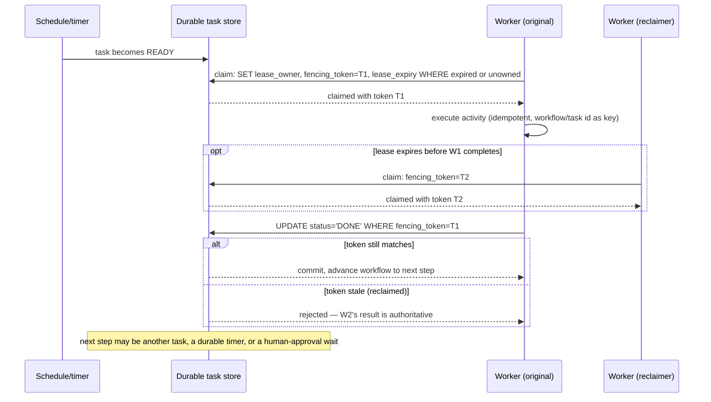
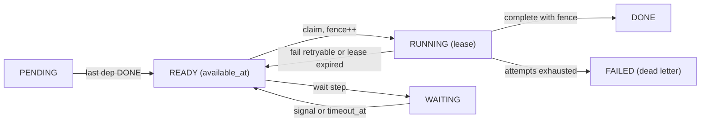

# 012 — Workflow Scheduler: Full System Design Solution

## Goal and contract

A workflow scheduler durably runs multi-step processes — some spanning seconds, some spanning days, some waiting on a human — surviving worker crashes without losing progress or running the same side-effecting step twice concurrently. The source of truth is the durable workflow/task state and its lease; a worker's in-memory execution is disposable and must be fully reconstructable from that state.

Assume: runs range from two steps to multi-day with a human-approval wait; workers can crash at any point, including right after an external side effect (a payment call) but before recording it; several workers may race for the same ready task.

The contract is not "exactly-once execution" — impossible around an external side effect whose acknowledgement can be lost (the same problem as checkout's payment call). The achievable promise: only one worker holds a valid lease on a task at a time, completion is accepted only from the current lease holder (via a fencing token), and every side-effecting activity is itself idempotent so a retry after a crash-before-ack is safe.

The question's numbers are the contract: **1M runs/day × 8 steps, 5,000 workflows active at peak, ready-to-picked-up p99 < 2 s, no concurrent duplicate execution, state durable 1 year.** The hard decision: the *queue and the workflow state are one ACID store*, so "step finished" and "next step ready" commit together and no dual-write window can lose a step.

## Estimates

- **Step rate**: 1M × 8 = **8M steps/day ÷ 86,400 = 93 steps/s** average; assume 10× peak (business hours, top-of-hour cron) → **~930/s**. → *Small. A single well-indexed Postgres primary with lease columns and `SELECT … FOR UPDATE SKIP LOCKED` handles it; sharding on day 1 is resume-driven design.*
- **Write load**: per step, one **claim** txn and one **complete-and-advance** txn (~6 rows: step, successors, ~3 events, run) ≈ 7 row writes. Peak 930 × 2 = 1.9K txns/s, plus **heartbeats** 5,000 running leases ÷ 10 s = 500/s → **~2.4K txns/s, ~6.5K row writes/s**. → *Headroom of 4–8× against an assumed 10–20K short txns/s ceiling for one NVMe primary with a sync replica (assumption: benchmark it).*
- **Concurrency**: peak arrival 11.6 runs/s × 10 = 116/s, so 5,000 active implies a mean active lifetime of 5,000 ÷ 116 ≈ **43 s** (Little's law), ~5 s per step: API-call-shaped. Parked runs are extra: assume 2% wait ~2 days → 0.02 × 1M × 2 = **~40K parked**. → *Parked runs cost a row, not a thread. Workers: 5,000 ÷ 50 slots = **~100 processes**.*
- **Dispatch budget**: a ~200 ms poll interval + ~5 ms claim leaves > 1.7 s of the 2 s for queueing; 100 workers × 5 polls/s = 500 index probes/s. → *Slot exhaustion, not polling, is the risk: autoscale on `ready_age_p99`, not CPU.*
- **Storage**: 0.3 KB row + 5 events × 0.25 KB + 2 KB payload (assumption) ≈ **3.55 KB/step** → **28 GB/day → 10.4 TB/yr (~13.5 TB with indexes)** (2.9B step rows). The 30-day hot window ≈ 1.1 TB. → *Fits one primary; 1 year is a tiering policy.* Archive: 10.4 TB ÷ ~4 (assumed compression) ≈ 2.6 TB × $23/TB-month (S3 list) ≈ **$60/month**.
- **When to shard**: at 100× (9.3K steps/s average, 93K peak, ~240K txns/s) at ~5K txns/s per shard = ~48 → **64 shards**, ~110 TB hot. Before that, shard on *measured* triggers: primary CPU > 50% sustained, commit p99 > 20 ms, autovacuum lagging on `steps`, or hot set > RAM. None holds today.

## Mechanisms compared

| Mechanism | Behavior | Choose it when | Main weakness |
|---|---|---|---|
| In-process sleep/wait | Thread stays alive holding workflow state across a delay or wait. | Never for durable workflows. | A crash or deploy loses all progress. |
| Durable timer + persisted state re-entry | "Resume at/after" markers are persisted; a worker picks the workflow up when the timer fires, from state, not memory. | Any wait longer than one request, including approvals. | Workflow logic must be re-entrant from state. |
| "Claim next task" without lease/fencing | Worker marks a task claimed; no expiry or token. | Never — the source of duplicate-execution bugs. | The claim never expires (stuck forever) or, if naively expired, a second worker starts while the first still runs. |
| Lease with expiry + fencing token | Time-bound claim; only the current token can commit completion; expiry lets another worker reclaim. | The standard for safe distributed task claiming. | Completion must check the token; TTL trades recovery speed against premature reclaim. |

## API

Tenant comes from the credential.

```text
PUT  /v1/workflows/{name}/versions/{n}   { steps:[{key, type:"task|approval|timer", activity, deps:[key], retry:{…}, timeout_s}] }  → 201 | 422
POST /v1/runs        Idempotency-Key: <uuid>   { workflow, version?, input:{≤256 KB}, start_at?, priority:"interactive|default|bulk" }
                     → 202 { run_id, state, version }        same key → same run_id
GET  /v1/runs/{id}                       → { state, steps:[{key,state,attempt,error}], output }
GET  /v1/runs/{id}/events?after=<seq>&limit=200    → { events:[…], next_after }   # keyset paging
POST /v1/runs/{id}:cancel | /signals/{name} {signal_id,payload} | /v1/approvals/{id}:decide {decision,comment}   → 200/202 | 403 | 409 | 410
PUT  /v1/schedules/{id}  { cron, tz, workflow, input, overlap, catchup_window_s, jitter_s }

# worker protocol (internal)
POST /v1/tasks:claim { worker_id, queues, max } → [{ step_id, attempt, fence, lease_expires_at, input, idempotency_key }]
POST /v1/tasks/{id}:heartbeat | :complete {output} | :fail {error, retryable}   body carries { fence }   → 200 | 409 STALE_FENCE
```

- **Idempotency**: runs dedupe on `(tenant, Idempotency-Key)`, signals on `signal_id`. The activity's own key is `run_id:step_key` — **constant across attempts** so a provider can collapse a retry. The fence changes every attempt; do not conflate them.
- **Errors**: `429` + `Retry-After` on tenant limits; `409 STALE_FENCE` is a normal event (abandon the step). Lists use keyset paging on `(created_at, run_id)`, never offsets.

## Data model

```sql
runs  (run_id uuid PK, tenant_id, def_name, def_version, state, priority, input jsonb, idempotency_key,
       created_at, closed_at, UNIQUE (tenant_id, idempotency_key))
steps (run_id, step_key, tenant_id, queue, priority,
       state,   -- PENDING | READY | RUNNING | WAITING | DONE | FAILED | CANCELLED
       deps_remaining int, available_at timestamptz,   -- READY and available_at <= now() = dispatchable
       attempt int, fence bigint, lease_owner, lease_expires_at, timeout_at,  PRIMARY KEY (run_id, step_key))  -- fillfactor 70
CREATE INDEX steps_ready   ON steps (queue, priority, available_at) WHERE state = 'READY';
CREATE INDEX steps_lease   ON steps (lease_expires_at)              WHERE state = 'RUNNING';
CREATE INDEX steps_timeout ON steps (timeout_at) WHERE state = 'WAITING' AND timeout_at IS NOT NULL;
run_events (run_id, seq, at, type, actor, data, hash, PRIMARY KEY (run_id, seq, at)) PARTITION BY RANGE (at)  -- monthly
workflow_defs, signals (run_id, signal_id, payload), approvals (approvers[], need, expires_at, decision), tenant_limits, schedules (cron, tz, next_fire_at, …)
```

- **Source of truth**: `steps` (state + lease) and append-only `run_events`; definitions are immutable.
- **Partition key when sharding**: `hash(run_id)`, so a run's rows share a shard and complete-and-advance stays one ACID transaction. Not tenant: one huge tenant would be a hot shard ([25](../building_blocks/25_partitioning_and_hot_keys.md)).
- **Partial indexes are the trick**: `steps_ready` holds a few thousand rows and `steps_lease` ≤ 5,000, so heartbeats (which rewrite an indexed column) churn a tiny index. The event PK includes `at` because Postgres needs the partition column in unique keys.

## Architecture and flow

Stateless API servers, ~100 workers and N interchangeable sweepers talk to one Postgres primary (sync replica; a read replica serves status). One write: `POST /runs` inserts the run and its steps in one transaction (dependency-free steps `READY` with `available_at = start_at`); a claim flips one READY row to RUNNING and returns `fence`; the worker runs the activity; `complete` checks the fence, marks DONE, decrements successors' `deps_remaining`, flips those at 0 to READY, appends events and closes the run when all steps are terminal — **one transaction**, so a crash leaves the old state or the new, never half an advance. One read: `GET /runs/{id}` hits a replica (terminal runs are immutable and cacheable; the create response covers read-your-writes).



The fencing token is the hard mechanism: lease expiry alone is not enough, because a worker can be merely slow (GC pause, network blip) rather than dead, and a naive "am I still the owner" check races with the reclaimer. Requiring the completion write to match the exact token issued at claim time closes that race deterministically, at the price of a small monotonic counter per claim.



## Claiming work: SKIP LOCKED, poll versus push

```sql
UPDATE steps SET state='RUNNING', attempt=attempt+1, fence=fence+1, lease_owner=$w, lease_expires_at=now()+interval '30 s'
WHERE (run_id, step_key) IN (SELECT run_id, step_key FROM steps
   WHERE state='READY' AND queue=$q AND available_at <= now() ORDER BY priority, available_at LIMIT $n FOR UPDATE SKIP LOCKED)
RETURNING run_id, step_key, attempt, fence, lease_expires_at;   -- one short txn, never held during execution
```

`SKIP LOCKED` (PostgreSQL 9.5+; the docs describe it as suited to queue-like tables) gives 100 pollers disjoint rows without blocking; correctness comes from the conditional `UPDATE` plus the fence. A message queue beside a state DB was rejected: it is a dual write, so a crash between "DB says READY" and "message sent" loses or duplicates the step.

| Dispatch | Gives | Costs | Verdict |
|---|---|---|---|
| Workers poll DB (200 ms + jitter) | No in-memory state; ≤ 200 ms added | Empty polls scale with workers (500/s) | **Day 1**: noise at this size |
| `LISTEN/NOTIFY` hint | Median pickup ~ms | Not durable; heavy NOTIFY contends at commit | Hint on top of polling only |
| Matching tier: workers long-poll a service holding ready tasks in memory (Temporal's task-queue shape, per its docs) | Sub-ms handoff; DB touched once per task | A stateful cache tier to rebuild after restart | Add at ~10×, when polling or p99 binds |
| Central scheduler pushes | Global fairness view | Tracks worker liveness; SPOF | Reject: rebuilds leases in memory |

## Leases, heartbeats, and fencing in detail

- **DB clock**: lease time is `now()` inside the claim, never a worker clock. The worker tracks its deadline on a monotonic clock and stops side effects at `ttl − margin` (30 − 5 s), *before* the reaper reassigns the step.
- **TTL 30 s, heartbeat every 10 s** (two misses tolerated): a crashed worker's step re-dispatches in ≤ 30 s plus a sweeper tick (the recovery latency to quote). Shorter steals from GC-paused workers.
- **Fence**: incremented per claim; `complete/heartbeat/fail` carry `WHERE fence = $f AND state = 'RUNNING'`, rowcount 0 means stale. This is the fencing-token pattern (Kleppmann, "How to do distributed locking", 2016), with his caveat: a token protects only a resource that *checks* it. Ours do; an external payment API does not, so the activity sends the constant `idempotency_key` (and the fence where the provider supports conditional writes).
- **Poison steps**: `attempt` increments at *claim*, so a step that kills every worker (OOM on a bad payload) still burns attempts and reaches `FAILED` after `max_attempts`.
- **Reaper**: the same shape as claim, over `state='RUNNING' AND lease_expires_at < now()`, setting READY with a backoff `available_at`; any number of sweeper copies may run it.

> 🎯 Two identifiers, two jobs: the **idempotency key** is constant across attempts so the outside world can dedupe a retry; the **fence** changes every attempt so *our* database can reject a stale one.

## Timers, retries, and cron schedules

**Timers** are indexed columns, not a timing wheel: a delayed step is a READY row with a future `available_at`, and approval timeouts are `timeout_at` on WAITING rows. With ~0.8M timer-bearing steps/day (assumed 10%, ≈ 9/s) and ≤ 45K entries in the partial indexes this is durable by construction with no recovery code. An in-memory hierarchical timing wheel (Varghese and Lauck, 1987) pays off only at hundreds of millions of timers or sub-second precision, and is a cache to rebuild.

**Retries** reuse READY-with-future-`available_at`. Per step: `max_attempts`, `initial_s`, `factor`, `max_s`, with **full jitter**: `delay = random(0, min(max_s, initial_s × factor^attempt))` (AWS Architecture Blog, "Exponential Backoff and Jitter", 2015). With 2 s, ×2, cap 300 s the windows are 2, 4, 8, 16, 32 … 300 s. A downstream outage fails thousands of steps in one second; un-jittered backoff returns them all in one second. `retryable:false` (validation 4xx) goes straight to `FAILED`, a paged dead-letter queue with manual retry-from-step, never a silent drop.

**Cron** (`schedules` table): a materializer takes `WHERE next_fire_at <= now() AND NOT paused FOR UPDATE SKIP LOCKED`, inserts the run with deterministic id `hash(schedule_id, fire_time) ON CONFLICT DO NOTHING`, advances `next_fire_at` and commits, so a crashed retry yields at most one run per fire time. **Overlap** policies: `skip / buffer_one / allow_all / cancel_prev`. **Catch-up** only within `catchup_window_s` (say 1 h), else skip and record: a daily report must not run 30 times after a 30-day freeze. **Time zones**: store UTC, compute in `tz`, document DST (nonexistent local time fires at the next valid instant, ambiguous once). **Herd**: `jitter_s`, since 20% of 100K schedules on `0 * * * *` is 20K runs in one second.

## Fairness and priority

Options: strict priority (bulk starves without aging); a per-tenant running cap (idle capacity unless soft); weighted fair queueing by per-tenant virtual finish time (Demers, Keshav, Shenker, 1989: work-conserving, but a per-tenant counter updated on every enqueue is a hot row); reserved slots per class (idle when quiet).

**Decision**: priority classes, **20% of slots reserved** for `interactive`, plus a **soft per-tenant `max_running`** checked at claim by counting that tenant's RUNNING rows through the tiny `steps_lease` index. Two concurrent claimers can overshoot by a few slots — acceptable, because the cap protects fairness, not correctness (fence and lease do). Bulk ages up one level per 10 minutes. This trades exact isolation for no serialized counter row.

## Leaderless scheduler processes, failover, and when to shard

**No leader is needed for correctness**: claim, reap, timeout and cron loops are `SKIP LOCKED` scans, so N stateless copies cooperate through the database and a dead copy costs nothing (a pushing leader adds election and split-brain for no gain here). True singletons (partition maintenance, archive export) use a Postgres advisory lock or an existing etcd/ZooKeeper lease ([19](../building_blocks/19_consensus_and_coordination.md)); being idempotent, a brief double leader is harmless.

**Database failover is the real SPOF.** Primary plus a **synchronous** replica (RPO 0 for acknowledged commits) with automated promotion (Patroni-style; tens of seconds, measure yours). Meanwhile claims fail, workers retry `complete` with the same fence, and leases are wall-clock, so nothing is double-assigned. The 2 s SLO is steady-state; failover is a ~30 s availability event.

**How to shard** when a trigger fires: 256 fixed *logical* shards `= hash(run_id) mod 256`, mapped to physical clusters by a routing table (start with one cluster; split by moving logical shards). Temporal fixes its shard count at cluster creation (per its docs), so pick the logical count generously. The API routes by a shard id embedded in `run_id`; cross-run queries ("failed runs for tenant X") use a CDC-fed index ([09](../building_blocks/09_messaging_and_streaming.md)).

## Human approval and signal waits

A human wait is a `WAITING` step plus an `approvals` row, never a blocked worker.

1. `:decide` authorizes against `approvers` (`need` for quorum; requesters cannot approve their own run), inserts the decision, appends an audit event and flips the step to READY in one transaction; a double click gets `409`.
2. **Early signals**: an event can arrive before the run reaches its wait. Signals persist in an inbox and a wait step consumes a matching one first, then blocks; losing this race is the classic approval bug.
3. **Timeouts**: `timeout_at` fires an escalation branch (remind at 24 h, escalate at 72 h, auto-reject at 7 d), each an ordinary audited step.
4. Emailed links carry a single-use token, but the endpoint still authenticates: links get forwarded.

## Workflow versioning

Definitions are immutable and versioned; a run is **pinned** to `(name, version)` at creation, so a run parked for 5 days finishes on the spec it started with and a bad new definition only affects new runs. Retire version N when no non-terminal run uses it. Migrating an in-flight run is rare and explicit: an admin transaction maps `old_step_key → new_step_key`, allowed only while it is parked in a WAITING step that exists in the target.

## Replay-based workflows versus explicit state machines

| | Explicit state machine (this design) | Event-history replay (Temporal/Cadence style) |
|---|---|---|
| Model | Steps and dependencies are **data**; transitions happen in the DB | Workflow is deterministic **code**; the engine stores event history and rebuilds locals by re-running the code |
| Expressiveness | Static or slowly varying DAG; loops and dynamic fan-out need DSL features | Full language: loops, branches, fan-out are code |
| Recovery | Read the row | Replay history; code must be deterministic (no wall clock, randomness or direct I/O) |
| Versioning | Pin to a definition version | Old histories must replay on new code: patch markers or pinned builds, or replay fails |
| Limits | The ones you choose | History-size limits (tens of thousands of events per execution in Temporal's docs): long loops use continue-as-new |

Decision here (8 mostly linear steps, human gates, audit as SQL): the **explicit state machine**. It buys inspectable status and simple recovery at the cost of expressiveness, acceptable because most business workflows are DAGs. If the product needs code-defined orchestration (sagas with compensation loops, long-lived entity workflows), **buy Temporal or a cloud workflow service** rather than rebuilding replay. Check retention when you buy: Step Functions Standard documents executions up to one year but limited history retention (90 days at the time of writing).

## Retention and archival for the 1-year audit

| Tier | Contents | Store | Access |
|---|---|---|---|
| Hot (0–30 d + every open run) | `runs`, `steps`, `run_events` | Postgres monthly partitions, ~1.1 TB | ms |
| Archive (30 d to 400 d) | One object per run (events + step summaries), Parquet/zstd, `tenant/day/`; ~2.6 TB/yr | Object storage, object lock (WORM) | seconds, via `archived_runs(run_id → key)`; the API falls through to it |

- Expire at 400 d (1 year + margin) unless a legal hold is set. The archiver **exports, verifies row counts and checksums, writes the catalog, and only then `DETACH`es** the partition — a failed export loses nothing.
- **Tamper evidence**: `hash = H(prev_hash ‖ event)` chains each run's events and the head hash sits in the archive manifest: WORM stops deletion, the chain stops silent edits.
- **Privacy vs audit**: encrypt payloads with a per-tenant key so erasure is key destruction (crypto-shredding) while the who/what/when skeleton survives; say it is a policy decision.

## Capacity and storage

Task volume is dominated by step fan-out, not workflow count: a multi-day workflow adds few, bursty ready tasks over its life. At 93 steps/s no partitioning is needed at launch (logical shards above for when it is); the queue key and fairness policy stop one tenant's bulk work starving another's.

Hygiene for a hot, update-heavy table: keep claim/complete transactions to milliseconds and never span an activity (a long transaction blocks vacuum), `fillfactor` ~70 so lease updates stay HOT, aggressive autovacuum on `steps`, and drop old `run_events` by `DETACH`, not `DELETE`.

Do not treat "claimed exactly once" as "executed exactly once" (the crashed worker's HTTP call may have gone through), and do not implement durable timers as sleeping threads — a restart drops every wait.

## Failure and abuse behavior

| Case | Correct behavior |
|---|---|
| Worker crashes after external side effect, before recording completion | Lease expires, task reclaimed; the retry is idempotent (`run_id:step_key` at the provider), so the duplicate call is a no-op or returns the original result. |
| Two workers race for one task, or a slow worker outlives its lease | Conditional claim: one wins (loser gets rowcount 0). A late completion carries a stale fence and is rejected; the reclaimer's result is authoritative. |
| Approval pending for days | Persisted WAITING state; the approval re-enqueues the next task. |
| Postgres primary or zone fails | Sync replica promoted (RPO 0 for acked commits, ~30 s stall, assumption); workers retry fenced writes; ready-age alert fires. |
| Region loss (async DR replica) | RPO non-zero: the last seconds of completions are lost and those steps re-run — safe only because activities are idempotent. |
| Bad scheduler deploy (mass-completes or reclaims) | Per-queue **pause** switch stops claims in seconds; canary on one low-priority queue; pinned versions confine a bad *definition* to new runs. |
| Poison step crashes every worker | `attempt` counts claims, so it lands in `FAILED` (dead letter, full history, manual replay) instead of looping; alert on the crash-loop signature. Scheduler restarts lose nothing: all resume state is in the DB. |
| Tenant floods `POST /runs` or a downstream outage triggers retries | Per-tenant bucket and caps: `429`, never queued; full-jitter retries with a per-activity concurrency cap and breaker. |

## Observability and interview close

SLIs: `ready_to_claimed` p99 (< 2 s), oldest READY age per queue, RUNNING past `timeout_s`, `STALE_FENCE` rate (a spike means TTL too short or GC pauses), dead letters, lease reclaim rate, open-run age (stuck approvals), commit latency and replica lag, autovacuum lag, oldest un-archived partition.

**The one paging alert**: `ready_to_claimed p99 > 2 s for 5 min` (or oldest `interactive` READY age > 10 s). The other SLIs are ticket-level signals that explain it.

Interview close: "I never claim exactly-once execution of arbitrary side effects — I guarantee exactly-once *acceptance* of a task's completion via a lease and fencing token, and I push idempotency responsibility down into each activity itself, because the scheduler cannot make an external API call idempotent on the activity's behalf."

**Trade-off to state:** one Postgres as queue *and* state store, because 93 steps/s does not justify two systems and it makes "complete step" and "ready next step" one transaction, at the cost of a single-primary write ceiling and hand-tuned vacuum — acceptable because the shard-by-`run_id` path is designed and its trigger is measurable.

## Follow-ups the interviewer will ask

1. **"How do you do multi-region?"** A run's home region owns it, with async replication to a DR region; a synchronous database across an ocean adds 50–100+ ms to every claim and complete. On regional loss, promote, accept an RPO of seconds and re-run the lost tail — safe because activities are idempotent ([27](../building_blocks/27_multi_region_and_global_traffic.md)).
2. **"What changes at 10× and 100×?"** At 10× (~9K steps/s peak, ~24K txns/s) you are past one primary: logical shards by `hash(run_id)`, a matching tier for long-polling, CDC-fed cross-shard indexes. At 100× that is ~64 shards.
3. **"Can you make it exactly-once?"** Not around an arbitrary external call. For non-idempotent, high-stakes activities offer *at-most-once*: record the attempt first, and if a lease expires with the outcome unknown, go to `NEEDS_REVIEW` and reconcile with the provider — availability traded for safety, per activity.
4. **"What does it cost, what do you cut first?"** A few large Postgres instances, ~100 small workers and ~$60/month of archive: the hot primary and operator time dominate, not storage. The lever is payload size — store large inputs/outputs by reference.
5. **"How do you defend against abuse?"** Per-tenant caps on runs/day, concurrency, steps/run and payload bytes; fairness against bulk starvation; authorization on approve/signal; an activity allowlist so a definition cannot make workers call arbitrary internal endpoints (SSRF).
6. **"What if the interviewer prefers Temporal-style replay?"** It fits code-defined, loop-heavy orchestration and is best bought, at a determinism, history-limit and versioning cost. Criterion: if many workflows need dynamic control flow, switch; if most are DAGs with approvals, the state machine wins on operability.

## Common mistakes

1. **Promising exactly-once execution.** It cannot hold across a lost ack; promise exactly-once *acceptance* plus idempotent activities.
2. **A lease without a fencing token.** A slow-but-alive worker finishes after the reclaimer and overwrites its result; the completion write must check the token.
3. **Sharding on day 1.** 93 steps/s is small; name the triggers and the `run_id` scheme instead.
4. **Holding a DB transaction or lock across the activity.** It pins connections and blocks vacuum; the lease is a row state. (A session advisory lock as lease would pin 5,000 connections.)
5. **Un-jittered retries.** A dependency outage synchronizes thousands of retries into a second outage; use full jitter plus a per-activity cap.
6. **Counting attempts at failure, not at claim.** A crash-looping step never reports failure and retries forever.

## Going from L5 to L6

- **Migration and rollout.** Shadow the new scheduler on a low-priority queue beside the old system, compare outcomes, then move tenant tiers; versioned definitions make rollback a data change.
- **Cost model.** ~28 KB storage and ~56 row writes per run; price on runs and step-seconds.
- **Ownership and blast radius.** The scheduler team owns the store and the ready-to-claimed SLO; authors own definitions and activities; tenant caps and queue pause switches bound blast radius.
- **Build vs buy.** Evaluate Temporal (self-hosted or cloud), a cloud state-machine service or Airflow-class tools first; build only if audit-as-SQL, tenancy or cost demands it. You still own idempotent activities and quotas.
- **Phased evolution.** Single Postgres + polling, then matching tier, then logical shards, then regional homes.
- **What I would measure first.** Steps-per-run and duration distributions (an 8-step mean hides fan-out outliers), the parked fraction, payload sizes, and the primary's real write ceiling (my 10–20K/s is an assumption).

## Build exercise

Implement a two-step workflow (step A then step B) with a durable task store, lease claim with fencing token, and an idempotent fake external-call activity; kill the worker process mid-execution of step A after the fake call "succeeds" but before it records completion; assert the reclaiming worker's retry does not double-charge and the workflow correctly advances to step B exactly once.

Extend it with named assertions (Postgres in a container):

- `test_skip_locked_disjoint`: 20 concurrent claimers on 1,000 READY rows claim all of them with zero double-claims.
- `test_stale_fence_rejected`: worker 1 claims (fence 1), lease force-expired, worker 2 claims (fence 2); worker 1's `complete` returns `409 STALE_FENCE`, worker 2's succeeds.
- `test_advance_is_atomic`: inject a fault between the DONE update and the event insert; after restart the step is neither DONE-without-successor nor half-advanced.
- `test_poison_step_fails`: a step that always crashes its worker reaches `FAILED` after exactly `max_attempts` claims.
