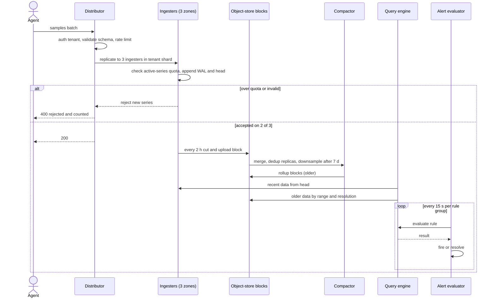
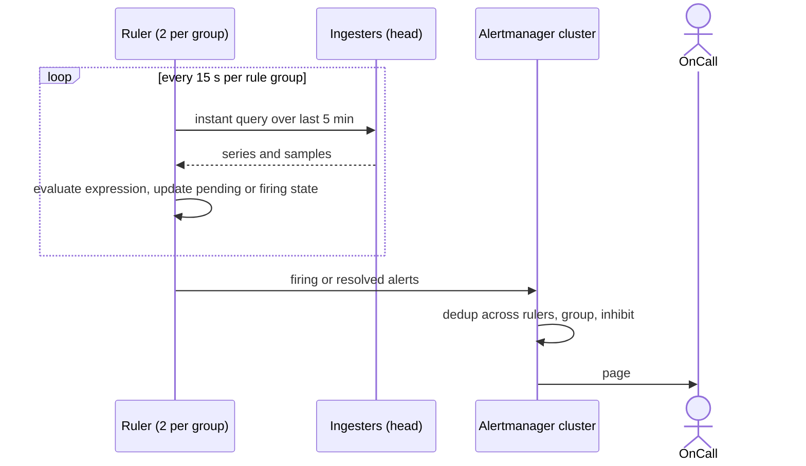

# 013 — Metrics Platform: Full System Design Solution

## Goal and contract

A metrics platform ingests timestamped numeric samples (counters, gauges, histograms) at very high volume and makes them queryable for dashboards and alerting with low latency. The source of truth is the accepted, durably stored sample in time-series blocks; everything computed from it (downsampled rollups, alert states) is a derived view that can be rebuilt.

Assume:

- Millions of samples/second across many tenants, each sample tagged with a metric name and a set of labels.
- Dashboards query recent high-resolution data; alert rules re-evaluate on a short interval (10-60s).
- A single misbehaving tenant can attach a high-cardinality label (e.g. `user_id` or `request_id`) to a metric, multiplying the number of distinct time series by orders of magnitude.

The contract: every sample accepted at ingest is validated against tenant, schema, and quota before being written — malformed or over-quota samples are rejected at the door, not accepted and dropped silently later. Queries have explicit range and result-cardinality limits so one expensive query cannot degrade the platform for other tenants. Metrics are explicitly *not* an audit-grade or billing-grade record — sampling, downsampling, and the possibility of a rejected-but-unretried write mean the platform optimizes for operational visibility, not exact accounting.

The numbers from the question are the contract for everything below: **5M samples/s peak, 10,000 tenants, 13 months retention with 1-minute resolution and downsampling after 7 days, query p99 < 500 ms for a 24-hour window, alert evaluation lag < 30 s, and one tenant's cardinality must not hurt the others.** The hard decision is the last one: the cost of a metrics system is set by *active series*, not by samples, so the design is organised around counting and capping series per tenant before they reach memory.

## Estimates

Two assumptions the question leaves open, stated up front. (1) Agents scrape or push every **15 s** (the granularity in the requirements list of the Gorilla paper, Pelkonen et al., "Gorilla: A Fast, Scalable, In-Memory Time Series Database", VLDB 2015). (2) I read "13 months at 1-minute resolution, downsampled after 7 days" as: native 15 s resolution for the first 7 days, then 1-minute rollups kept for the remaining ~388 days of 13 months (395 days − 7).

- **Samples per day**: 5M/s × 86,400 s = **432B samples/day**. Agents emit on a fixed interval, so load is flat; I size for 5M/s as sustained, which makes every storage number an upper bound. → *So capacity is planned on the peak, and there is no separate burst tier — only a bounded queue in front (see failure table).*
- **Raw bytes**: a decoded sample is an 8 B timestamp + an 8 B float = 16 B (the same figure the Gorilla paper uses) → 5M × 16 = **80 MB/s ≈ 6.9 TB/day**. On the wire, assume ~20 B/sample including amortised label strings → 100 MB/s ≈ **0.8 Gb/s** before snappy. → *Bandwidth is not the bottleneck; a handful of stateless distributors can take it. CPU and memory are.*
- **Compressed bytes**: Gorilla-style encoding stores timestamps as delta-of-delta and values as XOR against the previous value. The paper reports an average of **1.37 bytes/point (a 12× reduction from 16 B)**, with ~96% of timestamps compressing to a single bit and ~51% of values to a single bit (identical to the previous value). The Prometheus docs quote 1–2 bytes/sample for the same family of encoding. Facebook's series are unusually regular, so I plan on the top of the range: **2 B/sample** → 10 MB/s ≈ **0.86 TB/day**; the 7-day native tier is 7 × 0.86 ≈ **6 TB** (4.1 TB at 1.37 B). → *Sample storage at native resolution is small; do not spend design effort there.*
- **Active series**: 5M samples/s × 15 s = **75M active series** (mean 7,500 per tenant, but heavily skewed — assume ~100 large tenants hold most of them). At a 60 s scrape the same 5M/s would mean 300M series. → *Series count = rate × interval, and it — not the sample rate — sets memory. Ask the interviewer for the scrape interval.*
- **Head memory** (assumption, must be measured): ~3 KB per active series in an ingester (label set ~0.5 KB, open chunk and metadata ~1 KB, postings and hash-map entries, GC headroom). 75M × 3 KB = **225 GB**; with replication factor 3, **675 GB**. → *~42 ingesters with 32 GB each (14 per zone × 3 zones), ~16 GB of head each; memory-bound, not CPU-bound (15M appends/s ÷ 42 ≈ 360K/s each).*
- **Index size** (assumption): ~100 B per series per block (label refs, chunk refs, postings entries) → 75M × 100 B ≈ **7.5 GB per 2-hour block**. → *Queriers and store-gateways must never load whole indexes; they load a small header and fetch ranges lazily.*
- **1-minute tier**: 75M series × 1,440 min/day = **108B series-minutes/day**. Rollups keep ~2 values per series-minute on average (counters keep a last value, gauges keep min/max/sum/count, and most series are counters). → 216B values/day × 16 B = 3.5 TB/day naive; × 2 B = **0.43 TB/day compressed**; × 388 days = **168 TB** (1.34 PB naive).
- **13-month total**: naive **1.39 PB** vs compressed **~120 TB (at 1.37 B) to ~175 TB (at 2 B)** — an 8–12× saving. Plan on 175 TB. At an assumed $23/TB-month (S3 Standard list price) that is ≈ **$4K/month** vs ≈ $32K/month naive. → *Storage is cheap; series RAM and query CPU are the cost. But 168 of the 174 TB is the 1-minute tier, so if cost ever matters the lever is retention resolution: 1-minute rollups until day 30 and 5-minute rollups after that is ≈ 41 TB instead of 168 TB, 4× smaller. The question rules that out, so offer it as a follow-up, not a silent change.*
- **Per-series lifetime cost**: 7 d × 5,760 samples × 2 B ≈ 80 KB native + 388 d × 1,440 × 2 values × 2 B ≈ 2.2 MB of rollups ≈ **2.3 MB of object storage and 9 KB of replicated RAM per active series**. → *A tenant adding 1M series costs ~2.3 TB (~$53/month) of storage and 9 GB of RAM — this is the unit for quotas and chargeback.*

## Mechanisms compared

| Mechanism | Behavior | Choose it when | Main weakness |
|---|---|---|---|
| Unbounded label ingestion | Accept any label key/value combination a client sends. | Never in a shared multi-tenant platform. | One tenant putting `user_id` or `request_id` in a label creates millions of unique series — a cardinality explosion that degrades storage and query performance for everyone. |
| Active-series cap per tenant | Track distinct series count per tenant; reject or drop new series beyond a quota. | Standard approach to bound the blast radius of a cardinality mistake. | Requires fast, accurate series-cardinality accounting at ingest time, and a clear rejection signal back to the client so the mistake is visible, not silently swallowed. |
| Store every sample at full resolution forever | Keep raw-resolution data indefinitely. | Never at this ingest volume. | Storage cost grows unbounded; most queries beyond a recent window only need coarser resolution, making this pure waste. |
| Retain-then-downsample tiers | Full resolution for a short recent window; progressively coarser rollups (e.g. 1m → 5m → 1h) for older data. | Standard approach balancing dashboard responsiveness against storage cost. | Downsampled data loses point-in-time precision — must be an explicit, documented trade-off, not a surprise to whoever queries old data expecting raw granularity. |
| Synchronous write-through on every sample | Each incoming sample blocks until durably written before the client's call returns. | Never for high-volume telemetry. | At millions of samples/second this serializes ingest throughput to storage write latency; buffering/batching is required. |

## API

Tenant identity always comes from the credential, never from a field the client can set.

```text
POST /v1/push                                   # Prometheus remote-write style: snappy-compressed protobuf
Authorization: Bearer <tenant-token>
Body: { timeseries: [ { labels: [{name, value}…], samples: [{timestamp_ms, value}…] } ] }
→ 200  all samples accepted
→ 400  { accepted: 9800, rejected: [{reason: "series_limit" | "label_too_long" | "timestamp_bounds" | "out_of_order",
                                     count: 200, example: {metric:"http_requests_total", labels:{…}}}] }
       non-retryable; the valid samples in the batch are still applied
→ 429  tenant sample-rate limit, Retry-After: 2
→ 503  quorum of ingesters unavailable, retry with backoff and jitter
```

- **Idempotency**: a sample's identity is `(series, timestamp)`. Re-sending the same value at the same timestamp is a no-op; a *different* value at an existing timestamp is rejected. Agents therefore retry 429/5xx freely. The Prometheus remote-write specification draws the same line: senders retry 5xx (and may retry 429) but must not retry other 4xx, so an over-limit tenant is told to stop, not to hammer harder.
- **Ordering**: within a series, samples must arrive in timestamp order; timestamps more than ~1 h in the past or ~10 min in the future (assumed bounds) are rejected, so a bad clock cannot pollute the head.

```text
GET /v1/query_range?query=sum by (region)(rate(http_requests_total{service="api"}[5m]))&start=…&end=…&step=60
→ { status:"success", data:{ resultType:"matrix", result:[{metric:{region:"eu"}, values:[[ts,"12.3"],…]}],
    stats:{series_fetched, samples_scanned, resolution:"native|1m", cache:"hit|partial|miss"} } }
→ 422 { error:"query would fetch 2.1M series, limit 100000: narrow your matchers or add a recording rule" }

GET /v1/query?query=…&time=…            GET /v1/series?match[]=…       GET /v1/label/{name}/values
PUT /v1/rules/{namespace}     body: { name, interval:"15s", rules:[{alert, expr, for, labels, annotations} | {record, expr}] }
GET /v1/alerts                → [{labels, state:"pending|firing", activeAt, value}]
GET /v1/cardinality/label_names?limit=20   → top label names by distinct-value count for this tenant
GET /v1/limits                → {max_active_series, active_series_now, sample_rate_limit, max_query_series}
```

The query and rule shapes deliberately follow the Prometheus HTTP API, so existing agents, Grafana and rule files work unchanged (Grafana Mimir and Cortex expose the same surface). Pagination is not needed for `query_range` because the result is bounded by the series limit; `series` and `label values` take `limit`.

## Data model

| Entity | Key and shape | Source of truth? | Notes |
|---|---|---|---|
| **Series** | `series_ref = hash64(tenant_id, sorted label pairs incl. __name__)`; value is the label set. | Yes (in blocks) | Identity is the full label set; changing one label value creates a new series. |
| **Chunk** | `(series_ref, min_t, max_t, encoded bytes)`, ~120 samples, delta-of-delta timestamps + XOR values. | Yes | Prometheus-style chunk size; the encoding is Gorilla's. |
| **Block** | Object-store prefix `tenant/<block-ulid>/` holding `chunks/`, `index`, `meta.json`; covers 2 h at first, merged to 12–24 h by the compactor. | Yes | Immutable after upload. Per-tenant prefix makes retention deletes, cost attribution and per-tenant compaction trivial. |
| **Postings index** | Inside each block: `label_name=value → sorted list of series_ref`, plus a series table `series_ref → label set + chunk refs`. | Derived per block | An inverted index: a query is an intersection of sorted lists. |
| **Rollup block** | Same layout, one value per aggregate per series-minute (see Downsampling). | Derived (rebuildable from native blocks while they exist; after 7 days it is the only copy) | |
| **Tenant config** | `tenant_id → {max_active_series, sample_rate, burst, max_label_names, max_query_series, shard_size, retention}` in a small relational store, cached in every component. | Yes (control plane) | 10,000 rows; low write rate; reads are cached. |
| **Rule group / alert state** | `(tenant, namespace, group) → {interval, rules[]}`; pending/firing state per alert instance. | Rules: yes. State: derived | State is recoverable by re-evaluation and from the alert-state series. |

**Partition key.** Ingest is partitioned by `hash(tenant, series labels)` onto a consistent-hash ring of ingesters, restricted to the tenant's shuffle shard (see Cardinality limits). All samples of one series therefore land on the same ingesters, so they compress together and the series is counted once. Blocks are partitioned by `tenant` then time, so a tenant's cardinality accounting, retention and compaction never cross tenant boundaries.

## Architecture and flow



```arch
%% caption: Writes go through stateless distributors to zone-replicated ingesters and then to object storage, while dashboards and alert rules read through separate query pools.
node agents "Agents and SDKs" at 0,0 icon=app
node dash "Dashboards" at 2,0 icon=dashboard
node notify "Pager and chat" at 3,0 icon=notify
node lb "Load balancer" at 0,1 icon=lb
node qf "Query frontend" at 2,1 icon=gateway sub="split, cache, fair queue"
node am "Alertmanager cluster" at 3,1 icon=alert
node dist "Distributors" at 0,2 icon=service sub="auth, validate, limits"
node qr "Queriers" at 2,2 icon=search
node ruler "Rulers" at 3,2 icon=scheduler sub="rule groups"
node ing "Ingesters x42" at 1,3 icon=db sub="WAL and head, 3 zones"
node rq "Rule query pool" at 3,3 icon=search
node comp "Compactor" at 0,4 icon=worker sub="merge, dedup, downsample"
node obj "Object store" at 1,4 icon=blob sub="blocks per tenant"
node sg "Store-gateways" at 2,4 icon=cache sub="index and chunk cache"
agents -> lb -> dist
dist:B -> ing:L : "RF 3, quorum 2"
ing -> obj : "cut 2 h block"
obj:L -> comp:R
comp:B -> obj:B
obj -> sg
dash -> qf -> qr
qr:B -> ing:T
qr -> sg
ruler -> rq
rq -> ing
ruler -> am
am -> notify
```

Partitioning ingest and storage by tenant + time + series is what makes both the cardinality guard and horizontal scaling possible: cardinality accounting only has to reason about one tenant's series count at a time, and compaction/downsampling jobs operate independently per time-partition without cross-tenant coordination. The hard decision is enforcing the cardinality guard *at ingest*, before the sample is written anywhere, rather than detecting and cleaning up cardinality explosions after the fact — this trades a small amount of extra validation latency on every write for preventing a single tenant's mistake from ever reaching durable storage and degrading shared query performance. Retention and downsampling policy is the second explicit trade: this design keeps full resolution only for a bounded recent window and openly loses precision on older data, trading storage cost for dashboard/alert responsiveness on the data that actually gets queried.

**One write, end to end.** An agent sends 10,000 samples. The distributor authenticates the token to `tenant_id=acme`, validates label lengths and timestamp bounds, and takes tokens from the tenant's rate limiter. For each series it hashes `(acme, labels)`, picks one ingester per zone from acme's shard, and sends the batch to all three. Each ingester checks whether the series exists; if not, it checks the tenant's active-series quota, creates the series (labels, postings, open chunk), appends the sample to the WAL and the head, and acks. The distributor returns 200 after **2 of 3** acks. Source of truth: the WAL + head on two zones until the block is uploaded. Idempotency: `(series, timestamp)`. Ordering scope: per series. Failure story: an ingester that misses the write is repaired at query time and by compaction-time deduplication, not by hinted handoff.

**One read, end to end.** A dashboard asks for `sum by (region)(rate(http_requests_total[5m]))` over 24 h at 60 s step. The frontend splits and consults the results cache, the queriers resolve matchers through the postings index, fetch chunks from ingesters (last ~2 h) and store-gateways (older), decode, aggregate, and return `stats` showing series fetched and cache behaviour.

## Write path: from agent to durable block

| Option | Ack means | Latency to queryable | Replay / fan-out to other consumers | Verdict here |
|---|---|---|---|---|
| **Replicated ingesters with WAL** (Gorilla/Prometheus/Mimir-classic style) | Sample is in the WAL and head of 2 of 3 ingesters. | Immediate — visible in the head on the next read. | No shared log; downstream consumers read from the ingesters or the blocks. | **Chosen.** Lowest end-to-end delay, which the 30 s alert budget needs. |
| **Log-first** (append to a partitioned replicated log such as Kafka, ingesters consume) | Sample is durable in the log. | Log latency + consumer lag (seconds). | Full replay; alert evaluators and archivers can consume the same log. | Choose it when you need replay or several independent consumers; Grafana Mimir documents an ingest-storage architecture built on this idea. Adds a system to run and seconds of visibility delay. |
| **Agents write blocks directly to object storage** | Block is in the store. | Minutes to hours. | Blocks only. | Fails the near-real-time dashboard and 30 s alert requirements. |

**Decision:** replicated ingesters, because a sample is queryable the moment it is acked, at the cost of no shared log for replay and of ingesters being stateful (a restart replays the WAL). That cost is acceptable because the platform is not a system of record for exact events, and a stateful tier of ~42 nodes across 3 zones is operable. At 10×, or if a second consumer (streaming alerting, a warehouse export) is required, move to log-first.

Backpressure is explicit: distributors hold a bounded in-flight budget (bytes) per ingester; when an ingester is slow the distributor returns 503 to the agent, whose local queue (agents buffer to disk or memory) absorbs it. Nothing in the platform has an unbounded queue.

## TSDB internals: head, WAL, blocks, and the label index

```arch
%% caption: A sample lives in the WAL and head for about two hours, then becomes an immutable block whose index maps label pairs to sorted series lists.
grid 180x120
group wp "Write path" color=blue icon=edit
node w "Sample batch" at 1,0 in wp shape=pill
node wal "WAL on local SSD" at 0,0 in wp icon=disk sub="append only"
node head "In-memory head" at 1,1 in wp icon=memory sub="series map and open chunks"
node mm "Memory-mapped chunk files" at 0,2 in wp icon=file
node blk "Immutable block" at 1,2 in wp icon=layers sub="chunks, index, meta"
node up "Upload to object store" at 1,3 in wp icon=blob
group rp "Query path" color=green icon=search
node q "Query" at 2,0 in rp shape=pill sub="job=api, status=~5xx"
node pi "Postings index" at 2,1 in rp icon=index sub="label pair to sorted series IDs"
node ids "Matching series IDs" at 2,2 in rp icon=id
node ch "Fetch and decode chunks" at 2,3 in rp icon=file
w:L -> wal:R
w -> head
head:L -> mm:T : "chunk full at about 120 samples"
head -> blk : "every 2 h cut block"
blk -> up
q -> pi
pi -> ids : "intersect lists"
ids -> ch
```

- **WAL.** Every accepted batch is appended sequentially to a write-ahead log on local SSD before it is acked, so a restart can rebuild the head. Prometheus documents WAL files in 128 MB segments, with the current block held in memory and protected by the WAL. Cost: replay time on restart grows with the series count; checkpointing the WAL keeps it to minutes for ~5M series per ingester (to be measured).
- **Head.** In memory, a map from series to its label set and an *open chunk* to which compressed timestamps and values are appended (the append-only open block design in the Gorilla paper; Prometheus uses the same idea). Full chunks are memory-mapped to disk so RAM holds only the open tails.
- **Blocks.** Every 2 hours the head is cut into an immutable block (chunks + index + metadata) — Prometheus documents two-hour blocks later compacted into longer ones, up to 10% of retention or 31 days. The Gorilla paper measured that blocks longer than two hours give diminishing compression returns, which is why two hours is the unit. Our blocks are uploaded to object storage, where durability comes from the store rather than from three copies.
- **Label → series index (inverted index).** For each `name=value` pair the index keeps a *postings list*: the sorted series refs that carry it. `{job="api", status=~"5.."}` becomes: expand the regex over the (small) list of `status` values, union the matching lists, intersect with the `job="api"` list by a linear merge of sorted arrays. Cost is roughly the sum of list lengths, so a matcher with high selectivity first (`service="checkout"`) beats a broad one; queries are rejected when the intersection exceeds the per-query series limit.
- **Replica dedup.** Each of the 3 replicas uploads its own block; the compactor merges them and drops duplicate `(series, timestamp)` samples, and queriers dedupe replicas when reading the head.

**Trade-off sentence.** I chose XOR-compressed chunks in a head plus immutable blocks over a per-sample row in a general key-value store (Cassandra-style): it stores samples in ~2 B rather than 16+ B and reads one series' hour as one sequential run, but it makes out-of-order writes hard and needs a block-cut and compaction pipeline. That is acceptable because metrics arrive in time order per series and an explicit reject for stale timestamps is a fair contract.

## Query path and fan-out

The 500 ms p99 for a 24-hour window is a budget across stages. A 24 h window at 15 s is 5,760 samples per series.

- **A typical panel** touches ~1,000 series: 5.76M samples ≈ 8 MB of chunks; at an assumed 50M samples/s per core for decode + aggregate that is ~115 ms of one core. **A heavy query** at the 100,000-series limit is 576M samples ≈ 800 MB and ~11.5 core-seconds. To meet 500 ms it must be spread over **≥ 25 cores**, and that is only possible if the data is cached and the engine shards by series.
- **Latency budget** (assumptions, p99): frontend + queue 30 ms → postings lookup 30 ms → chunk fetch 100 ms (memory or cache; a cold object-store GET is 50–100 ms per range, so cold reads are parallelised) → decode + partial aggregate 200 ms → merge + serialize 50 ms → 410 ms, ~90 ms slack.

| Technique | What it does | Effect on the budget |
|---|---|---|
| **Time splitting** | The frontend splits a long range into per-day sub-queries run in parallel. | Helps 7-day or 30-day panels; a 24 h panel is one or two splits. |
| **Query sharding by series** | Split one query into N sub-queries over disjoint series subsets (hash of series ref) and merge partial sums. | The technique that makes a 24 h × 100K-series query fit: 32 shards → ~0.36 core-s each. |
| **Results cache, step-aligned** | Cache per-query results in time-aligned buckets; a dashboard refreshing every 30 s recomputes only the newest slice. | ~100× less work for the common "same panel, 30 s later" case. |
| **Index and chunk caches** | Cache postings, index headers and hot chunks in memory or memcached. | Turns cold fetches into 1–5 ms reads. |
| **Read from ingesters for recent data** | The last ~2 h is served from RAM, older data from blocks via store-gateways (which hold sparse index headers and fetch ranges lazily). | Most "last hour" dashboards never touch object storage. |
| **Limits and fair queues** | Max series, max samples, timeout, per-tenant concurrency and round-robin scheduling across tenants. | Keeps a query of death inside its tenant's quota. |

**Decision:** shard by series and cache results, because the p99 constraint is about the heavy tail, and only parallelism plus caching bounds the tail. The cost is coordination overhead (merge, more RPCs) that makes tiny queries slightly slower; acceptable because tiny queries have huge slack. Queries fan out to at most the tenant's shuffle shard of ingesters and to the store-gateways owning the relevant blocks, not to the whole fleet.

## Downsampling and retention tiers

The compactor produces the 1-minute tier from native blocks older than 7 days and deletes native blocks after they are downsampled and verified. Two resolutions, chosen at query time by age and step: `age ≤ 7 d` reads native, `age > 7 d` reads 1-minute rollups; a range that straddles the boundary is stitched from both.

| Series type | What a rollup stores per series-minute | Why |
|---|---|---|
| Counter | Last value plus the reset-adjusted increase in the window | `rate()` and `increase()` stay correct across counter resets; you cannot recover resets from averages. |
| Gauge | min, max, sum, count (and last) | `avg = sum/count`, `max_over_time` and spike visibility survive; an average alone hides a 100% CPU spike. |
| Histogram | Merged histogram or sketch for the minute | Percentiles cannot be recomputed from per-minute percentiles. |

Thanos documents the same design: downsampled chunks hold count, sum, min, max and counter aggregates, and its docs are explicit that downsampling does **not** by itself save space (extra blocks are close in size to raw ones) — its purpose is to make long-range queries read fewer points. That is exactly our situation: a 13-month dashboard at 1-minute step reads 1,440 points/day instead of 5,760.

**Trade-off sentence.** I downsample by *storing aggregates* rather than just decimating to the last point: it gives correct `max`, `avg` and `rate` on old data, at the cost of ~2× more values per series-minute than a single point. It is acceptable because the 1-minute tier is already the cost centre and correctness of "what was the peak last March" is the reason the tier exists. Old-data queries must return `stats.resolution: "1m"` so nobody mistakes a rollup for raw.

## Histograms and percentiles

Latency percentiles are the most common thing dashboards plot and the easiest to get wrong.

| Option | How percentiles work | Aggregatable across instances? | Cardinality cost |
|---|---|---|---|
| Client-side summary (each process reports p99) | Precomputed quantile per process. | **No** — averaging or maxing p99s across 500 pods is mathematically wrong. | 1 series per quantile per process. |
| Classic bucketed histogram (`le` buckets, sum, count) | Each bucket is a counter series; percentile by interpolating within a bucket. | Yes, if all instances use identical bucket boundaries. | ~14 series per histogram for 12 buckets (+ `+Inf`, sum, count) per label set: a 14× multiplier on the metric. |
| **Mergeable sketch or exponential histogram** (DDSketch, OpenTelemetry exponential histogram, Prometheus native histograms) | Log-scale buckets give a bounded *relative* error; sketches merge by adding bucket counts. | Yes. | **1 series** per label set; buckets are inside the sample. |
| Store raw events and compute offline | Exact. | Yes. | Not a metrics system; that is the logging platform ([014](014_logging_platform_solution.md)). |

The DDSketch paper (Masson, Rim, Lee, VLDB 2019) gives a relative-error guarantee α with logarithmic buckets of ratio γ = (1+α)/(1−α), and sketches are fully mergeable. With α = 1%, γ ≈ 1.0202, covering 1 ms to 60 s needs ln(60,000)/ln(1.0202) ≈ **550 buckets**, sparse and typically far fewer populated.

**Decision:** accept classic histograms for compatibility (agents emit them today), but steer tenants to native/exponential histograms and count each bucket as a series against the tenant quota — that is how histogram cardinality becomes visible to the tenant. Cost: the sketch's bounded relative error (1%) rather than exact values, and bucket boundaries must be fixed per metric for classic histograms. Rollups of a histogram merge the minute's sketches; a percentile over 13 months is computed from merged buckets, never by averaging stored percentiles.

## Cardinality limits and tenant isolation

Cardinality is the platform's central risk. The arithmetic: a counter with 10 label combinations plus a `user_id` label with 1M distinct values is up to 10M series × 3 KB × 3 replicas = **90 GB of RAM** — 13% of the whole fleet's 675 GB from one tenant's one mistake.

**Layers, cheapest first:**

1. **Label schema validation at the distributor.** Max 30 label names, label value ≤ 2 KB, denylist of obvious offenders (`user_id`, `request_id`, `session_id`, raw IP) per tenant policy. Rejects a whole class of mistakes without any state.
2. **Active-series quota per tenant, enforced at ingest.** Default 100,000, raised on request. Each ingester enforces a *local* share of the global limit — `limit × RF ÷ shard_size` (100,000 × 3 ÷ 6 = 50,000 per ingester) — so there is no cross-node coordination on the hot path (the same "global limit divided across ingesters" approach Mimir documents). Cost: hash skew can reject slightly early or late; acceptable because the limit is a guardrail, not an invoice.
3. **New-series creation-rate limit.** Active series can stay flat while *churn* (pods with random names, per-deploy labels) creates unbounded total series and bloats every block's index. Cap creation at, say, 10× the active limit per hour.
4. **Sample-rate token bucket per tenant.** A tenant sending 100× its normal volume is limited to its allocation before it takes ingester CPU.
5. **Visible rejection.** Over-limit series get a 400 naming the reason and counted in `discarded_samples_total{reason,tenant}`; samples for existing series continue to be accepted. Alerts fire to the tenant at 80% of the quota, before the cap; `GET /v1/cardinality/label_names` shows which label exploded.
6. **Per-tenant query limits** (max series and samples per query, concurrency, timeout) with fair-queue scheduling across tenants.

**Overcommit.** 10,000 tenants × 100,000 = 1B series of granted limit vs 75M of real capacity: a 13× overcommit that is safe only because usage is skewed. So limit raises go through review, and a second alert fires when *actual* fleet-wide series exceeds ~70% of capacity.

**Shuffle sharding.** Even with limits, a poisonous tenant (bad label value that crashes the ingester, a query of death) must not affect everyone. Each tenant is assigned a deterministic random subset of ingesters — its *shuffle shard* — instead of the whole ring; the same technique is applied to queriers, store-gateways and rulers (documented for Grafana Mimir; the technique is described in the AWS Builders' Library article on workload isolation). With 42 ingesters (14 per zone) and 2 ingesters per zone per tenant (shard size 6):

- distinct shards = C(14,2)³ = **753,571**; with 10,000 tenants the *expected number* of tenants sharing a poison tenant's exact shard is 10,000 ÷ 753,571 ≈ **0.013**;
- a tenant shares **at least one** ingester with the poison tenant with probability 1 − (C(12,2)/C(14,2))³ ≈ **62%**, but sharing one of six nodes costs it capacity, not availability, because each series still has a replica in the other zones and quorum is 2 of 3.

Small tenants get 3 nodes (1 per zone — only 2,744 distinct shards, so isolation is weaker) and big tenants get more; shard size scales with a tenant's series so that its series fit (5M series × 3 replicas ÷ 6 ingesters = 2.5M each).

**Trade-off sentence.** I chose per-tenant limits plus shuffle sharding over a fully shared ring: it gives bounded blast radius, at the cost of lower bin-packing efficiency (a tenant's shard has slack it cannot lend) and of more ring bookkeeping, which is acceptable because the question's explicit requirement is that one tenant must not hurt the others.

## Alert evaluation within 30 seconds

The budget for "data arrival → an evaluation that includes it has completed" is **30 s**, spent as: agent batching + delivery + ack ≤ 5 s (p99) + the worst-case wait for the next evaluation tick (= the evaluation interval) + query and queueing ≤ 5 s + slack 5 s. That leaves **≤ 15 s for the evaluation interval**. A rule group on the common 60 s interval can see data 60 s old, which *cannot* meet the contract. So the platform offers the lag guarantee to rule groups with `interval ≤ 15 s` (a "fast" class) and documents that slower groups are best-effort.



- **Load.** Assume 500,000 rules (50 per tenant on average). At 15 s that is 500,000 ÷ 15 ≈ **33K evaluations/s**; each reads ~100 series × 20 samples (5 minutes) = 2,000 samples, so ~67M samples/s in total. Decode is ~1.3 cores, but per-query overhead dominates: ~1 ms each ≈ 33 cores. So the alert path is *many small queries*, not heavy ones, and is sized in request rate, not bytes. Budget ~100 ruler cores with headroom.
- **Separate path.** Rulers use their own query pool that reads the ingesters' head directly, so a dashboard stampede cannot delay alerts and the alert query never waits on object storage. Rule groups are sharded across rulers by `hash(tenant, group)` (shuffle-sharded per tenant).
- **Failover inside the budget.** A single ruler owning a group would blow the 30 s budget while the ring detects its death. So each fast-class group is evaluated by **two rulers in different zones** (active-active). Both send to the Alertmanager cluster, which deduplicates (Alertmanager's HA mode deduplicates notifications across the cluster by gossip). *Recording rules* are different: they write samples back, and two writers with slightly different values would be rejected as duplicates, so recording rules have a single owner with ring-based failover.
- **`for:` duration state.** A pending-for-5-minutes alert must survive a ruler restart; state is persisted (Prometheus restores `for` state after restart from a stored alert-state series) and otherwise rebuilt by re-evaluating the last `for` window.
- **Meta-monitoring.** Each ruler exports "time since last successful evaluation of each group"; a *dead-man's-switch* alert that always fires is routed to an external notifier, so if the whole pipeline stalls, the silence itself pages. The alerting system must not be monitored only by itself.

**Trade-off sentence.** I chose evaluate-by-query on the ingester head with two active rulers per fast group, over a streaming evaluator on the ingest log: it reuses the query language and needs no second rule engine, at the cost of doubling evaluation work (33K to 67K queries/s) and a 15 s tick granularity. That is acceptable because 67K tiny queries/s is small next to the dashboard load and 15 s fits the 30 s contract.

## Capacity and storage

Sizing follows from the estimates: ~42 ingesters (14 per zone × 3 zones, 32 GB, local SSD for the WAL) hold ~16 GB of head each; ~20 distributors (stateless, sized by the 100 MB/s wire rate and validation CPU); ~300 cores of queriers for dashboards (assume 2,000 concurrent users × 20 panels refreshing every 30 s ≈ 1,330 queries/s × 0.115 core-s ≈ 154 cores, doubled for headroom); ~100 ruler cores; store-gateways sized by index-header memory, not by data volume; compactors are batch jobs that must keep up with 0.86 TB/day of native blocks plus rollup output (tens of MB/s, far below what one node can do — they are limited by object-store listing and by the ~40K small per-tenant blocks cut every 2 h before merging (assuming an average shard size of 4 ingesters × 10,000 tenants)). Object storage holds ≈ 175 TB. The WAL/ingest path must be partitioned by tenant/time so ingest workers scale horizontally without contention, and compaction must run as an independent background process per partition so it never blocks the ingest hot path.

The old-tier idea "1-hour rollups for a year" is deliberately *not* used: the question requires 1-minute resolution for the full 13 months, and the plan above is sized for that (168 TB). A coarser tier is a cost lever to propose (5-minute after 30 days ≈ 4× smaller), not a default.

Do not let labels like `user_id`, `request_id`, `session_id`, or raw IP be attached to a metric — cardinality is the platform's central capacity risk, and a single such label can turn a metric with tens of series into one with millions; enforce this with both a cardinality quota and, where possible, schema-level label-key validation. Do not treat this store as an audit-grade billing record — samples can be validly dropped under backpressure or rejected for quota reasons, and downsampling destroys point-in-time exactness; if a caller needs exact per-event billing truth, that belongs in a separate durable event log, not the metrics platform.

## Failure and abuse behavior

| Case | Correct behavior |
|---|---|
| Tenant attaches high-cardinality label (user_id) | Cardinality quota rejects new series beyond the tenant's cap with a visible error/counter, rather than silently accepting and letting series count balloon. |
| Ingest backlog builds during a traffic spike | Buffer/batch in the WAL up to a bounded depth; beyond that, shed load by rejecting new samples with a clear signal rather than growing an unbounded queue that risks OOM. Agents buffer locally and retry 429/503 with jitter. |
| Compaction/downsampling falls behind | Recent high-res data remains queryable; older-tier queries may see a documented staleness gap until compaction catches up — surfaced via a lag metric, not hidden. Native blocks are deleted only after the rollup block is verified. |
| Query requests an unbounded time range across millions of series | Query engine enforces range and result-cardinality limits, returning a clear "narrow your query" error rather than attempting the scan and degrading shared query capacity. |
| Alert rule evaluation lags behind real time | Alert delay is tracked explicitly; a lagging evaluator should alert on itself (meta-monitoring) since a silent alerting delay is worse than a missing dashboard panel. |
| Duplicate/retried sample from a flaky agent | Timestamp + series identity is the natural dedupe key; a retried identical sample at the same timestamp is idempotent to reapply, not double-counted as two separate events. |
| One ingester crashes (or OOMs on a poison tenant) | Quorum 2 of 3 continues; only that tenant's shard is exposed; the node restarts and replays its WAL (minutes), and the distributor skips it meanwhile. |
| One zone lost | Every series still has 2 replicas, so writes run at 2-of-2 with no further failure tolerance until the zone returns; alert and query pools in the surviving zones continue. |
| Whole region lost | Not covered by the single-region design: blocks replicate asynchronously to another region, so RPO is the un-uploaded head (~2 h) unless WAL shipping is added; see the multi-region follow-up. |
| Object store unavailable | Ingesters keep the head and WAL and retry uploads (local disk sized for several hours of blocks); queries for data older than ~2 h fail or degrade to cache; alerts (head-only) are unaffected. |
| Bad deploy | Roll out one zone at a time, ingesters last, with the canary comparing reject rate and p99 append latency; queriers and rulers roll out separately from ingesters; rule-file changes are validated (syntax and estimated series touched) before activation. |

## Observability and interview close

Measure accepted vs rejected samples/second (and rejection reason breakdown: schema, quota, auth), active series count per tenant against quota, compaction/downsampling lag, query p99 latency by range/tier, and alert evaluation delay. Alert on active-series count approaching a tenant's cardinality cap (before it's hit, so the tenant can fix it), on compaction lag exceeding the documented staleness window, and on alert evaluation delay itself, since a delayed alert pipeline silently defeats the platform's core purpose. **The one paging alert:** "fast-class rule-group evaluation age p99 > 20 s" — it fires before the 30 s contract is broken and covers ingest visibility, ruler health and query-path saturation together.

SLIs to publish: ingest availability (2xx/(2xx+5xx)), query success and p99 by range, alert-evaluation lag p99, and active-series headroom (fleet capacity − use).

Interview close: "The single biggest operational risk in a metrics platform is cardinality, not raw sample volume, so I enforce an active-series quota at ingest before a sample is ever written, and I'm explicit that this system trades exactness for operational responsiveness — it's not a billing-grade record, it's a fast, bounded-cost view of system health."

Trade-off to state: "I keep native resolution for 7 days and 1-minute aggregates for 13 months because that is what the requirement asks, which makes the long tier 97% of the bytes; if cost mattered more than minute-level history a year back, I would move to 5-minute rollups after 30 days and cut storage about 4×."

## Follow-ups the interviewer will ask

1. **"How do you do multi-region?"** Keep each region a full, independent stack that stores its own tenants' data, and query globally by fanning out to each region and merging partial aggregates (pushing `sum by` down to the regions), which is the shape described for Google's Monarch (regional in-memory zones with global queries, VLDB 2020). Alerts are evaluated in the region where the data lives so a WAN partition cannot delay them. Replicate blocks asynchronously for DR; accept RPO ≈ the un-uploaded head.
2. **"What changes at 10× and 100×?"** At 50M samples/s the head is ~6.75 TB across replicas (750M series × 3 KB × 3), and the index per 2-hour block is 75 GB — one ring becomes too big to operate. Move to *cells*: each cell is a complete 5M/s stack, a router maps tenant → cell, and a huge tenant may be split across cells by metric namespace. At 100× the ingest path is likely worth moving to a log ([26](../building_blocks/26_distributed_log_internals.md)) so cells can be rebuilt by replay.
3. **"Can you make it exact — no lost samples?"** Only for a subset: switch that tenant to synchronous quorum with fsync per batch (higher latency, lower throughput), disable drops under backpressure (reject instead), and reconcile against a durable event log. Billing-grade counts should come from the event log, and metrics stay approximate.
4. **"What does it cost, and what would you cut first?"** Storage ≈ $4K/month for 175 TB, ingester RAM for 75M series × 3 replicas, and query CPU dominate. The first lever is cardinality (chargeback at ~9 KB RAM and 2.3 MB storage per series), then coarser rollups for old data (4× on the long tier), then dropping unqueried metrics (usage-based retention).
5. **"How do you defend against abuse?"** Layered limits: label schema, active series, series churn, sample rate, per-query limits, fair queues, and shuffle sharding so the remainder of the blast radius is confined to a small subset of nodes ([28 — overload control](../building_blocks/28_overload_control_and_graceful_degradation.md), [25 — hot keys](../building_blocks/25_partitioning_and_hot_keys.md)).
6. **"Why not just use Elasticsearch, Cassandra or a SQL database?"** A sample is 16 B raw but ~2 B in a purpose-built chunk; a per-row store spends 10–100× more bytes and disk I/O per sample and cannot do delta-of-delta compression across a series. You would use a general store only for the control plane. Build-vs-buy: run an open-source TSDB (Mimir, Thanos, VictoriaMetrics) or buy a hosted one unless you have a reason not to.
7. **"What if I told you 1% percentile error is unacceptable?"** Then for those metrics use finer-grained buckets (α = 0.1% needs ~10× more buckets) or store exact events for those flows via the logging platform ([014](014_logging_platform_solution.md)); cardinality cost rises accordingly, and I would say so.
8. **"What if the interviewer disagrees with enforcing cardinality at ingest and prefers accept-then-clean?"** Concede the operational point (never dropping a sample is friendlier), but hold the distinction: accept-then-clean puts the explosion in RAM and in every block's index before anyone reacts, and the first symptom is other tenants' slow queries. I would offer a compromise: accept into a *quarantine* series budget per tenant that is isolated from the shared head, so the tenant's data is kept but cannot hurt others.

## Common mistakes

1. **Treating samples/s as the sizing number.** The estimate then says "80 MB/s, easy" and misses that 75M active series need ~675 GB of RAM. Size on series first, samples second.
2. **Averaging percentiles.** p99s from 500 pods cannot be averaged. Use mergeable histograms/sketches and say why.
3. **Downsampling to the last point only.** A minute average hides a 30-second spike, and a `rate()` over decimated counters breaks at resets. Store min/max/sum/count for gauges and a reset-aware value for counters.
4. **Evaluating alerts at 60 s and claiming a 30 s lag.** The tick alone can add 60 s. Do the budget arithmetic (5 + 15 + 5 + 5) and state the rule interval the contract covers.
5. **Detecting cardinality after the fact.** By the time a dashboard is slow the series are in RAM and every block's index. Enforce at ingest, reject visibly, and give tenants a cardinality report.
6. **One shared query pool for dashboards and alerts.** A dashboard stampede delays paging. Separate the rule path and read the head directly.
7. **Unbounded queues.** "Buffer everything" turns a traffic spike into an OOM. Bounded queues, explicit 429/503, and agent-side buffering keep failure local.
8. **Ignoring what happens to the old data.** Saying "1-minute for 13 months" without noting it is 97% of storage, or that the rollup is the *only* copy after 7 days, so a buggy downsampler destroys history. Verify before deleting native blocks.

## Going from L5 to L6

- **Migration and rollout.** Onboard tenants gradually: shadow-write to the new platform, compare query results against the old one, and move dashboards before alerts; start every tenant with a conservative series limit and raise it with data.
- **Cost model.** Present cost per active series (≈ 9 KB RAM, ≈ 2.3 MB of storage over 13 months) and price tenants by series and retention; make cardinality a product feature (self-service report and quota-request flow) rather than a support ticket.
- **Ownership and blast radius.** Cells (5M samples/s each), shuffle-sharded ingesters/queriers/rulers, and a separate ruler path mean any single failure costs a small slice of tenants; one team owns the agents and schema, another the storage tier, and the SLO for alert lag is owned end to end.
- **Build vs buy.** Adopt an existing open-source engine (Mimir/Thanos/VictoriaMetrics) and put differentiation in tenancy, quotas and the alert SLO, unless scale or cost make a custom store worth its operational load.
- **Phased evolution.** Phase 1: single-region replicated ingesters + object store + rules; phase 2: results cache, query sharding, native histograms; phase 3: log-first ingest and cells; phase 4: multi-region query federation.
- **What I would measure first.** Real bytes/sample and head bytes/series on production data (my 2 B and 3 KB are assumptions), the series-per-tenant distribution (to validate the skew and overcommit), and the share of dashboards that actually query beyond 7 days.

## Build exercise

Implement counter and histogram ingest with per-tenant active-series tracking and a hard cardinality cap; write a client that legitimately increments a counter and one that maliciously attaches a unique label per request, and assert the second is rejected at the cardinality quota well before it can degrade ingest for the first.

Extend it with named assertions:

- `test_idempotent_retry`: pushing the same batch twice leaves the sample count unchanged; pushing a different value at an existing `(series, timestamp)` is rejected.
- `test_quota_isolated`: with tenant A at its cap, tenant B's ingest latency p99 does not change by more than 10%.
- `test_existing_series_still_accepted`: after A hits its cap, new samples for A's existing series are still accepted while new series get 400 `series_limit`.
- `test_downsample_preserves_max_and_rate`: a gauge spike lasting 20 s survives as the minute's `max`; a counter with a reset yields the same `increase` from 1-minute rollups as from raw within 1%.
- `test_alert_lag`: with a 15 s rule interval, a threshold breach appears in `firing` state within 30 s of the sample's arrival, including when one of two rulers is killed mid-run.
- `test_shuffle_shard_overlap`: for 10,000 random tenants over 14 ingesters per zone with shard size 2 per zone, the number sharing the exact shard with a fixed tenant is ≤ 2 (expected ≈ 0.013).
