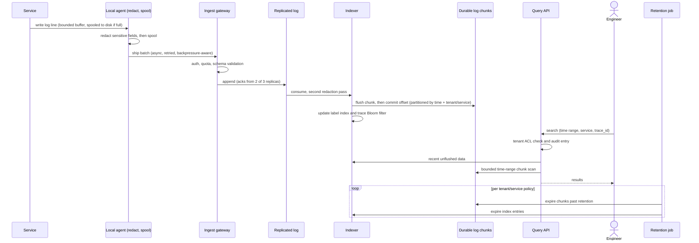

# 014 — Logging Platform: Full System Design Solution

## Goal and contract

A logging platform collects structured log lines from thousands of services and makes them searchable by time, service, and trace ID without ever becoming a dependency that can slow down or break the product requests generating those logs. The durable log chunks are the source of truth; the search index over them is a derived, rebuildable structure.

Assume:

- Thousands of services emit structured logs continuously; peak volume spans orders of magnitude across services.
- Engineers need to search by time range, service, and trace ID (correlating a single request across services) within seconds.
- Logs can contain sensitive fields (PII, tokens, secrets) that must never be broadly queryable in raw form.
- Backend ingest can slow down or go fully unavailable without taking the product down with it.

The contract: logging is always asynchronous relative to the request that generates it — a logging backend outage degrades log completeness, never product latency or availability. Structured schema and retention policy are enforced per tenant/service, sensitive fields are redacted before or at ingest (not after, and not only at query time), and access to log content is governed by tenant/service ACL with an audit trail. Freshness of the search index is bounded, not instantaneous, and explicitly communicated as such.

The question's numbers are the contract: **3,000 services, 2M lines/s at peak, p99 < 2 s to search one service for one hour, no loss across a 10-minute backend outage, retention 7 days to 1 year per source, and redaction complete before anything is queryable.** The one hard decision is *what to index*: at this volume the index, not the bytes, is what decides cost.

## Estimates

Assumptions to confirm with the interviewer: average structured line **400 B** (JSON with timestamp, service, level, trace ID, message and a few fields; real fleets range 200 B to 1 KB); average load is **half of peak** (1M lines/s); ~**30,000 hosts** run the 3,000 services; text compresses **~8×** with zstd/gzip-class codecs (typically 5–10× on JSON logs).

- **Bandwidth**: 2M lines/s × 400 B = **800 MB/s ≈ 6.4 Gb/s** at peak; average 400 MB/s. Per host, 800 MB/s ÷ 30,000 ≈ **27 KB/s**; per service, 2M ÷ 3,000 ≈ 670 lines/s at peak on average, but a few services emit 20,000+ lines/s (assume 20K lines/s ≈ 8 MB/s for a "heavy" service). → *Fleet bandwidth is modest; the interesting numbers are the skew and the tail per service.*
- **Volume per day**: 1M lines/s × 86,400 = 86B lines/day × 400 B = **34.6 TB/day raw** (69 TB/day if peak were sustained); compressed ≈ **4.3 TB/day**. → *Compress before you store; everything downstream is priced per byte.*
- **Retention mix** (assumption): 80% of bytes are debug/info kept 7 days, 18% standard kept 30 days, 2% audit/security kept 365 days. Weighted retention = 0.8×7 + 0.18×30 + 0.02×365 = **18.3 days**. Raw-equivalent total = 34.6 TB × 18.3 = **632 TB**; compressed **≈ 79 TB** (7-day class 24 TB, 30-day class 23 TB, 365-day class 32 TB). → *The 2% audit slice is 40% of the stored bytes: retention class, not ingest rate, dominates long-run storage.*
- **Outage buffer** (10 min at peak): 2M × 600 s = **1.2B lines = 480 GB raw**, ≈ 96 GB compressed at ~5× in the broker, **288 GB with replication 3**. Per host, 27 KB/s × 600 s = **16 MB**; a hot host at 5 MB/s needs 3 GB, ×1.5 headroom = 4.5 GB, so a **5 GB agent spool covers 10 min at up to 8.3 MB/s per host**. → *A tiny amount of disk on every host plus a few hundred GB in the broker covers the outage. The buffer is cheap; the real question is whether we can drain it (below).*
- **Catch-up capacity**: after the outage the backlog is 1.2B lines. If indexers can process only *k*× peak, draining while live traffic continues at peak takes 1.2B ÷ ((k−1) × 2M) s: k=2 → **600 s**, k=3 → 300 s; if live traffic is at the 1M/s average, k=2 drains in 400 s. → *Size indexers at **≥ 2× peak (4M lines/s)**; at exactly 1× the backlog never drains and the "10-minute tolerance" becomes permanent lag.*
- **Streams and chunks**: with ~10–60 label combinations per service (env × region × level), there are **30K–180K streams**. At 1.5 MB compressed chunks (~12 MB raw, ~30K lines), 79 TB is **~53M chunks**, ~120K per hour of ingest. → *The chunk/stream index is ~53M entries × ~50 B ≈ 2.6 GB: small enough for one replicated store, and cardinality must stay low or it stops being small.*

## Mechanisms compared

| Mechanism | Behavior | Choose it when | Main weakness |
|---|---|---|---|
| Synchronous log write inline with the request | Service blocks on writing the log line to the logging backend before returning. | Never for product-serving paths. | Any logging backend slowdown or outage directly becomes product-request latency or failure — the exact coupling this platform must avoid. |
| Local agent buffer + async ship | Service writes to a local buffer (memory/disk); a separate agent ships batches to ingest asynchronously. | Standard approach — decouples log durability from request latency. | Requires a bounded buffer with an explicit shed policy; an unbounded buffer risks disk/memory exhaustion during a prolonged backend outage. |
| Index every field automatically, forever | Every structured field becomes independently searchable and is retained indefinitely. | Never at scale. | Index size and cost grow unbounded and mostly unused; most fields are never queried, and indefinite retention conflicts with data-minimization and cost goals. |
| Selective indexing + time/tenant partitioned retention | Common fields (time, service, trace ID, level, tenant) are indexed; retention tiers vary by tenant/service policy. | Standard approach balancing query usefulness against index cost. | Requires deciding up front which fields are "common enough" to index — a field left out is only full-text/scan-searchable, which is slower. |
| Redact at query time (raw stored, filtered on read) | Store raw logs; apply redaction rules when serving a query. | Never as the sole control for sensitive data. | Any bug, access-path bypass, or bulk export skips the filter and leaks raw sensitive content; redaction must not depend on every read path remembering to apply it. |

## API

```text
POST /v1/logs/push                                   # agent → ingest gateway
Authorization: Bearer <agent-credential>             # tenant and service come from the credential, never the body
Body: { agent_id, batch_seq, redaction_v: 41,
        source: {service, env, region, host},
        entries: [ {ts_ns, level, trace_id, span_id, message, fields: {…}, line_id} ] }
→ 204  accepted (durably appended to the log)
→ 400  schema violation (line too large, bad timestamp) — non-retryable, rejected lines counted
→ 429  tenant/service quota exceeded, Retry-After: 5     (agent keeps spooling, applies drop policy)
→ 503  broker unavailable                                  (agent retries with backoff and jitter)
```

- **Idempotency**: `(agent_id, batch_seq)` identifies a batch; each line carries `line_id = hash(host, file_id, offset)`. Retries are at-least-once, and the indexer drops duplicate `line_id`s within a chunk window, so a retried batch is stored once.
- **Ordering**: per source (host + file) only, by `batch_seq` and offset. Cross-host order is *never* promised; queries sort by event timestamp, and correlation uses `trace_id` (see the failure table on clock skew).

```text
POST /v1/logs/query
{ tenant, selector: {service: "checkout", env: "prod"},           // label selector → streams
  from, to, filter: {text: "timeout", level_gte: "WARN", trace_id: "…", fields: {status: "500"}},
  limit: 1000, direction: "backward", cursor }
→ { entries: […], stats: {chunks_scanned, bytes_scanned, took_ms, index_lag_s, truncated}, next_cursor }
→ 422 { error: "query would scan 340 GB, limit 100 GB: narrow the time range or add a label filter" }

GET  /v1/logs/trace/{trace_id}?from&to       → entries from all services the caller may read, merged and ordered
GET  /v1/logs/tail?service=checkout&env=prod → SSE/WebSocket, sampled server-side above 1,000 lines/s per session
PUT  /v1/policies/{tenant}/{service}         → { retention: "7d|30d|365d", sampling: {debug: 0, info: 0.1}, quota_lines_per_s, redaction_ruleset }
GET  /v1/audit?principal=…                   → who queried what, bytes scanned, rows returned (security role only)
```

## Data model

| Entity | Key and shape | Source of truth? |
|---|---|---|
| **LogRecord** | `{tenant, service, env, region, host, ts_ns, ingest_ts, level, trace_id, span_id, message, fields{}, line_id, redaction_v}` | Yes, inside chunks |
| **Stream** | Unique label set `{tenant, service, env, region, level}`; `stream_id = hash(labels)`. High-cardinality values (`trace_id`, `user_id`, `pod`) are **never** labels. | Derived (from records) |
| **Chunk** | Object `s3://logs/<retention_class>/<tenant>/<yyyy-mm-dd>/<stream_id>/<ulid>`: compressed blocks of lines, min/max ts, line count, **Bloom filter of trace IDs**. ~1.5 MB. | **Yes** |
| **Label index** | `label pair → stream_ids`, and `(stream_id, hour) → chunk refs`. ~2.6 GB in a replicated KV/SQL store; rebuildable by listing chunk metadata. | Derived |
| **Policy** | `(tenant, service) → {retention_class, sampling, quota, redaction_ruleset, acl_group}` | Yes (control plane) |
| **Audit entry** | `(principal, ts, query, bytes_scanned, result_count, allowed)` in an append-only store with its own retention. | Yes |

**Partition keys.** Log topic: `hash(service, host) mod k_service`, where `k_service` is 1, 4 or 16 by volume tier — so a heavy service spreads over up to 16 partitions (no hot partition) while a query for one service touches few indexers. Objects: retention class → tenant → day, so expiry is a lifecycle rule on a prefix, not a scan.

## Architecture and flow



```arch
%% caption: Lines are redacted at the agent, buffered in a replicated log, turned into object-store chunks by consumers that commit offsets only after the flush, and read by both search and live tail.
grid 180x120
node app "Service stdout and files" at 0,0 icon=app
node ops "Operators" at 2,0 icon=users
node ag "Agent" at 0,1 icon=logs sub="parse, redact, disk spool"
node tail "Live tail service" at 2,1 icon=stream
node gw "Ingest gateway" at 0,2 icon=gateway sub="auth, quota, schema"
node raw "Log topic" at 0,3 icon=topic sub="service+host partitions"
node rd "Redaction pass 2" at 1,3 icon=shield sub="detectors and quarantine"
node clean "Clean topic" at 2,3 icon=topic
node lab "Label and trace index" at 1,4 icon=index
node idx "Indexers x40" at 2,4 icon=worker sub="build chunks"
node obj "Object store" at 3,4 icon=blob sub="by retention class"
node q "Query API" at 2,5 icon=api
app -> ag
ag -> gw : "idempotent batch"
gw -> raw -> rd -> clean
clean -> idx
idx -> obj : "flush then commit"
idx -> lab
clean:T -> tail:B
q:L -> lab:B
q:R -> obj:B
q:T -> idx:B
tail -> ops
```

Buffering at the agent and shipping asynchronously is the mechanism that makes the core contract possible: the product request only ever writes to a fast local buffer, never waits on the network or the ingest backend, so a logging backend outage shows up as buffer growth and eventual sampling/drop, never as elevated product-request latency. This trades log completeness during an outage (some logs may be shed once the bounded buffer fills) for the much stronger guarantee that logging can never cause a product outage — an explicit, correct trade for an observability system whose job is to help diagnose problems, not become one. Redacting sensitive fields at ingest, before the durable write, is the second hard decision: it trades a small amount of ingest-time processing for making the durable store itself safe to broadly query, rather than depending on every future read path to remember to filter.

**One write, end to end.** A service writes a line to stdout. The agent tails it, parses JSON, applies the stage-1 redaction ruleset (version 41) and appends the *redacted* line to its on-disk spool, then ships batches of ~1 MB every second to the gateway. The gateway authenticates the agent, applies the service's quota and schema, and appends to the log topic partition for `(service, host)`; it returns 204 after the write is acknowledged by 2 of 3 replicas. A redaction consumer applies the server-side detectors and forwards to the clean topic; an indexer consumes, groups lines per stream into a chunk buffer, and when the chunk is full or 5 minutes old, writes the chunk to object storage, updates the label index and trace Bloom filter, and **only then commits its offset**. Source of truth: the log topic until flush, then the chunk. Idempotency: `line_id`. Ordering scope: per source. Failure story: an indexer crash replays from the last committed offset and duplicates are dropped by `line_id`; poison lines (unparseable) go to a dead-letter topic with the raw bytes truncated and counted, never blocking the partition.

**One read, end to end.** An engineer searches `service=checkout` for the last hour with `text=timeout`. The query API checks the ACL and writes an audit entry, resolves labels to stream IDs, asks the label index for chunk refs in the window, splits them into parallel work units, scans them (decompress, filter) and merges newest-first with early exit at `limit`; the last few minutes not yet flushed come from the indexers' memory.

## Buffering and backpressure: surviving a 10-minute outage

Two independent buffers protect two independent failures.

| Failure | Who absorbs it | Capacity (from Estimates) | If it fills |
|---|---|---|---|
| Search/storage backend down (indexers, object store, label index) | The **replicated log**: consumers stop, offsets are not committed, producers keep appending. | 10 min = 96 GB compressed (288 GB replicated); retain **6 h** = 8.6 TB raw ≈ 1.7 TB compressed, ×3 ≈ **5.2 TB** across ~20 brokers (~260 GB each): trivial, so the retention margin over 10 min is 36×. | Retention expires the oldest offsets: only after 6 h, an incident of its own. |
| Ingest gateway or the log itself down/overloaded | The **agent's disk spool**, bounded at 5 GB per host (covers 10 min at 8.3 MB/s per host). | 16 MB per average host, 3 GB per hot host. | Drop policy below: DEBUG first, then sampled INFO; ERROR and audit last. |
| Object store slow | Indexers hold chunk buffers and pause consumption (no offset commit) rather than drop; the log absorbs the backlog. | 5 min of chunk buffers = 240 GB raw in flight at peak, ≈ 30 GB after in-memory compression, fleet-wide. | Backpressure propagates to the log. |

**Design decision: the log is the buffer.** Options considered: (a) agent → indexer directly with only the agent spool: simplest, but a fleet-wide backend outage becomes 30,000 hosts each retrying, and every host must hold the whole outage; (b) agent → object store directly (batched files): no broker, but freshness is minutes and per-host files explode the object count; (c) **agent → replicated log → indexers**: one place to absorb, replay and fan out (live tail, the redaction pass, a second consumer such as a security pipeline). Choice (c) gives replay and fan-out and cost bounded by 5 TB of broker disk; it costs an extra hop (~1 s) and a stateful cluster to run, which is acceptable because freshness of a few seconds is fine for search. The log is described in [09 — messaging and streaming](../building_blocks/09_messaging_and_streaming.md) and [26 — distributed log internals](../building_blocks/26_distributed_log_internals.md).

Producer settings are the standard durability trio (documented Kafka semantics): idempotent producer, `acks=all`, `min.insync.replicas=2` with replicas across three AZs, so losing an AZ neither loses acknowledged data nor blocks writes.

**Draining.** Indexers are sized at 2× peak (4M lines/s ≈ 1.6 GB/s ÷ 40 nodes = 40 MB/s per node) so the 10-minute backlog drains in ≈ 400–600 s while live traffic continues. Catch-up must not starve live tail and fresh data: consume the newest offsets first on a separate consumer group, and backfill old offsets at lower priority.

## Redaction before anything is queryable

The requirement is strict: sensitive fields must be redacted "before they are durably stored or searchable". A durable broker topic *is* durable storage, so a redactor that sits only after the log would already have violated it. The design therefore has two stages:

| Stage | Where | What it catches | Cost |
|---|---|---|---|
| **1. At the agent, before spool and network** | Every host, from a signed, versioned ruleset. | Known field names (`password`, `authorization`, `set-cookie`), structured-log schema allow-lists, cheap patterns (Luhn-valid card numbers, emails, bearer/JWT/cloud-key formats). Replace with `[REDACTED:card]` or a keyed hash. | ~67 lines/s per host on average — negligible CPU with a cgroup cap. |
| **2. Central pass, before the clean topic** | A stateless consumer group between the log topic and the indexers. | Newer rules than the agent has yet, expensive detectors, lines whose `redaction_v` is below the minimum; quarantines suspicious lines. | 800 MB/s ÷ ~100 MB/s per core (assumed) = 8 cores at peak; ×4 for headroom ≈ **32 cores**. |
| **3. Audit scan** | Sampled scan of stored chunks against the same detectors. | Anything both stages missed; a nonzero count is a security incident. | Background batch job. |

Nothing is *queryable* until stage 2 has processed the line, because indexers and the tail service read only the clean topic. The residual exposure is the raw topic: it holds only stage-1-redacted lines, is encrypted at rest, ACL-limited to the redaction workers, and has 6-hour retention. Keyed hashing (HMAC with a per-tenant key) instead of deletion preserves equality search ("all logs for this hashed user") without revealing the value. **Trade-off:** redacting at the edge means a wrong rule destroys data permanently (raw is not kept), so rules ship dry-run first (log the would-be redactions for 24 h), then canary, then fleet-wide. That cost is acceptable because the alternative — a raw copy in a searchable store — is exactly what the contract forbids.

## Three ways to index logs

The p99 constraint is *one service, one hour*. That determines the winner.

| | **Inverted index** (Elasticsearch / Lucene-style) | **Label index + object-store chunks** (Loki-style) | **Columnar** (ClickHouse-style) |
|---|---|---|---|
| What is indexed | Every token of every field: term → document list, plus doc values. | Only labels (service, env, region, level): label → streams → chunks. Content is not indexed (Loki docs: it "does not index the contents of the logs, but only ... metadata"). | Nothing per token; data sorted by `(service, ts)`, sparse primary index (one mark per 8,192 rows by default), column-wise compression, optional skip indexes. |
| On-disk size vs raw (assumed) | ~1.0× primary, ×2 with one replica | ~0.125× (8× compression) | ~0.08× (assumed 12×), ×2 for two replicas |
| Storage for our 632 TB raw-equivalent | 632 TB primary, 1.26 PB replicated: **$101K/mo** all-SSD at $80/TB-mo, or ≈ **$29K/mo** with 3 days hot on SSD and the rest on object storage | 79 TB on object storage: **≈ $1.8K/mo** at $23/TB-mo | 53 TB, 105 TB replicated: ≈ **$8.4K/mo** on SSD, or ≈ $1.2K/mo on object-store-backed tables |
| Ingest CPU at 2× peak (assumed per-core rates) | ~5 MB/s/core → 1.6 GB/s ÷ 5 = **320 cores** | ~30 MB/s/core (compress + label handling) → **~55 cores** | ~10 MB/s/core → **160 cores**; needs large batched inserts (docs recommend thousands of rows per insert) |
| 1 h, average service (0.48 GB raw) | tens to hundreds of ms on hot shards | 0.48 GB ÷ 300 MB/s per core (assumed decode + filter) = 1.6 core-s → 8-way split ≈ **0.2 s** | tens of ms (reads only needed columns, ~40 MB) |
| 1 h, heavy service (20K lines/s: 28.8 GB raw, 3.6 GB compressed) | ~100s of ms if hot | 96 core-s → 100-way split ≈ **1 s** plus 3.6 GB ÷ 100 workers ≈ 36 MB per worker from object storage | ~2.4 GB compressed read at NVMe speed, sharded: **< 1 s** |
| Rare string across *all* services, 24 h | Fast (index lookup) | 34.6 TB raw ÷ 300 MB/s = **115K core-s**: needs a limit or a trace/token Bloom index | Scan of one column, ~3 TB compressed: minutes |
| Freshness | ~1 s (Elasticsearch's default refresh interval) | seconds (in-memory chunks are queryable) | seconds once batched |
| Wins when | Arbitrary full-text over many fields, security investigation, small/mid volume, latency of ~100 ms matters | **High volume where queries are scoped by service + time**, cost matters, grep-style filtering is enough | Structured "wide events", analytics (group by status, p99 by endpoint), schema drift handled by materialized columns (Uber's 2021 blog describes moving log analytics from an ELK stack to ClickHouse) |
| Loses when | Cost: ~15× the storage bill here, and heavy indexing CPU | Cross-service needle-in-haystack; label cardinality mistakes (a `trace_id` label destroys the index) | Full-text on free-form text without skip indexes; small frequent inserts |

**Decision:** label index + chunks for the 98% because the contract *is* the query pattern that design is cheapest at — 1 hour, one service — and it is ~15× cheaper than an inverted index ($1.8K vs $29K/month even with tiering). Trace correlation, the one cross-service query that matters, is handled with a per-chunk **Bloom filter of trace IDs**: 10 bits per key gives a false-positive rate (0.62)^10 ≈ 0.8%; with ~10K trace IDs per chunk that is 12.5 KB per 1.5 MB chunk (0.8% overhead). A 1-hour trace lookup checks ~120K filters and scans ~1% false positives ≈ 1.2K chunks ≈ 14 GB raw ≈ 48 core-s ≈ 0.5 s at 100-way parallelism. The audit/security 2% slice (0.69 TB/day raw ≈ 21 TB compressed for a year at the assumed 12×) goes to the columnar store, which gives it structured queries and a compression ratio that makes 1-year retention affordable (≈ $0.5K/month on object-store-backed tables, or ≈ $3.4K/month replicated on SSD). The cost of the mixed design is two storage systems to run; that is acceptable because they serve different retention and query classes. See [20 — specialized data structures](../building_blocks/20_specialized_data_structures.md) for Bloom filters.

> 💡 Say this in the interview: "Index labels, not content. The question tells me queries are scoped by service and time, so I spend nothing on a full-text index and pay with parallel scans instead. I'd only build an inverted index for the slice that needs needle-in-haystack search."

## Query path, tail, and limits

- **Planner.** Selector → streams (label index) → chunk refs in `[from, to]` → work units of ~1–2 chunks → parallel workers (frontend splits long ranges into 15-minute sub-queries, caches results for immutable ranges). `direction=backward` with `limit` stops early: the common "show me the latest 1,000 errors" reads the newest few chunks, not the hour.
- **Limits** (protect shared capacity): max window 6 h interactive (p99 < 2 s is promised for ≤ 1 h and ≤ 100 GB scanned); above that, an async job with a result link. Max bytes scanned per query 100 GB (≈ 330 core-s), per-tenant concurrency and fair queueing, 30 s timeout. A 24 h query on the heavy service scans 691 GB (≈ 2,300 core-s) and is rejected with a hint.
- **Live tail.** Served from the clean topic by a tail service, not by polling object storage: a per-session consumer with the label filter applied server-side, end-to-end ≈ 1–3 s. Sessions above 1,000 lines/s are sampled and say so in the stream; tail sessions are capped per user so that a dashboard left open cannot become a fleet-wide consumer.
- **Caches.** Label-index lookups and recent chunk metadata in memory; a results cache for repeated identical dashboards; chunk cache on the workers. Repeat queries over immutable chunks are cheap; queries over the last 5 minutes are not cached.

## Overload, sampling, and drop policy

When ingest exceeds what the system can take (log storm from a bad deploy, backend brown-out), degrade in a deliberate order rather than at random:

| Priority | Class | Behaviour under pressure |
|---|---|---|
| 1 (never sampled, blocks the *audit* operation if it cannot be persisted) | **Audit/security** events | Separate path: fsync'd local write, larger spool (e.g. 20 GB), separate topic; loss is a paging incident. |
| 2 | ERROR / FATAL | Kept until the spool is 95% full. |
| 3 | WARN | Sampled 1-in-2 at 90% spool. |
| 4 | INFO | Sampled 1-in-10 at 80% spool; dropped at 95%. |
| 5 | DEBUG | Dropped first, at 70% spool (and off by default in prod). |

Drops are **counted per (service, level, reason)**, emitted as a metric (see [013 — metrics platform](013_metrics_platform_solution.md)) and embedded as a "sampled 1-in-N, K dropped" marker in the stream, so a reader can tell "no errors" from "errors were dropped". Per-service quotas (token bucket on lines/s and bytes/s at the gateway → 429) stop one noisy service from starving 2,999 others; a service that is over quota is rate-limited by the agent before it can consume broker capacity. Ordering and details of shedding are in [28 — overload control](../building_blocks/28_overload_control_and_graceful_degradation.md). **Trade-off:** we choose bounded loss of low-priority logs during an extreme overload over blocking or slowing services; acceptable because the overload window is bounded and the drop is visible.

## Retention classes and cost tiers

Retention is a **property of the object prefix**, not a scan: chunks are written under `7d/`, `30d/` or `365d/` (per policy, resolved at write time), and a bucket lifecycle rule expires each prefix wholesale. Index entries expire with their chunk (a nightly job deletes label-index rows whose chunks are gone). A policy change ("this service is now audit-relevant") applies to new data only; re-classifying old data is an explicit copy job — otherwise a config edit could silently delete or hoard logs.

| Tier | Data | Where | Approx. price (assumed list, per TB-month) | Query SLO |
|---|---|---|---|---|
| Hot | Last 5 min | Indexer memory | RAM | < 2 s, includes unflushed data |
| Warm | 0–7 d (and 30 d class) | Object storage, standard | ~$23 | p99 < 2 s (1 h, one service) |
| Cool | 8–30 d | Object storage, infrequent access | ~$12.5 | Same query, extra retrieval fee |
| Cold | > 30 d audit | Archive-class object storage | ~$4 (instant retrieval) | Async job, minutes |

The audit class is 21 TB (columnar, 12×) to 32 TB (chunks, 8×) for a year, i.e. ~$0.5–0.7K/month in standard object storage or ~$85–130/month in an instant-retrieval archive tier, so cold audit storage is cheap; the expensive parts of this platform are the indexing/scan compute and the people who read the logs. Prices are approximate public list prices and should be checked.

## Access control and audit

Log content is sensitive even after redaction (customer IDs, internal hostnames, request shapes). Enforcement points:

- **ACL at the query API on every request**: `(principal, tenant, service)` → allowed selector set. The selector is rewritten to include only the caller's allowed streams before it reaches the index — never rely on partitioning or on the UI hiding fields. Cross-tenant trace queries return only the entries the caller may see (the trace is intentionally allowed to be "partial").
- **Audit trail**: every query and every export is an append-only audit record (principal, selector, time range, bytes scanned, rows returned, allowed/denied), retained for the longest retention class, readable only by a security role.
- **Break-glass**: unrestricted access is time-boxed, requires a second approver, and pages security.
- **Data-subject requests** (delete a user's logs) are a policy problem the design pays for: because chunks are immutable and compressed, deletion is a rewrite of the affected chunks. The mitigation is to keep personal identifiers out of logs (tokenize at stage 1) so that there is nothing to delete.

## Flow and trade-offs

Query cost and index size are the platform's central capacity risk, scaling with both field cardinality and retention length. Partition both storage and index by time and by tenant/service so that queries — which are almost always scoped to a time range and a service/tenant — touch only the relevant partitions rather than scanning the whole corpus, and so retention lifecycle jobs can expire old partitions wholesale rather than deleting scattered rows.

Do not index every arbitrary field forever — pick a small set of consistently useful common fields (time, service, trace ID, level, tenant, a handful of service-specific tags) for the indexed/fast-search path, and support less-common fields via full-text or on-demand scan of chunks, which is slower but doesn't bloat the index for fields almost nobody queries. Vary retention explicitly by tenant/service policy (e.g. security-relevant logs retained longer, high-volume debug logs retained briefly) rather than one uniform retention for everything, since uniform retention either over-retains cheap-to-lose data or under-retains data that compliance/security actually needs.

## Failure and abuse behavior

| Case | Correct behavior |
|---|---|
| Logging backend slow or fully down | Local agent buffer absorbs it; product requests are completely unaffected; buffer growth and eventual shed rate are the visible symptom, not request latency. The replicated log holds the backlog for 6 h and indexers drain at 2× peak once they return. |
| Local buffer fills during a prolonged outage | Bounded disk buffer sheds oldest or samples logs once full, with the shed event itself counted/logged locally so the gap is visible after recovery, rather than silently and invisibly dropping data. DEBUG goes first, ERROR and audit last. |
| Sensitive field leaks into a log line | Redaction rules run at/before ingest; a redaction failure (field slipped through) must be independently detectable (e.g. pattern-scan audit on stored chunks) rather than only relying on the ingest-time rule being perfect. Confirmed leak: purge the affected chunk range, rotate any exposed secret, ship a new rule. |
| Cross-tenant query attempt | Tenant ACL is enforced at the query API layer on every request, with denied attempts audited — never rely on index partitioning alone as an access control. |
| Index lag behind durable chunks | Search may miss the most recent seconds/minutes of logs; this bounded index lag is a documented freshness SLO, not an unadvertised inconsistency. Recent data is also served from indexer memory. |
| Trace ID correlation across services with clock skew | Correlate by trace ID field directly rather than by timestamp ordering alone, since service clocks can skew; timestamp is for range-scoping, trace ID is for correlation. |
| Broker AZ lost | Replication 3 across AZs with `min.insync.replicas=2`: writes continue on the remaining two; consumers rebalance. A second AZ loss stops acks and pushes the whole load onto agent spools (10 min budget) — this is the scenario the spool exists for. |
| Indexer crash | Uncommitted offsets replay on another node; duplicate lines are dropped by `line_id`; in-memory chunk data is rebuilt from the log, so there is no separate WAL. |
| Object store unavailable or slow | Indexers stop committing offsets and hold chunk buffers; the log absorbs the backlog; search over already-flushed chunks degrades to cached data. |
| Bad agent or ruleset deploy | The agent runs on every host, so it is rolled out in cohorts (1% → 10% → all) with automatic halt on host CPU/memory or drop-rate regressions; a hard CPU/memory cgroup cap prevents it from harming the service. A bad redaction rule is dry-run first. |
| Whole-region loss | Logs are regional (data residency); the region's history is unavailable until recovery, and only the audit class is replicated cross-region. New logs from other regions are unaffected. |
| Log injection (newlines/forged entries) | Agents emit structured lines with escaped message fields; the platform stamps `ingest_ts`, `agent_id` and `tenant` that the client cannot set. |

## Observability and interview close

Measure log loss/shed rate (buffer-full events per service), local buffer fill percentage, ingest-to-index lag, query latency and query cost (bytes/partitions scanned) per request, and redaction failure rate (pattern-scan audit hits on supposedly-redacted chunks). Alert on any nonzero redaction-failure signal immediately since that's a sensitive-data exposure, on buffer-fill/shed rate crossing a threshold (early warning of backend degradation), and on index lag exceeding the documented freshness SLO.

**The one paging alert:** ingest-to-searchable lag (consumer lag in seconds, p99) above **5 minutes for 5 minutes** — it fires when half of the 10-minute tolerance is spent, before any loss, and it covers indexers, object store and broker together. SLIs: freshness p99 ≤ 30 s, search success and p99 latency for ≤ 1 h single-service queries, agent drop rate by class, redaction-leak count (must be 0).

Interview close: "Logging must never become a dependency that can take down the product it's observing, so every service only ever writes to a fast local buffer and ships asynchronously; I redact sensitive fields before the durable write rather than at query time, because the durable store itself needs to be safe, not just every read path that happens to remember the filter."

Trade-off to state: "I index only labels and store compressed chunks in object storage, which is ~15× cheaper than a full-text index and meets the one-hour single-service p99 by parallel scanning; the cost is that a needle-in-haystack search across all services for a day is expensive and gets a hard scan limit — I would add an inverted or columnar tier only for the slice that needs it."

## Follow-ups the interviewer will ask

1. **"How would this work multi-region?"** Keep it regional: each region runs the full stack and logs stay in the region where they were produced (residency, and no cross-region bandwidth for 400 MB/s). A global query fans out to each region's query API and merges results (bounded by the ACL and per-region limits); only the small audit class is replicated cross-region, asynchronously. Trace search uses the same fan-out.
2. **"What at 10× and 100×?"** At 20M lines/s, 8 GB/s, and 346 TB/day raw, one indexer/broker cluster and one label index stop being comfortable, so I split into cells by tenant/service group. At 100× the answer is a different product decision: sample or aggregate at the edge, convert high-volume logs to metrics or traces, and give teams a per-GB budget.
3. **"Stricter guarantee: audit logs must never be lost."** Give audit its own path with a synchronous, fsync'd local write and a replicated append acknowledged before the audited operation completes, bounded by a larger spool; if it cannot be persisted, fail the operation. This is a per-class exception because it couples product availability to the logging backend — the exact thing the rest of the design avoids.
4. **"What does this cost and what do you cut first?"** ~$1.8K/month for chunks, ~$0.5–3.4K for the audit columnar store, and a few hundred cores of indexing/query compute; people cost dominates. Cut DEBUG first (80% of bytes at 7-day retention), then shorten mid-tier retention, then deduplicate repetitive lines (repeated stack traces) at the agent.
5. **"How do you handle abuse?"** Per-service quotas at the gateway, agent-side rate limiting, label-cardinality caps (reject a push that would create a new stream past the service's stream quota), query limits and fair queues, and audit for every query.
6. **"Why not just use Elasticsearch?"** For ad-hoc full-text across everything it wins on latency, and I would keep it as a small hot tier if that is the requirement. At this volume it is ~15× the storage cost and ~6× the indexing CPU for capability the contract does not ask for.
7. **"What if I say the p99 must also hold for 24-hour windows?"** Then the numbers change: a heavy service at 24 h is 691 GB raw, so I would add a columnar or time-bucketed pre-filter (per-chunk Bloom/min/max stats) and raise the parallelism budget, or restrict the promise to the label and level filters that prune chunks.
8. **"You said redaction at the agent. I say do it centrally."** Central-only is easier to update and to make correct, but it means raw sensitive data crosses the network and sits in a durable buffer, which the requirement forbids. I keep both: cheap deterministic rules at the edge, expensive detectors centrally, and I accept the operational cost of shipping rules to 30,000 hosts.

## Common mistakes

1. **Writing logs synchronously in the request path** (or letting the client library block when its buffer is full). The logging outage becomes a product outage. Buffer locally, bound it, and drop by policy.
2. **An unbounded agent buffer.** A 10-minute outage becomes a full disk on the host that runs the product. Cap the spool in bytes and shed by level.
3. **Sizing the indexers for exactly peak.** After an outage the backlog never drains. Size for ≥ 2× peak and prove it with the catch-up arithmetic.
4. **Putting `trace_id` or `user_id` in the label index.** It multiplies streams into the millions and destroys the small-index property. Keep them as fields and use a Bloom filter for trace lookup.
5. **Redaction only at query time or only after the durable write.** A bulk export, backup or snapshot leaks raw data. Redact at the edge and before anything is searchable.
6. **Promising exactly-once.** It is at-least-once with `line_id` dedupe; say so.
7. **Correlating by timestamp.** Host clocks skew; use `trace_id` for correlation and timestamps for range-scoping.
8. **One retention for everything.** Debug logs kept for a year cost 50× more than needed; audit logs kept for 7 days breach compliance. Retention is a per-source policy resolved into an object prefix.

## Going from L5 to L6

- **Rollout path.** The agent is the highest-blast-radius component (it runs on every host): staged cohorts, kill switch, resource caps, and a compatibility window so an old agent can talk to a new gateway. Migrate from an existing stack by dual-shipping, comparing query results, then cutting over per service.
- **Cost model.** Chargeback per GB ingested and retained by class, with the agent-side sampling policy as the lever teams control; publish the cost of a DEBUG line. Audit the top 20 noisiest services quarterly.
- **Ownership and blast radius.** Agent/schema team, pipeline team, storage/query team; cells by tenant group; per-tenant quotas at every stage so one tenant cannot consume shared capacity.
- **Build vs buy.** Buy or adopt an open-source engine (Loki, ClickHouse, OpenSearch) unless scale forces custom work; the differentiators to own are redaction, retention policy, tenancy and the drop policy.
- **Phased evolution.** Phase 1: agents + log + label-index chunks; phase 2: trace Bloom filters and the audit columnar tier; phase 3: cells and per-team budgets; phase 4: convert the noisiest logs to metrics/traces.
- **Measure first.** Real average line size and level mix (my 400 B and 80/18/2 split are assumptions), share of queries that are single-service ≤ 1 h, and the fraction of bytes that are never read within 7 days.

## Build exercise

Implement structured log emission correlated by trace ID across two fake services, with a bounded local buffer and an async shipper to a durable store; simulate the backend going fully unavailable for a period and assert the calling services see zero added latency, while the buffer correctly sheds and reports the gap once its bound is reached.

Add named assertions:

- `test_no_loss_within_outage`: stop the indexer for 10 simulated minutes at peak rate; after restart all line IDs are present exactly once (duplicates removed by `line_id`).
- `test_drain_time`: with indexer capacity 2× the input rate, the backlog from a 10-minute outage drains in ≤ 600 s; with capacity 1× it never drains (assert lag is non-decreasing).
- `test_drop_order`: when the spool reaches 70%, 80%, 90%, 95% of its cap, DEBUG then INFO then WARN are shed in that order, ERROR and audit are never shed, and each drop is counted per `(service, level, reason)`.
- `test_redaction_before_queryable`: a line containing a card number and a bearer token is never visible in any query result, tail stream, or the clean topic in unredacted form, even when the agent's ruleset is older than the central minimum version.
- `test_trace_bloom`: a trace lookup across 1,000 chunks returns exactly the chunks that contain the trace ID, with a measured false-positive rate below 2%.
- `test_acl_and_audit`: a principal without access to service B sees only service A entries in a trace query, and the denied attempt appears in the audit log.
