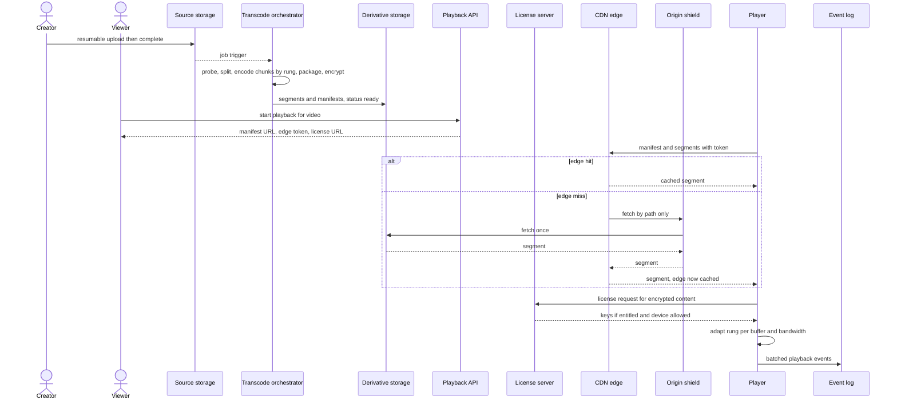

# 016 — Video on Demand: Full System Design Solution

## Goal and contract

A VOD platform lets creators upload a source video once and lets millions of viewers on varying networks and devices stream it smoothly, with entitlement enforced per view. The invariant is not "the video plays" — it is: playback only ever serves pre-validated, pre-transcoded, immutable segments through a <abbr title="Content Delivery Network - A geographically distributed network of proxy servers and their data centers used to deliver content with low latency.">CDN</abbr>, access is gated where the request rate is low (session start and license issue) rather than per segment, and adaptive quality switching happens without a full restart or a buffering cliff on network dips.

The question's numbers are the contract:

- **500,000 hours of video uploaded per day.**
- **200 million daily viewers**, streaming globally.
- **Transcode turnaround p99 under 30 minutes for a 1-hour video** (measured from upload completed to playable, not from upload started, since a creator's uplink can take longer than that alone).
- **Playback start p99 under 2 seconds.**
- Analytics may lag playback by up to 5 minutes.

Transcoding a ladder of 6–8 renditions plus captions, and then serving tens of terabits per second, is not a small extension of "an upload service". One uploaded source file served through application servers to every viewer cannot deliver this: it has no adaptive bitrate, no geographic edge caching, and it puts unbounded egress load on stateful app servers. The platform must convert one source into a set of immutable derivative renditions and manifests, then let a <abbr title="Content Delivery Network - A geographically distributed network of proxy servers and their data centers used to deliver content with low latency.">CDN</abbr> — not the application tier — absorb viewer fan-out. The Estimates section computes how big each of those problems is; the numbers are extreme (an exabyte a year, ~25 Tbps average egress), and the design is what they force.

## Estimates

Everything beyond the question's five constraints is an assumption, labelled as one. Assumptions: average upload 10 minutes; source bitrate 8 Mbps; an H.264 ladder of 6 base rungs (144p, 240p, 360p, 480p, 720p, 1080p) plus 1440p and 2160p for the 10% of sources that are at least 1440p (so 6–8 rungs); encode cost 2 core-seconds per video-second at 1080p (about half real-time per core, a quality-oriented preset), other rungs scaling with pixel count; each viewer watches 60 minutes a day at 3 Mbps average delivered; peak = 2× average; 4-second segments.

- **Upload volume.** 500,000 h × 3,600 = **1.8 billion video-seconds/day** = 20.8k video-seconds arriving per wall-clock second, so the platform must transcode about 20,800× real time on average. At a 10-minute average that is 3M uploads/day (35/s). The question gives hours, so the *seconds of video* is the unit that matters, not the file count. (For scale: YouTube has publicly quoted a figure of roughly 500 hours uploaded per minute, about 720k hours/day, in the same order as this question.)
- **Source ingest.** 1.8B s × 8 Mbps (1 MB/s) = **1.8 PB/day** = 167 Gbps average, ~330 Gbps at peak. So uploads go straight to regional object storage over resumable multipart sessions, never through application servers.
- **Transcode compute.** Pixel cost relative to 1080p: 144p 0.02, 240p 0.05, 360p 0.11, 480p 0.20, 720p 0.44, 1080p 1.0, 1440p 1.78, 2160p 4.0. The base six sum to 1.82 (3.6 core-s per video-second); the two top rungs add 5.78 × 2 = 11.6 core-s for 10% of videos. Average ≈ **4.8 core-seconds per video-second**. Fleet: 20.8k × 4.8 ≈ **100k cores on average, ~200k at 2× peak** (about 3,100 machines of 64 vCPUs). So we need an autoscaled fleet on preemptible capacity with priority lanes; 100k cores is the cost centre of the upload side.
- **One 1-hour video.** 3,600 × (1.82 × 2) = 13k core-seconds for a 1080p source with the base ladder, and 3,600 × 7.6 × 2 = **55k core-seconds** for a 2160p source with all 8 rungs. On one 8-core machine at 80% parallel efficiency that is **34 minutes** and **142 minutes**. Running each rung in parallel only helps a little: the 2160p rung alone is 4,500 s = 75 minutes. Both miss the 30-minute target before queueing or a single retry. So we need chunk-parallel encoding: cut the video into ~30-second chunks and encode every chunk × rung independently.
- **Storage.** Ladder bitrates (assumption, H.264): 0.1, 0.3, 0.7, 1.2, 2.5, 4.5 Mbps for the base six (sum 9.3), plus 9 and 16 Mbps for the top two on 10% of sources (+2.5 average), plus 0.13 Mbps audio ≈ **11.9 Mbps ≈ 1.5 MB per video-second**. Derivatives: 1.8B × 1.5 MB = **2.7 PB/day**, plus the 1.8 PB/day source = 4.5 PB/day. Over a year: **~1 EB of derivatives** and 0.66 EB of sources; erasure-coded at ~1.5× the derivatives alone are ~1.5 EB (3× replication would be 3 EB). So we need erasure-coded object storage, sources moved to a cold tier after a few weeks, and popularity-based deletion of rarely read rungs (re-encoded lazily from the source).
- **Object count.** 1.8B s ÷ 4 s × 6.2 rungs (average) = **2.8B segment objects/day ≈ 32k PUT/s** sustained. So either use an object store built for tens of thousands of writes per second per region or pack each rendition into one file with a segment index and serve segments as byte ranges.
- **Concurrent viewing.** 200M × 3,600 s = 7.2 × 10¹¹ viewer-seconds/day ÷ 86,400 = **8.3M concurrent streams on average, ~17M at peak**. Watch time is 400× upload time (200M watch-hours vs 500k upload-hours).
- **Egress.** 7.2 × 10¹¹ × 3 Mbps = 2.16 × 10¹⁸ bits/day = **270 PB/day = 25 Tbps average, ~50 Tbps peak**, about 150× the source ingest. No origin site produces that; at 100 Gbps per server the peak needs at least 500 fully loaded edge servers before any geographic spread. So the design is a <abbr title="Content Delivery Network - A geographically distributed network of proxy servers and their data centers used to deliver content with low latency.">CDN</abbr> problem: the app tier is never in the bytes path.
- **<abbr title="Content Delivery Network - A geographically distributed network of proxy servers and their data centers used to deliver content with low latency.">CDN</abbr> offload.** Origin egress = (1 − byte hit ratio) × edge egress: at 90% that is 2.5 Tbps average, at 95% 1.25 Tbps, at 99% **250 Gbps** (500 Gbps at peak). Each point of hit ratio is 250 Gbps of origin egress. So we need tiered caching (edge → regional → origin shield) aiming at 98–99% offload, and origin storage replicated to two regions.
- **Edge request rate.** 17M peak streams ÷ 4 s = **4.2M segment requests/s** (8.3M/s with 2-second segments, 2.8M/s with 6-second). So the edge validates access tokens locally; it cannot call an auth service per segment.
- **Auth-path request rate.** Assume 5 plays per viewer per day = 1B starts/day = 11.6k/s average, ~30k/s at a 2.5× release-time peak. Each start makes one playback-session call and one license call. So the entitlement path sees ~30k req/s, about 140× fewer than the edge's 4.2M/s. That is why entitlement lives at session start and license issue.
- **Playback events.** A 30-second heartbeat from 8.3M average streams is 278k events/s (~556k/s at peak), plus start, stall, and quality-switch events: **~0.5–1M events/s at peak**, ~4.8 TB/day for heartbeats at ~200 B each. So the player batches events and beacons them to a partitioned log, and never calls a synchronous service per event.

## <abbr title="Application Programming Interface">API</abbr>

```text
# Creator
POST /v1/uploads          { client_upload_id, title, size_bytes, visibility, geo_policy, drm_policy }
→ 201 { video_id, upload_session_url, chunk_bytes: 8388608 }         # idempotent on client_upload_id
PUT  {upload_session_url}  Content-Range: bytes a-b/total            → 308 (resume from) | 200
POST /v1/videos/{video_id}/complete   { sha256 }
→ 202 { status: "processing" }                                        # idempotent: a second call is 202 or 200
GET  /v1/videos/{video_id}
→ { status: uploaded | processing | ready | failed, progress, renditions_ready: [...] }
                                                                      # plus a video.ready notification

# Viewer
POST /v1/videos/{video_id}/playback-session   { device, client_caps, drm: "widevine" | "fairplay" | "playready" }
→ 200 { manifest_url, edge_token, token_expires_at, license_url }
→ 403 { reason: "geo" | "not_entitled" | "private" }   → 409 { status: "processing" }
GET  https://cdn.example/v/{video_id}/{ladder_version}/master.m3u8     # and .mpd, and segments  (token in cookie or query)
POST {license_url}                                                     # DRM challenge → license with content keys
POST /v1/playback-events   [ {session_id, t, type, rung, ...}, ... ]   → 204   # batched, sendBeacon
```

- **Errors and status.** A video in any state other than `ready` never returns a manifest: the <abbr title="Application Programming Interface">API</abbr> returns 409 `processing` (or 404 for `failed`), so a viewer can never fetch a half-encoded ladder.
- **Token.** `edge_token` is a short-lived signed value (5–10 minutes) scoped to a path prefix (`/v/{video_id}/`), refreshed by the player about a minute before expiry.
- **Idempotency.** Upload creation is idempotent on `client_upload_id`; completion is idempotent on the video; playback events carry a `(session_id, seq)` so the stream job dedupes retries.

## Data model

| Entity | Key and shape | Role | Partitioning |
|---|---|---|---|
| `videos` | `video_id` → `owner_id, visibility, geo_policy, drm_policy, status, duration_s, source_uri, ladder_version, created_at` | **Source of truth** for state and policy | Hash of `video_id` |
| `source object` | `object://src/{video_id}` | **Source of truth** for the bytes; cold tier after a few weeks | Object store |
| `tasks` | `(video_id, ladder_version, chunk, rung)` → `state, attempt, lease_expires_at, output_uri` | Transcode work items; deterministic output path makes a retried task overwrite the same object | Hash of `video_id` |
| `renditions` | `(video_id, ladder_version, rung)` → `codec, bitrate, resolution, segment_count, status` | Derived; drives manifest generation and the "ready" decision | With the video |
| `segments and manifests` | `/v/{video_id}/{ladder_version}/{codec}/{rung}/seg_{n}.m4s`, `master.m3u8`, `manifest.mpd` | **Derived**, immutable, versioned paths, so they never need invalidation | Object store, prefix spread by hashed `video_id` |
| `content keys` | `(video_id, key_group)` → wrapped key | DRM keys in a KMS; the license server unwraps | KMS |
| `playback events` | `(video_id, session_id, seq, type, ts)` | Append-only log; feeds QoE and view counts | Log partitioned by `video_id` (salted for hot videos) |
| `view counters` | `video_id` → `approx_count`, `exact_count` | Derived, two-speed (see view counting) | By `video_id` |

The state machine is `uploaded → processing → ready | failed`, and only `ready` is visible to viewers. **Immutable, versioned paths** are the decision that makes <abbr title="Content Delivery Network - A geographically distributed network of proxy servers and their data centers used to deliver content with low latency.">CDN</abbr> caching safe: to re-encode with a new ladder you write `ladder_version + 1` and flip a pointer in `videos`, rather than overwriting bytes an edge may hold.

## Core mechanisms

| Mechanism | Behavior | Choose it when | Main weakness |
|---|---|---|---|
| Asynchronous transcode pipeline | Source triggers a job graph producing multiple bitrate/resolution renditions plus a manifest (HLS/DASH). | Always, decoupled from upload. | Adds encode lag between upload and "ready to watch." |
| Chunk-parallel encode (split, encode, assemble) | Cut the video at keyframes into ~30 s chunks, encode every chunk × rung as an independent idempotent task, then assemble. | Any video long enough that one machine cannot meet the turnaround target (here, 1 hour vs 30 min). | Rate control and quality must be coordinated across chunk boundaries; many small tasks need a scheduler. |
| Adaptive bitrate manifest | Manifest lists all renditions; player selects and switches based on measured bandwidth/buffer. | Any variable-network audience. | Manifest/segment staleness or bad ladder choices cause visible quality flapping. |
| <abbr title="Content Delivery Network - A geographically distributed network of proxy servers and their data centers used to deliver content with low latency.">CDN</abbr> edge delivery of segments | Immutable segment objects and manifests served from edge, origin only on cache miss. | Always, for scale beyond a handful of viewers. | Requires origin shielding or a cache stampede hits origin on every cold region. |
| Signed edge token (URL or cookie) | A short-lived signature scoped to a path prefix, validated at the edge and excluded from the cache key. | Any content with access control that must still cache once for all viewers. | A valid token can be shared until it expires; it stops casual hotlinking, not a determined member. |
| DRM (encrypted segments + license server) | Segments are encrypted once (CENC); a license server releases keys per entitlement and device. | Premium or licensed content, where a leaked URL must be worthless. | A license dependency on every playback start; per-platform integration. |
| Asynchronous playback analytics | Player emits buffering/start-time/quality events to a queue, aggregated off the hot path. | Always. | Analytics lag means live dashboards trail real behavior by seconds to minutes. |

## Architecture and data flow



**One upload, end to end.** The client opens an upload session (`POST /v1/uploads`) and streams 8 MB chunks straight to regional object storage over a resumable protocol; `complete` verifies the checksum, flips the state to `processing`, and enqueues a job. The orchestrator probes and validates the file in a sandbox, splits it, fans out encode tasks, assembles and encrypts the output, runs a QC pass, writes the manifests, and only then sets `status = ready` and notifies the creator. Every step is idempotent: task outputs have deterministic paths, so a retry rewrites the same object.

**One playback, end to end.** `POST /v1/videos/{id}/playback-session` checks visibility, geo, and entitlement, then returns the manifest URL, an edge token, and the license URL. The player fetches the manifest from the <abbr title="Content Delivery Network - A geographically distributed network of proxy servers and their data centers used to deliver content with low latency.">CDN</abbr>, which validates the token at the edge and serves from cache (or fetches once through the shield). It starts on a conservative rung, requests the license in parallel with the first segment, and adapts upward. Playback events are batched to the log without touching the playback path.

The hard decision is making encode state explicit and asynchronous rather than trying to serve the raw upload while transcoding "catches up." A video is not playable until its ladder reaches a ready state; the <abbr title="Application Programming Interface">API</abbr> must expose that state rather than let a viewer hit a half-encoded asset. This trades immediate availability (creator uploads, viewer waits minutes before it's watchable) for the ability to serve at global <abbr title="Content Delivery Network - A geographically distributed network of proxy servers and their data centers used to deliver content with low latency.">CDN</abbr> scale afterward. The second hard decision is *where access is enforced*. Segment objects are immutable and cacheable at any edge, and a cache hit never reaches the origin, so you cannot re-check entitlement per segment against a service. Authorization therefore happens once, at session start and at license issue, where the request rate is ~140× lower, and it is *carried* to the edge as a path-scoped token that is validated locally and kept out of the cache key. For content that must stay protected even if a URL leaks, the real gate is DRM, discussed below.

## Chunk-parallel transcoding

**The problem.** The Estimates section showed one 1-hour video is 13k–55k core-seconds. A single machine finishes in 34–142 minutes, and even parallelising only across rungs leaves the top rung at 75 minutes.

| Approach | Wall time for the worst case (1-hour 2160p, all 8 rungs) | Cost |
|---|---|---|
| Whole video on one machine | ~142 min on 8 cores | Simple; misses the target |
| One job per rung (rung-parallel) | Slowest rung ≈ 75 min | 8-way parallel; still misses |
| **Chunk-parallel × rung-parallel** | Longest task ≈ 240 core-s for a 30 s chunk of 2160p ÷ 8 cores ≈ **38 s** | ~110 chunks × 8 rungs ≈ 900 tasks; boundary coordination |

**Design.** Probe and validate the source, then **split at keyframe (or scene-cut) boundaries into ~30-second chunks** aligned to whole segments (8 × 4 s = 32 s). Encode every chunk × rung as an independent task that starts with an IDR frame and writes CMAF segments directly to its final path. "Stitching" is then not a re-encode: it is assembling the manifest over the already-segmented output and verifying that timestamps and segment numbering are contiguous across chunk boundaries.

```arch
%% caption: One video fans out into chunk-by-rung tasks that run in parallel and join at packaging, so wall time is set by the slowest task rather than the total work.
node up "Upload complete" at 1,0 shape=pill
node probe "Probe and validate" at 1,1 icon=shield sub="sandboxed workers"
node split "Split at keyframes" at 1,2 icon=video sub="about 32 s chunks"
node aud "Audio and captions" at 3,2 icon=music
group enc "Parallel encode tasks" color=orange icon=worker
node t1 "Encode chunk 1" at 0,3 in enc icon=worker sub="rungs 1 to 8"
node t2 "Encode chunk 2" at 1,3 in enc icon=worker sub="rungs 1 to 8"
node tn "Encode chunk N" at 2,3 in enc icon=worker sub="rungs 1 to 8"
node pkg "Assemble, encrypt, write manifests" at 1,4 icon=package
node qc "QC sample decode" at 1,5 icon=check sub="and quality check"
node pub "Publish ready" at 1,6 icon=notify sub="notify creator"
up -> probe -> split
split -> t1
split -> t2
split -> tn
probe:R -> aud:T
t1 -> pkg
t2 -> pkg
tn -> pkg
aud:B -> pkg:R
pkg -> qc -> pub
```

- **Rate control across chunks.** Independent chunks can drift in quality and bitrate. A fast first pass (a low-resolution complexity scan of the whole video) sets each chunk's target, and each chunk uses constrained quality (capped CRF with a max rate and buffer size), so buffer constraints hold at boundaries. The price is a small efficiency loss from closed GOPs at every chunk start; measure it, and it is worth it.
- **Chunk length.** Shorter chunks raise parallelism and lower straggler cost but add per-task startup (loading the decoder, ~1–2 s) and more boundaries; ~30 s keeps overhead under ~10% of the work.
- **Stragglers and failures.** Tasks are idempotent and short, so run them on preemptible machines, retry up to 3 times, and launch a speculative duplicate of any task running longer than 2× the median (the backup-task idea from MapReduce). A chunk that fails all attempts or a source that crashes a worker is quarantined and the video marked `failed`, not published with a hole.
- **Latency budget** (p99, 1-hour video): finalize and checksum 1 min, probe and split 2, **queue wait 10**, encode wall time 2 (the longest task plus one straggler retry), assemble, encrypt, and package 3, QC 3, publish 1 = **22 minutes**, leaving 8 minutes of slack against the 30-minute target.
- **Keeping the queue wait at 10 minutes.** Peak needs ~200k cores. Give the <abbr title="Service Level Objective - A specific target level for the reliability of a service, usually defined by a numerical goal for a metric.">SLO</abbr> lane (the ladder needed for the 30-minute promise) capacity for the peak, and put everything else in lower lanes that can be preempted: extra rungs on huge sources, per-title re-encodes, newer-codec re-encodes, and back-fills. Cap concurrent tasks per video so one 20 GB upload cannot starve the lane. Progressive publish (making the 360p to 720p rungs playable first) improves time-to-watchable without changing the <abbr title="Service Level Objective - A specific target level for the reliability of a service, usually defined by a numerical goal for a metric.">SLO</abbr>.
- **Hardware.** At 100k cores the encode cost is large enough that specialised hardware pays off; Google described custom video-transcoding ASICs ("VCU") for YouTube at ASPLOS 2021. Treat that as the build-versus-buy lever at scale, not day-one design.

## Adaptive ladder, per-title encoding, and segment length

**Ladder.** Rungs are spaced so each step is a visible quality change at a bitrate the player can judge from throughput and buffer: 144p at 0.1 Mbps up to 1080p at 4.5 Mbps here. The player picks a rung from measured throughput and buffer level (buffer-based rate adaptation was studied at scale by Huang et al., SIGCOMM 2014) and only switches at segment boundaries. Track per-rung play-share: a rung nobody selects is wasted storage, and a rung everyone lives on is the one to tune.

**Fixed versus per-title ladder.** A fixed ladder wastes bits on simple content (a cartoon does not need 4.5 Mbps at 1080p) and starves complex content. Per-title encoding (Netflix Tech Blog, 2015) runs trial encodes of a title, plots quality against bitrate, and picks rungs on the resulting convex hull; per-shot optimisation (Netflix's Dynamic Optimizer, 2018) does the same per shot. The cost is many trial encodes per title. A 10-minute video watched once moves ~225 MB (600 s × 3 Mbps); the same video watched 1M times moves 225 TB, so a 20% saving is 45 TB, against about 5 core-hours of trial encodes (30 trials × 600 s × ~1 core-s, assumption). **Decision: a cheap fixed ladder at upload for everything, and a per-title re-encode only for videos that cross a view threshold**, calibrated from your egress cost per GB against compute cost per core-hour. It concentrates the extra compute on the head, where the bytes are.

**Segment length.**

| Segment | Peak edge requests | First segment at 360p (0.7 Mbps) | Effect |
|---|---|---|---|
| 2 s | 8.3M/s | 175 KB | Fastest start and ABR reaction; most requests, biggest manifests, and a keyframe every 2 s costs compression |
| **4 s** | **4.2M/s** | **350 KB** | Balanced |
| 6 s | 2.8M/s | 525 KB | Fewest requests and best compression; slower start and slower reaction to bandwidth drops (Apple's HLS authoring guidance has historically suggested about 6 s) |

**Decision: 4-second CMAF segments, one set serving both HLS and DASH with different manifests.** It halves the request rate of 2-second segments at the cost of a slower ABR reaction, acceptable because startup is protected by starting on a low rung, not by tiny segments.

**Startup budget for p99 < 2 s** (from pressing play, assumptions):

| Step | Budget |
|---|---|
| Playback <abbr title="Application Programming Interface"><abbr title="Application Programming Interface - A set of rules and protocols that allows different software applications to communicate with each other.">API</abbr></abbr>: entitlement and manifest URL | 150 ms |
| <abbr title="Domain Name System - A hierarchical and decentralized naming system for computers, services, or other resources connected to the Internet.">DNS</abbr> plus <abbr title="Transport Layer Security - A cryptographic protocol designed to provide communications security over a computer network.">TLS</abbr>/QUIC connection to the edge | 300 ms |
| Manifest fetch (edge hit) | 100 ms |
| First segment (~350 KB on a low rung) in parallel with the DRM license request (~300 ms) | 600 ms |
| Decode and first frame | 200 ms |
| **Total** | **1,350 ms** |

That leaves ~650 ms for the p99 tail: an edge miss that goes to the shield, a slow connection, or a cold license server. **Quality of experience (QoE) metrics** to measure and alert on: time to first frame, video start failure rate, exit-before-video-start rate, rebuffer ratio (stalled time ÷ watch time) and stalls per hour, average delivered bitrate or VMAF and time at the top rung, and bitrate-switch rate (a flapping ladder). Slice every one by <abbr title="Content Delivery Network - A geographically distributed network of proxy servers and their data centers used to deliver content with low latency.">CDN</abbr>, ISP, device, and country.

## Access control: signed tokens, DRM, and cacheable segments

The earlier question is where entitlement is checked, given that a cache hit never reaches your servers. The answer is three layers, each doing a different job:

1. **Authorization at session start.** The playback <abbr title="Application Programming Interface">API</abbr> checks visibility (public, unlisted, private, subscriber-only), geo policy, and account entitlement. This is the only place business rules run, at ~30k req/s.
2. **Edge access control by token.** The <abbr title="Application Programming Interface">API</abbr> returns a signed token scoped to the video's path prefix (a signed URL, or a signed cookie so relative segment URLs in the manifest need no rewriting) with a 5–10 minute lifetime. The <abbr title="Content Delivery Network - A geographically distributed network of proxy servers and their data centers used to deliver content with low latency.">CDN</abbr> validates the signature and expiry locally and — critically — **the token is excluded from the cache key**, so every viewer shares one cached copy of each segment. CDNs such as CloudFront document signed cookies and signed URLs for exactly this (including path-wildcard policies for HLS/DASH segment sets); check that your <abbr title="Content Delivery Network - A geographically distributed network of proxy servers and their data centers used to deliver content with low latency.">CDN</abbr> does not vary the cache by the signature. If the token were part of the key, every viewer would miss and the origin would face the full 25 Tbps.
3. **DRM for premium content.** Segments are encrypted once at packaging with Common Encryption (CENC, ISO/IEC 23001-7); with CMAF and the `cbcs` scheme, one encrypted copy can serve Widevine, FairPlay, and PlayReady on current devices, with a different license per system. A **license server** releases the content key only after checking entitlement and device (for example, allowing HD and UHD only on hardware-backed security such as Widevine L1), and returns a time-limited license. Now the *segments can stay publicly cacheable*: a leaked or shared URL yields ciphertext.

| Content class | Gate | Edge control | Segment protection |
|---|---|---|---|
| Public | None (geo at most) | None | None |
| Unlisted | 128-bit unguessable `video_id` (a capability URL) | Optional | None |
| Private or subscriber-only UGC | ACL and subscription check | Path-scoped token | Optional AES-128 or CENC |
| Premium licensed | Entitlement, geo, device | Path-scoped token | **DRM required** |

**Decision: token at the edge for everything restricted, DRM only where a leaked URL is unacceptable.** It keeps the edge free of per-segment auth calls and the cache key clean, at the cost of a license-server dependency on premium starts and per-platform DRM integration. That cost is acceptable because a license request happens once per playback start (~30k/s at peak), not once per segment (4.2M/s). Entitlement changes then take effect at the next token refresh (5–10 minutes) or license renewal, which is the staleness you state; for an immediate takedown, purge the manifests at the <abbr title="Content Delivery Network - A geographically distributed network of proxy servers and their data centers used to deliver content with low latency.">CDN</abbr> and revoke at license renewal (see [CDN and streaming media](../building_blocks/29_cdn_and_streaming_media.md) and [Security](../building_blocks/14_security.md)).

## Capacity and storage

With 500,000 hours a day and a 6–8 rung ladder, transcode output is roughly 1.5× the source volume (2.7 PB/day of derivatives against 1.8 PB/day of source), and the original is often retained for re-encode. Viewer traffic dominates: 25 Tbps average, and a new release or a semi-viral video can produce millions of concurrent segment fetches, which is why origin must be shielded — a naive <abbr title="Content Delivery Network - A geographically distributed network of proxy servers and their data centers used to deliver content with low latency.">CDN</abbr> miss storm on a newly popular video can otherwise take origin down exactly when demand peaks. Do not serve the original source object directly to viewers "to save encode time" — it has no adaptive ladder, no <abbr title="Content Delivery Network - A geographically distributed network of proxy servers and their data centers used to deliver content with low latency.">CDN</abbr>-friendly immutable segmenting, and defeats bandwidth-based quality switching entirely.

Partition transcode work by job queue with priority (e.g., paid-tier or licensed content ahead of user-generated backlog), and cap concurrent jobs per source to bound worst-case encode cost for a single huge upload. For global reach, place derivative storage regionally and let <abbr title="Content Delivery Network - A geographically distributed network of proxy servers and their data centers used to deliver content with low latency.">CDN</abbr> pull-through cache from the nearest regional origin, rather than every edge reaching back to one origin region — that turns each new market's cold-cache traffic into cross-continent origin latency and cost.

**Storage tiering.** The long tail dominates a UGC catalogue: most videos are watched a handful of times. Keep every rung for a video's first weeks, then delete the rarely read top rungs and re-encode from the source on demand, and move sources to a cold tier. At ~1 EB a year of derivatives, tiering is what turns a linear cost into a sublinear one; measure the per-rung read rate before deciding.

## UGC catalogue versus licensed catalogue

The same building blocks solve two different problems. The difference is whether demand is predictable.

| | UGC (YouTube-style) | Licensed catalogue (Netflix-style) |
|---|---|---|
| Catalogue | Hundreds of millions of items, new ones every second, huge long tail | Thousands of titles, known in advance |
| Demand | Unpredictable, virality is a surprise | Predictable from release calendar and regional viewing history |
| Encode | Light per video, enormous in total (100k cores) | Heavy per title (per-title or per-shot), once, because each title is streamed many millions of times |
| Cache fill | Reactive: pull-through on a miss, tiered caches | **Proactive: push popular titles ahead of demand** |
| Cache location | <abbr title="Content Delivery Network - A geographically distributed network of proxy servers and their data centers used to deliver content with low latency.">CDN</abbr> points of presence, multi-<abbr title="Content Delivery Network - A geographically distributed network of proxy servers and their data centers used to deliver content with low latency.">CDN</abbr> | Appliances inside ISP networks and at internet exchanges |
| Entitlement | Mostly public or unlisted, DRM for paid | DRM throughout |

The documented Netflix design, from its *Open Connect Overview*: Open Connect appliances are provided free to qualifying ISPs and are embedded in ISP networks or placed at internet exchanges; Netflix describes the design as a "proactive, directed caching solution" rather than a demand-driven <abbr title="Content Delivery Network - A geographically distributed network of proxy servers and their data centers used to deliver content with low latency.">CDN</abbr>. The control plane (in AWS) collects each appliance's health, routes, and stored files, steers clients to the best appliance via URL, and controls fill. Because Netflix can "predict with high accuracy what our members will watch and what time of day they will watch it", it deploys most content and software updates during configurable off-peak fill windows (nightly), and appliances can also fill from each other to save backbone capacity. The playback service checks authorization and licensing first, then hands the client the appliance URLs, which is the same "authorize at session start, deliver by URL" split as above.

Rough arithmetic (assumptions: 10k titles, ~11 GB per title for one codec's full ladder from the ladder sum above, 20 new titles/day, a 10 Gbps fill link): one codec of the whole catalogue is ~110 TB, a **one-time fill of about a day** (110 TB × 8 ÷ 10 Gbps ≈ 88,000 s), and each night's new titles are ~220 GB, about **3 minutes**. So a scheduled fill is a small, bounded job, which is exactly why predictable demand beats reactive caching: the cache is warm *before* the premiere. UGC cannot do this, so it leans on tiered caches and an origin shield and accepts a colder tail. See [CDN and streaming media](../building_blocks/29_cdn_and_streaming_media.md) and [Content delivery network](036_content_delivery_network_solution.md).

## Failure and abuse behavior

| Case | Correct behavior |
|---|---|
| Transcode job fails partway | Retry with backoff up to a bounded attempt count; mark the video failed and notify the creator rather than exposing a partial ladder. Tasks are idempotent, so a retried chunk overwrites the same object. |
| Viewer requests a video still transcoding | Return "processing" status explicitly; never serve a manifest referencing renditions that don't exist yet. |
| Transcode backlog after an upload surge | Admission stays open; the <abbr title="Service Level Objective - A specific target level for the reliability of a service, usually defined by a numerical goal for a metric.">SLO</abbr> lane keeps its reserved capacity and lower lanes are preempted; alert when queue wait p99 exceeds 10 minutes. |
| <abbr title="Content Delivery Network - A geographically distributed network of proxy servers and their data centers used to deliver content with low latency.">CDN</abbr> cache miss storm on newly popular video | Origin shielding coalesces concurrent misses for the same segment into one origin fetch; pre-warm known premieres. |
| Entitlement token expires mid-playback | Player refreshes the token transparently about a minute before expiry; mid-segment fetches already in flight are not interrupted. |
| Unauthorized hotlinking of segment URLs | Path-scoped, short-lived tokens validated at the edge; for premium content the segments are encrypted so a leaked URL is worthless without a license. |
| License server slow or down | Players that already hold a license keep playing until it expires (set durations longer than a typical session); new premium starts fail fast with a clear error; run the license service active-active across regions. |
| Malicious/malformed source upload | Validate container/codec before queuing transcode; run probe and decode in sandboxed workers with no network; reject or quarantine before it can crash or stall pipeline workers. |
| One <abbr title="Content Delivery Network - A geographically distributed network of proxy servers and their data centers used to deliver content with low latency.">CDN</abbr> degrades or fails | Steer a share of sessions to a second <abbr title="Content Delivery Network - A geographically distributed network of proxy servers and their data centers used to deliver content with low latency.">CDN</abbr> by health and ISP (see [CDN and streaming media](../building_blocks/29_cdn_and_streaming_media.md)); origin shield capacity must cover the failover. |
| Regional outage of derivative storage | Derivatives are replicated to a second region; the shield fails over; new uploads route to another region. |
| Bad deploy of the encoder or packager | Canary on ~1% of uploads and compare QC and VMAF before promotion; output is versioned (`ladder_version`), so rollback is a pointer flip, and bad output is never overwritten in place. |
| Analytics event burst from a viral video | Analytics path is asynchronous and independently scalable; a spike there must not affect playback latency. |

## View counting at scale

A view counter looks trivial (`views += 1`) and is one of the classic YouTube-style deep dives, because it is a high-volume, fraud-prone, eventually consistent aggregation.

```text
player heartbeats (start, 30s-watched, progress) ─► ingestion API (validate, rate-limit)
        │
        ▼
event log partitioned by video_id (salted for hot videos)
        │
        ├─► stream job: dedupe by (session_id, video_id), apply "valid view" rules,
        │   windowed counts per video per minute ─► real-time counter store ─► displayed count
        │
        └─► raw events to data lake ─► daily batch: fraud models, exact recount
                                         ─► reconciled count overwrites real-time estimate
```

- **Define a view:** not a page load. Typical rules: playback actually started, watched past a minimum threshold, counted once per session within a window, from a non-bot client. The rule lives in one versioned place.
- **Don't write a row per view** to the video's record: a viral video would become a single hot row. Aggregate in the stream job and write per-minute increments.
- **Hot keys:** a video getting millions of views/minute overloads one partition. Salt the partition key (`video_id#0..N`) and sum the shards when reading. See [Partitioning and hot keys](../building_blocks/25_partitioning_and_hot_keys.md).
- **Two numbers:** a fast, approximate real-time count (stream) and an exact, fraud-filtered count (batch). The batch result reconciles the real-time one (a Lambda-style split; with a single replayable stream pipeline you get Kappa). Keep the displayed count monotonic unless fraud removal requires a correction.
- **Fraud:** rate limits per <abbr title="Internet Protocol. The principal communications protocol in the Internet protocol suite for relaying datagrams across network boundaries.">IP</abbr>/device/account, bot detection, and anomaly detection on sudden spikes; suspicious views are held back from the public count until verified.
- **Exactly-once effect:** stream processors with checkpointed state and idempotent sinks (or transactional sinks) avoid double-counting on worker restart. See [Batch and stream processing](../building_blocks/21_batch_and_stream_processing.md).
- **Unique viewers** per video/day: HyperLogLog per video, mergeable across partitions and days ([Specialized data structures](../building_blocks/20_specialized_data_structures.md)).

## Thumbnails and preview storyboards

- **Candidates:** the transcode <abbr title="Directed Acyclic Graph. A directed graph with no directed cycles, consisting of vertices and edges where each edge is directed from one vertex to another.">DAG</abbr> extracts candidate frames (e.g., one every few seconds or at scene changes), scores them for quality (sharpness, faces, not black or blurred), and proposes a few; creators can upload a custom thumbnail.
- **Variants:** each thumbnail is rendered at several sizes and formats (JPEG/WebP/AVIF) under immutable versioned keys, exactly like the photo pipeline ([Photo pipeline](005_photo_pipeline_solution.md)). Custom thumbnails pass the same safety scanning as uploads.
- **Scrubbing previews:** sprite sheets ("storyboards") pack many small frames into one image per N seconds of video so the player downloads a handful of images, not hundreds.
- **Experimentation:** A/B test thumbnails by assigning viewers deterministically to variants and measuring click-through and watch time; this is where the analytics pipeline feeds product decisions.
- **Caching:** thumbnails are the highest-volume, smallest objects on the page (every search result and recommendation shows several), so they need the highest <abbr title="Content Delivery Network - A geographically distributed network of proxy servers and their data centers used to deliver content with low latency.">CDN</abbr> hit ratio of anything in the system.

## Observability and interview close

Measure the QoE set above (time to first frame p50/p95/p99, start failure rate, rebuffer ratio, average bitrate, switch rate), transcode lag from upload-complete to ready (p99 against the 30-minute target) and failure rate, queue wait per lane, <abbr title="Content Delivery Network - A geographically distributed network of proxy servers and their data centers used to deliver content with low latency.">CDN</abbr> byte hit ratio and origin/shield egress (each point is ~250 Gbps), entitlement-denial rate, license latency and error rate, and per-rung play-share (to catch a bad ladder step nobody selects).

**The one paging alert:** playback start failure rate above 0.5% of starts over 5 minutes (sliced by <abbr title="Content Delivery Network - A geographically distributed network of proxy servers and their data centers used to deliver content with low latency.">CDN</abbr> and ISP), because it is the user-visible symptom of every upstream failure. Transcode <abbr title="Service Level Objective - A specific target level for the reliability of a service, usually defined by a numerical goal for a metric.">SLO</abbr> breaches, hit-ratio drops, entitlement-denial spikes (a token bug or scraping), and rebuffer drift are tickets unless they coincide with it.

Trade-off to state: "I treat upload and playback as two systems joined by an async, chunk-parallel transcode pipeline with an explicit ready state, because one machine cannot meet a 30-minute turnaround for a 1-hour video and serving a half-encoded ladder either breaks adaptive streaming or overloads app servers. Access is decided once, at session start and license issue, and carried to the edge as a path-scoped token kept out of the cache key, with DRM for premium content, so segment delivery stays purely a <abbr title="Content Delivery Network - A geographically distributed network of proxy servers and their data centers used to deliver content with low latency.">CDN</abbr> caching problem at ~25 Tbps; the cost is that a shared token stays valid until it expires, which I accept for non-premium content and remove with encryption for premium."

## Follow-ups the interviewer will ask

1. **"How does this work across regions?"** Derivatives are written to the region nearest the creator and replicated to at least one more; the <abbr title="Content Delivery Network - A geographically distributed network of proxy servers and their data centers used to deliver content with low latency.">CDN</abbr> pulls from the nearest healthy origin through a shield. The playback <abbr title="Application Programming Interface">API</abbr> and license server run active-active in every region, and the video row is replicated with the creator's home region as writer. Cross-region replication lag delays the "ready" flip in remote regions, not local playback.
2. **"What changes at 10× and 100× scale?"** At 10×, egress is 250 Tbps average, more than commercial <abbr title="Content Delivery Network - A geographically distributed network of proxy servers and their data centers used to deliver content with low latency.">CDN</abbr> capacity can carry economically, so you push caches into ISP networks (the Open Connect model) and negotiate multi-<abbr title="Content Delivery Network - A geographically distributed network of proxy servers and their data centers used to deliver content with low latency.">CDN</abbr>. Encode compute grows to ~1M cores, which is where hardware encoders and per-title-only-on-the-head economics become mandatory, and storage of ~10 EB a year forces aggressive tail deletion and lazy re-encode.
3. **"What if revocation must be immediate, for a takedown or a refund?"** Immutable, cached segments cannot be recalled, so the gate has to sit somewhere that can change: shorten token lifetime (bounds exposure to minutes), purge manifests at the <abbr title="Content Delivery Network - A geographically distributed network of proxy servers and their data centers used to deliver content with low latency.">CDN</abbr>, deny at the next license renewal, and for premium content rely on DRM so revoked users hold only ciphertext. State the exposure window explicitly rather than promising instant.
4. **"What dominates cost, and what are the knobs?"** Egress (270 PB/day) first, then storage (~1 EB/year), then compute (~100k cores). Knobs: <abbr title="Content Delivery Network - A geographically distributed network of proxy servers and their data centers used to deliver content with low latency.">CDN</abbr> offload (each point is 250 Gbps), per-title encoding and newer codecs on the head only, dropping cold rungs, cheaper segment-packed storage, and ISP-embedded caches.
5. **"How do you defend against abuse?"** Upload abuse: per-account rate and duration limits, sandboxed decoding (codec bugs are a real attack surface), and content-matching before publish. Playback abuse: path-scoped short tokens, per-session rate limits, DRM for premium content. View fraud: dedupe and bot filtering before the public count.
6. **"Why not transcode just in time and skip pre-encoding the tail?"** The long tail is rarely watched, so encoding all rungs up front is wasteful, but a just-in-time transcode cannot fit a 2-second start budget. The hybrid is to pre-encode a small watchable ladder (say 360p and 720p) at upload and generate the rest lazily when demand appears, which cuts compute and storage at the cost of a slower first watch at a higher rung and a more complex pipeline.
7. **"How would Netflix's design differ from YouTube's?"** Predictable, small, licensed catalogue, so it pre-positions popular titles onto appliances embedded in ISP networks during off-peak fill windows and encodes each title heavily once; a UGC platform cannot predict virality, so it relies on reactive tiered caching and light per-upload encoding. See the comparison above; the cache fill strategy, not the codec, is the biggest difference.
8. **"What if the interviewer says just check entitlement on every segment, it is simpler?"** Show the arithmetic: 4.2M segment requests/s at peak against an auth service would be a 4M req/s dependency on the critical path of every playback, and you would lose edge caching for every request that needs it. I would concede for a tiny catalogue, where a per-request check at the origin is fine; at this scale the check moves to session start and license issue.

## Common mistakes

1. **Assuming an upload count instead of deriving from hours.** 500k hours is 1.8B video-seconds a day; compute in core-seconds per video-second, then get the file count from an assumed duration.
2. **Encoding a video on one machine, or only parallelising per rung.** A 1-hour source takes 34–142 minutes on 8 cores and the top rung alone takes 75; chunk-parallel encoding is what makes 30 minutes possible.
3. **Storing every rung of every video forever.** That is ~1 EB a year. Tier by popularity, delete cold top rungs, keep sources cold, and re-encode lazily.
4. **Claiming entitlement is "checked once at the manifest" and segments are protected.** A cached segment never reaches the origin, so a leaked URL or cookie works until it expires. Use a short, path-scoped edge token for restricted content and DRM where leakage is unacceptable.
5. **Putting the token in the <abbr title="Content Delivery Network - A geographically distributed network of proxy servers and their data centers used to deliver content with low latency.">CDN</abbr> cache key.** Every viewer becomes a unique key, hit ratio collapses, and the origin faces tens of Tbps. Validate the token at the edge and key on the path only.
6. **Serving the raw upload while transcoding "catches up."** It has no ladder and defeats adaptive streaming; expose an explicit ready state.
7. **Counting views synchronously in the video row.** A viral video makes it a single hot row; aggregate in a stream job and reconcile with a batch count.
8. **Fixing the ladder once and never measuring it.** Watch per-rung play-share and QoE; move the head to per-title encoding when the byte savings exceed the compute cost.

## Going from L5 to L6

- **Migration path.** Version everything (`ladder_version`, immutable paths) so a new ladder or codec is a background re-encode of the head first, then a pointer flip per video, with the old version kept until traffic moves. Roll the encoder itself out behind a canary that compares QC and VMAF.
- **Cost model.** Three cost centres in order: egress (270 PB/day), storage (~1 EB/year), compute (~100k cores). Express each lever (offload point, per-title threshold, tail deletion, codec change) in dollars per view-hour and stop where the marginal saving falls below the marginal complexity.
- **Ownership and blast radius.** Split ingest and transcode, playback control (<abbr title="Application Programming Interface">API</abbr>, tokens, license), and delivery (<abbr title="Content Delivery Network - A geographically distributed network of proxy servers and their data centers used to deliver content with low latency.">CDN</abbr>, origin) into separately owned services with their own SLOs and capacity. Playback control must keep running when transcode is backlogged, and the transcode <abbr title="Service Level Objective - A specific target level for the reliability of a service, usually defined by a numerical goal for a metric.">SLO</abbr> lane must keep running when the low lanes are preempted.
- **Build versus buy.** Buy commercial <abbr title="Content Delivery Network - A geographically distributed network of proxy servers and their data centers used to deliver content with low latency.">CDN</abbr> and multi-DRM early; use managed transcoding or open-source encoders until the bill justifies specialised hardware and your own caches (the Open Connect route). Build the packaging pipeline, the entitlement model, and the QoE analytics, which are what differentiate the product.
- **Phased evolution.** Single fixed ladder, one <abbr title="Content Delivery Network - A geographically distributed network of proxy servers and their data centers used to deliver content with low latency.">CDN</abbr>, and AES-128 tokens first; then per-title re-encode for the head; then DRM for premium content; then multi-<abbr title="Content Delivery Network - A geographically distributed network of proxy servers and their data centers used to deliver content with low latency.">CDN</abbr> steering; then ISP-embedded caches once a region's traffic justifies them.
- **What to measure first.** The views-per-video distribution (how much of the 270 PB/day the top 1% drives) and per-rung read rate. Without the popularity curve, every cost lever above is a guess.

## Build exercise

Implement a conceptual pipeline that takes one source file reference, splits it into N synthetic chunks, "encodes" each chunk into two synthetic renditions as idempotent tasks, assembles a manifest listing them with explicit ready/pending state, and issues edge tokens that a mock <abbr title="Content Delivery Network - A geographically distributed network of proxy servers and their data centers used to deliver content with low latency.">CDN</abbr> validates. Named assertions:

- `test_pending_video_refused_and_ready_returns_manifest`: a playback request against a `processing` video returns 409, and one against `ready` returns a valid manifest.
- `test_task_retry_is_idempotent`: run a chunk task twice and assert one output object with identical bytes.
- `test_manifest_lists_only_completed_rungs`: fail one chunk permanently and assert the video ends `failed` with no manifest published.
- `test_segments_contiguous_across_chunks`: assert segment numbers and timestamps are gap-free at every chunk boundary.
- `test_token_excluded_from_cache_key`: two different valid tokens for the same segment produce one cache entry (one origin fetch).
- `test_expired_or_out_of_scope_token_rejected`: an expired token, or one scoped to another `video_id`, returns 403.
- `test_view_count_dedupes_retries`: replay the same `(session_id, seq)` events and assert the counter does not double-count.
