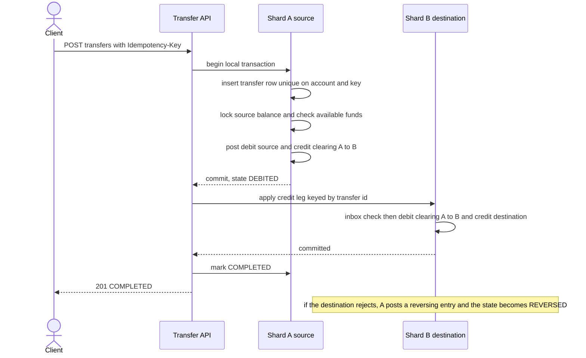

# 017 — Payment Ledger: Full System Design Solution

## Goal and contract

A payment ledger records money movement between accounts with financial-grade correctness: every transfer either fully posts as a balanced set of entries or does not post at all, and history is never edited. The invariant is not "the balance field is right" — it is: the immutable double-entry journal is the record of truth, balances are a derived projection of that journal, and any correction is a new reversing entry, never a mutation of a past one.

The question's numbers are the contract:

- **20,000 transfers/s at peak** across **500 million accounts**, amounts in fixed-point minor units (integers, never floating point).
- **Transfer p99 under 200 ms** end to end.
- **Zero tolerance for double-applied or lost transfers**; entries retained indefinitely.
- **Reconciliation completes within 1 hour of end-of-day close.**
- Account balances are queryable with strong consistency; external settlement events (a bank correction, for example) can be applied after the fact.

Each transfer posts at least two journal lines — a debit and a credit of equal magnitude — in a single atomic local transaction. `balance` is not "the truth with history as a nice-to-have log"; a mutable balance-only design loses the audit trail needed for disputes, regulatory reporting, and reconstructing state after a bug, so it is never acceptable as the sole financial record here.

What is promised: a transfer is exactly-once (a retry returns the original result), never overdraws past the account's floor, and the books always balance. What is *not* promised: that every observer sees both legs of a cross-shard transfer at the same instant. The one hard decision is how a transfer between accounts on two different shards stays all-or-nothing without locking both accounts across a distributed protocol; the answer below is two local double-entry transactions joined by clearing accounts, with reversal as the compensation.

## Estimates

Assumptions beyond the question are labelled: peak is 3× the daily average; a transfer averages 2.5 journal lines (most are 2; some carry a fee line); an entry row is ~200 B with its indexes and a transaction header ~150 B; a shard commits ~2,500 local transactions/s with synchronous replicas; a row-lock is held ~3 ms per update (the commit plus replica acknowledgement).

- **Rate.** Average = 20k ÷ 3 ≈ 6.7k transfers/s ≈ **576M transfers/day**. Journal lines: 20k × 2.5 = **50k lines/s at peak**, ~17k/s average, **1.44B lines/day**. So the journal is append-only and write-heavy; the design should never update or delete it.
- **Journal size.** 1.44B × 200 B = 288 GB/day of lines, plus 576M × 150 B = 86 GB/day of transaction headers ≈ **375 GB/day ≈ 137 TB/year** raw, ~410 TB/year with three replicas. Retained indefinitely, that is ~1.4 PB raw after 10 years. So we need a time-partitioned journal with a hot tier (last ~90 days ≈ 34 TB) and older partitions moved to immutable columnar storage.
- **Balance table.** 500M accounts × ~100 B × 1.2 (some accounts hold more than one currency) = **60 GB**, ~180 GB replicated. So balances are small enough to keep hot in memory or on fast SSD; the journal, not the balance table, is the large object.
- **Shards.** A cross-shard transfer is two local transactions (one per leg), so 20k transfers/s = **40k leg-transactions/s**. At ~2,500 per shard that is a minimum of 16 shards. Take **64 shards**: 625 legs/s and ~780 lines/s per shard (25% utilisation, room for skew and failover), 7.8M accounts and ~5.9 GB/day of journal per shard. So we shard by account.
- **How many transfers cross shards.** If the two accounts are effectively random, the chance both are on the same shard is 1/64, so **~98% of transfers are cross-shard**. Cross-shard is the common path, not the exception. So it must be designed to be cheap.
- **Per-account limit.** A row locked for ~3 ms per update sustains at most 1 ÷ 0.003 ≈ **333 updates/s per account**. A fee or settlement account touched by every transfer would need 20,000/s: **60× over the limit**. A large merchant receiving 2,000 payments/s is 6× over. So hot accounts cannot be single rows.
- **Latency budget (p99, assumption).** Edge, auth, and routing 10 ms; debit leg on the source shard (idempotency insert, lock, check, entries, commit with replica ack) 25 ms; credit leg on the destination shard 25 ms; serialization 5 ms = **65 ms**, leaving ~135 ms for one slow leg or a retry. If the credit is not acknowledged within ~120 ms, return `202 PENDING` instead of blocking.
- **Balance reads.** Assume 3× the write rate: 60k reads/s, primary-key lookups on a 60 GB table. Strong consistency means they go to the shard primary; no cache sits in front.
- **Reconciliation scan.** 1.44B lines × 200 B = 288 GB/day ÷ 64 shards = **4.5 GB per shard** per day; at 50–500 MB/s that is 9–90 seconds. External statements are far smaller (assume 2% of transfers touch an outside party: ~11.5M lines/day). So the 1-hour target is comfortable if the work is per-partition and parallel, not one serial query.

## Transfer endpoints

```text
POST /v1/transfers                       Idempotency-Key: <uuid>
{ from_account, to_account, amount: {minor_units: 1250, currency: "USD"},
  reference, request_ts, metadata }
→ 201 { transfer_id, status: "COMPLETED", entries: [...], posted_at }
→ 200 same body, header Idempotent-Replayed: true                   # a retry after success
→ 202 { transfer_id, status: "PENDING" }                             # credit leg not yet acknowledged
→ 409 { error: "key_reused_with_different_request" }
→ 422 { error: "insufficient_funds" | "account_frozen" | "currency_mismatch" | "stale_request" }
→ 503 with Retry-After                                               # safe to retry with the same key

GET  /v1/transfers/{transfer_id}                → { status: PENDING | COMPLETED | REVERSED | FAILED, entries }
GET  /v1/accounts/{id}/balance                  → { posted, pending, available, as_of_seq }     # strong, from the shard primary
GET  /v1/accounts/{id}/entries?after_seq=&limit=100 → { entries: [...], next_after_seq }        # statement, keyset paginated
POST /v1/transfers/{transfer_id}/reverse        { reason }             → 201 (a new reversing transfer)

POST /v1/holds                                  { account, amount, expires_at }  → 201 { hold_id }
POST /v1/holds/{hold_id}/capture                { amount }               → 201 transfer
POST /v1/holds/{hold_id}/release                                        → 200

POST /internal/settlement-events                { provider, provider_ref, amount, value_date, ... }  # deduped by provider_ref
```

- **Amounts** are integer minor units plus an ISO currency code; the currency's scale (2 for USD, 0 for JPY, 3 for BHD) lives in reference data, never in the amount.
- **Idempotency** is scoped `(from_account, idempotency_key)` and stored with the transfer row in the source shard, in the same transaction as the postings. A stored request hash detects a key reused with a different body (409). `request_ts` older than the dedupe window (24 h) returns 422, so a replay after the window fails closed instead of double-posting.
- **Pagination** is keyset on the per-account `entry_seq`, so statements stay consistent while new entries arrive.
- **Retry rule for clients:** on a timeout or 5xx, retry with the *same* key until you get a definitive answer; on 409 or 422, do not retry.

## Data model

| Entity | Key and shape | Role | Partitioning |
|---|---|---|---|
| `accounts` | `account_id` → `owner, currency set, status (active, frozen, closed), floor, shard, bucket_count` | Reference data | With the account's shard |
| `transfers` (transactions) | `transfer_id` → `from_account, to_account, amount, currency, status, request_hash, created_at`, **unique `(from_account, idempotency_key)`** | Header for one business event; carries the dedupe key; status is the only mutable field | Source account's shard |
| `entries` (journal lines) | `(account_id, entry_seq)` → `transfer_id, direction (D/C), amount, currency, balance_after, posted_at, reverses_entry_id?` | **Source of truth**, append-only | Account's shard; time-partitioned inside the shard |
| `balances` | `(account_id, bucket_no)` → `posted, pending_debits, version, updated_at` | **Derived**, updated in the same transaction as the entries; `available = posted − pending_debits` | Account's shard (hot accounts: buckets across shards) |
| `holds` | `hold_id` → `account_id, amount, status (ACTIVE, CAPTURED, RELEASED, EXPIRED), expires_at` | Reservations, not money movement | Account's shard |
| `clearing accounts` | `clearing(A→B)` on shard A and on shard B, one per ordered shard pair | Inter-shard in-flight money; must net to zero across the pair | One set per shard |
| `outbox` / `inbox` | `(transfer_id, leg)` | Reliable hand-off between shards; inbox dedupes redelivery | Per shard |
| `reconciliation` | `(business_date, source)` → `matched, exceptions, digest` | Derived reports | Separate store |

**Why shard by account, and not by transfer id.** All postings to one account must serialize on one row lock, and that is exactly where the overdraft check lives. Sharding by transfer id would scatter one account's history and make the funds check a distributed problem. A directory of fixed logical buckets (say 4,096) mapped to shards lets you rebalance by moving a bucket rather than re-hashing every account ([Partitioning and hot keys](../building_blocks/25_partitioning_and_hot_keys.md)).

## Core mechanisms

| Mechanism | Behavior | Choose it when | Main weakness |
|---|---|---|---|
| Immutable double-entry journal | Every transfer writes balanced debit/credit lines atomically; rows are append-only. | Always, for the record of truth. | Read amplification if balance must be summed from full history without a projection. |
| Materialized balance projection | Running balance per account updated in the same transaction as the journal write, or asynchronously via outbox. | Fast balance reads. | Must be checkably reconciled against the journal periodically, or drift goes unnoticed. |
| Idempotency key / provider reference | Client-supplied transfer id (or processor reference) uniquely constrains one posting. | Any transfer initiation that can be retried. | Key scope must match the actual retry boundary (per-request vs per-intent) or duplicates still slip through. |
| Deterministic lock ordering | Lock the two balance rows in ascending account id. | Both accounts are on one shard. | Serializes hot accounts; useless across shards. |
| Inter-shard clearing accounts (saga) | Each shard posts its own balanced leg against a clearing account; a durable state machine drives the legs and compensates. | Transfers that cross shards (~98% here). | Intermediate state is visible; needs an inbox, an outbox, and a compensation path. |
| Bucketed hot-account balances | A logical account is K sub-accounts; each transfer posts to one. | An account whose update rate exceeds ~333/s. | Reading the total means K lookups; floor checks need budget allocation. |
| Reversing entry for corrections | An error is corrected by posting an equal-and-opposite entry referencing the original, not by editing it. | Any correction, chargeback, or refund. | Doubles the row count for every mistake; requires clear linkage between original and reversal. |
| Reconciliation import | External settlement files are imported as evidence and diffed against internal postings. | Any external payment processor integration. | Timing mismatches (T+1 settlement) require a tolerant matching window, not immediate equality. |

## Architecture and data flow



**One write, end to end.** The client sends `POST /v1/transfers` with an idempotency key. The <abbr title="Application Programming Interface">API</abbr> routes to the source account's shard and runs a single local transaction: insert the `transfers` row (a unique-constraint violation means "already done", so read and return the stored result), lock the source balance row, check `available ≥ amount`, insert the debit and the clearing-credit entries, update the balance, and write an outbox row for the credit leg. After commit, the <abbr title="Application Programming Interface">API</abbr> calls the destination shard with `(transfer_id, leg = credit)`; that shard's inbox makes the call idempotent, posts the debit of the clearing account and the credit of the destination, and acknowledges. If the <abbr title="Application Programming Interface">API</abbr> crashes between the legs, the outbox relay finds transfers stuck in `DEBITED` for more than ~1 s and finishes them. The status flips to `COMPLETED`. If both accounts are on the same shard, none of this is needed: one local transaction posts both legs.

**One read, end to end.** `GET /v1/accounts/{id}/balance` is a primary-key lookup on the account's shard primary, returning `posted`, `pending`, `available`, and the `entry_seq` it reflects. A statement pages entries by `entry_seq`. A balance *as of* time T is the `balance_after` of the last entry at or before T, so you can reconstruct any account's history from the journal alone.

The hard decision is where "available balance" is checked for authorization versus where it's recorded. A spend/transfer authorization must read the current balance and reserve/debit it inside the same transaction that posts the journal lines — checking balance in one transaction and posting in a separate one creates a race where two concurrent transfers both see sufficient funds and both post, overdrawing the account. This trades throughput (transfers against a single account must serialize, at least logically) for the invariant that an account can never post below its allowed floor. The second decision is treating external settlement as evidence, not as an instruction to directly edit balances — reconciliation posts new correcting journal entries when there's a mismatch, preserving the audit trail of "we thought X, processor said Y, here is the correction," rather than silently overwriting internal state to match an external file that could itself be wrong or delayed.

## Transfer algorithm and lock ordering

**Same-shard transfer (one transaction):**

```text
BEGIN
1. INSERT INTO transfers(transfer_id, from, to, amount, request_hash, idem_key, status='COMPLETED')
     ON CONFLICT (from_account, idem_key) DO NOTHING
   if 0 rows inserted: SELECT stored row
        if request_hash differs → ROLLBACK, return 409;  else → ROLLBACK, return stored result (replay)
2. SELECT ... FROM balances WHERE account_id IN (a, b) ORDER BY account_id FOR UPDATE   -- lower id first
3. check status active, currencies match, source.posted - source.pending_debits >= amount (or floor)
4. INSERT entry(debit,  a, seq = a.version+1, balance_after = a.posted - amount)
   INSERT entry(credit, b, seq = b.version+1, balance_after = b.posted + amount)
5. UPDATE balances SET posted, version for a and b
COMMIT
```

**Why lock in ascending account id.** Transfer A→B and transfer B→A arriving together would each lock their own source first and then wait on the other's: a deadlock. If every transaction locks the lower-id account first, the two lock orders are the same, so one simply waits for the other. This is the standard resource-ordering rule. Cross-shard, each local transaction locks only one account row (plus a clearing account), so the two-row deadlock cannot occur at all.

| Concurrency approach | How it works | Good for | Cost |
|---|---|---|---|
| Pessimistic row lock (`FOR UPDATE`) in id order | Serialize per account, hold the lock through commit | Contended accounts | ~333 updates/s per row |
| Optimistic version check (`UPDATE ... WHERE version = ?`) | Retry on conflict | Cold accounts, low contention | Retry storms on a hot row |
| Serializable isolation | DB detects conflicts | Simplicity | Aborts under contention; you still need retries |

**Decision: pessimistic locks in id order for the balance rows, optimistic only for cold accounts.** It gives no overdraft and no deadlock at the cost of per-account serialization, which is acceptable because per-account rates are far below 333/s for ordinary accounts and hot accounts get their own treatment next.

## Hot accounts

**The problem.** Every transfer that carries a fee credits the fee account; a large merchant, a settlement account, or a payout pool can be on one side of a large share of traffic. A single row updates at most ~333 times a second (3 ms lock), so the fee account at 20,000/s is 60× over the ceiling and would serialize the whole ledger: p99 becomes queueing time.

| Mitigation | How it works | Effect | Cost |
|---|---|---|---|
| Bucketed sub-accounts | Account H becomes K rows `H#0 … H#K-1` (on different shards); each transfer picks a bucket by hash of `transfer_id` | K = 512 buckets → 20,000/512 ≈ **39/s per bucket**, well under 333 | Reading the total is K lookups; a floor check on a *source* bucket needs budget allocation |
| Per-shard clearing then sweep | Fee credits post to a per-shard clearing account (312/s at 64 shards, still near the limit, so also 8 buckets each → 39/s); a sweeper periodically moves the balance to the master fee account | Same as above with a familiar shape | Master balance lags by the sweep interval |
| Batching and netting | Post many small credits to the hot account as one net line per interval, referencing the constituent transfers | Turns thousands of updates/s into a few per interval | The hot account's balance lags by the batch window |
| Asynchronous posting to a transit account | Debit the customer now; credit the hot side later via an outbox | Removes the hot row from the transfer's latency path | Extra state in flight; must be tracked as a real account so the books stay balanced |

**Decision: bucket the hot account across shards, sweep to a master periodically, and keep every intermediate balance a real account.** It removes the 60× overload at the cost of a K-way read for the total and a small lag for master-balance consumers, which is acceptable because hot accounts are almost always *destinations* whose exact balance is not needed per transfer.

- **Hot source accounts with a floor** (a prefunded payout pool): allocate the balance as budget slices across buckets and rebalance when a bucket runs low. A bucket can decline a transfer that the total could cover, which is the "false insufficient funds" cost of partitioned counters; keep it small by rebalancing before a bucket empties.
- **Finding them:** track top accounts by update rate per shard (the same top-K approach as in [Partitioning and hot keys](../building_blocks/25_partitioning_and_hot_keys.md)) and promote any account above ~100 updates/s to bucketed mode; it is a metadata change plus a data migration, not a rewrite.

## Sharding and cross-shard transfers

Since ~98% of transfers cross shards, the protocol choice decides throughput and correctness.

| Approach | Atomicity | Locks | Coordinator failure | Cost |
|---|---|---|---|---|
| Two-phase commit across shards | Atomic visibility: both legs commit or neither | Both account rows held across prepare and commit (roughly 2–4× longer than a local commit) | Prepared rows stay locked until the coordinator recovers | Per-account ceiling drops from ~333/s to ~100/s; hot accounts hurt most |
| **Saga with clearing accounts** | Each leg atomic locally; the transfer is eventually atomic; compensation on failure | One row per local transaction, held for a single commit | Durable state machine resumes from the outbox; no cross-shard locks | Intermediate state is visible; compensation logic |
| Single-writer ordered log per shard (deterministic, in the spirit of Calvin, Thomson et al., SIGMOD 2012) | A sequencer fixes an order and every shard applies it deterministically | Not needed; the log serializes | Log replicated by consensus | A new execution model; throughput needs batching; all cross-shard reads/writes declared up front |

Purpose-built ledger databases exist that push these decisions into the engine: for example, TigerBeetle's data model is accounts and transfers with debit/credit semantics, two-phase (pending, post, void) transfers, and linked chains of transfers that commit atomically (as described in its documentation). That is the build-versus-buy question at L6.

**Decision: a saga with inter-shard clearing accounts.** Each shard posts a *balanced* local transaction, so the shard's own books always sum to zero:

- On shard A: debit `account A`, credit `clearing(A→B)`.
- On shard B: debit `clearing(A→B)` (which may go negative on B), credit `account B`.

Across the pair, the two clearing balances net to zero once the credit leg lands. So money is never "lost in the air": in-flight value is a real balance in a real account, and reconciliation can prove that `clearing(A→B)` on A plus `clearing(A→B)` on B is zero outside a small in-flight window. This choice gives no cross-shard locks and a per-account ceiling that stays at ~333/s, at the cost of a visible intermediate state (source debited, destination not yet credited) and a compensation path. The cost is acceptable because both legs commit within the ~65 ms budget in the normal case, and the transfer only reports `COMPLETED` once the credit lands.

- **Compensation.** The credit leg can fail only for reasons the destination shard knows (account closed or frozen, currency mismatch). Pre-validate the destination's status in the source shard's transaction from a replicated directory, so it is rare. If it still fails, shard A posts a reversing entry (debit `clearing(A→B)`, credit `account A`), marks `REVERSED`, and the client sees the failure.
- **Retries.** Every leg is keyed by `(transfer_id, leg)`; the inbox makes redelivery a no-op; the outbox relay retries with backoff. A leg that fails repeatedly goes to a dead-letter queue and pages an operator, because a stuck leg holds customer money in a clearing account.
- **Scale note.** Pairwise clearing needs S × (S−1) accounts: 4,032 at 64 shards (each shard handles ~10 legs/s per clearing account), but 409k at 640 shards and 41M at 6,400. Beyond a few hundred shards, use hierarchical clearing (a clearing account per group of shards) or a per-cell ordered log.

## Immutability and audit

Immutability is enforced by the system, not by convention:

- **Database permissions.** The application role has `INSERT` on `entries` and `transfers` and no `UPDATE` or `DELETE`; only `status` on `transfers` and `balances` are updatable. A trigger that raises on `UPDATE` or `DELETE` of `entries` catches mistakes from other roles.
- **Tamper evidence.** Each entry stores a hash of the previous entry for its account (or each shard batch is hash-chained), and a daily root digest is signed and stored outside the database. Rewriting history then breaks the chain.
- **Archival.** Partitions older than ~90 days are written to columnar files on object storage with retention locks (write-once, read-many), so entries can be retained indefinitely at low cost. See [Object storage](../building_blocks/08_object_storage.md).
- **Corrections** are new transactions with `reverses_entry_id`. A refund is a new transfer referencing the original. Nothing is ever "fixed" in place.
- **Actor trail.** Every transfer records `actor`, `request_id`, and `reason_code`; manual adjustments use a separate role, require two approvers, and are flagged in reports.
- **Personal data.** Keep names and identifiers in a separate mutable store, referenced by opaque `account_id`. A privacy erasure request deletes or crypto-shreds the personal record without touching the ledger.

**Continuously verified invariants** (these are the SLIs): every transaction's debits equal its credits per currency; for each account, `balances.posted` equals the sum of its entries and equals the latest `balance_after`; the sum of all accounts (including clearing) is zero per currency; and the clearing accounts of each shard pair net to zero outside the in-flight window.

## Multi-currency and FX

- Every entry line is in exactly one currency, stored as integer minor units. A transaction must balance **per currency**.
- **An FX conversion is one transaction with lines in two currencies posted against the house's FX position accounts:** customer debits USD 100.00 → credit `FX_USD`; debit `FX_EUR` → credit customer's EUR account. The transaction stores the rate, the quote id, and the rounding rule. The two FX accounts hold the platform's net exposure, and they are hot accounts, so they are bucketed like any other.
- **Rounding.** Define one explicit rule (for example, round half to even at the currency's scale), and post any rounding difference to a rounding account so the entries still balance exactly.
- **Quotes** have a short TTL and an id; a converted transfer replays idempotently against the same quote, and an expired quote returns 422 `stale_quote`.
- Balances per currency are separate rows; `available` is never summed across currencies.

## Holds: authorize, then capture

A card-style flow separates reserving funds from moving them:

- **Authorize.** In one local transaction, check `available = posted − pending_debits ≥ amount`, insert a `hold` (`ACTIVE`, with `expires_at`), and increase `pending_debits`. No journal entry is written: nothing has moved.
- **Capture.** Post a normal double-entry transfer for the captured amount (up to the hold amount; partial capture is allowed, with a policy cap for over-capture such as tips), decrease `pending_debits` by the whole hold, and mark the hold `CAPTURED`. The remainder is released. Capture is idempotent on `capture_id`.
- **Release or expire.** A sweeper marks holds `EXPIRED` past `expires_at` and restores `available`. Reads compute `available` from the same row the authorize used, so a concurrent transfer cannot spend reserved funds.
- **Pending versus posted.** `posted` reflects journal entries; `pending` reflects holds; a statement lists posted entries and, separately, active holds.

## Reconciliation and EOD close

**Two different checks.**

1. **Internal consistency** (journal against balances against clearing). Each shard's journal is time-partitioned and entries are immutable, so *yesterday's partition never changes*. Each shard computes its per-partition sums and digest continuously, in hourly checkpoints, and at close only the last window remains. At EOD, record a cutoff `entry_seq` per shard (the close is a sequence boundary, not a wall-clock guess), then check: opening balance plus the day's entries equals closing balance for every account; debits equal credits per currency; clearing pairs net to zero. From the estimates: 4.5 GB per shard, tens of seconds to minutes in parallel.
2. **External statements** (bank or processor files against the ledger). Match on `provider_ref` (unique), then amount, currency, and value date, with a tolerance window because settlement is typically T+1. Volume is ~11.5M lines/day, a hash join that finishes in minutes. Outcomes: *matched*; *missing internally* (post a correcting transaction that references the provider record); *missing externally* (wait, then escalate); *amount mismatch* (exception queue).

**Budget for the 1-hour target.** Cutoff and snapshot ~5 min; export statements and partition sums ~10 min; matching ~15 min; exception classification and report ~20 min = ~50 min, leaving 10 min of slack. Corrections from settlement events are new transactions, deduped by `provider_ref`, so a duplicate webhook posts nothing.

**Breaks** age in an exception queue with an owner and a deadline; a break that exceeds its age threshold alerts, because an unexplained difference in money is an incident until proven otherwise.

## Capacity and storage

At 20k transfers/s peak (576M/day on average), each transfer is at least two journal rows, so ~1.44B rows/day at ~200 B ≈ 290 GB/day into the journal, ~375 GB/day with headers — an append-heavy, rarely-updated table that favours partitioning by time within each account shard, with index-friendly range scans for statements. Do not query "current balance" by summing the full historical journal on every read at this volume — maintain the materialized projection (a 60 GB table) and treat the journal as the reconciliation/audit source, not the hot-path balance read.

Partition/shard by account id so that all postings touching one account can be serialized correctly (this is exactly where "available balance" correctness lives); a transfer between two accounts on different shards needs a saga with clearing accounts (or a two-phase commit), and the section above sizes that path. Do not shard purely by transfer id — that scatters an account's own history across shards and makes the funds-check race harder to prevent, not easier. Provision 64 shards at ~25% utilisation at peak: the headroom pays for skew, a failed-over shard running hot, and re-drives after an outage.

## Failure and abuse behavior

| Case | Correct behavior |
|---|---|
| Client retries a transfer after a timeout | Idempotency key ensures only one posting occurs; retry returns the original result. The key and the postings commit in one transaction, so there is no window where one exists without the other. |
| Two concurrent transfers would overdraw an account | Balance check and journal post happen in the same transaction with per-account serialization; the second is rejected. |
| Journal write succeeds, balance projection update fails | They are one transaction here. If a projection is ever rebuilt or corrupted, it is derived and can be rebuilt/replayed from the journal; it is never the thing that can silently diverge and be trusted. |
| External settlement doesn't match internal postings | Reconciliation posts a correcting entry referencing both records; never edits history to force a match. |
| Duplicate provider webhook for the same settlement | Dedup by provider reference before posting a correction, same as any idempotent external callback. |
| Attempted double-spend via rapid parallel requests | Per-account transactional serialization plus idempotency key together prevent both duplicate posting and overdraft. |
| Partial multi-account transfer failure (distributed) | Saga with compensating reversal entries; no account is left with a debit and no matching credit, because in-flight value sits in a clearing account until the credit leg lands or the debit is reversed. |
| Shard primary fails mid-transfer | Synchronous replicas promote; the transfer row's state and the outbox are in the same replicated database, so the relay resumes from `DEBITED`. No committed leg is lost (RPO 0 within the region); in-flight requests time out and retry with the same key. |
| Destination shard down | Legs queue in the outbox; the <abbr title="Application Programming Interface">API</abbr> returns `202 PENDING` after ~120 ms; the transfer completes on recovery. If a leg is stuck beyond its deadline, compensate rather than hold customer money in a clearing account. |
| A hot account overwhelms its shard | Detect by per-account update rate; move it to bucketed mode and spread buckets across shards. Until then, the <abbr title="Application Programming Interface">API</abbr> sheds excess with 503 and `Retry-After` for that account only. |
| Region loss | Async replication to a second region gives a recovery point of seconds; state it explicitly (see the multi-region follow-up). Fail over per shard by promoting the remote replica after fencing the old primary. |
| Bad deploy of the transfer service | The journal is append-only and the invariant checks run continuously: canary on a slice of accounts, and stop on any invariant violation. A wrong posting is corrected by reversal, not rollback of data. |
| Fraud, velocity abuse, or account takeover | Per-account and per-client rate limits, risk scoring before posting (declines are cheap; reversals are not), holds for suspicious transfers, and four-eyes approval for manual entries. |

## Observability and interview close

Measure the balance invariant continuously (sum of debits equals sum of credits globally, per currency, and per account), duplicate-transfer rejection count, reconciliation mismatch count and aging, posting latency p99 per account shard, per-shard contention/lock-wait time, saga age (transfers in `DEBITED` beyond 1 s, and the absolute value of clearing accounts), outbox depth, the top-N accounts by update rate, and hold-expiry lag.

**The one paging alert:** any balance-invariant violation, or a clearing balance that does not net to zero after its in-flight window. This is a correctness incident, not a performance one. Reconciliation backlog growth, posting p99 degradation on hot shards, and outbox depth are tickets unless they persist.

Trade-off to state: "The journal is the source of truth and balance is just a fast-read projection of it, because a mutable balance field alone can't answer 'why' after a dispute or a bug. I shard by account, so most transfers cross shards, and I use a saga with inter-shard clearing accounts instead of two-phase commit: every leg is a balanced local transaction and no cross-shard locks are held, at the cost of a visible in-flight state that I make auditable through the clearing accounts. Hot fee and merchant accounts are bucketed so no single row caps the ledger at ~333 updates a second."

## Follow-ups the interviewer will ask

1. **"How does this work across regions?"** Give each shard a home region and a synchronous-replicated quorum within it (across zones), so a zone loss has zero recovery point. Replicate asynchronously to a second region for disaster recovery with a recovery point of seconds, or pay a cross-region round trip (tens of ms, inside the 200 ms budget but a large share of it) for synchronous replication. A transfer between accounts homed in different regions is just a cross-shard saga with a longer hop, using inter-region clearing accounts.
2. **"What changes at 10× and 100× scale?"** At 200k/s the design is 640 shards, and per-shard load is unchanged. Pairwise clearing accounts grow as S² (409k at 640 shards), so you move to hierarchical clearing. At 2M/s, hot-account handling and the directory become the main problems, and a per-cell ordered log or a purpose-built ledger database starts to beat a general SQL store per shard.
3. **"What if no observer may ever see half a transfer?"** Use two-phase commit for the cross-shard path, or co-locate the account pair on one shard, or read both accounts at a global snapshot timestamp (as in Spanner, Corbett et al., OSDI 2012). The costs are longer locks (about a third of the per-account ceiling), a coordinator that must be highly available, and worse hot-account behaviour. I would take that only if regulation demanded it.
4. **"What dominates cost?"** Indefinite retention of the journal (~137 TB/year raw, ~410 TB/year replicated) and the hot-tier SSDs. Knobs: archive partitions after ~90 days to write-once columnar storage, compress, and keep only what queries need in the hot tier. Compute is modest (64 shards at ~25% utilisation).
5. **"How do you defend against abuse?"** Per-client and per-account rate limits, velocity rules, risk scoring before posting, holds for suspicious transfers, signed requests with a bounded `request_ts` so replays fail closed, and separate roles and two approvers for manual adjustments. Reversals are cheap to write but expensive to explain, so decline early.
6. **"Why not one big Postgres?"** At 20k transfers/s × 2.5 lines plus balance updates and synchronous replication, a single primary has no headroom, and one contended row limits an account to ~333 updates/s anyway. If the real peak were 1–2k/s, I would start there: one primary with synchronous replicas is simpler, and shard later along the account key I already chose.
7. **"What if the interviewer says just use two-phase commit, it is simpler?"** Concede that it gives atomic visibility and a simpler mental model. Then show the price: rows locked across prepare and commit cut the per-account ceiling to ~100/s, prepared rows stay locked if the coordinator dies, and 98% of transfers are cross-shard, so this is the hot path. I would use 2PC only for the rare high-value transfer class that needs atomic visibility.
8. **"How do you know the ledger is right?"** By continuous invariants (per transaction, per account, global, per clearing pair), a daily signed digest, reconciliation against external statements, and periodic rebuild of the projection from the journal in a shadow table and a diff against production.

## Common mistakes

1. **Sizing from an invented daily total.** Shards and row locks see the peak (20k/s) and the shape of account traffic, not a daily average. Derive from the question's peak, then find the hot accounts.
2. **Checking the balance in one transaction and posting in another.** Two concurrent transfers both see enough funds and overdraw the account. Lock, check, and post in one transaction.
3. **Locking accounts in arbitrary order.** A→B and B→A deadlock. Lock in ascending account id, or design so each transaction locks one row.
4. **Ignoring the hot account.** A fee account touched by every transfer caps the ledger at ~333/s. Bucket it and sweep.
5. **Keeping the idempotency key in a different store from the postings.** A crash between the two produces a duplicate or a lost transfer. Store the key with the transfer row in the same transaction, scoped to the source account.
6. **Two-phase commit on the hot path, or a saga with no clearing accounts.** The first holds locks and stalls on coordinator failure; the second lets money vanish mid-flight and makes the invariants unverifiable. Use clearing accounts so every leg balances.
7. **Fixing errors by updating or deleting entries.** It destroys the audit trail. Post a reversing entry, and enforce append-only with database grants and hash chaining.
8. **Using floating point, or mixing currencies in one line.** Use integer minor units per currency; balance every transaction per currency; post FX through position accounts with an explicit rounding rule.

## Going from L5 to L6

- **Migration path.** Build the new ledger as a shadow of the legacy system (dual-write from the transfer events, no reads), diff balances daily until the invariants and parity hold, then cut over one cohort of accounts at a time with a rollback that replays from the journal.
- **Cost model.** The bill is indefinite journal retention and hot-tier storage, then shard count. Model dollars per million transfers as the sum of storage over the retention curve, replicated SSD for the hot tier, and the compensation and reconciliation labour, and show the effect of the 90-day hot window.
- **Ownership and blast radius.** Cells: independent groups of shards per region or per product line so a bad deploy or a hot merchant affects a slice. Separate the ledger core (posting, invariants) from products (holds, FX, statements, reporting) with different release cadence and on-call, and isolate manual-adjustment tooling with its own controls.
- **Build versus buy.** A purpose-built ledger database or a mature SQL store with a thin ledger library is a real option; buy the storage engine and replication, build the domain model (accounts, clearing, holds, reversal) and the reconciliation, because they encode your product and your regulator's expectations. Evaluate any purpose-built engine on its idempotency, balance-constraint, and audit guarantees, not just its throughput.
- **Phased evolution.** One primary with synchronous replicas and the same-shard fast path first; then account sharding and the saga; then bucketed hot accounts; then hierarchical clearing and multi-region.
- **What to measure first.** The share of volume touching the top 100 accounts, the cross-shard fraction, and lock-wait time per account. If the top account is 20% of traffic instead of 1%, the whole hot-account section moves from an optimisation to the core design.

## Build exercise

Implement an in-memory double-entry ledger with two "shards", per-account balances, an idempotency-key check, id-ordered locking, and a clearing-account saga for cross-shard transfers. Named assertions:

- `test_replayed_key_posts_once`: submit the same request concurrently 20 times and assert exactly one posting and identical responses; a different body under the same key returns 409.
- `test_opposite_transfers_do_not_deadlock`: run 1,000 concurrent A→B and B→A transfers and assert all complete and balances are conserved.
- `test_no_overdraft_under_parallel_debits`: 100 parallel debits against a balance that covers 10 and assert exactly 10 succeed.
- `test_every_transaction_balances_per_currency`: after a random workload, debits equal credits for every transaction and the global sum, including clearing accounts, is zero.
- `test_cross_shard_credit_failure_reverses`: close the destination account, transfer, and assert the source is restored by a reversing entry and the status is `REVERSED`.
- `test_hot_account_buckets_sum_to_total`: post 10,000 credits to a bucketed account and assert the bucket sum equals the credited total.
- `test_entries_reject_update_and_delete`: attempt to change or remove an entry and assert the store refuses.
- `test_hold_capture_partial_releases_remainder`: authorize 100, capture 60, and assert `available` returns to 40 and the entries show only the 60.
- `test_settlement_events_dedupe_by_provider_ref`: apply the same settlement event twice and assert one correction is posted.
