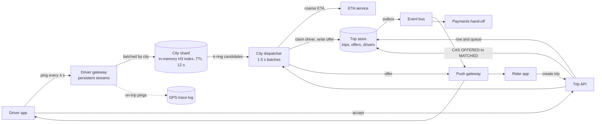
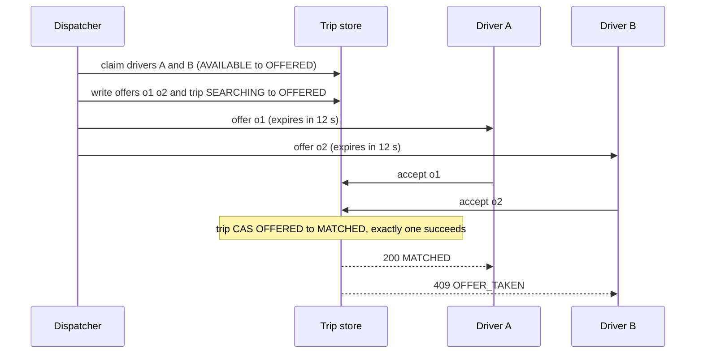

# 020 — Ride Dispatch: Full System Design Solution

## Goal and contract

A ride-dispatch system matches a rider request to a nearby available driver under real-time location uncertainty at city scale. The invariant is not "the driver location is exact" — it is: trip and assignment state is transactionally guarded and exactly one driver is ever confirmed per trip, while the location index used to find candidates is an ephemeral, approximate, TTL'd best-effort signal that never itself arbitrates who gets assigned.

The question's numbers are the contract: **5M concurrent online drivers globally at peak**, pinging every **4 s** (1.25M writes/s worldwide, not per city); **200,000 ride requests/minute in the busiest city** (3.3k/s); **match latency p99 under 3 s** from request to driver offer; **exactly-once assignment**; **trip state to both parties within 2 s**.

Promised: at most one driver per trip and one active trip per driver; an offer within 3 s at p99 whenever an idle driver exists (else an explicit "queued" answer); state on both screens within 2 s. Not promised: the nearest driver (we minimise total pickup time), that a driver accepts, or that every request matches at peak, because supply bounds throughput. The hard decision: solve requests jointly in a short batch window, and let only conditional writes in the trip store make an assignment true.

## Estimates

Everything beyond the question's constraints is a labelled assumption.

- **Pings and connections.** 5M ÷ 4 s = **1.25M pings/s**; ~100 B on the wire = 125 MB/s ≈ **1 Gbps**. 5M persistent streams ÷ 50k per gateway host = 100 hosts, **200 with 2× headroom** for zone loss and reconnect storms. So connections, not bandwidth or ping rate, size the edge.
- **Index size.** 5M × ~150 B = **0.75 GB for the planet**, so we shard by city for blast radius, never capacity. The hot city (assumption: 5% of the fleet) has 250k drivers, 62.5k pings/s, 37 MB. At 600 km² that is ~420 drivers/km²; H3 resolution-9 cells average ~0.105 km² (H3 docs), so ~44 drivers per cell. So one process holds a city's index; three replicas each taking the full stream is 190k msgs/s.
- **Offered load.** 200,000 ÷ 60 = **3.3k/s**; a 1.5 s batch window holds **5,000 requests**.
- **What that implies (Little's law).** A driver is committed ~25 min per trip = 1,500 s, so serving 3.3k trips/s needs 3.3k × 1,500 = **5.0M drivers, the entire global fleet**. The city's 250k drivers at 70% utilisation finish 250k × 0.7 ÷ 1,500 ≈ 117 trips/s = **7k/min: the stated 200k/min is ~29× local supply** (14× even at 10% of the fleet). So most attempts must be retries, abandons and price probes, or a surge burst. We design for the stated load and make the unmatched path (queue, wait estimate, surge) first-class.
- **Candidate query.** At r = 1 km the ring bound below gives k = 5 (91 cells × 44 ≈ 4k drivers worst case). At ~50 ns per check that is under 0.2 ms, 0.7 core at 3.3k/s. So lookup is cheap; ETA is the cost.
- **ETA compute.** K = 25 × 3.3k/s = 83k pairs/s; routing at ~1 ms each is ~83 cores. A cell-to-cell travel-time matrix (600 ÷ 0.105 = 5.7k cells; 5.7k² × 2 B = **65 MB**) makes ranking a lookup, so exact routing runs for ~1 chosen pair per request.
- **Solver.** Dense Hungarian on 5,000 requests = 5,000³ = 1.25e11 steps ≈ 125 s at 1e9/s; ~17 zones of ~36 km² hold ~300 each: 300³ = 2.7e7 ≈ 27 ms. So the solve must be partitioned.
- **Latency budget, p99 < 3 s.** Persist 50 ms + candidates and ETA 40 + window hold ≤ 1,500 + solve 100 + claim and offer write 50 + push 50 + last mile 200–500 = **~2.3 s**, ~0.7 s slack. So the window caps at 1.5 s.
- **Durable writes, hot city.** 3.3k creates/s + ~3.2k terminal writes/s for the unmatched + 117 matched/s × ~9 ≈ **8k/s**. So the waiting queue lives in dispatcher memory; never write per window.
- **Fan-out.** Assume 40% of drivers on trips = 2M; one rider push per 4 s = **500k msgs/s**. So location fan-out dominates outbound and gets downsampled.

## API

```text
POST /v1/quotes   {pickup, dropoff, product} → {quote_id, eta_pickup_s, fare_est, surge_mult, expires_at}  # locked ~2 min
POST /v1/trips    Idempotency-Key, {rider_id, pickup, dropoff, product, quote_id, payment_method_id}
                  → 202 {trip_id, state: SEARCHING, version: 1} | 402 PAYMENT_AUTH_FAILED | 409 ACTIVE_TRIP_EXISTS | 429 | 503
GET  /v1/trips/{id}?since_version=n   → snapshot + missed events   # reconnect and gap repair
POST /v1/trips/{id}/cancel | /depart | /arrived | /start | /complete   {expected_version, ...} → 200 | 409 STALE_VERSION
STREAM ping {driver_id, seq, ts, lat, lng, heading, speed, accuracy, state}                    # no ack, stale seq dropped
PUSH   offer {offer_id, trip_id, pickup, eta_s, fare_est, expires_at}
POST /v1/offers/{offer_id}/accept | /decline → 200 MATCHED | 409 OFFER_TAKEN | 410 OFFER_EXPIRED   # idempotent
EVENT TripEvent {trip_id, version, state, driver, eta_s, ts}                                   # version monotonic per trip
```

Trip creation is idempotent on `Idempotency-Key` plus a unique index of one active trip per rider; `accept` on `offer_id`. A client applies an event only if `version` = held + 1; higher triggers `GET ...?since_version=`, lower is dropped. 409 `OFFER_TAKEN` is the normal loser of a race, not a fault.

## Data model

| Entity | Shape | Role | Partition key |
|---|---|---|---|
| `driver_index` (memory) | `cell9 → [(driver_id, lat, lng, ts)]`, `driver_id → (cell9, seq, expires_at)` | **Derived**, TTL 12 s | City shard (parent cell → city) |
| `driver` | `driver_id, state AVAILABLE/OFFERED/ON_TRIP/OFFLINE, active_offer_id, active_trip_id, lease_expires_at` | **Truth: driver commitment** | `hash(driver_id)` |
| `trip` | `trip_id, rider_id, city_id, state, version, pickup, dropoff, quote_id, driver_id, attempts, excluded_drivers[]` | **Truth: assignment** | `hash(trip_id)` |
| `offer` | `(trip_id, offer_id) → driver_id, expires_at, state OPEN/ACCEPTED/DECLINED/EXPIRED/REVOKED` | Lease, clustered with its trip | `hash(trip_id)` |
| `trip_event` (outbox), `gps_trace` | `trip_id, version, state, ts` written with the state change; on-trip pings | Push, payments, fares, disputes | `trip_id` |

**Space for the index, id for the ledger.** "Who is near here" must be partitioned by space or every query fans out to every shard; the ledger is queried by id, and hashing spreads the hot city's 8k writes/s.

**Trip state machine.** Each transition is `UPDATE trips SET state=:new, version=version+1 WHERE trip_id=:t AND state=:expected`, plus an outbox row in the same transaction.

| Transition | Trigger |
|---|---|
| REQUESTED → SEARCHING ⇄ OFFERED | Payment pre-auth; dispatcher writes an offer; offers declined or expired send it back with `attempts++` |
| OFFERED → MATCHED | Accept wins the compare-and-set: the assignment fact |
| MATCHED → EN_ROUTE → ARRIVED → IN_PROGRESS → COMPLETED | Driver app actions; `complete` emits `TripCompleted`; a driver cancel returns MATCHED/EN_ROUTE to SEARCHING |
| any pre-start state → CANCELLED; SEARCHING → EXPIRED | Rider cancel (fee by state); 120 s without a driver, explicit "no cars" |

## Core mechanisms

| Mechanism | Behavior | Choose it when | Main weakness |
|---|---|---|---|
| Ephemeral geo-cell index (H3/S2-style cell + TTL) | Driver locations bucketed into cells, refreshed on each ping, expired if stale. | Always, for candidate discovery. | Approximate by cell size; stale beyond TTL if the app stops reporting. |
| Full-table geo scan / naive radius query | Filter all driver rows by lat/long distance. | Never at this scale. | O(all drivers) per request. |
| Candidate ranking (distance + ETA + acceptance) | Rank cell-adjacent drivers by predicted ETA before offering. | After candidates are retrieved from cells. | Only as good as location freshness. |
| Short-lease offer + conditional assignment | Offer with an expiry; first accept wins via an atomic conditional write in the trip DB. | Always, for the assignment decision. | Near-simultaneous accepts and timeouts need care. |
| Cascading/parallel offers, batched assignment | Next candidate on expiry; requests solved jointly per 1.5 s window. | To bound rider wait; when two requests want one driver. | Parallel offers need the same conditional guard; batching adds wait. |

## Architecture and data flow



**One write (a ride request).** `POST /v1/trips` checks the quote, pre-authorises payment, inserts the trip in `SEARCHING` (one row plus outbox event) and queues it in the city dispatcher. When the window closes, the dispatcher pulls 25 candidates per request, ranks by coarse ETA, solves each zone, claims each chosen driver, writes the offer and pushes it. The driver's `accept` runs the compare-and-set that yields `MATCHED`, and the outbox event reaches both apps.

**One read (rider watches the driver approach).** The gateway tees on-trip pings to the trace log and a rider-tracking topic keyed by `trip_id`; the push gateway sends one update per 2 s at most and the app interpolates. The trip store is not on this path.

The hard decision is decoupling "who looks like a good candidate" (index: approximate, fast, lossy) from "who is actually assigned" (trip store: transactional, authoritative), trading perfect position knowledge for the throughput to absorb 1.25M pings/s. The lease exists because "nearest driver" is not atomic with "driver is willing and available now": apps lag and connectivity drops, so assignment is a conditional write that only the first accepting driver wins.

## Capacity and storage

The city is the unit: dispatch rarely crosses a border, and a bad deploy should hurt one city. Per city: an index shard with 3 replicas across zones and a leader dispatcher with stateless zone workers (~17 in the hot city). A city splits only when its ping rate outgrows a process (~300k pings/s, ~1.2M drivers), then by resolution-6 parents with a halo.

A dense cell is cheap to scan (5,000 drivers × 50 ns = 0.25 ms); the stadium problem is *contention*, which the joint solve handles. The index may never record an assignment: "driver last seen in cell X" marking a driver busy would go stale and strand or double-book them.

## Spatial index and driver ping ingestion

Geohash cells are rectangles with 8 neighbours at two distances and prefix boundaries that ignore proximity. S2 (Google; cube-face projection, 64-bit ids along a Hilbert curve, levels 0–30) gives sortable ids for range scans and region coverings, but also has 8 neighbours at two distances. H3 (Uber, open sourced 2018) has 16 resolutions (0–15) and hexagons with 6 equidistant neighbours; `gridDisk` returns 3k(k+1)+1 cells. Its costs are 12 pentagons per resolution and children that only approximately nest in a parent.

**Decision: H3-style hexagons at resolution 9 (edge ~174 m, ~0.105 km², per the H3 docs) as the index key, a coarser parent as the shard key.** It gives uniform ring expansion at the cost of pentagon handling (use the library's `gridDisk`) and approximate parent containment; acceptable because the shard is always computed as `parent(cell9)`, never from raw coordinates, so each driver maps to exactly one shard. S2 would serve equally well. Mostly static places are a different problem: see [Nearby places](026_nearby_places_solution.md).

**Update and TTL.** `cells: map[cell9] → array`, `drivers: map[id] → (cell9, index, seq, expires_at)`. A ping is dropped if `seq` is not newer (duplicates and reordering are harmless), else it updates in place or moves the driver between cells in O(1) and sets `expires_at = now + 12 s`, three missed pings (shorter drops drivers in tunnels, longer offers trips to ghosts). Only `AVAILABLE` drivers are in `cells`.

**Expanding-ring search.** Widen ring by ring until you hold 25 candidates within the guaranteed radius. The query point can sit anywhere in its cell (up to one edge e from the center) and a cell at grid distance k has its center at least 1.5e·k away, so radius r is covered by **k = ⌊r ÷ (1.5e) + 4/3⌋**: for r = 1 km, e = 174 m, 1000 ÷ 261 + 1.33 = 5.16, so k = 5, 91 cells. Cells only bound the search; rank by real distance then ETA, so a driver 20 m across an edge is not penalised. A city shard also takes pings from a ~2 km halo beyond its border (~+10% volume, assumption) so border queries stay single-shard; a driver ghosted in the old city for 12 s cannot be double-booked because the driver row is global.

**Ingestion.** A durable log in front of the index adds 10–50 ms and pushes 1.25M msgs/s through brokers for data nobody needs after 12 s; direct fan-out from the gateway to the city's three replicas in 100 ms batches costs ~5 ms, and a lost batch leaves a few stale entries for one ping. **Decision: direct batched fan-out, plus an asynchronous log tee only for on-trip pings.** It buys latency and far less durable traffic at the cost that replicas differ by a few drivers, acceptable because no replica arbitrates anything. A total index loss self-heals in 4–8 s with no reconnect storm: drivers connect to the gateway, not the shard.

## Batched dispatch: greedy versus bipartite assignment

Greedy "nearest driver on arrival" is myopic. Pickup ETAs in minutes: rider A has X at 2 and Y at 3; rider B has X at 1 and Y at 9. Greedy (A first) gives A→X, B→Y: 2 + 9 = **11**. The joint optimum is A→Y, B→X: 3 + 1 = **4**. Denser demand means more such conflicts. A fixed window of 1–2 s with minimum-cost assignment minimises total pickup time at an average added wait of W ÷ 2; a rolling 250 ms solve adds less wait but overlapping solves are hard to reason about.

**Decision: tumbling 1.5 s window, adaptive.** It closes at once when a lone request has waited ~300 ms, so a quiet city behaves like greedy, and closes early at a size cap. The cost is 0.75 s of average wait, acceptable because break-even is tiny: against a 300 s mean pickup ETA, 0.75 s is 0.25%, so any gain above that pays for the hold.

**Cost function.** `cost = eta_pickup ÷ p_accept − w · age`: a far-but-reliable driver competes with a near-but-flaky one, and age prevents starvation. Only the oldest `2 × idle drivers in the zone` requests enter a window, so under 29× oversubscription the graph is sized by supply: a 120 s queue (3.2k/s × 120 s = 380k) waits in memory instead of yielding ~9.6M edges per window.

**Making the solver fit.** The candidate graph is sparse (25 edges per request). Split into ~17 zones and solve each with the Hungarian (Kuhn–Munkres) or auction algorithm in parallel: 17 × 27 ms = 0.46 s CPU, ~120 ms wall on 4 cores, against 125 s dense. Two zones wanting one border driver lose only optimality: the claim CAS admits one and the other retries next window.

**ETA from the road network.** Straight-line distance misleads: across a river or a one-way system, 400 m can be 12 minutes. Two stages, see [Maps routing and ETA](034_maps_routing_and_eta_solution.md): (1) rank by the 65 MB cell-to-cell matrix, refreshed every 1–2 minutes from live traffic; (2) exact route ETAs for chosen pairs only (3.3k/s), re-solving a zone once if an exact ETA exceeds the coarse one by 1.5×. That trades a slightly stale matrix for 25× fewer routing queries. If the ETA service is down, use straight-line × a circuity factor (~1.3, assumption).

## Offer protocol and exactly-once assignment

**Invariants.** I1: a trip has at most one driver. I2: a driver holds at most one live offer and one active trip. Both are enforced by conditional writes in the durable store; the dispatcher, index and leader are advisory.

A per-driver lock (SETNX with TTL) fails when a paused holder writes after expiry unless every write carries a fencing token; a single-writer actor per city ties availability to one leader; 2PC across trip and driver rows commits cross-partition on every accept. **Decision: conditional single-row writes in the order claim, offer, accept; the per-city leader exists only for solve quality.** A split-brain leader then yields worse assignments or lost CAS races, never two drivers on one trip. The cost is a reconciler and idempotent retries, acceptable because they are ordinary engineering, not timing assumptions (see [Consensus and coordination](../building_blocks/19_consensus_and_coordination.md)).

1. **Claim.** `UPDATE driver SET state='OFFERED', active_offer_id=:o, lease_expires_at=now+12s WHERE driver_id=:d AND state='AVAILABLE'`. Zero rows: drop the edge, retry next window.
2. **Offer.** One transaction on the trip's partition inserts the offer and moves `SEARCHING` to `OFFERED`; then push.
3. **Accept.** One transaction on the trip's partition: `UPDATE trips SET state='MATCHED', driver_id=:d WHERE trip_id=:t AND state='OFFERED'` plus `UPDATE offer SET state='ACCEPTED' WHERE offer_id=:o AND state='OPEN' AND expires_at > now`; both must hit one row. Then the driver goes `ON_TRIP` and other open offers are `REVOKED`.
4. **Expiry.** A timer runs `UPDATE offer SET state='EXPIRED' WHERE state='OPEN' AND expires_at <= now`, frees the driver and returns the trip to `SEARCHING`. Accept and expiry race on the same `state='OPEN'` predicate, so exactly one wins.
5. **Retry.** A repeated `accept` on an offer already `ACCEPTED` by that driver returns success; a crash between the trip write and the driver update is repaired by that retry or a reconciler scanning `OFFERED` drivers past their lease.



**Sequential or parallel offers.** With an acceptance probability of 0.6 (assumption), sequential offers need 1 ÷ 0.6 = 1.7 rounds of up to 12 s; two parallel offers succeed per round with 1 − 0.4² = 0.84, needing 1.2 rounds, but hold two drivers per trip. **Decision: one offer first, two in parallel on re-offers and in supply-rich zones.** It cuts time to a confirmed driver at the price of some `OFFER_TAKEN` disappointments, acceptable because driver attention is cheaper than rider abandonment. The 3 s SLO covers time to *offer*, not accept. On decline or timeout the driver joins `excluded_drivers`, `attempts++`, and the trip re-enters the next window with an age bonus.

## Surge and supply-demand control

Per resolution-7 cell (~5 km², ~116 in the hot city), every 30 s: demand = 60 s EWMA of new requests plus queued; supply = idle drivers from the index; multiplier `m = clamp(1 + α(ρ − ρ0), 1, m_max)` with ρ = demand ÷ max(supply, 1). Higher price sheds demand and a driver-app heat map pulls supply toward high-m cells.

The loop has a delay (drivers need minutes to relocate), so it oscillates on raw counts. Damp it: EWMA over 1–2 min, average each cell with its k = 1 ring so boundaries have no cliffs, cap change per update (±0.2), and lock the quoted multiplier for 2 minutes. At ~29× oversubscription this, queue expiry and per-rider limits are the main demand-shedding tools, since matching cannot help when supply is exhausted (see [Overload control](../building_blocks/28_overload_control_and_graceful_degradation.md)). The cost is fairness and regulatory exposure, so `m_max` is a policy input.

## Real-time delivery and payments hand-off

**Delivery.** The state change and outbox row commit together; a relay publishes to a bus partitioned by `trip_id` (per-trip order); the push gateway finds the user's host in a TTL presence registry and writes to the stream; offline users get APNs/FCM as best effort and resync via `since_version`. Delivery is at-least-once, idempotent through `version`. Budget: commit 20–50 ms + relay and bus ~50 ms + gateway ~10 ms + last mile 100–500 ms = **0.2–0.6 s typical vs a 2 s p99**, leaving room for one reconnect (~0.4 s: TCP plus TLS at a 200 ms RTT). Location fan-out (500k msgs/s) is downsampled to one push per 2 s per rider with on-device interpolation.

**Payments.** Pre-authorise the quoted fare at request time so a bad payment method fails fast (402) before it consumes supply. On `complete`, compute the fare from the GPS trace and locked surge and emit `TripCompleted` through the outbox, keyed by `trip_id`, to the ledger in [Payment ledger](017_payment_ledger_solution.md), which captures the authorisation and credits the driver. A post-ride payment failure never rolls the trip back: it becomes a receivable that blocks new requests.

## Failure and abuse behavior

| Case | Correct behavior |
|---|---|
| Driver pings stop | TTL drops them from the index; they stop being candidates. |
| Two riders' queries pick the same top driver | The driver-claim CAS stops the second offer; the other rider is re-offered the next candidate. |
| Driver accepts after the lease expired | Rejected by the conditional write (`410 OFFER_EXPIRED`); driver returns to the pool. |
| Driver goes offline after accepting | Explicit driver-unreachable transition after ~30 s without pings, then re-dispatch; no phantom assignment. |
| Dense-cell hotspot (stadium letting out) | Scanning is cheap; contention is the issue. The joint solve assigns the few drivers, surge prices the rest, queue expiry bounds the wait. |
| Rider spams requests to game surge | One active request per rider, per-device rate limit, anomaly detection outside the dispatch path. |
| Assignment write fails after driver already notified | The trip DB is the single source of truth; "you got the ride" is sent only after the conditional write succeeds. |
| Index replica or whole city shard lost | Two replicas hold a near-identical index, so queries fail over at once. If all are lost, pings resume into a warm standby, requests wait in the durable `SEARCHING` set, and p99 offer latency breaks for ~10–15 s. |
| Dispatcher leader dies or pauses | A replacement re-reads `SEARCHING` trips and resumes; a stale leader can only lose CAS races. |
| Trip store zone or region loss | Cross-zone synchronous replication keeps committed assignments; region loss fails over and drivers re-report their active trip on reconnect. Lost push hosts reconnect and resync by `since_version`. |
| Bad matcher or cost-function deploy | Per-city flag, shadow-solve on live traffic and compare pickup time first; kill switch reverts to greedy. |
| GPS spoofing, ping flood | Reject impossible speeds or jumps, require device attestation, cap 1 ping/s per driver. |

## Observability and interview close

Measure index freshness, request-to-offer p99 per city (the SLO), unmatched share and queue age, `OFFER_TAKEN` and claim-conflict rates, zone-solve time, ETA error, commit-to-device p99 (the 2 s SLO), and an audit counting trips with two drivers or drivers on two trips.

**The one paging alert:** request-to-offer p99 above 3 s for a city over 5 minutes, counting only requests that had an eligible idle driver. The invariant audit is the sole exception, paging at zero because a double assignment is a correctness violation, not a degradation.

Trade-off to state: "The location index is approximate and only produces candidates. Requests are solved jointly in a 1.5 s window because that cuts total pickup time (11 down to 4 in the two-rider example) for 0.75 s of average added wait, and a short-lease offer plus a conditional first-accept-wins write in the trip database guarantees exactly one driver per trip, the invariant that cannot degrade while freshness and ranking are approximate."

## Follow-ups the interviewer will ask

1. **"How does this work multi-region?"** A city is pinned to its nearest region with a warm standby shard elsewhere fed by a ping tee. The trip store replicates synchronously across zones and asynchronously across regions, so a region loss can lose the last replication-lag window; apps re-report active trips and `version` reconciles. The driver row has one home region, so no double-booking across cities.
2. **"What changes at 10× and 100×?"** At 10×: 12.5M pings/s, ~2,000 gateway hosts, per-city design unchanged. At 100×: 125M pings/s is ~100 Gbps and a city can outgrow a process, so split it into resolution-6 shards with a halo and make pings adaptive (8–10 s when stationary, TTL scaled to match); ETA becomes the dominant cost.
3. **"What about stricter consistency?"** Never two offers to one driver, even across cities and failover, already holds: the claim is a CAS on a global row. For a linearizable "is this driver free" read, put claims on a consensus-backed store at a few ms per claim; never consult the index.
4. **"What dominates cost?"** Connections (7M streams), rider location fan-out and ETA compute, not the 750 MB index or 8k ledger writes/s. Knobs: ping cadence, rider downsampling, coarse-then-exact ETA, smaller K.
5. **"How do you prevent abuse?"** Per-rider limits, payment pre-authorisation, device attestation and speed checks against fake GPS, and acceptance-rate tracking against cherry-picking.
6. **"I think greedy is good enough."** In a sparse market I agree, and the adaptive window degenerates to greedy when it holds one request. Gain appears when requests contend for drivers (11 vs 4); I would run both in shadow on replayed traffic and let total pickup time decide. (Same answer for "just use Redis GEO": fine for one city, but sorted sets have no per-member TTL and persisting 62.5k writes/s buys durability we do not want.)

## Common mistakes

1. **Sizing one city from the global numbers.** "5M drivers city-wide" plus "500k concurrent requests" is nonsense. Derive global pings, the city share and the hot city's rate separately, then apply Little's law.
2. **Making the index authoritative.** "Driver in cell X, so busy or free" goes stale and double-books or strands drivers; only conditional writes in the trip store change assignment.
3. **Greedy with no window.** Quietly worse in total wait (11 vs 4); batch ~1.5 s, adaptively, and prove it in shadow.
4. **Ranking by straight-line distance.** Rivers and one-way streets break it; use a two-stage road-network ETA.
5. **Notifying before committing.** "You got the ride" before the CAS succeeds creates phantom assignments.
6. **No lease, or cron-based expiry.** Drivers stay `OFFERED` forever after a crash; give every offer `expires_at` and race accept and expiry on `state='OPEN'`.
7. **Treating the 200k/min peak as an error path.** At ~29× local supply, 96%+ of attempts cannot match; surge, queue expiry and "no cars" are core design. (Likewise, shard the index by space, not driver id.)

## Going from L5 to L6

- **Migration path.** One city, one in-memory index and greedy dispatch first; add the conditional-write ledger (the invariant) early, then the batch window in shadow mode, then per-city rollout, replaying production traces through an offline simulator before every matcher change.
- **Cost model.** Price a trip in connections, pushes, ETA queries and ledger writes; weigh each window second against pickup savings.
- **Ownership and blast radius.** The city is the cell (own index, dispatcher, flags); the driver row is the only global object. Separate owners for routing/ETA, marketplace and the trip ledger.
- **Build versus buy.** Use H3 or S2, a managed transactional store and an existing routing engine; build dispatcher, cost function, surge.
- **What to measure first.** Real requests-per-driver ratios by city and hour (to replace the Little's law assumptions), acceptance distributions, and batching's gain on replayed traffic.

## Build exercise

Implement a hexagonal (or square) cell neighbor lookup over synthetic driver locations with TTL expiry, a conditional-assignment function on a trip record, and a greedy-vs-batch simulator; simulate two concurrent accepts for one trip and assert only one succeeds while the other is cleanly rejected.

Named assertions:

- `test_ring_bound_covers_radius`: for random points and radius r, every driver within r is returned with k = ⌊r ÷ (1.5e) + 4/3⌋.
- `test_ttl_expires_stale_driver`, `test_out_of_order_ping_ignored`: 12 s of silence removes a candidate; an older `seq` never moves a driver.
- `test_two_accepts_one_winner`: two threads accept different offers for one trip; one `MATCHED`, one `OFFER_TAKEN`.
- `test_late_accept_rejected`: accept after `expires_at` returns `OFFER_EXPIRED` and the driver is `AVAILABLE`.
- `test_driver_single_live_offer`: a driver in `OFFERED` cannot be claimed by a second trip.
- `test_accept_is_idempotent`: retrying `accept` on one `offer_id` returns the same result and writes once.
- `test_batch_beats_greedy`: on the A/B/X/Y example, batch total is 4 and greedy is 11.
- `test_index_rebuilds_after_loss`: drop the index, replay two ping periods, every active driver is present.
