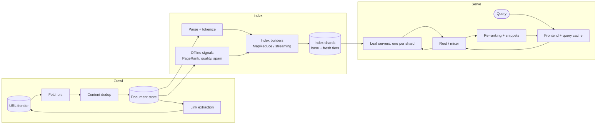

# 025 — Web Search Engine: Full System Design Solution

## Goal and contract

Three loosely coupled systems with very different contracts:

| System | Contract | Latency | Consistency |
|---|---|---|---|
| Crawler | Fetch the right pages at the right frequency without harming sites. | Hours to days (minutes for news) | Eventually complete |
| Indexer | Turn fetched pages into searchable, ranked shards. | Minutes (fresh tier) to days (base tier) | Each shard is a consistent snapshot |
| Serving | Answer queries from the current index. | p99 < 300 ms | Read-only; slightly stale is fine |

Decoupling them through durable storage (fetched documents, index shard files) means a crawler slowdown never slows queries, and a bad index build can be rolled back without re-crawling.

## Estimates

- **Raw storage**: 50B pages × 100 KB ≈ 5 PB of HTML (compressed ~1 PB); extracted text 50B × 10 KB = 500 TB.
- **Inverted index**: posting lists are typically 20–40% of the text size after compression → 500 TB × 0.2–0.4 = roughly **100–200 TB**, plus forward index/snippet data of similar size, kept in a separate document store (only the final 10 results need snippets).
- **Index shards**: at ~50 GB per shard (fits comfortably in memory/SSD on one machine), 2,000–4,000 shards; we design for **4,000**, the top of the range, for headroom. Each query fans out to all shards of a tier, so tier design matters.
- **Serving replicas**: 100K QPS; if one full copy of the index handles ~2,000 QPS, about 50 replicas of the whole shard set, spread over regions. At ~10 shards per SSD machine that is 400 machines per copy and 20,000 machines; a 60% query-cache hit rate leaves 40K QPS, 20 copies and 8,000 machines. So caching and tiering pay off enormously.
- **Crawl**: re-crawling 50B pages with a 30-day average revisit = ~1.7B fetches/day ≈ 20K fetches/second (2 GB/s of HTML, 16 Gbps); news and popular sites far more often, long-tail sites much less. The stated capacity of several billion a day (say 3B = 35K/s, 28 Gbps) leaves headroom for hot sites and retries.

## Pipeline overview

## Crawl and dedup

**URL frontier.** URLs are prioritised (page importance, change frequency, freshness demand) and grouped by host. Each host has a queue with a politeness delay, and fetchers take from host queues whose next-allowed time has passed, so no site receives more than its crawl-rate limit. robots.txt and DNS lookups are cached per host.

**URL dedup.** Normalise URLs (lowercase host, strip session parameters and fragments), then check a per-crawl Bloom filter / seen-set before enqueueing; a Bloom filter needs ~9.6 bits per URL at a 1% false-positive rate, so 1B URLs take 1.2 GB and all 50B about 60 GB, sharded by host hash (a false positive only skips a page).

**Content dedup.** Many URLs serve identical or near-identical content (mirrors, parameters). Exact duplicates are caught with a content hash; near-duplicates with **SimHash** or MinHash fingerprints — pages whose fingerprints differ in only a few bits are clustered and one canonical URL is indexed.

**Crawler traps** (infinite calendars, session-ID URLs): cap URL depth and URLs per host, detect repeating path patterns, and reduce priority for hosts that generate unbounded new URLs.

## Indexing

- Parse HTML, extract text, title, anchor text from inbound links (a strong relevance signal), language, and structured data.
- Build an **inverted index** per shard: term → posting list of `(doc_id, term frequency, positions)`, compressed with delta encoding and variable-byte or SIMD codecs; plus a forward index for snippets and features.
- **Shard by document**, not by term: each shard is a complete mini-index over a subset of documents (partitioned by hashed doc ID). Term-sharding would create giant hot shards for common words and make multi-term queries cross-shard joins.
- **Tiered index**:
  - A **base tier** rebuilt periodically (daily/weekly) with MapReduce-style batch jobs over all documents.
  - A **fresh tier** (news, recently changed pages) built continuously by streaming indexers and merged into the base tier at the next rebuild.
  - Optionally a small **high-quality tier** of the most important pages searched first.
- Shards are versioned, immutable files pushed to leaf servers; new versions roll out gradually and roll back if quality metrics drop.

## Query serving and fan-out

1. **Frontend** normalises the query (spelling correction, language, synonyms) and checks a **query result cache** keyed by normalised query + locale — popular queries follow a steep power law, so a cache with a short TTL absorbs a large share of traffic.
2. The **root (mixer)** fans the query out to one replica of every leaf shard in the chosen tiers.
3. Each **leaf** intersects posting lists, scores candidates with a cheap ranking function (BM25-style relevance + static quality signals), and returns its top ~100 doc IDs and scores.
4. The root merges results (a k-way merge of top lists), then a **second-stage ranker** applies expensive features and learned models to the top few hundred, applies diversity and safety filters, and fetches snippets for the final 10.

**Latency budget, p99 < 300 ms (assumed slices, in ms).**

| Stage | ms |
|---|---|
| Frontend, normalisation, cache lookup | 20 |
| Root fan-out RPC | 5 |
| Leaves: retrieve and score, with a hard deadline (hedge at their p95, about 40) | 100 |
| Root merge, ~400K candidates to ~1,000 | 10 |
| Second-stage ranking of ~1,000 | 60 |
| Snippets for the final 10 (parallel fetch) | 40 |
| Response | 10 |
| **Total** | **245**, leaving ~55 reserve |

The leaf deadline is the lever: it is the largest slice and the only one that can be cut at run time, by returning partial results.

**Tail latency is the central problem.** With 4,000 leaves per query, even a 0.1% per-leaf chance of being slow makes most queries slow: 0.999^4000 = 1.8% of queries see no slow leaf. Hedging at p95 leaves 0.05 × 0.05 = 0.25% of leaf calls slow, still about 10 per query, so hedging alone is not enough and the deadline is mandatory. Techniques:

- **Hedged requests**: if a leaf has not answered by its p95, send the same request to another replica and use the first response.
- **Partial results**: return after a deadline with results from, say, 99.9% of shards; a handful of missing shards barely changes the top 10 (log it).
- **Early termination**: posting lists are ordered by static document quality, so a leaf can stop scanning once further documents cannot enter its top-K.
- **Replica selection** based on recent latency, and keeping leaf CPUs below saturation.

## Ranking stages

| Stage | Where | Candidates | Signals |
|---|---|---|---|
| Retrieval | Leaves | Millions → ~100 per shard | Term match (BM25), positions/proximity, static quality (link-based importance, spam score) |
| First merge | Root | ~400K → ~1,000 | Scores normalised across shards |
| Re-ranking | Ranking service | ~1,000 → ~100 | Learned model: query-document relevance, freshness, user location/language, click-derived signals |
| Final | Frontend | → 10 | Diversity, duplicates, safety, snippets |

## Freshness and removals

- Freshness demand is detected from query and news signals (a spike of queries for a term routes more crawl budget to related sites and boosts the fresh tier).
- Pages that return 404/410 or are removed for legal reasons are added to a **suppression list** checked at serving time, so they disappear immediately without waiting for an index rebuild.

## Failure behaviour

| Failure | Behaviour |
|---|---|
| Leaf replica down | Root sends to another replica; hedging hides brief slowness. |
| Whole shard unavailable | Partial results without that shard; alert. |
| Bad index build | Quality metrics on a canary slice fail → keep serving the previous shard version. |
| Crawler backlog | Freshness degrades; serving unaffected. Prioritise news and high-importance hosts. |
| Region outage | Anycast / DNS routes queries to other regions, which hold full index replicas. |

## Observability and interview close

Measure: query p50/p99 by stage, leaf timeouts and hedge rate, fraction of shards answering per query, cache hit rate, index age per tier, crawl rate and politeness violations, duplicate ratio, and search quality metrics (click-through, long clicks, human rater scores) per index version.

Trade-off to state: "A tiered index lets me serve fresh pages from a small, frequently rebuilt tier while the huge base tier is rebuilt in batch. The price is merging results from two tiers and some staleness for long-tail pages. If freshness requirements tightened across the whole web, I'd move more of indexing to streaming and pay for continuous incremental index maintenance on every leaf."

## Follow-ups the interviewer will ask

1. **"How does this work across regions?"** Crawl and build once, then ship immutable shard files to each serving region, where full index copies answer queries locally. A full 200 TB push per day is 200 TB ÷ 86,400 s = 2.3 GB/s (18.5 Gbps) per region sustained, so ship the base tier weekly (0.33 GB/s) and stream only the fresh tier and the suppression list. Regions are eventually consistent by design, so the same query can differ slightly between regions for hours. I accept that for ranking but not for removals (item 3).
2. **"What changes at 10× and 100×?"** At 500B pages there are about 40,000 shards, and a flat fan-out that wide leaves no query without a slow leaf (0.999^40,000 is about 10⁻¹⁸). Add a mixer tree (root, intermediate mixers, leaves) so no node fans out to more than a few hundred, and tier the index so most queries touch only a high-quality tier (say 10% of documents) and escalate only when it returns too few good results. 10× QPS is mostly more replicas and a better cache.
3. **"What if removals must take effect in seconds, everywhere?"** A legal takedown cannot wait for an index rebuild or for eventually consistent regions. Keep the suppression list (millions of URLs, tens of MB) as a versioned set in a strongly consistent store, pushed to every root within seconds, and filter merged results against it before snippets. Each root reports the version it holds, and one that falls too far behind stops serving the affected content class (fail closed).
4. **"What does it cost?"** The leaf fleet dominates: 8,000 machines (above) at an assumed $1,000 per machine-month is about $8M a month, against crawl bandwidth of 2 GB/s that is small by comparison. The levers are cache hit rate, tiering and posting compression, so I would track cost per 1,000 queries, and re-derive the fleet whenever the hit rate moves.
5. **"How do you handle abuse?"** Search spam (link farms, keyword stuffing, cloaking that shows the crawler different content) is met with spam classifiers and link-graph demotion as offline signals, and with a second fetch using a browser-like profile to catch cloaking. Scrapers get rate limits and challenges. As a crawler we must not be abusive: honour robots.txt and per-host politeness, and publish a verifiable crawler identity (reverse-DNS check) so sites can tell us from impostors.
6. **"Why shard by document and fan out to everything? Term sharding avoids that."** A common term's posting list covers about 30% of 50B documents (15B postings, roughly 15 GB at an assumed ~1 byte each), and a multi-term query would have to ship those lists across the network to intersect them; common terms also make hot shards. Document sharding keeps every intersection local and pays with fan-out, which tiering, hedging and deadlines tame. If the interviewer insists, I would use term partitioning only for a small side index of rare terms.
7. **"How do you roll out a ranking change safely?"** Evaluate offline on a judged query set (NDCG) and click logs, then serve a canary slice with interleaving (results from old and new rankers mixed in one page) and guardrails on latency, click-through and abandonment before ramping. Model version and index version are independent, so a bad model rolls back without a rebuild.

## Common mistakes

1. **Sharding the index by term.** Common words create giant hot shards and multi-term queries become cross-shard joins. Shard by document.
2. **Ignoring tail latency across thousands of leaves.** The query waits for the slowest leaf. Use hedged requests, a hard leaf deadline and partial results, and keep leaf CPU below saturation.
3. **A global crawl rate limit instead of per-host politeness.** One host can receive thousands of concurrent fetches and block you. Queue per host with next-allowed times, and cache robots.txt.
4. **Treating URL dedup and content dedup as one problem.** A seen-set catches repeated URLs, not mirrors or parameter variants. Add content hashes for exact copies and SimHash for near-duplicates.
5. **Updating index shards in place.** A bad build then cannot be rolled back and readers see torn state. Ship immutable versioned shards, canary them, and switch atomically.
6. **Applying removals only at the next index rebuild.** A takedown then lingers for days. Check a suppression list at serving time.
7. **Running the expensive ranker on every candidate.** Cost explodes. Use a funnel: cheap scoring at leaves, then a learned model on about 1,000 merged candidates.

## Going from L5 to L6

- **Migration and rollout.** Treat index and model versions as immutable artifacts: canary a shard version on a traffic slice against quality metrics, and when the index format changes let leaves read both formats during the transition so any step can roll back.
- **Cost model.** The serving fleet is the cost, so the levers are cache hit rate, tiering (touch about 10% of shards for most queries), compression and SSD versus RAM. Report cost per 1,000 queries and the marginal cost of one more fresh document.
- **Ownership and blast radius.** Crawl, index and serve are separate teams joined by durable-storage contracts, so a crawler backlog never slows queries. A bad shard version affects about 1/4,000 of documents, and a query of death should be isolated per replica group.
- **Build versus buy.** Build retrieval and ranking, since they are the product; reuse object storage and batch and streaming frameworks. For a corpus under about a billion documents an off-the-shelf engine such as OpenSearch is the right buy; 50B pages is well beyond it.
- **Phased evolution and what to measure first.** Start with one base tier and a cache, then add the fresh tier, then the high-quality tier and the mixer tree. Measure first: the query frequency distribution (cache hit rate by TTL), the per-leaf latency distribution, and index freshness by domain.

## Build exercise

Build a mini engine over a Wikipedia dump: tokenizer, inverted index with delta-encoded postings, BM25 ranking, and 8 document shards queried in parallel with a root that merges top-10 results. Add a deadline and hedged requests; inject random leaf delays and plot p99 with and without hedging.
