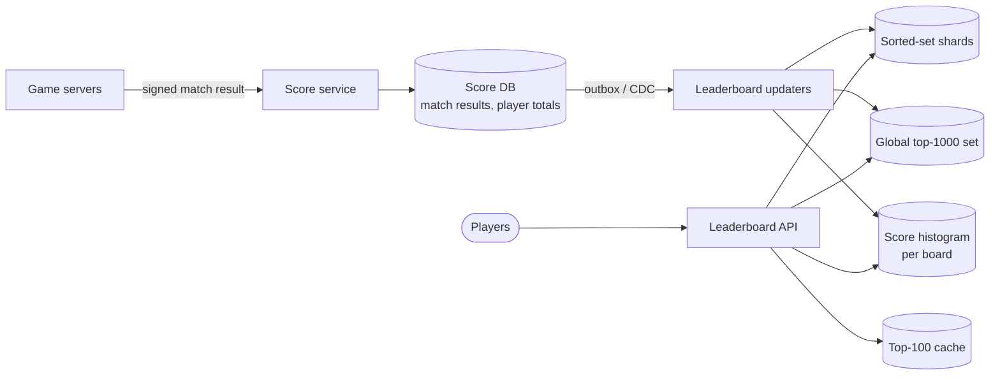

# 029 — Real-Time Leaderboard: Full System Design Solution

## Goal and contract

- The **top 100** and each player's **own score** are exact and fresh within seconds.
- A player's **rank** is exact within their shard of the leaderboard, and globally exact for the top of the board; for the millions of players in the long tail, rank may be **approximate** (e.g. "rank ~1,204,000" or "top 12%"), which is what players actually use.
- The durable score history is in a database; the ranking structure is a rebuildable projection.

## Estimates

- **Sorted-set memory**: Redis sorted-set entries cost roughly 60–100 bytes each (member ID, score, skip-list and hash overhead). 100M players × ~80 bytes ≈ **8 GB** for one season board — large for a single in-memory instance, and regional plus friend boards multiply it.
- **Writes**: 5K/s (20K/s bursts) `ZINCRBY`/`ZADD` — trivial for one Redis node (100K+ ops/s), so the bottleneck is memory and blast radius, not CPU.
- **Reads**: 50K/s; the top 100 is the same for everyone and caches perfectly; "my rank" is per player.
- **Hot keys in the hybrid design**: each update costs 2 histogram increments (old bucket down, new bucket up), so the 20K/s burst puts 40K ops/s on one histogram key, while the 16 shards see only ~1,250 writes/s each. That is inside one Redis thread's ~100K ops/s but it is the tightest spot in the design, so split the histogram across a few keys by bucket range.
- **Scale check**: 20M DAU × ~5 matches = 100M results/day ≈ 1.2K/s average, consistent with the 5K/s peak (4.3×). At an assumed 200 B per result that is 20 GB/day, about 7 TB/year in the score DB, which is the growing cost; the sorted sets are the small one.

## API

```text
POST /v1/matches/{match_id}/result      {player_id, score_delta, ...}   # from game servers, signed; idempotent by match_id
GET  /v1/leaderboards/{board}/top?limit=100
GET  /v1/leaderboards/{board}/players/{player_id}   → {score, rank, rank_is_approx, neighbours: [...]}
GET  /v1/leaderboards/{board}/friends/{player_id}
```

Boards are named like `season-2026-09:global`, `season-2026-09:region-EU`.

## Baseline: one sorted set

A **sorted set** (skip list + hash map) gives `O(log n)` update, rank lookup, and range queries:

```text
ZINCRBY season:global <delta> player:42        # update score
ZREVRANGE season:global 0 99 WITHSCORES        # top 100
ZREVRANK  season:global player:42              # my rank (0-based)
ZREVRANGE season:global rank-5 rank+5          # neighbours
```

Up to tens of millions of players on one well-provisioned node, this alone is a complete, correct design. Say that first, then scale it.

**Tie-breaking.** Encode the tie-breaker into the score so the structure orders it for free: `composite = score × 2^22 + (SEASON_END − achieved_at_seconds)`. Earlier achievers get a slightly higher composite. Sizing matters: 2^22 seconds is 48.5 days, enough for a monthly season (2.59M seconds), whereas 2^20 would cover only 12 days and wrap. A double's 53-bit mantissa leaves 31 bits for the score (up to 2.1B). Because the composite embeds the achievement time, the updater must `ZADD` the composite computed from the new total in the outbox event, not `ZINCRBY` a delta, which cannot refresh the time bits; `ZADD` of the same composite twice is also a harmless replay.

## Write path and durability



1. Game servers submit signed match results; the score service validates them (anti-cheat rules: plausible score for match duration, server-authoritative results only) and writes to the database idempotently by `match_id`.
2. An outbox/CDC stream updates the ranking structures asynchronously — seconds of lag, within the freshness requirement.
3. If Redis is lost, rebuild the sets from the database (player totals table) — minutes of degraded ranks, no lost scores.

## Sharding the leaderboard

At 100M players and several boards, one node holds too much in one failure domain. Options:

| Approach | How | Rank query | Verdict |
|---|---|---|---|
| Shard by player ID hash | N sorted sets, each with a random subset of players | Exact rank needs rank from *every* shard (sum of counts above the score) → N queries per lookup | Works; fan-out on every rank read |
| Shard by score range | Each shard holds a score band (0–999, 1,000–4,999…) | Rank = sum of sizes of higher bands + rank within own band | Cheap rank, but bands must be rebalanced as scores inflate; hot top band |
| **Hybrid: global top set + histogram + hash shards** | Exact top list, exact per-shard data, approximate global rank for the tail | Top players: exact from the top set; others: histogram estimate | **Chosen** |

**Chosen design:**

- **Global top set**: a single sorted set holding only the top ~1,000 scores (updaters add a player when their score beats the set's minimum and trim the rest). Top 100 and exact ranks for top players come from here.
- **Player shards**: all players in N hash-partitioned sorted sets (e.g. 16 shards of ~6M each) for exact score and neighbour queries within a shard and for rebuilding.
- **Score histogram**: per board, a count of players per score bucket (e.g. 10,000 buckets), updated on every score change (decrement old bucket, increment new). A player's global rank ≈ number of players in higher buckets + interpolated position within their bucket. `O(buckets)` memory (10,000 × 8 B = 80 KB). Use equi-depth boundaries taken from the nightly score quantiles (fixed-width buckets over a skewed distribution can put millions of players in one bucket): each bucket then holds about 10K players and the worst-case error is half a bucket, about 5,000 ranks, which is 0.4% at rank 1.2M. The read path does not scan buckets: each API instance caches the cumulative counts (80 KB) refreshed every second and binary-searches them, so a rank read is `O(log buckets)` and the histogram key sees one refresh per instance per second, not 50K reads/s.

Rank read for a player: if their score ≥ top set minimum → exact rank from the top set; else → histogram estimate, flagged `rank_is_approx`.

## Seasons, regions, and friends

- **Seasons**: a new board key per season; the old board is snapshotted to storage for history and expired from memory. No mass reset writes.
- **Regions**: separate, much smaller boards per region, updated by the same updaters.
- **Friends leaderboards**: most players have < 200 friends — fetch friends' scores (`ZMSCORE` or from the score DB/cache) and sort in the service. No per-player sorted set needed.

## Cheating and integrity

Only accept scores from game servers (never clients), sign results, run plausibility checks, rate-limit score gain per player per hour, and keep an audit log. Flagged players are removed from boards (`ZREM`) pending review, and their histogram contribution is adjusted.

## Failure behaviour

| Failure | Behaviour |
|---|---|
| Redis shard down | Replica promoted; if both lost, rebuild shard from the score DB. Ranks for that shard's players degrade to histogram estimates meanwhile. |
| Updater lag | Players see their new score (read from the DB/cache) but an older rank; show "updating". Alert on lag. |
| Event traffic spike (20K/s) | Updaters batch pipeline commands; sorted-set ops remain cheap. Scale updater consumers to partition count. |
| Duplicate match result | Idempotent by `match_id` in the DB; updaters apply deltas only from committed DB changes. |

## Observability and interview close

Measure: score-to-rank propagation lag, top-set and shard p99 latency, histogram error (sample exact ranks nightly and compare), Redis memory per shard, rebuild time, cheating flags, and cache hit rate for the top 100.

Trade-off to state: "Exact rank for every player at every moment would require either one giant sorted set or a fan-out across all shards on each read. Instead I give exact ranks where they matter — the top of the board and a player's neighbourhood — and an approximate global rank from a histogram for the long tail. If the game design required exact global rank for everyone, I'd use range-partitioned shards with per-shard counts, accepting rebalancing work as score distributions shift."

## Follow-ups the interviewer will ask

1. **"How does this work across regions?"** Keep one home region for the global board and the score DB (5K writes/s is small), and give each region async read replicas of the top set, histogram and shards, so reads stay under the 100 ms p99 without a cross-region hop. Replica lag of a few hundred milliseconds adds to the "few seconds" rank freshness. A player near a region outage keeps seeing rank from a replica, while new scores queue at the DB and appear on recovery. Regional boards are small enough to live entirely in their region.
2. **"What changes at 10× and 100×?"** At 10× (1B players) one board is 80 GB, so about 170 shards of 6M, and updates reach 50K/s with 100K histogram ops/s, so the histogram must split across several keys and updaters should batch. At 100× a per-player exact structure stops making sense: use bucketed counts for everyone below the top 10K, and treat neighbours as a range read only within the player's shard.
3. **"What if every player needs an exact global rank at all times?"** Use score-range partitions with per-partition counts: rank is the sum of counts in higher partitions plus the rank inside the player's own partition, so it is exact and costs two lookups. The price is rebalancing as the score distribution shifts, and a hot top partition. If only "see my new rank immediately after my match" matters, do the `ZADD` synchronously in the result request and return the rank in the response (idempotent by `match_id`), leaving the async path for everyone else.
4. **"What does it cost?"** Memory: 100M × ~80 B = 8 GB per board, so about 16 GB with regional boards, or 48 GB with three copies each, which is a few nodes at an assumed 32 GB each. That is small next to the score DB, which grows about 7 TB a year at 100M results/day (assumed 200 B each), and the read fan-out. Sharding is for blast radius and rebuild time, not capacity.
5. **"How do you handle cheating?"** Accept scores only from game servers with signed, `match_id`-idempotent results, rate-limit score gain per player per hour, and run plausibility checks against match duration. Flag anomalies for review, remove flagged players with `ZREM` and a histogram adjustment, and consider hiding them without notice. That is why the top set keeps ~1,000 entries for a top-100 view: removals leave headroom. Also rate-limit the player-lookup endpoint so the board cannot be scraped.
6. **"Why not one big sorted set, or SQL `COUNT(*) WHERE score > x`?"** SQL rank is a count over every higher row, which is linear in the rank and cannot serve 50K/s. A single Redis sorted set is genuinely fine up to tens of millions of players, and even 100M × 80 B = 8 GB fits one node. The risks are a persistence fork on a multi-GB heap (latency spikes) and rebuild time: 100M `ZADD`s pipelined at an assumed 500K/s is 200 s of degraded ranks. If the interviewer prefers one set, I would accept it with a replica and a rehearsed rebuild, and shard when either risk becomes unacceptable.
7. **"What happens at season end?"** A new board key starts the next season with no reset writes. Rewards need exact final ranks, so compute them with a batch job over the score DB (exact, reproducible, and independent of the histogram), snapshot the old board from the DB rather than from Redis, and then expire the old sets. Cut over at a fixed time with a short grace period for in-flight matches that started before the boundary.

## Common mistakes

1. **Computing rank with `COUNT(*) WHERE score > x` on each read.** It is linear in the rank. Use an order-statistic structure (a sorted set) or a histogram.
2. **A tie-break with too few time bits, or `ZINCRBY` on a composite.** 2^20 seconds wraps after 12 days, and an increment cannot refresh the time part. Size the bits for the season and `ZADD` the recomputed composite.
3. **Trusting client-reported scores.** The board becomes a hall of cheaters. Accept only signed server-authoritative results.
4. **Making Redis the only copy.** A lost node then loses scores. Keep the DB as the source of truth and rebuild the sorted sets from it.
5. **Fanning out to all shards for exact rank on every read.** 16 shards × 50K reads/s is 800K ops/s. Use the top set for the top and the histogram for the tail.
6. **Scanning histogram buckets per read.** 10K adds × 50K reads/s is 500M operations a second. Cache cumulative counts and binary-search them.
7. **Resetting a season by rewriting every score.** That is 100M writes at midnight. Use a new board key.

## Going from L5 to L6

- **Migration and rollout.** The ranking structures are a rebuildable projection, so change shard count or histogram boundaries by building the new structure beside the old from the DB, comparing sampled exact ranks against estimates, and shifting reads by percentage. Season boundaries are natural cutover points.
- **Cost model.** Sorted-set memory is small (about 8 GB per board); the score DB's growth and the read path set the bill. Report cost per million players.
- **Ownership and blast radius.** Shards limit a Redis loss to 1/16 of players' exact ranks, and the one-way dependency (DB, then projection) means a projection bug never corrupts scores. The score-integrity service (anti-cheat) has a different owner and change cadence from the leaderboard projection.
- **Build versus buy.** Buy managed Redis and build the top-set and histogram logic; for a small game, a managed game-backend leaderboard is the right buy.
- **Phased evolution and what to measure first.** Start with one sorted set and add the hybrid only when memory, blast radius or rebuild time demand it. Measure first: nightly histogram error against exact ranks, score-to-rank propagation p99, rank-read p99, and the distribution of per-player score gain (which also drives cheat detection).

## Build exercise

Load 10 million players with a realistic score distribution into sorted sets. Implement the top set, hash shards, and the histogram rank estimator; compare estimated and exact ranks at percentiles 50, 90, and 99.9, and measure memory and read latency for each approach.
