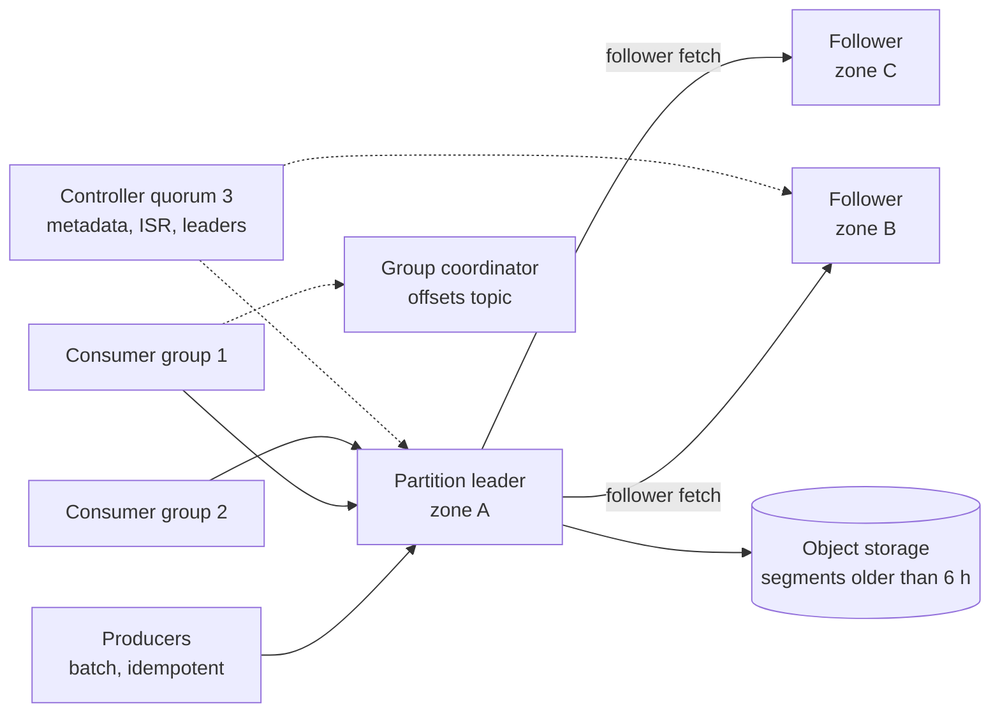
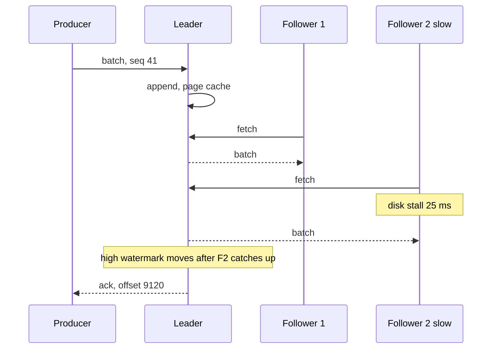
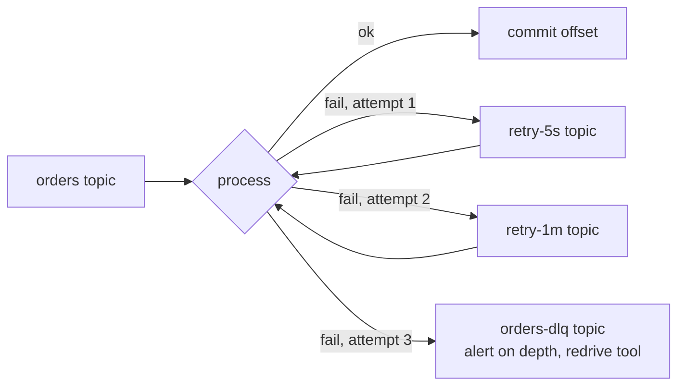

# 031 — Distributed Message Queue: Full System Design Solution

## Goal and contract

A **partitioned, replicated, append-only log** (for example Kafka, per the 2011 Kafka paper by Kreps, Narkhede and Rao and the Apache docs) with consumer-managed offsets, plus a small **queue-semantics layer** (retry tiers, dead-letter queue, delay) built on top. The contract:

- `publish` returns only after the message is in at least 2 zones' replicas (`acks=all`, replication factor 3, `min.insync.replicas=2`). One zone can be lost with no lost acknowledged message and publishing stays available.
- **Ordering per key**, not global: a key maps to one partition, and a partition is read in write order.
- **At-least-once** by default. Exactly-once *effect* is opt-in per consumer and needs an idempotent sink. Nothing here makes a payment API run once by itself.
- Replay by offset or timestamp for 7 days.
- Not promised: order across partitions, delay precision finer than the smallest tier, or publishing with two zones gone.

The one hard decision is **log versus broker-per-message queue** (Deep dive 1). We choose the log because one replicated append per batch of about 100 messages is far cheaper than one replicated state change per message per subscription.

## Estimates

Constraints from the question; (assumed) marks our numbers. Block [26](../building_blocks/26_distributed_log_internals.md) has the mechanics, so this is the arithmetic for this workload.

| Quantity | Arithmetic | Result | So we need... |
|---|---|---|---|
| Ingest | 1,000,000 × 1 KB; average 0.4 × peak | 1 GB/s peak, 0.4 GB/s = 34.6 TB/day | Disk from the average, network and CPU from the peak. |
| Retained | 34.56 TB × 7 days; × RF 3 | 242 TB, 726 TB replicated | Disk binds. Compression (3× on JSON, assumed) is a cost lever, not in the base plan. |
| Brokers by disk | 726 / (24 TB × 0.65 fill) = 46.5 | **48 brokers**, 16 per zone, 63% full | Also 726 TB / 1 GB segments × 3 files = 2.2 M files, 45,000 open files per broker: raise `ulimit`. |
| Network | Ingress 1 GB/s; egress = 2 follower fetches + 3 groups = 5 GB/s; brokers see 3 in, 5 out | 63 MB/s in, 104 MB/s out per broker = 8% of 10 GbE | Network is not a constraint. |
| Cross-zone bytes | Replication 2 GB/s + producers 2/3 × 1 + consumers 2/3 × 3 | 4.7 GB/s peak, 161 TB/day at average | The bill line. Fetch-from-closest-replica (KIP-392) removes the consumer 2 GB/s: 92 TB/day. |
| Partitions | 50 heavy topics carry 80% (assumed) = 800 MB/s. Produce bound 800 / 10 = 80. Consumer bound (2,500 msgs/s = 2.5 MB/s per consumer, assumed) 800 / 2.5 = 320, × 2 growth = 640. Tail 4,950 topics × 3 = 14,850 | **15,490 partitions**, 46,470 replicas | 968 replicas and 323 leaders per broker, and a floor of 3 per topic: fewer would not spread leaders or allow parallel consumers. |
| Re-replication | A broker holds 15 TB. Spread over 47 peers: 322 GB each at 200 MB/s (assumed) | 27 min. One replacement broker at 0.8 GB/s: 5.3 h | Rebuild by spreading. That exposure window is why per-broker density is capped. |
| Page cache | 64 GB / (3 GB/s replicated ingest / 48 = 62.5 MB/s) | 1,024 s = 17 min of tail | Consumers more than 17 min behind read from disk. |
| Tiered (6 h local) | 0.4 GB/s × 21,600 s × 3 = 26 TB local; cold 233 TB single copy in object storage | Brokers then set by replicas per broker | 46,470 / 18 = 2,580 replicas, 1.4 TB local each: **18 brokers** (6 per zone) instead of 48. |
| Offset commits | 3 groups × 15,490 = 46,470 (group, partition) pairs / 5 s | 9,300 commits/s, about 0.9 MB/s | At a 1 s interval it is 46,470/s, 4.6% of message rate. |

## API

```text
POST /topics/{t}/messages   [{key, value, headers, id?, deliver_at?}]  → [{partition, offset}] | per-item error
POST /groups/{g}/poll       {topics, max_records, max_wait_ms}         → {records[], generation}
POST /groups/{g}/commit     {offsets: {topic-partition: offset}, generation} → ok | REBALANCE_IN_PROGRESS
POST /groups/{g}/seek       {topic-partition, offset or timestamp}     → ok
POST /topics {name, partitions, retention_ms, tenant} → ok | QUOTA_EXCEEDED
```

- **Idempotency.** A `producer_id` plus per-partition sequence number lets the broker de-duplicate retries within a session. A client retrying after a restart supplies `id`, which the consumer de-duplicates on.
- **Errors.** `NOT_LEADER{hint}` (refresh metadata), `NOT_ENOUGH_REPLICAS` (below min ISR), `THROTTLED{retry_after}`, `MESSAGE_TOO_LARGE` (1 MB cap).

## Data model

| Entity | Fields | Where it lives |
|---|---|---|
| Partition log | segments (~1 GB each with offset and time indexes), `leader_epoch`; records hold `offset`, `timestamp`, `key`, `value`, `headers`, `producer_id`, `seq` | Broker disk, RF 3, rack-aware. Source of truth for messages |
| Committed offsets | `(group, topic, partition) → offset` | Internal compacted topic, partitioned by group. Source of truth for progress |
| Metadata | topics, partitions, replicas, ISR, configs, quotas | Raft-replicated controller log (15,490 × 200 B = 3 MB). Segments older than 6 h move to object storage |

The **partition key** is `hash(message key) mod partition count`. A partition is the unit of order, parallelism and replication, and the group-coordinator key is `hash(group)`.

## Architecture



**Write walk.** The client batches for `linger` (2 ms, assumed), hashes the key to a partition and sends to the cached leader. The leader appends to page cache, followers fetch, the leader advances the **high watermark** once every in-sync replica has the batch, and acks. On `NOT_LEADER` the client refreshes metadata and retries with the same sequence number.

**Read walk.** A consumer polls at its offset and sees only records at or below the high watermark: from page cache when tailing, from disk or object storage when lagging. It processes, then commits the offset to the coordinator.

## Deep dive 1: log versus broker-per-message queue

| | Log (Kafka-style) | Broker-per-message queue (SQS, RabbitMQ style) | Hybrid |
|---|---|---|---|
| Consumer state | One offset per partition | Per-message: in flight, visibility timeout, acked | Per-message ack on a log (Pub/Sub, Pulsar shared subscriptions, Kafka share groups per KIP-932, check status) |
| Broker cost per message | Sequential append, amortised across a batch | Bookkeeping and an ack per message and subscription | Higher than a log |
| Replay | Yes, any retained offset | No: deleted on ack | Usually yes |
| Ordering | Per partition | Best effort, or FIFO groups | Per key when enabled |
| Poison message | Stalls its partition | Redelivered independently, then DLQ | Independent |
| Fan-out to 3 groups | One copy, 3 offsets | 3 queues, 3 copies | One copy |

Numbers: acks as state writes would be 3 M deliveries/s against 9,300 offset commits/s for the log, **322× more** replicated writes. Choose the log → throughput, replay, per-key order and cheap fan-out → head-of-line blocking and no native delay or per-message retry (SQS has `DelaySeconds`, capped at 15 min per its docs) → recovered with retry tiers, a DLQ and a delay service (Deep dive 4). If the workload were a job queue with no replay and no order, I would buy SQS or Pub/Sub and not run brokers.

## Deep dive 2: partitioning and ordering

- **Key to partition** by hash, so per-key order holds while the partition count is fixed. **Adding partitions remaps keys** (documented in Kafka), so the count is a one-way door: we provision 2× headroom (640 for the heavy topics) rather than resize. To grow anyway, create a new topic with more partitions, drain the old, then cut over, which keeps per-key order.
- **A partition tops out near 10 MB/s (assumed), about 10,000 messages/s.** A hotter key cannot be ordered on one partition: key by the entity that needs order (per order, not per tenant) or split it ([block 25](../building_blocks/25_partitioning_and_hot_keys.md)).
- **Ordering under retries** needs the idempotent producer (sequence numbers, at most 5 in flight); otherwise a retried batch can land after its successor.
- **Consumer parallelism is capped at the partition count**: 640 partitions is 640 useful consumers, which is why the count comes from the consumer bound (320), not the produce bound (80).

Budget: 15,490 partitions / 200 tenants = 77 per tenant on average, enforced as a quota, because each partition is a fixed cost in files, memory and controller work (Confluent guidance of roughly 4,000 partitions per broker under ZooKeeper; KRaft was designed to raise this ceiling: verify for your version).

## Deep dive 3: replication, durability and publish latency



| Option | Copies at ack | Ack latency | Failure |
|---|---|---|---|
| `acks=1` | 1 (leader) | Fastest | Leader dies before followers fetch: acked messages lost |
| `acks=all`, min ISR 2, RF 3 (chosen) | 2 or 3 zones | Slowest ISR member | ISR below 2: writes rejected (consistent, unavailable) |
| Quorum ack, 2 of 3 (BookKeeper-style ack quorum, Pulsar docs) | 2 | Second-fastest of 3 | Needs a second storage system |

**Tail arithmetic.** Assume each replica stalls beyond 20 ms on 1% of requests (assumed). Waiting for both followers (`acks=all`) hits a stall with probability 1 − 0.99² = **2.0%**, which breaks a p99 target. A 2-of-3 quorum needs both followers slow: 0.01² = **0.01%**. So `acks=all` needs the ISR to shrink quickly: we set `replica.lag.time.max.ms` to 10 s (default 30 s, assumed acceptable) and page on ISR churn. If measured p99 still exceeds 20 ms, we move the data path to quorum-ack.

Latency budget: linger 2 ms + network 0.5 + leader append 0.1 + follower fetch 1 + ack 0.5 = about 4 ms p50 (assumed), so 20 ms leaves room for one stall but not a chronically slow disk.

**No fsync per batch.** Durability comes from replication across zones, not flush (as in the Kafka docs). The cost: a simultaneous power loss in two zones can lose what the OS had not written back, about ingest × writeback interval (1 GB/s × 5 s = 5 GB at peak, assumed), which is outside the stated contract. **Unclean leader election stays off**: an empty ISR waits rather than losing committed messages.

## Deep dive 4: consumer groups, offsets and delivery semantics

**Groups.** A coordinator (the broker leading the offsets-topic partition for `hash(group)`) tracks members. Rebalance modes are in [block 26](../building_blocks/26_distributed_log_internals.md); we use cooperative or KIP-848 assignment and static membership for deploys. **Commit after processing**, every 5 s or 1,000 records: at an average of 65 msgs/s per partition a crash repeats about 325 messages, but a 10,000 msgs/s hot partition repeats 50,000, so handlers must be idempotent regardless.

| Level | How | Holds for | Does not hold for |
|---|---|---|---|
| At-most-once | Commit, then process | Lossy telemetry | Anything you cannot lose |
| **At-least-once** (default) | Process, then commit | Idempotent handlers | Side effects that are not idempotent |
| Exactly-once in the log | Idempotent producer + transactions + `read_committed` | Consume-transform-produce inside one cluster | External systems |
| **Exactly-once effect** at a sink | Write result and offset in one DB transaction, or a unique `(partition, offset)` key or message `id` | A consumer that owns a transactional sink | Sinks with no idempotency key |

Cluster-wide de-duplication is not feasible: 16-byte IDs at the 0.4 M msgs/s average is 553 GB for a 24 h window and 3.9 TB for 7 days. It belongs at the sink of the consumers that need it.



**Retry and delay tiers.** Each tier topic has one fixed delay, so due order equals arrival order: the tier consumer sleeps until `head.timestamp + delay` and pauses the partition, with no per-message timer (the retry-topic and DLQ pattern in Uber's 2018 engineering post on reliable reprocessing). Permanent errors skip the tiers and go straight to the DLQ. **Delay up to 7 days:** tiers (5 s, 1 min, 10 min, 1 h) cover short delays; longer ones go to a timer store keyed by `due_time` that publishes when due. Chaining tiers up to 1 day would take about 12 hops for 7 days: at an assumed 1% delayed traffic (10,000/s) that is 120,000 extra messages/s, 12% of peak, hence the timer store.

## Deep dive 5: multi-tenancy and the metadata plane

**Quotas.** Enforce per tenant, per broker: produce bytes/s, fetch bytes/s and request-time percentage, throttling by delaying the response (Kafka client quotas, documented), plus limits on partitions per tenant (77 average), topics, message size (1 MB) and topic-creation rate. Provisioned quotas sum to at most 1.5× capacity, 1.5 GB/s (assumed), because tenants do not peak together; the default share is 1 GB/s / 200 = 5 MB/s.

| Noisy neighbour | Effect | Control |
|---|---|---|
| Produce burst | Broker CPU and disk saturate | Byte-rate and request-time quotas, throttle at the broker |
| Backfill consumer reading old data | Evicts the 17-minute page-cache tail for everyone | Fetch quota, cold reads served from object storage, not brokers |
| Heavy tenant | Skews leaders and disks | Rack-aware balancing (for example Cruise Control), dedicated broker sets above a threshold |

**Metadata plane.** A 3-controller Raft quorum (one per zone) holds topics, ISR and leaders (KRaft, KIP-500). It is off the data path: clients cache metadata and refresh on `NOT_LEADER`, so leaders keep serving if the controllers are down, but no failover or topic change can happen. Losing a broker moves its 323 leaders in a batch.

## Failure behaviour

| Failure | Behaviour |
|---|---|
| Broker crash | Controller elects leaders from the ISR in batches. Producers retry after a metadata refresh. Re-replication is spread over peers (27 min). |
| Zone loss | Each partition keeps 2 replicas, min ISR 2 still holds, so writes continue with zero slack. A second failure rejects writes for affected partitions: page. |
| Slow disk or follower | ISR shrinks after 10 s, p99 spikes until then. Alert on ISR shrink rate and per-broker disk latency. |
| Controller quorum lost | Data plane continues. No leader elections, topic changes or quota changes: page. |
| Poison message | Consumer retries, then DLQ. Partition advances. Alert on DLQ depth. |
| Region loss | Asynchronous mirror to a second region: RPO equals mirror lag. Offsets need translation. |
| Bad deploy | Roll one zone at a time, in batches of 4 brokers, gating each on zero under-replicated partitions: 16 / 4 × 3 zones = 12 waves of about 15 min, 3 h. At most one replica of any partition is down, so `min ISR 2` holds. |

## Observability and interview close

- **SLIs:** publish p99 by tenant, error and throttle rates, under-replicated and under-min-ISR partitions, ISR shrink rate, consumer lag in seconds, DLQ depth, disk and page-cache hit ratio, request-queue time, controller health.
- **The one paging alert:** any partition under `min.insync.replicas` for 2 minutes. That is the moment the durability-and-availability contract is broken, whatever the cause. Under-replicated partitions and lag are tickets.

Trade-off to state: "I chose a partitioned replicated log with consumer-managed offsets over a broker-per-message queue, because at a million messages a second one replicated append per batch beats one replicated ack per message per subscription, and replay comes free. The price is head-of-line blocking per partition and ordering only within a key, which I recover with retry tiers, a DLQ and a timer service."

## Follow-ups the interviewer will ask

1. **"How do you do multi-region?"** One cluster per region, because an `acks=all` write across regions would put a 60 to 100 ms round trip in every publish and break the 20 ms target. Mirror asynchronously to a second region (documented cross-cluster replication), with RPO equal to mirror lag and offset translation for consumers. Active-active means the same key may be written in two regions, so choose a home region per key ([block 27](../building_blocks/27_multi_region_and_global_traffic.md)).
2. **"What changes at 10× and 100×?"** At 10× ingest is 10 GB/s, 7.3 PB replicated, about 155,000 partitions and 480 brokers if disk-bound (180 with tiering). One cluster that large stresses metadata, so split into cells of at most about 100 brokers by tenant class, behind a routing layer. At 100× the cross-zone bill and object-storage tiering dominate the design.
3. **"Can you give global ordering or exactly-once end to end?"** Global order means one partition (10 MB/s): only for small control streams. End-to-end exactly-once needs the sink to take part (result and offset in one transaction), which is what "exactly-once effect" means here.
4. **"What does it cost?"** Disk (726 TB, or 26 TB local plus 233 TB object with tiering), cross-zone bytes (161 TB/day, 92 with follower fetch) and broker count. Levers: 3× compression, tiering (48 to 18 brokers), follower fetch, shorter retention for low-value topics.
5. **"How do you stop abuse?"** The quotas above plus per-tenant dashboards. The classic bomb is a tenant creating thousands of partitions, which costs files and controller time long before it costs bytes.
6. **"Why not just use SQS?"** For a job queue with no replay or per-key order and modest volume, do: zero operations. Here we need replay, three-way fan-out, per-key order and 1 M msgs/s; check current quotas and prices before quoting them. If the interviewer insists, use it for the delay and retry paths only.
7. **"Consumer lag is growing. What do you do?"** One partition means a poison message or hot key; all partitions mean capacity. Convert lag to drain time, check for rebalance churn, add consumers up to the partition count, and beyond that the fix is more partitions on a new topic.

## Common mistakes

1. **Sizing partitions from produce throughput only.** The consumer bound was 320 against 80 here, and the count is a one-way door for keyed order.
2. **`acks=all` with `min.insync.replicas=1`, or min ISR equal to RF.** The first can ack a single copy, the second halts on one broker failure. RF 3 with min ISR 2 is the pair.
3. **Promising exactly-once to an external system.** Retries duplicate. Use an idempotency key or store the offset with the effect.
4. **Committing before processing, or auto-commit with slow handlers.** Commit-first loses messages on a crash, and slow batches trigger rebalances. Process, then commit, and bound `max.poll` work.
5. **No dead-letter path.** One malformed message stalls its partition forever. Cap attempts, park it, alert on depth.
6. **Sizing brokers by network alone.** Network here is 8% of 10 GbE while disk sets 48 brokers. Compute disk, network, replicas per broker and zone-loss headroom, and take the maximum.
7. **Claiming order across partitions**, or unbounded in-flight requests without idempotence, so retries reorder.
8. **Ignoring the noisy neighbour.** Without quotas one backfill or burst degrades every tenant.

## Going from L5 to L6

- **Build vs buy.** Buy (a managed Kafka, Pub/Sub or similar) unless cost at this volume, compliance or tenancy control justify running brokers. If you run them, the product is the platform: self-service topic provisioning, quotas, schema registry, DLQ and redrive tooling, lag dashboards.
- **Migration and rollout.** Mirror old to new, migrate consumers first (they can re-read), then producers per topic. Roll brokers by zone with the gate above.
- **Blast radius.** Cells by tenant class (critical, bulk), a controller quorum per cell, and no shared topic for control and bulk data.
- **Cost model.** Price per million messages and per TB-month; show the cross-zone line (161 TB/day) and the tiering switch (48 to 18 brokers).
- **Measure first.** Key-skew and message-size histograms, the lag distribution, consumer processing time per message (it sets partition counts), and the share of topics that need order, replay or delay.
- **Phased evolution.** One region, RF 3, retry and DLQ; then tiering, quotas and cells, then mirroring, and delay only where a team needs it.

## Build exercise

Build an in-process broker with partitioned logs, a leader plus two fake followers with injectable delay and crash, an idempotent producer, consumer groups with commits, and retry-tier and DLQ consumers on a fake clock.

- `test_same_key_same_partition_preserves_order`: publish 1,000 messages for 10 keys and assert each key's sequence is in order on read.
- `test_acked_message_survives_leader_crash`: with `acks=all` and min ISR 2, crash the leader after ack and assert the message is on the new leader.
- `test_write_rejected_below_min_isr_and_no_unclean_election`: kill two replicas, assert `NOT_ENOUGH_REPLICAS` and no committed message lost.
- `test_idempotent_producer_dedupes_retry`: resend a batch with the same sequence and assert one copy.
- `test_commit_after_process_repeats_at_most_the_uncommitted_window`: crash between process and commit, assert the redelivery count equals the window.
- `test_poison_message_reaches_dlq_and_partition_advances`: three failures, then a DLQ entry and the next message processed.
- `test_delayed_message_not_delivered_early`: nothing before `deliver_at`, delivery within one tier of it.
- `test_quota_throttles_noisy_tenant_only`: a burst from tenant A is throttled while tenant B's p99 is unchanged.
