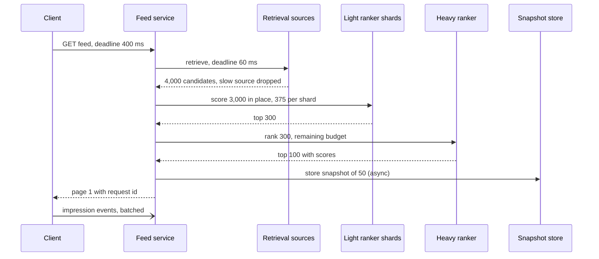

# 032 — Ranked Home Feed: Full System Design Solution

## Goal and contract

Choose and order the posts a user sees, from followed accounts and from recommendations, inside a hard deadline. Fanout plumbing is [007](007_news_feed_solution.md); the generic funnel, feature and logging theory is [31_ranking_recommendation_and_experimentation.md](../building_blocks/31_ranking_recommendation_and_experimentation.md). This page applies it to 500M daily users and a 400 ms p99.

- **Always answers in time.** A feed load returns within the deadline at some quality rung; a slow ranker lowers quality, never availability.
- **Hard filters are absolute.** Blocked, muted, policy-violating and already-seen posts never appear. They are filters, not model features.
- **Stable paging.** Pages come from a session snapshot: no repeats, no skips.
- **Objective.** `value = Σ wᵢ · pᵢ` over predicted actions (like, comment, share, long dwell, minus hide and report). The weights are product policy set by experiments, not learned.
- **Not promised:** the same order twice, or that new engagement changes an issued snapshot.

The hard decision: ranking cost is candidates × per-item cost and the budget is a deadline, so how many items each stage sees is the design.

## Estimates

Assumptions (ours): 5×10^8 DAU, 10 loads per user per day, peak 2.5× average, 20 viewed items per load, snapshot of 50 items with page size 10, 10^8 new eligible posts per day, 3 days recommendable, 300 heavy features per candidate, and the per-item costs in the table (to benchmark).

| Quantity | Arithmetic | Result | So we need |
|---|---|---|---|
| Loads | 5×10^8 × 10 ÷ 86,400 = 58k/s, × 2.5 | 145k/s peak | Everything below scales from this |
| ANN corpus | 10^8 × 3 days = 3×10^8 items × 256 B (128-dim fp16) | 77 GB, 8 shards of 9.6 GB | Every load queries all shards: 145k × 8 = 1.16M shard-queries/s ÷ 1,400 per core (assumed) = 830 cores, about 1,700 at 50% |
| Heavy stage volume | 145k × 300 items | 43M scores/s | CPU at 250 µs each: 10.9k busy cores. An accelerator at an assumed 250k scores/s: 174 at 100%, 350 at 50%. Recommendation models are embedding-heavy (DLRM, Naumov et al., 2019), so measure |
| Snapshots | 50 ids × 24 B = 1.2 KB; TTL 30 min; 58k/s × 1,800 = 104M live (260M at peak) | 125 GB, 313 GB at peak | A sharded in-memory store, 5 nodes of 64 GB at peak, replicated |
| Impression log | 5×10^9 loads × 20 viewed = 10^11/day × 100 B | 10 TB/day, 116 MB/s | Always log |
| Feature log | 5×10^9 × 20 × 300 × 2 B = 60 TB/day; 10% of requests | 6 TB/day | Sample; never log all 50 snapshot items (150 TB/day) |
| Engagement events | 5×10^8 × 100/day | 580k/s, 1.4M/s peak | A stream job for counters, fresh in minutes |

**The cascade** (counts are ours; costs are assumptions to benchmark):

| Stage | In → out | Cost per item | p99 budget | CPU per request |
|---|---|---|---|---|
| Context (user features, seen set) | 1 user | KV reads, parallel with retrieval | 20 ms | 5 ms |
| Retrieval, 5 sources in parallel | 3×10^8 → 4,000 raw | index lookups | 60 ms (deadline) | 25 ms |
| Merge and hard filters | 4,000 → 3,000 (about 25% dropped, assumed) | lookups | 15 ms | in retrieval |
| Light ranker, 8 data-local shards | 3,000 → 300 | 10 µs | 25 ms | 30 ms |
| Real-time features | 300 items | cached multi-get | 20 ms | 5 ms |
| Heavy ranker, batched | 300 → 100 | 250 µs | 90 ms | 75 ms |
| Blend, diversity, integrity re-check | 100 → 50 | rules | 15 ms | 5 ms |
| Hydrate page 1 (10 posts) | 10 | cache reads | 30 ms | 5 ms |

Stage p99 budgets sum to 275 ms of 400, leaving 125 ms for about eight network hops and tail (summing p99s is pessimistic). CPU is 145 ms per load, so 145k × 0.145 = 21k busy cores, 42k at 50% utilisation. So: (1) the heavy ranker is 52% of CPU and the candidate count entering it is the dial (each extra 100 candidates is 145k × 100 × 250 µs = 3,600 busy cores); (2) scoring all 3,000 with the heavy model would be 145k × 3,000 × 250 µs = 108k busy cores, which is why the cascade exists; (3) under load you shrink N per stage before failing a load.

**Feature-fetch bandwidth.** Naively each load pulls 300 × (600 B static + 64 B counters) = 199 KB, so 145k × 199 KB = 29 GB/s (231 Gbps). With item features cached in the ranker (assumed 95% hit for static, 80% for counters with a 10 s TTL) plus 4 KB of user features it is about 17 KB per load: 2.4 GB/s (19 Gbps). So caches in the ranker are required, not optional.

## API

```text
GET  /v1/feed?session_id&cursor&limit=10&client_ctx → {items[], next_cursor, request_id, snapshot_id, degraded_rung}
POST /v1/feed/events   [{event_id, request_id, item_id, position, type, viewport_ms, ts}]   # batched
409 STALE_CURSOR → client starts a new session (pull-to-refresh)
internal: Retrieve(user_ctx, source, deadline) → [(item_id, source, score)]
          Rank(stage, user_ctx, candidates, deadline) → [(item_id, scores)]
```

- **Cursor** is `(snapshot_id, offset)`. Pages 2 to 5 read the snapshot and hydrate; they never re-rank. Near the end, the client asks for a continuation: the cascade runs again excluding the snapshot's ids.
- **Events** are idempotent by `event_id` (mobile retries), batched, and carry `request_id` so an impression joins to exactly what was served.
- **Degradation is a field, not an error.** `degraded_rung` is in the response and the log; the only error is `OVERLOADED` from admission control.

## Data model

- `snapshot`: key `(user_id, session_id)` → `{snapshot_id, model_version, items[(post_id, score, source)]}`, TTL 30 min, replicated twice.
- `item_static` and `item_counters`: keyed by `item_id` and sharded by it. Static fields are an embedding, author, format and integrity labels; counters are windows over 1 minute, 1 hour and 1 day. Light features (about 80 B per item, 3×10^8 × 80 B = 24 GB, 3 GB per shard) live in the light-ranker shards themselves.
- `user_features`: keyed by `user_id`; embedding, last 50 interactions, preferences. `seen`: a Bloom filter of the last 1,000 served ids, 1.25 KB at 10 bits per id (about 1% false positives, which drop an unseen post) × 5×10^8 = 0.6 TB.
- Logs: `request_log` (per-stage counts, sources, latencies, rung, model and experiment ids), `impression_log`, sampled `feature_log`.
- **Partition keys:** user id for user-side data, item id for item-side data and ANN shards. **Source of truth:** the post store and the event log; everything above is derived and rebuildable.

## Architecture

```arch
%% caption: Each stage sees fewer items and costs more per item, and every stage logs its counts so the cascade can be tuned and degraded.
grid 140x115
node U "Feed request" at 2,0 icon=mobile shape=pill
node CTX "User context" at 4,0 icon=user sub="seen set, parallel"
group ret "Retrieval: five sources in parallel" color=blue icon=search
node S1 "In-network" at 0,1 in ret icon=users sub="1,000"
node S2 "ANN" at 1,1 in ret icon=vector sub="1,500"
node S3 "Social signal" at 2,1 in ret icon=graph sub="500"
node S4 "Co-engagement" at 3,1 in ret icon=link sub="500"
node S5 "Fresh + explore" at 4,1 in ret icon=idea sub="500"
group cas "Ranking cascade" color=purple icon=filter
node M "Merge, hard filters" at 2,2 in cas icon=filter sub="4,000 to 3,000"
node LR "Light ranker" at 2,3 in cas icon=model sub="3,000 to 300"
node HR "Heavy ranker" at 2,4 in cas icon=llm sub="300 to 100"
node BL "Blend + diversity" at 2,5 in cas icon=sort sub="100 to 50"
node SN "Snapshot store" at 1,6 icon=kv
node P "Page 1: 10 posts" at 2,6 shape=pill color=green
node LOG "Impression + feature logs" at 3,6 icon=logs
U -> CTX
U:B -> S1:T
U:B -> S2:T
U:B -> S3:T
U:B -> S4:T
U:B -> S5:T
S1 -> M
S2 -> M
S3 -> M
S4 -> M
S5 -> M
CTX:R -> LR:R
M -> LR -> HR -> BL
BL -> SN
BL -> P
BL ..> LOG : "items, scores, features"
```



**Read.** The feed service starts context reads and all five retrievers at once, each with a deadline. It unions candidates by post id (tagging the source), applies hard filters once (seen, blocked or muted via the [social graph](039_social_graph_service_solution.md), integrity, age), scatters ids to the light-ranker shards, fetches real-time features for the top 300, calls the heavy ranker, blends, writes the snapshot and hydrates page 1.

**Feedback.** The client sends viewability and engagement events to a log, which feeds a stream job (counters, within minutes) and a joiner that builds training rows (below).

## Retrieval: in-network plus out-of-network

| Source | Candidates | How | Why it exists |
|---|---|---|---|
| In-network | 1,000 | Push refs plus pull for celebrity authors ([007](007_news_feed_solution.md)) | Follow intent, high precision |
| Two-tower ANN | 1,500 | User embedding against item vectors, 8 shards | Personalised discovery |
| Social signal | 500 | Posts friends engaged with, from a capped 2-hop read of the graph service | Social proof |
| Co-engagement | 500 | Precomputed item-to-item lists | Cheap and explainable |
| Fresh and explore | 500 | New items under an impression cap, per-locale trending | Cold start, fallback |

Retriever scores are not comparable (a cosine against a co-visit count), so do not sort the union by them: give each source a quota, drop a source that misses its deadline (and count it), and let the rankers decide, with the source as a feature. Tune quotas by each source's share of shown items. Twitter's 2023 open-sourced recommendation write-up and Instagram's 2019 Explore blog describe the same shape (sourcing, a lighter model, a heavier model, then filters and mixing); check counts before quoting them.

New posts must be recommendable in minutes, so index a small "fresh" ANN segment via streaming upserts and merge it with the daily base. **Integrity gate (ours):** out-of-network candidates need a "classified and eligible" flag before they can be recommended (target classifier latency p95 under 60 s), while in-network posts show immediately to followers with a lighter check.

## The cascade: light ranker and heavy ranker

**Light ranker, data-local.** Pulling 3,000 × 80 B = 240 KB of features per load would be 35 GB/s. Instead ship the 24 KB of ids to the shards that own those items' light features (375 ids each, 3.75 ms of CPU per shard), score in place and return only scores. Train it to imitate the heavy ranker (distillation) and monitor its recall: the share of the heavy top 100 that survives into the light top 300. That recall caps what the heavy stage can find.

**Heavy ranker.** A multi-task network predicting p(like), p(comment), p(share), p(dwell), p(hide) and p(report), combined as above, run as one batch per load with a deadline. Keep scores calibrated (check calibration by bucket) because they are summed with weights. Diversity and the in/out-of-network mix are re-rank constraints, not model features.

## Feature serving and training/serving consistency

| Class | Example | Freshness | Path |
|---|---|---|---|
| Static | Author, category, embeddings | Daily | Batch, cached in rankers |
| Real-time | Item likes in the last hour, hides per 1,000 impressions | Under 2 minutes | Stream job over 1.4M events/s, 10 s cache in the ranker |
| Sequence | User's last 50 interactions | Seconds | Event log, read per request |
| Cross and context | User × author affinity, time of day | Request time | Computed in the model |

Train and serve diverge through different code, different freshness, and leakage. Example of leakage: the label is "liked within 5 minutes" and an offline `likes_1h` computed at end of day includes that like, so offline AUC soars and online gains vanish.

- **Log at serve (Rules of Machine Learning, rule 29):** the ranker writes the exact feature vector of each served item, keyed `(request_id, item_id)`. Training reads what the model saw, so skew is absent by construction. It is costly (60 TB/day for viewed items), so keep 10% of requests and all exploration slots: 6 TB/day.
- **Point-in-time join** for slow features: feature tables carry `valid_from`, and a row for an impression at time t takes each feature's latest value at or before t. It is cheap but leaves skew wherever batch and stream logic differ, so define each feature once and run that definition on both paths.
- **Guards:** compare each feature's online and training distribution daily, and replay logged requests through the offline model: the score must match the logged one within tolerance. A missing feature gets a default plus a null mask, and a missing user vector drops the load to the light ranker.

Decision: log-at-serve for volatile features, as-of joins for slow ones.

## Precompute, caching and stable pagination

| Option | Gives | Costs |
|---|---|---|
| Precompute every feed | Flat load, millisecond serve | If 60% of precomputed feeds are consumed, 5×10^9 ÷ 0.6 = 8.3×10^9 runs per day (1.67× compute), hours stale, blind to session context |
| On-demand each load | Freshest, no waste | 21k busy cores at peak, latency risk |
| Hybrid (chosen) | Cache retrieval and light-ranker output per user for 5 minutes, run the heavy ranker and blend on demand, snapshot per session | Assuming 40% of loads repeat within 5 minutes, saves 0.4 × 55 ÷ 145 = 15% CPU for 17M entries × 3.6 KB = 63 GB, at up to 5 minutes' candidate staleness |

Do not cache the final slate across sessions: seen sets and context change. The session snapshot (125 GB at average, 313 GB at peak) gives stable pages; refresh starts a new one, suppressing ids in the Bloom filter. Snapshot loss is a cache miss: the user gets a fresh ranking.

## Exploration and cold start

The budget arithmetic drives the design: 10^11 impressions per day × 5% exploration = 5×10^9. At a first stage of 100 impressions per new item, that funds 5×10^7 items, half of the 10^8 posted daily. So prioritise stage-one exposure by prior quality (creator history, content embedding, classifier score), and promote to a second stage (about 1,000 impressions) only on early positive signals.

- **Slots:** reserve about 5% of slots for items under 24 hours old with an impression cap, drawn by Thompson sampling or ε-greedy, and log the propensity of every exploratory slot so it can train an unbiased model.
- **New users:** popularity by locale and device plus onboarding interests until they have about 20 events, then the personalised retrievers. **New creators:** reserved slots, capped per creator.

Trade-off: exploration costs some engagement now for unbiased data and creator supply later; a long-term holdout must justify it.

## Logging and feedback loops

Log the impression, not just the click: `request_id`, item, position, model version, source, score, and a client viewability event ("served" is not "seen"). Join labels with a waiting window (fast labels such as like and hide within 30 minutes, watch time at session end, retention days later). Handle **position bias** by feeding position in training and fixing it at serve, and **selection bias** by keeping 1 to 2% randomised slots with propensities. Feedback loops (shown, so clicked, so shown more) are countered by exploration, an example-age feature, diversity caps and long-term holdouts. Cadence: counters in minutes, hourly incremental updates of the top layers, daily full retrain.

## Slow-ranker fallbacks

Deadlines are absolute and passed down. If less than 100 ms remains when the heavy stage would start, skip it. Hedge a heavy-ranker call after its p95, which adds 5% of load (7,200 requests/s) and cuts the tail (*The Tail at Scale*, 2013). The ladder is triggered by the deadline and by load, not only by errors:

| Rung | Trigger | Behaviour | CPU per load |
|---|---|---|---|
| 0 | Normal | Full cascade | 145 ms |
| 1 | CPU above 80% or p99 near budget | Shrink N: retrieval 3,000 → 1,000, heavy 300 → 100 | 75 ms (−48%) |
| 2 | Heavy ranker slow or failing | Skip it, blend on light-ranker order | 70 ms (−52%) |
| 3 | Retrieval or light ranker down | Last good snapshot for this user (at most 6 hours old), re-filtered | about 5 ms |
| 4 | No snapshot | In-network by recency ([007](007_news_feed_solution.md)) plus per-locale popular | about 10 ms |

Each rung is exercised in game days and logged. Measure each rung's engagement loss by offline replay, not assumption. Overload policy: [28_overload_control_and_graceful_degradation.md](../building_blocks/28_overload_control_and_graceful_degradation.md).

## Failure behaviour

| Failure | Behaviour |
|---|---|
| One ANN shard | Replica serves; if all fail, drop the source and rebalance quotas |
| Real-time counter lag or outage | Serve stale counters, then defaults with a mask; alert on freshness |
| Heavy-ranker nodes lost | Rung 2 until capacity returns |
| Snapshot node | Replica serves; if both are lost, a new ranking |
| Region loss | Traffic shifts to another region that already holds ANN, model and feature replicas; in-flight events buffer and replay |
| Bad model | Shadow, then 1% canary with guardrails (hide and report rate); auto-rollback |
| Integrity pipeline backlog | Hold unclassified out-of-network items; in-network unaffected |

## Observability and interview close

SLIs: end-to-end p50 and p99; per-stage latency and candidate counts (n in, n out); source deadline-miss rate; rung distribution; light-stage recall of the heavy top 100; calibration by bucket; feature freshness, null rate and train/serve skew; log lag; guardrails (hides and reports per 1,000 impressions) and new-item exposure share.

The one paging alert: **p99 above 400 ms, or more than 1% of loads at rung 2 or worse, for 5 minutes**. Either means the cascade is spending more than its budget.

Trade-off to state: "I chose a cascade of 3,000 → 300 → 100 → 50 with the heavy ranker on demand and a session snapshot, because cost is candidates times per-item cost against a fixed deadline. The price is that the light stage's recall caps quality, a snapshot is stale for its 30 minutes, and each degraded rung costs engagement. At 100× I would move part of the heavy work to nearline precompute for the head of the distribution rather than widen the online cascade."

## Follow-ups the interviewer will ask

1. **"How does multi-region work?"** Each region holds ANN, model and feature replicas and serves its own users, since a cross-region hop would eat 100+ ms of the 400. Snapshots stay region-local, events ship to a central log for training, and global counters merge regional aggregates within the two-minute bound.
2. **"What changes at 10× and 100×?"** At 10× the busy-core count is 210k, so first cut N for low-engagement users, distil harder and quantise the heavy model. At 100× serve the head from nearline precompute (users cluster into shared candidate pools) and keep on-demand ranking for the tail.
3. **"A deleted or blocked post must vanish immediately."** Filters are read-time: hydrate re-checks visibility, the block edge comes from the graph service, and an integrity kill switch removes an item or author from all snapshots on the next page read. Never trust ids baked into a 30-minute snapshot.
4. **"What dominates cost?"** The heavy ranker at 52% of CPU. Levers: N into the heavy stage, distillation and quantisation, accelerators (174 to 350 devices versus 10.9k cores, to be measured), the 5-minute candidate cache (−15%), and sampled feature logs (6 versus 60 TB/day).
5. **"How do you handle abuse?"** Bots and engagement pods inflate counters, so trust-score events before counting and exclude flagged accounts from training; rate-limit refresh; keep integrity as hard filters with a kill switch; watch exposure concentration for gaming.
6. **"Why a cascade? One good model is simpler."** Scoring all 3,000 with the heavy model is 108k busy cores against 21k, and the extra candidates are mostly irrelevant. If the interviewer insists, widen the heavy stage as far as the budget allows and keep the light ranker as the safety net.
7. **"Offline AUC improved 1% and the experiment is flat."** Suspect leakage or skew (replay logged requests, check feature distributions), position bias, the light stage discarding the new model's picks, and novelty. Only a randomised online test decides a launch (block 31, Part 2).

## Common mistakes

1. **Scoring every candidate with the heavy model.** 108k busy cores. Give each stage a job, a count and a budget.
2. **Naming stages without numbers.** Say counts in and out, cost per item, wall clock and CPU per load.
3. **Logging clicks only.** No negatives, no propensities. Log impressions with position, model version and viewability.
4. **Rebuilding training features from the warehouse.** Label-time leakage. Log at serve, use as-of joins.
5. **Re-ranking on every page.** Scores drift, items repeat or vanish. Freeze a session snapshot.
6. **Sorting the merged candidate list by retriever score.** Scores are incomparable. Use quotas and let the rankers decide.
7. **Treating a slow ranker as an error.** Users see failures. Pass a deadline and degrade down a tested ladder.
8. **Optimising CTR alone, with no exploration arithmetic.** You get clickbait and a feedback loop. Use multi-action objectives, guardrails and a budgeted exploration slice.

## Going from L5 to L6

- **Migration and rollout.** Introduce the cascade in shadow: score in parallel, log both, compare offline, then ramp by traffic with the old ranking as rung 4. Each model goes shadow, canary, interleaving, experiment.
- **Cost model.** Price busy cores per stage (145 ms per load, 21k cores) and dollars per 1,000 loads; show the N dial, the accelerator comparison, and value per millisecond so each stage earns its budget.
- **Ownership and blast radius.** Separate owners for retrieval sources, rankers, integrity and the feature platform, with contracts for the candidate schema, deadlines and the feature registry. Model versions are scoped to experiment layers, so one bad model touches 1% of users.
- **Build versus buy.** Buy the vector index, feature store and model serving; build the orchestrator, blending and the fallback ladder, which encode the product.
- **Phasing and first measurements.** Chronological, then a light ranker, a heavy ranker, out-of-network sources, then exploration. Measure first: light-stage recall of the heavy top 100, per-source share of shown items, per-stage latency distribution, feature null rate and train/serve skew.

## Build exercise

Build a single-process cascade simulator with stub retrievers and rankers (configurable latencies and per-item costs), a Bloom-filter seen set and a snapshot store.

Named assertions:

- `test_cascade_counts_and_deadline`: with stub latencies within budget, a load returns page 1 in under 400 ms and logs counts of 4,000, 3,000, 300, 100 and 50.
- `test_heavy_skipped_when_budget_short`: with less than 100 ms remaining at the heavy stage, the result is ordered by light score and `degraded_rung = 2`.
- `test_slow_source_dropped_not_awaited`: a retriever over its deadline is absent from the union and counted.
- `test_snapshot_paging_no_dup_no_skip`: pages 1 to 5 from a snapshot are disjoint and cover all 50 ids even as new posts arrive.
- `test_seen_suppression_after_refresh`: a refreshed session contains no id from the previous snapshot.
- `test_point_in_time_join_excludes_future_counter`: a counter update after the impression time never appears in that training row.
- `test_serve_log_replay_matches_online_score`: replaying a logged feature vector reproduces the logged score.
- `test_exploration_slots_carry_propensity`: every exploratory slot has a logged propensity and every out-of-network item was classified.
