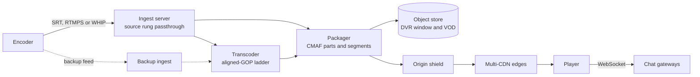
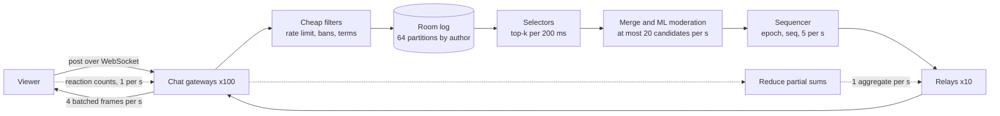

# 033 — Live Streaming and Live Comments: Full System Design Solution

## Goal and contract

Two coupled systems. **Video:** every live frame reaches viewers as identical, cacheable HTTP segments within a latency tier (under 10 s standard, under 3 s low-latency), and the CDN, not the origin, carries the audience. **Chat:** a live conversation whose delivery cost is bounded by how fast a human reads, not by how fast people post.

- Video is at-least-once and self-healing: a viewer may see a lower rung or a short stall, never a wrong frame.
- Chat is **at-most-once for display and durable for storage.** Accepted comments are logged. What viewers see is a sampled, sequenced feed that is identical for everyone in the room.
- Comments appear in sync with the video the viewer is watching, not ahead of it.

The hard decision is the comment fan-out. At 300K posts/s to 10M viewers, naive delivery is 90× the video traffic (estimates), so the design samples on the server and says so.

## Estimates

| Quantity | Arithmetic | So we need… |
|---|---|---|
| Ingest | 200K × 5 Mbps = **1 Tbps** (125 GB/s). 40 sites → 25 Gbps and 5,000 streams each. A server terminates 500 streams (2.5 Gbps, assumed): 10 per site, 20 with N+1 and skew | About 800 ingest servers in many small regional sites. Each stream is pinned to one server. |
| Who gets a ladder | Zipf s = 1 over 200K channels, 5M viewers outside the big event: top 20K (10%) hold H(20K)/H(200K) = 10.5/12.8 = **82%** of viewers, and the 20,000th channel has about 20 | Ladder for the top 10% plus the event. The other 180K get source-only passthrough until they cross about 20 viewers. |
| Transcode | 20K × 8 cores (assumed: decode plus 5 x264 rungs, fast preset) = 160K cores = 2,500 64-core servers. Hot standby for the top 500 = 4,000 cores | Ladders are compute per broadcaster. Transcoding all 200K would be 1.6M cores. |
| Egress | Event 10M × 4 Mbps = **40 Tbps**. Others 5M × 3 Mbps = 15. Total 55 Tbps. Capping the 8 Mbps rung at 5 Mbps for 20% of viewers saves 0.6 of 4 Mbps = 15% = 6 Tbps | The event alone is 80% of the whole 50 Tbps network of [036](036_content_delivery_network_solution.md). Use multi-CDN, and keep a brownout rung. |
| Requests | 90% standard (2 s segments): 0.5 segment/s + 0.5 playlist/s = 1 rps → 9M. 10% low-latency (0.33 s parts): 3 + 3 blocking reloads = 6 rps → 6M. Total **15M rps** | LL costs 6× the requests per viewer and 1M held requests. Cap it to a share of viewers. |
| Origin fan-out | Ladder 18.8 Mbps of unique bytes. 20 regional parents × 18.8 = 376 Mbps per CDN. 4 CDNs = **1.5 Gbps**. 40 Tbps ÷ 1.5 Gbps ≈ 26,600× | The origin is sized by CDN count, not viewers, if collapsing works. |
| Chat, naive | 300K × 10M = 3 × 10^12 deliveries/s × 150 B = 450 TB/s = **3,600 Tbps**, 90× the video | Impossible. Cap delivery by reading speed. |
| Chat, sampled | 5 msgs/s × 10M = 50M/s × 150 B = 7.5 GB/s = **60 Gbps** (0.15% of video). 100K sockets per gateway → 100 gateways at 0.6 Gbps | The last hop is the cost. The feed itself is 750 B/s. |
| Reactions | 2M taps/s. Client batches 1/s: uplink 40 MB/s, 20K msgs/s per gateway, 100 partial sums/s out. Downlink: 1 aggregate/s × 100 B × 10M = 8 Gbps | Aggregate, never sample. |
| Moderation compute | 300K/s × 1 ms = 300 cores, or × 30 ms = **9,000 cores**. Only displayed candidates (20/s) × 30 ms = 0.6 core | Cheap filters on everything, heavy models on what may be shown. |
| Recording | Mean 0.5 Tbps (half of peak, assumed) = 62.5 GB/s = **5.4 PB/day** source-only. 14 days = 76 PB, 106 PB at 1.4× erasure coding | Retention is the cost lever. Store the source rung, not the ladder. |

## API

```text
POST /v1/streams {channel_id, latency_tier}      → 201 {stream_id, ingest:[{proto:"srt", url, latency_ms:200}, …],
                                                          backup_ingest:[…]}   # 409 if channel already live
GET  /v1/streams/{id}/playback  → {manifest_url (signed, 5 min), tier, chat:{ws_url, room_id, token}}
GET  /live/{id}/{rung}/playlist.m3u8?_HLS_msn=812&_HLS_part=2     # LL-HLS blocking reload
GET  /live/{id}/{rung}/812.m4s   |   part_812_2.m4s

WS  →  {"t":"post","room":R,"cid":"<client uuid>","text":"…"}     ← {"t":"ack","cid":…} | {"t":"rej","reason":"slow_mode","retry_ms":3000}
WS  ←  {"t":"feed","seq":8123,"ts":<stream ms>,"msgs":[{id,user,text,badges,reply_to:{id,snip}}]}
       {"t":"del","ids":[…]}  {"t":"react","w":<sec>,"c":{"heart":812000}}  {"t":"viewers","n":9873000}
POST /v1/rooms/{id}/mod {"action":"delete|timeout|ban|slow_mode|blocked_terms", …}   Idempotency-Key
GET  /v1/vods/{id}/comments?from_ms=&to_ms=       # immutable 30 s chunks, CDN-cacheable
```

`cid` is deduplicated for 5 minutes per `(room, user)`, so a retried post cannot double-post. Feeds resume with `last_seq` (or a `gap` marker). Stream keys are short-lived. Errors: 401 expired key, 409 duplicate stream, 429 with `retry_ms`.

## Data model

| Entity | Key → fields | Source of truth, partition |
|---|---|---|
| `Stream` | `stream_id` → channel, state, tier, ingest site | Control DB by `channel_id` |
| Segment index | `(stream_id, rung, msn)` → object key, duration, PTS, program date-time | Object store and playlist, derived. `msn` comes from source PTS, so any packager produces the same names. |
| Room log | `(room_id, partition)` → `comment_id` (time-sortable), author, text, `mod_state` | Append-only log, 64 partitions by author hash (per-author order). The source of truth for chat. |
| Feed | `(room_id, epoch, seq)` → item | Single-writer sequencer per room. 10 minutes in memory for resume, archived to the log. |
| Counters | `(room, emoji, second)`, viewers | Derived and ephemeral |

## Architecture



**Watch.** The player asks the playback API, which checks entitlement and picks a CDN by weight and health, then returns a signed manifest URL and chat details. The player fetches the playlist and parts from the CDN. **Go live.** The encoder connects to an ingest server. The ingest server demuxes, publishes the source rung to the packager immediately and hands frames to the transcoder. The packager cuts parts and segments on source-PTS boundaries and writes them to the object store and the shield. The segments are the DVR window and, later, the VOD. Chat is the second diagram.

## Deep dive 1: Ingest and redundancy

| Protocol | Gives | Costs |
|---|---|---|
| RTMP | Supported by every encoder, simple | TCP, so loss stalls the whole stream. Original codec support is H.264 and AAC |
| SRT | UDP with retransmission and encryption, latency set to a few round trips (200 ms here) | Needs encoder support |
| WebRTC via WHIP (RFC 9725, 2025) | Sub-second, browser capture, adapts to congestion | Newer, uneven encoder support |

Accept all three and normalise at the ingest server, so downstream sees one internal format. The broadcaster gets the nearest site from a latency-ranked list. **Redundancy:** (1) *Reconnect.* The stream keeps its `stream_id` and `msn` sequence for a 30 s grace period. Detect 1 to 3 s, reconnect 2 s and wait for a keyframe up to 2 s, about **5 s**, against a 4 s player buffer, so standard viewers see a 1 to 2 s stall. (2) *Dual feed.* A professional encoder sends primary and backup streams (YouTube Live's help pages describe primary and backup ingest URLs), and the packager keeps the first complete copy of each `msn`, so failover costs 0 s at twice the uplink (10 Mbps). A dead ingest server drops 500 streams, and jittered reconnects across the other 9 servers in the site absorb it.

## Deep dive 2: Transcoding under a real-time deadline, and the latency budget

**The deadline.** Every rung must be produced at 1× real time or better, or the stream falls behind and drops frames. So run each server at about 65% (assumed), use fast presets, and prefer hardware encoders for the head (Google described custom video-transcoding ASICs for YouTube, ASPLOS 2021). **Alignment.** Decode once, scale to all rungs, and force an IDR at the same PTS every 2 s on every rung so the player can switch at any boundary.

| Stage (seconds) | Standard tier | Low-latency tier |
|---|---|---|
| Capture and encode | 0.5 | 0.25 |
| Ingest transport | 0.3 | 0.2 |
| Transcode | 1.0 | 0.4 (frame-pipelined, no lookahead) |
| Wait for segment or part | 2.0 (2 s segments) | 0.33 (parts) |
| Package and publish | 0.2 | 0.05 |
| CDN fill and playlist discovery | 0.3 + 0.5 | 0.2 (blocked request released) |
| Player buffer | 4.0 (2 segments) | 1.0 (3 parts, the LL-HLS hold-back minimum) |
| Decode and render | 0.2 | 0.15 |
| **Total** | **9.0** | **2.6** |

The player buffer is 44% and 39% of the budget, and it is also the failure absorber, so shrinking it trades latency for stalls. Margins are 1.0 s and 0.4 s under the targets, which is thin for p95, so the LL player runs a conservative ABR. LL needs parts of about 0.33 s, blocking playlist reload, HTTP/2 and CDN request collapsing ([29](../building_blocks/29_cdn_and_streaming_media.md)). A transcoder that dies cold costs detect 2 s + schedule 1.5 s + next IDR 1 s + first segment 2 s = **6.5 s**, against the 4 s buffer.

## Deep dive 3: CDN fan-out and origin protection for one mega-stream

Mechanics are in [29](../building_blocks/29_cdn_and_streaming_media.md) and the CDN internals in [036](036_content_delivery_network_solution.md). Stream-specific decisions:

- **Herd control.** Each new segment is wanted by every POP in the same instant. Collapsing at the edge, regional tier and shield turns 500 POPs × 6 rungs into 6 origin fetches per shield. The playlist has a 1 s TTL, and LL blocked reloads are held and released together (1M held requests).
- **Multi-CDN.** Weighted steering at session start, with mid-stream switching by content steering (HLS Content Steering and DASH-IF content steering, both introduced around 2022) or manifest rewrite. Four CDNs with one failure tolerated means each carries 25%, and 33% if one dies, so each needs **1.33 × 10 = 13.3 Tbps** committed. Shift a failed CDN's load in steps of about 10% per minute so its share does not arrive on cold caches.
- **Brownout ladder** ([28](../building_blocks/28_overload_control_and_graceful_degradation.md)): cap the top rung (−6 Tbps), then drop 60 fps, then disable the LL tier. Each is a switch on the playback API.
- **Pre-warm.** Before a scheduled event, open connections, warm the shield and ramp steering weights.

## Deep dive 4: Live comments and reactions at 10M viewers



| Option | Gives | Costs |
|---|---|---|
| Deliver everything | Nobody misses a message | 3,600 Tbps. Impossible. |
| Viewer-sharded pods (60,000 pods × 167 viewers each, 5 msgs/s per pod) | Trivial scaling, no cross-pod traffic | Fragmented conversation, and the streamer sees no coherent chat |
| **One sampled, sequenced feed** | One shared conversation, one order, bounded cost | At 300K posts/s about 1 in 60,000 is shown to others |

**Decision:** one sampled feed. Selection scores by priority (streamer, moderators, subscribers, replies to the streamer), then recency, with per-author fairness. The two-level top-k is exact because the top `k` of the union lies within the union of each partition's top `k`. Authors see their own message at once by local echo, and the reaction channel carries the crowd's voice. The cost is that most posts are never seen, which is acceptable because no reader can read 300K/s.

**Ordering.** The sequencer gives one total order per room, `(epoch, seq)`, identical for all viewers, and per-author order holds through the partitions. Not promised: that every message is shown, or causal order, so a reply carries its parent's snippet. Display is at-most-once, resuming from `last_seq` within the 10-minute buffer.

**Delivery.** A sequencer → 10 relays → 100 gateways tree has fan-out at most 10, and the feed is 750 B/s, so the tree is cheap, the last hop (60 Gbps) is the cost. Gateways batch 4 frames/s. This is fan-out on read, unlike the per-group fan-out in [006](006_chat_solution.md), and the gateway design is in [22](../building_blocks/22_realtime_and_collaboration.md).

**Sync with video.** Each feed item carries the stream timestamp `ts`, and the client releases it when its playhead reaches `ts`. Post-to-sequenced latency is 50 + 5 + 30 + 200 + 100 + 250 = 635 ms, so a standard-tier viewer holds about 8.4 s (about 42 messages), an LL viewer about 2 s. Deletes are not held. **Reactions** are counted per gateway, reduced to one aggregate per second and broadcast, so the client animates in proportion.

## Deep dive 5: Moderation pipeline

| Layer | Work | Cost and placement |
|---|---|---|
| Inline, before the log | Per-user slow mode, bans (hash set), per-channel blocked terms (Aho-Corasick), account-age gates | 20 µs × 300K/s = 6 cores, on every message |
| ML on candidates | Toxicity and spam model | 20/s × 30 ms = 0.6 core, against 9,000 cores for all messages |
| Async, stored history | The same model on everything not shown, before it appears in VOD chat replay | Batch, off the live path |
| Moderator actions | `delete`, `timeout`, `ban` as **control events** in the sequenced feed, on a priority lane that is never sampled | 0.6 s nominal, target 2 s p99. A delete also purges a buffered, not-yet-shown message |
| Video | One sampled frame per 10 s per stream into a classifier | 200K ÷ 10 = 20K frames/s |

**Raids.** When the new-account post rate exceeds a threshold, switch to followers-only and slow mode automatically. **Failure mode** ([28](../building_blocks/28_overload_control_and_graceful_degradation.md)): if the ML model is down, fail closed for low-trust accounts (hold) and open for trusted ones. Moderating what is shown is the cost decision, and it only works because the feed is sampled.

## Recording, DVR and viewer counts

The packager writes segments to the object store as they complete. The sliding playlist over them is the **DVR window** (2 h × 18.8 Mbps = 17 GB per ladder channel, 4.5 GB source-only). **VOD** is the same objects plus an end-of-list playlist and a chat-replay index, with no re-encode, so it is ready within 1 minute. A ladder is built later only for VODs that turn out popular ([016](016_video_on_demand_solution.md)). **Viewer counts:** each gateway reports local sockets every 2 s, video-only viewers send a heartbeat every 30 s (10M ÷ 30 = 333K/s), and sharded counters sum them, accurate to 1 to 2% and rounded above 10K. Payouts use CDN logs, not this number.

## Failure behaviour

| Failure | Behaviour |
|---|---|
| Ingest server | Reconnect within the grace period, 5 s gap. Dual feed, 0 s. |
| Transcoder | Cold restart 6.5 s. Hot standby for the top 500, 0 s. The source rung is always packaged at ingest, so ABR steps up to it. |
| Packager | Active-active with deterministic names. The shield retries the sibling. Lost LL parts fall back to whole segments (+2 s). |
| Object store or shield partition | Edges keep serving the recent window from cache. DVR seek fails. |
| One CDN degrades | Steer away at 10% per minute, the others hold 33% headroom. |
| Chat gateway | 100K reconnects jittered over 10 s across 99 gateways (about 10K/s), resume by `last_seq`. |
| Sequencer | Standby takes over with a new epoch (fencing). Feed gap under 5 s, no duplicates. |
| Region | Re-steer viewers, sequencer fails over to the second region, VOD store replicated asynchronously (RPO of seconds). |
| Bad deploy | Canary on small channels. Change freeze during marquee events. |

## Observability and interview close

SLIs: glass-to-glass by tier (timestamp in the stream plus player beacons), rebuffer ratio, start-up time, publish lag (publish time minus capture time), transcoder real-time ratio, per-CDN error rate, comment post-to-display p99, sequence gaps, moderation-action latency. **The one paging alert:** rebuffer ratio on the largest live stream above 1% for 2 minutes.

Trade-off to state: "I keep one sampled, sequenced comment feed per room so a 10M-viewer chat is one shared conversation whose cost is viewers × reading speed, 60 Gbps, and not the 3,600 Tbps of delivering every post. The cost is that most messages are never seen by others, and if the product wanted every message visible I would fall back to viewer-sharded pods and give up the shared room."

## Follow-ups the interviewer will ask

1. **"How do you do multi-region?"** Ingest, transcode and packaging are regional, with segments replicated asynchronously to a second region for DVR and VOD. Chat rooms have a home-region sequencer, viewers connect to the nearest gateway, and only the 750 B/s feed crosses regions. Failover promotes a new sequencer epoch.
2. **"What changes at 10× and 100×?"** 100M viewers on one event is 400 Tbps, more than any single CDN, so caches must live inside ISPs and ABR caps become policy. Chat stays cheap: gateways grow to 1,000 and last-hop traffic to 600 Gbps, while reactions and the feed are unchanged. Compute scales with broadcasters, not viewers.
3. **"Every viewer must see an event at the same instant (a bet or auction)."** Put it in-band as timed metadata in the segments (ID3 or `emsg` events), so it is ordered with the video and delayed identically. The cost is video latency, and the event must be known at packaging time.
4. **"What dominates cost?"** Egress: 40 Tbps for 2 hours is 36 PB. Levers are ABR caps, ladder trimming, peering and embedded caches, and LL only where it earns its 6× requests. Then recording (5.4 PB/day, so 14 to 7 days halves it). Chat is 0.15% of video traffic.
5. **"How do you handle abuse?"** View-botting (count only sessions with playback progress and per-device caps), stream-key theft (short-lived keys, rotation), illegal content (frame sampling plus a kill switch that cuts ingest, revokes manifest URLs and purges cached segments through the [036](036_content_delivery_network_solution.md) path) and chat raids (slow mode and account gates).
6. **"Use WebRTC for everyone, one second latency."** 40 Tbps ÷ 10 Gbps per SFU (assumed) is 4,000 nodes against about 570 edge servers at 70 Gbps, 7× more, with no shared cache. I would offer it to small interactive audiences and price it for the rest. LL-HLS gives 2.6 s over the CDN.

## Common mistakes

1. **Delivering every comment to every viewer.** 3,600 Tbps. Cap by reading speed and sequence one feed.
2. **Transcoding every stream.** 1.6M cores against 160K. Ladder by audience, passthrough the rest.
3. **Running transcoders at full utilisation.** A rung below real time drops frames. Provision headroom.
4. **Treating low latency as free.** 6× the requests, a 1 s buffer, and a stall on any hiccup. Gate the tier.
5. **One CDN for a marquee event, or an instant shift when it fails.** The others need 33% headroom and a ramp.
6. **Chat ahead of video.** Spoilers. Release by stream timestamp.
7. **Heavy ML on every message.** 9,000 cores. Filter cheaply, moderate what is shown.

## Going from L5 to L6

- **Phasing.** v1: RTMP, 2 s HLS, one CDN, unsampled chat with slow mode (fine to about 100K viewers). v2: ladders and multi-CDN. v3: LL tier and the sampled feed, which a room enters automatically once posts exceed about 5/s.
- **Cost model.** Compute is per broadcaster-hour, egress per viewer-hour (4 Mbps × 3,600 s = 1.8 GB), so ladder only where viewers justify it, and buy CDN capacity while building ingest, packaging and chat.
- **Blast radius.** Stream cells per region, a dedicated cell and change freeze for marquee events, and rooms as the unit of isolation for chat.
- **Measure first.** Glass-to-glass and rebuffer per tier, transcoder real-time ratio, and the share of comments displayed.

## Build exercise

Simulate the live path with a fake clock and assert:

- `test_ladder_alignment`: every rung's IDR PTS are identical over 60 s.
- `test_failover_continuity`: killing a transcoder leaves segment `msn` gapless and duplicate-free, with a gap of at most 2 segments cold and 0 with a standby.
- `test_topk_merge`: the merged top `k` of 64 partitions equals the top `k` of their union.
- `test_feed_rate_cap`: 300K msgs/s in yields at most 5/s out, and streamer and moderator posts always pass.
- `test_feed_resume`: a reconnect with `last_seq` receives exactly the missed items or a `gap` marker.
- `test_reaction_aggregate`: 100 gateways with random taps give a global sum equal to the total, with at most 101 messages per second.
- `test_delete_and_sync`: a delete reaches all gateways within 2 s and removes a buffered message, and messages are released only when playhead ≥ `ts`.
